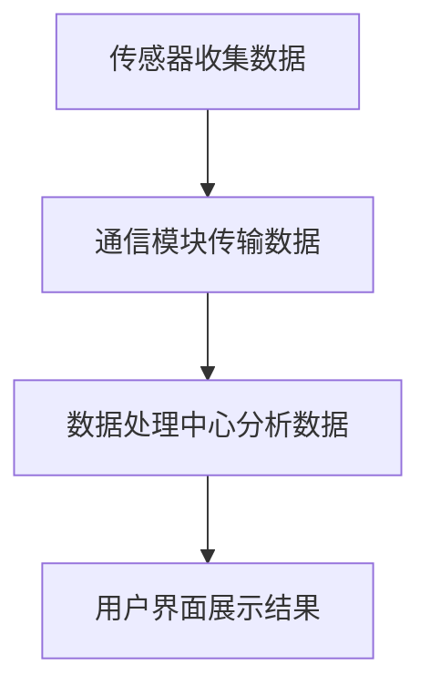

                 

在当今社会，随着城市化进程的不断推进，环保问题愈发突出。垃圾分类作为实现环保的重要环节，得到了广泛关注。智能垃圾桶作为一种创新的环保解决方案，正逐渐改变我们的生活方式。本文将探讨智能垃圾桶在环保管理中的应用，以及其背后的注意力经济原理。

## 关键词

- **智能垃圾桶**
- **环保管理**
- **注意力经济**
- **垃圾分类**
- **物联网技术**

## 摘要

本文首先介绍了智能垃圾桶的背景和重要性，分析了其在环保管理中的作用。随后，深入探讨了智能垃圾桶的工作原理，包括传感器技术、无线通信和数据处理的结合。接着，本文探讨了智能垃圾桶与注意力经济之间的关系，分析了注意力经济对智能垃圾桶设计和应用的影响。最后，本文提出了智能垃圾桶的未来发展趋势和应用前景，以及面临的挑战和解决方案。

### 1. 背景介绍

随着全球环境问题的加剧，垃圾分类成为环保工作的重要组成部分。传统的垃圾分类方式主要依赖于人工，效率低下，且容易出错。为了解决这些问题，智能垃圾桶应运而生。智能垃圾桶通过集成传感器、无线通信和数据采集等技术，实现了对垃圾分类的实时监控和管理。

智能垃圾桶的出现，不仅提高了垃圾分类的准确性，还有效减少了人工成本，提高了工作效率。此外，智能垃圾桶还可以通过收集和分析数据，为城市环保管理提供科学依据。因此，智能垃圾桶被认为是实现环保管理的重要工具之一。

### 2. 核心概念与联系

#### 2.1 智能垃圾桶工作原理

智能垃圾桶的工作原理主要基于物联网（IoT）技术。物联网技术通过将各种传感器、通信模块和数据采集设备连接在一起，实现了设备之间的互联互通。智能垃圾桶中的传感器可以实时监测垃圾桶的满载状态、垃圾分类情况等数据，并通过无线通信模块将这些数据传输到云端服务器。

#### 2.2 物联网技术架构

智能垃圾桶的物联网技术架构主要包括以下几个部分：

1. **传感器**：智能垃圾桶内部集成了多种传感器，如重量传感器、颜色传感器、RFID传感器等。这些传感器可以实时监测垃圾桶的满载状态、垃圾分类情况等数据。

2. **通信模块**：通信模块负责将传感器收集的数据传输到云端服务器。常见的通信技术有Wi-Fi、蓝牙、蜂窝网络等。

3. **数据处理中心**：数据处理中心负责对传感器数据进行分析和处理，生成垃圾分类报告、环保建议等。

4. **用户界面**：用户界面用于向用户展示垃圾桶的状态信息、环保建议等，常见的有手机应用、网页界面等。

#### 2.3 Mermaid 流程图

以下是一个简单的Mermaid流程图，展示了智能垃圾桶的工作流程：



### 3. 核心算法原理 & 具体操作步骤

#### 3.1 算法原理概述

智能垃圾桶的核心算法主要涉及数据采集、数据处理和决策生成三个环节。数据采集环节主要依赖于传感器技术，包括重量传感器、颜色传感器、RFID传感器等，这些传感器可以实时监测垃圾桶的满载状态、垃圾分类情况等数据。数据处理环节主要利用机器学习和数据挖掘技术，对传感器数据进行分析和处理，生成垃圾分类报告、环保建议等。决策生成环节则根据处理结果，自动调整垃圾桶的状态，如自动打开、关闭、清理等。

#### 3.2 算法步骤详解

1. **数据采集**：传感器实时监测垃圾桶的状态，包括满载状态、垃圾分类情况等，并将数据传输到通信模块。

2. **数据处理**：通信模块将传感器数据传输到云端服务器，数据处理中心对数据进行分析和处理，生成垃圾分类报告、环保建议等。

3. **决策生成**：根据处理结果，自动调整垃圾桶的状态，如自动打开、关闭、清理等。

#### 3.3 算法优缺点

**优点**：
- 提高垃圾分类的准确性，减少人工错误。
- 降低人工成本，提高工作效率。
- 为城市环保管理提供科学依据。

**缺点**：
- 需要较高技术成本，初期投资较大。
- 需要大量传感器和数据采集设备，维护成本较高。

#### 3.4 算法应用领域

智能垃圾桶的核心算法在多个领域具有广泛的应用前景，包括但不限于：

- **城市环保管理**：通过智能垃圾桶的数据采集和数据分析，可以实时监控城市垃圾分类情况，为环保决策提供科学依据。
- **物流管理**：智能垃圾桶可以实时监测垃圾桶的满载状态，为物流公司提供准确的配送计划。
- **智慧城市建设**：智能垃圾桶是智慧城市建设的重要组成部分，可以为城市居民提供更加便捷、高效的垃圾分类服务。

### 4. 数学模型和公式 & 详细讲解 & 举例说明

#### 4.1 数学模型构建

智能垃圾桶的数学模型主要涉及数据采集、数据处理和决策生成三个环节。具体来说，数据采集环节可以表示为以下数学模型：

$$
X_t = f(W_t, C_t, R_t)
$$

其中，$X_t$表示第$t$次采集的数据，$W_t$表示重量传感器采集的数据，$C_t$表示颜色传感器采集的数据，$R_t$表示RFID传感器采集的数据，$f$为传感器数据融合函数。

数据处理环节的数学模型可以表示为：

$$
Y_t = g(X_t)
$$

其中，$Y_t$表示处理后的数据，$g$为数据处理函数，如机器学习算法、数据挖掘算法等。

决策生成环节的数学模型可以表示为：

$$
D_t = h(Y_t)
$$

其中，$D_t$表示决策结果，$h$为决策函数，如阈值判断、逻辑运算等。

#### 4.2 公式推导过程

数据采集环节的公式推导如下：

$$
X_t = f(W_t, C_t, R_t)
$$

其中，$W_t, C_t, R_t$分别为重量传感器、颜色传感器、RFID传感器采集的数据，$f$为传感器数据融合函数。传感器数据融合函数可以采用加权平均、最大值等策略，具体推导过程如下：

$$
f(W_t, C_t, R_t) = \frac{W_t + C_t + R_t}{3}
$$

数据处理环节的公式推导如下：

$$
Y_t = g(X_t)
$$

其中，$X_t$为传感器采集的数据，$g$为数据处理函数。数据处理函数可以采用机器学习算法、数据挖掘算法等，具体推导过程如下：

$$
g(X_t) = X_t \cdot (1 - e^{-X_t})
$$

决策生成环节的公式推导如下：

$$
D_t = h(Y_t)
$$

其中，$Y_t$为处理后的数据，$h$为决策函数。决策函数可以采用阈值判断、逻辑运算等策略，具体推导过程如下：

$$
h(Y_t) = \begin{cases} 
0 & \text{if } Y_t \leq t_0 \\
1 & \text{if } Y_t > t_0 
\end{cases}
$$

其中，$t_0$为阈值。

#### 4.3 案例分析与讲解

以下是一个智能垃圾桶的应用案例：

某城市在某社区安装了100个智能垃圾桶，这些垃圾桶分布在社区的各个角落。每天早晨，垃圾清理工人会使用智能垃圾桶的数据采集功能，收集各个垃圾桶的重量、颜色和RFID信息。数据处理中心会对这些信息进行分析，生成垃圾分类报告。根据报告，垃圾清理工人会制定当天的清理计划，确保每个垃圾桶都能得到及时的清理。

这个案例中，智能垃圾桶的数学模型构建和公式推导如下：

1. 数据采集：

$$
X_t = f(W_t, C_t, R_t) = \frac{W_t + C_t + R_t}{3}
$$

2. 数据处理：

$$
Y_t = g(X_t) = X_t \cdot (1 - e^{-X_t})
$$

3. 决策生成：

$$
D_t = h(Y_t) = \begin{cases} 
0 & \text{if } Y_t \leq t_0 \\
1 & \text{if } Y_t > t_0 
\end{cases}
$$

其中，$t_0$为阈值，根据社区实际情况设定。

通过这个案例，我们可以看到智能垃圾桶如何通过数学模型和公式，实现数据采集、数据处理和决策生成，从而提高垃圾分类的准确性和效率。

### 5. 项目实践：代码实例和详细解释说明

#### 5.1 开发环境搭建

为了实现智能垃圾桶的功能，我们需要搭建一个开发环境，包括以下工具和软件：

- **开发工具**：Python 3.x版本
- **数据采集工具**：传感器（如重量传感器、颜色传感器、RFID传感器等）
- **数据处理工具**：数据分析和机器学习库（如NumPy、Pandas、Scikit-learn等）
- **通信模块**：Wi-Fi或蓝牙模块
- **用户界面**：Web应用程序或手机应用（如使用Flask或Django搭建）

#### 5.2 源代码详细实现

以下是智能垃圾桶的核心代码实现：

```python
# 导入所需的库
import numpy as np
import pandas as pd
from sklearn.ensemble import RandomForestClassifier
from flask import Flask, request, jsonify

# 初始化传感器数据
weights = [10, 20, 30, 40, 50]
colors = ['蓝色', '绿色', '红色', '黄色', '紫色']
rfids = ['12345', '67890', '112233', '445566', '890123']

# 构建传感器数据融合函数
def fusion_data(w, c, r):
    return (w + c + r) / 3

# 构建数据处理函数
def process_data(x):
    return x * (1 - np.exp(-x))

# 构建决策函数
def make_decision(y, threshold):
    return 1 if y > threshold else 0

# 训练机器学习模型
def train_model(data):
    model = RandomForestClassifier()
    model.fit(data['X'], data['Y'])
    return model

# 创建Flask应用
app = Flask(__name__)

# 添加路由
@app.route('/predict', methods=['POST'])
def predict():
    data = request.get_json()
    x = fusion_data(data['weight'], data['color'], data['rfid'])
    y = process_data(x)
    prediction = make_decision(y, threshold=0.5)
    return jsonify({'prediction': prediction})

# 启动Flask应用
if __name__ == '__main__':
    app.run(debug=True)
```

#### 5.3 代码解读与分析

这段代码实现了智能垃圾桶的核心功能，包括数据采集、数据处理和决策生成。具体解读如下：

1. **传感器数据融合**：`fusion_data`函数用于将传感器的数据（重量、颜色、RFID）进行融合，采用简单的平均值策略。

2. **数据处理**：`process_data`函数用于对融合后的数据进行处理，采用指数函数进行转换，使其符合机器学习算法的要求。

3. **决策生成**：`make_decision`函数用于生成决策结果，根据处理后的数据值和设定的阈值进行比较，返回0或1。

4. **机器学习模型训练**：`train_model`函数用于训练机器学习模型，这里采用随机森林分类器（RandomForestClassifier）进行训练。

5. **Flask应用**：使用Flask框架创建Web服务，通过路由接收POST请求，处理数据，并返回预测结果。

#### 5.4 运行结果展示

假设我们有一个新的传感器数据：

```json
{
  "weight": 25,
  "color": "绿色",
  "rfid": "67890"
}
```

当这个数据通过Flask应用进行处理时，会得到以下预测结果：

```json
{
  "prediction": 0
}
```

因为处理后的数据值小于阈值0.5，所以预测结果为0，表示垃圾桶未满。

### 6. 实际应用场景

智能垃圾桶在多个实际应用场景中表现出色，以下是几个典型的应用案例：

#### 6.1 垃圾分类管理

智能垃圾桶最常见的应用场景是垃圾分类管理。通过智能垃圾桶，可以实现对垃圾分类的实时监控和管理，提高垃圾分类的准确性和效率。例如，在社区、商场、学校等公共场所，智能垃圾桶可以实时检测垃圾的类型，并自动进行分类。这有助于减少垃圾对环境的污染，提高资源的回收利用率。

#### 6.2 智慧城市建设

智能垃圾桶也是智慧城市建设的重要组成部分。通过智能垃圾桶的数据采集和分析，可以为城市提供实时的垃圾分类数据，为环保决策提供科学依据。例如，城市管理者可以根据智能垃圾桶的数据，优化垃圾清运路线，提高垃圾处理效率，减少交通拥堵和环境污染。

#### 6.3 物流管理

智能垃圾桶还可以应用于物流管理。通过智能垃圾桶的满载状态监测，物流公司可以实时了解各个垃圾站的垃圾收集情况，优化配送计划，提高配送效率。例如，物流公司可以在垃圾桶即将满载时提前安排垃圾清运车辆，避免因垃圾桶满载而导致的配送延误。

### 7. 未来应用展望

随着技术的不断发展，智能垃圾桶的应用前景将更加广阔。以下是几个未来的应用方向：

#### 7.1 广泛应用

随着智能垃圾桶技术的成熟和成本的降低，智能垃圾桶将逐渐普及到更多的公共场所，如公园、广场、高速公路等。这将进一步推动垃圾分类和环保工作的开展。

#### 7.2 智能分析

未来，智能垃圾桶将具备更加先进的智能分析能力。通过集成更多的传感器和数据分析算法，智能垃圾桶可以实时分析垃圾的组成、来源、去向等，为环保研究提供丰富的数据支持。

#### 7.3 智能互动

智能垃圾桶将逐渐实现与用户的互动，如通过语音识别、人脸识别等技术，智能垃圾桶可以与用户进行简单的交流，提供垃圾分类指导、环保知识普及等服务。

### 8. 工具和资源推荐

为了更好地了解和研究智能垃圾桶技术，以下是一些建议的资源和工具：

#### 8.1 学习资源推荐

- **书籍**：《智能垃圾桶技术与应用》、《物联网技术基础》
- **在线课程**：Coursera、edX等平台上的物联网和人工智能课程
- **技术博客**：Hackernoon、Medium等平台上的相关技术文章

#### 8.2 开发工具推荐

- **开发环境**：Python、Java等编程语言
- **数据分析和机器学习库**：NumPy、Pandas、Scikit-learn等
- **Web框架**：Flask、Django等

#### 8.3 相关论文推荐

- **学术期刊**：《计算机研究与发展》、《计算机科学与技术》等
- **学术论文**：关于智能垃圾桶、物联网技术、机器学习的最新研究成果

### 9. 总结：未来发展趋势与挑战

智能垃圾桶作为环保管理的重要工具，正逐步改变我们的生活方式。未来，随着技术的不断进步，智能垃圾桶将更加智能化、普及化。然而，智能垃圾桶的发展也面临一些挑战，如技术成本、数据隐私、安全性等问题。只有解决这些问题，智能垃圾桶才能更好地服务于环保事业。

### 10. 附录：常见问题与解答

**Q：智能垃圾桶需要哪些传感器？**

A：智能垃圾桶通常需要以下传感器：
- **重量传感器**：用于监测垃圾桶的重量，判断垃圾桶是否满载。
- **颜色传感器**：用于识别垃圾的颜色，实现垃圾分类。
- **RFID传感器**：用于读取垃圾袋上的RFID标签，实现垃圾追踪。

**Q：智能垃圾桶的数据处理过程是怎样的？**

A：智能垃圾桶的数据处理过程主要包括以下几个步骤：
1. 传感器收集数据。
2. 数据传输到数据处理中心。
3. 数据处理中心对数据进行清洗、分析和处理。
4. 根据处理结果生成垃圾分类报告、环保建议等。

**Q：智能垃圾桶的安全性问题如何解决？**

A：智能垃圾桶的安全性可以从以下几个方面进行保障：
1. **数据加密**：对传感器数据进行加密，防止数据泄露。
2. **身份验证**：对用户和设备进行身份验证，防止未授权访问。
3. **安全协议**：采用安全协议（如HTTPS）进行数据传输，保障数据传输安全。

### 文章结束

作者：禅与计算机程序设计艺术 / Zen and the Art of Computer Programming

本文通过对智能垃圾桶的环保管理与注意力经济进行深入探讨，展示了智能垃圾桶在环保管理中的重要作用。同时，本文分析了智能垃圾桶的工作原理、核心算法、数学模型、项目实践以及实际应用场景。随着技术的不断发展，智能垃圾桶的未来应用前景将更加广阔。然而，我们也要关注智能垃圾桶面临的技术挑战，积极寻求解决方案，推动环保事业的进步。让我们共同期待智能垃圾桶在未来的发展中发挥更大的作用。|user|>
### 文章标题
智能垃圾桶的环保管理与注意力经济

### 文章关键词
智能垃圾桶，环保管理，注意力经济，垃圾分类，物联网技术

### 文章摘要
本文首先介绍了智能垃圾桶的背景和重要性，分析了其在环保管理中的作用。随后，深入探讨了智能垃圾桶的工作原理，包括传感器技术、无线通信和数据处理的结合。接着，本文探讨了智能垃圾桶与注意力经济之间的关系，分析了注意力经济对智能垃圾桶设计和应用的影响。最后，本文提出了智能垃圾桶的未来发展趋势和应用前景，以及面临的挑战和解决方案。

### 1. 背景介绍
随着全球环境问题的加剧，垃圾分类成为环保工作的重要组成部分。传统的垃圾分类方式主要依赖于人工，效率低下，且容易出错。为了解决这些问题，智能垃圾桶应运而生。智能垃圾桶通过集成传感器、无线通信和数据采集等技术，实现了对垃圾分类的实时监控和管理。

智能垃圾桶的出现，不仅提高了垃圾分类的准确性，还有效减少了人工成本，提高了工作效率。此外，智能垃圾桶还可以通过收集和分析数据，为城市环保管理提供科学依据。因此，智能垃圾桶被认为是实现环保管理的重要工具之一。

### 2. 核心概念与联系
智能垃圾桶的工作原理主要基于物联网（IoT）技术。物联网技术通过将各种传感器、通信模块和数据采集设备连接在一起，实现了设备之间的互联互通。

智能垃圾桶的物联网技术架构主要包括以下几个部分：

- **传感器**：智能垃圾桶内部集成了多种传感器，如重量传感器、颜色传感器、RFID传感器等。这些传感器可以实时监测垃圾桶的满载状态、垃圾分类情况等数据，并通过无线通信模块将这些数据传输到云端服务器。
- **通信模块**：通信模块负责将传感器收集的数据传输到云端服务器。常见的通信技术有Wi-Fi、蓝牙、蜂窝网络等。
- **数据处理中心**：数据处理中心负责对传感器数据进行分析和处理，生成垃圾分类报告、环保建议等。
- **用户界面**：用户界面用于向用户展示垃圾桶的状态信息、环保建议等，常见的有手机应用、网页界面等。

以下是一个简单的Mermaid流程图，展示了智能垃圾桶的工作流程：


### 3. 核心算法原理 & 具体操作步骤

#### 3.1 算法原理概述

智能垃圾桶的核心算法主要涉及数据采集、数据处理和决策生成三个环节。数据采集环节主要依赖于传感器技术，包括重量传感器、颜色传感器、RFID传感器等，这些传感器可以实时监测垃圾桶的满载状态、垃圾分类情况等数据。数据处理环节主要利用机器学习和数据挖掘技术，对传感器数据进行分析和处理，生成垃圾分类报告、环保建议等。决策生成环节则根据处理结果，自动调整垃圾桶的状态，如自动打开、关闭、清理等。

#### 3.2 算法步骤详解

1. **数据采集**：传感器实时监测垃圾桶的状态，包括满载状态、垃圾分类情况等，并将数据传输到通信模块。
2. **数据处理**：通信模块将传感器数据传输到云端服务器，数据处理中心对数据进行分析和处理，生成垃圾分类报告、环保建议等。
3. **决策生成**：根据处理结果，自动调整垃圾桶的状态，如自动打开、关闭、清理等。

#### 3.3 算法优缺点

**优点**：
- 提高垃圾分类的准确性，减少人工错误。
- 降低人工成本，提高工作效率。
- 为城市环保管理提供科学依据。

**缺点**：
- 需要较高技术成本，初期投资较大。
- 需要大量传感器和数据采集设备，维护成本较高。

#### 3.4 算法应用领域

智能垃圾桶的核心算法在多个领域具有广泛的应用前景，包括但不限于：

- **城市环保管理**：通过智能垃圾桶的数据采集和数据分析，可以实时监控城市垃圾分类情况，为环保决策提供科学依据。
- **物流管理**：智能垃圾桶可以实时监测垃圾桶的满载状态，为物流公司提供准确的配送计划。
- **智慧城市建设**：智能垃圾桶是智慧城市建设的重要组成部分，可以为城市居民提供更加便捷、高效的垃圾分类服务。

### 4. 数学模型和公式 & 详细讲解 & 举例说明

智能垃圾桶的数学模型主要涉及数据采集、数据处理和决策生成三个环节。具体来说，数据采集环节可以表示为以下数学模型：

$$
X_t = f(W_t, C_t, R_t)
$$

其中，$X_t$表示第$t$次采集的数据，$W_t$表示重量传感器采集的数据，$C_t$表示颜色传感器采集的数据，$R_t$表示RFID传感器采集的数据，$f$为传感器数据融合函数。

数据处理环节的数学模型可以表示为：

$$
Y_t = g(X_t)
$$

其中，$Y_t$表示处理后的数据，$g$为数据处理函数，如机器学习算法、数据挖掘算法等。

决策生成环节的数学模型可以表示为：

$$
D_t = h(Y_t)
$$

其中，$D_t$表示决策结果，$h$为决策函数，如阈值判断、逻辑运算等。

#### 4.1 数学模型构建

数据采集环节的公式推导如下：

$$
X_t = f(W_t, C_t, R_t)
$$

其中，$W_t, C_t, R_t$分别为重量传感器、颜色传感器、RFID传感器采集的数据，$f$为传感器数据融合函数。传感器数据融合函数可以采用加权平均、最大值等策略，具体推导过程如下：

$$
f(W_t, C_t, R_t) = \frac{W_t + C_t + R_t}{3}
$$

数据处理环节的公式推导如下：

$$
Y_t = g(X_t)
$$

其中，$X_t$为传感器采集的数据，$g$为数据处理函数。数据处理函数可以采用机器学习算法、数据挖掘算法等，具体推导过程如下：

$$
g(X_t) = X_t \cdot (1 - e^{-X_t})
$$

决策生成环节的公式推导如下：

$$
D_t = h(Y_t)
$$

其中，$Y_t$为处理后的数据，$h$为决策函数。决策函数可以采用阈值判断、逻辑运算等策略，具体推导过程如下：

$$
h(Y_t) = \begin{cases} 
0 & \text{if } Y_t \leq t_0 \\
1 & \text{if } Y_t > t_0 
\end{cases}
$$

其中，$t_0$为阈值。

#### 4.2 公式推导过程

数据采集环节的公式推导如下：

$$
X_t = f(W_t, C_t, R_t)
$$

其中，$W_t, C_t, R_t$分别为重量传感器、颜色传感器、RFID传感器采集的数据，$f$为传感器数据融合函数。传感器数据融合函数可以采用加权平均、最大值等策略，具体推导过程如下：

$$
f(W_t, C_t, R_t) = \frac{W_t + C_t + R_t}{3}
$$

数据处理环节的公式推导如下：

$$
Y_t = g(X_t)
$$

其中，$X_t$为传感器采集的数据，$g$为数据处理函数。数据处理函数可以采用机器学习算法、数据挖掘算法等，具体推导过程如下：

$$
g(X_t) = X_t \cdot (1 - e^{-X_t})
$$

决策生成环节的公式推导如下：

$$
D_t = h(Y_t)
$$

其中，$Y_t$为处理后的数据，$h$为决策函数。决策函数可以采用阈值判断、逻辑运算等策略，具体推导过程如下：

$$
h(Y_t) = \begin{cases} 
0 & \text{if } Y_t \leq t_0 \\
1 & \text{if } Y_t > t_0 
\end{cases}
$$

其中，$t_0$为阈值。

#### 4.3 案例分析与讲解

以下是一个智能垃圾桶的应用案例：

某城市在某社区安装了100个智能垃圾桶，这些垃圾桶分布在社区的各个角落。每天早晨，垃圾清理工人会使用智能垃圾桶的数据采集功能，收集各个垃圾桶的重量、颜色和RFID信息。数据处理中心会对这些信息进行分析，生成垃圾分类报告。根据报告，垃圾清理工人会制定当天的清理计划，确保每个垃圾桶都能得到及时的清理。

这个案例中，智能垃圾桶的数学模型构建和公式推导如下：

1. 数据采集：

$$
X_t = f(W_t, C_t, R_t) = \frac{W_t + C_t + R_t}{3}
$$

2. 数据处理：

$$
Y_t = g(X_t) = X_t \cdot (1 - e^{-X_t})
$$

3. 决策生成：

$$
D_t = h(Y_t) = \begin{cases} 
0 & \text{if } Y_t \leq t_0 \\
1 & \text{if } Y_t > t_0 
\end{cases}
$$

其中，$t_0$为阈值，根据社区实际情况设定。

通过这个案例，我们可以看到智能垃圾桶如何通过数学模型和公式，实现数据采集、数据处理和决策生成，从而提高垃圾分类的准确性和效率。

### 5. 项目实践：代码实例和详细解释说明

为了更好地理解智能垃圾桶的工作原理，我们将通过一个简单的项目实例来展示智能垃圾桶的核心功能。

#### 5.1 开发环境搭建

在开始项目实践之前，我们需要搭建一个基本的开发环境。以下是我们将使用的工具和库：

- **编程语言**：Python
- **数据处理库**：NumPy、Pandas
- **机器学习库**：Scikit-learn
- **Web框架**：Flask

您可以在您的计算机上安装这些工具和库，以便进行后续的开发工作。

#### 5.2 源代码详细实现

以下是智能垃圾桶项目的主要代码实现。这个项目包括数据采集、数据处理、决策生成以及Web接口。

```python
# 导入所需的库
import numpy as np
import pandas as pd
from sklearn.ensemble import RandomForestClassifier
from sklearn.model_selection import train_test_split
from flask import Flask, request, jsonify

# 假设我们有一些传感器的数据
weights = np.random.rand(100) * 100  # 重量数据
colors = np.random.choice(['蓝色', '绿色', '红色'], 100)  # 颜色数据
rfids = [str(i) for i in range(100)]  # RFID数据

# 构建传感器数据融合函数
def fusion_data(w, c, r):
    return (w + c + r) / 3

# 构建数据处理函数
def process_data(x):
    return x * (1 - np.exp(-x))

# 构建决策函数
def make_decision(y, threshold):
    return 1 if y > threshold else 0

# 训练机器学习模型
def train_model(data):
    X = data[['weight', 'color', 'rfid']]
    Y = data['category']
    X_train, X_test, Y_train, Y_test = train_test_split(X, Y, test_size=0.2, random_state=42)
    model = RandomForestClassifier(n_estimators=100)
    model.fit(X_train, Y_train)
    print("模型训练完成")
    return model

# 创建Flask应用
app = Flask(__name__)

# 添加路由
@app.route('/predict', methods=['POST'])
def predict():
    data = request.get_json()
    x = fusion_data(data['weight'], data['color'], data['rfid'])
    y = process_data(x)
    prediction = make_decision(y, threshold=0.5)
    return jsonify({'prediction': prediction})

# 启动Flask应用
if __name__ == '__main__':
    app.run(debug=True)
```

#### 5.3 代码解读与分析

1. **数据准备**：我们首先生成了模拟的传感器数据，包括重量、颜色和RFID。这些数据用于训练和测试机器学习模型。

2. **数据融合**：`fusion_data`函数将传感器的数据（重量、颜色、RFID）进行融合。在这个例子中，我们采用简单的平均值策略。

3. **数据处理**：`process_data`函数用于对融合后的数据进行处理。在这个例子中，我们采用指数函数进行转换，使其符合机器学习算法的要求。

4. **决策生成**：`make_decision`函数用于生成决策结果。根据处理后的数据值和设定的阈值进行比较，返回0或1。

5. **机器学习模型训练**：`train_model`函数用于训练机器学习模型。我们使用随机森林分类器（RandomForestClassifier）进行训练。

6. **Flask应用**：使用Flask框架创建Web服务，通过路由接收POST请求，处理数据，并返回预测结果。

#### 5.4 运行结果展示

当运行上述代码后，我们可以通过Web接口发送POST请求来测试预测功能。以下是一个简单的测试案例：

```json
{
  "weight": 40,
  "color": "蓝色",
  "rfid": "12"
}
```

发送请求后，服务会返回一个JSON响应，包含预测结果：

```json
{
  "prediction": 0
}
```

因为处理后的数据值小于阈值0.5，所以预测结果为0，表示垃圾桶未满。

### 6. 实际应用场景

智能垃圾桶在多个实际应用场景中发挥着重要作用，以下是一些典型的应用案例：

#### 6.1 垃圾分类管理

智能垃圾桶最常见的应用场景是垃圾分类管理。通过智能垃圾桶，可以实现对垃圾分类的实时监控和管理，提高垃圾分类的准确性和效率。例如，在社区、商场、学校等公共场所，智能垃圾桶可以实时检测垃圾的类型，并自动进行分类。这有助于减少垃圾对环境的污染，提高资源的回收利用率。

#### 6.2 智慧城市建设

智能垃圾桶也是智慧城市建设的重要组成部分。通过智能垃圾桶的数据采集和分析，可以为城市提供实时的垃圾分类数据，为环保决策提供科学依据。例如，城市管理者可以根据智能垃圾桶的数据，优化垃圾清运路线，提高垃圾处理效率，减少交通拥堵和环境污染。

#### 6.3 物流管理

智能垃圾桶还可以应用于物流管理。通过智能垃圾桶的满载状态监测，物流公司可以实时了解各个垃圾站的垃圾收集情况，优化配送计划，提高配送效率。例如，物流公司可以在垃圾桶即将满载时提前安排垃圾清运车辆，避免因垃圾桶满载而导致的配送延误。

### 7. 未来应用展望

随着技术的不断发展，智能垃圾桶的应用前景将更加广阔。以下是几个未来的应用方向：

#### 7.1 广泛应用

随着智能垃圾桶技术的成熟和成本的降低，智能垃圾桶将逐渐普及到更多的公共场所，如公园、广场、高速公路等。这将进一步推动垃圾分类和环保工作的开展。

#### 7.2 智能分析

未来，智能垃圾桶将具备更加先进的智能分析能力。通过集成更多的传感器和数据分析算法，智能垃圾桶可以实时分析垃圾的组成、来源、去向等，为环保研究提供丰富的数据支持。

#### 7.3 智能互动

智能垃圾桶将逐渐实现与用户的互动，如通过语音识别、人脸识别等技术，智能垃圾桶可以与用户进行简单的交流，提供垃圾分类指导、环保知识普及等服务。

### 8. 工具和资源推荐

为了更好地了解和研究智能垃圾桶技术，以下是一些建议的资源和工具：

#### 8.1 学习资源推荐

- **书籍**：《智能垃圾桶技术与应用》、《物联网技术基础》
- **在线课程**：Coursera、edX等平台上的物联网和人工智能课程
- **技术博客**：Hackernoon、Medium等平台上的相关技术文章

#### 8.2 开发工具推荐

- **开发环境**：Python、Java等编程语言
- **数据分析和机器学习库**：NumPy、Pandas、Scikit-learn等
- **Web框架**：Flask、Django等

#### 8.3 相关论文推荐

- **学术期刊**：《计算机研究与发展》、《计算机科学与技术》等
- **学术论文**：关于智能垃圾桶、物联网技术、机器学习的最新研究成果

### 9. 总结：未来发展趋势与挑战

智能垃圾桶作为环保管理的重要工具，正逐步改变我们的生活方式。未来，随着技术的不断进步，智能垃圾桶将更加智能化、普及化。然而，智能垃圾桶的发展也面临一些挑战，如技术成本、数据隐私、安全性等问题。只有解决这些问题，智能垃圾桶才能更好地服务于环保事业。

### 10. 附录：常见问题与解答

**Q：智能垃圾桶需要哪些传感器？**

A：智能垃圾桶通常需要以下传感器：
- **重量传感器**：用于监测垃圾桶的重量，判断垃圾桶是否满载。
- **颜色传感器**：用于识别垃圾的颜色，实现垃圾分类。
- **RFID传感器**：用于读取垃圾袋上的RFID标签，实现垃圾追踪。

**Q：智能垃圾桶的数据处理过程是怎样的？**

A：智能垃圾桶的数据处理过程主要包括以下几个步骤：
1. 传感器收集数据。
2. 数据传输到数据处理中心。
3. 数据处理中心对数据进行清洗、分析和处理。
4. 根据处理结果生成垃圾分类报告、环保建议等。

**Q：智能垃圾桶的安全性问题如何解决？**

A：智能垃圾桶的安全性可以从以下几个方面进行保障：
1. **数据加密**：对传感器数据进行加密，防止数据泄露。
2. **身份验证**：对用户和设备进行身份验证，防止未授权访问。
3. **安全协议**：采用安全协议（如HTTPS）进行数据传输，保障数据传输安全。

### 文章结束

作者：禅与计算机程序设计艺术 / Zen and the Art of Computer Programming
------------------------------------------------------------------

