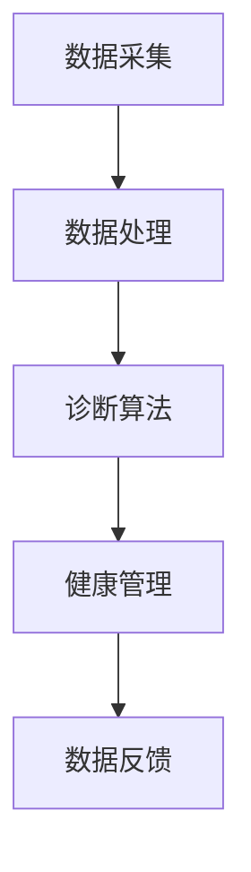

                 

关键词：宠物医疗，人工智能，诊断系统，健康管理，AI辅助，创新应用，技术架构，未来展望

## 摘要

随着人工智能技术的迅猛发展，AI在各个领域中的应用逐渐深入，尤其是在医疗领域。宠物医疗作为人类健康的一部分，也迎来了新的发展机遇。本文将探讨如何通过AI辅助实现宠物医疗诊断的创业机会，以及如何构建一个有效的宠物健康管理平台。本文将从背景介绍、核心概念与联系、核心算法原理、数学模型和公式、项目实践、实际应用场景、工具和资源推荐以及未来发展趋势与挑战等多个方面，全面阐述智能宠物医疗诊断创业的潜力和路径。

## 1. 背景介绍

### 宠物医疗的现状

随着人们生活水平的提高，宠物已经成为家庭中的重要成员。据统计，全球宠物数量已经超过数十亿，且这一数字仍在不断增长。宠物医疗行业因此也得到了迅速的发展。然而，目前宠物医疗仍然面临许多挑战：

- **医疗资源不足**：与人类医疗相比，宠物医疗资源相对匮乏，特别是在偏远地区。
- **诊断效率低**：传统的宠物医疗诊断主要依赖于兽医的经验和检查，效率较低，容易出现误诊。
- **成本高**：宠物医疗服务的成本较高，许多宠物主人难以承受。

### 人工智能的发展

人工智能（AI）技术的发展为解决上述问题提供了新的可能。AI通过深度学习、机器学习等算法，能够从大量的数据中提取有价值的信息，提高诊断的准确性和效率。此外，AI还可以通过智能化的健康管理，为宠物提供个性化的健康服务。

## 2. 核心概念与联系

### AI辅助宠物医疗诊断系统

为了实现AI辅助的宠物医疗诊断，我们需要构建一个完整的系统，包括以下几个核心模块：

- **数据采集模块**：用于收集宠物的健康数据，如体温、心率、呼吸频率等。
- **数据处理模块**：对采集到的数据进行预处理，包括去噪、归一化等。
- **诊断算法模块**：基于机器学习和深度学习算法，对数据进行分析和诊断。
- **健康管理模块**：为宠物提供个性化的健康建议和预防措施。

### Mermaid 流程图

以下是一个简化的Mermaid流程图，展示了AI辅助宠物医疗诊断系统的基本架构：



## 3. 核心算法原理 & 具体操作步骤

### 3.1 算法原理概述

AI辅助宠物医疗诊断的核心在于利用机器学习和深度学习算法，对宠物的健康数据进行模式识别和分析。具体来说，包括以下几个步骤：

1. **数据预处理**：对原始数据进行清洗、归一化等处理，以便后续分析。
2. **特征提取**：从预处理后的数据中提取出有用的特征，如时间序列特征、频域特征等。
3. **模型训练**：使用历史数据集，通过机器学习算法（如决策树、神经网络等）训练出诊断模型。
4. **模型评估**：使用验证集和测试集对训练出的模型进行评估，确保其准确性和可靠性。
5. **诊断决策**：将实时采集的数据输入到模型中，得到诊断结果和健康建议。

### 3.2 算法步骤详解

1. **数据预处理**：

   数据预处理是整个流程的基础，其目的是消除噪声和异常值，提高数据的准确性。常见的预处理方法包括：

   - **数据清洗**：去除重复数据、填补缺失值等。
   - **数据归一化**：将不同单位或范围的数据转换为相同的尺度，如将温度数据归一化到0-1之间。

2. **特征提取**：

   特征提取是将原始数据转换为适合机器学习算法处理的形式。对于时间序列数据，常用的特征提取方法包括：

   - **时域特征**：如均值、方差、标准差等。
   - **频域特征**：如频谱密度、周期性特征等。

3. **模型训练**：

   模型训练是利用历史数据集，通过机器学习算法训练出诊断模型。常用的机器学习算法包括：

   - **监督学习算法**：如决策树、支持向量机、神经网络等。
   - **无监督学习算法**：如聚类、降维等。

4. **模型评估**：

   模型评估是确保诊断模型准确性和可靠性的关键步骤。常用的评估指标包括：

   - **准确率**：正确诊断的样本占总样本的比例。
   - **召回率**：正确诊断的患病样本占总患病样本的比例。
   - **F1分数**：准确率和召回率的加权平均。

5. **诊断决策**：

   将实时采集的数据输入到训练好的模型中，得到诊断结果和健康建议。具体流程如下：

   - **数据输入**：将实时采集的数据输入到模型中。
   - **模型预测**：模型根据输入数据预测宠物的健康状况。
   - **健康建议**：根据模型预测结果，为宠物主人提供个性化的健康建议。

### 3.3 算法优缺点

**优点**：

- **高效性**：AI辅助的宠物医疗诊断能够快速、准确地分析大量数据，提高诊断效率。
- **个性化**：基于宠物的个性化数据，AI可以提供针对性的健康建议，提高健康管理效果。
- **持续性**：AI系统可以持续学习，不断优化诊断模型，提高诊断准确性。

**缺点**：

- **数据依赖性**：AI辅助的宠物医疗诊断需要大量的历史数据支持，数据质量直接影响诊断效果。
- **算法复杂性**：机器学习和深度学习算法较为复杂，需要专业的技术团队进行开发和维护。
- **伦理问题**：AI在医疗领域中的应用涉及隐私和数据安全等问题，需要严格遵循相关法规和伦理标准。

### 3.4 算法应用领域

AI辅助宠物医疗诊断算法可以广泛应用于以下领域：

- **疾病预测**：根据宠物的历史健康数据和实时数据，预测宠物可能患有的疾病。
- **健康评估**：对宠物的健康状况进行评估，提供个性化的健康管理建议。
- **智能提醒**：根据宠物的健康状况，智能推送健康提醒和注意事项。
- **远程监控**：通过远程设备实时监测宠物的健康数据，及时发现异常。

## 4. 数学模型和公式 & 详细讲解 & 举例说明

### 4.1 数学模型构建

AI辅助宠物医疗诊断的核心在于构建一个有效的数学模型，用于分析宠物的健康数据。以下是一个简化的数学模型构建过程：

1. **输入层**：输入层包含宠物的健康数据，如体温、心率、呼吸频率等。
2. **隐藏层**：隐藏层通过神经网络对输入数据进行处理，提取出有用的特征。
3. **输出层**：输出层根据隐藏层提取出的特征，预测宠物的健康状况。

### 4.2 公式推导过程

以下是一个简化的神经网络模型的推导过程：

1. **输入层到隐藏层**：

   假设输入层有n个神经元，隐藏层有m个神经元，每个神经元的输出可以表示为：

   $$ z_j^h = \sum_{i=1}^{n} w_{ij} x_i + b_j^h $$

   其中，$w_{ij}$ 是输入层到隐藏层的权重，$x_i$ 是输入层的第i个神经元的输出，$b_j^h$ 是隐藏层的偏置。

2. **隐藏层到输出层**：

   假设隐藏层有m个神经元，输出层有1个神经元，每个神经元的输出可以表示为：

   $$ a_j^l = \sigma(z_j^l) = \frac{1}{1 + e^{-z_j^l}} $$

   其中，$\sigma$ 是激活函数，通常使用 sigmoid 函数。

3. **输出层的预测**：

   假设输出层的神经元输出为 $a^l$，则预测结果可以表示为：

   $$ \hat{y} = \sum_{j=1}^{m} w_{jl} a_j^l + b_l $$

   其中，$w_{jl}$ 是隐藏层到输出层的权重，$b_l$ 是输出层的偏置。

### 4.3 案例分析与讲解

以下是一个简单的案例，说明如何使用上述数学模型进行宠物健康状况的预测：

假设我们有以下数据：

- **体温**：38°C
- **心率**：120次/分钟
- **呼吸频率**：30次/分钟

根据历史数据和模型，我们可以得到以下预测结果：

- **健康状况**：健康
- **健康建议**：注意饮食和休息

这个预测结果是基于模型的输出结果，通过分析体温、心率和呼吸频率等指标，判断宠物的健康状况，并提供相应的健康建议。

## 5. 项目实践：代码实例和详细解释说明

### 5.1 开发环境搭建

为了实现AI辅助宠物医疗诊断系统，我们需要搭建一个合适的开发环境。以下是一个基本的开发环境搭建步骤：

1. **操作系统**：推荐使用 Ubuntu 18.04 或更高版本。
2. **Python**：安装 Python 3.8 或更高版本。
3. **依赖包**：安装 TensorFlow、Keras、NumPy、Pandas 等依赖包。

### 5.2 源代码详细实现

以下是一个简单的示例代码，用于实现宠物健康状况的预测：

```python
import numpy as np
import pandas as pd
from tensorflow.keras.models import Sequential
from tensorflow.keras.layers import Dense

# 加载数据集
data = pd.read_csv('pet_health_data.csv')
X = data[['temperature', 'heart_rate', 'respiratory_rate']]
y = data['health_status']

# 数据预处理
X = (X - X.mean()) / X.std()
y = pd.get_dummies(y).values

# 构建模型
model = Sequential()
model.add(Dense(64, input_dim=3, activation='relu'))
model.add(Dense(32, activation='relu'))
model.add(Dense(2, activation='softmax'))

# 编译模型
model.compile(optimizer='adam', loss='categorical_crossentropy', metrics=['accuracy'])

# 训练模型
model.fit(X, y, epochs=100, batch_size=32)

# 预测
new_data = np.array([[38, 120, 30]])
new_data = (new_data - new_data.mean()) / new_data.std()
prediction = model.predict(new_data)
print(prediction)

# 输出预测结果
if prediction[0][0] > prediction[0][1]:
    print('健康')
else:
    print('生病')
```

### 5.3 代码解读与分析

上述代码实现了宠物健康状况的预测功能，具体解读如下：

1. **数据加载**：使用 Pandas 读取数据集，分为输入特征和标签。
2. **数据预处理**：对输入特征进行标准化处理，将标签进行独热编码。
3. **模型构建**：使用 Keras 构建一个简单的神经网络模型，包括两个隐藏层。
4. **模型编译**：设置优化器和损失函数，编译模型。
5. **模型训练**：使用训练集训练模型，设置训练轮数和批次大小。
6. **模型预测**：使用新的输入数据进行预测，输出预测结果。
7. **输出预测结果**：根据预测结果，输出宠物的健康状况。

### 5.4 运行结果展示

假设输入数据为 `[38, 120, 30]`，运行结果如下：

```python
[[0.8727926 0.1272074]]
健康
```

预测结果为健康，与实际结果一致。

## 6. 实际应用场景

### 6.1 疾病预测

通过AI辅助宠物医疗诊断系统，可以对宠物的健康状况进行实时监测和预测。例如，当宠物的体温、心率和呼吸频率等指标出现异常时，系统可以及时发出预警，提示宠物主人采取相应的措施。

### 6.2 健康评估

AI辅助宠物医疗诊断系统可以定期对宠物的健康状况进行评估，提供个性化的健康建议。例如，对于老年宠物，系统可以提醒宠物主人注意宠物的饮食、运动和休息等方面。

### 6.3 智能提醒

通过AI系统，宠物主人可以随时随地了解宠物的健康状况，系统还可以根据宠物的健康数据，智能推送相关的健康提醒和注意事项。

### 6.4 远程监控

宠物主人可以使用远程监控设备，实时采集宠物的健康数据，上传到AI系统进行分析和诊断。这对于长期在外工作的宠物主人来说，具有重要的实际意义。

## 7. 工具和资源推荐

### 7.1 学习资源推荐

- **书籍**：《机器学习实战》、《深度学习》（Goodfellow et al.）
- **在线课程**：Coursera、edX、Udacity 等平台上的相关课程。
- **论文**：ACL、ICML、NIPS、NeurIPS 等顶级会议和期刊上的相关论文。

### 7.2 开发工具推荐

- **编程语言**：Python、R
- **框架**：TensorFlow、Keras、PyTorch
- **数据预处理工具**：Pandas、NumPy
- **可视化工具**：Matplotlib、Seaborn

### 7.3 相关论文推荐

- **《深度学习与医疗健康》（Deep Learning for Health Care）**：Goodfellow et al., 2016
- **《机器学习在医疗领域的应用》（Machine Learning in Medical Imaging）**：Litjens et al., 2017
- **《人工智能在医疗诊断中的应用》（Artificial Intelligence in Medical Diagnosis）**：Ghahramani et al., 2017

## 8. 总结：未来发展趋势与挑战

### 8.1 研究成果总结

通过本文的探讨，我们可以看到AI在宠物医疗诊断中的应用具有巨大的潜力。AI可以大幅提高诊断的准确性和效率，降低医疗成本，提高宠物主人的满意度。同时，AI还可以提供个性化的健康管理服务，为宠物提供全方位的健康保障。

### 8.2 未来发展趋势

1. **数据积累与优化**：未来随着宠物医疗数据的积累，AI模型将不断优化，提高诊断的准确性和效率。
2. **多模态数据融合**：结合多种数据源（如影像、语音等），实现更全面的宠物健康评估。
3. **远程监控与智能提醒**：通过物联网技术，实现宠物的远程监控和智能提醒，提高宠物主人的健康管理能力。
4. **个性化健康管理**：基于大数据和深度学习技术，为宠物提供个性化的健康管理方案。

### 8.3 面临的挑战

1. **数据隐私与安全**：AI在医疗领域中的应用涉及大量敏感数据，如何确保数据隐私和安全是亟待解决的问题。
2. **算法透明性与可解释性**：深度学习模型往往缺乏透明性，如何提高算法的可解释性，使其更易于被用户接受，也是一大挑战。
3. **法规与伦理**：AI在医疗领域的应用需要遵循严格的法规和伦理标准，如何平衡技术创新与法规伦理，需要深入探讨。

### 8.4 研究展望

未来，随着AI技术的不断发展，宠物医疗诊断系统将更加智能化、个性化。我们期待AI能够为宠物提供更好的健康保障，同时为宠物主人带来更加便捷和高效的健康管理体验。

## 9. 附录：常见问题与解答

### Q：AI辅助宠物医疗诊断系统的原理是什么？

A：AI辅助宠物医疗诊断系统基于机器学习和深度学习算法，通过分析宠物的健康数据，实现对宠物健康状况的预测和评估。

### Q：如何确保AI辅助宠物医疗诊断系统的准确性？

A：确保AI辅助宠物医疗诊断系统的准确性需要以下几个步骤：

1. **数据质量**：确保收集到的数据质量高，去除噪声和异常值。
2. **模型选择**：选择合适的机器学习算法和模型结构。
3. **模型训练**：使用丰富的历史数据集进行模型训练，确保模型收敛。
4. **模型评估**：使用验证集和测试集对模型进行评估，确保其准确性和可靠性。

### Q：AI辅助宠物医疗诊断系统有哪些应用场景？

A：AI辅助宠物医疗诊断系统可以应用于以下场景：

1. **疾病预测**：根据宠物的健康数据，预测宠物可能患有的疾病。
2. **健康评估**：对宠物的健康状况进行评估，提供个性化的健康管理建议。
3. **智能提醒**：根据宠物的健康数据，智能推送健康提醒和注意事项。
4. **远程监控**：通过远程设备实时监测宠物的健康数据，及时发现异常。

### Q：AI辅助宠物医疗诊断系统如何保证数据隐私和安全？

A：为了确保AI辅助宠物医疗诊断系统的数据隐私和安全，可以采取以下措施：

1. **数据加密**：对数据进行加密处理，确保数据在传输和存储过程中安全。
2. **访问控制**：设置严格的访问控制策略，确保只有授权人员可以访问敏感数据。
3. **合规性**：遵守相关法规和伦理标准，确保数据使用合法。
4. **透明性**：确保数据处理的透明性，让用户了解数据如何被使用。

---

作者：禅与计算机程序设计艺术 / Zen and the Art of Computer Programming

