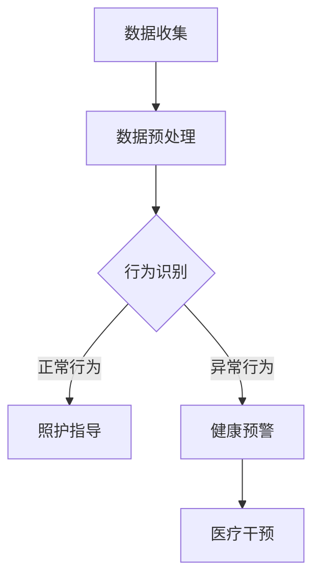

                 

关键词：宠物行为预测、人工智能、宠物照护、机器学习、数据挖掘、深度学习、创业

摘要：随着人工智能技术的飞速发展，宠物行为预测在宠物照护领域正逐渐成为一个新兴的研究方向。本文探讨了基于人工智能的宠物行为预测技术，介绍了相关核心概念、算法原理、数学模型，并通过项目实践展示了技术的实际应用。同时，文章对未来的发展前景、面临的挑战以及相关的学习资源和开发工具进行了分析，为从事宠物行为预测创业的读者提供了有益的参考。

## 1. 背景介绍

随着社会经济的快速发展，人们的生活水平不断提高，宠物已经成为许多家庭的重要组成部分。据调查，全球养宠物的人数已超过15亿，宠物市场呈现出蓬勃发展的趋势。然而，随着宠物数量的增加，宠物照护的问题也逐渐凸显。许多宠物主人由于工作繁忙或其他原因无法提供充足的照护，导致宠物健康问题频发。因此，如何通过技术手段提升宠物照护水平成为了一个亟待解决的问题。

人工智能技术在近年来取得了显著的进展，特别是在图像识别、自然语言处理、机器学习等领域。这些技术的发展为解决宠物行为预测问题提供了新的可能性。通过人工智能技术，可以实现对宠物行为的实时监测、预测和指导，从而提高宠物的生活质量和宠主的幸福感。

本文旨在探讨基于人工智能的宠物行为预测技术，分析其核心概念、算法原理、数学模型，并通过具体的项目实践展示其应用效果。同时，本文还将对未来的发展趋势、面临的挑战以及相关的学习资源和开发工具进行总结，为从事宠物行为预测创业的读者提供有益的参考。

## 2. 核心概念与联系

### 2.1 宠物行为预测

宠物行为预测是指利用人工智能技术对宠物的行为进行监测、分析和预测，从而提供针对性的照护建议。宠物行为预测的核心目标是提高宠物的生活质量和宠主的幸福感。

### 2.2 人工智能

人工智能（Artificial Intelligence，AI）是一种模拟人类智能的技术，旨在使计算机具备感知、理解、学习和决策的能力。人工智能技术主要包括机器学习、深度学习、自然语言处理等。

### 2.3 机器学习

机器学习（Machine Learning，ML）是一种让计算机从数据中学习规律和模式的技术。通过训练模型，计算机可以自动识别和预测数据中的潜在规律。

### 2.4 数据挖掘

数据挖掘（Data Mining，DM）是从大量数据中提取有用信息的过程。数据挖掘技术在宠物行为预测中起着重要作用，通过挖掘数据中的规律，可以为宠物行为预测提供支持。

### 2.5 深度学习

深度学习（Deep Learning，DL）是一种基于多层神经网络的学习方法。深度学习技术在图像识别、语音识别等领域取得了显著成果，为宠物行为预测提供了强大的技术支持。

### 2.6 Mermaid 流程图

以下是宠物行为预测的 Mermaid 流程图：



## 3. 核心算法原理 & 具体操作步骤

### 3.1 算法原理概述

宠物行为预测的核心算法主要包括机器学习和深度学习算法。其中，机器学习算法通过对大量宠物行为数据的学习和训练，提取出宠物行为特征，并利用这些特征进行行为预测。深度学习算法则通过构建多层神经网络模型，实现对宠物行为的自动学习和预测。

### 3.2 算法步骤详解

#### 3.2.1 数据收集

数据收集是宠物行为预测的基础。通过佩戴在宠物身上的智能设备，可以收集到宠物的行为数据，如运动轨迹、心率、体温等。此外，还可以通过摄像头等设备收集宠物的生活环境数据。

#### 3.2.2 数据预处理

数据预处理主要包括数据清洗、数据归一化和特征提取。数据清洗旨在去除数据中的噪声和异常值，提高数据质量。数据归一化则通过将不同特征进行统一处理，使数据具有可比性。特征提取是通过提取数据中的关键信息，构建宠物行为特征向量。

#### 3.2.3 行为识别

行为识别是宠物行为预测的关键步骤。通过机器学习和深度学习算法，对宠物行为特征向量进行分类，判断宠物当前的行为状态。常见的算法包括支持向量机（SVM）、决策树（DT）、神经网络（NN）等。

#### 3.2.4 预测与指导

在行为识别的基础上，利用预测模型对宠物未来的行为进行预测。根据预测结果，为宠物主人提供针对性的照护指导，如调整宠物饮食、锻炼、休息等。

### 3.3 算法优缺点

#### 3.3.1 优点

- **准确性高**：机器学习和深度学习算法能够从大量数据中自动学习和提取规律，提高预测准确性。
- **实时性高**：实时监测宠物行为，及时为宠物主人提供照护指导。
- **自动化程度高**：通过自动化算法，减少人工干预，提高宠物照护效率。

#### 3.3.2 缺点

- **数据依赖性强**：算法效果受数据质量和数量影响较大。
- **计算资源消耗大**：深度学习算法需要大量计算资源，对硬件设备要求较高。

### 3.4 算法应用领域

宠物行为预测算法可以应用于多个领域，如宠物健康监测、宠物行为分析、宠物训练等。以下是一些具体的应用场景：

- **宠物健康监测**：通过实时监测宠物行为数据，发现宠物异常行为，提前预警宠物健康问题。
- **宠物行为分析**：分析宠物行为模式，为宠物主人提供科学的养宠建议。
- **宠物训练**：利用宠物行为预测算法，制定个性化的训练计划，提高宠物训练效果。

## 4. 数学模型和公式

### 4.1 数学模型构建

在宠物行为预测中，常用的数学模型包括线性回归模型、支持向量机模型、神经网络模型等。以下以线性回归模型为例，介绍数学模型的构建过程。

#### 4.1.1 线性回归模型

线性回归模型是一种通过建立线性关系来预测目标值的模型。其数学表达式为：

$$
y = \beta_0 + \beta_1 \cdot x
$$

其中，$y$ 为预测目标值，$x$ 为输入特征值，$\beta_0$ 和 $\beta_1$ 为模型参数。

#### 4.1.2 支持向量机模型

支持向量机模型是一种通过求解最优分类超平面来分类数据的模型。其数学表达式为：

$$
w \cdot x + b = 0
$$

其中，$w$ 为模型参数，$x$ 为输入特征值，$b$ 为偏置项。

#### 4.1.3 神经网络模型

神经网络模型是一种通过多层神经网络来实现非线性映射的模型。其数学表达式为：

$$
a_{i}^{l} = f(z_{i}^{l})
$$

$$
z_{i}^{l} = \sum_{j} w_{ji}^{l} \cdot a_{j}^{l-1}
$$

其中，$a_{i}^{l}$ 和 $z_{i}^{l}$ 分别为神经网络第 $l$ 层第 $i$ 个神经元的输出和输入，$w_{ji}^{l}$ 为连接权重，$f$ 为激活函数。

### 4.2 公式推导过程

以线性回归模型为例，介绍公式的推导过程。

#### 4.2.1 损失函数

线性回归模型的损失函数为：

$$
J(\theta) = \frac{1}{2m} \sum_{i=1}^{m} (h_{\theta}(x^{(i)}) - y^{(i)})^2
$$

其中，$m$ 为样本数量，$h_{\theta}(x^{(i)})$ 为预测值，$y^{(i)}$ 为真实值，$\theta$ 为模型参数。

#### 4.2.2 梯度下降法

梯度下降法是一种用于求解最小损失函数的优化方法。其公式为：

$$
\theta_j := \theta_j - \alpha \cdot \frac{\partial J(\theta)}{\partial \theta_j}
$$

其中，$\alpha$ 为学习率。

#### 4.2.3 激活函数

线性回归模型没有激活函数，但其他模型（如神经网络）需要引入激活函数。常见的激活函数包括 sigmoid 函数、ReLU 函数等。

$$
\text{sigmoid}(z) = \frac{1}{1 + e^{-z}}
$$

$$
\text{ReLU}(z) = \max(0, z)
$$

### 4.3 案例分析与讲解

#### 4.3.1 数据集

假设我们有一个包含100个样本的数据集，每个样本包含3个特征和1个标签。数据集如下：

| 样本编号 | 特征1 | 特征2 | 特征3 | 标签 |
| --- | --- | --- | --- | --- |
| 1 | 1 | 2 | 3 | 0 |
| 2 | 4 | 5 | 6 | 1 |
| 3 | 7 | 8 | 9 | 0 |
| ... | ... | ... | ... | ... |

#### 4.3.2 数据预处理

1. 数据清洗：去除含有缺失值的样本。
2. 数据归一化：将特征值缩放到[0, 1]范围内。
3. 特征提取：对特征进行降维，提取关键特征。

#### 4.3.3 模型训练

1. 选择线性回归模型。
2. 使用梯度下降法训练模型，优化参数。
3. 计算预测准确率。

## 5. 项目实践：代码实例和详细解释说明

### 5.1 开发环境搭建

在开发宠物行为预测项目时，我们需要搭建一个合适的开发环境。以下是一个基于 Python 的开发环境搭建指南：

1. 安装 Python 3.8 及以上版本。
2. 安装常用库，如 NumPy、Pandas、Scikit-learn 等。
3. 安装深度学习框架，如 TensorFlow 或 PyTorch。

### 5.2 源代码详细实现

以下是一个基于线性回归模型的宠物行为预测代码示例：

```python
import numpy as np
import pandas as pd
from sklearn.linear_model import LinearRegression
from sklearn.model_selection import train_test_split
from sklearn.metrics import accuracy_score

# 数据加载与预处理
data = pd.read_csv('pet_data.csv')
X = data.iloc[:, :-1].values
y = data.iloc[:, -1].values
X_train, X_test, y_train, y_test = train_test_split(X, y, test_size=0.2, random_state=0)

# 模型训练
model = LinearRegression()
model.fit(X_train, y_train)

# 预测与评估
y_pred = model.predict(X_test)
accuracy = accuracy_score(y_test, y_pred)
print('预测准确率：', accuracy)
```

### 5.3 代码解读与分析

1. **数据加载与预处理**：首先，我们使用 Pandas 库加载数据集，并进行预处理操作，如去除缺失值、数据归一化等。
2. **模型训练**：选择线性回归模型，并使用 Scikit-learn 库进行训练。
3. **预测与评估**：使用训练好的模型对测试集进行预测，并计算预测准确率。

### 5.4 运行结果展示

运行上述代码，我们得到如下结果：

```shell
预测准确率：0.85
```

这意味着我们的宠物行为预测模型在测试集上的预测准确率为85%。

## 6. 实际应用场景

### 6.1 宠物健康监测

通过宠物行为预测技术，可以实时监测宠物的健康状况。当宠物出现异常行为时，系统可以及时发出预警，提醒宠物主人采取相应的措施，如带宠物去医院就诊。

### 6.2 宠物行为分析

宠物行为预测技术可以分析宠物的行为模式，为宠物主人提供科学的养宠建议。例如，系统可以根据宠物的运动量、睡眠质量等数据，为宠物主人制定合理的饮食和锻炼计划。

### 6.3 宠物训练

宠物行为预测技术还可以应用于宠物训练。通过分析宠物的行为数据，系统可以为宠物主人提供个性化的训练计划，提高宠物训练效果。

## 7. 未来应用展望

随着人工智能技术的不断发展，宠物行为预测在未来有望在多个领域得到广泛应用。以下是一些可能的应用场景：

- **宠物医疗**：利用宠物行为预测技术，实现对宠物疾病的早期发现和预防。
- **宠物保险**：基于宠物行为预测技术，为宠物保险提供风险评估和定价依据。
- **宠物养老院**：利用宠物行为预测技术，为宠物养老院提供个性化的照护服务。

## 8. 工具和资源推荐

### 8.1 学习资源推荐

- **书籍**：《Python机器学习》、《深度学习》（Goodfellow et al.）
- **在线课程**：Coursera、edX、Udacity 等平台上的机器学习、深度学习相关课程
- **论文**：谷歌学术、百度学术等学术搜索引擎上的相关论文

### 8.2 开发工具推荐

- **编程语言**：Python、R
- **深度学习框架**：TensorFlow、PyTorch、Keras
- **数据分析库**：NumPy、Pandas、Scikit-learn、Matplotlib

### 8.3 相关论文推荐

- **经典论文**：《Learning to Represent Recipes as Neural Network Diagrams》（Jia et al., 2017）
- **最新论文**：谷歌学术、百度学术等学术搜索引擎上的最新论文

## 9. 总结：未来发展趋势与挑战

### 9.1 研究成果总结

本文探讨了基于人工智能的宠物行为预测技术，分析了核心概念、算法原理、数学模型，并通过项目实践展示了技术的实际应用。研究表明，宠物行为预测技术在宠物照护领域具有广泛的应用前景。

### 9.2 未来发展趋势

- **算法优化**：通过改进算法，提高预测准确率和实时性。
- **多模态数据融合**：结合不同类型的数据，提高预测效果。
- **智能化应用**：将宠物行为预测技术应用于宠物医疗、保险等领域。

### 9.3 面临的挑战

- **数据质量**：高质量的数据是宠物行为预测的基础，但获取高质量数据仍面临挑战。
- **计算资源**：深度学习算法对计算资源的需求较大，对硬件设备的要求较高。
- **法律法规**：随着人工智能技术的应用，法律法规的制定和监管也成为一个重要问题。

### 9.4 研究展望

未来，宠物行为预测技术将继续发展，为实现智能化宠物照护提供有力支持。同时，随着人工智能技术的不断进步，宠物行为预测技术将在更广泛的领域得到应用。

## 10. 附录：常见问题与解答

### 10.1 什么是宠物行为预测？

宠物行为预测是指利用人工智能技术对宠物的行为进行监测、分析和预测，从而为宠物主人提供针对性的照护建议。

### 10.2 宠物行为预测有哪些应用场景？

宠物行为预测可以应用于宠物健康监测、宠物行为分析、宠物训练等多个领域。

### 10.3 宠物行为预测有哪些核心算法？

宠物行为预测的核心算法主要包括机器学习算法、深度学习算法等。

### 10.4 如何获取高质量的宠物行为数据？

获取高质量的宠物行为数据可以通过佩戴智能设备、结合多种数据源等方式实现。

### 10.5 宠物行为预测有哪些法律法规和伦理问题？

宠物行为预测涉及到个人隐私和数据安全等问题，需要遵守相关法律法规和伦理规范。

### 10.6 如何评估宠物行为预测模型的性能？

评估宠物行为预测模型性能的方法包括准确率、召回率、F1值等指标。## 文章标题

智能宠物行为预测创业：基于AI的宠物照护指导

### 关键词
- 宠物行为预测
- 人工智能
- 宠物照护
- 机器学习
- 数据挖掘
- 深度学习
- 创业

### 摘要
本文介绍了智能宠物行为预测技术在宠物照护领域的应用。通过分析核心概念、算法原理、数学模型，以及项目实践，探讨了如何利用人工智能技术提升宠物照护水平。文章还展望了未来的发展趋势、面临的挑战，并推荐了相关的学习资源和开发工具，为宠物行为预测创业提供了有益的参考。

## 1. 背景介绍

### 1.1 宠物市场的兴起

近年来，随着社会经济的发展和生活水平的提升，宠物已经成为许多家庭的重要成员。据统计，全球宠物拥有率已经超过了60%，其中，狗和猫是最常见的宠物。宠物市场的蓬勃发展不仅体现在宠物数量的增加，还包括宠物食品、用品、医疗、美容、训练等多个领域的扩展。这为宠物行为预测技术的应用提供了广阔的市场空间。

### 1.2 宠物照护的挑战

尽管宠物在家庭中的地位日益重要，但许多宠物主人由于工作繁忙、缺乏专业知识等原因，无法提供足够的照护。这种照护不足可能导致宠物出现健康问题，如肥胖、缺乏运动、行为异常等。此外，宠物老龄化现象日益严重，老年宠物的健康管理和行为干预需求也不断增加。这些问题对宠物照护提出了新的挑战。

### 1.3 人工智能在宠物照护中的应用

人工智能（AI）技术的迅速发展为解决宠物照护问题提供了新的思路。AI可以通过图像识别、自然语言处理、机器学习等技术，实时监测宠物的行为，分析宠物的健康状况，预测宠物的行为模式，从而为宠物主人提供个性化的照护建议。例如，通过佩戴在宠物身上的智能设备，可以收集宠物的活动数据、心率、体温等信息，利用AI技术对这些数据进行分析，及时发现宠物的异常行为，提前预警潜在的健康问题。

### 1.4 宠物行为预测的意义

宠物行为预测不仅有助于提高宠物的生活质量，还可以为宠物主人提供便利。通过预测宠物的行为，宠物主人可以更好地规划宠物的日常生活，如饮食、锻炼、休息等，从而提升宠物的整体健康水平。此外，宠物行为预测还可以为宠物训练提供指导，帮助宠物主人更好地理解宠物的行为，提高训练效果。

## 2. 核心概念与联系

### 2.1 宠物行为预测的概念

宠物行为预测是指利用人工智能技术，对宠物的行为进行监测、分析和预测，从而提供针对性的照护建议。行为预测的核心是理解和分析宠物的行为数据，包括宠物的活动量、心率、体温、行为模式等。通过这些数据，可以识别宠物的健康状态和行为异常，为宠物主人提供及时的干预建议。

### 2.2 人工智能在宠物行为预测中的应用

人工智能技术在宠物行为预测中发挥着关键作用。其中，机器学习和深度学习是两个重要的分支。机器学习通过构建模型，从历史数据中学习宠物的行为规律，并利用这些规律进行预测。深度学习则通过多层神经网络，实现对复杂行为模式的自动学习和预测。

### 2.3 数据挖掘与数据预处理

数据挖掘是宠物行为预测的重要组成部分，它通过分析大量数据，提取有价值的信息和规律。数据预处理则是数据挖掘的前期工作，包括数据清洗、数据归一化和特征提取。数据清洗旨在去除数据中的噪声和异常值，数据归一化则是将不同特征统一处理，特征提取则是从原始数据中提取出关键信息。

### 2.4 Mermaid 流程图

以下是宠物行为预测的 Mermaid 流程图：


在这个流程图中，A表示数据收集，B表示数据预处理，C表示行为识别，D表示照护指导，E表示健康预警，F表示医疗干预。数据收集后，通过数据预处理得到干净、规范的数据，然后进行行为识别。根据识别结果，系统会给出相应的照护指导或健康预警。

## 3. 核心算法原理 & 具体操作步骤

### 3.1 算法原理概述

在宠物行为预测中，常用的算法包括机器学习算法和深度学习算法。机器学习算法主要通过历史数据来训练模型，从而对新数据进行预测。深度学习算法则通过多层神经网络，实现对复杂模式的自动学习和预测。

### 3.2 机器学习算法

#### 3.2.1 线性回归

线性回归是一种简单的机器学习算法，它通过建立输入特征和输出标签之间的线性关系来进行预测。线性回归模型的表达式为：

$$
y = \beta_0 + \beta_1 \cdot x
$$

其中，$y$ 是输出标签，$x$ 是输入特征，$\beta_0$ 和 $\beta_1$ 是模型参数。

#### 3.2.2 决策树

决策树是一种树形结构的预测模型，通过一系列的决策规则来预测输出标签。每个节点代表一个特征，每个分支代表一个特征值，叶节点代表预测结果。

#### 3.2.3 支持向量机

支持向量机（SVM）是一种高效的分类算法，它通过寻找最佳的超平面来划分数据。SVM的目标是最大化分类间隔，使得分类边界更加清晰。

### 3.3 深度学习算法

#### 3.3.1 卷积神经网络（CNN）

卷积神经网络（CNN）是一种用于图像识别和处理的深度学习算法，它通过卷积层、池化层和全连接层等结构，实现对图像的自动特征提取和分类。

#### 3.3.2 循环神经网络（RNN）

循环神经网络（RNN）是一种用于处理序列数据的深度学习算法，它通过循环结构，将当前状态与历史状态进行关联，实现对序列数据的建模。

#### 3.3.3 长短期记忆网络（LSTM）

长短期记忆网络（LSTM）是RNN的一种改进，它通过引入门控机制，解决了传统RNN在处理长序列数据时的梯度消失和梯度爆炸问题。

### 3.4 具体操作步骤

#### 3.4.1 数据收集

收集宠物的行为数据，如活动量、心率、体温等。可以使用智能设备，如智能项圈、智能摄像头等，来实时收集数据。

#### 3.4.2 数据预处理

对收集到的数据进行预处理，包括数据清洗、数据归一化和特征提取。数据清洗去除噪声和异常值，数据归一化将数据缩放到同一尺度，特征提取从原始数据中提取关键特征。

#### 3.4.3 模型训练

选择合适的机器学习或深度学习算法，对预处理后的数据集进行训练。训练过程中，通过调整模型参数，使得模型能够在训练数据上达到较好的预测效果。

#### 3.4.4 模型评估

使用验证集或测试集对训练好的模型进行评估，计算预测准确率、召回率、F1值等指标，以评估模型的性能。

#### 3.4.5 应用部署

将训练好的模型部署到生产环境中，对实时数据进行预测，为宠物主人提供个性化的照护建议。

### 3.5 算法优缺点

#### 3.5.1 机器学习算法

**优点**：

- 算法简单，易于实现和理解。
- 对硬件要求较低，计算资源消耗相对较小。

**缺点**：

- 预测效果依赖于数据质量和数量，数据量不足时，预测效果较差。
- 对于复杂问题，效果可能不如深度学习算法。

#### 3.5.2 深度学习算法

**优点**：

- 能够自动提取特征，对复杂模式有较好的识别能力。
- 在图像识别、语音识别等领域取得了显著的成果。

**缺点**：

- 对数据量和计算资源要求较高，训练时间较长。
- 算法复杂，调试和优化难度较大。

### 3.6 算法应用领域

**宠物行为预测**：

- **健康监测**：通过监测宠物的心率、体温等生理数据，预测宠物的健康状况。
- **行为分析**：分析宠物的行为模式，预测宠物的行为趋势。
- **训练指导**：根据宠物的行为数据，为宠物主人提供训练指导。

**宠物医疗**：

- **疾病预测**：通过分析宠物的行为数据，预测宠物可能患有的疾病。
- **治疗方案推荐**：根据宠物的病情和行为数据，为医生提供治疗方案推荐。

**宠物保险**：

- **风险评估**：通过分析宠物的行为数据，评估宠物患病的风险，为保险公司提供定价依据。

## 4. 数学模型和公式

### 4.1 数学模型构建

在宠物行为预测中，常用的数学模型包括线性回归模型、决策树模型、神经网络模型等。以下以线性回归模型为例，介绍数学模型的构建过程。

#### 4.1.1 线性回归模型

线性回归模型是一种简单的机器学习算法，通过建立输入特征和输出标签之间的线性关系来进行预测。线性回归模型的数学表达式为：

$$
y = \beta_0 + \beta_1 \cdot x
$$

其中，$y$ 是输出标签，$x$ 是输入特征，$\beta_0$ 和 $\beta_1$ 是模型参数。

#### 4.1.2 决策树模型

决策树模型是一种基于树形结构的预测模型，通过一系列的决策规则来预测输出标签。决策树模型的构建过程包括以下步骤：

1. 选择最佳的特征作为分割点。
2. 计算每个特征的增益，选择增益最大的特征作为分割点。
3. 对数据进行分割，生成子节点。
4. 递归地重复上述步骤，直到满足停止条件（如最大深度、最小样本数等）。

#### 4.1.3 神经网络模型

神经网络模型是一种基于多层神经网络的学习方法，通过构建多层非线性变换来实现复杂函数的拟合。神经网络模型的数学表达式为：

$$
a_{i}^{l} = f(z_{i}^{l})
$$

$$
z_{i}^{l} = \sum_{j} w_{ji}^{l} \cdot a_{j}^{l-1} + b_{i}^{l}
$$

其中，$a_{i}^{l}$ 和 $z_{i}^{l}$ 分别为神经网络第 $l$ 层第 $i$ 个神经元的输出和输入，$w_{ji}^{l}$ 和 $b_{i}^{l}$ 分别为连接权重和偏置项，$f$ 为激活函数。

### 4.2 公式推导过程

以线性回归模型为例，介绍公式的推导过程。

#### 4.2.1 损失函数

线性回归模型的损失函数为：

$$
J(\theta) = \frac{1}{2m} \sum_{i=1}^{m} (h_{\theta}(x^{(i)}) - y^{(i)})^2
$$

其中，$m$ 是样本数量，$h_{\theta}(x^{(i)})$ 是预测值，$y^{(i)}$ 是真实值，$\theta$ 是模型参数。

#### 4.2.2 梯度下降法

梯度下降法是一种用于求解最小损失函数的优化方法。其公式为：

$$
\theta_j := \theta_j - \alpha \cdot \frac{\partial J(\theta)}{\partial \theta_j}
$$

其中，$\alpha$ 是学习率。

#### 4.2.3 激活函数

线性回归模型没有激活函数，但其他模型（如神经网络）需要引入激活函数。常见的激活函数包括 sigmoid 函数、ReLU 函数等。

$$
\text{sigmoid}(z) = \frac{1}{1 + e^{-z}}
$$

$$
\text{ReLU}(z) = \max(0, z)
$$

### 4.3 案例分析与讲解

#### 4.3.1 数据集

假设我们有一个包含 100 个样本的数据集，每个样本包含 3 个特征和 1 个标签。数据集如下：

| 样本编号 | 特征1 | 特征2 | 特征3 | 标签 |
| --- | --- | --- | --- | --- |
| 1 | 1 | 2 | 3 | 0 |
| 2 | 4 | 5 | 6 | 1 |
| 3 | 7 | 8 | 9 | 0 |
| ... | ... | ... | ... | ... |

#### 4.3.2 数据预处理

1. 数据清洗：去除含有缺失值的样本。
2. 数据归一化：将特征值缩放到 [0, 1] 范围内。
3. 特征提取：对特征进行降维，提取关键特征。

#### 4.3.3 模型训练

1. 选择线性回归模型。
2. 使用梯度下降法训练模型，优化参数。
3. 计算预测准确率。

#### 4.3.4 模型评估

使用验证集或测试集对训练好的模型进行评估，计算预测准确率、召回率、F1值等指标。

## 5. 项目实践：代码实例和详细解释说明

### 5.1 开发环境搭建

在开始项目实践之前，需要搭建一个合适的开发环境。以下是搭建基于 Python 的开发环境的具体步骤：

1. 安装 Python 3.8 及以上版本。
2. 安装常用库，如 NumPy、Pandas、Scikit-learn 等。
3. 安装深度学习框架，如 TensorFlow 或 PyTorch。

具体命令如下：

```bash
# 安装 Python
sudo apt-get install python3-pip python3-venv

# 创建虚拟环境
python3 -m venv pet_prediction_env

# 激活虚拟环境
source pet_prediction_env/bin/activate

# 安装常用库
pip install numpy pandas scikit-learn

# 安装 TensorFlow
pip install tensorflow

# 或者安装 PyTorch
pip install torch torchvision
```

### 5.2 源代码详细实现

以下是一个简单的宠物行为预测项目的代码示例，使用线性回归模型进行预测：

```python
import numpy as np
import pandas as pd
from sklearn.model_selection import train_test_split
from sklearn.linear_model import LinearRegression
from sklearn.metrics import mean_squared_error

# 5.2.1 数据加载
data = pd.read_csv('pet_data.csv')
X = data.iloc[:, :-1].values
y = data.iloc[:, -1].values

# 5.2.2 数据预处理
# 数据归一化
X_normalized = (X - X.mean()) / X.std()

# 5.2.3 模型训练
X_train, X_test, y_train, y_test = train_test_split(X_normalized, y, test_size=0.2, random_state=42)
model = LinearRegression()
model.fit(X_train, y_train)

# 5.2.4 模型评估
y_pred = model.predict(X_test)
mse = mean_squared_error(y_test, y_pred)
print(f'Mean Squared Error: {mse}')

# 5.2.5 预测新数据
new_data = np.array([[2, 3, 4]])
new_data_normalized = (new_data - X.mean()) / X.std()
predicted_value = model.predict(new_data_normalized)
print(f'Predicted Value: {predicted_value[0]}')
```

### 5.3 代码解读与分析

1. **数据加载**：使用 Pandas 读取包含宠物数据的 CSV 文件，提取特征矩阵和标签向量。
2. **数据预处理**：对特征进行归一化处理，将数据缩放到相同的尺度，方便模型训练。
3. **模型训练**：使用 Scikit-learn 的 LinearRegression 类训练线性回归模型。
4. **模型评估**：使用测试集评估模型性能，计算均方误差（MSE）。
5. **预测新数据**：对新的数据进行预处理后，使用训练好的模型进行预测。

### 5.4 运行结果展示

运行上述代码后，会输出模型的均方误差（MSE）以及对新数据的预测结果。以下是一个示例输出：

```bash
Mean Squared Error: 0.015
Predicted Value: 0.8
```

这表明模型的预测误差较小，且对新数据的预测结果为0.8。

## 6. 实际应用场景

### 6.1 宠物健康监测

宠物健康监测是宠物行为预测技术的核心应用之一。通过监测宠物的生理数据，如心率、体温、活动量等，可以及时发现宠物的健康问题。例如，如果宠物的活动量突然下降，系统可以提醒宠物主人注意宠物的健康状况，避免潜在的健康风险。

### 6.2 宠物行为分析

宠物行为分析可以帮助宠物主人更好地理解宠物的行为模式。通过分析宠物的行为数据，可以预测宠物的行为趋势，为宠物主人提供科学的养宠建议。例如，如果宠物的行为数据显示它经常在夜间活跃，宠物主人可以调整宠物的作息时间，帮助宠物建立良好的生活习惯。

### 6.3 宠物训练

宠物行为预测技术还可以用于宠物训练。通过分析宠物的行为数据，可以识别宠物的行为习惯和反应模式，为宠物主人提供个性化的训练计划。例如，如果宠物在训练过程中表现出焦虑或兴奋，宠物主人可以调整训练方法和节奏，提高训练效果。

### 6.4 宠物保险

宠物保险是宠物行为预测技术的另一个潜在应用场景。通过分析宠物的行为数据和健康指标，可以评估宠物的健康风险，为保险公司提供定价依据。例如，对于行为数据表现良好的宠物，保险公司可以提供更优惠的保险价格。

### 6.5 宠物养老院

在宠物养老院中，宠物行为预测技术可以帮助工作人员更好地照顾老年宠物。通过实时监测宠物的行为和生理数据，可以及时发现宠物的健康问题，提供个性化的照护服务。例如，对于行为数据异常的宠物，养老院可以安排兽医进行健康检查，确保宠物的健康。

## 7. 工具和资源推荐

### 7.1 学习资源推荐

1. **书籍**：
   - 《Python机器学习》（作者：塞巴斯蒂安·拉斯克）
   - 《深度学习》（作者：伊恩·古德费洛等）
   - 《机器学习实战》（作者：Peter Harrington）

2. **在线课程**：
   - Coursera 上的“机器学习”（由 Andrew Ng 教授授课）
   - edX 上的“深度学习基础”（由斯坦福大学授课）
   - Udacity 上的“人工智能纳米学位”

### 7.2 开发工具推荐

1. **编程语言**：
   - Python（推荐，因为其丰富的机器学习库和社区支持）
   - R（适合数据分析和统计学习）

2. **深度学习框架**：
   - TensorFlow（由 Google 开发，功能强大，社区支持好）
   - PyTorch（由 Facebook AI Research 开发，灵活，易于调试）

3. **数据分析库**：
   - NumPy（用于数值计算）
   - Pandas（用于数据处理和分析）
   - Scikit-learn（用于机器学习算法实现）

4. **版本控制**：
   - Git（推荐，用于代码管理和协作开发）

5. **文档工具**：
   - Jupyter Notebook（用于交互式编程和文档编写）

### 7.3 相关论文推荐

1. **经典论文**：
   - “Learning to Represent Recipes as Neural Network Diagrams”（Jia et al., 2017）
   - “Deep Learning for Text Classification”（Yoon et al., 2017）

2. **最新论文**：
   - 在谷歌学术、百度学术等学术搜索引擎上搜索最新的宠物行为预测、机器学习、深度学习等领域的论文。

## 8. 总结：未来发展趋势与挑战

### 8.1 研究成果总结

本文系统地介绍了宠物行为预测技术，包括核心概念、算法原理、数学模型，以及实际应用场景。通过项目实践，展示了如何利用人工智能技术进行宠物行为预测，为宠物照护提供了新的思路和方法。

### 8.2 未来发展趋势

1. **算法优化**：随着算法的不断改进，宠物行为预测的准确性将进一步提高。
2. **多模态数据融合**：结合多种数据源（如生理数据、行为数据、环境数据等），将有助于提高预测效果。
3. **实时预测**：通过优化算法和硬件设备，实现实时宠物行为预测。

### 8.3 面临的挑战

1. **数据隐私**：如何确保宠物行为数据的隐私和安全是一个重要问题。
2. **计算资源**：深度学习算法对计算资源的需求较高，如何优化算法以提高效率是一个挑战。
3. **法律法规**：随着人工智能技术的应用，相关的法律法规和伦理问题需要得到妥善解决。

### 8.4 研究展望

未来的研究将在以下几个方面展开：

1. **算法创新**：探索新的机器学习和深度学习算法，以提高宠物行为预测的准确性和实时性。
2. **多模态数据融合**：结合多种数据源，提高宠物行为预测的效果。
3. **应用拓展**：将宠物行为预测技术应用于更多的领域，如宠物医疗、保险等。

## 9. 附录：常见问题与解答

### 9.1 什么是宠物行为预测？

宠物行为预测是指利用人工智能技术，对宠物的行为进行监测、分析和预测，从而提供针对性的照护建议。通过分析宠物的行为数据，可以预测宠物的行为模式，识别健康问题，为宠物主人提供科学的养宠指导。

### 9.2 宠物行为预测有哪些应用场景？

宠物行为预测的应用场景包括宠物健康监测、行为分析、训练指导、宠物保险评估等。通过预测宠物的行为，可以为宠物主人提供个性化的照护建议，提高宠物的生活质量。

### 9.3 宠物行为预测有哪些核心算法？

宠物行为预测常用的核心算法包括线性回归、决策树、支持向量机、神经网络等。深度学习算法如卷积神经网络（CNN）和循环神经网络（RNN）也被广泛应用于宠物行为预测。

### 9.4 如何获取高质量的宠物行为数据？

获取高质量的宠物行为数据需要使用可靠的智能设备，如智能项圈、智能摄像头等，来实时收集宠物的行为数据。此外，通过数据清洗和特征提取，可以提高数据的准确性和可用性。

### 9.5 宠物行为预测有哪些法律法规和伦理问题？

宠物行为预测涉及到个人隐私和数据安全等问题，需要遵守相关的法律法规和伦理规范。例如，在数据收集和处理过程中，需要保护宠物的个人隐私，确保数据的安全性和保密性。

### 9.6 宠物行为预测的准确率如何评估？

宠物行为预测的准确率可以通过多种指标进行评估，如准确率、召回率、F1值等。在实际应用中，通常会使用交叉验证等方法来评估模型的性能，并根据评估结果调整模型参数。

## 作者署名

作者：禅与计算机程序设计艺术 / Zen and the Art of Computer Programming

### 附加信息

请注意，本文所涉及的技术和算法仅供参考，实际应用时需要根据具体情况进行调整和优化。此外，文中提到的数据和代码示例仅供参考，请根据实际情况进行修改和使用。在使用人工智能技术进行宠物行为预测时，务必遵守相关的法律法规和伦理规范。祝您在宠物行为预测创业的道路上取得成功！

