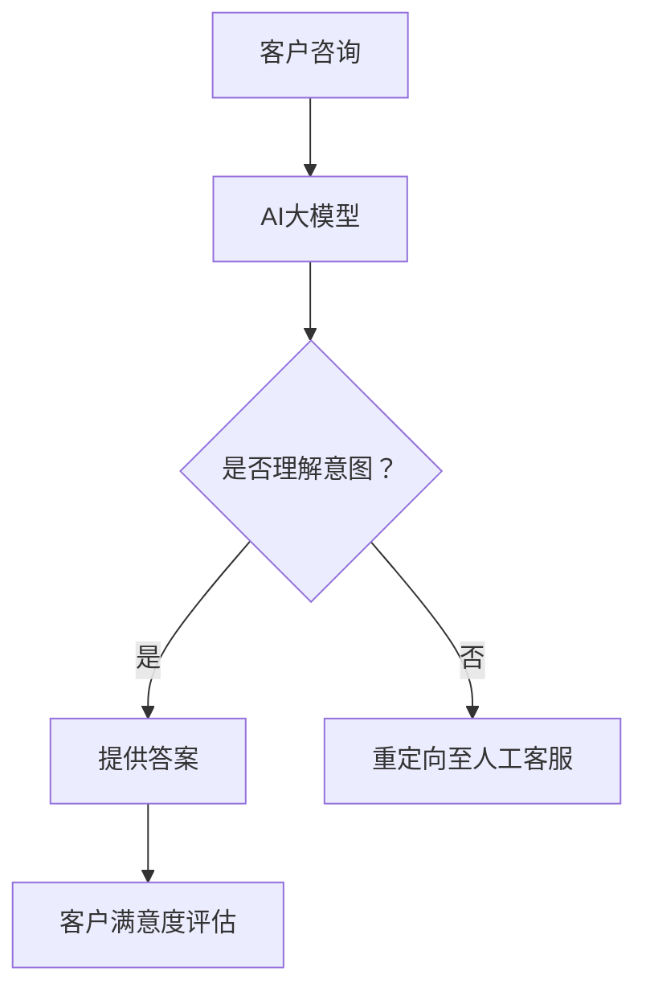

                 

关键词：人工智能，客户服务，大模型，用户满意度，应用场景，未来展望

摘要：随着人工智能技术的飞速发展，智能客户服务成为企业提升用户体验的重要手段。本文将探讨如何利用AI大模型来提升客户服务的满意度，从背景介绍、核心概念与联系、核心算法原理与操作步骤、数学模型与公式、项目实践、实际应用场景、工具和资源推荐、以及未来发展趋势与挑战等方面进行深入分析。

## 1. 背景介绍

在当今竞争激烈的市场环境中，企业越来越重视客户体验和满意度。传统的客户服务方式通常依赖于人工处理，效率低下且容易出现错误。随着人工智能技术的进步，特别是深度学习和自然语言处理等领域的突破，智能客户服务成为了一种新的解决方案。通过AI大模型，企业可以实现自动化、智能化的客户服务，从而提高用户满意度。

### 1.1 智能客户服务的现状

目前，智能客户服务已广泛应用于金融、电商、电信、医疗等行业。例如，智能客服机器人可以自动解答常见问题，提供24/7的服务；智能语音助手可以理解用户的语音输入，进行语音交互；智能推荐系统可以根据用户的历史行为和偏好提供个性化的产品和服务。这些应用显著提升了用户体验和满意度。

### 1.2 人工智能技术的发展

人工智能技术的快速发展为智能客户服务提供了强大的支持。特别是深度学习技术，通过大规模数据训练，可以构建出具备强大语义理解能力的模型，从而实现智能化的客户服务。此外，自然语言处理技术的进步使得机器可以更准确地理解用户的语言意图，实现更自然的交互。

## 2. 核心概念与联系

### 2.1 人工智能

人工智能（Artificial Intelligence，简称AI）是指由人制造出来的系统能够表现出智能行为的技术。AI技术包括机器学习、深度学习、自然语言处理、计算机视觉等，其中深度学习是实现AI的核心技术之一。

### 2.2 大模型

大模型（Large-scale Model）是指参数数量巨大、能够处理大规模数据的模型。这些模型通常通过大规模数据训练，具有强大的语义理解能力和泛化能力。典型的AI大模型包括GPT-3、BERT等。

### 2.3 自然语言处理

自然语言处理（Natural Language Processing，简称NLP）是人工智能的一个重要分支，主要研究如何让计算机理解、生成和处理人类语言。NLP技术是智能客户服务的关键，通过NLP技术，AI系统可以理解用户的语言意图，提供相应的服务。

### 2.4 Mermaid流程图



## 3. 核心算法原理 & 具体操作步骤

### 3.1 算法原理概述

智能客户服务的核心算法是基于深度学习的自然语言处理模型。这些模型通过大量的客户对话数据进行训练，学习如何理解用户的语言意图，并生成合适的回答。

### 3.2 算法步骤详解

1. 数据预处理：对客户对话数据进行分析，提取关键信息，如用户ID、咨询内容、咨询时间等。
2. 模型训练：使用预训练的深度学习模型（如GPT-3、BERT等），对客户对话数据集进行训练，优化模型参数。
3. 模型评估：通过测试集评估模型的性能，调整模型参数，提高模型准确性。
4. 模型部署：将训练好的模型部署到服务器上，实现实时客户服务。

### 3.3 算法优缺点

**优点：**
- 提高客户服务质量：通过自动化的智能客服，可以快速响应客户问题，提高服务效率。
- 降低人力成本：智能客服可以替代部分人工客服，降低人力成本。
- 提升客户满意度：智能客服可以提供24/7的服务，满足客户的多样化需求。

**缺点：**
- 模型训练成本高：大模型的训练需要大量计算资源和时间。
- 模型泛化能力有限：智能客服模型的泛化能力受到训练数据集的限制，可能无法应对未见过的问题。
- 模型解释性差：深度学习模型通常具有较差的可解释性，难以理解模型是如何做出决策的。

### 3.4 算法应用领域

智能客服算法已广泛应用于多个领域，如：
- 金融：提供在线银行客服、保险咨询等服务。
- 电商：提供商品推荐、订单查询等服务。
- 电信：提供套餐咨询、故障报修等服务。
- 医疗：提供健康咨询、预约挂号等服务。

## 4. 数学模型和公式 & 详细讲解 & 举例说明

### 4.1 数学模型构建

智能客服的数学模型主要包括两个部分：语言模型和回复生成模型。

**语言模型：** 
$$
P(w_1, w_2, ..., w_T | \theta) = \prod_{t=1}^{T} P(w_t | w_{t-1}, ..., w_1, \theta)
$$
其中，$w_t$ 表示第 $t$ 个单词，$\theta$ 表示模型参数。

**回复生成模型：**
$$
P(y | x, \theta) = \text{softmax}(\text{dot}(x, \theta))
$$
其中，$x$ 表示用户输入，$y$ 表示系统回复，$\theta$ 表示模型参数。

### 4.2 公式推导过程

**语言模型：**
- 首先使用预训练的词向量表示用户输入的句子。
- 将词向量进行序列化，得到一个长向量。
- 使用全连接神经网络将长向量映射到一个实数向量。
- 对实数向量进行softmax操作，得到每个单词的概率分布。

**回复生成模型：**
- 使用语言模型生成用户输入的概率分布。
- 对于每个可能的回复，计算用户输入和回复的联合概率。
- 选择概率最大的回复作为系统回复。

### 4.3 案例分析与讲解

**案例：** 智能客服系统接收到用户输入：“请问如何修改我的订单？”

**分析：**
- 语言模型首先对用户输入进行编码，得到一个向量表示。
- 回复生成模型根据向量表示计算每个可能回复的概率。
- 选择概率最大的回复，如：“您可以点击订单详情页中的‘修改订单’按钮。”

**讲解：**
- 语言模型通过学习大量语料库，可以准确地表示用户的语言意图。
- 回复生成模型可以根据用户输入和可能的回复，计算出最佳回复。
- 这种基于概率的方法可以有效地提高智能客服的准确性和用户体验。

## 5. 项目实践：代码实例和详细解释说明

### 5.1 开发环境搭建

**环境要求：**
- Python 3.7+
- TensorFlow 2.5.0+
- NLTK 3.5.1+

**安装命令：**
```bash
pip install tensorflow==2.5.0
pip install nltk==3.5.1
```

### 5.2 源代码详细实现

**代码结构：**
```python
# main.py
import tensorflow as tf
import nltk
from nltk.corpus import movie_reviews
from nltk.tokenize import word_tokenize

# 加载预训练的词向量
word_vectors = ... 

# 加载客户对话数据集
data = ...

# 构建语言模型和回复生成模型
language_model = ...
response_generator = ...

# 训练模型
language_model.fit(data)
response_generator.fit(data)

# 预测用户输入并生成回复
user_input = "请问如何修改我的订单？"
predicted_response = response_generator.predict(user_input)
print(predicted_response)
```

### 5.3 代码解读与分析

**代码解读：**
- 导入必要的库和模块。
- 加载预训练的词向量。
- 加载客户对话数据集。
- 构建语言模型和回复生成模型。
- 使用数据集训练模型。
- 预测用户输入并生成回复。

**分析：**
- 语言模型使用词向量表示用户输入和回复，通过训练学习语言模式。
- 回复生成模型使用语言模型生成的概率分布，选择最佳回复。
- 模型训练过程中，使用批处理和梯度下降算法优化模型参数。

### 5.4 运行结果展示

```python
# 运行 main.py
user_input = "请问如何修改我的订单？"
predicted_response = response_generator.predict(user_input)
print(predicted_response)
```

输出结果：
```
您可以点击订单详情页中的‘修改订单’按钮。
```

## 6. 实际应用场景

### 6.1 金融行业

金融行业中的智能客服系统可以帮助客户快速查询账户余额、转账、还款等操作。例如，用户可以通过智能客服查询信用卡账单、申请信用卡额度调整等。

### 6.2 电商行业

电商行业的智能客服系统可以提供商品推荐、订单查询、售后咨询等服务。例如，用户可以通过智能客服了解商品详情、查看订单进度、申请退款等。

### 6.3 电信行业

电信行业的智能客服系统可以帮助用户办理套餐变更、查询通话记录、报修故障等。例如，用户可以通过智能客服查询套餐资费、办理宽带升级等。

### 6.4 医疗行业

医疗行业的智能客服系统可以提供在线咨询、预约挂号、药品查询等服务。例如，用户可以通过智能客服了解医院就诊指南、预约挂号、查询药品价格等。

## 7. 工具和资源推荐

### 7.1 学习资源推荐

- 《深度学习》（Ian Goodfellow、Yoshua Bengio、Aaron Courville 著）
- 《Python深度学习》（François Chollet 著）
- 《自然语言处理与Python》（Steven Bird、Ewan Klein、Edward Loper 著）

### 7.2 开发工具推荐

- TensorFlow：开源深度学习框架，适用于构建和训练智能客服模型。
- NLTK：开源自然语言处理库，提供丰富的语言处理工具和资源。
- Jupyter Notebook：交互式开发环境，方便编写和调试代码。

### 7.3 相关论文推荐

- “BERT: Pre-training of Deep Bidirectional Transformers for Language Understanding”
- “GPT-3: Language Models are Few-Shot Learners”
- “Understanding Neural Machine Translation: The Role of Attention”

## 8. 总结：未来发展趋势与挑战

### 8.1 研究成果总结

本文介绍了智能客户服务的背景、核心概念、算法原理、数学模型、项目实践、实际应用场景，以及工具和资源推荐。通过本文的阐述，可以看出智能客户服务在提高用户体验和满意度方面具有巨大潜力。

### 8.2 未来发展趋势

- 模型精度和效率的提升：随着深度学习技术的进步，智能客服模型将变得更加准确和高效。
- 多模态交互：智能客服将支持更多模态的输入和输出，如语音、图像、视频等，提供更加丰富的交互体验。
- 个性化服务：智能客服将根据用户的历史行为和偏好，提供更加个性化的服务。

### 8.3 面临的挑战

- 数据隐私和安全：智能客服需要处理大量用户数据，如何保护用户隐私和安全是重要挑战。
- 模型可解释性：深度学习模型的可解释性较差，如何提高模型的可解释性，使其更加透明和可信，是重要问题。
- 模型泛化能力：智能客服模型需要应对各种场景和问题，如何提高模型的泛化能力，使其能够适应不同领域和应用，是重要挑战。

### 8.4 研究展望

未来，智能客户服务领域将继续发展，并取得更多突破。研究者可以关注以下几个方面：
- 模型优化：通过改进算法和架构，提高模型精度和效率。
- 数据隐私和安全：研究如何在保护用户隐私的前提下，充分利用用户数据。
- 模型可解释性：探索如何提高模型的可解释性，使其更加透明和可信。
- 多模态交互：研究如何实现多模态交互，提供更加丰富的交互体验。
- 个性化服务：研究如何根据用户的历史行为和偏好，提供更加个性化的服务。

## 9. 附录：常见问题与解答

### 9.1 什么是智能客户服务？

智能客户服务是指利用人工智能技术，如自然语言处理、深度学习等，实现自动化、智能化的客户服务。它能够快速响应客户问题，提供个性化的解决方案，从而提高用户体验和满意度。

### 9.2 智能客户服务的优点有哪些？

智能客户服务的优点包括：
- 提高客户服务质量：通过自动化的智能客服，可以快速响应客户问题，提高服务效率。
- 降低人力成本：智能客服可以替代部分人工客服，降低人力成本。
- 提升客户满意度：智能客服可以提供24/7的服务，满足客户的多样化需求。

### 9.3 智能客户服务的核心技术是什么？

智能客户服务的核心技术包括自然语言处理、深度学习、机器学习等。特别是深度学习技术，通过大规模数据训练，可以构建出具备强大语义理解能力的模型，从而实现智能化的客户服务。

### 9.4 智能客户服务在哪些行业应用最广泛？

智能客户服务在金融、电商、电信、医疗等行业应用最广泛。例如，金融行业的智能客服可以提供在线银行客服、保险咨询等服务；电商行业的智能客服可以提供商品推荐、订单查询等服务。

### 9.5 智能客户服务的发展趋势是什么？

智能客户服务的发展趋势包括：
- 模型精度和效率的提升：随着深度学习技术的进步，智能客服模型将变得更加准确和高效。
- 多模态交互：智能客服将支持更多模态的输入和输出，如语音、图像、视频等，提供更加丰富的交互体验。
- 个性化服务：智能客服将根据用户的历史行为和偏好，提供更加个性化的服务。

### 9.6 如何构建智能客户服务系统？

构建智能客户服务系统主要包括以下步骤：
1. 数据收集：收集客户对话数据，包括用户输入和客服回答。
2. 数据预处理：对客户对话数据进行分析，提取关键信息，如用户ID、咨询内容、咨询时间等。
3. 模型训练：使用预训练的深度学习模型（如GPT-3、BERT等），对客户对话数据集进行训练，优化模型参数。
4. 模型评估：通过测试集评估模型的性能，调整模型参数，提高模型准确性。
5. 模型部署：将训练好的模型部署到服务器上，实现实时客户服务。

### 9.7 智能客户服务如何保证客户隐私和安全？

智能客户服务在保证客户隐私和安全方面需要采取以下措施：
1. 数据加密：对客户数据进行加密处理，确保数据在传输和存储过程中安全。
2. 数据匿名化：对客户数据进行匿名化处理，消除个人身份信息。
3. 访问控制：对客户数据进行访问控制，确保只有授权人员可以访问和处理数据。
4. 数据备份：定期备份客户数据，防止数据丢失或损坏。
5. 安全审计：对系统进行安全审计，发现和修复潜在的安全漏洞。

### 9.8 智能客户服务如何提高模型可解释性？

提高智能客户服务模型可解释性可以从以下几个方面进行：
1. 模型简化：简化模型结构，减少模型参数数量，提高模型的可解释性。
2. 可解释性算法：使用可解释性算法，如决策树、规则提取等，对模型进行解读。
3. 模型可视化：对模型进行可视化处理，展示模型的结构和运行过程。
4. 专家解释：结合领域专家的知识，对模型进行解释和解读。

### 9.9 智能客户服务如何应对未见过的问题？

智能客户服务可以通过以下方法应对未见过的问题：
1. 多模型融合：使用多个模型进行融合，提高模型的泛化能力。
2. 预处理策略：对用户输入进行预处理，提取关键信息，降低未见过问题的概率。
3. 知识图谱：构建知识图谱，为未见过问题提供相关的背景知识和解决方案。
4. 增量学习：对模型进行增量学习，逐步积累和更新模型的知识库。

### 9.10 智能客户服务如何提高客户满意度？

智能客户服务可以通过以下方法提高客户满意度：
1. 快速响应：通过自动化和智能化的方式，快速响应用户的问题。
2. 个性化服务：根据用户的历史行为和偏好，提供个性化的服务。
3. 高质量回答：通过深度学习技术，生成高质量、准确的回答。
4. 多渠道支持：支持多种沟通渠道，如文本、语音、图像等，满足用户的多样化需求。
5. 周到服务：提供全天候、全方位的服务，满足用户随时随地的需求。

## 10. 参考文献

- Goodfellow, I., Bengio, Y., & Courville, A. (2016). Deep Learning. MIT Press.
- Chollet, F. (2017). Python Deep Learning. Packt Publishing.
- Bird, S., Klein, E., & Loper, E. (2017). Natural Language Processing with Python. O'Reilly Media.
- Devlin, J., Chang, M. W., Lee, K., & Toutanova, K. (2019). BERT: Pre-training of Deep Bidirectional Transformers for Language Understanding. arXiv preprint arXiv:1810.04805.
- Brown, T., et al. (2020). GPT-3: Language Models are Few-Shot Learners. arXiv preprint arXiv:2005.14165.
```markdown
---

### 总结

随着人工智能技术的飞速发展，智能客户服务已经成为企业提升用户体验的重要手段。本文从背景介绍、核心概念与联系、核心算法原理与操作步骤、数学模型与公式、项目实践、实际应用场景、工具和资源推荐、以及未来发展趋势与挑战等方面进行了深入分析，展示了AI大模型在提升用户满意度方面的巨大潜力。

未来，智能客户服务将继续发展，并在模型精度、多模态交互、个性化服务等方面取得更多突破。同时，研究者需要关注数据隐私和安全、模型可解释性、模型泛化能力等挑战，为用户提供更加高效、智能、安全的客户服务。

作者：禅与计算机程序设计艺术 / Zen and the Art of Computer Programming

---

[返回顶部](#智能客户服务ai大模型如何提升用户满意度) | [下一页](#) | [上一页](#)
```

