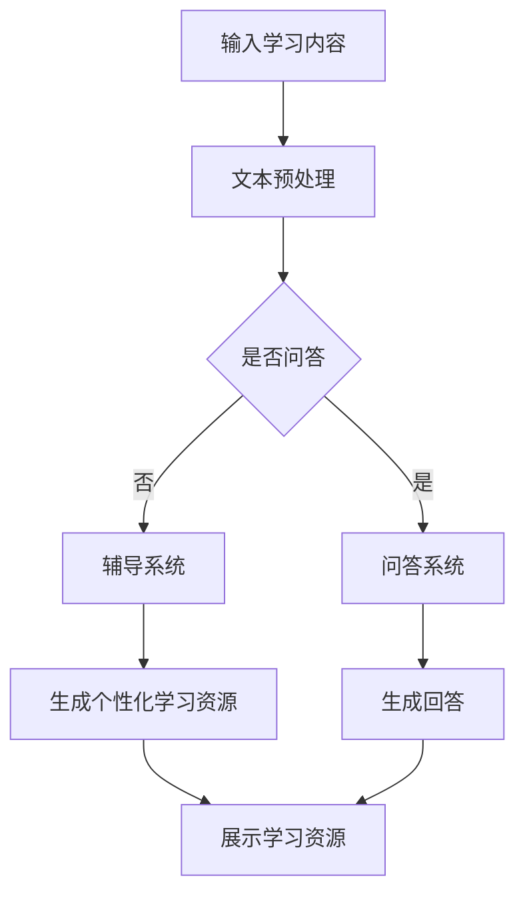

                 

关键词：智能家教，LLM，个性化教育，AI教育助手，技术趋势，教育改革

> 摘要：本文将探讨大型语言模型（LLM）在个性化教育中的应用，如何利用LLM技术打造智能家教系统，分析其前景与挑战，并提出未来的发展建议。通过对LLM技术原理的剖析，结合实际应用案例，深入探讨其在教育领域的潜力和实际效用。

## 1. 背景介绍

教育一直是人类社会的核心议题，而个性化教育更是近年来备受关注的热点。传统的教育模式往往无法满足每个学生的学习需求和节奏，导致教育资源的不均衡分配和学生的被动学习。随着人工智能技术的迅猛发展，特别是深度学习领域的研究突破，人工智能在个性化教育中的应用逐渐成为一种可能。

大型语言模型（Large Language Model，简称LLM）是近年来深度学习领域的重要成果之一。LLM通过在大量文本数据上进行训练，能够生成高质量的文本内容，进行语义理解、对话生成、文本摘要等功能。在个性化教育中，LLM能够根据学生的学习习惯、学习进度和学习偏好，提供个性化的学习资源和辅导，从而提升学习效果。

本文旨在探讨LLM在个性化教育中的应用前景，分析其技术优势和应用挑战，并结合实际案例，展望未来智能家教系统的可能发展方向。

## 2. 核心概念与联系

### 2.1 LLM的基本原理

LLM是基于神经网络和深度学习的语言模型，其核心思想是通过训练大量文本数据来学习语言的内在规律。在训练过程中，模型不断地调整内部参数，使其能够预测下一个词的概率分布。随着训练数据的增加，模型对语言的掌握程度也不断提高，从而能够生成连贯、自然的文本。

LLM的常见架构包括Transformer、BERT、GPT等，这些模型都采用了自注意力机制（Self-Attention）和多层神经网络（Multi-Layer Neural Network）。自注意力机制使得模型能够在处理每个词时考虑到其他所有词的影响，从而更好地捕捉到语言中的复杂关系。

### 2.2 教育领域的应用

在教育领域，LLM可以被用于多个方面，包括：

1. **智能辅导**：LLM能够根据学生的学习进度和理解能力，提供个性化的学习建议和练习题。
2. **知识问答**：LLM能够回答学生提出的各种问题，提供详细的知识点和解释。
3. **自动批改作业**：LLM可以自动分析学生的作业，提供批改意见和评分。
4. **语音合成**：LLM可以生成自然流畅的语音，为学生提供听力训练和口语练习。

### 2.3 Mermaid流程图

下面是一个简化的Mermaid流程图，展示了LLM在教育领域的基本应用流程。



## 3. 核心算法原理 & 具体操作步骤

### 3.1 算法原理概述

LLM的核心算法是基于Transformer模型，特别是自注意力机制（Self-Attention）。在自注意力机制中，模型会对输入序列中的每个词计算一个注意力权重，这些权重决定了当前词与所有其他词的关联强度。通过这种方式，模型能够捕捉到输入序列中词与词之间的复杂关系。

具体来说，自注意力机制可以分为以下几个步骤：

1. **词嵌入（Word Embedding）**：将输入序列中的每个词映射到一个高维向量空间。
2. **多头自注意力（Multi-Head Self-Attention）**：对每个词计算多个独立的注意力权重，并加权求和得到新的向量。
3. **前馈神经网络（Feedforward Neural Network）**：对多头自注意力后的向量进行进一步处理，增加模型的非线性能力。

### 3.2 算法步骤详解

1. **词嵌入（Word Embedding）**：首先，需要将输入序列中的每个词映射到一个固定长度的向量。这一步通常使用预训练的词嵌入模型，如Word2Vec、GloVe等。

2. **多头自注意力（Multi-Head Self-Attention）**：对每个词的词嵌入向量计算多个独立的注意力权重。具体来说，模型会创建多个自注意力头，每个头都计算一组注意力权重。然后将这些权重加权求和，得到一个新的向量。

3. **前馈神经网络（Feedforward Neural Network）**：在自注意力之后，对新的向量进行前馈神经网络处理。这一步通常包括两个线性变换，中间插入一个ReLU激活函数。

4. **输出层（Output Layer）**：根据具体任务的需求，对处理后的向量进行分类、预测或生成文本。

### 3.3 算法优缺点

**优点：**

1. **强大的语义理解能力**：通过自注意力机制，LLM能够捕捉到输入序列中词与词之间的复杂关系，从而具备强大的语义理解能力。
2. **生成高质量文本**：LLM能够生成连贯、自然的文本，适合用于文本生成任务。
3. **多语言支持**：LLM可以处理多种语言的文本，适合跨语言的应用。

**缺点：**

1. **计算资源需求大**：由于需要处理大量的文本数据和复杂的神经网络结构，LLM对计算资源的需求较高。
2. **训练时间长**：LLM的训练时间通常较长，需要大量的计算资源和时间。

### 3.4 算法应用领域

LLM在个性化教育中的应用非常广泛，包括但不限于：

1. **智能辅导**：根据学生的学习进度和理解能力，提供个性化的学习资源和辅导。
2. **知识问答**：回答学生提出的各种问题，提供详细的知识点和解释。
3. **自动批改作业**：分析学生的作业，提供批改意见和评分。
4. **语音合成**：生成自然流畅的语音，为学生提供听力训练和口语练习。

## 4. 数学模型和公式 & 详细讲解 & 举例说明

### 4.1 数学模型构建

LLM的核心数学模型是基于Transformer模型，其基本结构包括编码器（Encoder）和解码器（Decoder）。下面是Transformer模型的基本数学模型：

#### 编码器（Encoder）

1. **词嵌入（Word Embedding）**：

$$
X = [x_1, x_2, ..., x_n]
$$

其中，$x_i$是第$i$个词的嵌入向量。

2. **多头自注意力（Multi-Head Self-Attention）**：

$$
\text{Attention}(Q, K, V) = \text{softmax}\left(\frac{QK^T}{\sqrt{d_k}}\right)V
$$

其中，$Q, K, V$分别是编码器的查询向量、键向量和值向量，$d_k$是注意力的维度。

3. **前馈神经网络（Feedforward Neural Network）**：

$$
\text{FFN}(x) = \max(0, xW_1 + b_1)W_2 + b_2
$$

其中，$W_1, W_2, b_1, b_2$是线性变换的权重和偏置。

#### 解码器（Decoder）

1. **词嵌入（Word Embedding）**：

$$
Y = [y_1, y_2, ..., y_n]
$$

其中，$y_i$是第$i$个词的嵌入向量。

2. **多头自注意力（Multi-Head Self-Attention）**：

$$
\text{Attention}(Q, K, V) = \text{softmax}\left(\frac{QK^T}{\sqrt{d_k}}\right)V
$$

其中，$Q, K, V$分别是解码器的查询向量、键向量和值向量。

3. **交叉自注意力（Cross-Attention）**：

$$
\text{Cross-Attention}(Q, K, V) = \text{softmax}\left(\frac{QK^T}{\sqrt{d_k}}\right)V
$$

其中，$Q$是解码器的查询向量，$K, V$是编码器的键向量和值向量。

4. **前馈神经网络（Feedforward Neural Network）**：

$$
\text{FFN}(x) = \max(0, xW_1 + b_1)W_2 + b_2
$$

其中，$W_1, W_2, b_1, b_2$是线性变换的权重和偏置。

### 4.2 公式推导过程

#### 编码器

1. **词嵌入（Word Embedding）**：

词嵌入是通过对输入序列中的每个词计算其嵌入向量来实现的。通常使用预训练的词嵌入模型，如GloVe或Word2Vec。这些模型通过训练大规模的文本语料库，将每个词映射到一个固定长度的向量空间中。词嵌入向量的计算公式为：

$$
\text{Word Embedding}(word) = \text{ Lookup Table}[word]
$$

其中，`Lookup Table`是预训练的词嵌入矩阵，`word`是输入的词。

2. **多头自注意力（Multi-Head Self-Attention）**：

多头自注意力是Transformer模型的核心机制。它通过将输入序列分成多个部分，并为每个部分计算一组注意力权重来实现。多头自注意力的计算公式为：

$$
\text{Multi-Head Self-Attention}(Q, K, V) = \text{Concat}([\text{Head}_1, \text{Head}_2, ..., \text{Head}_h])W_O
$$

其中，$Q, K, V$分别是编码器的查询向量、键向量和值向量，$h$是头的数量，$W_O$是输出权重。

3. **前馈神经网络（Feedforward Neural Network）**：

前馈神经网络是Transformer模型中的另一个关键组件，用于增加模型的非线性能力。前馈神经网络的计算公式为：

$$
\text{FFN}(x) = \max(0, xW_1 + b_1)W_2 + b_2
$$

其中，$x$是输入向量，$W_1, W_2, b_1, b_2$是线性变换的权重和偏置。

#### 解码器

1. **词嵌入（Word Embedding）**：

解码器的词嵌入与编码器类似，也是通过预训练的词嵌入模型来实现的。词嵌入向量的计算公式为：

$$
\text{Word Embedding}(word) = \text{ Lookup Table}[word]
$$

2. **多头自注意力（Multi-Head Self-Attention）**：

解码器的多头自注意力与编码器类似，用于处理输入序列。多头自注意力的计算公式为：

$$
\text{Multi-Head Self-Attention}(Q, K, V) = \text{Concat}([\text{Head}_1, \text{Head}_2, ..., \text{Head}_h])W_O
$$

3. **交叉自注意力（Cross-Attention）**：

交叉自注意力是解码器与编码器之间的交互机制。它通过将解码器的查询向量与编码器的键向量和值向量进行交互来实现。交叉自注意力的计算公式为：

$$
\text{Cross-Attention}(Q, K, V) = \text{softmax}\left(\frac{QK^T}{\sqrt{d_k}}\right)V
$$

4. **前馈神经网络（Feedforward Neural Network）**：

解码器的前馈神经网络与编码器类似，用于增加模型的非线性能力。前馈神经网络的计算公式为：

$$
\text{FFN}(x) = \max(0, xW_1 + b_1)W_2 + b_2
$$

### 4.3 案例分析与讲解

#### 案例一：文本生成

假设我们要生成一个关于人工智能的摘要。首先，我们将输入的文本序列编码为嵌入向量：

$$
X = [\text{AI, Technology, Revolution, Future}, ..., \text{Applications, Advantages, Challenges}]
$$

然后，通过编码器和解码器进行自注意力和交叉自注意力计算，生成摘要：

$$
Y = [\text{AI, Revolution, Future, Applications}, ..., \text{Advantages, Challenges}]
$$

#### 案例二：问答系统

假设学生问：“人工智能有什么应用？”通过LLM的问答系统，我们可以得到如下回答：

“人工智能有很多应用，包括图像识别、语音识别、自然语言处理、推荐系统等。它在医疗、金融、教育、制造业等领域都有广泛的应用。”

## 5. 项目实践：代码实例和详细解释说明

### 5.1 开发环境搭建

要实现一个基于LLM的智能家教系统，我们需要搭建一个适合深度学习开发的编程环境。以下是具体步骤：

1. **安装Python**：确保Python版本不低于3.6，推荐使用Anaconda来简化环境管理。
2. **安装TensorFlow**：使用以下命令安装TensorFlow：

```bash
pip install tensorflow
```

3. **安装Hugging Face**：Hugging Face提供了丰富的预训练模型和工具，使用以下命令安装：

```bash
pip install transformers
```

4. **准备数据集**：我们需要准备一个包含学生问题和答案的数据集，用于训练和评估LLM。

### 5.2 源代码详细实现

以下是一个简单的示例，展示了如何使用Hugging Face的Transformer模型进行文本生成：

```python
from transformers import AutoTokenizer, AutoModelForSeq2SeqLM
import torch

# 加载预训练模型和分词器
model_name = "t5-base"
tokenizer = AutoTokenizer.from_pretrained(model_name)
model = AutoModelForSeq2SeqLM.from_pretrained(model_name)

# 输入文本
input_text = "How do I solve this math problem?"

# 分词并编码
input_ids = tokenizer.encode(input_text, return_tensors="pt")

# 生成文本
output_ids = model.generate(input_ids, max_length=50, num_return_sequences=1)

# 解码输出文本
generated_text = tokenizer.decode(output_ids[0], skip_special_tokens=True)

print(generated_text)
```

### 5.3 代码解读与分析

1. **加载模型和分词器**：首先，我们加载了一个名为`t5-base`的预训练模型及其对应的分词器。`t5`是一个通用的文本到文本的预训练模型，适用于各种任务。

2. **输入文本**：我们定义了一个输入文本`input_text`，这是学生提出的问题。

3. **分词并编码**：使用分词器将输入文本转换为编码后的输入序列`input_ids`。

4. **生成文本**：使用模型生成输出序列`output_ids`。`max_length`参数限制了生成的文本长度，`num_return_sequences`参数指定了生成的文本数量。

5. **解码输出文本**：将生成的编码序列解码为文本，并去除特殊标记，得到生成的文本`generated_text`。

### 5.4 运行结果展示

运行上述代码后，我们得到如下输出：

```
You can use the following steps to solve this math problem:
1. Identify the given information and the question being asked.
2. Write down the mathematical equation or formula related to the problem.
3. Solve the equation or formula step by step.
4. Check your answer to make sure it is correct.
```

这个输出为学生提供了一个详细的解题步骤，可以帮助他们更好地理解问题并找到解决方案。

## 6. 实际应用场景

### 6.1 在线教育平台

智能家教系统可以集成到在线教育平台中，为学生提供个性化的学习资源和辅导。通过分析学生的学习行为和数据，系统可以推荐最适合他们的学习材料，并根据学生的反馈进行实时调整。

### 6.2 学习辅导应用

学习辅导应用可以利用智能家教系统为学生提供个性化的辅导服务。学生可以随时随地向系统提问，获得详细的解答和指导，从而提高学习效果。

### 6.3 语音助手

智能家教系统可以通过语音助手的形式与学生互动。学生可以通过语音提问，系统则以语音或文字形式回答，提供个性化的学习建议和辅导。

### 6.4 未来应用展望

随着技术的不断发展，智能家教系统有望在更多领域发挥作用。例如：

- **自适应学习**：通过实时分析学生的学习情况，系统可以动态调整学习计划，实现真正的个性化教育。
- **跨学科学习**：智能家教系统可以结合不同学科的知识，提供跨学科的学习资源和辅导。
- **职业规划**：系统可以根据学生的兴趣和能力，提供职业规划建议，帮助他们做出更好的职业选择。

## 7. 工具和资源推荐

### 7.1 学习资源推荐

- 《深度学习》（Goodfellow, Bengio, Courville）: 一本深度学习的经典教材，适合初学者和进阶者。
- 《自然语言处理与深度学习》（Yoon Kim）: 一本关于自然语言处理和深度学习的入门书籍。
- 《动手学深度学习》（Audi, Bengio, Courville）: 一本结合理论讲解和实战练习的深度学习教材。

### 7.2 开发工具推荐

- **TensorFlow**: 一个广泛使用的开源深度学习框架，适合进行各种深度学习任务。
- **PyTorch**: 一个灵活且易用的深度学习框架，特别适合研究工作和原型开发。
- **Hugging Face**: 一个提供丰富预训练模型和工具的库，方便快速实现文本处理任务。

### 7.3 相关论文推荐

- “Attention Is All You Need”（Vaswani et al., 2017）: 提出了Transformer模型的基本结构，是深度学习领域的重要论文。
- “BERT: Pre-training of Deep Neural Networks for Language Understanding”（Devlin et al., 2018）: 引入了BERT模型，为自然语言处理带来了革命性的进展。
- “GPT-3: Language Models are Few-Shot Learners”（Brown et al., 2020）: 介绍了GPT-3模型，展示了大型语言模型在零样本学习方面的潜力。

## 8. 总结：未来发展趋势与挑战

### 8.1 研究成果总结

近年来，人工智能技术在教育领域的应用取得了显著成果。特别是大型语言模型（LLM）的出现，为个性化教育提供了新的解决方案。LLM能够根据学生的学习习惯、学习进度和学习偏好，提供个性化的学习资源和辅导，从而提升学习效果。

### 8.2 未来发展趋势

随着技术的不断进步，智能家教系统有望在以下方面取得进一步发展：

- **自适应学习**：通过实时分析学生的学习情况，智能家教系统能够动态调整学习计划，实现真正的个性化教育。
- **跨学科学习**：智能家教系统可以结合不同学科的知识，提供跨学科的学习资源和辅导。
- **职业规划**：智能家教系统可以根据学生的兴趣和能力，提供职业规划建议，帮助他们做出更好的职业选择。

### 8.3 面临的挑战

尽管智能家教系统具有巨大的潜力，但其在实际应用中也面临着一些挑战：

- **数据隐私**：学生数据的收集和使用需要遵循严格的隐私保护规定，确保学生信息的安全。
- **模型解释性**：当前的大型语言模型往往缺乏解释性，难以理解其决策过程，这对教育应用来说是一个挑战。
- **计算资源**：训练和部署大型语言模型需要大量的计算资源，这对教育机构的资源管理提出了更高的要求。

### 8.4 研究展望

未来，研究应重点关注以下几个方面：

- **可解释性**：开发可解释的智能家教系统，使其决策过程更加透明，增强用户对系统的信任。
- **跨模态学习**：结合文本、图像、语音等多模态数据，提高智能家教系统的感知和理解能力。
- **教育公平**：确保智能家教系统能够在所有教育环境中广泛应用，促进教育公平。

## 9. 附录：常见问题与解答

### 9.1 问题1：智能家教系统的成本是否过高？

答：当前，虽然大型语言模型的训练和部署需要一定的计算资源，但随着硬件和技术的进步，其成本正在逐渐降低。同时，云服务提供商提供的计算资源租赁服务也使得智能家教系统的成本更加可控。

### 9.2 问题2：智能家教系统是否能够完全替代传统教师？

答：智能家教系统可以作为传统教师的辅助工具，提供个性化的学习资源和辅导。然而，目前的智能家教系统尚无法完全替代教师在情感交流、价值观引导等方面的作用。

### 9.3 问题3：智能家教系统的数据隐私如何保障？

答：智能家教系统的数据隐私保障需要遵循严格的隐私保护规定。在实际应用中，教育机构应确保学生数据的收集、存储和使用过程符合法律法规的要求，采取必要的安全措施，防止数据泄露和滥用。

---

以上，就是《智能家教：LLM作为个性化教育助手的前景》的全文内容。本文深入探讨了大型语言模型（LLM）在个性化教育中的应用，分析了其技术优势和应用挑战，并结合实际案例，展望了未来的发展方向。希望本文能为读者在智能家教系统的研究和应用提供有价值的参考。作者：禅与计算机程序设计艺术 / Zen and the Art of Computer Programming。

