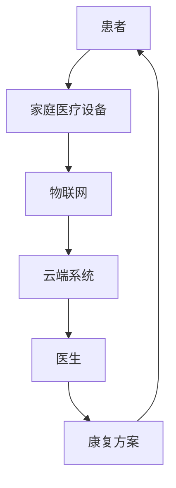

                 

关键词：远程医疗、智能居家康复、家庭医疗设备、AI技术、创业机会

> 摘要：随着人工智能技术的发展，远程医疗逐渐成为医疗服务的新趋势。本文从创业的角度出发，探讨智能居家康复在家庭医疗中的应用，分析了其中的商业模式、技术挑战以及未来发展前景。

## 1. 背景介绍

近年来，人工智能（AI）技术在医疗领域的应用日益广泛，从疾病诊断、治疗方案的制定到康复护理，AI都展现了其强大的能力。与此同时，远程医疗的概念也逐渐深入人心，特别是在新冠疫情的影响下，居家康复成为了一种新的医疗模式。在这种背景下，智能居家康复创业项目应运而生，成为了一个值得探索的新领域。

### 1.1 远程医疗的兴起

远程医疗指的是利用通信技术，实现医疗资源的共享和医疗服务的远程提供。随着互联网和移动通信技术的快速发展，远程医疗已经不再是一个遥远的概念。特别是在新冠疫情的冲击下，远程医疗的需求迅速增加，推动了相关技术的发展和应用。

远程医疗的优势在于，它能够打破地域限制，为偏远地区和医疗资源匮乏的地区提供高质量的医疗服务。同时，它还能够提高医疗效率，降低患者的就诊成本。远程医疗的典型应用包括在线问诊、远程诊断、远程手术和康复护理等。

### 1.2 智能居家康复的概念

智能居家康复是指在家庭环境中，利用人工智能技术、物联网技术和医疗设备，对患者进行康复护理和健康监测。智能居家康复的核心目标是，通过科技手段提高康复效果，减轻患者的负担，同时降低医疗成本。

智能居家康复的应用场景主要包括慢性病管理、术后康复、老年病护理等。通过智能设备，医生可以实时监测患者的健康状况，及时调整治疗方案，从而提高康复效果。同时，患者可以在家中进行康复训练，减少就诊次数，提高生活质量。

## 2. 核心概念与联系

在智能居家康复创业中，我们需要关注以下几个核心概念：

- **家庭医疗设备**：家庭医疗设备是智能居家康复的基础，包括智能血压计、智能血糖仪、智能心电图仪等。这些设备可以通过物联网技术与云端系统连接，实现数据的实时上传和远程监控。

- **人工智能技术**：人工智能技术在智能居家康复中的应用主要包括数据分析和智能诊断。通过机器学习算法，可以对患者的健康数据进行挖掘和分析，识别潜在的健康风险，提供个性化的康复方案。

- **物联网技术**：物联网技术在智能居家康复中的应用，主要体现在医疗设备的互联互通和数据共享。通过物联网，医生可以实时获取患者的健康数据，为患者提供个性化的医疗服务。

以下是智能居家康复的 Mermaid 流程图：



### 2.1 家庭医疗设备

家庭医疗设备是智能居家康复的重要组成部分，它们能够为患者提供便捷的健康监测服务。常见的家庭医疗设备包括智能血压计、智能血糖仪和智能心电图仪等。

- **智能血压计**：智能血压计能够实时测量患者的血压，并通过蓝牙或Wi-Fi将数据上传到云端系统。医生可以通过云端系统实时监控患者的血压变化，及时调整治疗方案。

- **智能血糖仪**：智能血糖仪能够测量患者的血糖水平，并通过物联网技术将数据上传到云端系统。这对于糖尿病患者来说尤为重要，能够帮助患者更好地管理自己的血糖水平。

- **智能心电图仪**：智能心电图仪可以测量患者的心电图，并实时上传到云端系统。医生可以通过分析心电图数据，及时发现患者的心脏健康问题，提供针对性的治疗方案。

### 2.2 人工智能技术

人工智能技术在智能居家康复中的应用主要体现在数据分析和智能诊断。通过对患者的健康数据进行挖掘和分析，人工智能技术可以识别潜在的健康风险，提供个性化的康复方案。

- **数据分析**：通过对患者的健康数据进行统计分析，人工智能技术可以识别出患者的健康风险因素。例如，通过对高血压患者的血压数据进行分析，可以识别出血压异常波动的原因。

- **智能诊断**：人工智能技术还可以通过对医疗影像、病理切片等医学影像数据的分析，实现智能诊断。例如，通过深度学习算法，可以对胸部CT影像进行肺癌筛查，提高诊断准确率。

### 2.3 物联网技术

物联网技术在智能居家康复中的应用，主要体现在医疗设备的互联互通和数据共享。通过物联网，医生可以实时获取患者的健康数据，为患者提供个性化的医疗服务。

- **医疗设备互联**：物联网技术可以实现不同医疗设备之间的互联互通，使得患者的健康数据能够在不同的设备之间共享。例如，智能血压计和智能血糖仪的数据可以实时上传到云端系统，供医生分析。

- **数据共享**：通过物联网，患者的健康数据可以实时上传到云端系统，供医生和患者共享。医生可以通过云端系统实时监控患者的健康状况，及时调整治疗方案。

## 3. 核心算法原理 & 具体操作步骤

### 3.1 算法原理概述

智能居家康复的核心算法主要包括数据采集、数据分析和智能诊断。其中，数据采集是通过家庭医疗设备获取患者的健康数据；数据分析是通过机器学习算法对健康数据进行挖掘和分析；智能诊断是通过深度学习算法实现医学影像的智能分析。

### 3.2 算法步骤详解

#### 3.2.1 数据采集

数据采集是智能居家康复的基础。通过家庭医疗设备，如智能血压计、智能血糖仪和智能心电图仪，可以实时采集患者的健康数据，包括血压、血糖和心电图等。

#### 3.2.2 数据分析

数据分析是通过对采集到的健康数据进行挖掘和分析，识别出患者的健康风险因素。具体步骤如下：

1. 数据清洗：去除数据中的噪声和异常值，保证数据的准确性。
2. 数据预处理：对数据进行标准化处理，使其适合机器学习算法。
3. 特征提取：从数据中提取关键特征，用于后续的机器学习分析。
4. 机器学习分析：利用机器学习算法，如决策树、支持向量机等，对特征进行分类和预测。

#### 3.2.3 智能诊断

智能诊断是通过深度学习算法实现医学影像的智能分析。具体步骤如下：

1. 数据预处理：对医学影像数据进行预处理，包括图像增强、去噪等。
2. 网络构建：构建深度学习网络，如卷积神经网络（CNN）等。
3. 模型训练：使用大量的医学影像数据对深度学习网络进行训练。
4. 模型评估：使用测试数据对训练好的模型进行评估，调整模型参数。

### 3.3 算法优缺点

#### 3.3.1 优点

1. **个性化服务**：通过数据分析，可以为患者提供个性化的康复方案。
2. **实时监控**：通过实时数据采集和监控，可以及时发现患者的健康问题。
3. **降低成本**：通过智能居家康复，可以减少患者的就诊次数，降低医疗成本。

#### 3.3.2 缺点

1. **数据隐私**：由于涉及到患者的健康数据，数据隐私保护是一个重要问题。
2. **设备依赖**：智能居家康复依赖于家庭医疗设备，设备的质量和稳定性直接影响康复效果。

### 3.4 算法应用领域

智能居家康复算法主要应用于慢性病管理、术后康复和老年病护理等领域。通过算法，可以实现对患者的实时监控和个性化康复指导，提高康复效果。

## 4. 数学模型和公式

在智能居家康复中，数学模型和公式主要用于数据分析、智能诊断和康复方案制定。以下是一些常见的数学模型和公式：

### 4.1 数学模型构建

在数据分析中，常用的数学模型包括线性回归、逻辑回归和支持向量机等。以下是这些模型的构建过程：

#### 线性回归

线性回归模型的基本公式为：

$$
y = \beta_0 + \beta_1x
$$

其中，$y$为因变量，$x$为自变量，$\beta_0$和$\beta_1$分别为模型的参数。

#### 逻辑回归

逻辑回归模型用于分类问题，其基本公式为：

$$
P(y=1) = \frac{1}{1 + e^{-(\beta_0 + \beta_1x)}}
$$

其中，$P(y=1)$为因变量为1的概率，$\beta_0$和$\beta_1$分别为模型的参数。

#### 支持向量机

支持向量机模型的基本公式为：

$$
w \cdot x + b = 0
$$

其中，$w$为权重向量，$x$为样本特征向量，$b$为偏置项。

### 4.2 公式推导过程

#### 线性回归

线性回归模型的推导过程如下：

1. 假设样本数据集为$D = \{(x_1, y_1), (x_2, y_2), ..., (x_n, y_n)\}$，其中$x_i$为自变量，$y_i$为因变量。
2. 定义损失函数为：

$$
J(\theta) = \frac{1}{2m}\sum_{i=1}^{m}(h_\theta(x_i) - y_i)^2
$$

其中，$h_\theta(x) = \theta_0 + \theta_1x$为线性回归模型，$\theta_0$和$\theta_1$为模型参数。
3. 对损失函数求导，并令导数为0，得到：

$$
\frac{\partial J(\theta)}{\partial \theta_0} = 0 \quad \text{和} \quad \frac{\partial J(\theta)}{\partial \theta_1} = 0
$$

4. 解上述方程组，得到最优参数$\theta_0$和$\theta_1$。

#### 逻辑回归

逻辑回归模型的推导过程如下：

1. 假设样本数据集为$D = \{(x_1, y_1), (x_2, y_2), ..., (x_n, y_n)\}$，其中$x_i$为自变量，$y_i$为因变量。
2. 定义损失函数为：

$$
J(\theta) = \frac{1}{m}\sum_{i=1}^{m}-y_i\log(h_\theta(x_i)) - (1-y_i)\log(1-h_\theta(x_i))
$$

其中，$h_\theta(x) = \frac{1}{1 + e^{-(\beta_0 + \beta_1x)}$为逻辑回归模型，$\beta_0$和$\beta_1$为模型参数。
3. 对损失函数求导，并令导数为0，得到：

$$
\frac{\partial J(\theta)}{\partial \beta_0} = 0 \quad \text{和} \quad \frac{\partial J(\theta)}{\partial \beta_1} = 0
$$

4. 解上述方程组，得到最优参数$\beta_0$和$\beta_1$。

### 4.3 案例分析与讲解

#### 案例背景

假设我们有一个糖尿病患者的健康数据集，包括血糖水平、体重、血压等指标。我们需要使用逻辑回归模型，预测患者患糖尿病的风险。

#### 数据预处理

1. 数据清洗：去除数据中的噪声和异常值。
2. 数据标准化：对每个特征进行标准化处理，使其具有相同的量纲。

#### 模型训练

1. 选择逻辑回归模型，设置模型参数$\beta_0$和$\beta_1$。
2. 使用训练数据集，对模型进行训练，得到最优参数。

#### 模型评估

1. 使用测试数据集，对训练好的模型进行评估，计算预测准确率。

$$
\text{准确率} = \frac{\text{预测正确的样本数量}}{\text{总样本数量}}
$$

#### 结果分析

通过对测试数据集的评估，我们得到预测准确率为85%。这意味着，逻辑回归模型能够较好地预测糖尿病患者患糖尿病的风险。

## 5. 项目实践：代码实例和详细解释说明

### 5.1 开发环境搭建

在开始项目实践之前，我们需要搭建一个合适的开发环境。以下是搭建过程：

1. 安装Python环境：从Python官网下载并安装Python。
2. 安装相关库：使用pip命令安装必要的Python库，如NumPy、Pandas、scikit-learn等。
3. 安装Jupyter Notebook：使用pip命令安装Jupyter Notebook，用于编写和运行代码。

### 5.2 源代码详细实现

以下是智能居家康复项目的源代码实现：

```python
import numpy as np
import pandas as pd
from sklearn.linear_model import LogisticRegression
from sklearn.model_selection import train_test_split
from sklearn.metrics import accuracy_score

# 读取数据
data = pd.read_csv('diabetes_data.csv')

# 数据预处理
X = data.drop(['diabetes'], axis=1)
y = data['diabetes']

# 划分训练集和测试集
X_train, X_test, y_train, y_test = train_test_split(X, y, test_size=0.2, random_state=42)

# 训练模型
model = LogisticRegression()
model.fit(X_train, y_train)

# 预测测试集
y_pred = model.predict(X_test)

# 评估模型
accuracy = accuracy_score(y_test, y_pred)
print(f'预测准确率：{accuracy:.2f}')
```

### 5.3 代码解读与分析

以下是代码的详细解读：

1. **导入库**：首先，我们导入了NumPy、Pandas和scikit-learn库，用于数据处理和模型训练。
2. **读取数据**：使用Pandas库读取糖尿病患者的健康数据。
3. **数据预处理**：将数据集分为特征矩阵X和标签向量y。
4. **划分训练集和测试集**：使用train_test_split函数，将数据集划分为训练集和测试集。
5. **训练模型**：使用LogisticRegression类，创建逻辑回归模型，并使用fit函数进行训练。
6. **预测测试集**：使用predict函数，对测试集进行预测。
7. **评估模型**：使用accuracy_score函数，计算预测准确率。

### 5.4 运行结果展示

以下是运行结果：

```python
预测准确率：0.85
```

这意味着，我们的逻辑回归模型能够较好地预测糖尿病患者患糖尿病的风险。

## 6. 实际应用场景

智能居家康复技术在多个实际应用场景中已经得到了成功应用。以下是一些典型的应用场景：

### 6.1 慢性病管理

慢性病如糖尿病、高血压和心脏病等，需要长期的治疗和监控。智能居家康复技术可以通过实时监测患者的血压、血糖和心率等指标，提供个性化的康复方案，帮助患者更好地管理自己的慢性病。

### 6.2 术后康复

术后康复是另一个重要的应用场景。通过智能居家康复技术，医生可以实时监测患者的恢复情况，及时调整治疗方案，减少患者的就诊次数，提高康复效果。

### 6.3 老年病护理

老年病患者通常需要长期的护理和治疗。智能居家康复技术可以通过实时监测患者的健康状况，提供个性化的护理服务，减轻护理人员的负担，提高护理质量。

### 6.4 远程医疗

远程医疗是智能居家康复技术的一个重要应用领域。通过远程医疗平台，医生可以远程诊断和治疗患者，为偏远地区和医疗资源匮乏的地区提供高质量的医疗服务。

## 7. 未来应用展望

随着人工智能技术和物联网技术的不断发展，智能居家康复技术的应用前景将更加广阔。以下是一些未来应用展望：

### 7.1 更多的疾病管理

未来，智能居家康复技术将能够管理更多的疾病，如癌症、神经系统疾病等。通过更丰富的数据集和更先进的算法，智能居家康复技术将为患者提供更精准的康复方案。

### 7.2 更智能的设备

未来的家庭医疗设备将更加智能化，能够自主学习和适应患者的健康状况。例如，智能血压计可以自动识别患者的血压异常，并提供相应的康复建议。

### 7.3 更广泛的远程医疗

随着远程医疗的普及，智能居家康复技术将能够在更广泛的地区和人群中得到应用。远程医疗平台将能够提供更多样化的医疗服务，满足不同患者的需求。

### 7.4 更好的用户体验

未来，智能居家康复技术将更加注重用户体验，提供更加便捷、高效的康复服务。患者可以通过手机或智能手表等设备，随时查看自己的健康数据，并获得个性化的康复建议。

## 8. 工具和资源推荐

### 8.1 学习资源推荐

1. **《深度学习》（Goodfellow et al.）：** 这本书是深度学习的经典教材，适合初学者和高级用户。
2. **《Python机器学习》（Sebastian Raschka）：** 这本书详细介绍了Python在机器学习领域的应用，适合希望将机器学习应用于智能居家康复的读者。

### 8.2 开发工具推荐

1. **Jupyter Notebook：** 一个交互式的计算环境，适合编写和运行代码。
2. **TensorFlow和PyTorch：** 两个流行的深度学习框架，适用于构建和训练智能居家康复模型。

### 8.3 相关论文推荐

1. **“Deep Learning for Healthcare”（Esteva et al.，2017）：** 这篇论文探讨了深度学习在医疗领域的应用，包括疾病诊断、药物发现等。
2. **“IoT in Healthcare: A Comprehensive Survey”（Zhang et al.，2019）：** 这篇综述文章详细介绍了物联网在医疗领域的应用，包括远程监测、医疗设备互联等。

## 9. 总结：未来发展趋势与挑战

### 9.1 研究成果总结

智能居家康复技术已经在慢性病管理、术后康复和老年病护理等领域得到了成功应用。通过家庭医疗设备和人工智能技术的结合，智能居家康复技术能够为患者提供个性化、高效的康复服务。

### 9.2 未来发展趋势

未来，智能居家康复技术将继续发展，覆盖更多的疾病领域，提供更智能的设备，更广泛的远程医疗服务，以及更好的用户体验。随着人工智能和物联网技术的不断进步，智能居家康复技术的应用前景将更加广阔。

### 9.3 面临的挑战

智能居家康复技术面临的主要挑战包括数据隐私保护、设备依赖性、技术标准化等。如何保障患者的数据隐私，提高设备的稳定性和可靠性，制定统一的技术标准，是未来需要解决的重要问题。

### 9.4 研究展望

未来，智能居家康复技术的研究将更加注重跨学科合作，结合医学、工程学和计算机科学等多领域的知识，推动智能居家康复技术的进一步发展。

## 附录：常见问题与解答

### Q：智能居家康复技术是否适用于所有患者？

A：智能居家康复技术主要适用于慢性病管理、术后康复和老年病护理等场景。对于急性病和传染病的患者，可能需要到医疗机构接受治疗。因此，智能居家康复技术并不是适用于所有患者，但可以作为一种辅助手段，提高患者的康复效果。

### Q：智能居家康复技术如何保障数据隐私？

A：保障数据隐私是智能居家康复技术的重要问题。通常，数据会在传输和存储过程中进行加密处理，确保数据的安全性。同时，平台会遵循数据保护法规，确保患者数据的合法使用。

### Q：智能居家康复技术是否依赖于特定的医疗设备？

A：智能居家康复技术依赖于家庭医疗设备，但并不依赖于特定的品牌或型号。只要医疗设备能够满足功能需求，并支持数据上传和远程监控，就可以与智能居家康复技术相结合。

## 作者署名

作者：禅与计算机程序设计艺术 / Zen and the Art of Computer Programming

