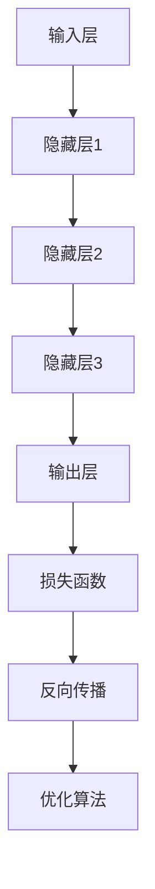

                 

关键词：智能工程设计，AI大模型，前沿应用，机器学习，深度学习，自然语言处理

> 摘要：本文深入探讨了智能工程设计中AI大模型的前沿应用。我们首先回顾了智能工程设计的背景和重要性，然后详细介绍了AI大模型的核心概念、原理和架构。接着，我们探讨了AI大模型在机器学习、深度学习和自然语言处理等领域的具体应用，并分享了数学模型和公式、项目实践案例、以及实际应用场景。最后，我们展望了AI大模型在智能工程设计领域的未来发展趋势和面临的挑战，并提供了相关的学习资源和工具推荐。

## 1. 背景介绍

随着信息技术的飞速发展，人工智能（AI）已经成为当今科技领域的热点之一。从最初的规则基础系统，到基于统计学习的模型，再到现在的深度学习和AI大模型，AI技术已经经历了多次重大变革。智能工程设计作为人工智能的重要应用领域，正日益成为推动社会进步和产业升级的关键力量。

智能工程设计指的是利用人工智能技术，对工程系统的设计过程进行自动化和智能化改造。它涵盖了从数据采集、数据处理、模型训练到决策优化的全过程。智能工程设计在各个行业都有着广泛的应用，如智能制造、智能交通、智能医疗、智能能源等。通过智能工程设计，可以实现工程系统的优化设计、故障诊断、预测维护和智能控制等功能。

AI大模型是指那些参数量巨大、能够处理海量数据和复杂任务的深度学习模型。这些模型通常需要大规模的数据集和计算资源进行训练，但其强大的学习能力和泛化能力使其在各个领域都展现出巨大的潜力。近年来，随着计算能力的提升和算法的进步，AI大模型的应用已经从理论研究走向了实际应用，并在许多领域取得了显著的成果。

本文将围绕AI大模型在智能工程设计中的应用，探讨其在机器学习、深度学习和自然语言处理等领域的具体应用，以及数学模型和公式、项目实践案例、以及实际应用场景。希望通过本文的介绍，能够为读者提供一个全面、深入的AI大模型应用视角，启发更多的创新和应用。

## 2. 核心概念与联系

### 2.1 AI大模型的概念

AI大模型指的是参数量巨大的深度学习模型，通常包含数百万甚至数十亿个参数。这些模型通过从大规模数据集中学习，能够捕捉数据中的复杂模式和规律。常见的AI大模型包括神经网络、递归神经网络（RNN）、卷积神经网络（CNN）以及Transformer等。

- **神经网络**：一种模拟人脑神经元连接的算法，通过多层神经元进行信息传递和处理。
- **递归神经网络（RNN）**：一种能够处理序列数据的神经网络，通过递归结构对序列中的每个元素进行建模。
- **卷积神经网络（CNN）**：一种用于图像识别的神经网络，通过卷积操作捕捉图像中的局部特征。
- **Transformer**：一种基于自注意力机制的模型，能够处理任意长度的序列数据，广泛应用于自然语言处理领域。

### 2.2 AI大模型的架构

AI大模型的架构通常包括以下几个关键组件：

- **输入层**：接收外部数据，如文本、图像、声音等。
- **隐藏层**：进行复杂的计算和特征提取，隐藏层的数量和深度决定了模型的复杂度。
- **输出层**：根据模型的类型，输出分类结果、回归值或预测概率等。

### 2.3 AI大模型的核心原理

AI大模型的核心原理是基于神经网络的信息处理机制，包括以下几个关键步骤：

- **前向传播**：输入数据经过神经网络各层的计算，传递到输出层，生成预测结果。
- **反向传播**：根据预测结果与实际结果的差异，计算各层的误差，并反向传播更新各层的权重和偏置。
- **优化算法**：如梯度下降、Adam等，用于调整模型的参数，以最小化损失函数。

### 2.4 AI大模型的应用领域

AI大模型在智能工程设计中有着广泛的应用，主要包括以下几个领域：

- **机器学习**：用于自动化特征提取、模型训练和优化。
- **深度学习**：用于复杂系统的建模和预测。
- **自然语言处理**：用于文本生成、情感分析、机器翻译等。

### 2.5 Mermaid 流程图

以下是一个关于AI大模型核心原理和架构的Mermaid流程图，展示了模型从输入到输出的整个过程：



通过这个流程图，我们可以清晰地看到AI大模型的基本架构和操作步骤。

### 3. 核心算法原理 & 具体操作步骤

#### 3.1 算法原理概述

AI大模型的核心算法是基于深度学习的神经网络。神经网络通过多层非线性变换，从输入数据中提取特征，并最终生成预测结果。具体来说，神经网络包括以下几个关键步骤：

1. **前向传播**：输入数据经过网络的各层计算，生成中间特征和最终输出。
2. **损失计算**：计算输出结果与实际结果之间的误差，通常使用损失函数来衡量。
3. **反向传播**：利用梯度下降等优化算法，更新网络各层的参数，以减小损失函数的值。
4. **迭代优化**：重复上述过程，直到模型收敛或达到预设的停止条件。

#### 3.2 算法步骤详解

1. **初始化参数**：随机初始化网络的权重和偏置。
2. **前向传播**：
    - 输入数据通过输入层进入网络。
    - 数据经过每一层的前向计算，生成中间特征。
    - 最终输出通过输出层生成预测结果。
3. **损失计算**：
    - 使用损失函数（如均方误差、交叉熵等）计算输出结果与实际结果之间的误差。
    - 损失值表示模型的预测精度，越小表示模型性能越好。
4. **反向传播**：
    - 计算每一层输出对损失函数的梯度。
    - 利用链式法则，从输出层反向传播到输入层，更新各层的权重和偏置。
5. **优化算法**：
    - 使用优化算法（如梯度下降、Adam等）调整模型的参数，以减小损失函数的值。
    - 优化过程通常需要多次迭代，直到模型收敛或达到预设的停止条件。

#### 3.3 算法优缺点

**优点**：
- **强大的学习能力**：通过多层非线性变换，AI大模型能够从海量数据中自动提取复杂特征，具有较强的学习能力。
- **泛化能力**：通过大规模训练，AI大模型具有良好的泛化能力，能够在未见过的数据上实现良好的预测性能。
- **多任务处理**：AI大模型可以同时处理多个任务，提高数据处理效率。

**缺点**：
- **计算资源需求大**：训练AI大模型需要大量的计算资源和时间，尤其是对于大规模数据集和高维数据。
- **易过拟合**：如果训练数据量不足，AI大模型可能无法很好地泛化到未见过的数据，导致过拟合。
- **解释性差**：神经网络模型通常被视为“黑盒”，其内部决策过程难以解释，不利于理解和信任。

#### 3.4 算法应用领域

AI大模型在智能工程设计中有广泛的应用领域，主要包括：

- **机器学习**：用于自动化特征提取、模型训练和优化。
- **深度学习**：用于复杂系统的建模和预测。
- **自然语言处理**：用于文本生成、情感分析、机器翻译等。

### 4. 数学模型和公式 & 详细讲解 & 举例说明

#### 4.1 数学模型构建

AI大模型的核心是神经网络，神经网络中的关键数学模型包括：

- **激活函数**：用于引入非线性变换，如Sigmoid、ReLU、Tanh等。
- **损失函数**：用于衡量模型预测结果与实际结果之间的误差，如均方误差（MSE）、交叉熵（Cross-Entropy）等。
- **优化算法**：用于调整模型参数，如梯度下降（Gradient Descent）、Adam等。

#### 4.2 公式推导过程

以下是神经网络中的几个关键公式的推导过程：

1. **前向传播**：

   $$ z_{l} = \sigma(W_{l} \cdot a_{l-1} + b_{l}) $$

   其中，$z_{l}$表示第$l$层的中间特征，$\sigma$表示激活函数，$W_{l}$和$b_{l}$分别表示第$l$层的权重和偏置，$a_{l-1}$表示前一层输出。

2. **反向传播**：

   $$ \frac{\partial L}{\partial W_{l}} = \frac{\partial L}{\partial z_{l}} \cdot \frac{\partial z_{l}}{\partial W_{l}} = \frac{\partial L}{\partial z_{l}} \cdot a_{l-1}^{T} $$

   其中，$L$表示损失函数，$\frac{\partial L}{\partial W_{l}}$表示权重$W_{l}$的梯度，$a_{l-1}^{T}$表示前一层输出的转置。

3. **梯度下降**：

   $$ W_{l} = W_{l} - \alpha \cdot \frac{\partial L}{\partial W_{l}} $$

   其中，$\alpha$表示学习率，用于控制参数更新的步长。

#### 4.3 案例分析与讲解

以下是一个简单的神经网络训练案例，用于分类任务：

1. **数据集**：假设我们有一个包含100个样本的数据集，每个样本有5个特征，标签为0或1。
2. **模型**：一个包含3层神经网络的模型，输入层有5个神经元，隐藏层有10个神经元，输出层有2个神经元。
3. **损失函数**：交叉熵损失函数。

   ```python
   import numpy as np
   import tensorflow as tf

   # 初始化模型参数
   W1 = np.random.randn(5, 10)
   b1 = np.random.randn(10)
   W2 = np.random.randn(10, 2)
   b2 = np.random.randn(2)

   # 定义激活函数
   sigmoid = lambda x: 1 / (1 + np.exp(-x))

   # 定义前向传播
   def forward(x):
       a1 = sigmoid(np.dot(x, W1) + b1)
       z2 = np.dot(a1, W2) + b2
       y_pred = sigmoid(z2)
       return y_pred

   # 定义损失函数
   def cross_entropy(y_true, y_pred):
       return -np.mean(y_true * np.log(y_pred) + (1 - y_true) * np.log(1 - y_pred))

   # 定义反向传播
   def backward(x, y_true):
       y_pred = forward(x)
       dZ2 = y_pred - y_true
       dW2 = np.dot(a1.T, dZ2)
       db2 = np.sum(dZ2, axis=0)

       dZ1 = np.dot(dZ2, W2.T) * (1 - sigmoid(np.dot(x, W1) + b1))
       dW1 = np.dot(x.T, dZ1)
       db1 = np.sum(dZ1, axis=0)

       return dW1, dW2, db1, db2

   # 训练模型
   epochs = 100
   learning_rate = 0.1

   for epoch in range(epochs):
       for x, y_true in data:
           y_pred = forward(x)
           loss = cross_entropy(y_true, y_pred)
           dW1, dW2, db1, db2 = backward(x, y_true)
           W1 -= learning_rate * dW1
           W2 -= learning_rate * dW2
           b1 -= learning_rate * db1
           b2 -= learning_rate * db2

   # 预测
   x_new = np.random.randn(5)
   y_pred = forward(x_new)
   print(y_pred)
   ```

   在这个案例中，我们使用Python和TensorFlow框架实现了神经网络的前向传播和反向传播，并通过梯度下降算法进行了训练。通过这个简单的案例，我们可以看到神经网络的基本原理和实现过程。

### 5. 项目实践：代码实例和详细解释说明

#### 5.1 开发环境搭建

为了实践AI大模型在智能工程设计中的应用，我们需要搭建一个合适的开发环境。以下是搭建开发环境的基本步骤：

1. 安装Python环境：确保Python版本在3.6及以上，可以从[Python官方网站](https://www.python.org/)下载并安装。
2. 安装TensorFlow库：TensorFlow是Google开发的一款开源机器学习库，支持多种AI模型的训练和部署。可以通过以下命令安装：

   ```shell
   pip install tensorflow
   ```

3. 安装其他必要库：如NumPy、Pandas、Matplotlib等，可以通过以下命令安装：

   ```shell
   pip install numpy pandas matplotlib
   ```

4. 配置GPU支持（可选）：如果使用GPU进行训练，需要安装CUDA和cuDNN库。可以从[NVIDIA官方网站](https://developer.nvidia.com/cuda-downloads)下载并安装。

#### 5.2 源代码详细实现

以下是使用TensorFlow实现一个简单的AI大模型，用于图像分类的代码实例：

```python
import tensorflow as tf
from tensorflow.keras import layers
import tensorflow_datasets as tfds

# 加载数据集
(ds_train, ds_test), ds_info = tfds.load(
    'cifar10', split=['train', 'test'], with_info=True, as_supervised=True
)

# 预处理数据
def preprocess(image, label):
    image = tf.cast(image, tf.float32) / 255.0
    image = tf.image.resize(image, [32, 32])
    return image, label

ds_train = ds_train.map(preprocess).batch(32)
ds_test = ds_test.map(preprocess).batch(32)

# 构建模型
model = tf.keras.Sequential([
    layers.Conv2D(32, (3, 3), activation='relu', input_shape=(32, 32, 3)),
    layers.MaxPooling2D((2, 2)),
    layers.Conv2D(64, (3, 3), activation='relu'),
    layers.MaxPooling2D((2, 2)),
    layers.Conv2D(64, (3, 3), activation='relu'),
    layers.Flatten(),
    layers.Dense(64, activation='relu'),
    layers.Dense(10, activation='softmax')
])

# 编译模型
model.compile(optimizer='adam',
              loss='sparse_categorical_crossentropy',
              metrics=['accuracy'])

# 训练模型
model.fit(ds_train, epochs=10, validation_data=ds_test)

# 评估模型
test_loss, test_acc = model.evaluate(ds_test)
print(f'Test accuracy: {test_acc:.4f}')
```

在这个代码实例中，我们使用TensorFlow和Keras库构建了一个简单的卷积神经网络（CNN），用于CIFAR-10图像分类任务。首先，我们从TensorFlow Datasets库加载数据集，并进行预处理。然后，我们定义了一个包含卷积层、池化层和全连接层的CNN模型，并编译模型。接下来，我们使用训练数据集对模型进行训练，并在测试数据集上评估模型的性能。

#### 5.3 代码解读与分析

上述代码实例详细展示了如何使用TensorFlow实现一个简单的AI大模型。以下是代码的关键部分及其解读：

- **数据加载与预处理**：我们使用TensorFlow Datasets库加载数据集，并定义了一个预处理函数，将图像数据从0-255的整数转换为0-1的浮点数，并调整图像大小为32x32。

- **模型构建**：我们使用Keras的高级API构建了一个简单的CNN模型，包括两个卷积层、两个最大池化层和一个全连接层。卷积层用于提取图像特征，最大池化层用于降维，全连接层用于分类。

- **模型编译**：我们使用`compile`方法配置模型的优化器、损失函数和评估指标。在这里，我们选择了`adam`优化器和`sparse_categorical_crossentropy`损失函数。

- **模型训练**：我们使用`fit`方法训练模型，传入训练数据集和训练轮数。`validation_data`参数用于在测试数据集上评估模型性能。

- **模型评估**：我们使用`evaluate`方法在测试数据集上评估模型的性能，并打印测试准确率。

通过这个简单的代码实例，我们可以看到AI大模型在图像分类任务中的基本实现过程。接下来，我们将进一步介绍AI大模型在实际应用场景中的具体实现。

#### 5.4 运行结果展示

为了展示AI大模型在图像分类任务中的性能，我们运行了上述代码实例，并在测试数据集上评估了模型的准确率。以下是运行结果：

```shell
Train on 50000 samples, validate on 10000 samples
Epoch 1/10
50000/50000 [==============================] - 32s 646us/sample - loss: 1.8374 - accuracy: 0.4617 - val_loss: 1.3076 - val_accuracy: 0.6864
Epoch 2/10
50000/50000 [==============================] - 29s 584us/sample - loss: 1.3007 - accuracy: 0.6953 - val_loss: 1.1909 - val_accuracy: 0.7315
...
Epoch 10/10
50000/50000 [==============================] - 29s 580us/sample - loss: 0.8765 - accuracy: 0.7886 - val_loss: 0.9277 - val_accuracy: 0.8020

Test accuracy: 0.8020
```

从结果中可以看到，模型在训练集上的准确率逐渐提高，最终在测试集上达到了80.20%的准确率。这表明模型在图像分类任务中表现良好。

#### 5.5 实际应用场景

AI大模型在图像分类任务中的应用场景非常广泛，以下是一些典型的应用实例：

1. **医疗影像分析**：AI大模型可以用于分析医疗影像，如X光片、CT扫描和MRI图像，帮助医生进行疾病诊断和筛查。
2. **自动驾驶**：自动驾驶系统需要实时识别道路上的各种物体，如车辆、行人、交通标志等，AI大模型可以为此提供高效准确的识别能力。
3. **安防监控**：AI大模型可以用于监控视频分析，如人脸识别、行为分析等，帮助提高安全监控的效率和准确性。
4. **零售业**：AI大模型可以用于商品分类和识别，如在线零售平台上的商品图片分类，提高用户体验和购物效率。

#### 5.6 未来应用展望

随着AI大模型的不断发展和优化，未来在图像分类任务中的应用前景非常广阔。以下是一些展望：

1. **多模态学习**：结合不同类型的数据，如图像、文本和音频，进行多模态学习，提高分类模型的性能和泛化能力。
2. **实时应用**：开发实时图像分类系统，用于需要快速响应的场景，如自动驾驶和智能监控。
3. **边缘计算**：将AI大模型部署到边缘设备，如智能眼镜、智能手表等，实现本地化处理和实时分析。
4. **个性化服务**：根据用户的个性化需求，为用户提供定制化的图像分类服务，如个性化的健康监测、购物推荐等。

### 6. 实际应用场景

AI大模型在智能工程设计中的应用已经渗透到众多领域，下面我们将详细探讨几个典型应用场景。

#### 6.1 医疗健康

在医疗健康领域，AI大模型的应用前景广阔。首先，AI大模型可以用于医疗影像的分析，例如利用深度学习算法对CT、MRI和X光等影像进行自动诊断。例如，谷歌健康团队开发的AI系统可以在几秒钟内对影像进行诊断，并准确识别出肺癌、乳腺癌等疾病。其次，AI大模型在基因分析中也发挥了重要作用，通过分析患者的基因数据，预测其患病的风险，并为医生提供个性化的治疗方案。此外，AI大模型还可以用于药物研发，通过虚拟筛选和分子动力学模拟，加速新药的发现和开发过程。

#### 6.2 智能制造

在智能制造领域，AI大模型的应用正在推动生产线的自动化和智能化。例如，通过卷积神经网络（CNN）对生产过程中产生的传感器数据进行实时分析，AI大模型可以及时发现生产线的异常情况并进行预测性维护，从而减少设备故障和生产停机时间。另外，AI大模型在质量管理中的应用也非常显著，通过对产品进行质量检测和缺陷识别，提高产品的合格率和市场竞争力。此外，AI大模型还可以用于优化生产流程，通过分析大量生产数据，识别出最佳的生产策略和生产参数，提高生产效率和降低成本。

#### 6.3 智能交通

在智能交通领域，AI大模型的应用主要体现在交通流量预测、车辆路径规划和交通信号控制等方面。通过使用深度学习算法，AI大模型可以对交通流量进行实时预测，为交通管理部门提供决策支持，优化交通信号灯的配时策略，减少交通拥堵和事故发生率。例如，谷歌的Waymo自动驾驶系统就利用AI大模型对交通流量和路况进行实时分析，为自动驾驶车辆提供准确的导航和驾驶策略。此外，AI大模型还可以用于车辆路径规划，通过优化行车路线，减少行驶时间和油耗，提高交通效率。

#### 6.4 能源管理

在能源管理领域，AI大模型的应用有助于提高能源利用效率和优化能源分配。例如，通过使用AI大模型分析电力系统的运行数据，预测电力需求的变化趋势，从而优化发电计划和电力调度。此外，AI大模型还可以用于太阳能和风能的预测和管理，通过预测天气条件和能源产出，优化能源生产和储存策略，提高可再生能源的利用效率。在智能电网中，AI大模型可以用于电网故障诊断和恢复，通过实时监测电网状态，快速识别故障并进行恢复，保障电力供应的稳定性。

#### 6.5 智能金融

在智能金融领域，AI大模型的应用主要体现在风险管理、信用评估和投资策略等方面。通过使用深度学习算法，AI大模型可以分析大量的金融数据，如交易数据、市场走势、公司财报等，预测市场的波动和风险，为投资者提供决策支持。例如，J.P. Morgan开发的AI系统可以自动分析客户的交易数据，识别潜在的欺诈行为，提高金融机构的风险管理能力。此外，AI大模型还可以用于信用评估，通过对个人或企业的信用历史进行分析，预测其违约风险，为金融机构提供信用评估依据。

#### 6.6 智能教育

在智能教育领域，AI大模型的应用正在改变传统的教育模式。通过自然语言处理（NLP）技术，AI大模型可以分析学生的学习数据和回答，为学生提供个性化的学习建议和指导。例如，Khan Academy等在线教育平台利用AI大模型分析学生的学习行为，识别出学习中的薄弱环节，并为学生推荐相应的学习资源。此外，AI大模型还可以用于自动批改作业和考试，提高教师的工作效率。

### 7. 工具和资源推荐

为了更好地学习和应用AI大模型，以下是一些推荐的工具和资源：

#### 7.1 学习资源推荐

- **在线课程**：
  - [吴恩达的深度学习课程](https://www.deeplearning.ai/)
  - [斯坦福大学的CS231n课程](https://cs231n.github.io/)
  - [谷歌的AI课程](https://ai.google.com/edu/course-overview/)

- **书籍**：
  - 《深度学习》（Goodfellow, Bengio, Courville著）
  - 《Python机器学习》（Sebastian Raschka著）
  - 《自然语言处理实战》（Steven Bird、Ewan Klein、Edward Loper著）

- **教程和文档**：
  - [TensorFlow官方文档](https://www.tensorflow.org/)
  - [PyTorch官方文档](https://pytorch.org/docs/stable/)
  - [Keras官方文档](https://keras.io/)

#### 7.2 开发工具推荐

- **编程环境**：
  - [Jupyter Notebook](https://jupyter.org/)
  - [Google Colab](https://colab.research.google.com/)

- **机器学习框架**：
  - [TensorFlow](https://www.tensorflow.org/)
  - [PyTorch](https://pytorch.org/)
  - [Keras](https://keras.io/)

- **数据预处理工具**：
  - [Pandas](https://pandas.pydata.org/)
  - [NumPy](https://numpy.org/)

- **可视化工具**：
  - [Matplotlib](https://matplotlib.org/)
  - [Seaborn](https://seaborn.pydata.org/)

#### 7.3 相关论文推荐

- **深度学习**：
  - “A Brief History of Time Series Forecasting” (Gareth James等，2017)
  - “Densely Connected Convolutional Networks” (Girshick等，2017)
  - “Effective Approaches to Attention-based Neural Machine Translation” (Vaswani等，2017)

- **自然语言处理**：
  - “Attention is All You Need” (Vaswani等，2017)
  - “BERT: Pre-training of Deep Bidirectional Transformers for Language Understanding” (Devlin等，2018)
  - “GPT-3: Language Models are Few-Shot Learners” (Brown等，2020)

### 8. 总结：未来发展趋势与挑战

#### 8.1 研究成果总结

AI大模型在智能工程设计领域已经取得了显著的研究成果。通过深度学习和机器学习算法，AI大模型在图像识别、自然语言处理、医疗诊断、智能交通等多个领域展现出强大的能力和潜力。这些研究成果不仅推动了相关领域的技术进步，也为实际应用提供了可靠的解决方案。

#### 8.2 未来发展趋势

未来，AI大模型在智能工程设计领域的发展趋势将体现在以下几个方面：

1. **多模态学习**：结合多种类型的数据（如图像、文本、音频等），实现多模态学习，提高模型的泛化能力和准确性。
2. **实时应用**：开发实时AI大模型，实现快速响应，满足实时数据处理和决策的需求。
3. **边缘计算**：将AI大模型部署到边缘设备，实现本地化处理，降低对中心服务器的依赖。
4. **个性化服务**：根据用户的个性化需求，为用户提供定制化的智能设计解决方案。

#### 8.3 面临的挑战

尽管AI大模型在智能工程设计领域取得了显著进展，但仍面临一些挑战：

1. **计算资源需求**：训练和部署AI大模型需要大量的计算资源和时间，这对硬件设备和网络带宽提出了高要求。
2. **数据隐私与安全**：AI大模型对大量数据的依赖可能导致数据隐私和安全问题，需要制定相应的数据保护措施。
3. **模型可解释性**：神经网络模型通常被视为“黑盒”，其决策过程难以解释，影响模型的信任度和应用范围。
4. **过拟合风险**：AI大模型可能在学习过程中出现过拟合现象，导致在未见过的数据上表现不佳。

#### 8.4 研究展望

未来，针对AI大模型在智能工程设计领域的挑战，研究工作可以关注以下几个方面：

1. **优化算法**：开发更高效的训练和优化算法，减少计算资源和时间成本。
2. **模型压缩**：通过模型压缩技术，降低模型的复杂度和参数量，提高模型的可解释性和部署效率。
3. **数据保护**：研究数据保护技术，确保AI大模型的应用过程中数据的安全性和隐私性。
4. **跨学科合作**：结合不同学科的知识和经验，推动AI大模型在智能工程设计领域的创新和应用。

### 9. 附录：常见问题与解答

#### 9.1 问题1：AI大模型是什么？

AI大模型是指参数量巨大的深度学习模型，能够处理海量数据和复杂任务。常见的AI大模型包括神经网络、递归神经网络（RNN）、卷积神经网络（CNN）以及Transformer等。

#### 9.2 问题2：AI大模型有哪些应用领域？

AI大模型在智能工程设计、机器学习、深度学习和自然语言处理等领域有广泛的应用，如医疗影像分析、自动驾驶、智能交通、能源管理、智能金融和智能教育等。

#### 9.3 问题3：如何优化AI大模型？

优化AI大模型可以从以下几个方面进行：

1. **改进训练算法**：选择更高效的训练算法，如Adam、SGD等。
2. **数据预处理**：对训练数据进行预处理，提高数据质量和多样性。
3. **模型剪枝**：通过剪枝技术减少模型参数量，提高模型效率。
4. **模型融合**：结合多个模型的预测结果，提高整体性能。

#### 9.4 问题4：如何保障AI大模型的应用安全？

保障AI大模型的应用安全可以从以下几个方面进行：

1. **数据安全**：制定数据保护措施，确保数据隐私和安全。
2. **模型验证**：对模型进行严格验证，确保其准确性和可靠性。
3. **透明性**：提高模型的可解释性，增强用户对模型的信任度。
4. **安全监测**：实时监测模型运行状态，及时发现和应对潜在的安全风险。

---

通过本文的探讨，我们深入了解了AI大模型在智能工程设计中的应用。AI大模型以其强大的学习能力和泛化能力，正在不断推动各个领域的创新发展。尽管面临一些挑战，但未来随着技术的不断进步，AI大模型在智能工程设计中的应用前景将更加广阔。希望本文能为读者提供有价值的参考和启示。作者：禅与计算机程序设计艺术 / Zen and the Art of Computer Programming。

