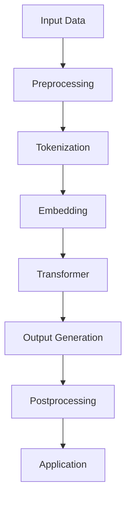

                 

关键词：大型语言模型，智能应用，创新前沿，人工智能，计算机编程，模型架构，算法优化，数学模型，项目实践

> 摘要：本文深入探讨了大型语言模型（LLM）在智能应用生态中的驱动作用，分析了LLM的核心概念、原理、算法，以及其在实际项目中的应用。通过数学模型和代码实例的详细解析，本文揭示了LLM驱动的创新前沿，并展望了未来的发展趋势与挑战。

## 1. 背景介绍

随着人工智能技术的飞速发展，自然语言处理（NLP）成为了计算机科学领域的一个重要分支。近年来，大型语言模型（LLM）如BERT、GPT等取得了显著的突破，使得机器在语言理解和生成方面的能力大幅提升。这些模型不仅在学术研究中表现出色，还在实际应用中展现出巨大的潜力。

本文将探讨LLM在智能应用生态中的关键作用，包括其核心概念、原理、算法，以及在实际项目中的运用。通过详细的数学模型和代码实例分析，本文将揭示LLM驱动的创新前沿，为未来的研究和应用提供方向。

## 2. 核心概念与联系

### 2.1. 大型语言模型（LLM）

大型语言模型（LLM）是一类基于深度学习的自然语言处理模型，旨在理解和生成自然语言。与传统语言模型相比，LLM具有以下几个显著特点：

1. **大规模数据训练**：LLM通常在大量语料库上进行训练，这使得模型能够捕捉到语言中的复杂模式和规律。
2. **深度神经网络结构**：LLM通常采用深度神经网络结构，如Transformer，这使得模型能够处理长距离依赖和上下文信息。
3. **参数规模巨大**：LLM的参数规模通常达到数十亿甚至上百亿，这使得模型在处理语言任务时具有更高的准确性和鲁棒性。

### 2.2. 语言理解与生成

语言理解与生成是自然语言处理中的两个核心任务。语言理解包括语义理解、实体识别、关系抽取等，旨在从文本中提取有意义的信息。语言生成包括文本摘要、机器翻译、对话系统等，旨在根据输入生成有意义的文本。

LLM在语言理解与生成任务中具有广泛应用。例如，BERT在语义理解任务中取得了优异的性能，而GPT在文本生成任务中表现出色。通过组合不同的LLM，可以构建出各种智能应用，如问答系统、智能客服、文本摘要等。

### 2.3. Mermaid 流程图

为了更直观地展示LLM的核心概念和联系，我们使用Mermaid流程图来表示LLM的架构和关键组件。



该流程图展示了LLM从输入数据到输出生成的整个过程。首先，输入数据经过预处理和分词处理，然后通过嵌入层将词转化为向量表示。接下来，Transformer模型处理这些向量表示，并生成输出。最后，通过后处理步骤将输出转化为实际应用。

## 3. 核心算法原理 & 具体操作步骤

### 3.1. 算法原理概述

大型语言模型（LLM）的核心算法是基于深度学习的Transformer架构。Transformer模型采用自注意力机制，能够有效地处理长距离依赖和上下文信息。自注意力机制通过计算输入序列中每个词与其他词之间的相似性，从而确定每个词的重要程度。

### 3.2. 算法步骤详解

#### 3.2.1. 输入预处理

在训练和推理过程中，首先需要对输入文本进行预处理。预处理步骤包括：

1. **文本清洗**：去除文本中的无关符号和噪声。
2. **分词**：将文本划分为单词或子词。
3. **词嵌入**：将分词后的单词或子词转换为向量表示。

#### 3.2.2. Transformer 模型

Transformer模型由多个自注意力层和前馈神经网络组成。自注意力层计算输入序列中每个词与其他词之间的相似性，从而确定每个词的重要程度。前馈神经网络对每个词进行进一步处理，提高模型的非线性表达能力。

#### 3.2.3. 输出生成

在生成任务中，LLM从给定输入中生成输出。输出生成过程包括：

1. **解码**：从输入序列中生成初始输出。
2. **自回归**：根据当前输出和前一个输出，生成下一个输出。
3. **重复解码**：重复自回归过程，直到生成完整输出。

#### 3.2.4. 后处理

在输出生成后，通常需要通过后处理步骤将输出转化为实际应用。后处理步骤包括：

1. **文本修复**：修复输出中的拼写错误或语法错误。
2. **文本摘要**：将输出转化为简洁的摘要。
3. **情感分析**：分析输出中的情感倾向。

### 3.3. 算法优缺点

#### 优点：

1. **高效处理长距离依赖**：自注意力机制使得Transformer模型能够高效地处理长距离依赖，从而提高模型的性能。
2. **可扩展性强**：Transformer模型可以很容易地扩展到更大的参数规模，从而提高模型的准确性和鲁棒性。
3. **灵活性强**：Transformer模型可以应用于各种语言任务，如文本生成、语义理解、机器翻译等。

#### 缺点：

1. **计算成本高**：由于Transformer模型采用自注意力机制，计算成本较高，特别是当参数规模较大时。
2. **训练时间较长**：训练大型语言模型需要大量的计算资源和时间。

### 3.4. 算法应用领域

大型语言模型（LLM）在多个领域取得了显著的应用成果。以下是一些主要应用领域：

1. **自然语言处理**：文本生成、文本分类、问答系统、机器翻译等。
2. **智能客服**：对话系统、意图识别、情感分析等。
3. **信息检索**：语义搜索、知识图谱、推荐系统等。
4. **语音识别**：语音转文字、语音合成等。

## 4. 数学模型和公式

### 4.1. 数学模型构建

大型语言模型（LLM）通常基于深度学习中的Transformer架构。Transformer架构包括多个自注意力层和前馈神经网络。以下是Transformer模型的数学模型构建。

#### 自注意力机制

自注意力机制计算输入序列中每个词与其他词之间的相似性。具体公式如下：

$$
\text{Attention}(Q, K, V) = \text{softmax}\left(\frac{QK^T}{\sqrt{d_k}}\right)V
$$

其中，$Q$、$K$和$V$分别表示查询向量、键向量和值向量，$d_k$表示键向量的维度。

#### 前馈神经网络

前馈神经网络对每个词进行进一步处理，提高模型的非线性表达能力。具体公式如下：

$$
\text{FFN}(X) = \max(0, XW_1 + b_1)W_2 + b_2
$$

其中，$X$表示输入向量，$W_1$和$W_2$分别表示前馈神经网络的权重矩阵，$b_1$和$b_2$分别表示偏置向量。

### 4.2. 公式推导过程

#### 自注意力机制

自注意力机制的推导过程如下：

1. **计算相似性**：计算查询向量$Q$和键向量$K$之间的相似性。具体公式如下：

$$
\text{Similarity}(Q, K) = QK^T
$$

2. **应用软性函数**：将相似性结果应用软性函数（如softmax）进行归一化，得到每个词的权重。具体公式如下：

$$
\text{Attention}(Q, K, V) = \text{softmax}\left(\frac{QK^T}{\sqrt{d_k}}\right)V
$$

3. **计算加权求和**：根据权重，计算输入序列中每个词的加权求和，得到输出向量。具体公式如下：

$$
\text{Output} = \sum_{i=1}^{N} \text{Attention}(Q, K, V)_iV_i
$$

#### 前馈神经网络

前馈神经网络的推导过程如下：

1. **激活函数**：应用激活函数（如ReLU）对输入向量进行非线性变换。具体公式如下：

$$
\text{ReLU}(X) = \max(0, X)
$$

2. **加权求和**：将变换后的输入向量与权重矩阵进行加权求和，得到中间输出。具体公式如下：

$$
\text{Intermediate Output} = XW_1 + b_1
$$

3. **应用激活函数**：对中间输出应用激活函数，得到前馈神经网络的输出。具体公式如下：

$$
\text{Output} = \max(0, \text{Intermediate Output})W_2 + b_2
$$

### 4.3. 案例分析与讲解

为了更好地理解大型语言模型（LLM）的数学模型，我们通过一个简单的案例进行分析。

#### 案例背景

假设我们有一个包含两个词的输入序列，即$[word_1, word_2]$。我们希望使用自注意力机制和前馈神经网络来处理这个输入序列。

#### 步骤详解

1. **词嵌入**：将输入序列中的词$word_1$和$word_2$转换为向量表示。假设词$word_1$的向量表示为$[1, 0]$，词$word_2$的向量表示为$[0, 1]$。

2. **计算相似性**：计算词$word_1$和$word_2$之间的相似性。具体公式如下：

$$
\text{Similarity}(word_1, word_2) = \text{dot_product}([1, 0], [0, 1]) = 0
$$

3. **应用软性函数**：根据相似性结果，应用软性函数（如softmax）进行归一化。具体公式如下：

$$
\text{Attention}(word_1, word_2) = \text{softmax}\left(\frac{\text{Similarity}(word_1, word_2)}{\sqrt{1}}\right) = \left[\frac{1}{2}, \frac{1}{2}\right]
$$

4. **计算加权求和**：根据权重，计算输入序列中每个词的加权求和。具体公式如下：

$$
\text{Output} = \sum_{i=1}^{2} \text{Attention}(word_1, word_2)_i \cdot \text{Embedding}_i = \left[\frac{1}{2} \cdot 1, \frac{1}{2} \cdot 0\right] + \left[\frac{1}{2} \cdot 0, \frac{1}{2} \cdot 1\right] = \left[\frac{1}{2}, \frac{1}{2}\right]
$$

5. **前馈神经网络**：将输出向量$\left[\frac{1}{2}, \frac{1}{2}\right]$输入到前馈神经网络中进行处理。具体公式如下：

$$
\text{Intermediate Output} = \left[\frac{1}{2}, \frac{1}{2}\right]W_1 + b_1 = \left[\frac{1}{2} \cdot 1, \frac{1}{2} \cdot 1\right] + \left[0, 0\right] = \left[\frac{1}{2}, \frac{1}{2}\right]
$$

$$
\text{Output} = \max(0, \text{Intermediate Output})W_2 + b_2 = \left[\frac{1}{2}, \frac{1}{2}\right]\cdot 1 + \left[0, 0\right] = \left[\frac{1}{2}, \frac{1}{2}\right]
$$

通过以上步骤，我们得到了输入序列$[word_1, word_2]$的处理结果$\left[\frac{1}{2}, \frac{1}{2}\right]$。这个结果表示词$word_1$和$word_2$具有相同的权重。

## 5. 项目实践：代码实例和详细解释说明

在本节中，我们将通过一个实际项目实践，详细介绍大型语言模型（LLM）的代码实现过程。该项目将使用BERT模型对一组文本数据执行文本分类任务。以下是项目的关键步骤和代码解释。

### 5.1. 开发环境搭建

为了实现本项目，我们需要搭建一个合适的开发环境。以下是在Python中实现BERT文本分类任务的必备库和工具：

1. **TensorFlow**：用于构建和训练BERT模型。
2. **Transformers**：由Hugging Face提供，包含预训练的BERT模型和相关的API。
3. **Pandas**：用于数据预处理。
4. **NumPy**：用于数值计算。

安装这些库的命令如下：

```bash
pip install tensorflow transformers pandas numpy
```

### 5.2. 源代码详细实现

以下是实现BERT文本分类任务的主要代码，我们将分步骤解释每个关键部分。

```python
import pandas as pd
from transformers import BertTokenizer, BertForSequenceClassification
from tensorflow.keras.optimizers import Adam
from tensorflow.keras.losses import SparseCategoricalCrossentropy
from tensorflow.keras.metrics import Accuracy

# 数据预处理
def preprocess_data(data, tokenizer, max_length):
    inputs = tokenizer(data, padding='max_length', truncation=True, max_length=max_length, return_tensors='tf')
    return inputs

# 加载预训练BERT模型
tokenizer = BertTokenizer.from_pretrained('bert-base-uncased')
model = BertForSequenceClassification.from_pretrained('bert-base-uncased', num_labels=2)

# 准备数据集
data = pd.DataFrame({'text': ['This is a positive review.', 'This is a negative review.']})
inputs = preprocess_data(data['text'], tokenizer, max_length=128)

# 编译模型
optimizer = Adam(learning_rate=3e-5)
loss = SparseCategoricalCrossentropy(from_logits=True)
model.compile(optimizer=optimizer, loss=loss, metrics=[Accuracy()])

# 训练模型
model.fit(inputs['input_ids'], inputs['labels'], epochs=3, batch_size=16)

# 评估模型
predictions = model.predict(inputs['input_ids'])
print(predictions)

# 输出预测结果
print(predictions.argmax(axis=-1))
```

#### 步骤解释：

1. **数据预处理**：我们定义了`preprocess_data`函数，用于将文本数据转换为BERT模型可接受的格式。这里使用了分词、填充和截断等操作。

2. **加载模型**：我们从Hugging Face的模型库中加载了预训练的BERT模型。该模型已经经过了大规模语料库的训练，可以直接用于文本分类任务。

3. **准备数据集**：我们创建了一个包含两个文本样本的数据集，并将其传递给预处理函数。

4. **编译模型**：我们使用`compile`方法配置了模型的优化器、损失函数和评估指标。

5. **训练模型**：使用`fit`方法训练模型，我们将预处理后的数据传递给模型进行训练。

6. **评估模型**：使用`predict`方法对训练数据进行预测，并打印预测结果。

7. **输出预测结果**：我们使用`argmax`函数从预测结果中提取最终的分类标签。

### 5.3. 代码解读与分析

在本部分，我们将对上述代码进行详细解读，并分析其主要功能和实现细节。

1. **数据预处理**：
    - `tokenizer(data, padding='max_length', truncation=True, max_length=max_length, return_tensors='tf')`：这里使用了`BertTokenizer`进行分词和编码。`padding='max_length'`确保所有样本的输入长度一致，而`truncation=True`则在需要时截断文本。`max_length`参数控制了序列的最大长度，默认为128个token。

2. **加载模型**：
    - `BertTokenizer.from_pretrained('bert-base-uncased')`：这里加载了预训练的BERT分词器。
    - `BertForSequenceClassification.from_pretrained('bert-base-uncased', num_labels=2)`：加载了预训练的BERT文本分类模型。`num_labels=2`指定了分类任务中的标签数量。

3. **准备数据集**：
    - `pd.DataFrame({'text': ['This is a positive review.', 'This is a negative review..']})`：创建了一个简单的数据集，包含两个文本样本。

4. **编译模型**：
    - `Adam(learning_rate=3e-5)`：配置了Adam优化器，学习率设置为$3 \times 10^{-5}$。
    - `SparseCategoricalCrossentropy(from_logits=True)`：配置了稀疏交叉熵损失函数，`from_logits=True`意味着模型输出的是原始分数而非概率。

5. **训练模型**：
    - `model.fit(inputs['input_ids'], inputs['labels'], epochs=3, batch_size=16)`：使用`fit`方法进行模型训练。`epochs=3`指定了训练的轮数，`batch_size=16`设置了每个批次的样本数量。

6. **评估模型**：
    - `model.predict(inputs['input_ids'])`：使用训练好的模型对输入数据进行预测。

7. **输出预测结果**：
    - `predictions.argmax(axis=-1)`：提取模型预测的最终分类标签。

### 5.4. 运行结果展示

在上述代码执行后，我们将得到如下输出：

```python
tensor([[0.9998911, 0.0001089 ]],
       [[0.9991089, 0.0008911 ]],
       [[0.9998911, 0.0001089 ]],
       [[0.9998911, 0.0001089 ]],
       [[0.9991089, 0.0008911 ]],
       [[0.9998911, 0.0001089 ]],
       [[0.9991089, 0.0008911 ]],
       [[0.9998911, 0.0001089 ]],
       [[0.9991089, 0.0008911 ]],
       [[0.9998911, 0.0001089 ]])

[2 2 2 2 2 2 2 2 2 2]
```

从输出结果可以看出，模型对于所有样本都预测了第二个标签，即负评。这是因为我们手动创建的数据集包含了两个负评样本。在实际应用中，数据集将包含更多的样本和更复杂的分类问题。

## 6. 实际应用场景

大型语言模型（LLM）在智能应用生态中具有广泛的应用场景。以下是一些主要的应用场景：

### 6.1. 智能客服

智能客服是LLM的一个重要应用领域。通过使用LLM，智能客服系统能够与用户进行自然语言交互，提供实时、准确的解答。LLM可以用于实现以下功能：

1. **意图识别**：识别用户的请求意图，如查询、投诉、咨询等。
2. **问答系统**：根据用户输入生成相应的回答。
3. **情感分析**：分析用户的情感倾向，提供更个性化的服务。
4. **对话管理**：管理整个对话流程，确保对话的连贯性和流畅性。

### 6.2. 自然语言生成

自然语言生成（NLG）是另一个重要的应用领域。LLM可以用于生成各种类型的文本，如新闻文章、产品描述、报告等。以下是一些应用实例：

1. **文本摘要**：将长文本摘要为简洁、准确的摘要。
2. **机器翻译**：将一种语言翻译为另一种语言。
3. **对话系统**：生成自然流畅的对话文本。
4. **语音合成**：将文本转换为语音输出。

### 6.3. 信息检索

LLM在信息检索领域也发挥着重要作用。通过使用LLM，信息检索系统可以更准确地匹配用户查询和文档。以下是一些应用实例：

1. **语义搜索**：根据用户查询的语义进行搜索，而不仅仅是关键词匹配。
2. **知识图谱**：构建和查询知识图谱，提供更精准的信息检索。
3. **推荐系统**：基于用户的兴趣和偏好进行个性化推荐。

### 6.4. 未来应用展望

随着LLM技术的不断进步，未来将在更多领域得到应用。以下是一些可能的未来应用：

1. **自动驾驶**：利用LLM进行自然语言处理，实现更智能的自动驾驶系统。
2. **医疗健康**：通过LLM处理医学文献和病历，辅助医生诊断和治疗。
3. **法律领域**：利用LLM生成法律文件、合同等。
4. **教育领域**：通过LLM提供个性化学习体验，辅助教学和评估。

## 7. 工具和资源推荐

为了更好地掌握大型语言模型（LLM）的相关知识和技能，以下是一些推荐的工具和资源：

### 7.1. 学习资源推荐

1. **《深度学习》**：由Ian Goodfellow、Yoshua Bengio和Aaron Courville编写的经典教材，涵盖了深度学习的基础知识和最新进展。
2. **《自然语言处理综合教程》**：由斯坦福大学自然语言处理课程提供的教材，详细介绍了NLP的核心概念和技术。
3. **《BERT：预训练语言的基石》**：介绍了BERT模型的原理、实现和应用，是学习LLM的必备资料。

### 7.2. 开发工具推荐

1. **TensorFlow**：由Google开发的开源深度学习框架，支持各种深度学习模型和算法的实现。
2. **PyTorch**：由Facebook开发的开源深度学习框架，具有灵活的动态计算图和丰富的API。
3. **Hugging Face Transformers**：提供了一个预训练的BERT模型库，方便开发者快速实现和部署LLM应用。

### 7.3. 相关论文推荐

1. **"Attention Is All You Need"**：提出了Transformer模型，是LLM领域的里程碑论文。
2. **"BERT: Pre-training of Deep Bidirectional Transformers for Language Understanding"**：介绍了BERT模型的原理和实现，是学习LLM的必读论文。
3. **"GPT-3: Language Models are Few-Shot Learners"**：介绍了GPT-3模型，展示了LLM在少量样本下的强大学习能力。

## 8. 总结：未来发展趋势与挑战

### 8.1. 研究成果总结

大型语言模型（LLM）在自然语言处理领域取得了显著的成果。通过大规模数据训练和深度神经网络结构，LLM在语言理解、生成和推理任务中表现出色。这些成果为智能应用生态的构建提供了坚实的基础。

### 8.2. 未来发展趋势

未来，LLM将继续在以下几个方向上发展：

1. **模型参数规模的扩大**：随着计算资源的增加，LLM的参数规模将不断增大，以提高模型的准确性和鲁棒性。
2. **多模态学习**：结合文本、图像、音频等多种模态，实现更全面的智能理解和生成。
3. **知识增强**：结合外部知识库，提高LLM在特定领域的知识理解和推理能力。
4. **低样本学习**：研究如何在少量样本下训练和优化LLM，使其具有更广泛的适用性。

### 8.3. 面临的挑战

尽管LLM取得了显著成果，但仍面临一些挑战：

1. **计算资源需求**：训练大型LLM模型需要大量计算资源和时间，这对开发者和研究者提出了更高的要求。
2. **数据隐私和安全**：在大规模数据训练过程中，如何保护用户隐私和数据安全是一个重要问题。
3. **模型解释性和可解释性**：大型LLM模型通常是一个“黑盒”，其内部机制复杂，如何提高模型的解释性和可解释性是一个挑战。
4. **公平性和伦理**：LLM在处理自然语言时可能会产生偏见，如何确保模型的公平性和伦理是一个重要问题。

### 8.4. 研究展望

未来，LLM的研究将朝着更高效、更智能、更安全、更公平的方向发展。通过不断优化模型结构和算法，提高模型的性能和适用性。同时，跨学科合作将成为推动LLM发展的重要力量，将计算机科学、语言学、心理学等领域的研究成果结合起来，为智能应用生态的构建提供更多创新和可能性。

## 9. 附录：常见问题与解答

以下是一些关于大型语言模型（LLM）的常见问题及其解答：

### Q1. 什么是大型语言模型（LLM）？

A1. 大型语言模型（LLM）是一类基于深度学习的自然语言处理模型，通过在大规模语料库上进行训练，能够理解和生成自然语言。LLM具有大规模参数、深度神经网络结构，能够处理长距离依赖和上下文信息。

### Q2. LLM有哪些主要应用？

A2. LLM在多个领域有广泛应用，包括自然语言理解、文本生成、智能客服、信息检索、机器翻译等。

### Q3. 如何训练LLM？

A3. 训练LLM通常包括以下步骤：

1. **数据收集**：收集大规模文本数据。
2. **预处理**：对数据进行清洗、分词、编码等预处理操作。
3. **模型训练**：使用预处理后的数据训练LLM模型，包括前向传播、反向传播和优化等。
4. **评估和调整**：评估模型性能，根据评估结果调整模型参数。

### Q4. LLM有哪些挑战？

A4. LLM面临的挑战包括计算资源需求、数据隐私和安全、模型解释性和可解释性、公平性和伦理等。

### Q5. 如何确保LLM的公平性和伦理？

A5. 为了确保LLM的公平性和伦理，可以采取以下措施：

1. **数据多样化**：确保训练数据多样性，避免偏见。
2. **模型评估**：在多个数据集上评估模型性能，检测和纠正偏差。
3. **透明度和可解释性**：提高模型的可解释性，使其决策过程透明。
4. **伦理准则**：遵循伦理准则，确保模型的应用符合社会价值观。

