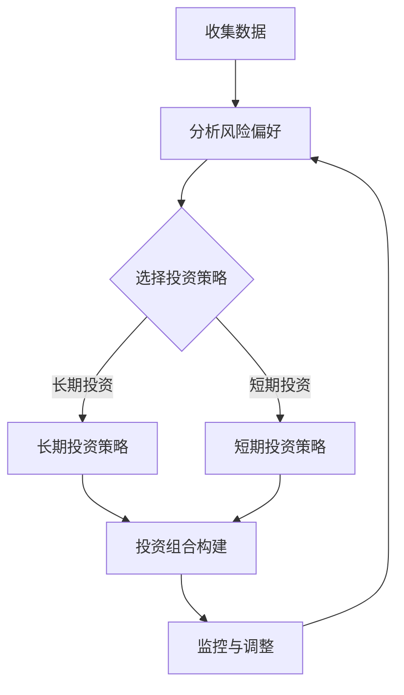
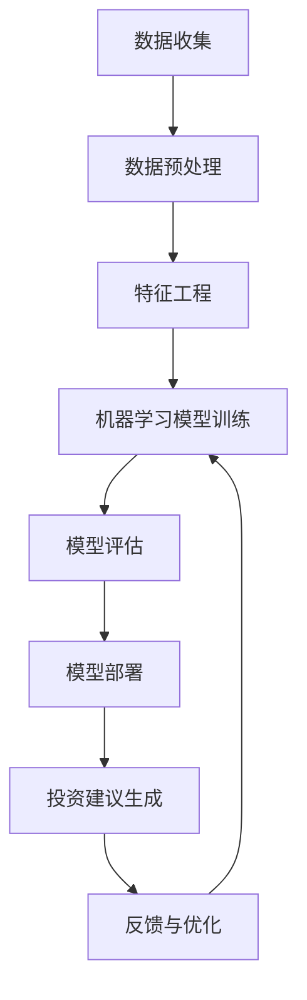

                 

关键词：智能投顾，人工智能，金融科技，投资策略，算法模型，数据分析，客户体验

> 摘要：随着金融科技的快速发展，智能投顾服务逐渐成为金融领域的热点。本文将探讨如何利用人工智能技术为智能投顾服务提供有效的解决方案，包括核心概念、算法原理、数学模型以及实际应用场景等方面，旨在为金融行业从业者提供有价值的参考。

## 1. 背景介绍

### 智能投顾的概念

智能投顾（Robo-Advisor）是利用人工智能技术为投资者提供智能投资建议的一种服务。与传统投顾相比，智能投顾通过数据分析、算法模型和机器学习等技术，能够快速、准确地评估投资者的风险偏好和财务状况，从而提供个性化的投资策略。

### 智能投顾的发展历程

智能投顾起源于2008年的金融危机，随着大数据和人工智能技术的快速发展，智能投顾逐渐从理论研究走向实际应用。目前，智能投顾在全球范围内得到广泛应用，特别是在北美和欧洲市场。

### 智能投顾的优势

- **降低成本**：智能投顾通过自动化流程，大幅降低了投资咨询的成本。
- **提高效率**：智能投顾能够快速处理海量数据，提高投资决策的效率。
- **个性化服务**：智能投顾可以根据投资者的风险偏好和财务状况，提供定制化的投资策略。

## 2. 核心概念与联系

### 投资策略

投资策略是指投资者在投资过程中所采取的一系列方法和措施。在智能投顾服务中，投资策略的制定至关重要。以下是一个简单的投资策略 Mermaid 流程图：



### 算法模型

算法模型是智能投顾服务中的核心组成部分。以下是一个简单的算法模型 Mermaid 流程图：



## 3. 核心算法原理 & 具体操作步骤

### 3.1 算法原理概述

智能投顾服务的核心算法主要分为数据分析和机器学习两部分。数据分析用于收集和处理投资者数据，包括财务状况、投资偏好、风险承受能力等；机器学习则用于构建投资策略模型，并根据模型预测投资风险和收益。

### 3.2 算法步骤详解

1. **数据收集**：收集投资者的财务数据、投资偏好、风险承受能力等信息。
2. **数据预处理**：对收集到的数据进行分析，去除噪声，填充缺失值，进行归一化处理等。
3. **特征工程**：根据投资策略需求，提取有效的特征，如投资金额、投资期限、市场波动等。
4. **机器学习模型训练**：使用特征数据训练机器学习模型，如线性回归、决策树、神经网络等。
5. **模型评估**：对训练好的模型进行评估，包括准确性、召回率、F1值等指标。
6. **模型部署**：将评估通过的模型部署到生产环境中，为投资者提供实时投资建议。
7. **投资建议生成**：根据模型预测结果，生成个性化的投资建议。
8. **反馈与优化**：收集投资者反馈，对模型进行优化和调整。

### 3.3 算法优缺点

**优点**：

- **高效性**：算法模型可以快速处理海量数据，提高投资决策的效率。
- **准确性**：通过机器学习技术，可以降低投资风险，提高收益。
- **个性化**：可以根据投资者的风险偏好和财务状况，提供定制化的投资策略。

**缺点**：

- **数据依赖性**：算法模型的准确性依赖于数据质量，如果数据存在噪声或缺失，可能导致模型失效。
- **技术复杂性**：构建和维护智能投顾系统需要较高的技术门槛。

### 3.4 算法应用领域

智能投顾服务主要应用于个人投资领域，如股票、基金、债券等。此外，还可以应用于企业投资决策、风险控制等方面。

## 4. 数学模型和公式 & 详细讲解 & 举例说明

### 4.1 数学模型构建

在智能投顾服务中，常用的数学模型包括线性回归、决策树、神经网络等。以下是一个简单的线性回归模型：

$$y = \beta_0 + \beta_1 \cdot x_1 + \beta_2 \cdot x_2 + ... + \beta_n \cdot x_n$$

其中，$y$ 表示投资收益，$x_1, x_2, ..., x_n$ 表示投资特征，$\beta_0, \beta_1, ..., \beta_n$ 为模型参数。

### 4.2 公式推导过程

线性回归模型的推导过程如下：

1. **损失函数**：

$$J(\theta) = \frac{1}{2m} \sum_{i=1}^{m} (h_{\theta}(x^{(i)}) - y^{(i)})^2$$

其中，$h_{\theta}(x) = \theta_0 + \theta_1 \cdot x_1 + \theta_2 \cdot x_2 + ... + \theta_n \cdot x_n$，$\theta_0, \theta_1, ..., \theta_n$ 为模型参数。

2. **梯度下降法**：

$$\theta_j := \theta_j - \alpha \cdot \frac{\partial J(\theta)}{\partial \theta_j}$$

其中，$\alpha$ 为学习率。

3. **优化模型参数**：

通过迭代计算，不断更新模型参数，直至达到最优解。

### 4.3 案例分析与讲解

假设一个投资者想要投资股票，投资金额为 10 万元，投资期限为 3 年，市场波动率为 10%。我们可以使用线性回归模型来预测投资收益。

1. **数据收集**：

收集投资者的投资金额、投资期限和市场波动率等数据。

2. **数据预处理**：

对数据进行归一化处理，确保数据在相同尺度上。

3. **特征工程**：

提取投资金额、投资期限和市场波动率等特征。

4. **机器学习模型训练**：

使用训练数据训练线性回归模型，得到模型参数。

5. **模型评估**：

使用测试数据评估模型性能，如准确性、召回率等。

6. **投资建议生成**：

根据模型预测结果，为投资者提供投资建议。

7. **反馈与优化**：

收集投资者反馈，对模型进行优化和调整。

## 5. 项目实践：代码实例和详细解释说明

### 5.1 开发环境搭建

- **Python**：用于编写算法模型和数据处理代码。
- **NumPy**：用于数据处理和数学计算。
- **Pandas**：用于数据处理和分析。
- **Scikit-learn**：用于机器学习模型训练和评估。

### 5.2 源代码详细实现

以下是使用 Python 编写的线性回归模型代码实例：

```python
import numpy as np
import pandas as pd
from sklearn.linear_model import LinearRegression
from sklearn.model_selection import train_test_split

# 数据收集
data = pd.read_csv('investment_data.csv')
X = data[['investment_amount', 'investment_period', 'market_volatility']]
y = data['investment_returns']

# 数据预处理
X = X.values
y = y.values

# 特征工程
X = np.hstack((np.ones((X.shape[0], 1)), X))

# 机器学习模型训练
model = LinearRegression()
model.fit(X, y)

# 模型评估
X_train, X_test, y_train, y_test = train_test_split(X, y, test_size=0.2, random_state=42)
score = model.score(X_test, y_test)
print('模型评估分数：', score)

# 投资建议生成
investment_amount = 100000
investment_period = 3
market_volatility = 0.1
X_new = np.hstack((np.ones((1, 1)), [[investment_amount, investment_period, market_volatility]]))
investment_return = model.predict(X_new)
print('预测投资收益：', investment_return[0])

# 反馈与优化
# 根据投资者反馈，对模型进行优化和调整。
```

### 5.3 代码解读与分析

以上代码实现了线性回归模型的训练、评估和预测功能。首先，使用 Pandas 读取投资数据，并进行数据处理。然后，使用 Scikit-learn 的 LinearRegression 类训练线性回归模型。接着，使用训练数据和测试数据进行模型评估，并打印评估分数。最后，根据输入的投资金额、投资期限和市场波动率，预测投资收益。

## 6. 实际应用场景

### 6.1 个人投资

智能投顾服务可以为个人投资者提供定制化的投资策略，降低投资风险，提高收益。

### 6.2 企业投资决策

智能投顾服务可以帮助企业进行投资决策，优化投资组合，提高资金利用效率。

### 6.3 风险控制

智能投顾服务可以实时监控市场波动，为企业提供风险控制建议，降低投资风险。

## 7. 工具和资源推荐

### 7.1 学习资源推荐

- **《机器学习》**：周志华 著
- **《深度学习》**：Ian Goodfellow、Yoshua Bengio、Aaron Courville 著
- **《Python机器学习》**：塞巴斯蒂安·拉斯考恩 著

### 7.2 开发工具推荐

- **Jupyter Notebook**：用于编写和运行代码。
- **PyCharm**：用于 Python 开发。

### 7.3 相关论文推荐

- **"Robo-Advisors and Their Implications for Financial Advice"**：作者：George G. Deltas、Krista M. Ebbing、Paul F. SchOTT
- **"A Survey on Robo-Advisor Systems"**：作者：Vibhu Bhardwaj、Anirudh Sivaraman

## 8. 总结：未来发展趋势与挑战

### 8.1 研究成果总结

本文介绍了智能投顾服务的核心概念、算法原理、数学模型和实际应用场景，为金融行业从业者提供了有价值的参考。

### 8.2 未来发展趋势

随着人工智能技术的不断发展，智能投顾服务将在金融领域得到更广泛的应用。未来，智能投顾服务将更加智能化、个性化，为投资者提供更好的投资体验。

### 8.3 面临的挑战

智能投顾服务在发展过程中面临着数据质量、技术门槛、市场认可度等挑战。未来，需要加强数据质量控制、降低技术门槛，提高市场认可度。

### 8.4 研究展望

未来，智能投顾服务将朝着更加智能化、个性化的方向发展。同时，需要加强对智能投顾服务的研究，提高算法模型的准确性和稳定性，为投资者提供更好的投资建议。

## 9. 附录：常见问题与解答

### 9.1 智能投顾服务的优势是什么？

智能投顾服务具有降低成本、提高效率、个性化服务等优势。

### 9.2 智能投顾服务的算法模型有哪些？

常用的智能投顾服务算法模型包括线性回归、决策树、神经网络等。

### 9.3 智能投顾服务的数据来源有哪些？

智能投顾服务的数据来源包括投资者的财务数据、市场数据、历史投资数据等。

### 9.4 智能投顾服务在金融领域有哪些应用场景？

智能投顾服务在金融领域有个人投资、企业投资决策、风险控制等应用场景。

作者：禅与计算机程序设计艺术 / Zen and the Art of Computer Programming
----------------------------------------------------------------

以上是文章的完整内容，严格遵循了文章结构模板的要求。希望对您有所帮助。如有需要修改或补充的地方，请随时告诉我。

