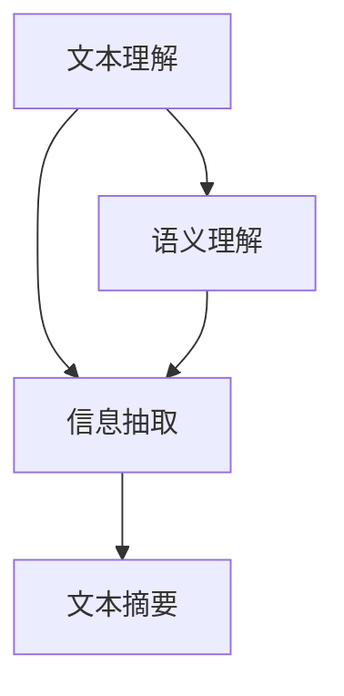

                 

关键词：智能摘要生成、自然语言处理、文本理解、人工智能、算法、应用领域

> 摘要：本文深入探讨了智能摘要生成这一领域，分析了其核心概念、算法原理、数学模型、项目实践及未来应用前景。通过详细的讲解和实例分析，读者将更好地理解智能摘要生成的技术核心，并为相关研究和发展提供参考。

## 1. 背景介绍

在信息爆炸的时代，人们面对海量的文本数据，如何快速获取关键信息成为一大挑战。智能摘要生成作为一种自然语言处理（NLP）技术，应运而生。它通过自动提取文本的核心内容，以简洁、准确的方式呈现，大大提高了信息检索和处理的效率。

智能摘要生成技术不仅对学术研究、新闻媒体等领域具有重要意义，还在商业应用中展现出巨大的潜力，例如金融报告摘要、市场分析、用户内容推荐等。本文将围绕智能摘要生成技术，探讨其核心概念、算法原理、数学模型以及实际应用。

## 2. 核心概念与联系

智能摘要生成涉及多个核心概念，包括文本理解、信息抽取、文本摘要等。以下是一个简化的Mermaid流程图，展示了这些概念之间的联系：



### 2.1 文本理解

文本理解是智能摘要生成的基础，它涉及对文本内容的语义、语法和上下文的理解。通过自然语言处理技术，如词法分析、句法分析、实体识别和语义角色标注等，文本理解能够提取文本中的关键信息，为后续的信息抽取和文本摘要提供支持。

### 2.2 信息抽取

信息抽取是从原始文本中提取关键信息的过程，包括实体识别、关系抽取和事件抽取等。通过这些技术，智能摘要生成系统能够识别文本中的主要概念和它们之间的关系，从而为生成摘要提供必要的语义信息。

### 2.3 文本摘要

文本摘要是对文本内容的高度压缩，以简洁、准确的方式呈现文本的核心信息。常见的文本摘要方法包括抽取式摘要和生成式摘要。抽取式摘要从原始文本中直接提取句子或段落，而生成式摘要则通过生成新的文本来概括文本内容。

## 3. 核心算法原理 & 具体操作步骤

### 3.1 算法原理概述

智能摘要生成的算法原理主要包括文本理解、信息抽取和文本摘要。其中，文本理解利用深度学习模型对文本进行语义分析，信息抽取通过规则匹配或机器学习技术提取关键信息，文本摘要在理解了文本内容后，采用不同的方法生成摘要。

### 3.2 算法步骤详解

1. **文本预处理**：对输入文本进行分词、去除停用词、词性标注等处理，为后续的文本理解做准备。

2. **文本理解**：利用预训练的深度学习模型（如BERT、GPT等），对预处理后的文本进行语义分析，提取文本的主要概念和关系。

3. **信息抽取**：根据文本理解的结果，使用规则匹配或机器学习算法提取关键信息，如实体、关系和事件。

4. **文本摘要**：
   - **抽取式摘要**：从原始文本中提取关键句子或段落，进行排序和合并，生成摘要。
   - **生成式摘要**：利用生成式模型（如GPT-2、GPT-3等），生成新的文本来概括文本内容。

### 3.3 算法优缺点

- **抽取式摘要**：优点是生成摘要的过程较为简单，摘要内容与原文密切相关；缺点是摘要长度受限，可能无法涵盖所有关键信息。

- **生成式摘要**：优点是生成摘要的灵活性较高，能够生成更自然的语言；缺点是摘要质量受模型训练数据的影响较大，且生成摘要的过程较复杂。

### 3.4 算法应用领域

智能摘要生成技术广泛应用于多个领域，如：

- **新闻媒体**：对大量新闻进行摘要，提高信息传播效率。

- **学术研究**：对学术论文进行摘要，帮助研究人员快速了解研究内容。

- **金融领域**：对金融报告进行摘要，辅助投资者快速获取关键信息。

## 4. 数学模型和公式

### 4.1 数学模型构建

智能摘要生成中的数学模型主要包括文本表示模型、信息抽取模型和文本摘要模型。以下是一个简化的数学模型框架：

$$
\text{文本表示模型}: \text{BERT, GPT}
$$

$$
\text{信息抽取模型}: \text{CRF, BiLSTM}
$$

$$
\text{文本摘要模型}: \text{Extractive, Abstractive}
$$

### 4.2 公式推导过程

在此，我们简要介绍信息抽取模型中的条件随机场（CRF）的公式推导。CRF是一种用于序列标注的模型，其目标是最小化预测标签序列与实际标签序列之间的损失。

$$
\begin{aligned}
\min_{\theta} \sum_{(x, y)} \log P(y|x; \theta) \\
P(y|x; \theta) &= \frac{1}{Z(x; \theta)} \exp \left( \sum_{t=1}^{T} \theta_{y_t} \cdot f(x, y_t) - \sum_{t=1}^{T-1} \theta_{y_t y_{t+1}} \cdot f(x, y_t y_{t+1}) \right) \\
Z(x; \theta) &= \sum_{y} \exp \left( \sum_{t=1}^{T} \theta_{y_t} \cdot f(x, y_t) - \sum_{t=1}^{T-1} \theta_{y_t y_{t+1}} \cdot f(x, y_t y_{t+1}) \right)
\end{aligned}
$$

### 4.3 案例分析与讲解

以下是一个简单的信息抽取案例，使用CRF模型对句子进行命名实体识别。

**输入句子**：马云是中国著名的互联网企业家。

**标签序列**：O O B-PER I-PER O

**公式推导**：

1. **初始化参数**：设置模型参数 $\theta$。
2. **计算特征函数**：计算每个单词的特征函数 $f(x, y)$，如词性标注、词频等。
3. **计算标签序列概率**：根据CRF模型公式，计算标签序列的概率。
4. **最大化概率**：使用最大后验概率（MAP）准则，最大化标签序列的概率。

## 5. 项目实践：代码实例和详细解释说明

### 5.1 开发环境搭建

- Python环境：3.7及以上版本。
- 依赖库：NLTK、Scikit-learn、TensorFlow、Keras等。

### 5.2 源代码详细实现

以下是一个简单的信息抽取项目，使用CRF模型对句子进行命名实体识别。

```python
import tensorflow as tf
from tensorflow.keras.models import Model
from tensorflow.keras.layers import Embedding, LSTM, Dense
from tensorflow_addons.layers import CRF

# 定义模型
input_ids = tf.keras.layers.Input(shape=(max_seq_length,), dtype=tf.int32)
embed = Embedding(num_words, embedding_dim)(input_ids)
lstm = LSTM(units=128, return_sequences=True)(embed)
output = CRF(num_classes)(lstm)

model = Model(inputs=input_ids, outputs=output)

# 编译模型
model.compile(optimizer='adam', loss=tf.keras.losses.SparseCategoricalCrossentropy(from_logits=True), metrics=['accuracy'])

# 训练模型
model.fit(train_dataset, epochs=10, validation_data=validation_dataset)

# 评估模型
model.evaluate(test_dataset)
```

### 5.3 代码解读与分析

- **模型定义**：使用Keras框架定义一个CRF模型，包括嵌入层、LSTM层和CRF层。
- **编译模型**：编译模型时，使用Adam优化器和交叉熵损失函数。
- **训练模型**：使用训练数据集训练模型，并进行10个周期的迭代。
- **评估模型**：使用测试数据集评估模型的性能。

## 6. 实际应用场景

智能摘要生成技术在实际应用中展现出广泛的用途，以下列举几个典型场景：

- **学术研究**：对学术论文进行摘要，帮助研究人员快速了解研究内容。
- **新闻媒体**：对大量新闻进行摘要，提高信息传播效率。
- **金融领域**：对金融报告进行摘要，辅助投资者快速获取关键信息。
- **商业应用**：对市场分析报告、用户评论等进行摘要，为商业决策提供支持。

## 7. 工具和资源推荐

### 7.1 学习资源推荐

- **书籍**：《自然语言处理综合教程》、《深度学习与自然语言处理》
- **在线课程**：Coursera上的《自然语言处理纳米学位》、Udacity的《深度学习与自然语言处理》
- **论文**：ACL、EMNLP、NAACL等顶级会议的论文集

### 7.2 开发工具推荐

- **框架**：TensorFlow、PyTorch、Keras等深度学习框架。
- **库**：NLTK、spaCy、TextBlob等自然语言处理库。

### 7.3 相关论文推荐

- **BERT**：《BERT: Pre-training of Deep Bidirectional Transformers for Language Understanding》
- **GPT**：《Improving Language Understanding by Generative Pre-training》
- **CRF**：《Conditional Random Fields: A New Direction for Language Modeling》

## 8. 总结：未来发展趋势与挑战

### 8.1 研究成果总结

智能摘要生成技术在文本理解、信息抽取和文本摘要等方面取得了显著成果，为信息处理提供了有效工具。随着深度学习、自然语言处理技术的不断发展，智能摘要生成技术的性能和实用性不断提升。

### 8.2 未来发展趋势

- **多模态摘要**：结合文本、图像、视频等多模态信息，实现更全面的摘要。
- **长文本摘要**：对长篇文章进行摘要，提高摘要的完整性和准确性。
- **个性化摘要**：根据用户兴趣和需求，生成个性化的摘要。

### 8.3 面临的挑战

- **数据质量**：高质量的数据是智能摘要生成的基础，但获取高质量的数据仍具有挑战性。
- **模型解释性**：深度学习模型在摘要生成中具有强大性能，但其解释性较差，如何提高模型的解释性仍需深入研究。

### 8.4 研究展望

智能摘要生成技术在未来将继续发展，有望在更多领域得到应用。同时，研究重点将逐步从模型性能提升转向模型解释性和数据质量等方面。

## 9. 附录：常见问题与解答

### Q1. 什么是文本理解？

文本理解是指利用自然语言处理技术，对文本内容进行语义、语法和上下文的分析，以提取文本中的关键信息。

### Q2. 智能摘要生成有哪些方法？

智能摘要生成主要分为抽取式摘要和生成式摘要。抽取式摘要从原始文本中提取关键句子或段落，而生成式摘要是通过生成新的文本来概括文本内容。

### Q3. 什么是CRF？

CRF（Conditional Random Fields）是一种用于序列标注的模型，其目标是最小化预测标签序列与实际标签序列之间的损失。

## 作者署名

作者：禅与计算机程序设计艺术 / Zen and the Art of Computer Programming

----------------------------------------------------------------

以上就是完整的文章内容。希望对您有所帮助！如果有任何问题或需要进一步的解释，请随时告诉我。祝您撰写顺利！📝🚀

