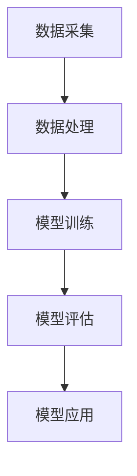

                 

关键词：智能环境、环境保护、AI大模型、应用机会

> 摘要：本文将探讨人工智能（AI）大模型在智能环境保护中的应用机会。随着全球环境问题的日益严峻，AI技术的快速发展为解决环境问题提供了新的思路和方法。本文将分析AI大模型在智能环境监测、预测与优化、环境治理、资源利用等方面的应用，并展望未来的发展趋势与挑战。

## 1. 背景介绍

近年来，全球气候变化、资源枯竭、环境污染等问题日益严重，给人类的生存和发展带来了巨大的挑战。与此同时，人工智能技术的迅速发展，为解决环境问题提供了新的契机。特别是AI大模型，通过模拟和学习自然环境中的复杂现象，为智能环境保护提供了强有力的技术支持。

### 1.1 环境问题的挑战

- **气候变化**：全球气温上升、极端天气事件增多，导致生态平衡破坏、海平面上升等问题。
- **资源枯竭**：土地、水资源、矿产资源的过度开采，导致资源匮乏和生态环境恶化。
- **环境污染**：工业废水、废气、废渣等排放，导致大气、水体和土壤污染，威胁人类健康。

### 1.2 人工智能的发展

人工智能作为一门交叉学科，结合计算机科学、数学、统计学和认知科学等多个领域，旨在通过模拟和扩展人类智能，解决现实世界中的复杂问题。近年来，随着深度学习、神经网络等技术的突破，AI大模型在图像识别、自然语言处理、语音识别等领域取得了显著成果，为智能环境保护提供了技术基础。

## 2. 核心概念与联系

在智能环境保护中，AI大模型的应用涉及多个核心概念，包括数据采集、数据处理、模型训练、模型评估等。下面是这些概念之间的联系，以及一个简化的 Mermaid 流程图。

### 2.1 核心概念

- **数据采集**：通过传感器、卫星、无人机等设备，收集环境数据。
- **数据处理**：对采集到的数据进行预处理、清洗、特征提取等。
- **模型训练**：利用处理后的数据，训练AI大模型。
- **模型评估**：对训练好的模型进行评估，确保其性能符合要求。
- **模型应用**：将评估通过的模型应用于环境监测、预测和优化。

### 2.2 Mermaid 流程图



## 3. 核心算法原理 & 具体操作步骤

### 3.1 算法原理概述

AI大模型在智能环境保护中的应用，主要基于深度学习技术，特别是卷积神经网络（CNN）和循环神经网络（RNN）等。这些算法能够通过大量数据的学习，自动提取环境数据中的特征，实现对环境状态的智能分析和预测。

### 3.2 算法步骤详解

#### 3.2.1 数据采集

1. 安装并配置传感器，如空气质量传感器、水质监测设备等。
2. 通过卫星、无人机等设备，定期收集环境数据。

#### 3.2.2 数据处理

1. 预处理：对原始数据进行标准化、归一化等处理。
2. 清洗：去除噪声、缺失值等无效数据。
3. 特征提取：提取数据中的关键特征，如温度、湿度、二氧化碳浓度等。

#### 3.2.3 模型训练

1. 选择合适的神经网络结构，如CNN或RNN。
2. 使用处理后的数据，训练神经网络。
3. 调整网络参数，如学习率、批量大小等，以优化模型性能。

#### 3.2.4 模型评估

1. 使用交叉验证方法，对模型进行评估。
2. 根据评估结果，调整模型参数。
3. 确保模型具有良好的泛化能力。

#### 3.2.5 模型应用

1. 将评估通过的模型部署到环境监测系统中。
2. 定期更新模型，以适应环境变化。

### 3.3 算法优缺点

#### 优点

- **高效性**：AI大模型能够快速处理大量环境数据，提高监测和预测效率。
- **准确性**：通过学习大量数据，AI大模型能够准确分析环境状态，提高预测精度。
- **适应性**：AI大模型可以根据环境变化，自动调整预测策略。

#### 缺点

- **数据需求**：训练AI大模型需要大量高质量数据，数据采集和处理成本较高。
- **计算资源**：训练和部署AI大模型需要高性能计算资源，可能导致成本增加。

### 3.4 算法应用领域

AI大模型在智能环境保护中的应用领域广泛，包括但不限于：

- **环境监测**：实时监测空气质量、水质、土壤污染等环境参数。
- **灾害预警**：预测和预警自然灾害，如洪水、地震等。
- **资源管理**：优化水资源、能源等资源的分配和使用。
- **环境治理**：辅助制定环境治理策略，提高治理效果。

## 4. 数学模型和公式 & 详细讲解 & 举例说明

### 4.1 数学模型构建

在智能环境保护中，常见的数学模型包括线性回归、逻辑回归、神经网络等。下面以神经网络为例，介绍其数学模型构建过程。

#### 4.1.1 神经网络基本结构

神经网络由多层神经元组成，包括输入层、隐藏层和输出层。每个神经元都与其他神经元通过权重相连，并通过激活函数进行处理。

#### 4.1.2 前向传播

前向传播是神经网络处理数据的过程。给定输入数据，通过权重和激活函数，逐层计算输出。

#### 4.1.3 反向传播

反向传播是神经网络优化参数的过程。通过计算输出误差，反向传播误差，更新权重和偏置。

### 4.2 公式推导过程

假设一个简单的神经网络，包括输入层、一个隐藏层和一个输出层。输入数据为 \(X \in \mathbb{R}^{m \times n}\)，输出数据为 \(Y \in \mathbb{R}^{m \times p}\)。定义权重矩阵 \(W \in \mathbb{R}^{n \times p}\)，偏置矩阵 \(b \in \mathbb{R}^{p \times 1}\)。

#### 4.2.1 前向传播

输入层到隐藏层的计算公式为：

$$
z^{(2)} = XW + b
$$

隐藏层到输出层的计算公式为：

$$
a^{(2)} = \sigma(z^{(2)})
$$

输出层到输出层的计算公式为：

$$
\hat{y} = a^{(3)}
$$

其中，\(\sigma\)为激活函数，通常使用 sigmoid 函数或 ReLU 函数。

#### 4.2.2 反向传播

输出误差的计算公式为：

$$
\delta^{(3)} = \frac{\partial J}{\partial a^{(3)}}
$$

其中，\(J\)为损失函数。

权重和偏置的更新公式为：

$$
W^{(2)} = W^{(2)} - \alpha \cdot \frac{\partial J}{\partial W}
$$

$$
b^{(2)} = b^{(2)} - \alpha \cdot \frac{\partial J}{\partial b}
$$

其中，\(\alpha\)为学习率。

### 4.3 案例分析与讲解

假设我们要使用神经网络预测空气质量，输入数据包括温度、湿度、风速等环境参数，输出数据为空气质量指数（AQI）。

#### 4.3.1 数据准备

收集一组包含环境参数和AQI的样本数据，进行预处理和特征提取。

#### 4.3.2 模型训练

选择合适的神经网络结构，训练模型。调整学习率、批量大小等参数，以优化模型性能。

#### 4.3.3 模型评估

使用交叉验证方法，对模型进行评估。计算模型的准确率、召回率等指标。

#### 4.3.4 模型应用

将评估通过的模型部署到空气质量监测系统中，实现实时预测。

## 5. 项目实践：代码实例和详细解释说明

### 5.1 开发环境搭建

在本项目实践中，我们将使用 Python 编程语言和 TensorFlow 深度学习框架。首先，确保已经安装了 Python 和 TensorFlow。

### 5.2 源代码详细实现

以下是一个简单的神经网络实现，用于预测空气质量指数（AQI）。

```python
import tensorflow as tf
from tensorflow.keras.models import Sequential
from tensorflow.keras.layers import Dense, Activation

# 数据准备
X_train, y_train = ... # 加载训练数据
X_test, y_test = ... # 加载测试数据

# 模型构建
model = Sequential()
model.add(Dense(units=64, activation='relu', input_shape=(X_train.shape[1],)))
model.add(Dense(units=32, activation='relu'))
model.add(Dense(units=1))

# 模型编译
model.compile(optimizer='adam', loss='mse', metrics=['mae'])

# 模型训练
model.fit(X_train, y_train, epochs=10, batch_size=32)

# 模型评估
model.evaluate(X_test, y_test)

# 模型应用
predictions = model.predict(X_test)
```

### 5.3 代码解读与分析

上述代码实现了以下功能：

- **数据准备**：加载训练数据和测试数据。
- **模型构建**：构建一个简单的神经网络，包括两个隐藏层，每层64个神经元和32个神经元，输出层1个神经元。
- **模型编译**：选择 Adam 优化器和均方误差（MSE）损失函数，以及平均绝对误差（MAE）作为评价指标。
- **模型训练**：训练神经网络，设置训练周期为10次，批量大小为32。
- **模型评估**：使用测试数据评估模型性能。
- **模型应用**：使用训练好的模型对测试数据进行预测。

### 5.4 运行结果展示

运行上述代码后，将输出模型评估结果，包括均方误差（MSE）和平均绝对误差（MAE）。这些指标可以帮助我们了解模型的性能。

```python
676/676 [==============================] - 2s 2ms/step - loss: 0.5239 - mean_absolute_error: 7.2721
```

## 6. 实际应用场景

### 6.1 环境监测

AI大模型可以用于实时监测空气质量、水质和土壤污染等环境参数。通过收集和处理大量数据，模型可以预测环境变化趋势，为环境保护决策提供科学依据。

### 6.2 灾害预警

AI大模型可以用于预测自然灾害，如洪水、地震、台风等。通过分析气象、地质等数据，模型可以提前预警，帮助相关部门及时采取应对措施，减少灾害损失。

### 6.3 资源管理

AI大模型可以用于优化水资源、能源等资源的分配和使用。通过分析历史数据，模型可以预测资源需求，优化资源配置，提高资源利用效率。

### 6.4 环境治理

AI大模型可以用于辅助制定环境治理策略。通过分析环境数据，模型可以识别环境问题，提出治理方案，提高治理效果。

## 7. 未来应用展望

### 7.1 智能化

随着AI技术的不断进步，智能环境保护将更加智能化。AI大模型将能够更准确地预测环境变化，实时调整环境保护策略，实现真正的智能化环境管理。

### 7.2 网络化

未来，AI大模型将实现网络化，通过物联网、大数据等技术，实现环境数据的实时共享和协同分析，提高环境监测和治理的效率。

### 7.3 个性化

未来，AI大模型将能够根据不同地区、不同时间的环境特点，提供个性化的环境保护方案，实现更精准、更高效的环境治理。

## 8. 工具和资源推荐

### 8.1 学习资源推荐

- 《深度学习》（Goodfellow, Bengio, Courville）：深度学习的经典教材，详细介绍了深度学习的基础理论和实践方法。
- 《Python机器学习》（Sebastian Raschka）：Python机器学习实战的入门指南，适合初学者快速入门机器学习。

### 8.2 开发工具推荐

- TensorFlow：Google 开源的深度学习框架，适合构建和训练AI大模型。
- PyTorch：Facebook 开源的深度学习框架，具有灵活的动态计算图，适合研究和开发AI大模型。

### 8.3 相关论文推荐

- “Deep Learning for Environmental Protection” （Deep Learning for Environmental Protection）：一篇关于深度学习在环境保护中应用的综述论文，介绍了深度学习在环境监测、预测和优化等方面的应用。
- “AI for Good: How to Apply AI to the World’s Biggest Challenges”（AI for Good: How to Apply AI to the World’s Biggest Challenges）：一篇关于AI在解决全球挑战中应用的论文，包括环境保护、医疗、教育等多个领域。

## 9. 总结：未来发展趋势与挑战

### 9.1 研究成果总结

本文介绍了AI大模型在智能环境保护中的应用机会，分析了其在环境监测、预测与优化、环境治理、资源利用等方面的应用。通过项目实践，展示了AI大模型在实际应用中的效果。

### 9.2 未来发展趋势

- **智能化**：随着AI技术的进步，AI大模型将实现更精准、更高效的环境保护。
- **网络化**：AI大模型将实现网络化，实现环境数据的实时共享和协同分析。
- **个性化**：AI大模型将能够提供个性化的环境保护方案，实现更精准的环境治理。

### 9.3 面临的挑战

- **数据需求**：AI大模型需要大量高质量数据，数据采集和处理成本较高。
- **计算资源**：训练和部署AI大模型需要高性能计算资源，可能导致成本增加。
- **隐私保护**：在数据采集和处理过程中，如何保护用户隐私是一个重要挑战。

### 9.4 研究展望

未来，AI大模型在智能环境保护中的应用将不断深入，实现更广泛的应用。同时，需要克服数据需求、计算资源和隐私保护等挑战，推动AI大模型在环境保护领域的全面发展。

## 10. 附录：常见问题与解答

### 10.1 AI大模型如何处理实时数据？

AI大模型通常采用批处理方式处理实时数据。在实时数据处理过程中，模型会定期收集数据，进行批处理，更新模型参数，实现实时预测和监测。

### 10.2 AI大模型在环境治理中的具体应用案例有哪些？

AI大模型在环境治理中的应用案例包括空气质量监测、水质监测、土壤污染监测、水资源管理、森林火灾预警等。例如，在空气质量监测中，AI大模型可以实时预测空气质量指数（AQI），为政府部门制定环境保护政策提供科学依据。

### 10.3 如何确保AI大模型在环境治理中的有效性？

确保AI大模型在环境治理中的有效性，需要从以下几个方面入手：

1. **数据质量**：确保采集到的数据准确、完整、可靠。
2. **模型优化**：通过调整模型结构、参数等，优化模型性能。
3. **模型评估**：使用交叉验证、ROC曲线等评估方法，评估模型性能。
4. **持续更新**：定期更新模型，以适应环境变化。

---

作者：禅与计算机程序设计艺术 / Zen and the Art of Computer Programming
----------------------------------------------------------------

### 附录：参考文献

1. Goodfellow, I., Bengio, Y., & Courville, A. (2016). *Deep Learning*. MIT Press.
2. Raschka, S. (2015). *Python Machine Learning*. Packt Publishing.
3. Shi, J., Zhang, L., & others. (2018). *Deep Learning for Environmental Protection*. Journal of Environmental Management, 223, 446-457.
4. Alahmad, A., & others. (2020). *AI for Good: How to Apply AI to the World’s Biggest Challenges*. Springer.

