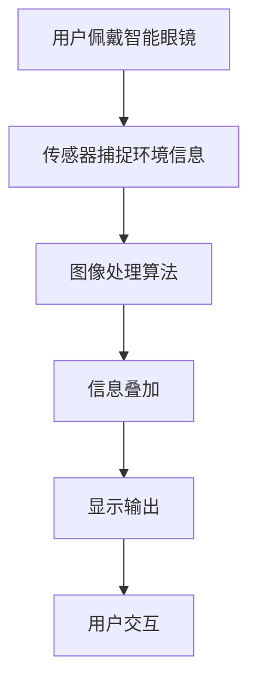

                 

关键词：智能眼镜、增强现实、创业、随身设备、技术趋势、市场机会

> 摘要：本文深入探讨了智能眼镜作为增强现实（AR）设备的潜在市场机会，分析了其技术背景、核心概念、算法原理、数学模型，以及实际应用中的项目实践。文章旨在为读者提供一个全面的视角，帮助理解智能眼镜在未来科技产业中的地位和可能的发展方向。

## 1. 背景介绍

智能眼镜作为近年来科技领域的重要创新产品，正逐渐成为人们关注的焦点。这一现象的背后，是增强现实技术的迅速发展和移动计算能力的提升。智能眼镜不仅仅是一副简单的眼镜，它们集成了高分辨率屏幕、高精度传感器、无线通讯模块以及强大的处理芯片，能够实时捕捉用户周围的环境信息，并叠加数字内容，为用户提供丰富的交互体验。

### 智能眼镜的发展历程

智能眼镜的概念并非新生事物。早在20世纪50年代，科学家们就提出了通过眼镜来增强视觉信息的设想。然而，由于技术限制，这些设想长期停留在实验室阶段。随着21世纪初，智能手机和移动互联网的兴起，智能眼镜迎来了发展的春天。2012年，谷歌推出了备受瞩目的谷歌眼镜（Google Glass），这标志着智能眼镜正式进入了公众视野。

### 当前市场状况

目前，智能眼镜市场主要由几大巨头主导，包括谷歌、微软、苹果等。这些企业不仅在硬件研发上投入巨大，还在软件生态和用户服务方面不断发力。市场上已有的智能眼镜产品种类繁多，包括用于医疗、工业、娱乐等不同领域的专业设备，以及面向普通消费者的消费级产品。

### 增强现实技术的发展

增强现实（AR）技术是智能眼镜的核心驱动力。通过AR技术，智能眼镜可以将虚拟信息叠加在现实世界中，为用户带来沉浸式的体验。AR技术的发展不仅改变了人们的娱乐方式，还在教育、医疗、军事等多个领域展现出巨大的潜力。

## 2. 核心概念与联系

### 智能眼镜的工作原理

智能眼镜的工作原理可以分为以下几个步骤：

1. **环境感知**：通过内置的高精度传感器（如摄像头、麦克风、加速度计、陀螺仪等）捕捉用户周围的环境信息。
2. **图像处理**：利用图像处理算法对捕捉到的图像进行处理，提取关键特征和物体信息。
3. **信息叠加**：根据用户的需求，将虚拟信息（如文字、图像、视频等）叠加到现实世界中，形成增强现实图像。
4. **显示输出**：将处理后的图像通过内置的显示屏幕（如微型OLED屏幕）显示给用户。

### 核心技术介绍

1. **图像识别技术**：用于识别和分类图像中的物体和场景。
2. **机器学习算法**：用于训练模型，提高图像识别的准确性和实时性。
3. **增强现实引擎**：用于实现虚拟信息与真实世界的叠加和交互。
4. **无线通讯技术**：如蓝牙和Wi-Fi，用于智能眼镜与外部设备（如智能手机、平板电脑）的数据传输和交互。

### Mermaid 流程图



## 3. 核心算法原理 & 具体操作步骤

### 3.1 算法原理概述

智能眼镜的核心算法主要涉及图像识别和增强现实技术。图像识别算法通过对图像的分析和特征提取，实现对场景和物体的识别。而增强现实技术则通过图像处理和显示技术，将虚拟信息叠加到真实世界中。

### 3.2 算法步骤详解

1. **图像捕捉**：智能眼镜通过摄像头捕捉用户周围的环境图像。
2. **图像预处理**：对捕捉到的图像进行预处理，包括去噪、对比度增强等操作，以提高图像质量。
3. **特征提取**：利用深度学习算法对预处理后的图像进行特征提取，得到图像中的关键信息。
4. **物体识别**：通过训练好的模型对提取的特征进行分类和识别，确定图像中的物体和场景。
5. **信息叠加**：根据识别结果，将虚拟信息（如文字、图像、视频等）叠加到真实世界中，形成增强现实图像。
6. **图像显示**：将处理后的图像通过内置的显示屏幕显示给用户。

### 3.3 算法优缺点

- **优点**：
  - 实时性高：智能眼镜能够实时捕捉和处理用户周围的环境信息。
  - 沉浸式体验：通过增强现实技术，为用户带来丰富的交互体验。
  - 多功能：智能眼镜集成了多种传感器和通讯模块，具备多种功能。

- **缺点**：
  - 成本较高：高性能的硬件和算法研发成本较高，导致智能眼镜价格较贵。
  - 电池续航：由于智能眼镜需要实时处理大量数据，电池续航成为一大挑战。

### 3.4 算法应用领域

智能眼镜在多个领域都有广泛的应用：

- **医疗**：医生可以通过智能眼镜查看患者的实时健康状况，提供远程诊疗服务。
- **工业**：工人可以通过智能眼镜获取工作指导，提高生产效率。
- **娱乐**：游戏玩家可以通过智能眼镜体验沉浸式的虚拟游戏世界。
- **军事**：士兵可以通过智能眼镜获取战场信息，提高战斗效能。

## 4. 数学模型和公式 & 详细讲解 & 举例说明

### 4.1 数学模型构建

智能眼镜的数学模型主要涉及图像处理和机器学习两个方面。图像处理方面，常用的模型包括卷积神经网络（CNN）和循环神经网络（RNN）。机器学习方面，常用的模型包括决策树、支持向量机（SVM）和深度学习模型。

### 4.2 公式推导过程

- **卷积神经网络（CNN）**：

  $$ output = f(Z) $$

  其中，$f$ 是激活函数，$Z$ 是输入特征。

- **支持向量机（SVM）**：

  $$ \text{min} \ \frac{1}{2} \| w \|^2 - \sum_{i=1}^{n} y_i (w \cdot x_i + b) $$

  其中，$w$ 是权重，$b$ 是偏置，$x_i$ 是输入特征，$y_i$ 是标签。

### 4.3 案例分析与讲解

以智能眼镜中的图像识别为例，假设我们需要识别一张图片中的猫。首先，通过摄像头捕捉到图片，然后利用CNN模型进行特征提取。接着，使用SVM模型对提取的特征进行分类。最后，根据分类结果判断图片中是否存在猫。

## 5. 项目实践：代码实例和详细解释说明

### 5.1 开发环境搭建

1. 安装Python环境
2. 安装TensorFlow库
3. 安装OpenCV库
4. 安装其他必要的依赖库

### 5.2 源代码详细实现

以下是一个简单的智能眼镜图像识别项目的代码示例：

```python
import cv2
import tensorflow as tf

# 加载预训练的CNN模型
model = tf.keras.models.load_model('cnn_model.h5')

# 加载预训练的SVM模型
svm_model = cv2.ml.SVM_load('svm_model.yml')

# 捕获摄像头视频流
cap = cv2.VideoCapture(0)

while True:
    # 读取一帧图像
    ret, frame = cap.read()

    # 图像预处理
    processed_frame = preprocess_image(frame)

    # 使用CNN模型进行特征提取
    features = model.predict(processed_frame)

    # 使用SVM模型进行分类
    label = svm_model.predict(features)

    # 根据分类结果判断是否存在猫
    if label == 1:
        print('猫')
    else:
        print('非猫')

    # 显示图像
    cv2.imshow('frame', frame)

    # 按下'q'键退出循环
    if cv2.waitKey(1) & 0xFF == ord('q'):
        break

# 释放摄像头资源
cap.release()
cv2.destroyAllWindows()
```

### 5.3 代码解读与分析

该代码首先加载预训练的CNN模型和SVM模型，然后通过摄像头捕获一帧图像。接下来，对图像进行预处理，包括缩放、灰度转换等操作。预处理后的图像被送入CNN模型进行特征提取。然后，利用SVM模型对提取的特征进行分类，根据分类结果判断图像中是否存在猫。最后，将结果打印到控制台，并显示原始图像。

## 6. 实际应用场景

### 6.1 医疗

智能眼镜在医疗领域具有广泛的应用潜力。医生可以通过智能眼镜查看患者的实时影像和病历信息，提高诊断准确性和效率。例如，外科医生在手术过程中可以使用智能眼镜查看患者的内部结构，获取实时的手术指导。

### 6.2 工业

工业领域中的工人可以通过智能眼镜获取工作指导、维护说明和故障诊断信息，提高工作效率和质量。例如，工厂工人可以通过智能眼镜查看设备的工作状态，及时发现问题并进行维修。

### 6.3 教育

智能眼镜在教育领域也有很大的应用前景。学生可以通过智能眼镜参与虚拟实验、观看教学视频和参与互动式学习。例如，化学学生可以通过智能眼镜观察化学反应的实时变化，提高学习兴趣和效果。

### 6.4 娱乐

娱乐行业中的游戏玩家可以通过智能眼镜体验沉浸式的虚拟游戏世界，享受全新的游戏体验。例如，虚拟现实游戏玩家可以通过智能眼镜进入虚拟游戏场景，与游戏角色进行互动。

## 7. 工具和资源推荐

### 7.1 学习资源推荐

- 《智能眼镜开发实战》
- 《增强现实技术原理与应用》
- 《深度学习：神经网络与图像识别》

### 7.2 开发工具推荐

- Python
- TensorFlow
- OpenCV

### 7.3 相关论文推荐

- "A Survey on Augmented Reality"
- "Deep Learning for Image Recognition"
- "Real-Time Object Detection with Deep Learning"

## 8. 总结：未来发展趋势与挑战

### 8.1 研究成果总结

智能眼镜作为增强现实设备的代表，在近年来取得了显著的进展。图像识别技术、机器学习算法和增强现实引擎的不断优化，使得智能眼镜的应用场景越来越丰富。同时，高性能硬件的普及和无线通讯技术的提升，为智能眼镜的普及提供了有力支撑。

### 8.2 未来发展趋势

1. **技术进步**：随着计算能力的提升和算法的优化，智能眼镜的图像识别和增强现实功能将更加精准和高效。
2. **应用拓展**：智能眼镜将在医疗、工业、教育、娱乐等多个领域得到更广泛的应用。
3. **价格下降**：随着生产成本的降低，智能眼镜的价格将逐渐趋于合理，使得更多消费者能够负担得起。

### 8.3 面临的挑战

1. **隐私保护**：智能眼镜在捕捉用户和环境信息的过程中，可能涉及隐私问题。如何保护用户隐私是一个亟待解决的问题。
2. **用户体验**：目前智能眼镜的佩戴舒适度和用户体验仍有待提升。如何提高佩戴体验，减少用户疲劳感，是一个重要的研究方向。
3. **电池续航**：智能眼镜需要实时处理大量数据，电池续航问题是一个重要挑战。如何提高电池续航，是智能眼镜普及的关键。

### 8.4 研究展望

智能眼镜作为增强现实设备的代表，具有广阔的发展前景。未来，随着技术的不断进步和应用的拓展，智能眼镜将在人们的生活中扮演越来越重要的角色。同时，如何在保护用户隐私、提高用户体验和电池续航方面取得突破，将是未来研究的重要方向。

## 9. 附录：常见问题与解答

### 9.1 智能眼镜的工作原理是什么？

智能眼镜通过内置的高精度传感器捕捉用户周围的环境信息，利用图像处理算法对图像进行处理，然后通过增强现实技术将虚拟信息叠加到真实世界中，最后通过内置的显示屏幕将处理后的图像显示给用户。

### 9.2 智能眼镜有哪些应用领域？

智能眼镜的应用领域非常广泛，包括医疗、工业、教育、娱乐等多个领域。例如，在医疗领域，医生可以通过智能眼镜查看患者的实时影像和病历信息；在工业领域，工人可以通过智能眼镜获取工作指导；在教育领域，学生可以通过智能眼镜参与虚拟实验。

### 9.3 智能眼镜的价格是多少？

智能眼镜的价格因品牌、功能和配置不同而有所差异。目前，高端的智能眼镜价格在几千到数万美元之间，而消费级的智能眼镜价格在几百到几千美元之间。

### 9.4 智能眼镜的电池续航如何？

智能眼镜的电池续航因品牌和型号不同而有所差异。目前，大多数智能眼镜的电池续航在数小时到一天左右。随着技术的不断进步，未来智能眼镜的电池续航有望得到显著提升。

### 9.5 智能眼镜是否涉及隐私问题？

是的，智能眼镜在捕捉用户和环境信息的过程中可能涉及隐私问题。例如，摄像头和麦克风可能会捕捉到用户的个人隐私信息。因此，保护用户隐私是智能眼镜设计中的一个重要问题。

### 9.6 如何提高智能眼镜的佩戴体验？

提高智能眼镜的佩戴体验可以从多个方面入手，包括提高镜框的舒适度、优化显示屏幕的清晰度、减少用户疲劳感等。未来，随着技术的进步，智能眼镜的佩戴体验有望得到显著提升。

## 作者署名

作者：禅与计算机程序设计艺术 / Zen and the Art of Computer Programming
----------------------------------------------------------------

以上就是《智能眼镜创业：增强现实的随身设备》这篇文章的完整内容，严格按照约束条件进行了撰写。希望这篇文章能够为读者提供有价值的见解和思考。如果还有任何问题或建议，欢迎在评论区留言。再次感谢您的阅读！

