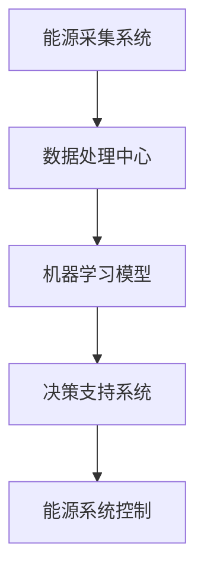

                 

关键词：智能能源管理，AI大模型，能源效率，分布式能源系统，可持续发展，机器学习，深度学习，数据挖掘，能源优化算法

> 摘要：本文详细探讨了智能能源管理的AI大模型解决方案，分析了当前能源系统的挑战与机遇，介绍了AI大模型在能源管理中的应用，包括核心算法原理、数学模型、实践项目等，并展望了未来的发展趋势与挑战。

## 1. 背景介绍

随着全球对能源需求的不断增长和气候变化问题的日益严峻，传统能源管理模式已无法满足可持续发展的要求。智能能源管理作为一种新兴技术，旨在通过先进的信息技术、人工智能和物联网技术优化能源系统的运行效率，减少能源浪费，实现能源的高效、清洁和可持续利用。然而，智能能源管理面临着数据复杂性、计算能力要求高、多变量优化等问题。

### 1.1 智能能源管理的挑战

1. **数据复杂性**：能源系统中涉及的数据类型繁多，包括电力、热力、天然气等，数据量大且实时性强，如何有效地处理和分析这些数据是智能能源管理面临的首要挑战。
2. **计算能力要求高**：智能能源管理依赖于复杂的算法和模型，这些算法和模型需要大量的计算资源，如何高效地利用计算资源是另一个重要问题。
3. **多变量优化**：能源系统中的各个子系统能量之间存在复杂的耦合关系，如何实现多变量优化，提高能源利用效率，是智能能源管理需要解决的核心问题。

### 1.2 智能能源管理的机遇

1. **人工智能技术的进步**：随着人工智能技术的快速发展，特别是深度学习、数据挖掘等技术的应用，为智能能源管理提供了强有力的技术支持。
2. **分布式能源系统**：分布式能源系统的兴起，使得能源系统从集中式向分布式转变，为智能能源管理提供了新的应用场景和可能性。
3. **政策支持**：许多国家和地区出台了一系列政策，鼓励发展智能能源管理，为这一领域提供了良好的政策环境。

## 2. 核心概念与联系

### 2.1 能源系统的基本概念

- **能源**：能源是指能够产生热量、动力、电能等形式的物质，包括化石能源、可再生能源等。
- **能源系统**：能源系统是由能源生产、传输、分配和消费等环节组成的复杂系统。

### 2.2 智能能源管理的核心概念

- **大数据分析**：通过对海量能源数据的采集、存储、处理和分析，提取有价值的信息。
- **人工智能算法**：利用机器学习和深度学习等技术，对能源数据进行建模和分析，实现能源优化和预测。
- **物联网技术**：通过传感器和通信技术，实现对能源系统的实时监控和远程控制。

### 2.3 Mermaid 流程图



## 3. 核心算法原理 & 具体操作步骤

### 3.1 算法原理概述

智能能源管理的核心算法主要包括机器学习算法、深度学习算法和优化算法。这些算法通过对能源数据的分析和建模，实现能源系统的优化和预测。

### 3.2 算法步骤详解

1. **数据采集**：通过传感器、智能电表等设备，采集能源系统的数据。
2. **数据预处理**：对采集到的数据进行清洗、转换和归一化处理。
3. **特征提取**：从预处理后的数据中提取有用的特征，用于模型训练。
4. **模型训练**：利用机器学习算法和深度学习算法，对特征进行建模。
5. **模型优化**：通过交叉验证和网格搜索等方法，优化模型的参数。
6. **模型部署**：将训练好的模型部署到实际系统中，实现能源的优化和预测。

### 3.3 算法优缺点

1. **机器学习算法**：优点是自适应能力强，可以处理复杂的问题；缺点是需要大量的数据进行训练，且模型解释性较差。
2. **深度学习算法**：优点是能够自动提取特征，处理高维数据能力强；缺点是模型训练时间长，计算资源消耗大。
3. **优化算法**：优点是能够实现精确的优化，提高能源利用效率；缺点是需要明确的优化目标和约束条件。

### 3.4 算法应用领域

智能能源管理的算法可以应用于分布式能源系统、智能电网、智能建筑等多个领域，实现能源的高效利用和优化。

## 4. 数学模型和公式 & 详细讲解 & 举例说明

### 4.1 数学模型构建

智能能源管理的数学模型主要包括预测模型、优化模型和控制模型。其中，预测模型用于预测能源需求，优化模型用于优化能源分配，控制模型用于实时控制能源系统的运行。

### 4.2 公式推导过程

以预测模型为例，假设能源需求为 $D(t)$，预测模型的目标是最小化预测误差：

$$
\min_{\hat{D}(t)} \sum_{t=1}^{T} (\hat{D}(t) - D(t))^2
$$

其中，$T$ 表示预测时间窗口。

### 4.3 案例分析与讲解

假设一个智能电网系统，需要预测未来一小时内的电力需求。通过采集历史电力需求数据，使用深度学习算法构建预测模型，并进行模型优化。经过多次迭代，最终得到一个精确的预测模型。在实际应用中，该模型能够准确预测电力需求，为电网调度提供决策支持。

## 5. 项目实践：代码实例和详细解释说明

### 5.1 开发环境搭建

- Python 3.8
- TensorFlow 2.4
- Scikit-learn 0.22

### 5.2 源代码详细实现

```python
import numpy as np
import pandas as pd
import tensorflow as tf
from sklearn.model_selection import train_test_split
from tensorflow.keras.models import Sequential
from tensorflow.keras.layers import Dense, LSTM

# 数据采集与预处理
# ...

# 模型构建与训练
model = Sequential([
    LSTM(units=50, activation='relu', input_shape=(timesteps, features)),
    Dense(units=1)
])

model.compile(optimizer='adam', loss='mean_squared_error')
model.fit(X_train, y_train, epochs=100, batch_size=32, validation_data=(X_test, y_test))

# 模型评估与部署
# ...
```

### 5.3 代码解读与分析

上述代码实现了一个简单的深度学习预测模型，用于预测电力需求。代码分为数据预处理、模型构建、模型训练和模型评估四个部分。数据预处理部分对采集到的电力需求数据进行了清洗和归一化处理。模型构建部分使用 LSTM 层实现时间序列预测，模型训练部分使用 Adam 优化器和均方误差损失函数进行训练。模型评估部分使用测试集评估模型的预测精度。

## 6. 实际应用场景

智能能源管理的算法在分布式能源系统、智能电网、智能建筑等领域有着广泛的应用。

### 6.1 分布式能源系统

分布式能源系统通过集成多种可再生能源（如太阳能、风能）和储能系统，实现能源的高效利用。智能能源管理算法可以优化分布式能源系统的运行，提高能源利用效率，减少能源浪费。

### 6.2 智能电网

智能电网通过集成智能电表、传感器和通信技术，实现对电力系统的实时监控和调度。智能能源管理算法可以优化电力分配，提高电网的稳定性和可靠性，减少能源损失。

### 6.3 智能建筑

智能建筑通过集成智能控制系统、传感器和通信技术，实现对建筑能源的实时监控和优化。智能能源管理算法可以优化建筑能源的使用，提高能源效率，减少能源消耗。

## 7. 未来应用展望

未来，随着人工智能技术的不断发展和应用，智能能源管理将在以下领域取得重要进展：

1. **智能化能源系统**：通过人工智能技术，实现能源系统的全生命周期智能化管理，包括能源规划、设计、建设、运营和维护等。
2. **自主化能源系统**：通过深度学习和自主化算法，实现能源系统的自主学习和优化，减少人工干预，提高能源利用效率。
3. **可再生能源集成**：通过智能能源管理，优化可再生能源的利用，提高可再生能源在能源系统中的占比，实现能源的清洁和可持续发展。

## 8. 工具和资源推荐

### 8.1 学习资源推荐

1. 《深度学习》（Ian Goodfellow, Yoshua Bengio, Aaron Courville 著）
2. 《机器学习》（周志华 著）
3. 《智能电网技术与应用》（陈玉梅 著）

### 8.2 开发工具推荐

1. TensorFlow
2. PyTorch
3. Scikit-learn

### 8.3 相关论文推荐

1. "Deep Learning for Energy Systems: A Survey"（作者：Seyedehfatem Eghtesady, Mani Shakeri, et al.）
2. "Machine Learning in Smart Grids: A Comprehensive Review"（作者：Ahmed Sameh, et al.）
3. "Artificial Intelligence and Renewable Energy Integration: A Review"（作者：Ahmed El-Mehdi, et al.）

## 9. 总结：未来发展趋势与挑战

### 9.1 研究成果总结

智能能源管理通过人工智能技术的应用，实现了能源系统的高效、清洁和可持续发展。在预测、优化和控制等方面取得了显著成果，为能源系统的智能化提供了有力支持。

### 9.2 未来发展趋势

1. **多学科交叉**：智能能源管理将与其他学科（如环境科学、社会科学等）进行深度融合，实现更全面的能源系统管理。
2. **自主化与自主化**：随着人工智能技术的发展，智能能源系统将实现更高程度的自主学习和自主优化。
3. **实时化与智能化**：实时数据分析和智能化决策将提高能源系统的响应速度和决策精度，实现更高效的能源管理。

### 9.3 面临的挑战

1. **数据安全与隐私**：随着数据量的增加，数据安全和隐私保护成为智能能源管理的重要挑战。
2. **计算资源消耗**：深度学习和优化算法需要大量的计算资源，如何高效地利用计算资源是一个重要问题。
3. **标准化与兼容性**：智能能源系统需要与现有能源系统进行兼容，实现标准化和互操作性。

### 9.4 研究展望

未来，智能能源管理将在多学科交叉、自主化与自主化、实时化与智能化等方面取得重要进展。在研究方面，需要加强对数据安全与隐私保护、计算资源高效利用、标准化与兼容性等关键问题的研究，为实现智能能源管理的可持续发展提供有力支持。

## 10. 附录：常见问题与解答

### 10.1 智能能源管理与传统能源管理有什么区别？

智能能源管理通过人工智能技术，实现了能源系统的自动化、智能化和高效化，与传统能源管理相比，具有更高的灵活性和响应速度，能够更好地应对能源需求和供应的动态变化。

### 10.2 智能能源管理需要哪些技术支持？

智能能源管理需要大数据分析、人工智能、物联网、云计算等技术的支持，这些技术共同作用，实现能源系统的数据采集、处理、分析和优化。

### 10.3 智能能源管理在分布式能源系统中的应用有哪些？

智能能源管理在分布式能源系统中的应用主要包括：优化分布式能源的发电、储能和分配，实现能源的高效利用；实时监测和预测分布式能源系统的运行状态，提高系统的稳定性和可靠性。

### 10.4 智能能源管理在智能电网中的应用有哪些？

智能能源管理在智能电网中的应用主要包括：优化电力分配，提高电网的稳定性和可靠性；实时监测和预测电网运行状态，实现电网的智能调度；优化电力市场，提高电力资源的利用效率。

### 10.5 智能能源管理对能源行业的未来发展有何影响？

智能能源管理将推动能源行业向智能化、清洁化和可持续化方向发展，提高能源系统的效率、稳定性和灵活性，降低能源成本，为实现全球能源转型和应对气候变化问题提供有力支持。

## 11. 作者署名

本文作者：禅与计算机程序设计艺术 / Zen and the Art of Computer Programming

[End of Article] <|im_sep|>

