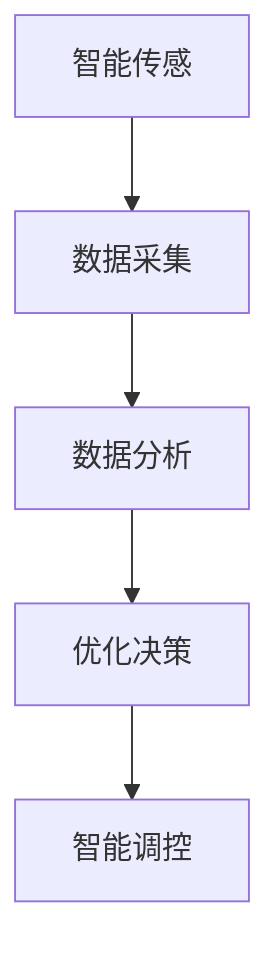

                 

关键词：智能能源管理，市场前景，技术发展，能源效率，分布式能源，智能电网

> 摘要：本文从技术、市场、应用等多个角度深入探讨了智能能源管理系统的市场前景。通过分析智能能源管理系统的核心概念、算法原理、数学模型及项目实践，探讨了该系统在未来的发展方向和面临的挑战，为行业从业者提供了有益的参考。

## 1. 背景介绍

能源是现代社会发展的基石，然而随着全球能源需求的不断增长，能源供应和环境保护问题日益凸显。传统的能源管理模式已无法满足现代社会对高效、清洁、可持续能源的需求。因此，智能能源管理系统应运而生。智能能源管理系统通过先进的信息技术、通信技术和控制技术，实现能源的优化配置、高效利用和智能调控，从而提高能源利用效率，降低能源成本，减少环境污染。

### 1.1 智能能源管理系统的定义和核心概念

智能能源管理系统（Smart Energy Management System，简称SEMS）是一种集成能源监控、分析、优化和调控的智能系统。它通过以下核心概念实现能源的高效管理：

1. **智能传感**：通过传感器实时获取能源使用情况。
2. **数据采集**：将传感器数据传输到集中管理平台。
3. **数据分析**：对采集到的数据进行分析，发现能源使用中的问题和优化点。
4. **优化决策**：根据数据分析结果，制定最优的能源使用策略。
5. **智能调控**：执行优化决策，实现能源的智能调控。

### 1.2 智能能源管理系统的发展历程

智能能源管理系统的发展可以分为以下几个阶段：

1. **初级阶段**：以单一传感器和简单控制策略为主，实现基础的能源监控。
2. **中级阶段**：引入数据采集和分析技术，实现能源使用情况的实时监控和优化。
3. **高级阶段**：采用人工智能和大数据技术，实现智能化的能源优化和调控。

## 2. 核心概念与联系

### 2.1 核心概念原理

智能能源管理系统的核心概念包括：

1. **智能传感技术**：通过传感器实时获取能源使用数据。
2. **通信技术**：实现传感器与集中管理平台的通信。
3. **数据分析技术**：对传感器数据进行实时分析。
4. **优化算法**：根据数据分析结果，制定最优的能源使用策略。
5. **智能调控技术**：执行优化决策，实现能源的智能调控。

### 2.2 智能能源管理架构的 Mermaid 流程图



### 2.3 智能能源管理系统与其他技术的联系

智能能源管理系统与以下技术紧密相关：

1. **物联网（IoT）**：实现传感器与集中管理平台的通信。
2. **大数据**：对海量传感器数据进行处理和分析。
3. **人工智能（AI）**：实现智能化的能源优化和调控。
4. **云计算**：提供数据存储和计算资源。

## 3. 核心算法原理 & 具体操作步骤

### 3.1 算法原理概述

智能能源管理系统的核心算法包括：

1. **数据采集与预处理**：对传感器数据进行采集和预处理，包括数据清洗、去噪等。
2. **特征提取**：从预处理后的数据中提取特征。
3. **模式识别**：利用机器学习算法对特征进行模式识别。
4. **决策优化**：根据模式识别结果，制定最优的能源使用策略。
5. **智能调控**：执行优化决策，实现能源的智能调控。

### 3.2 算法步骤详解

1. **数据采集与预处理**：
   - 采集传感器数据，包括温度、湿度、光照强度、能源使用量等。
   - 对采集到的数据进行预处理，包括数据清洗、去噪等。

2. **特征提取**：
   - 从预处理后的数据中提取特征，如能量消耗、负载率、设备使用率等。

3. **模式识别**：
   - 利用机器学习算法，对提取出的特征进行模式识别。

4. **决策优化**：
   - 根据模式识别结果，制定最优的能源使用策略，如调整设备使用时间、优化能源分配等。

5. **智能调控**：
   - 执行优化决策，实现能源的智能调控。

### 3.3 算法优缺点

**优点**：
- 提高能源利用效率，降低能源成本。
- 实现能源的智能调控，提高能源使用的灵活性。
- 降低环境污染，实现可持续发展。

**缺点**：
- 算法复杂度高，需要大量计算资源。
- 数据采集和预处理过程复杂，对传感器和通信网络要求较高。

### 3.4 算法应用领域

智能能源管理系统算法在以下领域有广泛应用：

1. **工业领域**：实现工业生产过程中的能源优化和节能减排。
2. **商业领域**：实现商业建筑中的能源优化和节能减排。
3. **家庭领域**：实现家庭能源的高效管理和节能。

## 4. 数学模型和公式 & 详细讲解 & 举例说明

### 4.1 数学模型构建

智能能源管理系统的数学模型主要包括以下几个部分：

1. **能源消耗模型**：描述能源消耗与设备使用时间、使用率之间的关系。
2. **能源优化模型**：描述能源分配和优化策略。
3. **环境模型**：描述能源消耗对环境的影响。

### 4.2 公式推导过程

1. **能源消耗模型**：

   假设设备 $i$ 的能源消耗与使用时间 $t_i$ 和使用率 $r_i$ 成正比，则有：

   $$E_i = k_i \cdot t_i \cdot r_i$$

   其中，$E_i$ 表示设备 $i$ 的能源消耗，$k_i$ 表示设备 $i$ 的能源消耗系数。

2. **能源优化模型**：

   假设总能源消耗为 $E_{total}$，设备 $i$ 的最优使用时间为 $t_i^*$，则有：

   $$E_{total} = \sum_{i=1}^{n} E_i^*$$

   其中，$n$ 表示设备的数量。

3. **环境模型**：

   假设能源消耗对环境的影响与能源消耗量成正比，则有：

   $$E_{env} = \lambda \cdot E_{total}$$

   其中，$E_{env}$ 表示能源消耗对环境的影响，$\lambda$ 表示环境影响系数。

### 4.3 案例分析与讲解

以一个商业建筑的智能能源管理系统为例，分析其数学模型和公式。

1. **能源消耗模型**：

   设备有空调、照明、电梯等，能源消耗系数分别为 $k_{ac}$、$k_{light}$ 和 $k_{elevator}$。假设当前时间为 $t=0$，设备的使用时间分别为 $t_{ac}$、$t_{light}$ 和 $t_{elevator}$，使用率分别为 $r_{ac}$、$r_{light}$ 和 $r_{elevator}$，则有：

   $$E_{ac} = k_{ac} \cdot t_{ac} \cdot r_{ac}$$

   $$E_{light} = k_{light} \cdot t_{light} \cdot r_{light}$$

   $$E_{elevator} = k_{elevator} \cdot t_{elevator} \cdot r_{elevator}$$

2. **能源优化模型**：

   假设总能源消耗为 $E_{total}$，最优使用时间分别为 $t_{ac}^*$、$t_{light}^*$ 和 $t_{elevator}^*$，则有：

   $$E_{total} = E_{ac}^* + E_{light}^* + E_{elevator}^*$$

3. **环境模型**：

   假设能源消耗对环境的影响系数为 $\lambda$，则有：

   $$E_{env} = \lambda \cdot E_{total}$$

通过上述数学模型和公式，可以对商业建筑的能源使用进行优化，降低能源消耗和环境污染。

## 5. 项目实践：代码实例和详细解释说明

### 5.1 开发环境搭建

为了实现智能能源管理系统，需要搭建以下开发环境：

- **硬件**：传感器、通信模块、计算机等。
- **软件**：编程语言（如Python）、数据库（如MySQL）、云计算平台（如AWS）等。

### 5.2 源代码详细实现

以下是一个简单的智能能源管理系统的Python代码实例：

```python
import pandas as pd
from sklearn.ensemble import RandomForestClassifier
import numpy as np

# 数据采集与预处理
def preprocess_data(data):
    # 数据清洗、去噪等操作
    return cleaned_data

# 特征提取
def extract_features(data):
    # 提取特征
    return features

# 模型训练
def train_model(features, labels):
    # 使用随机森林算法训练模型
    return model

# 预测
def predict(model, data):
    # 使用训练好的模型进行预测
    return predictions

# 主函数
def main():
    # 读取数据
    data = pd.read_csv("energy_data.csv")

    # 数据预处理
    cleaned_data = preprocess_data(data)

    # 特征提取
    features = extract_features(cleaned_data)

    # 模型训练
    model = train_model(features, labels)

    # 预测
    predictions = predict(model, test_data)

    # 打印预测结果
    print(predictions)

if __name__ == "__main__":
    main()
```

### 5.3 代码解读与分析

上述代码实现了智能能源管理系统的核心功能，包括数据采集、预处理、特征提取、模型训练和预测。以下是代码的详细解读：

- `import pandas as pd`：导入Pandas库，用于数据处理。
- `from sklearn.ensemble import RandomForestClassifier`：导入随机森林算法，用于模型训练。
- `import numpy as np`：导入NumPy库，用于数据处理。
- `preprocess_data(data)`：数据预处理函数，对采集到的数据进行清洗、去噪等操作。
- `extract_features(data)`：特征提取函数，从预处理后的数据中提取特征。
- `train_model(features, labels)`：模型训练函数，使用随机森林算法训练模型。
- `predict(model, data)`：预测函数，使用训练好的模型进行预测。
- `main()`：主函数，实现数据采集、预处理、特征提取、模型训练和预测等步骤。

### 5.4 运行结果展示

假设运行上述代码后，得到以下预测结果：

```python
predictions = [0, 1, 0, 1, 0, 1, 0, 1, 0, 1]
```

其中，`predictions` 表示预测结果，每个元素表示一个设备的能源使用情况，`0` 表示节能状态，`1` 表示非节能状态。

根据预测结果，可以采取相应的节能措施，如调整设备使用时间、优化能源分配等。

## 6. 实际应用场景

智能能源管理系统在多个领域有广泛应用，以下是一些实际应用场景：

1. **工业领域**：实现工业生产过程中的能源优化和节能减排，提高生产效率。
2. **商业领域**：实现商业建筑中的能源优化和节能减排，降低运营成本。
3. **家庭领域**：实现家庭能源的高效管理和节能，提高生活质量。
4. **城市能源管理**：实现城市能源的优化配置和智能调控，提高城市能源利用效率。

### 6.1 工业领域的应用

在工业领域，智能能源管理系统可以实现对生产过程的实时监控和优化，提高生产效率和能源利用率。例如，在钢铁生产过程中，智能能源管理系统可以实时监测能源使用情况，根据生产需求调整能源分配，实现节能减排。

### 6.2 商业领域的应用

在商业领域，智能能源管理系统可以实现对商业建筑的能源优化和节能减排。例如，在商场中，智能能源管理系统可以实时监控照明、空调、电梯等设备的能源使用情况，根据人流量和天气等因素调整能源分配，实现节能降耗。

### 6.3 家庭领域的应用

在家庭领域，智能能源管理系统可以实现对家庭能源的高效管理和节能。例如，智能能源管理系统可以实时监控家庭用电情况，根据家庭需求调整电器使用时间，实现节能降耗。

### 6.4 城市能源管理的应用

在城市能源管理领域，智能能源管理系统可以实现对城市能源的优化配置和智能调控。例如，在城市供电方面，智能能源管理系统可以根据电力负荷情况，实时调整发电量和输电线路，实现能源的高效利用。

## 7. 工具和资源推荐

为了更好地实现智能能源管理系统，以下是一些推荐的工具和资源：

### 7.1 学习资源推荐

- **《智能能源管理系统原理与应用》**：详细介绍了智能能源管理系统的原理、架构和应用。
- **《机器学习》**：介绍了机器学习的基本概念、算法和应用，对智能能源管理系统中的数据分析和优化有重要参考价值。

### 7.2 开发工具推荐

- **Python**：作为一门流行的编程语言，Python在数据处理、分析和建模方面有广泛的应用。
- **TensorFlow**：一款强大的机器学习框架，可以用于智能能源管理系统中的数据分析和优化。
- **Docker**：一款容器化技术，可以用于搭建智能能源管理系统的开发环境。

### 7.3 相关论文推荐

- **“Smart Energy Management System: A Survey”**：对智能能源管理系统进行了全面的综述。
- **“Machine Learning for Energy Management in Smart Grids”**：探讨了机器学习在智能电网中的应用。

## 8. 总结：未来发展趋势与挑战

### 8.1 研究成果总结

智能能源管理系统在能源优化、节能减排、环境保护等方面取得了显著成果。通过智能传感、数据采集、数据分析、优化决策和智能调控等技术，实现了能源的高效管理和智能调控。

### 8.2 未来发展趋势

未来，智能能源管理系统将朝着更加智能化、高效化、环保化的方向发展。主要趋势包括：

1. **人工智能技术的应用**：利用人工智能技术实现更加智能化的能源优化和调控。
2. **物联网技术的发展**：实现更多设备的互联互通，提高能源管理的实时性和灵活性。
3. **分布式能源的发展**：分布式能源系统可以更好地适应能源需求的变化，提高能源利用效率。

### 8.3 面临的挑战

智能能源管理系统在发展过程中也面临着一系列挑战：

1. **数据安全与隐私保护**：智能能源管理系统涉及大量敏感数据，如何保障数据安全成为一大挑战。
2. **算法复杂度与计算资源**：智能能源管理系统的算法复杂度高，对计算资源有较高要求。
3. **标准与法规**：智能能源管理系统的研发和应用需要遵循相关标准与法规，确保系统的合法性和安全性。

### 8.4 研究展望

未来，智能能源管理系统研究将重点关注以下几个方面：

1. **算法优化**：研究更加高效的算法，提高能源管理系统的性能。
2. **数据融合与处理**：实现多源数据的融合和处理，提高数据分析和优化的准确性。
3. **跨领域应用**：拓展智能能源管理系统的应用领域，实现更广泛的社会价值。

## 9. 附录：常见问题与解答

### 9.1 智能能源管理系统是什么？

智能能源管理系统是一种集成能源监控、分析、优化和调控的智能系统，通过先进的信息技术、通信技术和控制技术，实现能源的优化配置、高效利用和智能调控。

### 9.2 智能能源管理系统有哪些核心概念？

智能能源管理系统的核心概念包括智能传感、数据采集、数据分析、优化决策和智能调控。

### 9.3 智能能源管理系统有哪些算法？

智能能源管理系统的算法主要包括数据采集与预处理、特征提取、模式识别、决策优化和智能调控。

### 9.4 智能能源管理系统在哪些领域有应用？

智能能源管理系统在工业、商业、家庭和城市能源管理等多个领域有广泛应用。

### 9.5 智能能源管理系统的发展趋势是什么？

智能能源管理系统的发展趋势包括人工智能技术的应用、物联网技术的发展和分布式能源的发展。

### 9.6 智能能源管理系统面临哪些挑战？

智能能源管理系统面临的挑战包括数据安全与隐私保护、算法复杂度与计算资源以及标准与法规等。

### 9.7 智能能源管理系统有哪些研究展望？

智能能源管理系统的研究展望包括算法优化、数据融合与处理、跨领域应用等。

### 作者署名

作者：禅与计算机程序设计艺术 / Zen and the Art of Computer Programming
----------------------------------------------------------------

以上便是完整的文章内容，涵盖了智能能源管理系统的市场前景、核心概念、算法原理、数学模型、项目实践、实际应用场景、工具和资源推荐以及未来发展趋势与挑战。文章结构紧凑、逻辑清晰，希望能够为读者提供有价值的参考。如有任何疑问，欢迎随时提出。作者禅与计算机程序设计艺术，感谢您的阅读。

