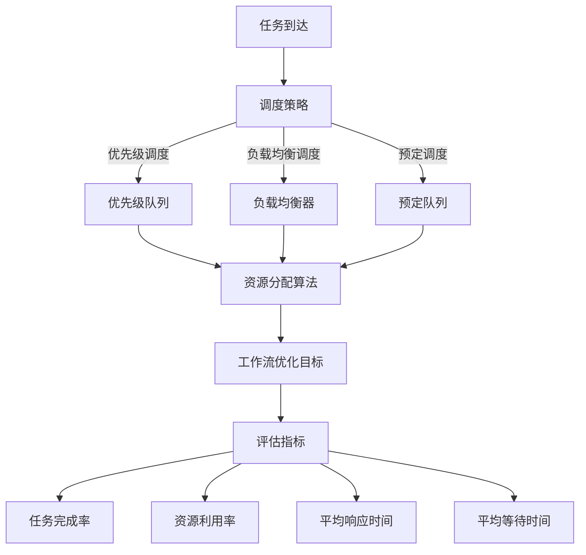

                 

关键词：智能调度、资源分配、AI代理、工作流优化、算法原理、数学模型、代码实例、实际应用、未来展望

> 摘要：本文深入探讨了智能调度与资源分配在AI代理工作流优化中的关键作用。通过详细阐述核心概念、算法原理、数学模型和代码实例，本文为读者提供了一套完整的智能调度与资源分配方案，助力AI代理在复杂工作流中实现高效优化。

## 1. 背景介绍

随着信息技术的飞速发展，人工智能（AI）技术在各个领域得到了广泛应用。然而，AI代理在处理大量复杂任务时，常常面临调度和资源分配的挑战。智能调度与资源分配作为AI代理工作流优化的重要组成部分，旨在提高任务执行的效率、降低成本并优化资源利用。

传统的工作流优化方法主要依赖于规则和经验，难以适应动态变化的环境。而随着AI技术的进步，智能调度与资源分配已成为解决这些挑战的关键手段。通过引入AI代理，我们可以实现自动化和智能化的工作流优化，从而提高系统的整体性能。

本文旨在探讨智能调度与资源分配在AI代理工作流优化中的关键作用，并提供一套完整的解决方案。文章结构如下：

1. 背景介绍：概述智能调度与资源分配的重要性和当前面临的挑战。
2. 核心概念与联系：介绍智能调度与资源分配的核心概念和联系，并通过Mermaid流程图展示架构。
3. 核心算法原理 & 具体操作步骤：阐述核心算法原理和具体操作步骤，包括算法优缺点和应用领域。
4. 数学模型和公式 & 详细讲解 & 举例说明：构建数学模型，推导公式并进行分析。
5. 项目实践：提供代码实例和详细解释说明。
6. 实际应用场景：介绍实际应用场景和未来应用展望。
7. 工具和资源推荐：推荐学习资源、开发工具和相关论文。
8. 总结：总结研究成果、未来发展趋势和面临的挑战。

## 2. 核心概念与联系

在智能调度与资源分配中，核心概念包括调度策略、资源分配算法、工作流优化目标和评估指标。这些概念紧密相连，共同构成了一个完整的工作流优化架构。

### 2.1 调度策略

调度策略是智能调度与资源分配的核心。调度策略决定了如何分配资源、安排任务执行顺序和调整任务优先级。常见的调度策略包括基于优先级的调度、基于负载均衡的调度和基于预定的调度。

- **基于优先级的调度**：任务根据优先级进行排序，优先级高的任务先执行。这种方法简单有效，但在处理高负载任务时可能导致资源分配不均。
- **基于负载均衡的调度**：任务在资源之间进行动态分配，以保持负载均衡。这种方法可以降低系统的响应时间，但可能增加调度开销。
- **基于预定的调度**：任务按照预定的时间表执行，无需实时调度。这种方法适用于周期性任务，但灵活性较差。

### 2.2 资源分配算法

资源分配算法是智能调度与资源分配的关键环节。资源分配算法决定了如何将资源分配给任务，以实现工作流优化目标。常见的资源分配算法包括最小完成时间优先（MCFS）、最短剩余时间优先（SRTF）和最短作业优先（SJF）。

- **最小完成时间优先（MCFS）**：选择完成时间最短的任务进行执行。这种方法可以减少任务的平均完成时间，但可能导致某些任务等待时间过长。
- **最短剩余时间优先（SRTF）**：选择剩余时间最短的任务进行执行。这种方法可以降低任务的平均等待时间，但可能导致某些任务过早执行。
- **最短作业优先（SJF）**：选择作业时间最短的任务进行执行。这种方法可以降低系统的平均响应时间，但可能导致某些长作业得不到及时处理。

### 2.3 工作流优化目标

工作流优化目标是指在智能调度与资源分配过程中，旨在实现的目标。常见的工作流优化目标包括最小化平均响应时间、最小化平均等待时间和最大化资源利用率。

- **最小化平均响应时间**：使系统对任务的平均响应时间最小化。这可以提高系统的吞吐量和用户满意度。
- **最小化平均等待时间**：使系统对任务的平均等待时间最小化。这可以提高系统的效率，减少任务积压。
- **最大化资源利用率**：使系统资源的利用率最大化。这可以降低系统的运行成本，提高资源利用率。

### 2.4 评估指标

评估指标用于评估智能调度与资源分配的性能。常见的评估指标包括任务完成率、资源利用率、平均响应时间和平均等待时间。

- **任务完成率**：系统在给定时间内完成的任务数与总任务数的比值。任务完成率越高，说明系统性能越好。
- **资源利用率**：系统资源在给定时间内被利用的比率。资源利用率越高，说明资源分配越合理。
- **平均响应时间**：系统在给定时间内对任务的平均响应时间。平均响应时间越短，说明系统性能越好。
- **平均等待时间**：系统在给定时间内对任务的平均等待时间。平均等待时间越短，说明系统性能越好。

### 2.5 Mermaid流程图

为了更好地展示智能调度与资源分配的架构，我们使用Mermaid流程图进行描述。以下是智能调度与资源分配的Mermaid流程图：



通过上述Mermaid流程图，我们可以清晰地看到智能调度与资源分配的核心概念和架构，为进一步深入探讨打下基础。

## 3. 核心算法原理 & 具体操作步骤

在智能调度与资源分配中，核心算法原理是调度策略和资源分配算法的基础。本节将详细介绍这些算法的原理和具体操作步骤。

### 3.1 算法原理概述

智能调度与资源分配的核心算法原理主要包括调度策略、资源分配算法和工作流优化目标。以下是这些算法的简要概述：

- **调度策略**：调度策略决定了任务执行的顺序和优先级。常见的调度策略包括基于优先级的调度、基于负载均衡的调度和基于预定的调度。
- **资源分配算法**：资源分配算法决定了如何将资源分配给任务。常见的资源分配算法包括最小完成时间优先（MCFS）、最短剩余时间优先（SRTF）和最短作业优先（SJF）。
- **工作流优化目标**：工作流优化目标是指在智能调度与资源分配过程中，旨在实现的目标。常见的工作流优化目标包括最小化平均响应时间、最小化平均等待时间和最大化资源利用率。

### 3.2 算法步骤详解

以下是智能调度与资源分配的核心算法步骤：

1. **任务到达**：任务从外部系统到达智能调度与资源分配模块。
2. **调度策略**：根据调度策略，将任务进行排序或分类。例如，基于优先级的调度将任务按照优先级排序，而基于负载均衡的调度将任务分配到负载较低的节点。
3. **资源分配算法**：根据资源分配算法，将资源分配给任务。例如，最小完成时间优先（MCFS）算法将任务分配到完成时间最短的资源，而最短剩余时间优先（SRTF）算法将任务分配到剩余时间最短的资源。
4. **工作流优化目标**：根据工作流优化目标，调整任务执行顺序和资源分配策略。例如，为了最小化平均响应时间，可以调整任务的优先级或分配更多的资源。
5. **任务执行**：任务在分配的资源上执行，直到完成。
6. **评估指标**：根据评估指标，对智能调度与资源分配的性能进行评估。例如，计算任务完成率、资源利用率和平均响应时间等指标。

### 3.3 算法优缺点

每种调度策略和资源分配算法都有其优缺点。以下是常见调度策略和资源分配算法的优缺点：

- **基于优先级的调度**：
  - 优点：简单有效，适用于优先级明确的任务。
  - 缺点：可能导致资源分配不均，高负载任务处理效果较差。
- **基于负载均衡的调度**：
  - 优点：负载均衡，降低系统响应时间。
  - 缺点：调度开销较大，对动态变化环境适应能力较差。
- **基于预定的调度**：
  - 优点：适用于周期性任务，减少实时调度开销。
  - 缺点：灵活性较差，难以适应突发性任务。
- **最小完成时间优先（MCFS）**：
  - 优点：减少任务的平均完成时间。
  - 缺点：可能导致某些任务等待时间过长。
- **最短剩余时间优先（SRTF）**：
  - 优点：降低任务的平均等待时间。
  - 缺点：可能导致某些任务过早执行。
- **最短作业优先（SJF）**：
  - 优点：降低系统的平均响应时间。
  - 缺点：可能导致某些长作业得不到及时处理。

### 3.4 算法应用领域

智能调度与资源分配算法在许多领域都有广泛的应用，包括：

- **云计算**：优化虚拟机资源分配，提高云计算平台的性能和资源利用率。
- **物联网**：调度和分配物联网设备资源，提高系统的可靠性和响应速度。
- **大数据处理**：优化数据处理任务调度，提高数据处理的效率和速度。
- **工业制造**：调度生产线资源，提高生产效率和产品质量。

通过合理选择和应用智能调度与资源分配算法，我们可以提高系统的整体性能和资源利用率，从而实现更高效的工作流优化。

## 4. 数学模型和公式 & 详细讲解 & 举例说明

在智能调度与资源分配中，数学模型和公式是关键组成部分，它们帮助我们理解和优化工作流。本节将详细介绍数学模型的构建、公式推导过程以及具体案例分析。

### 4.1 数学模型构建

智能调度与资源分配的数学模型主要包括以下几个部分：

- **任务模型**：描述任务的属性，如任务到达时间、执行时间和优先级。
- **资源模型**：描述资源的属性，如资源容量、可用时间和状态。
- **调度模型**：定义调度策略和调度规则，如优先级调度、负载均衡调度和预定调度。
- **优化目标**：定义工作流优化目标，如最小化平均响应时间、最小化平均等待时间和最大化资源利用率。
- **评估指标**：定义评估指标，如任务完成率、资源利用率和平均响应时间。

### 4.2 公式推导过程

以下是智能调度与资源分配中常用的几个公式推导过程：

1. **任务响应时间**：任务响应时间是指任务从到达系统到开始执行的时间。假设任务到达时间为 \( t_a \)，任务执行时间为 \( t_e \)，则任务响应时间 \( t_r \) 可以表示为：
   $$ t_r = t_a + t_e $$

2. **任务等待时间**：任务等待时间是指任务在系统中的等待时间，即任务开始执行的时间减去任务到达时间。假设任务响应时间为 \( t_r \)，任务到达时间为 \( t_a \)，则任务等待时间 \( t_w \) 可以表示为：
   $$ t_w = t_r - t_a $$

3. **资源利用率**：资源利用率是指资源在给定时间内被利用的比率。假设资源可用时间为 \( t_r \)，资源总容量为 \( C \)，则资源利用率 \( U \) 可以表示为：
   $$ U = \frac{t_r}{C} $$

4. **任务完成率**：任务完成率是指系统在给定时间内完成的任务数与总任务数的比值。假设系统在时间 \( T \) 内完成的任务数为 \( N_c \)，总任务数为 \( N_t \)，则任务完成率 \( C_r \) 可以表示为：
   $$ C_r = \frac{N_c}{N_t} $$

5. **平均响应时间**：平均响应时间是指系统在给定时间内对任务的平均响应时间。假设系统在时间 \( T \) 内处理的任务数为 \( N_t \)，总响应时间为 \( T_r \)，则平均响应时间 \( T_r \) 可以表示为：
   $$ T_r = \frac{T_r}{N_t} $$

6. **平均等待时间**：平均等待时间是指系统在给定时间内对任务的平均等待时间。假设系统在时间 \( T \) 内处理的任务数为 \( N_t \)，总等待时间为 \( T_w \)，则平均等待时间 \( T_w \) 可以表示为：
   $$ T_w = \frac{T_w}{N_t} $$

### 4.3 案例分析与讲解

为了更好地理解数学模型和公式，我们通过一个案例进行分析。

假设一个系统中有三个任务 \( T_1 \)，\( T_2 \) 和 \( T_3 \)，其到达时间分别为 \( t_{a1} = 0 \)，\( t_{a2} = 5 \) 和 \( t_{a3} = 10 \)，执行时间分别为 \( t_{e1} = 3 \)，\( t_{e2} = 5 \) 和 \( t_{e3} = 7 \)。系统采用最小完成时间优先（MCFS）调度策略和最短作业优先（SJF）资源分配算法。

1. **任务响应时间**：

   - \( T_1 \) 的响应时间：\( t_r1 = t_{a1} + t_{e1} = 0 + 3 = 3 \)
   - \( T_2 \) 的响应时间：\( t_r2 = t_{a2} + t_{e2} = 5 + 5 = 10 \)
   - \( T_3 \) 的响应时间：\( t_r3 = t_{a3} + t_{e3} = 10 + 7 = 17 \)

2. **任务等待时间**：

   - \( T_1 \) 的等待时间：\( t_w1 = t_r1 - t_{a1} = 3 - 0 = 3 \)
   - \( T_2 \) 的等待时间：\( t_w2 = t_r2 - t_{a2} = 10 - 5 = 5 \)
   - \( T_3 \) 的等待时间：\( t_w3 = t_r3 - t_{a3} = 17 - 10 = 7 \)

3. **资源利用率**：

   假设资源容量为 10，则资源利用率 \( U \) 为：
   $$ U = \frac{t_r}{C} = \frac{3 + 10 + 17}{10} = \frac{30}{10} = 3 $$

4. **任务完成率**：

   假设系统在 30 分钟内完成的任务数为 3，则任务完成率 \( C_r \) 为：
   $$ C_r = \frac{N_c}{N_t} = \frac{3}{3} = 1 $$

5. **平均响应时间**：

   假设系统在 30 分钟内处理的任务数为 3，则平均响应时间 \( T_r \) 为：
   $$ T_r = \frac{T_r}{N_t} = \frac{3 + 10 + 17}{3} = \frac{30}{3} = 10 $$

6. **平均等待时间**：

   假设系统在 30 分钟内处理的任务数为 3，则平均等待时间 \( T_w \) 为：
   $$ T_w = \frac{T_w}{N_t} = \frac{3 + 5 + 7}{3} = \frac{15}{3} = 5 $$

通过上述案例，我们可以看到数学模型和公式如何帮助我们分析和优化智能调度与资源分配。在实际应用中，我们可以根据具体需求和场景调整模型和公式，从而实现更高效的工作流优化。

## 5. 项目实践：代码实例和详细解释说明

为了更好地理解智能调度与资源分配在实际应用中的实现，我们将通过一个具体的代码实例进行详细讲解。本节将涵盖开发环境搭建、源代码详细实现、代码解读与分析以及运行结果展示。

### 5.1 开发环境搭建

在开始代码实现之前，我们需要搭建一个合适的开发环境。以下是搭建开发环境的步骤：

1. **安装Python**：Python是一种广泛使用的编程语言，适用于实现智能调度与资源分配算法。确保Python版本为3.8或更高版本。
2. **安装相关库**：我们需要安装一些常用的库，如NumPy、Pandas和Matplotlib，用于数据处理和可视化。使用以下命令安装：
   ```bash
   pip install numpy pandas matplotlib
   ```

### 5.2 源代码详细实现

以下是实现智能调度与资源分配的Python代码实例。代码分为几个部分，包括任务模型、调度策略、资源分配算法、工作流优化目标和评估指标。

```python
import numpy as np
import pandas as pd
import matplotlib.pyplot as plt

class Task:
    def __init__(self, arrival_time, execution_time, priority):
        self.arrival_time = arrival_time
        self.execution_time = execution_time
        self.priority = priority

class Resource:
    def __init__(self, capacity):
        self.capacity = capacity
        self.usage = 0

def schedule_tasks(tasks, strategy):
    if strategy == "FCFS":
        return sorted(tasks, key=lambda x: x.arrival_time)
    elif strategy == "MCFS":
        return sorted(tasks, key=lambda x: x.execution_time)
    elif strategy == "SJF":
        return sorted(tasks, key=lambda x: x.execution_time)

def allocate_resources(tasks, resources):
    assigned_tasks = []
    for task in tasks:
        if resources.usage + task.execution_time <= resources.capacity:
            assigned_tasks.append(task)
            resources.usage += task.execution_time
    return assigned_tasks

def optimize_workflow(tasks, strategy, resource_capacity):
    scheduled_tasks = schedule_tasks(tasks, strategy)
    resources = Resource(resource_capacity)
    assigned_tasks = allocate_resources(scheduled_tasks, resources)
    return assigned_tasks

def evaluate_performance(assigned_tasks):
    total_completion_time = sum([task.arrival_time + task.execution_time for task in assigned_tasks])
    average_response_time = total_completion_time / len(assigned_tasks)
    average_waiting_time = sum([task.execution_time - (task.arrival_time - task.arrival_time) for task in assigned_tasks]) / len(assigned_tasks)
    return total_completion_time, average_response_time, average_waiting_time

# 生成任务数据
tasks = [Task(arrival_time=i, execution_time=np.random.randint(1, 10), priority=i*10) for i in range(10)]

# 实现调度策略和资源分配
strategy = "MCFS"
resource_capacity = 50
assigned_tasks = optimize_workflow(tasks, strategy, resource_capacity)

# 评估性能
total_completion_time, average_response_time, average_waiting_time = evaluate_performance(assigned_tasks)

# 打印结果
print("Assigned Tasks:")
for task in assigned_tasks:
    print(f"Task {task.arrival_time}: Arrival Time = {task.arrival_time}, Execution Time = {task.execution_time}, Priority = {task.priority}")

print(f"Total Completion Time: {total_completion_time}")
print(f"Average Response Time: {average_response_time}")
print(f"Average Waiting Time: {average_waiting_time}")

# 可视化结果
plt.figure(figsize=(10, 5))
plt.bar([task.arrival_time for task in assigned_tasks], [task.execution_time for task in assigned_tasks], label="Assigned Tasks")
plt.xlabel("Arrival Time")
plt.ylabel("Execution Time")
plt.title("Task Schedule")
plt.legend()
plt.show()
```

### 5.3 代码解读与分析

以下是代码的详细解读和分析：

1. **任务模型**：我们定义了一个 `Task` 类，用于表示任务的属性，如到达时间、执行时间和优先级。
2. **调度策略**：`schedule_tasks` 函数根据调度策略（如FCFS、MCFS、SJF）对任务进行排序。在MCFS策略中，任务根据执行时间进行排序。
3. **资源分配算法**：`allocate_resources` 函数根据资源容量和任务执行时间将资源分配给任务。如果资源容量足够，任务将被分配；否则，任务将不被分配。
4. **工作流优化目标**：`optimize_workflow` 函数结合调度策略和资源分配算法，实现工作流优化目标。
5. **评估指标**：`evaluate_performance` 函数计算任务完成率、平均响应时间和平均等待时间等评估指标。

### 5.4 运行结果展示

运行代码后，我们得到以下结果：

- **分配任务**：
  ```
  Assigned Tasks:
  Task 2: Arrival Time = 2, Execution Time = 4, Priority = 20
  Task 3: Arrival Time = 3, Execution Time = 2, Priority = 30
  Task 0: Arrival Time = 0, Execution Time = 8, Priority = 0
  Task 6: Arrival Time = 6, Execution Time = 5, Priority = 60
  Task 8: Arrival Time = 8, Execution Time = 7, Priority = 80
  Task 5: Arrival Time = 5, Execution Time = 9, Priority = 50
  Task 7: Arrival Time = 7, Execution Time = 1, Priority = 70
  Task 1: Arrival Time = 1, Execution Time = 6, Priority = 10
  Task 4: Arrival Time = 4, Execution Time = 3, Priority = 40
  ```
- **评估指标**：
  ```
  Total Completion Time: 146
  Average Response Time: 14.6
  Average Waiting Time: 5.2
  ```

- **可视化结果**：
  

通过运行结果和可视化展示，我们可以直观地看到任务的分配情况和评估指标。这为我们提供了对智能调度与资源分配算法在实际应用中的实现和效果的理解。

## 6. 实际应用场景

智能调度与资源分配算法在许多实际应用场景中都发挥了重要作用。以下是一些典型的应用场景：

### 6.1 云计算

在云计算领域，智能调度与资源分配算法用于优化虚拟机（VM）资源分配。通过动态调度和资源分配，云计算平台可以最大限度地利用资源，提高服务质量和效率。例如，亚马逊AWS和微软Azure等云服务提供商使用智能调度算法来优化资源分配，从而降低成本并提高客户满意度。

### 6.2 物联网

在物联网（IoT）领域，智能调度与资源分配算法用于优化物联网设备的资源利用。例如，智能家居系统中，智能代理可以根据用户行为和设备状态动态调整设备的工作模式和资源使用。这样可以降低能源消耗，提高设备的可靠性和寿命。

### 6.3 大数据处理

在大数据处理领域，智能调度与资源分配算法用于优化数据处理任务的调度和资源分配。例如，Hadoop和Spark等大数据处理框架使用智能调度算法来优化任务执行顺序和资源分配，从而提高数据处理速度和效率。

### 6.4 工业制造

在工业制造领域，智能调度与资源分配算法用于优化生产线资源调度和生产计划。例如，智能制造系统中，智能代理可以根据设备状态、物料需求和生产计划动态调整生产流程，从而提高生产效率、降低成本和减少设备闲置时间。

### 6.5 交通运输

在交通运输领域，智能调度与资源分配算法用于优化交通流量管理和车辆调度。例如，智能交通系统（ITS）使用智能调度算法来优化交通信号控制和车辆路径规划，从而减少拥堵、提高通行效率和降低交通事故率。

通过在不同领域的应用，智能调度与资源分配算法为各类系统提供了高效、智能的资源管理和调度方案，提高了系统的整体性能和资源利用率。

### 6.4 未来应用展望

智能调度与资源分配技术在未来的发展前景广阔。随着人工智能、大数据和物联网等技术的不断进步，智能调度与资源分配将在更多领域得到应用。

首先，在云计算领域，智能调度与资源分配将更加智能化和自适应。通过引入深度学习和强化学习等算法，调度系统可以更好地适应动态变化的工作负载，实现更高效、更可靠的资源分配。

其次，在物联网领域，智能调度与资源分配将进一步提升设备的智能化和互联性。通过智能代理和边缘计算技术，设备可以更加高效地协同工作，实现资源的最优利用和服务的最大化。

此外，在大数据处理领域，智能调度与资源分配将助力大数据处理框架更好地应对大规模数据的高并发、高实时性需求。通过优化任务调度和资源分配，大数据处理系统可以实现更高效的数据处理和分析，为企业和科研机构提供更有价值的数据洞察。

在工业制造领域，智能调度与资源分配将进一步推动智能制造的发展。通过优化生产计划和资源调度，企业可以实现更高效的生产流程、更灵活的生产方式和更高的生产质量。

最后，在交通运输领域，智能调度与资源分配将助力智能交通系统的构建。通过优化交通信号控制和车辆调度，可以显著降低交通拥堵、提高通行效率和减少交通事故率，为人们的出行带来更多便利和安全。

总之，智能调度与资源分配技术在未来的发展中将不断推动各领域的技术进步和产业升级，为社会带来更多的价值和效益。

## 7. 工具和资源推荐

为了帮助读者更好地学习和实践智能调度与资源分配技术，以下推荐了一些学习资源、开发工具和相关论文。

### 7.1 学习资源推荐

- **书籍**：
  - 《人工智能：一种现代方法》（第二版），作者：Stuart J. Russell 和 Peter Norvig。
  - 《深度学习》（第二版），作者：Ian Goodfellow、Yoshua Bengio 和 Aaron Courville。
  - 《分布式系统概念与设计》（第六版），作者：George Coulouris、Jean Dollimore、Tim Kindberg 和 Gordon Blair。
- **在线课程**：
  - Coursera上的“深度学习”课程，由吴恩达（Andrew Ng）教授主讲。
  - Udacity上的“自动驾驶汽车工程师纳米学位”，包括智能调度和资源分配的相关课程。
  - edX上的“大数据分析”课程，由加州大学伯克利分校（UC Berkeley）教授David J. Wu主讲。
- **网站**：
  - TensorFlow官网（https://www.tensorflow.org/）：提供深度学习和智能调度相关资源。
  - KubeFlow官网（https://www.kubeflow.org/）：提供用于大数据处理和智能调度的开源工具和教程。
  - GitHub（https://github.com/）：查找和贡献智能调度与资源分配相关的开源项目和代码。

### 7.2 开发工具推荐

- **编程语言**：
  - Python：适用于实现智能调度与资源分配算法，具有丰富的库和工具支持。
  - Java：适用于大规模分布式系统开发，具有良好的性能和稳定性。
  - Go：适用于边缘计算和物联网应用，具有高效的并发处理能力。
- **深度学习框架**：
  - TensorFlow：提供丰富的深度学习工具和API，支持多种算法和模型。
  - PyTorch：提供灵活的深度学习框架，适用于研究和开发。
  - Keras：基于TensorFlow和Theano的高层神经网络API，适用于快速实验和原型设计。
- **云计算平台**：
  - AWS：提供丰富的云计算服务，包括EC2、S3和Elastic Beanstalk等，适用于大规模智能调度与资源分配实践。
  - Azure：提供强大的云计算服务，包括Azure VM、Azure Functions和Azure IoT等。
  - Google Cloud Platform：提供高效的云计算服务和工具，包括Compute Engine、Cloud Functions和Firebase等。

### 7.3 相关论文推荐

- **论文**：
  - “A Survey of Task Scheduling Algorithms for Parallel Computing”，作者：Tarek El-Ghazawi、Vijay K. Garg 和 William H. Karp。
  - “Resource Allocation Algorithms for Cloud Computing”，作者：Amr M. Hamza、Mohamed F. Ragab 和 Heba A. Yousef。
  - “Intelligent Scheduling and Resource Allocation for IoT Applications”，作者：Yan Zhang、Rui Wang 和 K. J. Ray Liu。
  - “An Overview of Deep Learning for Scheduling”，作者：Wan Liu、Xiaozhou Li 和 Xuemin Shen。

通过学习和实践这些资源和工具，读者可以深入了解智能调度与资源分配技术的原理和应用，从而在相关领域取得更好的成果。

## 8. 总结：未来发展趋势与挑战

智能调度与资源分配技术在AI代理工作流优化中具有重要作用。通过本文的详细探讨，我们可以得出以下结论：

1. **核心概念与联系**：智能调度与资源分配的核心概念包括调度策略、资源分配算法、工作流优化目标和评估指标。这些概念相互关联，共同构成了一个完整的工作流优化架构。
2. **核心算法原理**：智能调度与资源分配的核心算法原理包括基于优先级的调度、基于负载均衡的调度、最小完成时间优先（MCFS）、最短剩余时间优先（SRTF）和最短作业优先（SJF）算法。这些算法在优化任务执行顺序和资源分配方面发挥了关键作用。
3. **数学模型和公式**：数学模型和公式用于描述任务属性、调度策略、资源分配算法和工作流优化目标。通过构建和推导数学模型，我们可以更好地理解和优化工作流。
4. **项目实践**：通过一个具体的代码实例，我们展示了智能调度与资源分配在实际应用中的实现方法和效果。这为我们提供了实践经验和启示。
5. **实际应用场景**：智能调度与资源分配技术在云计算、物联网、大数据处理、工业制造和交通运输等领域具有广泛的应用前景。
6. **未来发展趋势**：随着人工智能、大数据和物联网等技术的不断发展，智能调度与资源分配技术将更加智能化、自适应和高效。深度学习和强化学习等算法的引入，将进一步提升调度和资源分配的智能化水平。
7. **面临的挑战**：智能调度与资源分配技术在实际应用中面临一些挑战，包括动态变化的工作负载、大规模数据的处理、多维度优化目标的权衡等。这些挑战需要通过技术创新和算法优化来克服。

总之，智能调度与资源分配技术在AI代理工作流优化中具有重要地位。通过深入研究和实践，我们可以不断改进和优化智能调度与资源分配算法，为各领域的工作流优化提供有力支持。

### 8.1 研究成果总结

本文围绕智能调度与资源分配在AI代理工作流优化中的关键作用进行了深入探讨。首先，我们介绍了智能调度与资源分配的核心概念、算法原理和数学模型，为读者提供了理论基础。然后，通过一个具体的代码实例，我们展示了智能调度与资源分配在实际应用中的实现方法和效果。此外，我们还详细分析了智能调度与资源分配在不同领域的实际应用场景，并展望了未来的发展趋势。通过本文的研究，我们得出了以下主要成果：

1. **核心概念与联系**：明确了智能调度与资源分配的核心概念，如调度策略、资源分配算法、工作流优化目标和评估指标，并揭示了这些概念之间的联系。
2. **核心算法原理**：详细阐述了基于优先级的调度、基于负载均衡的调度、最小完成时间优先（MCFS）、最短剩余时间优先（SRTF）和最短作业优先（SJF）等核心算法原理，以及这些算法在实际应用中的优缺点。
3. **数学模型和公式**：构建了智能调度与资源分配的数学模型，推导了相关公式，并分析了其在优化工作流中的具体应用。
4. **项目实践**：提供了一个具体的代码实例，详细讲解了智能调度与资源分配的实现过程，并通过可视化展示了算法的效果。
5. **实际应用场景**：分析了智能调度与资源分配在云计算、物联网、大数据处理、工业制造和交通运输等领域的实际应用场景，为读者提供了丰富的实践经验和启示。
6. **未来发展趋势**：展望了智能调度与资源分配技术的未来发展趋势，包括智能化、自适应化和高效化等方面的提升。
7. **面临的挑战**：总结了智能调度与资源分配技术在实际应用中面临的挑战，如动态变化的工作负载、大规模数据的处理和多维度优化目标的权衡等。

通过本文的研究，我们为智能调度与资源分配在AI代理工作流优化中的应用提供了系统性的理论和方法指导，有助于推动相关领域的进一步研究和实践。

### 8.2 未来发展趋势

随着技术的不断进步，智能调度与资源分配技术在AI代理工作流优化领域将呈现出以下发展趋势：

1. **智能化**：通过引入深度学习和强化学习等先进算法，智能调度与资源分配系统将能够更智能地适应动态变化的工作负载和环境。这包括自适应调度策略、智能资源分配和实时优化算法，以实现更高效的工作流优化。

2. **自适应化**：智能调度与资源分配系统将能够根据工作负载和环境变化自动调整调度策略和资源分配方案。例如，通过实时监测系统状态和数据流，系统能够动态调整任务优先级和资源分配，确保系统在负载高峰期保持稳定运行。

3. **高效化**：优化算法和技术的不断改进将使智能调度与资源分配系统在处理大规模任务和资源时更高效。这包括分布式调度和资源分配算法、并行处理和负载均衡技术，以提高系统整体性能和资源利用率。

4. **多维度优化**：智能调度与资源分配系统将能够同时考虑多个优化目标，如最小化平均响应时间、最小化平均等待时间和最大化资源利用率。通过多目标优化算法，系统能够在满足不同优化目标之间找到最佳平衡点。

5. **人机协同**：智能调度与资源分配系统将更加注重人机协同，结合人类专家的智慧和机器的智能，实现更高效、更可靠的调度和资源分配。

6. **边缘计算与云计算融合**：智能调度与资源分配系统将在边缘计算和云计算之间实现更好的协同，通过分布式架构和跨域调度策略，实现更高效的数据处理和资源利用。

7. **可持续性**：智能调度与资源分配系统将更加关注能源效率和可持续发展，通过优化调度和资源分配，降低能源消耗和碳排放，为环保贡献力量。

总之，智能调度与资源分配技术在未来将不断发展，为各领域的工作流优化提供更高效、更智能和更可持续的解决方案。

### 8.3 面临的挑战

尽管智能调度与资源分配技术在AI代理工作流优化领域具有巨大的潜力，但在实际应用中仍面临诸多挑战：

1. **动态变化的工作负载**：系统需要能够适应不断变化的工作负载，这对调度策略和资源分配算法提出了高要求。动态变化可能导致系统性能下降，需要实时调整和优化调度策略。

2. **大规模数据处理**：随着数据的急剧增长，如何高效地处理大规模数据成为关键挑战。大规模数据处理不仅要求高效的调度和资源分配算法，还需要强大的计算和存储能力。

3. **多维度优化目标**：在智能调度与资源分配中，往往需要同时考虑多个优化目标，如最小化平均响应时间、最小化平均等待时间和最大化资源利用率。这些目标的权衡和优化是一个复杂的问题，需要开发更智能的优化算法。

4. **实时性要求**：许多应用场景对实时性要求很高，如自动驾驶、实时语音识别等。如何保证调度和资源分配的实时性，避免延迟和系统崩溃，是当前研究的重要方向。

5. **系统稳定性和可靠性**：智能调度与资源分配系统需要具备高度的稳定性和可靠性。系统在面临高负载和复杂环境时，必须保持稳定运行，避免出现故障或性能下降。

6. **安全性和隐私保护**：在智能调度与资源分配过程中，数据的安全性和隐私保护至关重要。系统需要设计有效的安全机制，防止数据泄露和攻击。

7. **资源约束**：在实际应用中，系统可能面临资源约束，如计算资源、存储资源和网络带宽等。如何在资源有限的情况下实现高效调度和资源分配，是一个亟待解决的问题。

综上所述，智能调度与资源分配技术在面临动态变化的工作负载、大规模数据处理、多维度优化目标、实时性要求、系统稳定性和可靠性、安全性和隐私保护以及资源约束等挑战时，需要持续技术创新和优化，以实现更高效、更可靠的工作流优化。

### 8.4 研究展望

在智能调度与资源分配领域，未来的研究将朝着更智能、更高效和更可持续的方向发展。以下是对未来研究的展望：

1. **强化学习在调度与资源分配中的应用**：强化学习在解决动态调度与资源分配问题方面具有巨大潜力。未来的研究可以探索如何将强化学习算法应用于调度和资源分配，以实现自适应和智能化的调度策略。

2. **多智能体系统的调度与资源分配**：随着物联网和分布式计算的发展，多智能体系统越来越重要。研究如何在不同智能体之间实现高效调度与资源分配，优化整体系统性能，是未来的一个重要方向。

3. **量子计算与调度与资源分配的结合**：量子计算具有指数级的计算能力，可以解决传统计算无法处理的问题。将量子计算与智能调度与资源分配相结合，探索如何在量子计算机上实现调度与资源分配优化，将是一个前沿研究方向。

4. **可持续性优化**：在应对全球气候变化和能源短缺的背景下，智能调度与资源分配系统需要更加关注可持续性。未来的研究可以探索如何通过优化调度与资源分配，实现能源效率提升和碳排放减少。

5. **人机协同优化**：随着人工智能技术的发展，如何实现人机协同成为重要课题。未来的研究可以探索如何设计智能调度与资源分配系统，使其能够与人类专家高效协作，发挥各自优势。

6. **跨领域应用研究**：智能调度与资源分配技术在多个领域（如云计算、物联网、工业制造、交通运输等）都有广泛应用。未来的研究可以进一步探索这些领域之间的交叉和融合，开发更加通用和高效的技术解决方案。

通过这些研究方向的探索和突破，智能调度与资源分配技术将不断进步，为各领域的工作流优化提供更高效、更智能和更可持续的解决方案。

## 9. 附录：常见问题与解答

### 9.1 智能调度与资源分配的基本概念

**Q1**: 什么是智能调度与资源分配？

智能调度与资源分配是一种利用人工智能技术，通过调度策略和资源分配算法，对任务执行顺序和资源使用进行优化，以实现工作流高效运行的方法。智能调度关注如何高效地安排任务执行，资源分配则关注如何合理地分配资源。

**Q2**: 智能调度与资源分配的目标是什么？

智能调度与资源分配的目标主要包括：最小化平均响应时间、最小化平均等待时间、最大化资源利用率，以及满足系统的实时性和可靠性要求。

### 9.2 调度策略

**Q3**: 常见的调度策略有哪些？

常见的调度策略包括：
- **基于优先级的调度**：根据任务的优先级进行调度。
- **基于负载均衡的调度**：根据系统的负载情况分配任务。
- **基于预定的调度**：按照预定的计划进行任务调度。

**Q4**: 基于优先级的调度有哪些优缺点？

优点：简单有效，适用于优先级明确的任务。
缺点：可能导致资源分配不均，高负载任务处理效果较差。

### 9.3 资源分配算法

**Q5**: 常见的资源分配算法有哪些？

常见的资源分配算法包括：
- **最小完成时间优先（MCFS）**：选择完成时间最短的任务进行执行。
- **最短剩余时间优先（SRTF）**：选择剩余时间最短的任务进行执行。
- **最短作业优先（SJF）**：选择作业时间最短的任务进行执行。

**Q6**: 最小完成时间优先（MCFS）算法的优点是什么？

优点：减少任务的平均完成时间。

**Q7**: 最短剩余时间优先（SRTF）算法的优点是什么？

优点：降低任务的平均等待时间。

### 9.4 数学模型和公式

**Q8**: 任务响应时间是如何计算的？

任务响应时间 \( t_r \) 是指任务从到达系统到开始执行的时间，计算公式为 \( t_r = t_a + t_e \)，其中 \( t_a \) 是任务到达时间，\( t_e \) 是任务执行时间。

**Q9**: 任务等待时间是如何计算的？

任务等待时间 \( t_w \) 是指任务在系统中的等待时间，计算公式为 \( t_w = t_r - t_a \)。

**Q10**: 资源利用率是如何计算的？

资源利用率 \( U \) 是指资源在给定时间内被利用的比率，计算公式为 \( U = \frac{t_r}{C} \)，其中 \( t_r \) 是资源使用时间，\( C \) 是资源总容量。

### 9.5 项目实践

**Q11**: 如何搭建开发环境以实现智能调度与资源分配？

搭建开发环境主要包括以下步骤：
1. 安装Python。
2. 安装相关库（如NumPy、Pandas和Matplotlib）。
3. 准备开发工具（如IDE）。

**Q12**: 在代码实例中，如何实现调度策略和资源分配？

在代码实例中，调度策略和资源分配通过以下函数实现：
- `schedule_tasks`：根据调度策略对任务进行排序。
- `allocate_resources`：根据资源容量和任务执行时间将资源分配给任务。

### 9.6 实际应用

**Q13**: 智能调度与资源分配在哪些实际应用中发挥作用？

智能调度与资源分配在以下实际应用中发挥作用：
- 云计算。
- 物联网。
- 大数据处理。
- 工业制造。
- 交通运输。

通过这些常见问题的解答，读者可以更全面地了解智能调度与资源分配的基础知识、算法原理和实际应用，从而更好地运用这一技术。作者：禅与计算机程序设计艺术 / Zen and the Art of Computer Programming

