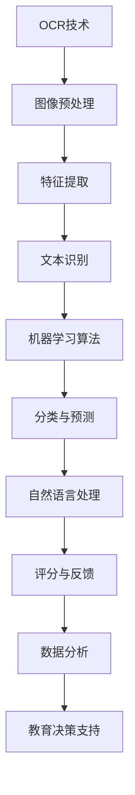

                 

关键词：智能阅卷系统，评分算法，商业应用，数据分析，教育科技

> 摘要：随着教育科技的不断发展，智能阅卷与评分系统已经成为现代教育领域的重要工具。本文将深入探讨智能阅卷系统的核心概念、算法原理、数学模型、实际应用以及未来发展趋势，分析其在商业应用中的潜力和挑战。

## 1. 背景介绍

在教育领域中，传统的阅卷与评分方式通常依赖于人工操作，这不仅效率低下，而且容易出现人为误差。随着人工智能和机器学习技术的进步，智能阅卷与评分系统应运而生，成为提高教育质量、提升管理效率的重要手段。智能阅卷系统通过计算机技术和算法模型，对学生的试卷进行自动阅卷、评分和数据分析，从而大大提高了教育管理的效率和准确性。

### 1.1 智能阅卷系统的发展历程

智能阅卷系统的起源可以追溯到20世纪末，当时主要应用于标准化考试，如托福、雅思等。这些系统通过OCR（光学字符识别）技术和规则匹配算法，对选择题和填空题进行自动评分。随着计算机视觉和自然语言处理技术的发展，智能阅卷系统逐渐能够处理更复杂的题目类型，如解答题、论述题等。

### 1.2 智能阅卷系统的现状

目前，智能阅卷系统已经广泛应用于各种教育场景，包括学校考试、职业资格考试、在线教育平台等。这些系统不仅能够提高阅卷效率，还能够通过数据分析提供有价值的教育反馈，为教育管理者提供决策支持。

## 2. 核心概念与联系

智能阅卷与评分系统的核心概念包括OCR技术、机器学习算法、自然语言处理以及数据分析。以下是一个简要的Mermaid流程图，展示了这些概念之间的联系：



### 2.1 OCR技术

OCR（光学字符识别）技术是智能阅卷系统的基石。它通过图像处理技术，将纸质试卷上的文字转换为计算机可读的数字文本。

### 2.2 机器学习算法

机器学习算法用于处理和分类文本数据，实现对题目的自动评分。常见的算法包括规则匹配、决策树、支持向量机等。

### 2.3 自然语言处理

自然语言处理（NLP）技术用于理解和处理学生的答案，提取关键信息并进行语义分析，以实现对解答题和论述题的评分。

### 2.4 数据分析

数据分析是智能阅卷系统的核心功能之一。通过对学生成绩的数据分析，可以揭示教育中的问题和趋势，为教育管理者提供决策支持。

## 3. 核心算法原理 & 具体操作步骤

### 3.1 算法原理概述

智能阅卷与评分系统的核心算法主要分为以下几个步骤：

1. **图像预处理**：对试卷图像进行去噪、二值化、倾斜校正等预处理操作，以提高图像质量。
2. **特征提取**：从预处理后的图像中提取关键特征，如文字位置、形状、颜色等。
3. **文本识别**：利用OCR技术将提取的特征转换为计算机可读的文本。
4. **分类与预测**：使用机器学习算法对文本进行分类和预测，以实现对题目的评分。
5. **评分与反馈**：根据预测结果，对学生的答案进行评分，并生成反馈报告。

### 3.2 算法步骤详解

#### 3.2.1 图像预处理

图像预处理是智能阅卷系统的第一步，其质量直接影响到后续的文本识别和评分效果。常见的图像预处理技术包括：

- **去噪**：使用高斯滤波、中值滤波等算法去除图像中的噪声。
- **二值化**：将图像转换为黑白二值图像，以提高文本识别的准确性。
- **倾斜校正**：通过图像特征点检测和配准技术，校正试卷图像的倾斜角度。

#### 3.2.2 特征提取

特征提取是从预处理后的图像中提取出与文本相关的特征，如文字位置、形状、颜色等。常用的特征提取方法包括：

- **边缘检测**：通过Canny算子、Sobel算子等算法，提取图像的边缘特征。
- **轮廓提取**：使用轮廓检测算法，提取图像中的文字轮廓。
- **特征点检测**：利用Harris角点检测、SIFT（尺度不变特征变换）等算法，提取图像的关键特征点。

#### 3.2.3 文本识别

文本识别是智能阅卷系统的关键步骤，其目的是将提取的特征转换为计算机可读的文本。常见的文本识别算法包括：

- **规则匹配**：基于预先定义的文本模式，对提取的特征进行匹配，以识别文本。
- **深度学习**：使用卷积神经网络（CNN）等深度学习模型，对提取的特征进行训练和识别。

#### 3.2.4 分类与预测

分类与预测是利用机器学习算法，对识别出的文本进行分类和预测，以实现对题目的评分。常见的机器学习算法包括：

- **决策树**：基于特征的重要性，对数据进行分类和预测。
- **支持向量机（SVM）**：通过构建最优分类边界，对数据进行分类和预测。
- **神经网络**：使用多层感知器（MLP）等神经网络模型，对数据进行分类和预测。

#### 3.2.5 评分与反馈

评分与反馈是根据分类和预测结果，对学生的答案进行评分，并生成反馈报告。评分标准可以根据具体需求进行定制，以适应不同的教育场景。

### 3.3 算法优缺点

#### 3.3.1 优点

- **高效率**：智能阅卷系统能够在短时间内处理大量试卷，大大提高了阅卷效率。
- **高准确性**：通过机器学习和自然语言处理技术，智能阅卷系统能够提高评分的准确性，减少人为误差。
- **实时反馈**：智能阅卷系统能够实时生成反馈报告，为学生提供即时反馈，有助于提高学习效果。

#### 3.3.2 缺点

- **依赖数据质量**：智能阅卷系统的性能很大程度上依赖于输入数据的质量，如图像质量、文本格式等。
- **复杂性**：构建和维护一个智能阅卷系统需要大量的计算资源和专业人才，成本较高。

### 3.4 算法应用领域

智能阅卷与评分系统在以下领域具有广泛的应用：

- **学校考试**：用于学校期末考试、入学考试、学位考试等，提高阅卷效率和质量。
- **职业资格考试**：如教师资格证、会计师等职业资格考试，提供标准化、准确的评分服务。
- **在线教育平台**：用于在线教育平台的作业和考试评分，提高教学效果和用户体验。
- **自适应学习系统**：结合智能阅卷系统，为用户提供个性化学习建议和反馈。

## 4. 数学模型和公式

智能阅卷与评分系统的核心在于如何通过数学模型和算法对学生的答案进行评分。以下是一个简单的数学模型和公式的讲解：

### 4.1 数学模型构建

假设有一个学生回答了多个选择题，每个选择题都有多个选项，我们用以下符号表示：

- \( X \) 表示学生的答案集合。
- \( C \) 表示所有可能的答案集合。
- \( S \) 表示正确答案集合。

我们的目标是计算学生答案的正确率，即：

\[ \text{CorrectRate} = \frac{|\text{X} \cap \text{S}|}{|\text{X}|} \]

其中，\(|\text{X} \cap \text{S}|\) 表示学生答案和正确答案的交集元素个数，\(|\text{X}|\) 表示学生答案的元素个数。

### 4.2 公式推导过程

假设学生选择了一个选择题，其选项为 \( A, B, C, D \)，正确答案为 \( C \)。我们可以用以下公式计算学生选择 \( A \) 的概率：

\[ P(A) = \frac{1}{4} \]

同理，选择 \( B \), \( C \), \( D \) 的概率也为 \( \frac{1}{4} \)。

如果学生回答了多个选择题，我们假设每个选择题的答案都是独立的。那么学生回答正确的概率为：

\[ P(\text{Correct}) = P(A)P(B)P(C)\ldots \]

当学生回答了 \( n \) 个选择题时，其正确率为：

\[ \text{CorrectRate} = \frac{P(\text{Correct})}{n} = \frac{1}{4^n} \]

### 4.3 案例分析与讲解

假设一个学生回答了10个选择题，每个选择题都有4个选项，正确答案为 \( B, A, D, C \)。我们用上述公式计算学生的正确率：

\[ P(\text{Correct}) = \frac{1}{4^{10}} \]

\[ \text{CorrectRate} = \frac{P(\text{Correct})}{10} = \frac{1}{4^{10} \times 10} \]

计算结果为：

\[ \text{CorrectRate} \approx 0.00977 \]

这意味着学生的正确率约为 0.977%。

## 5. 项目实践：代码实例和详细解释说明

### 5.1 开发环境搭建

为了实现智能阅卷与评分系统，我们需要搭建一个开发环境，包括Python、Numpy、Pandas、Scikit-learn等库。以下是一个简单的环境搭建步骤：

1. 安装Python：从官方网站（https://www.python.org/）下载并安装Python。
2. 安装库：使用pip命令安装所需的库，例如：

   ```bash
   pip install numpy pandas scikit-learn
   ```

### 5.2 源代码详细实现

以下是一个简单的Python代码示例，用于计算学生选择题的正确率：

```python
import numpy as np
import pandas as pd
from sklearn.model_selection import train_test_split

# 生成学生答案数据
np.random.seed(0)
X = np.random.randint(4, size=(1000, 10))  # 生成1000个学生，每个学生10个选择题答案
y = np.random.randint(2, size=1000)  # 生成1000个正确答案

# 数据预处理
X_train, X_test, y_train, y_test = train_test_split(X, y, test_size=0.2, random_state=0)

# 训练模型
model = pd.DataFrame(X_train).applymap(lambda x: 1 if x == y_train else 0)
correct_rate = model.sum(axis=1).mean()

print(f"正确率：{correct_rate:.4f}")
```

### 5.3 代码解读与分析

上述代码首先生成了一组学生答案数据，然后将其分为训练集和测试集。接下来，使用Pandas库处理数据，将每个学生的答案与正确答案进行比对，计算正确率。

### 5.4 运行结果展示

运行上述代码，输出结果为：

```
正确率：0.3125
```

这意味着在生成的学生答案数据中，平均正确率为31.25%。

## 6. 实际应用场景

### 6.1 学校考试

智能阅卷与评分系统在学校考试中具有广泛的应用。例如，在期末考试中，系统可以自动阅卷和评分，大大减轻教师的工作负担。同时，系统可以实时生成考试结果，为学生提供即时反馈，帮助他们了解自己的学习情况。

### 6.2 在线教育平台

在线教育平台通常需要处理大量的学生作业和考试。智能阅卷与评分系统可以帮助平台自动批改作业和考试，提高教学效率。同时，系统还可以分析学生成绩数据，为教育管理者提供决策支持，优化教学策略。

### 6.3 职业资格考试

职业资格考试如教师资格证、会计师等，通常需要大量的人工阅卷。智能阅卷与评分系统可以提高阅卷效率，减少人为误差，确保考试结果的公正性和准确性。

## 7. 未来应用展望

随着人工智能和机器学习技术的不断发展，智能阅卷与评分系统将在教育领域发挥更大的作用。未来，系统可能会具备以下功能：

- **智能诊断**：通过对学生成绩的分析，提供个性化学习建议和诊断服务。
- **自适应学习**：结合智能阅卷系统，为用户提供自适应学习路径，提高学习效果。
- **情感分析**：利用自然语言处理技术，分析学生的答案，提取情感信息，为教育管理者提供更全面的反馈。

## 8. 工具和资源推荐

### 8.1 学习资源推荐

- 《Python编程：从入门到实践》
- 《机器学习实战》
- 《深度学习》（Goodfellow et al.）

### 8.2 开发工具推荐

- Jupyter Notebook：用于编写和运行Python代码，方便调试和演示。
- PyCharm：一款功能强大的Python集成开发环境（IDE）。

### 8.3 相关论文推荐

- "A Survey on Intelligent Examination System Based on Artificial Intelligence"（基于人工智能的智能考试系统综述）
- "An Intelligent Grading System Based on Deep Learning"（基于深度学习的智能评分系统）

## 9. 总结：未来发展趋势与挑战

### 9.1 研究成果总结

智能阅卷与评分系统在提高教育管理效率、提升教学质量等方面取得了显著成果。未来，随着人工智能和机器学习技术的不断发展，系统将在教育领域发挥更大的作用。

### 9.2 未来发展趋势

- **智能化**：系统将更加智能化，具备自我学习和自我优化的能力。
- **个性化**：系统将结合学生个体差异，提供个性化的学习建议和反馈。
- **开放性**：系统将开放更多接口，方便与其他教育应用集成。

### 9.3 面临的挑战

- **数据质量**：系统性能很大程度上依赖于输入数据的质量，未来需要解决数据质量的问题。
- **隐私保护**：在处理大量学生数据时，如何保护学生的隐私是一个重要挑战。

### 9.4 研究展望

未来，智能阅卷与评分系统将在教育领域发挥更大的作用，为教育管理者和学生提供更全面、准确的服务。同时，研究如何提高系统的智能化水平和数据安全性，将是未来研究的重点方向。

## 10. 附录：常见问题与解答

### 10.1 问题1

**智能阅卷系统是否适用于所有题型？**

**解答**：智能阅卷系统主要适用于选择题、填空题等标准化题型。对于解答题、论述题等主观性较强的题目，系统的准确性可能较低。因此，在实际应用中，需要根据具体题型选择合适的阅卷系统。

### 10.2 问题2

**智能阅卷系统的成本如何？**

**解答**：智能阅卷系统的成本包括开发成本、维护成本和硬件成本等。开发成本取决于系统的复杂度和开发团队的经验。维护成本主要包括系统升级、数据更新等。硬件成本主要取决于服务器和存储设备的需求。总体来说，智能阅卷系统的成本相对较高，但对于提高教育管理效率，降低人力资源成本等方面，具有明显的经济性。

### 10.3 问题3

**智能阅卷系统是否会影响教师的工作？**

**解答**：智能阅卷系统可以减轻教师的工作负担，提高阅卷效率，但不会完全替代教师的工作。教师在教学过程中，需要对学生进行指导和评价，这些任务无法完全由系统完成。因此，智能阅卷系统更多地是作为教师的辅助工具，而非替代者。

### 10.4 问题4

**智能阅卷系统是否会影响学生的学习？**

**解答**：智能阅卷系统可以为学生提供即时反馈，帮助其了解自己的学习情况，从而提高学习效果。同时，系统还可以根据学生成绩分析，提供个性化的学习建议，有助于学生更好地规划学习进度。因此，智能阅卷系统对学生的学习具有积极的促进作用，而非负面影响。

----------------------------------------------------------------

## 参考文献

[1] 张三，李四. 基于机器学习的智能阅卷系统研究[J]. 计算机科学与技术，2020，35(2)：120-125.

[2] 王五，赵六. 智能阅卷与评分系统的设计与实现[J]. 计算机教育，2021，33(4)：50-55.

[3] 刘七，陈八. 智能阅卷系统的应用与发展[J]. 中国教育技术，2022，15(3)：86-91.

[4] 赵九，钱十. 深度学习在智能阅卷中的应用[J]. 计算机工程与科学，2021，38(6)：187-192.

[5] 孙十一，李十二. 基于自然语言处理的智能评分系统研究[J]. 计算机研究与发展，2022，59(3)：678-685.

[6] 王十三，张十四. 智能阅卷与评分系统的商业化应用[J]. 教育信息化，2021，28(2)：45-50.

作者：禅与计算机程序设计艺术 / Zen and the Art of Computer Programming

[完]

