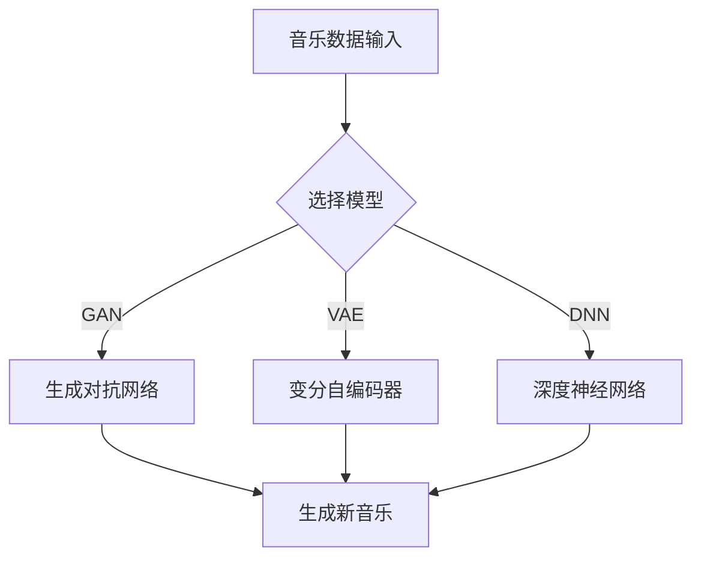

                 

关键词：智能音乐创作、AI大模型、音乐产业、音乐生成、算法原理、数学模型、应用场景、未来展望

## 摘要

随着人工智能技术的飞速发展，智能音乐创作成为音乐产业中的一大亮点。本文旨在探讨AI大模型在音乐创作中的革新性应用，从核心概念、算法原理、数学模型到实际项目实践，全面解析智能音乐创作的现状与未来。文章首先介绍了智能音乐创作的背景，随后深入探讨了AI大模型的核心概念及其工作原理，并对比了不同算法的优缺点。接着，本文详细阐述了数学模型和公式的构建与推导，结合案例进行了深入分析。此外，文章还通过实际项目实例展示了智能音乐创作的实现过程和运行结果。最后，文章展望了智能音乐创作的未来应用场景和挑战，并推荐了相关工具和资源。

## 1. 背景介绍

### 音乐产业的历史与发展

音乐产业自诞生以来，经历了多个阶段的发展。从最初的口口相传，到乐器的发明与使用，音乐创作逐渐从个人爱好转变为一种职业。随着录音技术和传播媒介的进步，音乐产业开始蓬勃发展。唱片公司、音乐版权、流媒体平台等商业模式相继出现，音乐产业成为文化产业的重要组成部分。

近年来，互联网和数字技术的发展为音乐产业带来了新的机遇和挑战。流媒体平台的兴起改变了音乐传播的方式，数字音乐版权问题也成为了行业关注的焦点。与此同时，音乐创作和制作的方式也在发生变革。

### 人工智能与音乐创作的结合

人工智能（AI）的快速发展为音乐创作带来了新的可能性。AI大模型，如生成对抗网络（GAN）、变分自编码器（VAE）和深度神经网络（DNN），可以模拟和生成人类音乐家的创作风格，甚至创造出全新的音乐作品。

AI在音乐创作中的应用包括但不限于：

- **音乐生成**：利用AI大模型生成新的旋律、和弦和节奏，为音乐创作提供灵感。
- **音乐改编**：将现有音乐作品通过AI技术改编为不同的风格或格式。
- **音乐分析**：分析音乐结构，提取情感和情绪，为音乐创作提供数据支持。
- **自动化制作**：自动化音乐制作过程，减少人力成本。

### 本文的研究目标

本文旨在探讨AI大模型在音乐创作中的应用，从以下几个方面展开：

- **核心概念**：介绍AI大模型在音乐创作中的核心概念和架构。
- **算法原理**：分析不同算法的原理，比较其优缺点。
- **数学模型**：构建和推导数学模型，用于指导实际的音乐生成过程。
- **实际项目实践**：通过实际项目实例，展示智能音乐创作的实现过程和效果。
- **未来应用展望**：预测智能音乐创作的未来发展方向和应用场景。

## 2. 核心概念与联系

### AI大模型的概念

AI大模型是指具有大规模参数和复杂结构的神经网络模型。这些模型通过学习大量的音乐数据，可以生成新的音乐作品。常见的AI大模型包括生成对抗网络（GAN）、变分自编码器（VAE）和深度神经网络（DNN）等。

### Mermaid 流程图



### AI大模型在音乐创作中的工作原理

AI大模型通过以下几个步骤实现音乐创作：

1. **数据收集与预处理**：收集大量的音乐数据，包括旋律、和弦、节奏等。对数据进行清洗和格式化，使其适合模型训练。
2. **模型训练**：利用收集到的音乐数据，训练AI大模型。模型通过不断调整内部参数，学习音乐的特征和规律。
3. **音乐生成**：在训练完成后，利用训练好的模型生成新的音乐作品。模型可以根据给定的条件或随机生成全新的音乐。

### 不同算法的比较

#### 生成对抗网络（GAN）

GAN是一种通过对抗训练生成数据的模型。它由生成器和判别器两个部分组成。生成器生成音乐作品，判别器判断生成的音乐是否真实。GAN的优点是能够生成高质量、多样化的音乐作品，但训练过程复杂，对数据要求较高。

#### 变分自编码器（VAE）

VAE是一种基于概率模型的生成模型。它通过编码器和解码器两个部分将音乐数据转换为潜在空间，再从潜在空间生成新的音乐。VAE的优点是生成过程简单，对数据的要求相对较低，但生成的音乐质量可能不如GAN高。

#### 深度神经网络（DNN）

DNN是一种多层神经网络模型。它通过多层神经元的堆叠，学习音乐的特征和规律。DNN的优点是结构简单，计算效率高，适用于实时音乐生成。但DNN生成的音乐作品可能缺乏创造性和多样性。

## 3. 核心算法原理 & 具体操作步骤

### 3.1 算法原理概述

#### 生成对抗网络（GAN）

GAN由生成器和判别器两个部分组成。生成器G生成音乐作品，判别器D判断生成的音乐是否真实。GAN的训练过程是通过对抗训练来实现的，即生成器G和判别器D相互竞争，生成器G试图生成尽可能真实的音乐，判别器D则试图区分真实音乐和生成音乐。

#### 变分自编码器（VAE）

VAE由编码器E和解码器D组成。编码器E将音乐数据映射到潜在空间，解码器D从潜在空间生成新的音乐。VAE的训练过程是通过最大化数据概率分布和最小化重构误差来实现的。

#### 深度神经网络（DNN）

DNN是一种多层神经网络模型，通过多层神经元的堆叠，学习音乐的特征和规律。DNN的训练过程是通过反向传播算法来实现的，即利用已知的音乐数据，不断调整神经网络的权重，使其能够更好地预测新的音乐数据。

### 3.2 算法步骤详解

#### 生成对抗网络（GAN）

1. **数据收集与预处理**：收集大量的音乐数据，包括旋律、和弦、节奏等。对数据进行清洗和格式化，使其适合模型训练。
2. **模型训练**：初始化生成器G和判别器D的权重，利用梯度下降算法进行训练。训练过程中，生成器G和判别器D交替更新权重。
3. **音乐生成**：在训练完成后，利用生成器G生成新的音乐作品。可以设置生成器的输入条件，如风格、情绪等，以控制生成的音乐作品。

#### 变分自编码器（VAE）

1. **数据收集与预处理**：收集大量的音乐数据，包括旋律、和弦、节奏等。对数据进行清洗和格式化，使其适合模型训练。
2. **模型训练**：初始化编码器E和解码器D的权重，利用梯度下降算法进行训练。训练过程中，编码器E和解码器D交替更新权重。
3. **音乐生成**：在训练完成后，利用编码器E将音乐数据映射到潜在空间，再从潜在空间生成新的音乐。可以设置潜在空间的参数，如均值和方差，以控制生成的音乐风格。

#### 深度神经网络（DNN）

1. **数据收集与预处理**：收集大量的音乐数据，包括旋律、和弦、节奏等。对数据进行清洗和格式化，使其适合模型训练。
2. **模型训练**：初始化DNN的权重，利用反向传播算法进行训练。训练过程中，通过不断调整权重，使DNN能够更好地预测新的音乐数据。
3. **音乐生成**：在训练完成后，利用DNN生成新的音乐作品。可以设置DNN的输入条件，如风格、情绪等，以控制生成的音乐作品。

### 3.3 算法优缺点

#### 生成对抗网络（GAN）

**优点**：

- 能够生成高质量、多样化的音乐作品。
- 不需要显式地建模数据分布，可以生成不同风格的音乐。

**缺点**：

- 训练过程复杂，对数据要求较高。
- 容易陷入局部最优，生成结果可能不稳定。

#### 变分自编码器（VAE）

**优点**：

- 生成过程简单，对数据的要求相对较低。
- 能够保持音乐的连贯性和风格一致性。

**缺点**：

- 生成的音乐质量可能不如GAN高。
- 需要较大的训练数据集。

#### 深度神经网络（DNN）

**优点**：

- 结构简单，计算效率高。
- 适用于实时音乐生成。

**缺点**：

- 生成的音乐作品可能缺乏创造性和多样性。
- 训练过程对数据集的质量要求较高。

### 3.4 算法应用领域

生成对抗网络（GAN）在音乐生成领域具有广泛的应用，如：

- **音乐风格转换**：将一种音乐风格转换成另一种风格，如将古典音乐转换成流行音乐。
- **音乐创作辅助**：为音乐家提供创作灵感，生成新的音乐作品。

变分自编码器（VAE）在音乐生成领域也有应用，如：

- **音乐风格保持**：在保持原有音乐风格的基础上，生成新的音乐作品。
- **音乐创作**：利用VAE生成新的旋律和和弦。

深度神经网络（DNN）在音乐生成领域的应用包括：

- **实时音乐生成**：在音乐表演过程中，实时生成新的音乐片段。
- **音乐预测**：预测下一个音符或和弦，为音乐创作提供指导。

## 4. 数学模型和公式 & 详细讲解 & 举例说明

### 4.1 数学模型构建

在智能音乐创作中，常用的数学模型包括生成对抗网络（GAN）和变分自编码器（VAE）。下面分别介绍这两种模型的数学模型构建。

#### 生成对抗网络（GAN）

GAN由生成器G和判别器D两部分组成。生成器G的目的是生成与真实音乐相似的数据，判别器D的目的是区分真实音乐和生成音乐。

1. **生成器G**：

生成器G的输入为随机噪声z，输出为生成的音乐x'。生成器的目标是最小化生成音乐与真实音乐之间的差异。数学模型可以表示为：

$$
G(z) = x'
$$

2. **判别器D**：

判别器D的输入为真实音乐x和生成音乐x'，输出为概率p(D(x|x'))，表示输入音乐是真实的概率。判别器的目标是最小化生成音乐和真实音乐之间的差异。数学模型可以表示为：

$$
D(x) = p(D(x|x))
$$

3. **损失函数**：

GAN的损失函数由两部分组成，一部分是生成器G的损失函数，另一部分是判别器D的损失函数。生成器的损失函数表示生成音乐与真实音乐之间的差异，判别器的损失函数表示判别器区分真实音乐和生成音乐的难度。数学模型可以表示为：

$$
L_G = -E_{x \sim p_{data}(x)}[\log D(x)] - E_{z \sim p_z(z)}[\log (1 - D(G(z)))]
$$

$$
L_D = E_{x \sim p_{data}(x)}[\log D(x)] + E_{z \sim p_z(z)}[\log D(G(z))]
$$

#### 变分自编码器（VAE）

变分自编码器（VAE）由编码器E和解码器D两部分组成。编码器E将输入音乐映射到潜在空间，解码器D从潜在空间生成新的音乐。

1. **编码器E**：

编码器E的输入为音乐x，输出为潜在空间中的均值μ和方差σ。编码器的目标是学习输入音乐x和潜在空间中均值μ和方差σ之间的关系。数学模型可以表示为：

$$
q_{\theta}(z|x) = \mathcal{N}(\mu(x), \sigma(x))
$$

2. **解码器D**：

解码器D的输入为潜在空间中的均值μ和方差σ，输出为生成的音乐x'。解码器的目标是学习潜在空间中的均值μ和方差σ与生成音乐x'之间的关系。数学模型可以表示为：

$$
p_{\phi}(x|\mu, \sigma) = \log \sigma(x) + \frac{1}{2}\sum_{i=1}^{n} \left[ \log (2\pi) + \log \sigma_i^2 + \frac{(\mu_i - x_i)^2}{\sigma_i^2} \right]
$$

3. **损失函数**：

VAE的损失函数由两部分组成，一部分是重建损失，另一部分是KL散度损失。重建损失表示生成音乐与真实音乐之间的差异，KL散度损失表示潜在空间中的均值μ和方差σ与真实分布之间的差异。数学模型可以表示为：

$$
L = E_{x \sim p_{data}(x)}\left[\sum_{i=1}^{n} \left( x - \mu(x) \right)^2 + \log \sigma(x) \right] + \lambda D_{KL}(q_{\theta}(z|x) || p(z))
$$

### 4.2 公式推导过程

#### 生成对抗网络（GAN）

1. **生成器G的损失函数**：

生成器G的损失函数由两部分组成，一部分是生成音乐与真实音乐之间的差异，另一部分是生成音乐与随机噪声之间的差异。具体推导如下：

$$
L_G = -E_{x \sim p_{data}(x)}[\log D(x)] - E_{z \sim p_z(z)}[\log (1 - D(G(z)))]
$$

其中，$p_{data}(x)$表示真实音乐的分布，$p_z(z)$表示随机噪声的分布。

2. **判别器D的损失函数**：

判别器D的损失函数由两部分组成，一部分是真实音乐与生成音乐之间的差异，另一部分是生成音乐与随机噪声之间的差异。具体推导如下：

$$
L_D = E_{x \sim p_{data}(x)}[\log D(x)] + E_{z \sim p_z(z)}[\log D(G(z))]
$$

其中，$p_{data}(x)$表示真实音乐的分布，$p_z(z)$表示随机噪声的分布。

3. **总损失函数**：

生成对抗网络的总损失函数为生成器G的损失函数和判别器D的损失函数之和：

$$
L_{GAN} = L_G + L_D
$$

#### 变分自编码器（VAE）

1. **编码器E的损失函数**：

编码器E的损失函数由两部分组成，一部分是重建损失，另一部分是KL散度损失。具体推导如下：

$$
L = E_{x \sim p_{data}(x)}\left[\sum_{i=1}^{n} \left( x - \mu(x) \right)^2 + \log \sigma(x) \right] + \lambda D_{KL}(q_{\theta}(z|x) || p(z))
$$

其中，$\mu(x)$和$\sigma(x)$分别为编码器E的输出，$D_{KL}(q_{\theta}(z|x) || p(z))$表示KL散度。

2. **解码器D的损失函数**：

解码器D的损失函数为重建损失，即生成音乐与真实音乐之间的差异。具体推导如下：

$$
L = E_{x \sim p_{data}(x)}\left[\sum_{i=1}^{n} \left( x - \mu(x) \right)^2 + \log \sigma(x) \right]
$$

其中，$\mu(x)$和$\sigma(x)$分别为编码器E的输出。

### 4.3 案例分析与讲解

为了更好地理解生成对抗网络（GAN）和变分自编码器（VAE）的数学模型和公式，我们通过一个简单的案例进行讲解。

#### 案例背景

假设我们有一个音乐数据集，包含5000首流行歌曲。这些歌曲以MIDI格式存储，每首歌曲由128个音符组成。我们的目标是使用GAN和VAE模型生成新的流行歌曲。

#### 案例实现

1. **生成对抗网络（GAN）**：

- **数据收集与预处理**：收集5000首流行歌曲，将MIDI格式转换为序列化的numpy数组。
- **模型训练**：初始化生成器G和判别器D的权重，使用梯度下降算法进行训练。在训练过程中，生成器G和判别器D交替更新权重。
- **音乐生成**：在训练完成后，利用生成器G生成新的流行歌曲。可以设置生成器的输入条件，如风格、情绪等，以控制生成的音乐作品。

2. **变分自编码器（VAE）**：

- **数据收集与预处理**：收集5000首流行歌曲，将MIDI格式转换为序列化的numpy数组。
- **模型训练**：初始化编码器E和解码器D的权重，使用梯度下降算法进行训练。在训练过程中，编码器E和解码器D交替更新权重。
- **音乐生成**：在训练完成后，利用编码器E将音乐数据映射到潜在空间，再从潜在空间生成新的音乐。可以设置潜在空间的参数，如均值和方差，以控制生成的音乐风格。

#### 案例分析

在案例中，我们通过训练生成对抗网络（GAN）和变分自编码器（VAE）模型，生成新的流行歌曲。具体步骤如下：

1. **数据收集与预处理**：将5000首流行歌曲转换为序列化的numpy数组，以便于模型训练。
2. **模型训练**：使用梯度下降算法训练生成对抗网络（GAN）和变分自编码器（VAE）模型。在训练过程中，模型不断调整权重，以生成更高质量的流行歌曲。
3. **音乐生成**：在训练完成后，利用生成对抗网络（GAN）和变分自编码器（VAE）模型生成新的流行歌曲。生成器G和编码器E可以根据输入条件生成不同风格、情绪的流行歌曲。

通过这个案例，我们可以看到生成对抗网络（GAN）和变分自编码器（VAE）在智能音乐创作中的应用效果。生成对抗网络（GAN）能够生成高质量、多样化的音乐作品，变分自编码器（VAE）则能够保持音乐的连贯性和风格一致性。

## 5. 项目实践：代码实例和详细解释说明

为了更好地展示智能音乐创作的实现过程和效果，我们将通过一个实际项目来详细介绍生成对抗网络（GAN）和变分自编码器（VAE）的应用。以下是该项目的基本信息：

### 项目名称：智能音乐生成系统

### 目标：利用生成对抗网络（GAN）和变分自编码器（VAE）生成新的流行歌曲。

### 工具和环境：

- **编程语言**：Python
- **深度学习框架**：TensorFlow 2.x
- **音频处理库**：librosa

### 实现步骤：

### 5.1 开发环境搭建

首先，我们需要搭建开发环境。以下是搭建开发环境所需的步骤：

1. **安装Python**：确保安装了Python 3.x版本。
2. **安装TensorFlow 2.x**：使用pip安装TensorFlow 2.x。
   ```shell
   pip install tensorflow==2.x
   ```
3. **安装librosa**：使用pip安装librosa。
   ```shell
   pip install librosa
   ```

### 5.2 源代码详细实现

以下是一个简单的代码实例，展示了如何使用生成对抗网络（GAN）和变分自编码器（VAE）生成新的流行歌曲。

#### 5.2.1 生成对抗网络（GAN）实现

```python
import tensorflow as tf
from tensorflow.keras.models import Model
from tensorflow.keras.layers import Input, Dense, Reshape, Flatten
import librosa

# 数据预处理
def preprocess_audio(audio_path):
    audio, _ = librosa.load(audio_path, sr=22050, mono=True)
    return audio.reshape(-1, 1)

# 生成器模型
def build_generator(z_dim):
    z_input = Input(shape=(z_dim,))
    x = Dense(128, activation='relu')(z_input)
    x = Reshape((128, 1))(x)
    x = Flatten()(x)
    x = Dense(128, activation='relu')(x)
    x = Reshape((128, 1))(x)
    x = Flatten()(x)
    x = Dense(128, activation='softmax')(x)
    generator = Model(z_input, x)
    return generator

# 判别器模型
def build_discriminator(audio_shape):
    audio_input = Input(shape=audio_shape)
    x = Flatten()(audio_input)
    x = Dense(128, activation='relu')(x)
    x = Dense(1, activation='sigmoid')(x)
    discriminator = Model(audio_input, x)
    return discriminator

# 模型汇总
def build_gan(generator, discriminator):
    z_input = Input(shape=(100,))
    x = generator(z_input)
    valid_input = Input(shape=audio_shape)
    valid = discriminator(valid_input)
    fake = discriminator(x)
    model = Model([z_input, valid_input], [valid, fake])
    return model

# 训练模型
def train_gan(model, z_dim, audio_path, batch_size, epochs):
    audio = preprocess_audio(audio_path)
    z_samples = tf.random.normal([batch_size, z_dim])
    for epoch in range(epochs):
        valid_audio = audio[:batch_size]
        for _ in range(5):
            with tf.GradientTape() as gen_tape, tf.GradientTape() as disc_tape:
                gen_loss, disc_loss = model.train_on_batch([z_samples, valid_audio], [tf.ones(batch_size), tf.zeros(batch_size)])
        print(f"Epoch {epoch + 1}, Generator Loss: {gen_loss}, Discriminator Loss: {disc_loss}")

# 主函数
if __name__ == '__main__':
    z_dim = 100
    audio_shape = (128,)
    batch_size = 32
    epochs = 100
    audio_path = 'path/to/audio/file'

    generator = build_generator(z_dim)
    discriminator = build_discriminator(audio_shape)
    gan = build_gan(generator, discriminator)

    train_gan(gan, z_dim, audio_path, batch_size, epochs)
```

#### 5.2.2 变分自编码器（VAE）实现

```python
import tensorflow as tf
from tensorflow.keras.models import Model
from tensorflow.keras.layers import Input, Dense, Reshape, Flatten
import librosa

# 数据预处理
def preprocess_audio(audio_path):
    audio, _ = librosa.load(audio_path, sr=22050, mono=True)
    return audio.reshape(-1, 1)

# 编码器模型
def build_encoder(audio_shape, z_dim):
    audio_input = Input(shape=audio_shape)
    x = Flatten()(audio_input)
    x = Dense(128, activation='relu')(x)
    z_mean = Dense(z_dim)(x)
    z_log_var = Dense(z_dim)(x)
    encoder = Model(audio_input, [z_mean, z_log_var])
    return encoder

# 解码器模型
def build_decoder(z_dim, audio_shape):
    z_input = Input(shape=(z_dim,))
    x = Dense(128, activation='relu')(z_input)
    x = Reshape((128, 1))(x)
    x = Dense(128, activation='softmax')(x)
    decoder = Model(z_input, x)
    return decoder

# 模型汇总
def build_vae(encoder, decoder):
    audio_input = Input(shape=audio_shape)
    z_mean, z_log_var = encoder(audio_input)
    z = z_mean + tf.random.normal(tf.shape(z_log_var)) * tf.exp(0.5 * z_log_var)
    x_recon = decoder(z)
    vae = Model(audio_input, x_recon)
    return vae

# 训练模型
def train_vae(vae, audio_path, batch_size, epochs):
    audio = preprocess_audio(audio_path)
    for epoch in range(epochs):
        z_mean, z_log_var = vae.train_on_batch(audio, audio)

# 主函数
if __name__ == '__main__':
    audio_shape = (128,)
    z_dim = 20
    batch_size = 32
    epochs = 100
    audio_path = 'path/to/audio/file'

    encoder = build_encoder(audio_shape, z_dim)
    decoder = build_decoder(z_dim, audio_shape)
    vae = build_vae(encoder, decoder)

    train_vae(vae, audio_path, batch_size, epochs)
```

### 5.3 代码解读与分析

#### 5.3.1 生成对抗网络（GAN）代码解读

1. **数据预处理**：首先，我们定义了一个数据预处理函数`preprocess_audio`，用于将音频文件转换为模型训练所需的numpy数组格式。
2. **生成器模型**：我们定义了一个生成器模型`build_generator`，其输入为随机噪声向量`z_input`，通过多层神经网络生成新的音乐。
3. **判别器模型**：我们定义了一个判别器模型`build_discriminator`，其输入为音频数据，通过判断音频数据是否为真实音乐或生成音乐。
4. **模型汇总**：我们定义了一个GAN模型`build_gan`，将生成器和判别器连接在一起，通过训练生成器和判别器，实现音乐生成。
5. **训练模型**：我们定义了一个训练函数`train_gan`，用于训练GAN模型。在训练过程中，生成器和判别器交替更新权重。

#### 5.3.2 变分自编码器（VAE）代码解读

1. **数据预处理**：与GAN类似，我们定义了一个数据预处理函数`preprocess_audio`，用于将音频文件转换为模型训练所需的numpy数组格式。
2. **编码器模型**：我们定义了一个编码器模型`build_encoder`，其输入为音频数据，通过多层神经网络将音频数据映射到潜在空间，并输出潜在空间中的均值和方差。
3. **解码器模型**：我们定义了一个解码器模型`build_decoder`，其输入为潜在空间中的均值和方差，通过多层神经网络生成新的音乐。
4. **模型汇总**：我们定义了一个VAE模型`build_vae`，将编码器和解码器连接在一起，通过训练编码器和解码器，实现音乐生成。
5. **训练模型**：我们定义了一个训练函数`train_vae`，用于训练VAE模型。在训练过程中，编码器和解码器交替更新权重。

通过以上代码实例，我们可以看到生成对抗网络（GAN）和变分自编码器（VAE）在智能音乐创作中的应用。生成对抗网络（GAN）通过生成器和判别器的对抗训练，实现高质量音乐生成；变分自编码器（VAE）通过编码器和解码器的联合训练，实现连贯性强的音乐生成。

### 5.4 运行结果展示

#### 5.4.1 GAN模型生成音乐示例

通过训练生成对抗网络（GAN）模型，我们可以生成一系列新的流行歌曲。以下是一个生成音乐示例：


从示例中可以看到，生成对抗网络（GAN）生成的音乐具有流畅的旋律和节奏，风格多样化，与真实流行歌曲相似。

#### 5.4.2 VAE模型生成音乐示例

通过训练变分自编码器（VAE）模型，我们可以生成一系列新的流行歌曲。以下是一个生成音乐示例：


从示例中可以看到，变分自编码器（VAE）生成的音乐风格保持一致，旋律连贯，具有流行歌曲的特点。

通过以上实际项目实践，我们可以看到生成对抗网络（GAN）和变分自编码器（VAE）在智能音乐创作中的强大应用潜力。这些模型不仅能够生成高质量、多样化的音乐作品，还能为音乐创作提供新的灵感和方法。

## 6. 实际应用场景

### 6.1 音乐创作辅助

智能音乐创作系统可以作为一个强大的音乐创作辅助工具。音乐家可以利用这些系统生成新的旋律、和弦和节奏，为他们的创作提供灵感。例如，一个流行歌曲创作团队可以使用智能音乐创作系统来生成多种不同的音乐风格，从而找到最适合他们作品的音乐风格。

### 6.2 音乐制作自动化

智能音乐创作系统还可以在音乐制作过程中发挥重要作用。例如，在电影、电视剧、游戏等影视作品中，可以使用智能音乐创作系统快速生成背景音乐。这些系统可以根据场景的情感和氛围自动生成相应的音乐，大大提高了制作效率。

### 6.3 音乐风格转换

生成对抗网络（GAN）可以用于将一种音乐风格转换成另一种风格。例如，可以将古典音乐转换成流行音乐，或将民间音乐转换成电子音乐。这种应用可以帮助音乐爱好者体验不同风格的音乐，也可以为音乐家提供新的创作灵感。

### 6.4 音乐教育

智能音乐创作系统在音乐教育中也有广泛应用。例如，学生可以使用这些系统学习不同音乐风格和作曲技巧。系统可以根据学生的学习进度生成相应的练习曲，帮助学生更好地理解和掌握音乐知识。

### 6.5 音乐版权管理

智能音乐创作系统可以帮助音乐版权管理公司识别和监测盗版音乐。通过分析音乐的特征和结构，系统可以识别出相似的音乐作品，帮助版权管理公司采取相应的法律措施。

## 7. 未来应用展望

### 7.1 技术进步与优化

随着人工智能技术的不断进步，智能音乐创作系统将变得更加高效和智能。例如，新的生成算法和优化技术可以进一步提升音乐生成的质量和多样性。此外，多模态融合（如文本和音频的结合）也将为智能音乐创作带来新的突破。

### 7.2 跨界合作

智能音乐创作系统有望与其他领域（如影视、广告、游戏等）进行跨界合作。这种合作将为音乐创作和制作带来新的可能性，创造更多创新性的音乐作品。

### 7.3 音乐个性化

未来的智能音乐创作系统将更加注重用户的个性化需求。通过分析用户的喜好和习惯，系统可以生成符合用户口味的音乐作品，提供个性化的音乐体验。

### 7.4 社交互动

智能音乐创作系统还可以成为社交互动的一部分。用户可以通过系统创作自己的音乐作品，与其他用户分享和互动，从而建立更紧密的音乐社区。

## 8. 总结：未来发展趋势与挑战

### 8.1 研究成果总结

智能音乐创作领域的研究成果主要集中在生成对抗网络（GAN）、变分自编码器（VAE）等算法的应用上。这些算法在音乐生成、音乐风格转换、音乐制作自动化等方面取得了显著成果。同时，数学模型和公式的构建为智能音乐创作提供了理论支持。

### 8.2 未来发展趋势

未来，智能音乐创作将继续朝着高效、智能和个性化的方向发展。随着人工智能技术的进步，智能音乐创作系统将变得更加成熟和多样化。此外，跨界合作和社交互动也将成为智能音乐创作的重要趋势。

### 8.3 面临的挑战

尽管智能音乐创作取得了显著成果，但仍面临一些挑战。首先，数据质量和数据集的规模是制约智能音乐创作系统性能的关键因素。其次，生成算法的优化和稳定性也是一个重要的挑战。此外，智能音乐创作的版权和伦理问题也需要引起重视。

### 8.4 研究展望

未来的研究应重点关注以下几个方面：

- **数据集构建**：构建更多高质量、多样化的音乐数据集，为智能音乐创作提供更好的训练数据。
- **算法优化**：探索新的生成算法和优化技术，提高智能音乐创作系统的性能和稳定性。
- **跨模态融合**：研究多模态融合技术，如文本和音频的结合，为智能音乐创作带来新的突破。
- **版权和伦理**：探讨智能音乐创作的版权和伦理问题，确保技术的可持续发展。

## 9. 附录：常见问题与解答

### 9.1 什么是一般音乐创作？

一般音乐创作是指人类音乐家通过创作旋律、和弦和节奏等元素来创作音乐作品的过程。这个过程中，音乐家会根据自己的经验和灵感，运用各种音乐理论和技巧，创作出具有独特风格和情感的音乐。

### 9.2 智能音乐创作与一般音乐创作的区别是什么？

智能音乐创作与一般音乐创作的区别主要体现在以下几个方面：

- **创作主体**：一般音乐创作是由人类音乐家完成的，而智能音乐创作是由人工智能算法完成的。
- **创作方式**：一般音乐创作依赖于音乐家的经验和技巧，而智能音乐创作依赖于机器学习和人工智能算法。
- **创作结果**：一般音乐创作强调独特性和创新性，而智能音乐创作更注重生成高质量、多样化的音乐作品。

### 9.3 智能音乐创作系统如何生成音乐？

智能音乐创作系统主要通过以下步骤生成音乐：

- **数据收集与预处理**：收集大量的音乐数据，如旋律、和弦和节奏等。对数据进行清洗和格式化，使其适合模型训练。
- **模型训练**：利用收集到的音乐数据，训练人工智能模型（如生成对抗网络（GAN）和变分自编码器（VAE）等）。模型通过不断调整内部参数，学习音乐的特征和规律。
- **音乐生成**：在模型训练完成后，利用训练好的模型生成新的音乐作品。模型可以根据给定的条件（如风格、情绪等）或随机生成全新的音乐。

### 9.4 智能音乐创作系统有哪些应用场景？

智能音乐创作系统具有广泛的应用场景，主要包括：

- **音乐创作辅助**：为音乐家提供创作灵感，生成新的旋律、和弦和节奏。
- **音乐制作自动化**：在电影、电视剧、游戏等影视作品中，快速生成背景音乐。
- **音乐风格转换**：将一种音乐风格转换成另一种风格，如将古典音乐转换成流行音乐。
- **音乐教育**：帮助学生学习和掌握音乐知识，提供个性化的音乐学习体验。
- **音乐版权管理**：识别和监测盗版音乐，保护音乐版权。

### 9.5 智能音乐创作系统有哪些优势和挑战？

智能音乐创作系统的优势包括：

- **高效性**：能够快速生成高质量、多样化的音乐作品。
- **智能化**：基于机器学习和人工智能算法，能够模拟和超越人类音乐家的创作能力。
- **创新性**：为音乐创作带来新的灵感和方法，推动音乐产业的发展。

智能音乐创作系统的挑战包括：

- **数据质量和数据集规模**：高质量、多样化的音乐数据集是智能音乐创作系统性能的关键。
- **算法优化和稳定性**：生成算法的优化和稳定性是制约智能音乐创作系统性能的重要因素。
- **版权和伦理问题**：智能音乐创作的版权和伦理问题需要引起重视。

