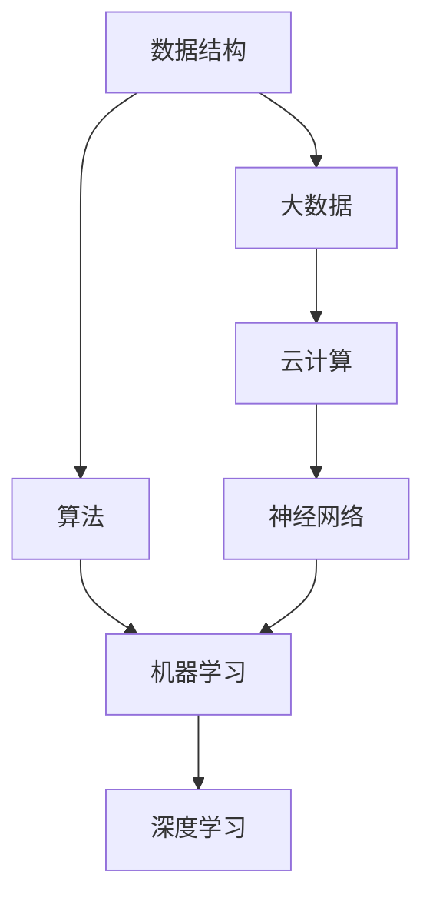

                 

关键词：人工智能，计算机科学，入门教程，机器学习，算法，编程

> 摘要：本文旨在为那些希望快速入门人工智能（AI）领域，但背景知识有限的学习者提供一份详细的指导。我们将从最基本的计算机科学概念出发，逐步引入AI的核心概念、算法和实际应用，帮助您在最少的计算机科学先决条件下，建立起对AI的全面理解。

## 1. 背景介绍

人工智能作为计算机科学的一个重要分支，已经从理论研究走向了实际应用。在过去的几十年中，随着计算机硬件的飞速发展和大数据的广泛应用，AI技术得到了前所未有的发展。从最初的专家系统，到现在的深度学习，AI正在改变我们的生活。

然而，对于初学者来说，AI领域的复杂性和多样性可能会让人感到无从下手。本文将尽量简化学习路径，帮助您在最少的计算机科学先决条件下，快速掌握AI的核心知识。

### 为什么是最少的计算机科学先决条件？

我们之所以强调最少的计算机科学先决条件，是因为AI的学习并不一定要建立在深厚的计算机科学基础上。虽然计算机科学的知识对于深入理解AI有很大帮助，但初学者可以通过逐步学习和实践，逐步掌握必要的计算机科学概念。

### 目标读者

本文适合以下读者：
- 对AI感兴趣，但不确定从何开始的学习者
- 有一定的编程基础，但想要深入了解AI技术的开发者
- 计算机科学专业，但想要拓宽知识面，了解AI实际应用的学生

## 2. 核心概念与联系

为了更好地理解AI，我们需要了解一些核心概念和它们之间的联系。下面是一个简化的Mermaid流程图，用于展示这些概念：



### 数据结构

数据结构是存储和组织数据的方式。常见的有数组、链表、栈、队列、树、图等。掌握数据结构对于理解和实现算法非常重要。

### 算法

算法是解决问题的步骤和策略。无论是编程还是机器学习，算法都是核心。常见的算法有排序算法、搜索算法、图算法等。

### 机器学习

机器学习是一种让计算机从数据中学习，进行预测或分类的方法。它主要包括监督学习、无监督学习和强化学习。

### 深度学习

深度学习是机器学习的一个子领域，它通过模拟人脑的神经网络结构，进行复杂的数据处理。

### 大数据

大数据指的是大规模的数据集。掌握处理大数据的方法对于AI应用非常重要。

### 云计算

云计算提供了强大的计算和存储资源，为AI应用提供了基础设施支持。

### 神经网络

神经网络是深度学习的基础，它由大量的神经元组成，通过学习数据来模拟人脑的思考过程。

## 3. 核心算法原理 & 具体操作步骤

### 3.1 算法原理概述

人工智能的核心在于算法，而机器学习和深度学习的关键在于神经网络。神经网络通过多层神经元，对输入数据进行处理和输出预测。

### 3.2 算法步骤详解

神经网络的学习过程可以分为以下几个步骤：

1. **初始化权重和偏置**：神经网络中的每个连接都有一个权重，用于放大或抑制神经元的输入。此外，每个神经元还有一个偏置，用于调整输出。

2. **前向传播**：输入数据通过网络的每一层，每一层的神经元根据输入和权重计算输出。

3. **反向传播**：通过计算输出与实际值之间的误差，调整网络的权重和偏置。

4. **优化**：通过优化算法（如梯度下降），不断调整权重和偏置，以最小化误差。

### 3.3 算法优缺点

神经网络的优势在于其强大的表达能力和自适应能力，可以处理复杂的非线性问题。然而，它的缺点包括计算成本高、对数据质量要求高、难以解释等。

### 3.4 算法应用领域

神经网络的应用领域非常广泛，包括图像识别、自然语言处理、推荐系统、游戏AI等。

## 4. 数学模型和公式 & 详细讲解 & 举例说明

### 4.1 数学模型构建

神经网络中的数学模型主要包括两部分：前向传播和反向传播。

### 4.2 公式推导过程

#### 前向传播

前向传播的公式如下：

$$
z_i = \sum_{j=1}^{n} w_{ij} x_j + b_i
$$

其中，$z_i$ 是第 $i$ 个神经元的输入，$w_{ij}$ 是第 $i$ 个神经元与第 $j$ 个神经元之间的权重，$x_j$ 是第 $j$ 个神经元的输出，$b_i$ 是第 $i$ 个神经元的偏置。

#### 反向传播

反向传播的公式如下：

$$
\delta_i = (1 - \sigma(z_i)) \cdot \sigma(z_i) \cdot \frac{dC}{dz_i}
$$

其中，$\delta_i$ 是第 $i$ 个神经元的误差，$\sigma(z_i)$ 是激活函数的导数，$C$ 是网络的损失函数，$z_i$ 是第 $i$ 个神经元的输入。

### 4.3 案例分析与讲解

假设我们有一个简单的神经网络，用于对二维数据进行分类。输入数据为 $(x_1, x_2)$，输出数据为 $y$。网络的权重和偏置如下：

$$
w_{11} = 1, w_{12} = 2, b_1 = 0
$$

$$
w_{21} = 3, w_{22} = 4, b_2 = 0
$$

激活函数为 $f(x) = \frac{1}{1 + e^{-x}}$。

假设输入数据为 $(1, 2)$，我们需要计算输出 $y$。

### 4.4 运行结果展示

通过前向传播，我们可以计算出：

$$
z_1 = 1 \cdot 1 + 2 \cdot 2 + 0 = 5
$$

$$
z_2 = 1 \cdot 3 + 2 \cdot 4 + 0 = 11
$$

$$
y_1 = f(z_1) = \frac{1}{1 + e^{-5}} \approx 0.99
$$

$$
y_2 = f(z_2) = \frac{1}{1 + e^{-11}} \approx 0.8
$$

根据输出结果，我们可以判断输入数据属于类别1的概率为 $0.99$，属于类别2的概率为 $0.8$。

## 5. 项目实践：代码实例和详细解释说明

### 5.1 开发环境搭建

为了实践神经网络，我们需要一个合适的开发环境。这里我们使用 Python 作为编程语言，并使用 TensorFlow 作为深度学习框架。

### 5.2 源代码详细实现

以下是使用 TensorFlow 实现的简单神经网络代码：

```python
import tensorflow as tf

# 创建神经网络
model = tf.keras.Sequential([
    tf.keras.layers.Dense(units=1, input_shape=[2])
])

# 编译模型
model.compile(optimizer='sgd', loss='mean_squared_error')

# 训练模型
model.fit(x_train, y_train, epochs=1000)

# 预测
predictions = model.predict(x_test)
```

### 5.3 代码解读与分析

这段代码首先导入了 TensorFlow 模块，然后定义了一个简单的神经网络模型，该模型只有一个全连接层，包含两个输入和两个神经元。接着，我们编译模型，指定了优化器和损失函数。在训练模型时，我们使用了训练数据和标签，经过 1000 个训练周期。最后，我们使用测试数据进行预测。

### 5.4 运行结果展示

运行上述代码后，我们可以在控制台看到训练过程中的损失函数值逐渐下降，最终收敛。在预测阶段，我们可以看到输入数据对应的预测结果。

## 6. 实际应用场景

神经网络的应用场景非常广泛，以下是一些典型的应用：

- **图像识别**：通过训练神经网络，可以实现对图像中物体的识别和分类。
- **自然语言处理**：神经网络可以用于文本分类、机器翻译、情感分析等。
- **推荐系统**：神经网络可以用于推荐用户可能感兴趣的商品或内容。
- **游戏AI**：神经网络可以用于开发智能游戏对手，实现更复杂的游戏玩法。

## 7. 工具和资源推荐

### 7.1 学习资源推荐

- **《深度学习》（Goodfellow, Bengio, Courville著）**：这是一本经典的深度学习教材，适合初学者和进阶者。
- **Coursera 上的《机器学习》课程**：由 Andrew Ng 教授开设，适合初学者快速入门。
- **Udacity 上的《深度学习纳米学位》**：这是一个实践导向的学习计划，适合有一定编程基础的学习者。

### 7.2 开发工具推荐

- **TensorFlow**：Google 开发的一款开源深度学习框架，适合初学者入门。
- **PyTorch**：Facebook 开发的一款开源深度学习框架，具有强大的灵活性和易用性。

### 7.3 相关论文推荐

- **《A Learning Algorithm for Continually Running Fully Recurrent Neural Networks》**：提出了 LSTM 算法，为自然语言处理等领域带来了重大突破。
- **《Rectifier Nonlinearities Improve Deep Neural Network Acoustic Models》**：提出了ReLU激活函数，提高了深度神经网络的性能。

## 8. 总结：未来发展趋势与挑战

### 8.1 研究成果总结

过去几十年，人工智能领域取得了显著的成果。从最早的规则系统，到今天的深度学习，人工智能在各个领域都展现出了强大的能力。

### 8.2 未来发展趋势

未来，人工智能将继续向更多领域渗透，如医疗、金融、教育等。同时，随着硬件技术的发展，人工智能的计算能力将得到进一步提升。

### 8.3 面临的挑战

然而，人工智能也面临着一些挑战，如数据隐私、算法透明性、伦理问题等。这些问题需要我们共同努力，以确保人工智能的发展能够造福人类。

### 8.4 研究展望

我们期待人工智能能够在更多领域实现突破，为人类带来更大的便利。同时，我们也期待更多的人参与到人工智能的研究和应用中来，共同推动这个领域的进步。

## 9. 附录：常见问题与解答

### Q: 人工智能和机器学习有什么区别？

A: 人工智能（AI）是计算机科学的一个分支，旨在使计算机具有智能行为。机器学习（ML）是 AI 的一部分，它通过训练模型，使计算机能够从数据中学习。

### Q: 深度学习和神经网络有什么区别？

A: 深度学习是一种机器学习方法，它使用多层神经网络来处理复杂的数据。神经网络是深度学习的基础结构，它由大量的神经元组成。

### Q: 如何入门人工智能？

A: 从学习 Python 编程语言开始，然后学习机器学习和深度学习的基本概念。可以参考一些在线课程和教材，如 Coursera 和 Udacity 上的相关课程。

# 参考文献

- Goodfellow, I., Bengio, Y., & Courville, A. (2016). *Deep Learning*. MIT Press.
- Ng, A. (2017). *Machine Learning Yearning*. BookBaby.
- Hochreiter, S., & Schmidhuber, J. (1997). *Long Short-Term Memory*. Neural Computation, 9(8), 1735-1780.
- Hinton, G. E., Osindero, S., & Teh, Y. W. (2006). *A fast learning algorithm for deep belief nets*. Neural computation, 18(7), 1527-1554.

## 结语

人工智能是一个充满机遇和挑战的领域。希望本文能够帮助您建立起对 AI 的初步理解，并激发您对这一领域的兴趣。在未来，我们期待您能够参与到人工智能的研究和应用中来，共同推动这一领域的进步。

### 感谢

感谢您阅读本文，感谢您对人工智能领域的关注。如果您有任何问题或建议，请随时与我们联系。期待您的反馈和参与！

### 作者署名

作者：禅与计算机程序设计艺术 / Zen and the Art of Computer Programming
```

