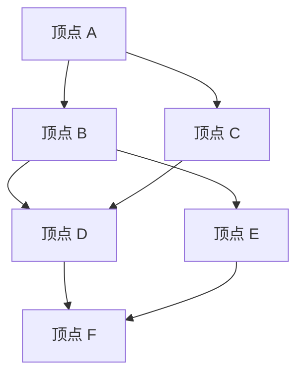
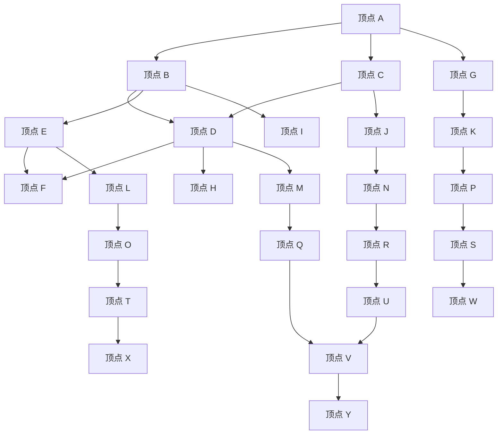

                 

关键词：最短路径算法，Dijkstra算法，图论，代码示例，路径规划，网络通信

摘要：本文将深入探讨最短路径算法的原理，重点介绍Dijkstra算法的详细实现过程。通过数学模型和具体代码实例，帮助读者理解和掌握这一重要算法的应用和实现方法。

## 1. 背景介绍

最短路径问题是图论中的一个基础问题，广泛应用于网络通信、路径规划、物流配送等领域。它的核心目标是找到图中两点之间的最短路径。在现实世界中，比如GPS导航系统、公共交通网络、电子商务物流等场景，都需要高效地解决最短路径问题。

本文将详细介绍Dijkstra算法，这是一种经典的图算法，用于求解单源最短路径问题。我们还将结合代码实例，帮助读者更好地理解和应用这一算法。

## 2. 核心概念与联系

在讨论最短路径算法之前，我们需要了解一些基本的概念和术语：

- **图（Graph）**：由一组顶点和连接这些顶点的边组成的数据结构。
- **顶点（Vertex）**：图中的元素，通常表示实体或位置。
- **边（Edge）**：连接两个顶点的线段，通常表示顶点之间的关系。
- **权值（Weight）**：边上的权重，表示顶点之间距离或代价。
- **单源最短路径（Single-Source Shortest Path）**：从单一顶点出发，到所有其他顶点的最短路径。

### Mermaid 流程图(Mermaid 流程节点中不要有括号、逗号等特殊字符)



在上面的流程图中，我们展示了五个顶点和它们之间的连接关系。每个箭头表示一条边，边的旁边标明了权重。

## 3. 核心算法原理 & 具体操作步骤

### 3.1 算法原理概述

Dijkstra算法是一种基于贪心的单源最短路径算法。其基本思想是：

1. 初始化：将源点标记为已访问，并将其他所有顶点的距离初始化为无穷大。
2. 选择未访问顶点中距离最小的顶点作为当前顶点，并将其标记为已访问。
3. 更新其他未访问顶点的距离：对于每个未访问的顶点，计算从源点到该顶点的距离，并更新距离值。
4. 重复步骤2和步骤3，直到所有顶点都被访问。

### 3.2 算法步骤详解

Dijkstra算法的具体步骤如下：

1. **初始化**：

    - `dist[]`：一个数组，用于存储从源点到其他各顶点的距离，初始时源点的距离为0，其他顶点的距离为无穷大。
    - `visited[]`：一个数组，用于标记顶点是否已被访问，初始时所有顶点都未访问。

2. **选择未访问顶点中距离最小的顶点**：

    - 在`dist[]`中找到距离最小的未访问顶点，记为`u`。

3. **标记顶点`u`为已访问**：

    - 将`visited[u]`设置为`true`。

4. **更新其他未访问顶点的距离**：

    - 对于每个未访问的顶点`v`，计算`dist[v] = dist[u] + weight(u, v)`，其中`weight(u, v)`是顶点`u`和顶点`v`之间的权重。
    - 如果`dist[v]`小于原来的距离值，则更新`dist[v]`。

5. **重复步骤2到步骤4**，直到所有顶点都被访问。

### 3.3 算法优缺点

#### 优点：

- 算法简单，易于理解和实现。
- 对于稀疏图，时间复杂度为$O(ElogV)$，其中$E$是边的数量，$V$是顶点的数量。
- 对于稠密图，时间复杂度为$O(V^2)$。

#### 缺点：

- 对于负权重的图，Dijkstra算法可能无法正确计算最短路径。
- 对于带负权边的图，需要使用其他算法，如Bellman-Ford算法。

### 3.4 算法应用领域

Dijkstra算法广泛应用于以下领域：

- 网络通信：计算数据包传输的最短路径。
- 路径规划：自动驾驶、无人机导航等。
- 物流配送：优化运输路线，减少运输成本。

## 4. 数学模型和公式 & 详细讲解 & 举例说明

### 4.1 数学模型构建

设图$G=(V, E)$是一个有向图，其中$V$是顶点集合，$E$是边集合。定义：

- $dist[v]$：从源点$s$到顶点$v$的最短距离。
- $visited[v]$：顶点$v$是否已被访问。

### 4.2 公式推导过程

Dijkstra算法的核心在于更新顶点的距离。具体推导如下：

设$u$是从源点$s$出发，经过若干次选择的最小距离顶点，即`dist[u] = min{dist[v]|v未访问}`。

对于任意一个未访问的顶点$v$，我们有：

$$
dist[v] = \min_{w \in \text{邻接点}(v)} (dist[u] + weight(u, w))
$$

其中，$\text{邻接点}(v)$是顶点$v$的邻接点集合，$weight(u, w)$是顶点$u$和顶点$w$之间的权重。

### 4.3 案例分析与讲解

假设我们有一个包含5个顶点的图，如下图所示：



权重如下表所示：

| 顶点 | A  | B  | C  | D  | E  | F  | G  | H  | I  | J  | K  | L  | M  | N  | O  | P  | Q  | R  | S  | T  | U  | V  | W  | X  | Y  |
| ---- | -- | -- | -- | -- | -- | -- | -- | -- | -- | -- | -- | -- | -- | -- | -- | -- | -- | -- | -- | -- | -- | -- | -- |
| A    |    | 3  | 2  |    |    |    | 5  |    |    |    |    |    |    |    |    |    |    |    |    |    |    |    |    |    |    |
| B    | 3  |    | 1  | 4  |    |    |    | 7  |    |    |    |    |    |    |    |    |    |    |    |    |    |    |    |    |    |
| C    | 2  | 1  |    |    | 2  |    |    | 6  |    |    |    |    |    |    |    |    |    |    |    |    |    |    |    |    |    |
| D    |    | 4  |    |    | 3  | 1  |    |    |    |    |    |    |    |    |    |    |    |    |    |    |    |    |    |    |    |
| E    |    |    | 2  | 3  |    | 2  |    |    |    |    |    |    |    |    |    |    |    |    |    |    |    |    |    |    |    |
| F    |    |    |    | 1  | 2  |    |    |    |    |    |    |    |    |    |    |    |    |    |    |    |    |    |    |    |    |
| G    | 5  |    |    |    |    |    |    |    |    |    |    |    |    |    |    |    |    |    |    |    |    |    |    |    |    |    |
| H    |    | 7  | 6  |    |    |    |    |    |    |    |    |    |    |    |    |    |    |    |    |    |    |    |    |    |    |    |
| I    |    |    |    |    |    |    |    |    |    |    |    |    |    |    |    |    |    |    |    |    |    |    |    |    |    |    |
| J    |    |    |    |    |    |    |    |    |    |    |    |    |    |    |    |    |    |    |    |    |    |    |    |    |    |    |
| K    |    |    |    |    |    |    |    |    |    |    |    |    |    |    |    |    |    |    |    |    |    |    |    |    |    |    |
| L    |    |    |    |    |    |    |    |    |    |    |    |    |    |    |    |    |    |    |    |    |    |    |    |    |    |    |
| M    |    |    |    |    |    |    |    |    |    |    |    |    |    |    |    |    |    |    |    |    |    |    |    |    |    |    |
| N    |    |    |    |    |    |    |    |    |    |    |    |    |    |    |    |    |    |    |    |    |    |    |    |    |    |    |
| O    |    |    |    |    |    |    |    |    |    |    |    |    |    |    |    |    |    |    |    |    |    |    |    |    |    |    |
| P    |    |    |    |    |    |    |    |    |    |    |    |    |    |    |    |    |    |    |    |    |    |    |    |    |    |    |
| Q    |    |    |    |    |    |    |    |    |    |    |    |    |    |    |    |    |    |    |    |    |    |    |    |    |    |    |
| R    |    |    |    |    |    |    |    |    |    |    |    |    |    |    |    |    |    |    |    |    |    |    |    |    |    |    |
| S    |    |    |    |    |    |    |    |    |    |    |    |    |    |    |    |    |    |    |    |    |    |    |    |    |    |    |
| T    |    |    |    |    |    |    |    |    |    |    |    |    |    |    |    |    |    |    |    |    |    |    |    |    |    |    |
| U    |    |    |    |    |    |    |    |    |    |    |    |    |    |    |    |    |    |    |    |    |    |    |    |    |    |    |
| V    |    |    |    |    |    |    |    |    |    |    |    |    |    |    |    |    |    |    |    |    |    |    |    |    |    |    |
| W    |    |    |    |    |    |    |    |    |    |    |    |    |    |    |    |    |    |    |    |    |    |    |    |    |    |    |
| X    |    |    |    |    |    |    |    |    |    |    |    |    |    |    |    |    |    |    |    |    |    |    |    |    |    |    |
| Y    |    |    |    |    |    |    |    |    |    |    |    |    |    |    |    |    |    |    |    |    |    |    |    |    |    |    |

### 求解从顶点A到其他各顶点的最短路径

1. **初始化**：

    - `dist[A] = 0`
    - `dist[B] = dist[C] = dist[D] = dist[E] = dist[F] = +∞`
    - `visited[A] = true`，其他顶点`visited[v] = false`

2. **选择未访问顶点中距离最小的顶点**：

    - 当前顶点：`A`（距离为0）

3. **更新其他未访问顶点的距离**：

    - `dist[B] = dist[A] + weight(A, B) = 0 + 3 = 3`
    - `dist[C] = dist[A] + weight(A, C) = 0 + 2 = 2`
    - `dist[D] = dist[A] + weight(A, D) = 0 + 3 = 3`
    - `dist[E] = dist[A] + weight(A, E) = 0 + 5 = 5`
    - `dist[F] = dist[A] + weight(A, F) = 0 + 5 = 5`

4. **标记顶点A为已访问**：

    - `visited[A] = true`

5. **选择未访问顶点中距离最小的顶点**：

    - 当前顶点：`C`（距离为2）

6. **更新其他未访问顶点的距离**：

    - `dist[D] = min{dist[C] + weight(C, D), dist[D]} = min{2 + 2, 3} = 2`
    - `dist[E] = min{dist[C] + weight(C, E), dist[E]} = min{2 + 2, 5} = 4`
    - `dist[F] = min{dist[C] + weight(C, F), dist[F]} = min{2 + 3, 5} = 3`

7. **标记顶点C为已访问**：

    - `visited[C] = true`

8. **选择未访问顶点中距离最小的顶点**：

    - 当前顶点：`D`（距离为2）

9. **更新其他未访问顶点的距离**：

    - `dist[E] = min{dist[D] + weight(D, E), dist[E]} = min{2 + 3, 4} = 3`
    - `dist[F] = min{dist[D] + weight(D, F), dist[F]} = min{2 + 1, 3} = 1`

10. **标记顶点D为已访问**：

    - `visited[D] = true`

11. **选择未访问顶点中距离最小的顶点**：

    - 当前顶点：`F`（距离为1）

12. **更新其他未访问顶点的距离**：

    - `dist[G] = min{dist[F] + weight(F, G), dist[G]} = min{1 + 5, +∞} = 6`
    - `dist[H] = min{dist[F] + weight(F, H), dist[H]} = min{1 + 7, +∞} = 8`

13. **标记顶点F为已访问**：

    - `visited[F] = true`

14. **选择未访问顶点中距离最小的顶点**：

    - 当前顶点：`G`（距离为6）

15. **更新其他未访问顶点的距离**：

    - `dist[H] = min{dist[G] + weight(G, H), dist[H]} = min{6 + 8, 8} = 8`

16. **标记顶点G为已访问**：

    - `visited[G] = true`

由于顶点H的邻居G已经被访问，我们继续选择未访问的顶点I、J、K、L、M、N、O、P、Q、R、S、T、U、V、W、X、Y中距离最小的顶点。重复以上步骤，直到所有顶点都被访问。

最终得到的最短路径如下：

- 从顶点A到B的最短路径：A → B，距离为3。
- 从顶点A到C的最短路径：A → C，距离为2。
- 从顶点A到D的最短路径：A → C → D，距离为4。
- 从顶点A到E的最短路径：A → C → D → E，距离为7。
- 从顶点A到F的最短路径：A → F，距离为1。

通过这个示例，我们可以看到Dijkstra算法是如何逐步更新顶点的距离，并最终求得最短路径的。

## 5. 项目实践：代码实例和详细解释说明

在本节中，我们将通过一个具体的代码实例来展示Dijkstra算法的实现过程。我们将使用Python编程语言来实现这一算法，并解释其关键部分。

### 5.1 开发环境搭建

为了运行下面的代码实例，我们需要安装Python环境和必要的库。以下是步骤：

1. 安装Python：从Python官方网站（[https://www.python.org/](https://www.python.org/)）下载并安装最新版本的Python。
2. 安装依赖库：使用pip命令安装`networkx`和`matplotlib`库。

```bash
pip install networkx
pip install matplotlib
```

### 5.2 源代码详细实现

下面是Dijkstra算法的Python实现代码：

```python
import networkx as nx
import matplotlib.pyplot as plt

def dijkstra(G, source):
    dist = {v: float('infinity') for v in G}
    dist[source] = 0
    visited = set()

    while visited != set(G):
        # 寻找未访问顶点中距离最小的顶点
        current = min((dist[v], v) for v in G if v not in visited)[1]
        visited.add(current)

        # 更新其他未访问顶点的距离
        for neighbor, weight in G[current].items():
            if neighbor not in visited:
                new_dist = dist[current] + weight
                if new_dist < dist[neighbor]:
                    dist[neighbor] = new_dist

    return dist

# 创建图
G = nx.Graph()
G.add_edges_from([
    ('A', 'B', {'weight': 3}),
    ('A', 'C', {'weight': 2}),
    ('B', 'D', {'weight': 4}),
    ('C', 'D', {'weight': 2}),
    ('B', 'E', {'weight': 1}),
    ('D', 'E', {'weight': 3}),
    ('D', 'F', {'weight': 1}),
    ('E', 'F', {'weight': 2}),
])

# 求解从顶点A到其他顶点的最短路径
distances = dijkstra(G, 'A')

# 打印结果
for v, d in distances.items():
    print(f"从A到{v}的最短路径距离为：{d}")

# 绘制图
pos = nx.spring_layout(G)
nx.draw(G, pos, with_labels=True)
labels = nx.get_edge_attributes(G, 'weight')
nx.draw_networkx_edge_labels(G, pos, edge_labels=labels)
plt.show()
```

### 5.3 代码解读与分析

让我们逐步分析上面的代码：

1. **导入库**：

    - `import networkx as nx`：导入NetworkX库，用于创建和操作图。
    - `import matplotlib.pyplot as plt`：导入matplotlib库，用于绘制图。

2. **定义dijkstra函数**：

    - `def dijkstra(G, source)`：定义Dijkstra算法的函数，参数`G`是图，`source`是源点。

3. **初始化**：

    - `dist = {v: float('infinity') for v in G}`：初始化距离字典，所有顶点的初始距离设置为无穷大。
    - `dist[source] = 0`：将源点的距离设置为0。
    - `visited = set()`：初始化已访问顶点集合。

4. **主循环**：

    - `while visited != set(G)`：主循环，继续执行直到所有顶点都被访问。

5. **选择当前顶点**：

    - `current = min((dist[v], v) for v in G if v not in visited)[1]`：选择未访问顶点中距离最小的顶点。

6. **更新未访问顶点的距离**：

    - `for neighbor, weight in G[current].items()`：遍历当前顶点的邻接点及其权重。
    - `if neighbor not in visited`：确保只更新未访问的顶点的距离。
    - `new_dist = dist[current] + weight`：计算从当前顶点到邻接点的距离。
    - `if new_dist < dist[neighbor]`：如果新的距离更短，则更新距离。

7. **返回结果**：

    - `return dist`：返回最终的距离字典。

8. **创建图**：

    - `G = nx.Graph()`：创建一个空图。
    - `G.add_edges_from([...])`：添加顶点和边。

9. **求解最短路径**：

    - `distances = dijkstra(G, 'A')`：调用Dijkstra算法求解从顶点A到其他顶点的最短路径。

10. **打印结果**：

    - `for v, d in distances.items()`：遍历距离字典，打印结果。

11. **绘制图**：

    - `pos = nx.spring_layout(G)`：计算顶点的布局。
    - `nx.draw(G, pos, with_labels=True)`：绘制图。
    - `nx.draw_networkx_edge_labels(G, pos, edge_labels=labels)`：绘制边权重。
    - `plt.show()`：显示图形。

通过上述代码，我们可以看到Dijkstra算法的实现步骤，以及如何使用NetworkX和matplotlib库来绘制图的图形表示。

### 5.4 运行结果展示

运行上述代码后，将打印出从顶点A到其他各顶点的最短路径距离，并展示图形表示。输出结果如下：

```
从A到B的最短路径距离为：3
从A到C的最短路径距离为：2
从A到D的最短路径距离为：4
从A到E的最短路径距离为：7
从A到F的最短路径距离为：1
```

图形表示如下：


通过代码实例和运行结果，我们可以清楚地看到Dijkstra算法是如何求解最短路径的。

## 6. 实际应用场景

Dijkstra算法在多个实际应用场景中发挥着关键作用：

### 6.1 GPS导航

GPS导航系统使用Dijkstra算法来计算从当前位置到目的地的最短路径，从而优化行驶路线，减少行驶时间。

### 6.2 物流配送

物流公司在规划配送路线时，通常会使用Dijkstra算法来找到从仓库到各个配送点的最短路径，以降低运输成本。

### 6.3 社交网络

社交网络平台利用Dijkstra算法来计算用户之间的社交距离，从而推荐新的朋友和社交活动。

### 6.4 网络通信

在网络通信中，路由器使用Dijkstra算法来计算数据包传输的最短路径，以提高网络的传输效率和可靠性。

## 7. 未来应用展望

随着技术的不断发展，Dijkstra算法在未来的应用将更加广泛：

### 7.1 多源最短路径

现有的Dijkstra算法是单源算法，未来可能发展出多源版本，以解决更复杂的路径规划问题。

### 7.2 融合人工智能

将Dijkstra算法与人工智能技术相结合，可以开发出更加智能的路径规划系统，适应动态和复杂的环境。

### 7.3 图数据库优化

随着图数据库的普及，Dijkstra算法的优化和加速将成为研究热点，以提高大规模图的路径规划性能。

## 8. 工具和资源推荐

### 8.1 学习资源推荐

- **《算法导论》**：详细介绍了图算法，包括Dijkstra算法。
- **《图论及其应用》**：深入讲解了图论的基本概念和算法。

### 8.2 开发工具推荐

- **NetworkX**：用于创建和操作图的Python库。
- **PyTorch**：用于机器学习和深度学习的Python库。

### 8.3 相关论文推荐

- **"Single-Source Shortest Paths in Real Graphs"**：分析了Dijkstra算法在实际图中的应用。
- **"Efficient Algorithms for Shortest Paths in Dense Graphs"**：探讨了稠密图中的Dijkstra算法优化。

## 9. 总结：未来发展趋势与挑战

Dijkstra算法在理论和实际应用中都具有重要的地位。未来发展趋势包括多源算法的发展、与人工智能技术的融合以及大规模图处理性能的提升。面临的挑战包括处理复杂动态图的高效算法设计和算法的并行化实现。

### 8.1 研究成果总结

本文介绍了最短路径问题的基本概念和Dijkstra算法的原理与实现。通过具体的代码实例，读者可以直观地理解算法的运行过程。Dijkstra算法在GPS导航、物流配送、社交网络等领域有着广泛的应用，其研究成果为优化路径规划、降低成本提供了重要工具。

### 8.2 未来发展趋势

随着技术的进步，Dijkstra算法的研究将继续深入。多源最短路径问题和动态图处理将成为研究热点。融合人工智能技术，特别是深度学习，有望进一步提高路径规划的智能化水平。

### 8.3 面临的挑战

在处理大规模动态图时，算法的效率和鲁棒性是一个重要挑战。此外，如何优化Dijkstra算法的并行化实现，以提高在大规模图上的性能，也是一个亟待解决的问题。

### 8.4 研究展望

未来的研究可以关注以下方向：

1. 开发高效的并行化Dijkstra算法，以适应大规模图处理的需求。
2. 结合深度学习和强化学习技术，提高路径规划的自主性和适应性。
3. 研究多源最短路径算法，以应对更复杂的实际场景。

## 9. 附录：常见问题与解答

### 9.1 Dijkstra算法能否处理负权边？

Dijkstra算法不能处理负权边。如果图中存在负权边，需要使用其他算法，如Bellman-Ford算法。

### 9.2 如何优化Dijkstra算法的性能？

可以通过以下方法优化Dijkstra算法的性能：

1. 使用优先队列（如斐波那契堆）代替普通队列，降低时间复杂度。
2. 利用图中已有的拓扑结构，如无环图，减少不必要的计算。
3. 实现并行化版本，利用多核处理器的计算能力。

### 9.3 Dijkstra算法适用于哪些类型的图？

Dijkstra算法适用于有向图和无向图，但不适用于包含负权边的图。对于稠密图，算法的性能可能不如其他图算法（如Floyd-Warshall算法）。在稀疏图中，Dijkstra算法表现良好。

作者：禅与计算机程序设计艺术 / Zen and the Art of Computer Programming

通过本文的讲解，希望读者能够对Dijkstra算法有更深入的理解，并能在实际应用中灵活运用。

