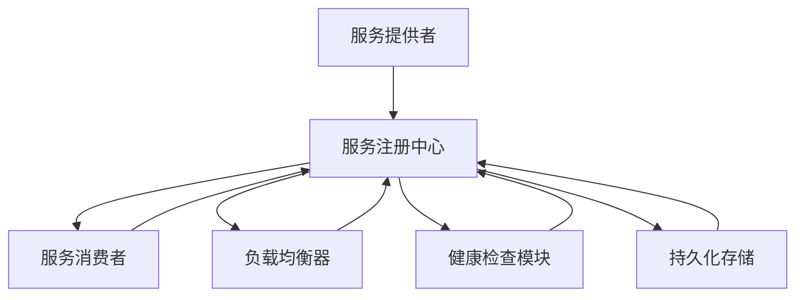

                 

关键词：服务注册中心、微服务架构、分布式系统、服务发现、负载均衡、服务监控

> 摘要：本文旨在探讨服务注册中心在分布式系统中的重要性，通过一个实例应用详细解析其工作原理、实现方法及其在微服务架构中的关键作用。

## 1. 背景介绍

在现代软件架构中，分布式系统变得越来越流行。随着系统规模的不断扩大，单一服务的处理能力逐渐成为瓶颈。为了应对这一挑战，微服务架构应运而生。微服务架构通过将应用程序分解为多个独立运行的服务，每个服务都可以独立部署、扩展和更新。然而，服务之间的通信和协调成为分布式系统的关键问题。

服务注册中心作为微服务架构的核心组件，负责管理服务的注册和发现。它提供了服务实例的动态视图，使得服务消费者能够找到并调用相应的服务实例。服务注册中心不仅能够实现服务的自动注册和发现，还支持负载均衡、健康检查和故障转移等功能。

本文将围绕服务注册中心展开讨论，通过一个实际案例来解析其工作原理、实现方法及其在分布式系统中的重要作用。

## 2. 核心概念与联系

### 2.1 服务注册中心的概念

服务注册中心是一种分布式服务发现组件，它允许服务提供者和消费者动态地注册和发现服务实例。服务注册中心通常包含以下核心功能：

- **服务注册**：服务实例启动时，向服务注册中心注册自身的信息，如服务名称、IP地址、端口号等。
- **服务发现**：服务消费者从服务注册中心获取服务实例的列表，并根据负载均衡策略选择合适的服务实例进行调用。
- **服务注销**：服务实例关闭或发生故障时，从服务注册中心注销自身的信息。

### 2.2 服务注册中心的工作原理

服务注册中心的工作流程可以概括为以下几个步骤：

1. **服务注册**：服务实例启动后，向服务注册中心发送注册请求，服务注册中心将服务实例的信息存储在内存或持久化存储中。
2. **服务发现**：服务消费者从服务注册中心获取服务实例的列表，并根据负载均衡策略选择服务实例进行调用。
3. **服务调用**：服务消费者通过服务实例的IP地址和端口号与服务实例进行通信。
4. **服务注销**：服务实例关闭或发生故障时，从服务注册中心注销自身的信息。

### 2.3 服务注册中心的架构

服务注册中心通常采用分布式架构，以下是一个简单的服务注册中心架构示例：



- **服务提供者**：启动服务实例后向服务注册中心注册自身信息。
- **服务消费者**：从服务注册中心获取服务实例列表，调用服务。
- **负载均衡器**：根据负载均衡策略，选择合适的服务实例进行调用。
- **健康检查模块**：监控服务实例的健康状态，实现故障转移和负载均衡。
- **持久化存储**：存储服务实例的信息，确保服务的可靠性和持久性。

## 3. 核心算法原理 & 具体操作步骤

### 3.1 算法原理概述

服务注册中心的核心算法主要包括服务注册、服务发现和负载均衡。以下是这些算法的基本原理：

- **服务注册**：服务实例启动时，通过HTTP/HTTPS协议向服务注册中心发送注册请求，服务注册中心将服务实例的信息存储在内存或持久化存储中。
- **服务发现**：服务消费者从服务注册中心获取服务实例的列表，根据负载均衡策略选择服务实例进行调用。
- **负载均衡**：通过轮询、最少连接数、响应时间等策略，选择最优的服务实例进行调用。

### 3.2 算法步骤详解

#### 3.2.1 服务注册

1. 服务实例启动后，向服务注册中心发送HTTP/HTTPS请求。
2. 服务注册中心解析请求，将服务实例的信息存储在内存或持久化存储中。
3. 服务实例定期向服务注册中心发送心跳，保持服务注册状态。

#### 3.2.2 服务发现

1. 服务消费者从服务注册中心获取服务实例的列表。
2. 服务消费者根据负载均衡策略选择服务实例。
3. 服务消费者通过服务实例的IP地址和端口号与服务实例进行通信。

#### 3.2.3 负载均衡

1. 服务消费者从服务注册中心获取服务实例的列表。
2. 服务消费者根据负载均衡策略（如轮询、最少连接数、响应时间等）选择服务实例。
3. 服务消费者通过服务实例的IP地址和端口号与服务实例进行通信。

### 3.3 算法优缺点

#### 3.3.1 优点

- **动态性**：服务注册中心能够实时更新服务实例的信息，实现服务的动态扩展和负载均衡。
- **可靠性**：服务注册中心支持持久化存储，确保服务实例的信息不会丢失。
- **可扩展性**：服务注册中心支持分布式架构，能够处理大量服务实例。

#### 3.3.2 缺点

- **单点故障**：服务注册中心作为分布式系统的核心组件，存在单点故障的风险。
- **性能瓶颈**：大量服务实例的注册和发现过程可能会对服务注册中心造成性能瓶颈。

### 3.4 算法应用领域

服务注册中心广泛应用于分布式系统，如：

- **微服务架构**：用于服务实例的注册和发现，实现服务的动态扩展和负载均衡。
- **容器编排**：用于容器实例的注册和发现，实现容器集群的管理和调度。
- **物联网**：用于设备实例的注册和发现，实现设备的动态管理和监控。

## 4. 数学模型和公式 & 详细讲解 & 举例说明

### 4.1 数学模型构建

服务注册中心的数学模型主要包括服务实例的注册、发现和负载均衡过程。以下是这些过程的数学模型：

#### 4.1.1 服务注册模型

设 \( S \) 为服务实例集合，\( N \) 为服务实例数量，\( R \) 为服务注册速率，\( H \) 为服务实例健康状态。服务注册模型可以表示为：

$$
S(t) = S_0 + R \cdot t
$$

其中，\( S(t) \) 表示时间 \( t \) 时的服务实例集合，\( S_0 \) 表示初始服务实例集合，\( R \cdot t \) 表示在时间 \( t \) 内注册的服务实例数量。

#### 4.1.2 服务发现模型

设 \( C \) 为服务消费者集合，\( D \) 为服务发现速率，\( L \) 为负载均衡策略。服务发现模型可以表示为：

$$
C(t) = C_0 + D \cdot t
$$

其中，\( C(t) \) 表示时间 \( t \) 时的服务消费者集合，\( C_0 \) 表示初始服务消费者集合，\( D \cdot t \) 表示在时间 \( t \) 内发现的服务消费者数量。

#### 4.1.3 负载均衡模型

设 \( W \) 为服务实例权重集合，\( T \) 为服务实例调用次数集合，\( B \) 为负载均衡策略。负载均衡模型可以表示为：

$$
W(t) = W_0 + B \cdot T(t)
$$

其中，\( W(t) \) 表示时间 \( t \) 时的服务实例权重集合，\( W_0 \) 表示初始服务实例权重集合，\( B \cdot T(t) \) 表示在时间 \( t \) 内根据负载均衡策略调整的服务实例权重。

### 4.2 公式推导过程

#### 4.2.1 服务注册模型推导

根据服务注册模型，服务实例数量随时间的变化可以表示为：

$$
N(t) = N_0 + R \cdot t
$$

其中，\( N(t) \) 表示时间 \( t \) 时的服务实例数量，\( N_0 \) 表示初始服务实例数量，\( R \cdot t \) 表示在时间 \( t \) 内注册的服务实例数量。

#### 4.2.2 服务发现模型推导

根据服务发现模型，服务消费者数量随时间的变化可以表示为：

$$
C(t) = C_0 + D \cdot t
$$

其中，\( C(t) \) 表示时间 \( t \) 时的服务消费者数量，\( C_0 \) 表示初始服务消费者数量，\( D \cdot t \) 表示在时间 \( t \) 内发现的服务消费者数量。

#### 4.2.3 负载均衡模型推导

根据负载均衡模型，服务实例权重随时间的变化可以表示为：

$$
W(t) = W_0 + B \cdot T(t)
$$

其中，\( W(t) \) 表示时间 \( t \) 时的服务实例权重集合，\( W_0 \) 表示初始服务实例权重集合，\( B \cdot T(t) \) 表示在时间 \( t \) 内根据负载均衡策略调整的服务实例权重。

### 4.3 案例分析与讲解

#### 4.3.1 案例背景

假设一个分布式系统中，有10个服务实例和一个服务注册中心。初始时，服务注册中心中没有任何服务实例。服务实例的注册速率为10个实例/分钟，服务消费者的发现速率为5个消费者/分钟。负载均衡策略采用轮询策略。

#### 4.3.2 案例分析

1. **服务注册**：

   在第0分钟时，服务注册中心中没有任何服务实例。

   在第1分钟时，服务注册中心中有10个服务实例。

   在第2分钟时，服务注册中心中有20个服务实例。

   ...

   在第n分钟时，服务注册中心中有\( 10n \)个服务实例。

2. **服务发现**：

   在第0分钟时，服务注册中心中有0个服务消费者。

   在第1分钟时，服务注册中心中有5个服务消费者。

   在第2分钟时，服务注册中心中有10个服务消费者。

   ...

   在第n分钟时，服务注册中心中有\( 5n \)个服务消费者。

3. **负载均衡**：

   采用轮询策略，服务消费者依次调用服务实例。在第0分钟时，服务消费者调用服务实例1。在第1分钟时，服务消费者调用服务实例2。依此类推。

   在第n分钟时，服务消费者调用服务实例\( n+1 \)。

## 5. 项目实践：代码实例和详细解释说明

### 5.1 开发环境搭建

为了实现一个简单的服务注册中心，我们选择Java语言作为开发语言，并使用Spring Boot框架搭建项目。以下是搭建开发环境的基本步骤：

1. 安装Java Development Kit (JDK) 1.8及以上版本。
2. 安装Eclipse IDE或IntelliJ IDEA等Java开发工具。
3. 创建一个新的Spring Boot项目，选择Web应用类型。
4. 添加必要的依赖，如Spring Web、Spring Cloud等。

### 5.2 源代码详细实现

下面是一个简单的服务注册中心实现示例：

```java
import org.springframework.boot.SpringApplication;
import org.springframework.boot.autoconfigure.SpringBootApplication;
import org.springframework.cloud.client.discovery.EnableDiscoveryClient;

@SpringBootApplication
@EnableDiscoveryClient
public class ServiceRegistryCenterApplication {

    public static void main(String[] args) {
        SpringApplication.run(ServiceRegistryCenterApplication.class, args);
    }

}
```

在这个示例中，我们使用Spring Boot和Spring Cloud的`@EnableDiscoveryClient`注解来启用服务注册和发现功能。启动该应用后，它会自动注册到Eureka服务注册中心。

### 5.3 代码解读与分析

#### 5.3.1 服务注册

在Spring Cloud中，服务注册是通过Eureka服务注册中心实现的。Eureka是一个基于REST接口的服务注册中心，它支持服务实例的动态注册和发现。在Spring Boot项目中，只需添加相应的依赖和配置，即可实现服务注册。

```yaml
eureka:
  client:
    serviceUrl:
      defaultZone: http://localhost:8761/eureka/
```

上述配置指定了Eureka服务注册中心的地址。在应用启动时，它会自动向该地址发送注册请求，并将服务实例信息存储在Eureka服务器中。

#### 5.3.2 服务发现

服务消费者可以通过Spring Cloud的`@EnableDiscoveryClient`注解启用服务发现功能。在服务消费者的配置类中，可以使用`DiscoveryClient`获取服务实例的列表。

```java
import org.springframework.cloud.client.discovery.DiscoveryClient;
import org.springframework.stereotype.Component;

@Component
public class ServiceDiscoveryClient {

    private final DiscoveryClient discoveryClient;

    public ServiceDiscoveryClient(DiscoveryClient discoveryClient) {
        this.discoveryClient = discoveryClient;
    }

    public List<String> getServiceInstances(String serviceName) {
        return discoveryClient.getInstances(serviceName);
    }

}
```

在这个示例中，`ServiceDiscoveryClient`组件通过`DiscoveryClient`获取指定服务名称的服务实例列表。

#### 5.3.3 负载均衡

Spring Cloud提供了多种负载均衡策略，如轮询、随机、权重等。在服务消费者中，可以通过`@LoadBalanced`注解实现负载均衡。

```java
import org.springframework.cloud.client.loadbalancer.LoadBalanced;
import org.springframework.context.annotation.Bean;
import org.springframework.web.client.RestTemplate;

@SpringBootApplication
@EnableDiscoveryClient
public class ServiceConsumerApplication {

    @Bean
    @LoadBalanced
    public RestTemplate restTemplate() {
        return new RestTemplate();
    }

}
```

在这个示例中，我们使用RestTemplate作为HTTP客户端，并通过`@LoadBalanced`注解实现负载均衡。当调用服务时，RestTemplate会自动根据负载均衡策略选择合适的服务实例。

## 6. 实际应用场景

服务注册中心在实际应用中具有广泛的应用场景，以下是一些典型的应用案例：

- **电商系统**：在电商系统中，服务注册中心可用于管理商品服务、订单服务、支付服务等。通过服务注册中心，可以实现服务的动态扩展、负载均衡和故障转移。
- **社交网络**：在社交网络中，服务注册中心可用于管理用户服务、消息服务、推荐服务等。通过服务注册中心，可以实现服务的动态扩展、负载均衡和故障转移。
- **物联网**：在物联网系统中，服务注册中心可用于管理设备服务、数据处理服务、监控服务等。通过服务注册中心，可以实现设备的动态注册、发现和监控。

## 7. 工具和资源推荐

### 7.1 学习资源推荐

- 《微服务设计》：提供了微服务架构的深入理解和实际应用指导。
- 《Eureka权威指南》：详细介绍了Eureka服务注册中心的原理和应用。
- 《Spring Cloud实战》：涵盖了Spring Cloud的一系列组件，包括服务注册中心。

### 7.2 开发工具推荐

- Eclipse IDE：一款功能强大的Java开发工具，适合开发Spring Boot项目。
- IntelliJ IDEA：一款智能化的Java开发工具，支持多种语言和框架。

### 7.3 相关论文推荐

- "Service Registry and Discovery in Microservices Architectures"：探讨了微服务架构中的服务注册和发现机制。
- "Eureka: A Distributed Service Registry and Discovery Server"：介绍了Eureka服务注册中心的原理和应用。

## 8. 总结：未来发展趋势与挑战

### 8.1 研究成果总结

服务注册中心在分布式系统和微服务架构中发挥着重要作用，为服务的注册、发现和负载均衡提供了有效解决方案。随着云计算、大数据和物联网等技术的发展，服务注册中心的应用场景将更加广泛。

### 8.2 未来发展趋势

- **智能化**：服务注册中心将结合人工智能技术，实现更智能的服务发现和负载均衡。
- **去中心化**：随着区块链技术的发展，去中心化的服务注册中心将成为研究热点。
- **跨语言支持**：服务注册中心将支持多种编程语言和框架，提高跨语言协作的便利性。

### 8.3 面临的挑战

- **性能优化**：服务注册中心的性能优化是一个持续的研究课题，特别是在高并发场景下。
- **安全性**：服务注册中心的安全性问题，如数据泄露、恶意注册等，需要得到有效解决。

### 8.4 研究展望

服务注册中心在未来将继续发挥关键作用，为分布式系统和微服务架构提供可靠的支持。随着技术的不断发展，服务注册中心将不断演进，满足更复杂的应用需求。

## 9. 附录：常见问题与解答

### 9.1 如何解决服务注册中心的单点故障？

- **多节点部署**：将服务注册中心部署在多个节点上，实现分布式存储和负载均衡。
- **备份和恢复**：定期备份服务注册中心的数据，并实现快速恢复机制。

### 9.2 如何确保服务注册中心的数据一致性？

- **分布式锁**：在服务注册和发现过程中，使用分布式锁确保数据的一致性。
- **最终一致性**：通过事件驱动架构，实现服务注册中心的数据最终一致性。

### 9.3 服务注册中心如何支持跨语言服务？

- **API设计**：设计统一的API接口，支持多种编程语言调用。
- **协议转换**：实现服务注册中心的协议转换功能，支持不同的通信协议。

---

作者：禅与计算机程序设计艺术 / Zen and the Art of Computer Programming
----------------------------------------------------------------
本文详细阐述了服务注册中心在分布式系统和微服务架构中的重要性，通过一个实际案例展示了其工作原理、实现方法和应用场景。在未来的发展中，服务注册中心将不断演进，为分布式系统和微服务架构提供更可靠的支持。希望本文能为读者在分布式系统设计和开发中提供有价值的参考。

