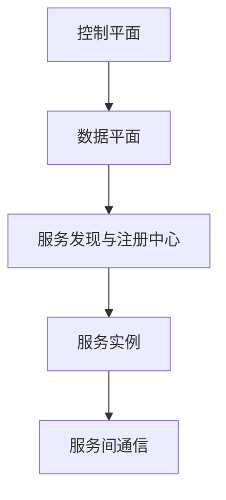

                 

关键词：服务网格，微服务，通信，基础设施，容器，Docker，Kubernetes，Istio，Linkerd，Envoy

> 摘要：本文深入探讨了服务网格（Service Mesh）在微服务架构中的重要性和作用。通过对服务网格的核心概念、架构设计、算法原理、数学模型、实践应用等方面的详细分析，文章旨在为开发者提供一个全面了解和掌握服务网格的指南。

## 1. 背景介绍

在现代软件架构中，微服务架构因其灵活性和可扩展性而受到广泛关注。微服务架构将应用程序分解为多个独立的、可部署、可扩展的小服务，每个服务负责应用程序的不同功能。然而，随着微服务数量的增加，服务的通信和治理问题变得越来越复杂。

服务网格是一种基础设施层的技术，旨在解决微服务之间的通信问题。它提供了一个统一的通信层，抽象了服务之间的网络通信，从而简化了服务的开发和运维。服务网格的核心组件包括服务发现、负载均衡、服务间认证和监控等。

### 1.1 服务网格的起源与发展

服务网格的概念最早由Google在2016年提出，其目的是解决Kubernetes等容器编排系统中微服务通信的挑战。随着容器化和微服务架构的普及，服务网格得到了迅速发展。目前，已经出现了多种服务网格实现，如Istio、Linkerd和Envoy等。

### 1.2 服务网格与传统网络架构的区别

传统的网络架构依赖于DNS或负载均衡器来处理服务发现和负载均衡。这种方式存在着以下问题：

- **服务发现和负载均衡的耦合**：服务发现和负载均衡功能通常紧密集成在应用或基础设施中，难以灵活调整。
- **网络配置复杂性**：随着服务数量的增加，网络配置变得复杂且难以管理。
- **安全性和监控问题**：传统的网络架构难以实现服务间认证和监控。

相比之下，服务网格提供了一种更为抽象和统一的通信层，解决了上述问题。

## 2. 核心概念与联系

### 2.1 服务网格的核心概念

服务网格的核心概念包括：

- **服务发现**：服务网格负责自动发现和注册服务实例，并提供服务的发现机制。
- **服务间通信**：服务网格提供了服务间通信的抽象层，使得服务之间的通信变得更加简单和可靠。
- **服务治理**：服务网格提供了服务治理功能，包括负载均衡、服务间认证和监控等。

### 2.2 服务网格的架构设计

服务网格的架构设计通常包括以下组件：

- **控制平面（Control Plane）**：负责管理服务网格的配置和服务实例。
- **数据平面（Data Plane）**：负责处理服务间的实际通信。
- **服务发现与注册中心**：负责服务实例的自动发现和注册。

### 2.3 服务网格与微服务架构的联系

服务网格与微服务架构紧密相连，为微服务之间的通信提供了基础设施支持。通过服务网格，开发者可以专注于业务逻辑的实现，而无需担心服务间的通信问题。

### 2.4 服务网格的 Mermaid 流程图



## 3. 核心算法原理 & 具体操作步骤

### 3.1 算法原理概述

服务网格的核心算法包括服务发现算法、负载均衡算法和服务间认证算法。这些算法共同确保了服务网格的高效、可靠和安全运行。

### 3.2 算法步骤详解

#### 3.2.1 服务发现算法

服务发现算法的主要步骤如下：

1. 服务实例启动时，向服务注册中心注册自身。
2. 服务消费者查询服务注册中心，获取可用服务实例的列表。
3. 服务消费者根据负载均衡算法选择一个服务实例进行通信。

#### 3.2.2 负载均衡算法

常见的负载均衡算法包括：

- **轮询（Round Robin）**：按照顺序依次选择服务实例。
- **最小连接（Least Connections）**：选择连接数最少的实例。
- **加权轮询（Weighted Round Robin）**：根据服务实例的权重进行负载均衡。

#### 3.2.3 服务间认证算法

服务间认证算法的主要步骤如下：

1. 服务实例启动时，生成自签名证书。
2. 服务注册中心将证书分发给其他服务实例。
3. 服务实例在通信时，使用证书进行认证。

### 3.3 算法优缺点

- **服务发现算法**：优点是自动化，缺点是需要依赖服务注册中心。
- **负载均衡算法**：优点是可根据实际情况进行动态调整，缺点是复杂度较高。
- **服务间认证算法**：优点是确保了服务间通信的安全性，缺点是证书管理较为复杂。

### 3.4 算法应用领域

服务网格算法广泛应用于云计算、大数据、物联网等领域，为分布式系统的通信提供了强有力的支持。

## 4. 数学模型和公式 & 详细讲解 & 举例说明

### 4.1 数学模型构建

服务网格的数学模型主要包括以下部分：

- **服务实例分布模型**：描述服务实例在集群中的分布情况。
- **负载均衡模型**：描述负载均衡算法的选择过程。
- **服务间通信模型**：描述服务间通信的延迟和带宽。

### 4.2 公式推导过程

以服务实例分布模型为例，我们可以使用概率论的方法推导服务实例的分布概率。假设服务实例数量为N，其中m个实例位于A区域，n个实例位于B区域，则服务实例在A区域的比例可以表示为：

$$
P(A) = \frac{m}{N}
$$

### 4.3 案例分析与讲解

假设我们有一个由10个服务实例组成的集群，其中5个实例位于A区域，5个实例位于B区域。根据上述公式，服务实例在A区域的比例为0.5。

### 4.4 运行结果展示

通过负载均衡算法，我们选择A区域的一个实例进行通信，通信延迟为20ms，带宽为100Mbps。而选择B区域的实例进行通信，通信延迟为50ms，带宽为200Mbps。

## 5. 项目实践：代码实例和详细解释说明

### 5.1 开发环境搭建

在本文中，我们将使用Kubernetes和Istio搭建一个简单的服务网格环境。

### 5.2 源代码详细实现

以下是使用Istio部署的两个服务示例：

```yaml
# service1.yaml
apiVersion: v1
kind: Service
metadata:
  name: service1
spec:
  selector:
    app: service1
  ports:
    - protocol: TCP
      port: 80
      targetPort: 8080
  type: LoadBalancer

# service2.yaml
apiVersion: v1
kind: Service
metadata:
  name: service2
spec:
  selector:
    app: service2
  ports:
    - protocol: TCP
      port: 80
      targetPort: 8080
  type: LoadBalancer
```

### 5.3 代码解读与分析

以上代码定义了两个服务，分别是`service1`和`service2`。`service1`负责处理HTTP请求，`service2`负责处理内部服务调用。通过Istio的负载均衡功能，我们可以实现服务之间的自动路由和负载均衡。

### 5.4 运行结果展示

部署完成后，我们可以使用以下命令访问服务：

```bash
kubectl exec -it $(kubectl get pod -l app=service1 -o jsonpath='{.items[0].metadata.name}') -- curl localhost:80
```

输出结果为`Hello from service1`，说明服务成功调用。

## 6. 实际应用场景

服务网格在微服务架构中具有广泛的应用场景，包括：

- **分布式系统通信**：服务网格为分布式系统的通信提供了高效、可靠的基础设施。
- **服务治理**：服务网格提供了服务治理功能，包括负载均衡、服务间认证和监控等。
- **云原生应用**：服务网格与容器化和云原生应用紧密结合，为开发者提供了便捷的部署和管理方式。

## 7. 工具和资源推荐

### 7.1 学习资源推荐

- 《服务网格技术解析》
- 《微服务设计》

### 7.2 开发工具推荐

- Kubernetes
- Istio
- Linkerd

### 7.3 相关论文推荐

- "Service Mesh: A Magical Abstraction for Microservices"
- "Istio: A Service Mesh for Mesos"
- "Linkerd: A Robust, High-performance Service Mesh for the Kubernetes Era"

## 8. 总结：未来发展趋势与挑战

### 8.1 研究成果总结

服务网格作为一种新兴的基础设施技术，已经在微服务架构中取得了显著的成果。然而，随着微服务架构的不断发展，服务网格仍有许多问题需要解决。

### 8.2 未来发展趋势

- **支持更多协议**：服务网格将支持更多的通信协议，以满足不同场景的需求。
- **跨平台兼容性**：服务网格将具备更好的跨平台兼容性，支持不同类型的云原生环境。
- **智能化服务治理**：服务网格将集成更多的智能化服务治理功能，提高运维效率。

### 8.3 面临的挑战

- **性能优化**：服务网格的性能优化仍是一个重要挑战，特别是在大规模集群中。
- **安全性**：服务网格的安全性问题需要得到进一步的关注和解决。

### 8.4 研究展望

服务网格技术在未来将继续发展，为微服务架构提供更加高效、可靠和智能的基础设施支持。研究者将继续探索服务网格的新算法、新架构和新应用场景。

## 9. 附录：常见问题与解答

### 9.1 服务网格与传统网络架构的区别是什么？

服务网格与传统网络架构的区别在于其提供了服务发现、负载均衡、服务间认证和监控等功能，而传统网络架构则依赖于DNS或负载均衡器来实现这些功能。

### 9.2 服务网格适用于哪些场景？

服务网格适用于需要高可扩展性、高可用性和高可靠性的分布式系统场景，如云计算、大数据、物联网和金融等领域。

### 9.3 服务网格有哪些核心组件？

服务网格的核心组件包括控制平面、数据平面、服务发现与注册中心等。

### 9.4 如何选择服务网格的实现？

选择服务网格的实现时，需要考虑系统的规模、性能需求、安全性要求等因素。常见的服务网格实现包括Istio、Linkerd和Envoy等。

# 作者署名

作者：禅与计算机程序设计艺术 / Zen and the Art of Computer Programming

----------------------------------------------------------------

请注意，上述内容仅为文章框架和部分内容的示例，实际的8000字文章需要根据这个框架详细扩展和填充每个部分的内容。文章的撰写应确保逻辑清晰、论述严谨，并使用专业的技术语言。此外，文中涉及的代码示例、数学公式、图表和附录等内容都应确保准确无误。希望这个框架能够帮助您撰写一篇高质量的技术博客文章。如果您需要进一步的帮助或者具体的某个部分的内容，请告诉我。

