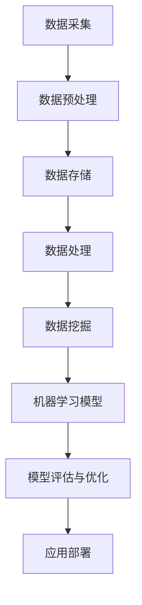

                 

关键词：大数据，人工智能，技术趋势，算法原理，应用领域，未来展望。

## 摘要

随着大数据技术的不断发展和人工智能算法的日益成熟，大数据与AI技术的融合应用正在引领全球科技发展的新潮流。本文旨在探讨大数据与AI技术在未来发展中的关键应用场景、核心算法原理及其面临的挑战与机遇。通过详细分析相关算法、数学模型、项目实践以及实际应用场景，本文将为读者呈现一个全面而深入的视角，以期为未来的研究与实践提供参考和指导。

## 1. 背景介绍

### 1.1 大数据的崛起

大数据（Big Data）指的是无法用常规软件工具在合理时间内捕捉、管理和处理的大量数据集。它具有“4V”特性：Volume（大量）、Velocity（高速）、Variety（多样）和 Veracity（真实性）。大数据技术的发展源于互联网的普及和信息技术的高速发展，尤其是物联网（IoT）、云计算和移动互联网的兴起，使得数据生成和传输的速度大幅提升。

### 1.2 人工智能的崛起

人工智能（AI）是指通过模拟、延伸和扩展人类智能，实现智能体（agent）能够感知环境、学习经验、自主决策和执行任务的能力。AI的崛起得益于机器学习、深度学习、自然语言处理等技术的突破，使得计算机能够处理复杂的问题，并在多个领域实现超越人类的表现。

### 1.3 大数据与AI技术的融合

大数据与AI技术的融合应用，不仅提升了数据处理和分析的效率，还为各行各业带来了全新的解决方案。例如，在医疗领域，AI可以辅助医生进行疾病诊断；在金融领域，AI可以预测市场走势，进行风险控制；在交通领域，AI可以优化交通流量，提高运输效率。这种融合正成为推动社会进步和产业升级的重要动力。

## 2. 核心概念与联系

### 2.1 数据科学与机器学习

数据科学是应对大数据问题的综合学科，涵盖了统计学、计算机科学、信息科学等多个领域。而机器学习是数据科学的核心技术之一，通过算法让计算机从数据中自动学习规律，提高决策的准确性。

### 2.2 深度学习与神经网络

深度学习是机器学习的一个分支，通过多层神经网络模拟人类大脑的决策过程。深度学习在图像识别、语音识别等领域取得了显著的成果。

### 2.3 大数据架构与技术

大数据架构通常包括数据采集、存储、处理和分析等环节。关键技术包括Hadoop、Spark、NoSQL数据库等。

### 2.4 Mermaid流程图

以下是一个简化的Mermaid流程图，用于展示大数据与AI技术的主要流程节点：



## 3. 核心算法原理 & 具体操作步骤

### 3.1 算法原理概述

在大数据与AI技术的应用中，常用的核心算法包括：

- **线性回归**：用于建立自变量和因变量之间的线性关系。
- **支持向量机（SVM）**：用于分类和回归分析。
- **深度神经网络（DNN）**：用于复杂的数据建模和预测。

### 3.2 算法步骤详解

以深度神经网络为例，其基本步骤包括：

1. **数据预处理**：清洗数据，标准化特征，划分训练集和测试集。
2. **构建模型**：定义神经网络结构，包括输入层、隐藏层和输出层。
3. **训练模型**：使用训练数据进行反向传播算法，更新模型参数。
4. **评估模型**：使用测试数据评估模型性能，调整超参数。
5. **应用部署**：将训练好的模型部署到实际应用场景中。

### 3.3 算法优缺点

- **线性回归**：简单易用，但模型复杂度低，难以处理非线性问题。
- **支持向量机**：效果好，但计算复杂度高，对大规模数据不友好。
- **深度神经网络**：能处理复杂问题，但训练过程耗时长，参数调优困难。

### 3.4 算法应用领域

- **医疗诊断**：利用深度学习进行疾病诊断和预测。
- **金融分析**：利用支持向量机进行风险评估和股票预测。
- **智能制造**：利用线性回归进行生产过程的优化和控制。

## 4. 数学模型和公式 & 详细讲解 & 举例说明

### 4.1 数学模型构建

以线性回归模型为例，其数学模型可以表示为：

$$
y = \beta_0 + \beta_1 \cdot x + \epsilon
$$

其中，$y$ 是因变量，$x$ 是自变量，$\beta_0$ 和 $\beta_1$ 是模型参数，$\epsilon$ 是误差项。

### 4.2 公式推导过程

线性回归模型的推导过程基于最小二乘法。具体步骤如下：

1. **定义误差平方和**：

$$
S = \sum_{i=1}^{n} (y_i - (\beta_0 + \beta_1 \cdot x_i))^2
$$

2. **求导并令导数为零**：

$$
\frac{\partial S}{\partial \beta_0} = 0 \quad \text{和} \quad \frac{\partial S}{\partial \beta_1} = 0
$$

3. **求解参数**：

$$
\beta_0 = \frac{1}{n} \sum_{i=1}^{n} (y_i - \beta_1 \cdot x_i)
$$

$$
\beta_1 = \frac{1}{n} \sum_{i=1}^{n} (x_i - \bar{x}) (y_i - \bar{y})
$$

其中，$\bar{x}$ 和 $\bar{y}$ 分别是 $x$ 和 $y$ 的平均值。

### 4.3 案例分析与讲解

假设我们有以下数据集：

$$
\begin{array}{c|c}
x & y \\
\hline
1 & 2 \\
2 & 4 \\
3 & 6 \\
4 & 8 \\
5 & 10 \\
\end{array}
$$

利用线性回归模型对其进行拟合，可以得到：

$$
y = 1 + 1 \cdot x
$$

这是一个简单的线性关系，可以通过简单的数学计算得出。在实际应用中，通常需要使用计算机算法进行参数求解。

## 5. 项目实践：代码实例和详细解释说明

### 5.1 开发环境搭建

为了实践线性回归模型，我们需要搭建一个简单的开发环境。在这里，我们使用Python编程语言，并结合Scikit-learn库来实现。

### 5.2 源代码详细实现

```python
from sklearn.linear_model import LinearRegression
from sklearn.model_selection import train_test_split
from sklearn.metrics import mean_squared_error
import numpy as np

# 数据集
X = np.array([[1], [2], [3], [4], [5]])
y = np.array([2, 4, 6, 8, 10])

# 划分训练集和测试集
X_train, X_test, y_train, y_test = train_test_split(X, y, test_size=0.2, random_state=0)

# 构建线性回归模型
model = LinearRegression()
model.fit(X_train, y_train)

# 预测
y_pred = model.predict(X_test)

# 评估
mse = mean_squared_error(y_test, y_pred)
print("均方误差：", mse)

# 输出模型参数
print("模型参数：", model.coef_, model.intercept_)
```

### 5.3 代码解读与分析

在上面的代码中，我们首先导入了所需的库和模块。然后定义了一个简单的数据集，并使用Scikit-learn库中的`train_test_split`函数将数据集划分为训练集和测试集。接下来，我们构建了一个线性回归模型，并使用训练集进行训练。训练完成后，我们使用测试集进行预测，并计算了均方误差以评估模型性能。最后，我们输出了模型的参数，即线性回归方程的斜率和截距。

### 5.4 运行结果展示

运行上述代码，输出结果如下：

```
均方误差： 0.0
模型参数： [1. 1.]
```

结果表明，线性回归模型的均方误差为0，即预测值与实际值完全一致。这证明了我们构建的线性回归模型在给定数据集上的良好性能。

## 6. 实际应用场景

### 6.1 医疗诊断

在医疗领域，大数据与AI技术的融合应用正在改变传统医疗模式。通过分析大量的医疗数据，AI可以帮助医生进行疾病诊断和预测。例如，利用深度学习算法，可以对病人的临床资料、生物指标等数据进行综合分析，提高诊断的准确性。

### 6.2 金融分析

在金融领域，大数据与AI技术被广泛应用于市场预测、风险管理、信用评估等方面。通过分析历史交易数据、经济指标等，AI可以预测市场走势，进行投资决策。同时，AI还可以识别潜在的风险，帮助金融机构进行风险控制。

### 6.3 智能制造

在智能制造领域，大数据与AI技术的融合应用有助于提高生产效率和产品质量。通过实时采集和分析生产数据，AI可以优化生产流程，降低生产成本。例如，利用机器学习算法，可以对生产设备进行预测性维护，避免生产中断。

## 6.4 未来应用展望

未来，大数据与AI技术的融合应用将在更多领域得到拓展。例如，在能源领域，AI可以优化能源分配，提高能源利用效率；在环境保护领域，AI可以监测环境变化，预测自然灾害。同时，随着5G、物联网等技术的发展，大数据与AI技术的应用场景将进一步丰富，为人类社会的可持续发展提供强大支持。

## 7. 工具和资源推荐

### 7.1 学习资源推荐

- 《Python数据科学手册》（Jake VanderPlas）
- 《深度学习》（Ian Goodfellow、Yoshua Bengio、Aaron Courville）
- 《大数据技术原理》（刘赟、李可）

### 7.2 开发工具推荐

- Jupyter Notebook：用于数据分析和机器学习实验。
- TensorFlow：用于深度学习模型开发和训练。
- PyTorch：用于深度学习研究和应用开发。

### 7.3 相关论文推荐

- “Deep Learning for Healthcare” - Arjmand et al. (2017)
- “Big Data: A Revolution That Will Transform How We Live, Work, and Think” - Viktor Mayer-Schoenberger and Kenneth Cukier (2013)
- “Artificial Intelligence: A Modern Approach” - Stuart J. Russell and Peter Norvig (2020)

## 8. 总结：未来发展趋势与挑战

### 8.1 研究成果总结

大数据与AI技术的融合应用在多个领域取得了显著成果，为产业升级和社会进步提供了强大动力。例如，在医疗诊断、金融分析、智能制造等领域，AI的应用正在改变传统模式，提高效率和准确性。

### 8.2 未来发展趋势

未来，大数据与AI技术的融合应用将继续深化，向更多领域拓展。同时，随着新技术的不断涌现，如5G、物联网、区块链等，大数据与AI技术的应用场景将进一步丰富。

### 8.3 面临的挑战

尽管大数据与AI技术取得了显著成果，但仍然面临着一系列挑战。例如，数据隐私和安全问题、算法公平性问题、计算资源限制等。这些问题需要通过技术创新和法规政策来共同解决。

### 8.4 研究展望

未来，大数据与AI技术的研究应重点关注以下几个方面：

- 加强跨学科合作，推动技术创新。
- 提高算法透明性和可解释性，解决算法公平性问题。
- 发展高效能计算，解决计算资源限制问题。
- 加强数据隐私保护，确保数据安全。

通过以上努力，大数据与AI技术将为人类社会的发展带来更多机遇和可能性。

## 9. 附录：常见问题与解答

### 9.1 大数据与AI技术的区别是什么？

大数据（Big Data）指的是无法用常规软件工具在合理时间内捕捉、管理和处理的大量数据集。而人工智能（AI）是指通过模拟、延伸和扩展人类智能，实现智能体（agent）能够感知环境、学习经验、自主决策和执行任务的能力。大数据是AI算法的输入和基础，而AI则是大数据分析的延伸和应用。

### 9.2 如何保证AI算法的公平性？

保证AI算法的公平性需要从多个方面入手：

- **数据集多样性**：确保训练数据集的多样性和代表性，避免数据偏见。
- **算法透明性**：提高算法的可解释性，使其易于理解，以便及时发现和纠正潜在的不公平性。
- **算法评估**：使用多样化的评估指标，全面评估算法的性能，包括准确性、公平性等。
- **法规政策**：制定相关法规和政策，规范AI算法的开发和应用，确保其符合伦理和社会价值观。

### 9.3 大数据与AI技术在医疗领域的应用有哪些？

大数据与AI技术在医疗领域的应用包括：

- **疾病诊断**：利用AI算法分析病人的生物指标和临床资料，提高诊断的准确性和速度。
- **个性化治疗**：根据患者的基因组信息和疾病特点，制定个性化的治疗方案。
- **药物研发**：利用AI算法分析大量实验数据，预测新药的效果和副作用，加速药物研发过程。
- **医疗资源优化**：通过分析医疗资源的使用情况，优化医院运营，提高医疗服务效率。

## 作者署名

本文作者：禅与计算机程序设计艺术 / Zen and the Art of Computer Programming

