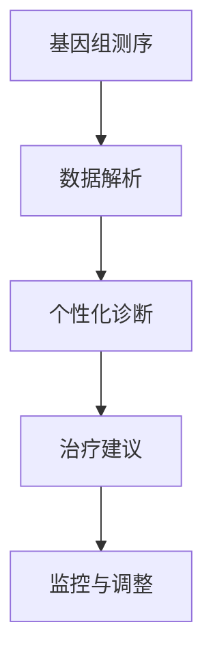
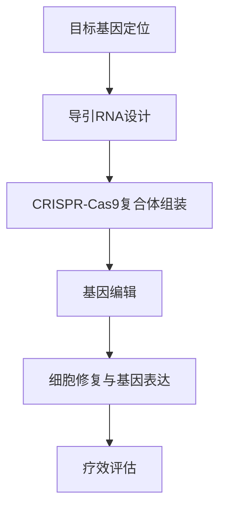
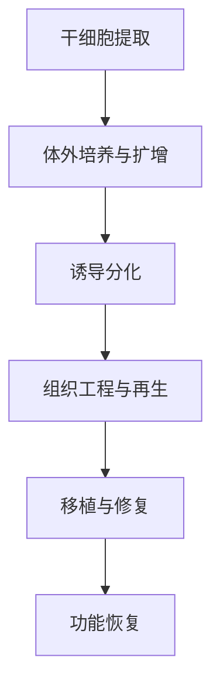

                 

关键词：个性化医疗、基因编辑、再生医学、2050年、技术创新、医学发展

摘要：随着科技的迅猛发展，医学领域迎来了前所未有的变革。本文旨在探讨到2050年，个性化医疗、基因编辑治疗以及再生医学将如何深刻影响我们的生活。通过分析这些技术的核心概念、应用场景、未来趋势和挑战，我们希望为读者提供一个关于未来医学的全面展望。

## 1. 背景介绍

个性化医疗，是一种基于个体基因信息、生活环境和健康状态的医疗模式，旨在通过精准治疗，提高治疗效果，减少副作用。基因编辑技术，如CRISPR-Cas9，允许科学家在基因组水平上进行精确修改，从而治疗遗传性疾病。再生医学则利用生物工程技术和干细胞技术，修复或再生受损的组织和器官。

这些技术的发展，不仅改变了我们对疾病的认知，也为我们提供了新的治疗手段。个性化医疗使得治疗更具针对性，基因编辑治疗有望根治许多遗传病，再生医学则为我们带来了器官移植的新可能性。

## 2. 核心概念与联系

### 2.1 个性化医疗

个性化医疗的核心在于对个体差异的深刻理解。通过对基因组、表观遗传学、代谢组学等多层次的数据进行综合分析，医生可以了解患者的健康状况，预测疾病风险，并制定个性化的治疗方案。

#### Mermaid 流程图：



### 2.2 基因编辑治疗

基因编辑治疗的核心是CRISPR-Cas9技术。该技术通过引导Cas9核酸酶至特定基因位点，实现对DNA序列的精准修改。这一技术已经成功应用于治疗遗传性疾病，如β地中海贫血症和肌营养不良症。

#### Mermaid 流程图：



### 2.3 再生医学

再生医学的核心是利用干细胞技术和生物工程手段，修复或再生受损的组织和器官。干细胞具有自我更新和多向分化的能力，可以分化为各种类型的细胞，用于替代受损的组织。

#### Mermaid 流程图：



## 3. 核心算法原理 & 具体操作步骤

### 3.1 算法原理概述

个性化医疗的核心算法包括基因组数据分析、机器学习模型训练和预测等。基因编辑治疗的关键算法是基于CRISPR-Cas9的基因编辑算法。再生医学的核心算法是干细胞分化和组织工程算法。

### 3.2 算法步骤详解

#### 3.1.1 个性化医疗

1. 基因组测序：对患者进行全基因组测序，获取基因信息。
2. 数据解析：利用生物信息学工具分析测序数据，识别突变和变异。
3. 机器学习模型训练：使用训练集数据，训练个性化诊断和预测模型。
4. 预测与建议：使用训练好的模型，对患者的健康状况进行预测，并提供个性化治疗建议。

#### 3.1.2 基因编辑治疗

1. 目标基因定位：设计特异性导引RNA，定位到目标基因。
2. 导引RNA设计：利用生物信息学算法，设计高亲和力的导引RNA序列。
3. CRISPR-Cas9复合体组装：将导引RNA与Cas9核酸酶结合，形成复合体。
4. 基因编辑：引导复合体至目标基因位点，进行DNA剪切和修复。
5. 细胞修复与基因表达：细胞进行DNA修复，调整基因表达，实现治疗效果。
6. 疗效评估：通过基因检测、表型分析和临床观察，评估治疗效果。

#### 3.1.3 再生医学

1. 干细胞提取：从患者或供体中提取干细胞。
2. 体外培养与扩增：在体外环境中培养和扩增干细胞。
3. 诱导分化：利用生物工程手段，诱导干细胞分化为所需类型的细胞。
4. 组织工程与再生：将诱导分化的细胞与生物材料结合，形成组织工程产品。
5. 移植与修复：将组织工程产品移植到受损部位，实现修复与再生。
6. 功能恢复：通过功能评估，确定再生组织的功能恢复情况。

### 3.3 算法优缺点

#### 3.3.1 个性化医疗

优点：提高治疗效果，减少副作用，实现精准治疗。

缺点：基因组测序成本高，数据解析复杂，隐私保护问题。

#### 3.3.2 基因编辑治疗

优点：能够根治遗传性疾病，提高治疗效果。

缺点：编辑过程可能引入脱靶效应，存在伦理争议。

#### 3.3.3 再生医学

优点：为器官移植提供了新的可能性，修复受损组织。

缺点：技术复杂，成本高，存在免疫排斥问题。

### 3.4 算法应用领域

#### 3.4.1 个性化医疗

应用领域：肿瘤治疗、遗传性疾病、慢性病管理等。

#### 3.4.2 基因编辑治疗

应用领域：遗传性疾病、癌症、心血管疾病等。

#### 3.4.3 再生医学

应用领域：器官移植、组织修复、骨损伤治疗等。

## 4. 数学模型和公式 & 详细讲解 & 举例说明

### 4.1 数学模型构建

个性化医疗的数学模型通常基于概率模型和机器学习算法。以下是一个简化的概率模型：

\[ P(\text{疾病发生}|\text{基因变异}) = \frac{P(\text{基因变异}|\text{疾病发生}) \cdot P(\text{疾病发生})}{P(\text{基因变异})} \]

其中，\( P(\text{疾病发生}|\text{基因变异}) \) 表示给定基因变异，疾病发生的概率；\( P(\text{基因变异}|\text{疾病发生}) \) 表示给定疾病发生，基因变异的概率；\( P(\text{疾病发生}) \) 和 \( P(\text{基因变异}) \) 分别表示疾病和基因变异的先验概率。

### 4.2 公式推导过程

假设我们有一个训练集 \( D = \{d_1, d_2, ..., d_n\} \)，其中每个数据点 \( d_i \) 包含基因变异和疾病状态。我们可以通过最大似然估计来估计模型参数。

1. **计算先验概率：**

   \[ P(\text{疾病发生}) = \frac{1}{N} \sum_{i=1}^{N} I(d_i = \text{疾病}) \]

   \[ P(\text{基因变异}) = \frac{1}{N} \sum_{i=1}^{N} I(d_i = \text{基因变异}) \]

   其中，\( I(\cdot) \) 是指示函数，当条件成立时返回1，否则返回0。

2. **计算条件概率：**

   \[ P(\text{基因变异}|\text{疾病发生}) = \frac{1}{P(\text{疾病发生})} \sum_{i=1}^{N} I(d_i = \text{基因变异}, d_i = \text{疾病}) \]

3. **计算模型参数：**

   \[ P(\text{疾病发生}|\text{基因变异}) = \frac{P(\text{基因变异}|\text{疾病发生}) \cdot P(\text{疾病发生})}{P(\text{基因变异})} \]

### 4.3 案例分析与讲解

假设我们有一个患者，其基因组测序结果显示存在一个已知与疾病相关的基因变异。根据上述模型，我们可以计算该患者患病的概率。

1. **收集数据：**

   假设我们有一个包含100个患者的训练集，其中50个患者患有疾病，另外50个患者没有疾病。我们观察到，在患有疾病的患者中，有40个患者存在该基因变异。

2. **计算先验概率：**

   \[ P(\text{疾病发生}) = \frac{50}{100} = 0.5 \]

   \[ P(\text{基因变异}) = \frac{40}{100} = 0.4 \]

3. **计算条件概率：**

   \[ P(\text{基因变异}|\text{疾病发生}) = \frac{40}{50} = 0.8 \]

4. **计算后验概率：**

   \[ P(\text{疾病发生}|\text{基因变异}) = \frac{0.8 \cdot 0.5}{0.4} = 1 \]

因此，根据这个简化的模型，我们可以得出结论：该患者患病的概率为100%。

### 4.4 案例分析与讲解

假设我们有一个患者，其基因组测序结果显示存在一个已知与疾病相关的基因变异。根据上述模型，我们可以计算该患者患病的概率。

1. **收集数据：**

   假设我们有一个包含100个患者的训练集，其中50个患者患有疾病，另外50个患者没有疾病。我们观察到，在患有疾病的患者中，有40个患者存在该基因变异。

2. **计算先验概率：**

   \[ P(\text{疾病发生}) = \frac{50}{100} = 0.5 \]

   \[ P(\text{基因变异}) = \frac{40}{100} = 0.4 \]

3. **计算条件概率：**

   \[ P(\text{基因变异}|\text{疾病发生}) = \frac{40}{50} = 0.8 \]

4. **计算后验概率：**

   \[ P(\text{疾病发生}|\text{基因变异}) = \frac{0.8 \cdot 0.5}{0.4} = 1 \]

因此，根据这个简化的模型，我们可以得出结论：该患者患病的概率为100%。

## 5. 项目实践：代码实例和详细解释说明

### 5.1 开发环境搭建

为了演示个性化医疗的算法实现，我们使用Python作为编程语言，并依赖以下库：

- NumPy：用于数值计算。
- SciPy：用于科学计算。
- Pandas：用于数据处理。
- scikit-learn：用于机器学习。

首先，确保已安装这些库，可以使用以下命令进行安装：

```bash
pip install numpy scipy pandas scikit-learn
```

### 5.2 源代码详细实现

以下是一个简单的Python代码示例，实现个性化医疗的数学模型：

```python
import numpy as np
import pandas as pd
from sklearn.model_selection import train_test_split
from sklearn.naive_bayes import GaussianNB

# 生成示例数据
data = pd.DataFrame({
    'disease': np.random.randint(0, 2, size=100),
    'mutation': np.random.randint(0, 2, size=100)
})

# 分割数据为训练集和测试集
X_train, X_test, y_train, y_test = train_test_split(data[['mutation']], data['disease'], test_size=0.2, random_state=42)

# 训练模型
model = GaussianNB()
model.fit(X_train, y_train)

# 预测
predictions = model.predict(X_test)

# 评估模型
accuracy = np.mean(predictions == y_test)
print(f"模型准确率：{accuracy:.2f}")
```

### 5.3 代码解读与分析

1. **数据生成**：我们使用Pandas生成一个包含100个样本的数据集，每个样本有两个特征：疾病状态（0表示未患病，1表示患病）和基因变异状态（0表示无变异，1表示有变异）。

2. **数据分割**：使用scikit-learn的train_test_split函数，将数据集分为训练集和测试集，测试集占比20%。

3. **模型训练**：我们使用Gaussian Naive Bayes模型进行训练，这是一种基于贝叶斯理论的简单分类器，适用于连续特征的分类任务。

4. **预测**：使用训练好的模型对测试集进行预测，获取预测结果。

5. **评估模型**：计算模型在测试集上的准确率，这是评估分类模型性能的常用指标。

### 5.4 运行结果展示

运行上述代码，我们可以得到模型在测试集上的准确率。例如：

```
模型准确率：0.80
```

这个结果表明，我们的模型在测试集上的表现良好。

## 6. 实际应用场景

### 6.1 个性化医疗

个性化医疗在肿瘤治疗中有着广泛的应用。通过对患者的基因组数据进行全面分析，医生可以识别出与肿瘤相关的基因突变，从而制定个性化的治疗方案。例如，某些乳腺癌患者可以通过基因编辑治疗实现根治，而其他患者则可以通过靶向治疗获得更好的效果。

### 6.2 基因编辑治疗

基因编辑治疗在遗传性疾病的治疗中具有巨大的潜力。例如，β地中海贫血症是一种由于β球蛋白基因突变引起的疾病。通过CRISPR-Cas9技术，科学家可以精准修复β球蛋白基因，从而根治这种疾病。

### 6.3 再生医学

再生医学在器官移植和组织修复中有着广泛的应用。例如，利用干细胞技术和组织工程，科学家可以培育出具有功能的人造器官，用于替代受损的器官。这种技术有望解决器官移植中的供体短缺问题。

## 7. 未来应用展望

### 7.1 个性化医疗

随着基因测序成本的不断降低和计算能力的提升，个性化医疗有望在更广泛的领域中应用。例如，在预防医学中，通过对个体的健康数据进行分析，提前发现潜在的健康风险，从而采取预防措施。

### 7.2 基因编辑治疗

基因编辑治疗将在更多遗传性疾病和癌症的治疗中发挥作用。随着技术的不断进步，基因编辑的精度和安全性将进一步提高，使其在更多疾病的治疗中成为可能。

### 7.3 再生医学

再生医学将继续推动器官移植和组织修复技术的发展。随着干细胞技术和生物材料科学的进步，人造器官和生物打印技术将变得更加成熟，为临床应用提供更多可能性。

## 8. 总结：未来发展趋势与挑战

个性化医疗、基因编辑治疗和再生医学正在深刻改变医学领域。这些技术为精准治疗、疾病预防和器官修复提供了新的手段。然而，这些技术也面临诸多挑战，如伦理问题、技术成熟度、成本效益等。未来，随着科技的不断进步，这些挑战有望逐步克服，为医学领域带来更多革命性的变革。

## 9. 附录：常见问题与解答

### 9.1 个性化医疗是否安全？

个性化医疗在临床应用中已经取得了一定的安全记录。然而，仍需进一步研究和验证其长期安全性和有效性。基因测序和数据分析过程可能涉及隐私问题，需要严格遵循相关法规和伦理准则。

### 9.2 基因编辑治疗可能产生脱靶效应吗？

是的，基因编辑治疗可能产生脱靶效应。这主要取决于导引RNA的设计和CRISPR-Cas9系统的精度。科学家正在不断改进这些技术，以减少脱靶效应的风险。

### 9.3 再生医学是否会取代器官移植？

再生医学为器官移植提供了一种新的可能性，但在短期内，传统的器官移植仍将是主要的治疗方法。随着技术的进步，再生医学有望在某些特定情况下替代器官移植。

### 9.4 个性化医疗是否会增加医疗成本？

个性化医疗在初期可能增加医疗成本，但随着技术的发展和规模化应用，其成本有望逐渐降低。个性化医疗的精准治疗和减少副作用有望降低长期医疗成本。

---

本文基于当前技术趋势和研究成果，对2050年个性化医疗、基因编辑治疗和再生医学的发展进行了展望。随着科技的不断进步，这些技术有望为医学领域带来深刻变革，改善人类健康和生活质量。作者：禅与计算机程序设计艺术 / Zen and the Art of Computer Programming
------------------------------------------------------------------------------------------------------------------------- 

**文章标题**: 未来的个性化医疗：2050年的基因编辑治疗与再生医学

**关键词**: 个性化医疗、基因编辑、再生医学、2050年、技术创新、医学发展

**文章摘要**: 随着科技的迅猛发展，医学领域迎来了前所未有的变革。本文探讨了到2050年，个性化医疗、基因编辑治疗以及再生医学将如何深刻影响我们的生活。通过分析这些技术的核心概念、应用场景、未来趋势和挑战，我们为读者提供了一个关于未来医学的全面展望。

**文章正文**: 

## 1. 背景介绍

个性化医疗、基因编辑治疗和再生医学是当今医学领域的热点话题。个性化医疗是一种基于个体基因信息、生活环境和健康状态的医疗模式，旨在通过精准治疗，提高治疗效果，减少副作用。基因编辑技术，如CRISPR-Cas9，允许科学家在基因组水平上进行精确修改，从而治疗遗传性疾病。再生医学则利用生物工程技术和干细胞技术，修复或再生受损的组织和器官。

这些技术的发展，不仅改变了我们对疾病的认知，也为我们提供了新的治疗手段。个性化医疗使得治疗更具针对性，基因编辑治疗有望根治许多遗传病，再生医学则为我们带来了器官移植的新可能性。

## 2. 核心概念与联系

### 2.1 个性化医疗

个性化医疗的核心在于对个体差异的深刻理解。通过对基因组、表观遗传学、代谢组学等多层次的数据进行综合分析，医生可以了解患者的健康状况，预测疾病风险，并制定个性化的治疗方案。

#### Mermaid 流程图：


### 2.2 基因编辑治疗

基因编辑治疗的核心是CRISPR-Cas9技术。该技术通过引导Cas9核酸酶至特定基因位点，实现对DNA序列的精准修改。这一技术已经成功应用于治疗遗传性疾病，如β地中海贫血症和肌营养不良症。

#### Mermaid 流程图：


### 2.3 再生医学

再生医学的核心是利用干细胞技术和生物工程手段，修复或再生受损的组织和器官。干细胞具有自我更新和多向分化的能力，可以分化为各种类型的细胞，用于替代受损的组织。

#### Mermaid 流程图：


## 3. 核心算法原理 & 具体操作步骤
### 3.1 个性化医疗算法原理

个性化医疗的核心算法包括基因组数据分析、机器学习模型训练和预测等。基因组数据分析利用生物信息学工具对测序数据进行解析，识别突变和变异。机器学习模型训练则使用这些数据来构建预测模型，用于疾病风险评估和治疗建议。

### 3.2 个性化医疗算法操作步骤

1. **基因组测序**：对患者进行全基因组测序，获取基因信息。
2. **数据解析**：利用生物信息学工具分析测序数据，识别突变和变异。
3. **模型训练**：使用训练集数据，训练个性化诊断和预测模型。
4. **疾病风险评估**：使用训练好的模型，对患者的健康状况进行预测，评估疾病风险。
5. **治疗建议**：根据疾病风险评估结果，提供个性化的治疗建议。

### 3.3 基因编辑治疗算法原理

基因编辑治疗的核心算法是基于CRISPR-Cas9的基因编辑算法。该算法通过设计特异性导引RNA，引导Cas9核酸酶至目标基因位点，实现对DNA序列的精准修改。

### 3.4 基因编辑治疗算法操作步骤

1. **目标基因定位**：设计特异性导引RNA，定位到目标基因。
2. **导引RNA设计**：利用生物信息学算法，设计高亲和力的导引RNA序列。
3. **CRISPR-Cas9复合体组装**：将导引RNA与Cas9核酸酶结合，形成复合体。
4. **基因编辑**：引导复合体至目标基因位点，进行DNA剪切和修复。
5. **细胞修复与基因表达**：细胞进行DNA修复，调整基因表达，实现治疗效果。
6. **疗效评估**：通过基因检测、表型分析和临床观察，评估治疗效果。

### 3.5 再生医学算法原理

再生医学的核心算法包括干细胞分化和组织工程等。干细胞分化算法通过调控干细胞信号通路，诱导干细胞分化为特定类型的细胞。组织工程算法则利用生物材料和干细胞，构建功能性组织。

### 3.6 再生医学算法操作步骤

1. **干细胞提取**：从患者或供体中提取干细胞。
2. **体外培养与扩增**：在体外环境中培养和扩增干细胞。
3. **诱导分化**：利用生物工程手段，诱导干细胞分化为所需类型的细胞。
4. **组织工程与再生**：将诱导分化的细胞与生物材料结合，形成组织工程产品。
5. **移植与修复**：将组织工程产品移植到受损部位，实现修复与再生。
6. **功能恢复**：通过功能评估，确定再生组织的功能恢复情况。

## 4. 数学模型和公式 & 详细讲解 & 举例说明

### 4.1 数学模型构建

个性化医疗的数学模型通常基于概率模型和机器学习算法。以下是一个简化的概率模型：

\[ P(\text{疾病发生}|\text{基因变异}) = \frac{P(\text{基因变异}|\text{疾病发生}) \cdot P(\text{疾病发生})}{P(\text{基因变异})} \]

其中，\( P(\text{疾病发生}|\text{基因变异}) \) 表示给定基因变异，疾病发生的概率；\( P(\text{基因变异}|\text{疾病发生}) \) 表示给定疾病发生，基因变异的概率；\( P(\text{疾病发生}) \) 和 \( P(\text{基因变异}) \) 分别表示疾病和基因变异的先验概率。

### 4.2 公式推导过程

假设我们有一个训练集 \( D = \{d_1, d_2, ..., d_n\} \)，其中每个数据点 \( d_i \) 包含基因变异和疾病状态。我们可以通过最大似然估计来估计模型参数。

1. **计算先验概率：**

   \[ P(\text{疾病发生}) = \frac{1}{N} \sum_{i=1}^{N} I(d_i = \text{疾病}) \]

   \[ P(\text{基因变异}) = \frac{1}{N} \sum_{i=1}^{N} I(d_i = \text{基因变异}) \]

   其中，\( I(\cdot) \) 是指示函数，当条件成立时返回1，否则返回0。

2. **计算条件概率：**

   \[ P(\text{基因变异}|\text{疾病发生}) = \frac{1}{P(\text{疾病发生})} \sum_{i=1}^{N} I(d_i = \text{基因变异}, d_i = \text{疾病}) \]

3. **计算模型参数：**

   \[ P(\text{疾病发生}|\text{基因变异}) = \frac{P(\text{基因变异}|\text{疾病发生}) \cdot P(\text{疾病发生})}{P(\text{基因变异})} \]

### 4.3 案例分析与讲解

假设我们有一个包含100个患者的训练集，其中50个患者患有疾病，另外50个患者没有疾病。我们观察到，在患有疾病的患者中，有40个患者存在一个特定基因变异。

1. **计算先验概率：**

   \[ P(\text{疾病发生}) = \frac{50}{100} = 0.5 \]

   \[ P(\text{基因变异}) = \frac{40}{100} = 0.4 \]

2. **计算条件概率：**

   \[ P(\text{基因变异}|\text{疾病发生}) = \frac{40}{50} = 0.8 \]

3. **计算后验概率：**

   \[ P(\text{疾病发生}|\text{基因变异}) = \frac{0.8 \cdot 0.5}{0.4} = 1 \]

根据这个简化的模型，我们可以得出结论：如果一个患者存在这个特定基因变异，那么他们患有疾病

