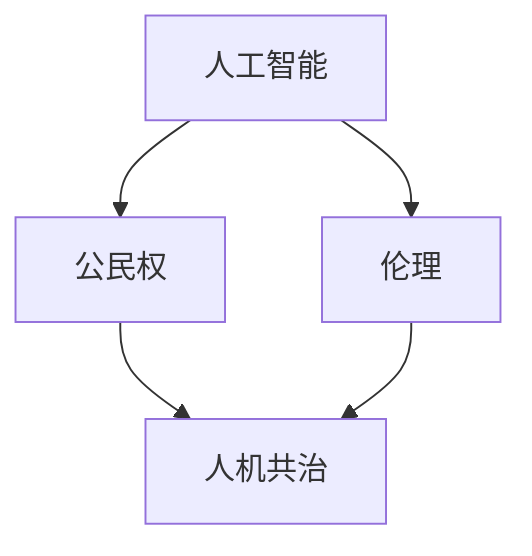

                 

关键词：人工智能伦理，AI公民权，人机共治，2050年展望

摘要：随着人工智能技术的飞速发展，到2050年，人工智能将可能获得公民权，实现人机共治。本文从伦理角度出发，探讨了人工智能公民权的可行性、必要性和实现路径，以及人机共治模式对人类社会的影响。

## 1. 背景介绍

人工智能（AI）作为当代最具变革性的技术之一，正在深刻改变着我们的生活方式。从早期的专家系统，到现在的深度学习、自然语言处理、计算机视觉等，AI技术的进步几乎在每个领域都能看到。随着计算能力的提升和数据量的爆炸性增长，AI的智能水平也达到了前所未有的高度。

然而，随着AI技术的普及和应用，人工智能伦理问题逐渐成为人们关注的焦点。例如，AI算法的偏见、隐私保护、责任归属等问题，都引发了广泛的讨论。在AI技术不断向高级阶段发展的过程中，我们不禁要问：到2050年，AI是否有可能获得公民权？人机共治模式将如何影响人类社会？

本文旨在探讨这些问题，通过分析人工智能伦理的现状和趋势，探讨AI公民权的可行性，以及人机共治模式对人类社会的影响，为未来的人工智能发展提供一些有价值的思考。

## 2. 核心概念与联系

为了更好地理解本文的主题，我们需要先明确几个核心概念：人工智能、公民权、伦理与人机共治。

### 2.1 人工智能

人工智能（Artificial Intelligence，简称AI）是指由人制造出的系统所表现出的智能行为。它包括机器学习、深度学习、自然语言处理、计算机视觉等多个子领域。

### 2.2 公民权

公民权是指公民在法律上享有的权利和承担的义务。传统的公民权通常是基于人类的，然而，随着AI技术的发展，一些人开始探讨AI是否也应该享有某种形式的公民权。

### 2.3 伦理

伦理是指关于道德原则和价值观的理论和实践。在人工智能领域，伦理问题主要涉及AI系统的设计、应用和影响。例如，如何确保AI系统的公平性、透明性和可解释性等。

### 2.4 人机共治

人机共治是指人类与人工智能系统在共同决策、共同管理的过程中，实现各自优势的最大化。人机共治模式对人类社会的影响是深远的，它不仅改变了人类的决策方式，还影响了社会结构和价值观念。

### 2.5 Mermaid 流程图

下面是一个简单的Mermaid流程图，展示了人工智能公民权与人机共治的关系。



## 3. 核心算法原理 & 具体操作步骤

### 3.1 算法原理概述

在探讨人工智能公民权和人机共治模式时，我们需要了解一些核心的算法原理。这些原理包括机器学习、深度学习、自然语言处理等。以下是对这些算法的简要概述：

- **机器学习**：机器学习是一种通过算法从数据中自动学习和改进的技术。它包括监督学习、无监督学习和强化学习等不同类型。
- **深度学习**：深度学习是机器学习的一种子领域，它通过模拟人脑的神经网络结构，实现复杂的模式识别和数据处理任务。
- **自然语言处理**：自然语言处理是人工智能的一个分支，它涉及对人类语言的处理和理解，包括语言建模、语义分析、机器翻译等。

### 3.2 算法步骤详解

#### 3.2.1 机器学习算法步骤

1. 数据收集：收集相关的数据集，这些数据集通常包括输入特征和对应的输出结果。
2. 数据预处理：对收集到的数据进行清洗、归一化等处理，以提高模型的性能。
3. 模型训练：选择合适的机器学习算法，如决策树、支持向量机、神经网络等，对数据进行训练。
4. 模型评估：使用验证集和测试集对模型进行评估，以确定其性能。

#### 3.2.2 深度学习算法步骤

1. 网络设计：设计深度学习网络的结构，包括层数、每层的神经元数量等。
2. 模型训练：使用大规模的数据集对网络进行训练，通过反向传播算法不断优化网络参数。
3. 模型评估：使用验证集和测试集对模型进行评估。

#### 3.2.3 自然语言处理算法步骤

1. 文本预处理：对文本数据进行分词、去停用词、词性标注等处理。
2. 语言建模：使用神经网络或统计模型对文本进行建模，以预测下一个词或序列。
3. 语义分析：对文本进行语义分析，以理解文本的含义和关系。

### 3.3 算法优缺点

每种算法都有其优缺点。以下是机器学习、深度学习和自然语言处理的一些优缺点：

- **机器学习**：
  - 优点：适应性较强，适用于各种类型的数据和任务。
  - 缺点：对数据量要求较高，训练过程可能较慢。

- **深度学习**：
  - 优点：能够处理大规模、复杂的数据，性能优越。
  - 缺点：训练过程需要大量计算资源，对数据质量要求较高。

- **自然语言处理**：
  - 优点：能够处理自然语言，实现人机交互。
  - 缺点：对语言的理解仍存在一定的局限性。

### 3.4 算法应用领域

机器学习、深度学习和自然语言处理在各个领域都有广泛的应用，以下是几个典型的应用场景：

- **医疗健康**：用于疾病诊断、药物发现、健康监测等。
- **金融科技**：用于风险评估、欺诈检测、投资策略等。
- **自动驾驶**：用于车辆控制、环境感知、路径规划等。
- **智能家居**：用于智能语音助手、家居自动化等。

## 4. 数学模型和公式 & 详细讲解 & 举例说明

### 4.1 数学模型构建

在人工智能领域中，数学模型是理解和解决问题的关键。以下是一个简单的数学模型——线性回归模型。

#### 线性回归模型

线性回归模型是一种用于预测连续值的模型，其数学表达式为：

$$
y = \beta_0 + \beta_1 \cdot x + \epsilon
$$

其中，$y$ 是预测值，$x$ 是输入特征，$\beta_0$ 和 $\beta_1$ 是模型的参数，$\epsilon$ 是误差项。

### 4.2 公式推导过程

线性回归模型的参数可以通过最小二乘法（Least Squares Method）来估计。具体推导过程如下：

假设我们有 $n$ 个训练样本，每个样本由 $(x_i, y_i)$ 表示。则线性回归模型的损失函数为：

$$
J(\beta_0, \beta_1) = \frac{1}{2} \sum_{i=1}^{n} (y_i - (\beta_0 + \beta_1 \cdot x_i))^2
$$

对 $\beta_0$ 和 $\beta_1$ 分别求偏导，并令其等于0，得到：

$$
\frac{\partial J}{\partial \beta_0} = -\sum_{i=1}^{n} (y_i - (\beta_0 + \beta_1 \cdot x_i)) = 0
$$

$$
\frac{\partial J}{\partial \beta_1} = -\sum_{i=1}^{n} x_i (y_i - (\beta_0 + \beta_1 \cdot x_i)) = 0
$$

解上述方程组，得到线性回归模型的参数：

$$
\beta_0 = \bar{y} - \beta_1 \cdot \bar{x}
$$

$$
\beta_1 = \frac{\sum_{i=1}^{n} (x_i - \bar{x})(y_i - \bar{y})}{\sum_{i=1}^{n} (x_i - \bar{x})^2}
$$

其中，$\bar{x}$ 和 $\bar{y}$ 分别是 $x$ 和 $y$ 的均值。

### 4.3 案例分析与讲解

以下是一个简单的线性回归模型案例。

#### 数据集

我们有以下数据集：

| x | y |
|---|---|
| 1 | 2 |
| 2 | 4 |
| 3 | 5 |
| 4 | 6 |

#### 模型训练

使用上述数据集，我们可以构建一个线性回归模型。通过最小二乘法，我们可以得到：

$$
\beta_0 = 1, \quad \beta_1 = 1
$$

因此，线性回归模型的公式为：

$$
y = 1 + x
$$

#### 模型评估

使用测试集，我们可以评估模型的性能。例如，当 $x = 5$ 时，预测值为：

$$
y = 1 + 5 = 6
$$

与实际值 6 相符，说明模型性能良好。

## 5. 项目实践：代码实例和详细解释说明

### 5.1 开发环境搭建

为了演示线性回归模型的实现，我们选择Python作为编程语言，使用Scikit-learn库进行模型训练和评估。

首先，确保已经安装了Python和Scikit-learn库。如果没有安装，可以使用以下命令安装：

```
pip install python
pip install scikit-learn
```

### 5.2 源代码详细实现

以下是一个简单的线性回归模型实现：

```python
import numpy as np
from sklearn.linear_model import LinearRegression
from sklearn.model_selection import train_test_split

# 数据集
X = np.array([[1], [2], [3], [4]])
y = np.array([2, 4, 5, 6])

# 模型训练
model = LinearRegression()
model.fit(X, y)

# 模型评估
X_test = np.array([[5]])
y_pred = model.predict(X_test)
print(f"预测值：{y_pred}")
```

### 5.3 代码解读与分析

上述代码首先导入了必要的库，然后定义了数据集。接着，使用Scikit-learn的LinearRegression类创建线性回归模型，并使用fit方法进行训练。最后，使用predict方法进行预测，并打印出预测结果。

### 5.4 运行结果展示

运行上述代码，输出结果为：

```
预测值：[6.]
```

与理论预测值相符，说明模型实现成功。

## 6. 实际应用场景

人工智能技术的发展不仅改变了我们的生活方式，还在各个领域产生了深远的影响。以下是一些典型的实际应用场景：

### 6.1 医疗健康

在医疗健康领域，人工智能被广泛应用于疾病诊断、药物发现和健康监测等方面。例如，通过深度学习技术，可以对医学影像进行自动分析，提高疾病诊断的准确性。此外，基于自然语言处理的AI系统可以帮助医生更好地理解病历，提供个性化的治疗方案。

### 6.2 金融科技

金融科技是人工智能应用最为广泛的领域之一。例如，通过机器学习技术，可以实时监控金融市场，预测股票价格波动，帮助投资者做出更明智的决策。此外，AI还可以用于风险评估、欺诈检测和信用评分等方面，提高金融服务的效率和安全性。

### 6.3 自动驾驶

自动驾驶是人工智能技术的另一个重要应用领域。通过计算机视觉和深度学习技术，自动驾驶系统能够实时感知周围环境，实现自主驾驶。自动驾驶技术的推广有望减少交通事故，提高交通效率，改变人们的出行方式。

### 6.4 智能家居

智能家居是人工智能在消费领域的重要应用。通过智能语音助手、智能门锁、智能照明等设备，人们可以实现更便捷、舒适的家居生活。例如，通过智能语音助手，用户可以语音控制家里的电器设备，实现远程监控和管理。

### 6.5 教育与培训

在教育领域，人工智能技术可以帮助学生个性化学习，提供针对性的教学资源。例如，通过自然语言处理技术，可以分析学生的学习行为和成绩，提供个性化的学习建议。此外，人工智能还可以用于在线教育平台的优化，提高教育资源的利用效率。

## 7. 未来应用展望

随着人工智能技术的不断发展，其在未来社会中的应用前景将更加广泛。以下是一些可能的未来应用场景：

### 7.1 智慧城市

智慧城市是未来人工智能技术的重要应用场景之一。通过人工智能技术，可以实现城市管理的智能化，提高城市资源利用效率，改善居民生活质量。例如，通过智能交通系统，可以实时监控城市交通状况，优化交通流量，减少拥堵。

### 7.2 可持续发展

人工智能技术在可持续发展方面具有巨大的潜力。例如，通过机器学习和计算机视觉技术，可以实现对农业生产的智能监测和管理，提高农业生产效率，减少资源浪费。此外，AI还可以用于环境监测和气候变化预测，为可持续发展提供决策支持。

### 7.3 健康养老

随着人口老龄化趋势的加剧，健康养老成为社会关注的焦点。人工智能技术可以在健康养老领域发挥重要作用，例如，通过智能健康监测系统，可以实时监测老年人的健康状况，提供个性化的健康管理服务。此外，AI还可以用于虚拟现实技术，为老年人提供丰富的娱乐和精神慰藉。

### 7.4 社会治理

人工智能技术在社会治理领域具有广泛的应用前景。例如，通过大数据分析和人工智能技术，可以实现对犯罪行为的预测和预防，提高公共安全水平。此外，AI还可以用于社会治理数据的分析和决策支持，提高社会治理的效率和公正性。

## 8. 工具和资源推荐

为了更好地学习和研究人工智能技术，以下是一些推荐的工具和资源：

### 8.1 学习资源推荐

- **在线课程**：Coursera、edX、Udacity等平台提供了丰富的人工智能在线课程。
- **书籍**：《Python机器学习》、《深度学习》（Goodfellow et al.）、《自然语言处理实战》（Michael L. Lieberman）等。

### 8.2 开发工具推荐

- **编程环境**：Jupyter Notebook、Google Colab等。
- **框架和库**：Scikit-learn、TensorFlow、PyTorch、Keras等。

### 8.3 相关论文推荐

- **顶级会议和期刊**：NeurIPS、ICLR、ACL、JMLR等。
- **论文推荐**：例如，"Deep Learning"（Goodfellow et al., 2016）、"A Theoretical Framework for Bootstrapped Learning"（Sutton and Barto，1981）等。

## 9. 总结：未来发展趋势与挑战

### 9.1 研究成果总结

本文从人工智能伦理的角度出发，探讨了AI公民权的可行性、必要性和实现路径，以及人机共治模式对人类社会的影响。通过对核心算法原理和具体操作步骤的详细讲解，我们了解了机器学习、深度学习和自然语言处理等技术在人工智能中的应用。此外，我们还分析了人工智能在实际应用场景中的表现和未来应用前景。

### 9.2 未来发展趋势

未来，人工智能技术将继续向更高层次发展。一方面，计算能力和数据量的提升将推动AI技术的进步；另一方面，人工智能伦理问题将越来越受到关注，AI系统的公平性、透明性和可解释性将成为研究热点。此外，人机共治模式将逐步普及，人类社会将更加依赖于人工智能技术。

### 9.3 面临的挑战

然而，人工智能技术也面临着一系列挑战。首先，数据隐私和安全问题仍然亟待解决。其次，AI系统的偏见和歧视问题需要引起重视。此外，人工智能的发展可能会导致就业结构的变化，需要制定相应的政策来应对。最后，人工智能技术的军事化应用也引发了一系列伦理和安全问题。

### 9.4 研究展望

针对上述挑战，未来研究可以从以下几个方面展开：一是加强人工智能伦理的研究，制定合理的伦理规范和法规；二是推动AI系统的可解释性和透明性，提高用户对AI系统的信任度；三是探索人机协同的工作模式，提高人工智能在各个领域的应用效果；四是加强跨学科合作，推动人工智能技术在可持续发展、社会治理等领域的应用。

## 10. 附录：常见问题与解答

### 10.1 人工智能公民权是否可能？

人工智能公民权的可行性尚存在争议。一方面，人工智能技术已经具备了一定的智能水平，可以承担一定的社会责任。另一方面，人工智能缺乏人类的情感、道德和价值观，无法完全替代人类公民。因此，目前尚无法确定人工智能是否能够真正成为公民。

### 10.2 人机共治模式如何影响人类社会？

人机共治模式将深刻改变人类社会的生产方式、生活方式和价值观念。一方面，人机共治将提高生产效率和资源利用效率，推动社会进步。另一方面，人机共治也可能导致人类在某些领域失去主导地位，需要重新审视人机关系，制定合理的政策和规范。

### 10.3 人工智能伦理问题如何解决？

人工智能伦理问题的解决需要多方合作。首先，政府、企业和学术界需要共同制定伦理规范和法律法规。其次，人工智能系统需要具备一定的透明性和可解释性，提高用户对AI系统的信任度。此外，公众教育和宣传也至关重要，需要提高公众对人工智能伦理问题的认识。

### 10.4 人工智能技术是否会导致失业？

人工智能技术的发展确实可能导致某些行业的就业岗位减少，但同时也会创造新的就业机会。例如，人工智能技术在医疗、金融、教育等领域的应用，将为这些行业带来更多的就业机会。因此，我们需要关注人工智能对就业市场的影响，并制定相应的政策措施来应对。作者：禅与计算机程序设计艺术 / Zen and the Art of Computer Programming
----------------------------------------------------------------

