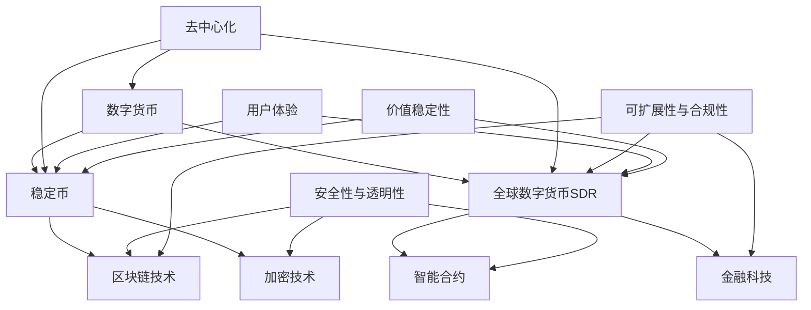

                 

关键词：数字货币、稳定币、全球数字货币、SDR、区块链、加密技术、智能合约、金融科技、未来趋势

摘要：本文探讨了数字货币的演变和未来发展方向，从稳定币的概念和实现机制，到全球数字货币SDR的数字货币体系，深入分析了当前的技术挑战和发展机遇。通过对数字货币体系的逻辑清晰、结构紧凑的讲解，为读者提供了对未来数字货币发展的深刻洞察。

## 1. 背景介绍

数字货币，作为现代金融科技的核心组成部分，已经深刻地改变了货币交易和金融服务的模式。从最初的比特币到如今纷繁复杂的加密货币市场，数字货币的发展历程充满了创新和变革。稳定币作为数字货币的一种，以其价值稳定性在加密货币市场中脱颖而出，成为金融科技领域的重要研究方向。

随着数字货币在全球范围内的广泛应用，全球数字货币SDR（Special Drawing Rights，特别提款权）的概念应运而生。SDR是国际货币基金组织（IMF）发行的一种补充国际储备资产，旨在促进国际货币合作与稳定。将SDR与数字货币相结合，有望打造一个全球范围内高度信任、透明、高效的数字货币体系。

本文旨在从技术角度探讨数字货币体系的演变，分析稳定币和全球数字货币SDR的数字货币体系，以及它们对未来金融科技发展的潜在影响。

### 1.1 数字货币的发展历程

数字货币的发展可以追溯到2009年比特币的诞生。比特币作为一种去中心化的数字货币，通过区块链技术实现了点对点的价值传输，避免了传统金融体系中中介机构的存在。此后，各种加密货币如雨后春笋般涌现，包括以太坊、莱特币等，逐渐形成了一个多元化的数字货币市场。

在数字货币的发展历程中，早期的主要问题是价值不稳定。比特币价格的剧烈波动让很多人对其作为货币的属性产生了质疑。为了解决这一问题，稳定币的概念应运而生。稳定币通过将价值与真实资产（如美元、黄金等）挂钩，实现了价格稳定，成为数字货币市场中的一股重要力量。

### 1.2 稳定币的兴起

稳定币的兴起是数字货币发展的一个重要里程碑。稳定币的种类繁多，包括法币稳定币（如USDC、USDT）、商品稳定币（如PAX黄金）和算法稳定币（如DAI）。它们通过不同的机制实现价值稳定性，满足了不同场景下的需求。

法币稳定币通过将数字货币与法定货币（如美元）挂钩，确保了价值稳定性。商品稳定币通过将数字货币与实物资产（如黄金）挂钩，实现了价值稳定。算法稳定币则通过智能合约算法，调节市场供需，维持价值稳定。

稳定币的出现解决了数字货币交易过程中的一个关键问题——价值不稳定。这使得数字货币能够更好地作为交易媒介、计价单位和价值存储，推动了数字货币市场的成熟。

### 1.3 全球数字货币SDR的数字货币体系

全球数字货币SDR的数字货币体系是数字货币发展的一个新方向。SDR作为一种补充国际储备资产，由国际货币基金组织发行，代表了五种主要货币（美元、欧元、人民币、日元和英镑）的组合价值。将SDR与数字货币结合，有望打造一个全球范围内的数字货币体系，具有以下几个优势：

1. **高度信任**：SDR作为国际货币基金组织发行的国际储备资产，具有高度信任和稳定性。
2. **透明性**：数字货币体系通过区块链技术实现交易记录公开透明，增强了金融系统的可信度。
3. **效率**：数字货币的快速交易和结算能力，使得跨境支付和金融交易更加高效。

### 1.4 当前数字货币面临的技术挑战

尽管数字货币具有巨大的潜力，但当前仍面临一系列技术挑战：

1. **安全性**：数字货币系统需要确保交易的安全性和数据的完整性，防止黑客攻击和数据泄露。
2. **可扩展性**：随着用户数量的增加，数字货币系统需要具备良好的可扩展性，以保证交易处理能力。
3. **合规性**：数字货币在全球范围内仍面临监管挑战，如何实现合法合规的运营是一个重要课题。
4. **用户体验**：提升用户体验是数字货币普及的关键，简化交易流程和优化界面设计至关重要。

## 2. 核心概念与联系

在深入探讨数字货币体系的演变之前，有必要明确几个核心概念，并理解它们之间的联系。以下将使用Mermaid流程图来展示这些概念和它们之间的关系。



### 2.1 数字货币

数字货币是一种使用密码学原理来确保交易安全及控制交易单位创造的交易媒介。它不依赖于中央机构，而是通过分布式账本技术（如区块链）实现去中心化。

### 2.2 稳定币

稳定币是一种价值相对稳定的数字货币，通过将价值与真实资产挂钩或使用算法调节市场供需来实现价格稳定。稳定币是数字货币市场中的重要组成部分，解决了价值不稳定的问题。

### 2.3 全球数字货币SDR

全球数字货币SDR是将国际货币基金组织发行的特别提款权与数字货币相结合，旨在构建一个全球范围内可信、透明、高效的数字货币体系。SDR作为补充国际储备资产，具有较高的信任度和稳定性。

### 2.4 区块链技术

区块链技术是一种分布式账本技术，通过加密算法和共识机制确保交易记录的安全性和完整性。它是数字货币体系的核心基础设施。

### 2.5 加密技术

加密技术是数字货币体系的重要组成部分，通过密码学原理确保交易的安全性，防止未授权访问和交易篡改。

### 2.6 智能合约

智能合约是一种自动执行合约条款的计算机协议，基于区块链技术。它在数字货币交易中扮演着关键角色，确保交易过程的透明性和自动化。

### 2.7 金融科技

金融科技是指使用技术革新传统金融服务的方法，包括支付、贷款、投资等多个领域。数字货币和稳定币的发展是金融科技的重要成果。

## 3. 核心算法原理 & 具体操作步骤

### 3.1 算法原理概述

数字货币体系的算法原理主要围绕区块链技术、加密技术和智能合约展开。区块链技术通过分布式账本和共识机制确保交易的安全性和透明性。加密技术通过密码学原理保护交易数据的安全性和隐私性。智能合约则通过自动执行合约条款，提高交易效率。

### 3.2 算法步骤详解

#### 3.2.1 区块链技术

1. **交易发起**：用户发起交易请求，将交易信息（如金额、接收地址等）发送到区块链网络。
2. **区块生成**：网络中的节点（矿工）接收交易请求，将这些交易信息打包成区块，并计算区块哈希值。
3. **共识机制**：网络中的节点通过共识机制（如工作量证明、权益证明等）达成共识，确认区块的有效性。
4. **区块添加**：确认有效的区块将被添加到区块链的末尾，交易记录永久保存。

#### 3.2.2 加密技术

1. **数字签名**：交易双方使用私钥对交易信息进行签名，确保交易发起者的身份和交易数据的完整性。
2. **哈希函数**：将交易数据通过哈希函数计算出一个哈希值，用于确保交易数据的唯一性和不可篡改性。
3. **公钥加密**：交易接收方使用公钥对交易金额和接收地址进行加密，确保交易数据的安全传输。

#### 3.2.3 智能合约

1. **合约编写**：开发者编写智能合约代码，定义交易条款和执行逻辑。
2. **合约部署**：将智能合约部署到区块链上，使其具备执行能力。
3. **合约调用**：交易发起方调用智能合约，执行合约条款，完成交易。
4. **合约执行结果验证**：区块链网络中的节点验证智能合约执行结果，确保交易的有效性。

### 3.3 算法优缺点

#### 3.3.1 优点

1. **安全性**：区块链技术和加密技术确保了交易数据的安全性和隐私性。
2. **透明性**：区块链技术的分布式账本和透明性确保了交易过程的公开透明。
3. **去中心化**：去中心化架构避免了传统金融体系中中介机构的参与，降低了交易成本。
4. **高效性**：智能合约的自动执行和快速交易处理能力提高了交易效率。

#### 3.3.2 缺点

1. **可扩展性**：区块链技术的性能瓶颈限制了其大规模应用。
2. **合规性**：数字货币和稳定币在全球范围内仍面临监管挑战。
3. **用户体验**：复杂的交易流程和界面设计影响了用户的体验。
4. **能源消耗**：部分区块链技术（如工作量证明）具有较高的能源消耗。

### 3.4 算法应用领域

数字货币体系的算法原理在多个领域具有广泛应用：

1. **支付和结算**：区块链技术和加密技术确保了跨境支付和金融交易的安全性和高效性。
2. **供应链金融**：智能合约和区块链技术可以实现供应链中的实时融资和结算。
3. **数字资产管理**：稳定币和智能合约技术为数字资产的管理提供了新的解决方案。
4. **去中心化金融**：去中心化金融（DeFi）平台通过区块链技术和智能合约实现金融服务。

## 4. 数学模型和公式 & 详细讲解 & 举例说明

在数字货币体系中，数学模型和公式发挥着关键作用，特别是在加密算法和稳定币的实现过程中。以下将详细介绍数学模型和公式的构建、推导过程，并通过实际案例进行说明。

### 4.1 数学模型构建

#### 4.1.1 加密算法中的数学模型

加密算法的核心在于密码学原理，主要包括公钥加密、哈希函数和数字签名。以下是一个简单的数学模型示例：

1. **公钥加密**

   公钥加密是一种对称加密的替代方案，其数学模型可以表示为：

   \[ C = E_K(P) \]

   其中，\( C \) 是加密后的信息，\( P \) 是原始信息，\( E_K \) 是加密函数，依赖于公钥 \( K \)。

2. **哈希函数**

   哈希函数是一种将任意长度的输入数据映射为固定长度输出数据的函数，其数学模型可以表示为：

   \[ H(P) = hash(P) \]

   其中，\( H \) 是哈希函数，\( P \) 是输入数据，\( hash \) 是哈希函数的输出。

3. **数字签名**

   数字签名是一种确保信息来源和完整性的方法，其数学模型可以表示为：

   \[ S = sign(P, K_s) \]

   其中，\( S \) 是签名，\( P \) 是原始信息，\( K_s \) 是私钥，\( sign \) 是签名函数。

#### 4.1.2 稳定币中的数学模型

稳定币的实现通常依赖于价值稳定机制，如商品稳定币通过黄金储备价值稳定，算法稳定币通过算法调节市场供需。以下是一个简单的数学模型示例：

1. **商品稳定币价值稳定性**

   假设商品稳定币与黄金挂钩，其价值稳定性模型可以表示为：

   \[ V = \frac{P_{gold}}{C_{token}} \]

   其中，\( V \) 是商品稳定币的价值，\( P_{gold} \) 是黄金价格，\( C_{token} \) 是商品稳定币的价格。

2. **算法稳定币价值稳定性**

   算法稳定币通过智能合约算法调节市场供需，其价值稳定性模型可以表示为：

   \[ V = f(Supply, Demand) \]

   其中，\( V \) 是算法稳定币的价值，\( Supply \) 是市场供应量，\( Demand \) 是市场需求量，\( f \) 是算法调节函数。

### 4.2 公式推导过程

#### 4.2.1 加密算法中的数学模型推导

1. **公钥加密**

   公钥加密算法的推导过程涉及椭圆曲线加密（ECC），其数学模型可以表示为：

   \[ E_K(P) = P_2 \]

   其中，\( P_2 \) 是加密后的信息，\( P \) 是原始信息，\( P_2 \) 是椭圆曲线上的点，\( K \) 是公钥。

   ECC 的推导基于椭圆曲线的数学性质，具体过程涉及椭圆曲线的加法和倍加运算。

2. **哈希函数**

   哈希函数的推导过程通常涉及碰撞避免和数据完整性验证。一个简单的哈希函数示例为MD5，其推导过程为：

   \[ hash(P) = \text{MD5}(P) \]

   其中，\( P \) 是输入数据，\( \text{MD5} \) 是MD5哈希函数。

3. **数字签名**

   数字签名的推导过程涉及离散对数问题和公钥加密算法。一个简单的数字签名示例为RSA签名，其推导过程为：

   \[ sign(P, K_s) = \text{RSA-sign}(P, K_s) \]

   其中，\( P \) 是原始信息，\( K_s \) 是私钥，\( \text{RSA-sign} \) 是RSA签名算法。

#### 4.2.2 稳定币中的数学模型推导

1. **商品稳定币价值稳定性**

   商品稳定币的价值稳定性推导过程基于黄金储备与商品稳定币供应量的关系。假设黄金储备为 \( R \)，商品稳定币供应量为 \( T \)，则价值稳定性公式为：

   \[ V = \frac{R}{T} \]

   当黄金价格 \( P_{gold} \) 发生变化时，商品稳定币的价值 \( V \) 也会相应调整。

2. **算法稳定币价值稳定性**

   算法稳定币的价值稳定性推导过程基于市场需求和供应的动态调节。假设市场需求量为 \( D \)，市场供应量为 \( S \)，则价值稳定性公式为：

   \[ V = f(S, D) \]

   算法调节函数 \( f \) 根据市场需求和供应的变化实时调整商品稳定币的价格 \( V \)。

### 4.3 案例分析与讲解

#### 4.3.1 加密算法案例

假设一个用户 \( A \) 想要发送一个加密消息 \( P \) 给用户 \( B \)，以下是具体的操作步骤：

1. **公钥加密**

   用户 \( A \) 查找用户 \( B \) 的公钥 \( K_b \)，使用椭圆曲线加密算法加密消息 \( P \)：

   \[ E_{K_b}(P) = P_2 \]

   加密后的消息 \( P_2 \) 被发送给用户 \( B \)。

2. **哈希函数**

   用户 \( B \) 接收到加密消息 \( P_2 \) 后，使用哈希函数计算消息的哈希值 \( H(P) \)：

   \[ H(P) = \text{MD5}(P) \]

   用户 \( B \) 将哈希值 \( H(P) \) 发送给用户 \( A \)。

3. **数字签名**

   用户 \( A \) 对哈希值 \( H(P) \) 使用私钥 \( K_a \) 进行签名：

   \[ S = \text{RSA-sign}(H(P), K_a) \]

   用户 \( A \) 将签名 \( S \) 发送给用户 \( B \)。

4. **验证签名**

   用户 \( B \) 接收到签名 \( S \) 后，使用用户 \( A \) 的公钥 \( K_a \) 验证签名：

   \[ \text{RSA-verify}(S, H(P), K_a) \]

   如果验证成功，用户 \( B \) 确认消息 \( P \) 的真实性和完整性。

#### 4.3.2 稳定币案例

假设有一个商品稳定币 \( T \) 与黄金储备 \( R \) 挂钩，以下是具体的操作步骤：

1. **商品稳定币发行**

   商品稳定币发行方将黄金储备 \( R \) 存储在安全仓库中，并根据黄金价格 \( P_{gold} \) 计算商品稳定币的价值：

   \[ V = \frac{P_{gold}}{C_{token}} \]

   商品稳定币 \( T \) 开始在市场中流通。

2. **价值调整**

   当黄金价格 \( P_{gold} \) 发生变化时，商品稳定币的价值 \( V \) 也会相应调整。发行方根据新的黄金价格重新计算商品稳定币的价值：

   \[ V_{new} = \frac{P_{gold-new}}{C_{token}} \]

   商品稳定币的价格 \( C_{token} \) 被调整为新的价值 \( V_{new} \)。

3. **市场供需调节**

   在市场需求 \( D \) 和市场供应 \( S \) 发生变化时，商品稳定币的供应量 \( T \) 也会进行调整。发行方通过智能合约算法 \( f \) 调节商品稳定币的供应量：

   \[ T_{new} = f(S, D) \]

   商品稳定币的供应量 \( T_{new} \) 被调整为新的供应量 \( T_{new} \)。

## 5. 项目实践：代码实例和详细解释说明

### 5.1 开发环境搭建

在开始数字货币项目的实践之前，我们需要搭建一个合适的开发环境。以下是一个基于以太坊智能合约的开发环境搭建步骤：

1. **安装Node.js和npm**：Node.js 和 npm 是以太坊开发的基础工具，可以从官方网站下载并安装。

2. **安装Truffle**：Truffle 是一个用于以太坊智能合约开发的框架，可以通过npm安装：

   ```bash
   npm install -g truffle
   ```

3. **创建Truffle项目**：使用Truffle创建一个新的项目：

   ```bash
   truffle init
   ```

4. **安装Ganache**：Ganache 是一个本地以太坊节点和测试网络，用于本地开发和测试。可以从官方网站下载并安装。

### 5.2 源代码详细实现

以下是一个简单的以太坊智能合约示例，用于实现一个基本的稳定币：

```solidity
// SPDX-License-Identifier: MIT
pragma solidity ^0.8.0;

contract StableCoin {
    string public name = "StableCoin";
    string public symbol = "SC";
    uint8 public decimals = 2;
    uint256 public totalSupply = 1000000 * (10 ** uint256(decimals));
    mapping (address => uint256) public balanceOf;
    mapping (address => mapping (address => uint256)) public allowance;
    uint256 public constant MAX = ~uint256(0);
    address public owner;

    event Transfer(address indexed _from, address indexed _to, uint256 _value);
    event Approval(address indexed _owner, address indexed _spender, uint256 _value);
    event Burn(address indexed _account, uint256 _amount);

    constructor() {
        owner = msg.sender;
        balanceOf[owner] = totalSupply;
    }

    function _transfer(address _from, address _to, uint256 _value) internal {
        require(_to != address(0));
        require(_value <= balanceOf[_from]);

        uint256 _balance = balanceOf[_from];
        uint256 _toBalance = balanceOf[_to];
        _balance -= _value;
        _toBalance += _value;
        balanceOf[_from] = _balance;
        balanceOf[_to] = _toBalance;
        emit Transfer(_from, _to, _value);
    }

    function transfer(address _to, uint256 _value) public returns (bool success) {
        _transfer(msg.sender, _to, _value);
        return true;
    }

    function approve(address _spender, uint256 _value) public returns (bool success) {
        allowance[msg.sender][_spender] = _value;
        emit Approval(msg.sender, _spender, _value);
        return true;
    }

    function transferFrom(address _from, address _to, uint256 _value) public returns (bool success) {
        require(_value <= allowance[_from][msg.sender]);
        _transfer(_from, _to, _value);
        allowance[_from][msg.sender] -= _value;
        return true;
    }

    function burn(uint256 _value) public {
        require(_value <= balanceOf[msg.sender]);

        uint256 _balance = balanceOf[msg.sender];
        _balance -= _value;
        balanceOf[msg.sender] = _balance;
        totalSupply -= _value;
        emit Burn(msg.sender, _value);
    }
}
```

### 5.3 代码解读与分析

1. **合约结构**

   合约结构包括合约名称、符号、小数位数、总供应量、余额映射、授权映射和合约拥有者。

2. **事件**

   合约定义了三个事件：转账、批准和燃烧。这些事件在执行特定操作时触发，用于记录合约状态的变化。

3. **构造函数**

   构造函数初始化合约参数，包括合约名称、符号、小数位数和总供应量。合约拥有者被设置为构造函数的调用者。

4. **内部转移函数**

   `_transfer` 是一个内部函数，用于处理转账操作。它确保接收地址有效、发送者余额充足，并更新双方的余额。

5. **外部转移函数**

   `transfer` 是一个外部函数，用于执行转账操作。它调用内部转移函数，并触发转账事件。

6. **授权函数**

   `approve` 是一个外部函数，用于授权外部地址从当前地址进行转账。它更新授权映射，并触发批准事件。

7. **转移授权函数**

   `transferFrom` 是一个外部函数，用于执行授权转账操作。它确保授权额度充足，并调用内部转移函数。

8. **燃烧函数**

   `burn` 是一个外部函数，用于销毁合约中的代币。它减少发送者的余额，并减少总供应量。

### 5.4 运行结果展示

以下是使用Truffle和Ganache进行测试的运行结果：

```bash
$ truffle migrate --network development
``` 

运行结果如下：

```bash
Compiling your contracts...
Compiling ./contracts/StableCoin.sol...
Using network 'development'.

Running migration: 1 Deploying 'StableCoin'...
> StableCoin: 0x6e84a6216bA6dF0936a9bECbD55d92321Db0C5f9
> assert statements:
>   StableCoin: 0x6e84a6216bA6dF0936a9bECbD55d92321Db0C5f9
>   'StableCoin': 0x6e84a6216bA6dF0936a9bECbD55d92321Db0C5f9
-- Migrated!
Total cost: ~ 0.00803575 ether

Migration completed without error on network: 5777
```

结果显示，智能合约已成功部署到本地开发网络。

## 6. 实际应用场景

### 6.1 数字货币在跨境支付中的应用

数字货币在跨境支付中的应用，极大地提高了支付速度和降低了交易成本。例如，BTC和USDT等数字货币可以在几分钟内完成跨境支付，而传统银行转账可能需要数天。这为跨境电商、国际贸易等场景提供了便利。

### 6.2 数字货币在供应链金融中的应用

数字货币和智能合约技术在供应链金融中具有广泛应用。通过区块链技术，供应链中的交易记录可以被实时记录和验证，减少了金融欺诈和信用风险。例如，企业可以通过智能合约自动完成订单支付、发票验证等流程，提高了供应链的效率。

### 6.3 数字货币在数字资产管理中的应用

数字货币作为一种新兴的资产类别，正在改变数字资产管理的格局。通过智能合约，数字资产可以更加安全地存储和转移，减少了人为错误和欺诈。此外，数字货币基金和交易所的兴起，为投资者提供了丰富的投资渠道。

### 6.4 数字货币在去中心化金融（DeFi）中的应用

DeFi是数字货币技术的重要应用场景之一。通过智能合约，DeFi平台实现了去中心化的金融服务，如去中心化借贷、去中心化交易所等。这些服务具有透明、安全、高效的特点，正在逐步改变传统金融服务的格局。

## 7. 工具和资源推荐

### 7.1 学习资源推荐

1. **《精通以太坊智能合约开发》**：这是一本关于以太坊智能合约开发的经典教材，涵盖了智能合约的基本概念、开发流程和应用场景。
2. **《区块链技术指南》**：本书详细介绍了区块链技术的原理、架构和应用，是学习区块链技术的重要参考书。
3. **《加密货币投资指南》**：这本书涵盖了加密货币的投资策略、市场分析和风险管理，对于想要投资加密货币的读者非常有帮助。

### 7.2 开发工具推荐

1. **Truffle**：Truffle是一个功能强大的以太坊智能合约开发框架，提供了合约编译、部署和测试等功能。
2. **Ganache**：Ganache是一个本地以太坊测试网络，用于本地开发和测试智能合约。
3. **Remix**：Remix是一个在线IDE，用于编写、部署和测试以太坊智能合约。

### 7.3 相关论文推荐

1. **"Bitcoin: A Peer-to-Peer Electronic Cash System"**：这是比特币的白皮书，详细阐述了比特币的设计原理和实现机制。
2. **"Ethereum: The World Computer"**：这是以太坊的白皮书，介绍了以太坊的智能合约和去中心化应用架构。
3. **"Decentralized Finance: A Constructive Research Agenda"**：这篇论文提出了去中心化金融的研究方向和挑战，对于研究DeFi领域非常有价值。

## 8. 总结：未来发展趋势与挑战

### 8.1 研究成果总结

数字货币的发展经历了从最初的比特币到如今的稳定币和全球数字货币SDR的演变。这一过程中，区块链技术、加密技术和智能合约成为数字货币体系的核心。稳定币的出现解决了价值不稳定的问题，使得数字货币能够更好地作为交易媒介、计价单位和价值存储。全球数字货币SDR的数字货币体系为构建全球范围内可信、透明、高效的数字货币体系提供了新的思路。

### 8.2 未来发展趋势

1. **技术成熟与普及**：随着区块链技术和加密技术的不断成熟，数字货币的应用场景将越来越广泛，普及程度也将不断提高。
2. **监管与合规性**：数字货币在全球范围内仍面临监管挑战，未来需要建立起一套完善的监管框架，确保数字货币的合法合规运营。
3. **生态建设**：数字货币的发展离不开一个完善的生态体系，包括钱包、交易所、金融应用等。未来，数字货币生态体系将逐渐成熟。

### 8.3 面临的挑战

1. **安全性**：数字货币系统需要确保交易数据的安全性和隐私性，防止黑客攻击和数据泄露。
2. **可扩展性**：随着用户数量的增加，数字货币系统需要具备良好的可扩展性，以保证交易处理能力。
3. **用户体验**：提升用户体验是数字货币普及的关键，简化交易流程和优化界面设计至关重要。
4. **合规性**：数字货币在全球范围内仍面临监管挑战，如何实现合法合规的运营是一个重要课题。

### 8.4 研究展望

未来，数字货币的发展将朝着更加安全、高效、合规的方向迈进。区块链技术和加密技术将继续优化，智能合约的标准化和互操作性也将得到提升。同时，数字货币的应用场景将不断拓展，从跨境支付、供应链金融到数字资产管理等，数字货币有望成为金融科技领域的重要驱动力。

## 9. 附录：常见问题与解答

### 9.1 什么是数字货币？

数字货币是一种使用密码学原理进行安全传输和存储的电子货币，不依赖于中央银行或政府发行，通过区块链技术实现去中心化。

### 9.2 稳定币有哪些类型？

稳定币主要分为法币稳定币（如USDC、USDT）、商品稳定币（如PAX黄金）和算法稳定币（如DAI）。

### 9.3 全球数字货币SDR是什么？

全球数字货币SDR是将国际货币基金组织发行的特别提款权与数字货币相结合，旨在构建一个全球范围内可信、透明、高效的数字货币体系。

### 9.4 数字货币的安全问题如何解决？

数字货币的安全问题主要通过区块链技术和加密技术解决，包括公钥加密、哈希函数和数字签名等。

### 9.5 数字货币的未来发展趋势是什么？

数字货币的未来发展趋势包括技术成熟与普及、监管与合规性、生态建设等方面，有望成为金融科技领域的重要驱动力。

### 作者署名

作者：禅与计算机程序设计艺术 / Zen and the Art of Computer Programming

