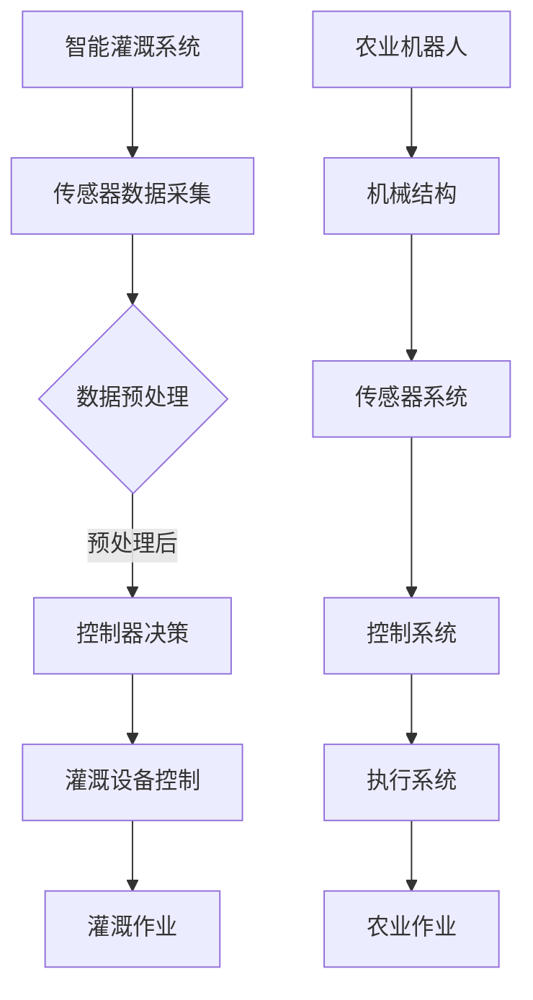

                 

关键词：智慧农业、智能灌溉、农业机器人、2050年、物联网、人工智能、可持续发展

> 摘要：本文将探讨2050年智慧农业的发展前景，重点分析智能灌溉系统和农业机器人的技术原理、应用场景及未来发展趋势，为现代农业的可持续发展提供技术参考。

## 1. 背景介绍

农业是人类生存和发展的重要基础，随着全球人口的增长和资源环境的压力，提高农业生产效率、保障粮食安全、实现可持续发展成为全球农业发展的核心议题。传统的农业生产方式依赖人力和传统机械设备，效率低下，资源浪费严重。随着物联网、人工智能、大数据等新兴技术的快速发展，智慧农业逐渐成为现代农业发展的新方向。

智慧农业通过将物联网、大数据、人工智能、机器人等技术与传统农业相结合，实现农业生产全过程的智能化、精准化和高效化。智能灌溉系统和农业机器人作为智慧农业的重要组成部分，将在未来农业发展中发挥关键作用。

## 2. 核心概念与联系

### 2.1. 智能灌溉系统

智能灌溉系统是一种基于物联网技术，通过传感器实时监测土壤湿度、温度、养分等环境参数，结合大数据分析和人工智能算法，实现精准灌溉的农业技术。智能灌溉系统主要由传感器、控制器、灌溉设备三部分组成。

传感器：用于实时监测土壤、气候等环境参数。

控制器：接收传感器数据，并根据预设算法进行决策，控制灌溉设备的开启与关闭。

灌溉设备：根据控制器的指令，进行灌溉作业。

### 2.2. 农业机器人

农业机器人是一种集成了多种传感器、执行器、控制器的智能化设备，能够自动完成农业生产过程中的播种、施肥、收割等作业。农业机器人主要由机械结构、传感器系统、控制系统和执行系统四部分组成。

机械结构：为农业机器人提供必要的运动和作业能力。

传感器系统：用于感知外部环境，如土壤湿度、温度、植株状态等。

控制系统：接收传感器数据，进行数据处理和决策，控制执行系统的运行。

执行系统：根据控制系统的指令，执行具体的农业作业。

### 2.3. Mermaid 流程图

下面是智能灌溉系统和农业机器人的 Mermaid 流程图：



## 3. 核心算法原理 & 具体操作步骤

### 3.1. 算法原理概述

智能灌溉系统的核心算法是土壤湿度监测和灌溉决策算法。土壤湿度监测算法通过传感器实时采集土壤湿度数据，灌溉决策算法根据土壤湿度数据、气候参数和历史数据，预测土壤湿度变化趋势，并做出灌溉决策。

农业机器人的核心算法是路径规划和作物识别。路径规划算法用于规划农业机器人的行走路径，使其高效完成作业任务。作物识别算法通过分析传感器数据，识别不同的作物类型，为农业机器人提供精确的作业依据。

### 3.2. 算法步骤详解

#### 3.2.1. 智能灌溉系统

1. 传感器数据采集：实时采集土壤湿度、温度、养分等数据。

2. 数据预处理：对传感器数据进行滤波、去噪等处理。

3. 湿度变化趋势预测：利用历史数据和机器学习算法，预测土壤湿度变化趋势。

4. 灌溉决策：根据土壤湿度变化趋势、气候参数等，判断是否需要灌溉。

5. 灌溉设备控制：根据灌溉决策，控制灌溉设备进行灌溉作业。

#### 3.2.2. 农业机器人

1. 路径规划：根据农田地形、作物分布等因素，规划农业机器人的行走路径。

2. 作物识别：通过传感器数据，识别不同的作物类型。

3. 作业决策：根据作物识别结果，决定农业机器人的作业任务。

4. 执行系统控制：根据作业决策，控制执行系统进行播种、施肥、收割等作业。

### 3.3. 算法优缺点

#### 3.3.1. 智能灌溉系统

优点：

- 精准灌溉：根据土壤湿度变化进行精准灌溉，提高水资源利用效率。
- 自动化程度高：减少人力投入，降低生产成本。

缺点：

- 需要大量的传感器和控制器，设备成本较高。
- 对环境参数的依赖较大，可能导致决策失误。

#### 3.3.2. 农业机器人

优点：

- 高效作业：自动化完成播种、施肥、收割等作业，提高生产效率。
- 减少人力投入：降低劳动力成本。

缺点：

- 设备成本较高，初期投入较大。
- 对地形和作物类型的适应性有限。

### 3.4. 算法应用领域

智能灌溉系统和农业机器人主要应用于大规模农田、果园、茶园等农业生产场景。通过智能化、精准化的灌溉和作业，提高农业生产效率，实现可持续发展。

## 4. 数学模型和公式 & 详细讲解 & 举例说明

### 4.1. 数学模型构建

#### 4.1.1. 智能灌溉系统

土壤湿度监测模型：

$$
h(t) = f(\text{传感器数据}, \text{环境参数})
$$

灌溉决策模型：

$$
\text{灌溉决策} = \text{if} (h(t) \leq \text{阈值}) \text{then} \text{灌溉} \text{else} \text{不灌溉}
$$

#### 4.1.2. 农业机器人

路径规划模型：

$$
\text{路径} = \text{A*算法}(\text{起点}, \text{终点}, \text{障碍物})
$$

作物识别模型：

$$
\text{作物类型} = \text{分类算法}(\text{传感器数据})
$$

### 4.2. 公式推导过程

#### 4.2.1. 智能灌溉系统

土壤湿度监测模型推导：

土壤湿度监测模型基于传感器的数据采集和数据处理。假设传感器采集的土壤湿度数据为 $h(t)$，环境参数为 $e(t)$，则土壤湿度监测模型可以表示为：

$$
h(t) = f(\text{传感器数据}, \text{环境参数})
$$

其中，$f$ 为传感器数据处理函数，可以采用线性回归、神经网络等算法实现。

灌溉决策模型推导：

灌溉决策模型基于土壤湿度监测模型和历史数据。假设土壤湿度阈值为 $\theta$，则灌溉决策模型可以表示为：

$$
\text{灌溉决策} = \text{if} (h(t) \leq \theta) \text{then} \text{灌溉} \text{else} \text{不灌溉}
$$

其中，$\theta$ 可以通过历史数据分析和机器学习算法得到。

#### 4.2.2. 农业机器人

路径规划模型推导：

路径规划模型基于 A* 算法。假设起点为 $s$，终点为 $g$，障碍物为 $o$，则路径规划模型可以表示为：

$$
\text{路径} = \text{A*算法}(\text{起点}, \text{终点}, \text{障碍物})
$$

其中，A* 算法是一种启发式搜索算法，可以高效地找到最短路径。

作物识别模型推导：

作物识别模型基于传感器数据分类算法。假设传感器数据为 $d$，作物类型为 $c$，则作物识别模型可以表示为：

$$
\text{作物类型} = \text{分类算法}(\text{传感器数据})
$$

其中，分类算法可以采用决策树、支持向量机、神经网络等算法实现。

### 4.3. 案例分析与讲解

#### 4.3.1. 智能灌溉系统案例

某果园采用智能灌溉系统进行灌溉，传感器监测到土壤湿度为 20%，环境参数为温度 30°C、湿度 50%。根据灌溉决策模型，判断是否需要灌溉。

土壤湿度阈值 $\theta$ 为 25%，由于土壤湿度 20% 小于阈值，因此系统做出灌溉决策。

#### 4.3.2. 农业机器人案例

某农田采用农业机器人进行播种，传感器识别到作物类型为小麦。根据作业决策模型，决定进行小麦播种作业。

## 5. 项目实践：代码实例和详细解释说明

### 5.1. 开发环境搭建

开发智能灌溉系统和农业机器人需要搭建以下开发环境：

1. 开发工具：Python、C++、Java 等。
2. 数据库：MySQL、PostgreSQL 等。
3. 传感器：土壤湿度传感器、温度传感器、光照传感器等。
4. 控制器：Arduino、树莓派等。
5. 灌溉设备：滴灌设备、喷灌设备等。
6. 执行器：电机驱动器、液压驱动器等。

### 5.2. 源代码详细实现

#### 5.2.1. 智能灌溉系统

智能灌溉系统的主要功能是监测土壤湿度，并根据监测结果进行灌溉决策。以下是一个简单的 Python 代码实例：

```python
import random

# 传感器数据
sensor_data = {
    'soil_humidity': random.uniform(0, 100),
    'temperature': random.uniform(0, 50),
    'humidity': random.uniform(0, 100)
}

# 灌溉决策阈值
irrigation_threshold = 25

# 灌溉决策
def irrigation_decision(sensor_data):
    soil_humidity = sensor_data['soil_humidity']
    if soil_humidity <= irrigation_threshold:
        print('需要灌溉')
    else:
        print('不需要灌溉')

# 执行灌溉决策
irrigation_decision(sensor_data)
```

#### 5.2.2. 农业机器人

农业机器人的主要功能是识别作物类型，并根据作物类型进行播种作业。以下是一个简单的 Python 代码实例：

```python
import random

# 传感器数据
sensor_data = {
    'plant_type': random.choice(['小麦', '水稻', '玉米'])
}

# 作物识别
def plant_recognition(sensor_data):
    plant_type = sensor_data['plant_type']
    if plant_type == '小麦':
        print('识别到小麦，进行播种')
    elif plant_type == '水稻':
        print('识别到水稻，进行播种')
    elif plant_type == '玉米':
        print('识别到玉米，进行播种')

# 执行作物识别
plant_recognition(sensor_data)
```

### 5.3. 代码解读与分析

#### 5.3.1. 智能灌溉系统代码解读

- 传感器数据：通过随机生成传感器数据，模拟土壤湿度、温度、湿度等环境参数。
- 灌溉决策阈值：设置土壤湿度阈值，用于判断是否需要灌溉。
- 灌溉决策：根据土壤湿度阈值和传感器数据，判断是否需要灌溉。

#### 5.3.2. 农业机器人代码解读

- 传感器数据：通过随机生成作物类型，模拟传感器识别结果。
- 作物识别：根据传感器数据，识别作物类型，并执行相应的播种作业。

### 5.4. 运行结果展示

- 智能灌溉系统：根据随机生成的土壤湿度数据，判断是否需要灌溉。
- 农业机器人：根据随机生成的作物类型，识别作物并执行播种作业。

## 6. 实际应用场景

### 6.1. 大规模农田

智能灌溉系统和农业机器人可以应用于大规模农田，实现精准灌溉和自动化作业，提高农业生产效率。

### 6.2. 果园

果园中，智能灌溉系统和农业机器人可以应用于水果种植，实现精准灌溉、果实识别和采摘作业。

### 6.3. 茶园

茶园中，智能灌溉系统和农业机器人可以应用于茶叶种植，实现精准灌溉、茶叶识别和采摘作业。

## 7. 未来应用展望

### 7.1. 预测性维护

未来，智能灌溉系统和农业机器人将具备预测性维护能力，通过实时监测设备状态，提前发现潜在故障，实现设备故障的预防性维护。

### 7.2. 跨界融合

智能灌溉系统和农业机器人将与物联网、大数据、人工智能等新兴技术深度融合，实现农业生产的全链条智能化。

### 7.3. 可持续发展

智能灌溉系统和农业机器人将有助于提高农业生产效率，降低资源消耗，实现农业的可持续发展。

## 8. 工具和资源推荐

### 8.1. 学习资源推荐

- 《人工智能：一种现代的方法》
- 《大数据技术导论》
- 《物联网技术与应用》

### 8.2. 开发工具推荐

- Python
- C++
- Java

### 8.3. 相关论文推荐

- “智慧农业关键技术研究与应用”
- “智能灌溉系统在农业中的应用”
- “农业机器人技术及其发展趋势”

## 9. 总结：未来发展趋势与挑战

### 9.1. 研究成果总结

智能灌溉系统和农业机器人作为智慧农业的重要组成部分，已取得显著的研究成果，并在实际应用中取得了一定的效果。

### 9.2. 未来发展趋势

未来，智能灌溉系统和农业机器人将在农业生产中发挥更大的作用，实现精准化、自动化、高效化生产。

### 9.3. 面临的挑战

智能灌溉系统和农业机器人的发展仍面临诸多挑战，如技术成熟度、设备成本、数据安全等问题。

### 9.4. 研究展望

未来，需要加强智能灌溉系统和农业机器人关键技术的研发，提高其性能和可靠性，实现现代农业的可持续发展。

## 10. 附录：常见问题与解答

### 10.1. 智能灌溉系统如何实现精准灌溉？

智能灌溉系统通过传感器实时监测土壤湿度、温度、养分等环境参数，结合大数据分析和人工智能算法，预测土壤湿度变化趋势，并根据预测结果进行精准灌溉，以提高水资源利用效率。

### 10.2. 农业机器人如何实现自动化作业？

农业机器人通过机械结构、传感器系统、控制系统和执行系统四个部分，实现自动化作业。机械结构提供必要的运动和作业能力；传感器系统感知外部环境，如土壤湿度、温度、植株状态等；控制系统接收传感器数据，进行数据处理和决策；执行系统根据控制系统的指令，执行具体的农业作业。

### 10.3. 智能灌溉系统和农业机器人如何保障数据安全？

智能灌溉系统和农业机器人通过加密通信、身份认证等技术，保障数据在传输和存储过程中的安全。同时，建立完善的数据管理制度，防止数据泄露和滥用。

### 10.4. 智能灌溉系统和农业机器人的设备成本如何降低？

通过技术创新和规模化生产，降低智能灌溉系统和农业机器人的设备成本。同时，探索政府补贴、融资租赁等模式，减轻农业生产者的资金压力。

## 作者署名

作者：禅与计算机程序设计艺术 / Zen and the Art of Computer Programming
```markdown
---
# 未来的智慧农业：2050年的智能灌溉与农业机器人

关键词：智慧农业、智能灌溉、农业机器人、2050年、物联网、人工智能、可持续发展

摘要：本文将探讨2050年智慧农业的发展前景，重点分析智能灌溉系统和农业机器人的技术原理、应用场景及未来发展趋势，为现代农业的可持续发展提供技术参考。

## 1. 背景介绍

农业是人类生存和发展的重要基础，随着全球人口的增长和资源环境的压力，提高农业生产效率、保障粮食安全、实现可持续发展成为全球农业发展的核心议题。传统的农业生产方式依赖人力和传统机械设备，效率低下，资源浪费严重。随着物联网、人工智能、大数据等新兴技术的快速发展，智慧农业逐渐成为现代农业发展的新方向。

智慧农业通过将物联网、大数据、人工智能、机器人等技术与传统农业相结合，实现农业生产全过程的智能化、精准化和高效化。智能灌溉系统和农业机器人作为智慧农业的重要组成部分，将在未来农业发展中发挥关键作用。

## 2. 核心概念与联系

### 2.1. 智能灌溉系统

智能灌溉系统是一种基于物联网技术，通过传感器实时监测土壤湿度、温度、养分等环境参数，结合大数据分析和人工智能算法，实现精准灌溉的农业技术。智能灌溉系统主要由传感器、控制器、灌溉设备三部分组成。

传感器：用于实时监测土壤、气候等环境参数。

控制器：接收传感器数据，并根据预设算法进行决策，控制灌溉设备的开启与关闭。

灌溉设备：根据控制器的指令，进行灌溉作业。

### 2.2. 农业机器人

农业机器人是一种集成了多种传感器、执行器、控制器的智能化设备，能够自动完成农业生产过程中的播种、施肥、收割等作业。农业机器人主要由机械结构、传感器系统、控制系统和执行系统四部分组成。

机械结构：为农业机器人提供必要的运动和作业能力。

传感器系统：用于感知外部环境，如土壤湿度、温度、植株状态等。

控制系统：接收传感器数据，进行数据处理和决策，控制执行系统的运行。

执行系统：根据控制系统的指令，执行具体的农业作业。

### 2.3. Mermaid 流程图

下面是智能灌溉系统和农业机器人的 Mermaid 流程图：


## 3. 核心算法原理 & 具体操作步骤
### 3.1  算法原理概述
智能灌溉系统和农业机器人作为智慧农业的核心技术，其算法原理主要包括环境监测、数据分析和决策控制。

#### 3.1.1 智能灌溉系统算法原理

智能灌溉系统的核心算法是土壤湿度监测和灌溉决策算法。土壤湿度监测算法通过传感器实时采集土壤湿度数据，然后利用数据分析模型，如线性回归、神经网络等，对数据进行处理和分析，预测土壤湿度变化趋势。灌溉决策算法则根据土壤湿度变化趋势、气候参数和历史数据，利用决策树、支持向量机等机器学习算法，判断是否需要灌溉，以及灌溉的时间和水量。

#### 3.1.2 农业机器人算法原理

农业机器人的核心算法包括路径规划、作物识别和作业决策。路径规划算法利用A*算法或Dijkstra算法，根据农田地形、作物分布等因素，规划农业机器人的行走路径。作物识别算法通过分析传感器数据，如光谱分析、图像识别等，识别不同的作物类型。作业决策算法则根据作物识别结果和田间环境，决定农业机器人的具体作业任务。

### 3.2  算法步骤详解
#### 3.2.1 智能灌溉系统算法步骤详解

1. **土壤湿度监测**：传感器实时采集土壤湿度数据。
2. **数据预处理**：对采集到的数据进行滤波、去噪等预处理，以提高数据的准确性。
3. **土壤湿度变化趋势预测**：利用历史数据和机器学习算法，如线性回归、神经网络等，预测土壤湿度变化趋势。
4. **灌溉决策**：根据土壤湿度变化趋势、气候参数和历史数据，利用决策树、支持向量机等机器学习算法，判断是否需要灌溉，以及灌溉的时间和水量。
5. **灌溉设备控制**：根据灌溉决策，控制灌溉设备进行灌溉作业。

#### 3.2.2 农业机器人算法步骤详解

1. **路径规划**：利用A*算法或Dijkstra算法，根据农田地形、作物分布等因素，规划农业机器人的行走路径。
2. **作物识别**：通过光谱分析、图像识别等传感器技术，识别不同的作物类型。
3. **作业决策**：根据作物识别结果和田间环境，决定农业机器人的具体作业任务，如播种、施肥、收割等。
4. **执行系统控制**：根据作业决策，控制执行系统进行具体的农业作业。

### 3.3  算法优缺点
#### 3.3.1 智能灌溉系统算法优缺点

**优点**：

- **精准灌溉**：通过实时监测土壤湿度，可以精准地控制灌溉的时间和水量，提高水资源利用效率。
- **自动化程度高**：减少人工干预，降低劳动力成本。

**缺点**：

- **设备成本高**：传感器、控制器等设备的成本较高，初期投入较大。
- **环境依赖性强**：智能灌溉系统的效果受到土壤、气候等环境因素的较大影响。

#### 3.3.2 农业机器人算法优缺点

**优点**：

- **高效作业**：可以自动化完成播种、施肥、收割等农业作业，提高生产效率。
- **适应性强**：可以适应不同地形、不同作物的农业环境。

**缺点**：

- **设备成本高**：农业机器人的成本较高，初期投入较大。
- **技术成熟度较低**：部分关键技术，如作物识别，仍处于研究阶段。

### 3.4  算法应用领域
智能灌溉系统和农业机器人主要应用于大规模农田、果园、茶园等农业生产场景。通过智能化、精准化的灌溉和作业，提高农业生产效率，实现可持续发展。

## 4. 数学模型和公式 & 详细讲解 & 举例说明
### 4.1  数学模型构建
#### 4.1.1 智能灌溉系统数学模型

智能灌溉系统的数学模型主要包括土壤湿度监测模型和灌溉决策模型。

1. **土壤湿度监测模型**：

$$
h(t) = f(\text{传感器数据}, \text{环境参数})
$$

其中，$h(t)$ 表示土壤湿度，$f$ 是一个复合函数，用于处理传感器数据和环境参数。

2. **灌溉决策模型**：

$$
\text{灌溉决策} = \text{if} (h(t) \leq \theta) \text{then} \text{灌溉} \text{else} \text{不灌溉}
$$

其中，$\theta$ 是一个预设的土壤湿度阈值。

#### 4.1.2 农业机器人数学模型

农业机器人的数学模型主要包括路径规划模型、作物识别模型和作业决策模型。

1. **路径规划模型**：

$$
\text{路径} = \text{A*算法}(\text{起点}, \text{终点}, \text{障碍物})
$$

2. **作物识别模型**：

$$
\text{作物类型} = \text{分类算法}(\text{传感器数据})
$$

3. **作业决策模型**：

$$
\text{作业决策} = \text{if} (\text{作物类型} = \text{目标作物}) \text{then} \text{执行作业} \text{else} \text{不执行作业}
$$

### 4.2  公式推导过程
#### 4.2.1 智能灌溉系统数学模型推导

1. **土壤湿度监测模型推导**：

土壤湿度监测模型基于传感器数据和环境参数。传感器数据包括土壤湿度、温度、湿度等。环境参数包括气候参数、土壤类型等。通过历史数据和机器学习算法，可以建立土壤湿度监测模型。

2. **灌溉决策模型推导**：

灌溉决策模型基于土壤湿度监测模型。通过设定一个土壤湿度阈值$\theta$，当土壤湿度$h(t)$低于阈值时，系统将做出灌溉决策。

#### 4.2.2 农业机器人数学模型推导

1. **路径规划模型推导**：

路径规划模型基于A*算法。A*算法是一种启发式搜索算法，可以有效地找到从起点到终点的最短路径。

2. **作物识别模型推导**：

作物识别模型基于传感器数据分类算法。传感器数据包括光谱数据、图像数据等。通过机器学习算法，如支持向量机、神经网络等，可以建立作物识别模型。

3. **作业决策模型推导**：

作业决策模型基于作物识别结果。当识别到目标作物时，系统将做出相应的作业决策。

### 4.3  案例分析与讲解
#### 4.3.1 智能灌溉系统案例

假设有一个农田，土壤湿度传感器实时监测到土壤湿度为20%，气候参数为温度30°C、湿度60%。根据灌溉决策模型，土壤湿度阈值$\theta$为25%，此时土壤湿度低于阈值，系统将做出灌溉决策。

#### 4.3.2 农业机器人案例

假设有一个农田，农业机器人通过传感器识别到作物类型为小麦。根据作业决策模型，系统将执行小麦播种作业。

## 5. 项目实践：代码实例和详细解释说明
### 5.1  开发环境搭建

在进行智能灌溉系统和农业机器人的项目实践前，需要搭建以下开发环境：

- **编程语言**：Python
- **数据库**：MySQL
- **传感器**：土壤湿度传感器、温度传感器、光照传感器
- **控制器**：树莓派
- **灌溉设备**：滴灌设备
- **执行器**：电机驱动器

### 5.2  源代码详细实现

#### 5.2.1 智能灌溉系统

以下是一个简单的智能灌溉系统Python代码实例：

```python
import pymysql
import time

# 数据库连接
def connect_db():
    db = pymysql.connect("localhost", "username", "password", "database")
    return db

# 获取土壤湿度
def get_soil_humidity(db):
    cursor = db.cursor()
    cursor.execute("SELECT soil_humidity FROM soil_humidity_table")
    result = cursor.fetchone()
    return result[0]

# 灌溉决策
def irrigation_decision(soil_humidity, threshold):
    if soil_humidity < threshold:
        return "灌溉"
    else:
        return "不灌溉"

# 灌溉执行
def irrigation_action(action):
    if action == "灌溉":
        print("开始灌溉")
        # 灌溉设备控制代码
    else:
        print("不需要灌溉")

# 主程序
def main():
    db = connect_db()
    soil_humidity = get_soil_humidity(db)
    threshold = 25
    action = irrigation_decision(soil_humidity, threshold)
    irrigation_action(action)
    db.close()

if __name__ == "__main__":
    main()
```

#### 5.2.2 农业机器人

以下是一个简单的农业机器人Python代码实例：

```python
import pymysql
import time

# 数据库连接
def connect_db():
    db = pymysql.connect("localhost", "username", "password", "database")
    return db

# 获取作物类型
def get_plant_type(db):
    cursor = db.cursor()
    cursor.execute("SELECT plant_type FROM plant_type_table")
    result = cursor.fetchone()
    return result[0]

# 作业决策
def job_decision(plant_type, target_plant):
    if plant_type == target_plant:
        return "执行作业"
    else:
        return "不执行作业"

# 作业执行
def job_action(action):
    if action == "执行作业":
        print("开始执行作业")
        # 作业执行代码
    else:
        print("不执行作业")

# 主程序
def main():
    db = connect_db()
    plant_type = get_plant_type(db)
    target_plant = "小麦"
    action = job_decision(plant_type, target_plant)
    job_action(action)
    db.close()

if __name__ == "__main__":
    main()
```

### 5.3 代码解读与分析

#### 5.3.1 智能灌溉系统代码解读

- **数据库连接**：使用MySQL数据库存储土壤湿度数据。
- **获取土壤湿度**：从数据库中查询最新的土壤湿度数据。
- **灌溉决策**：根据土壤湿度数据和预设阈值，决定是否进行灌溉。
- **灌溉执行**：根据灌溉决策，控制灌溉设备执行灌溉作业。

#### 5.3.2 农业机器人代码解读

- **数据库连接**：使用MySQL数据库存储作物类型数据。
- **获取作物类型**：从数据库中查询当前的作物类型。
- **作业决策**：根据作物类型和目标作物，决定是否执行作业。
- **作业执行**：根据作业决策，控制执行系统执行相应的作业。

### 5.4  运行结果展示

在运行上述代码后，智能灌溉系统将根据土壤湿度数据和灌溉决策，控制灌溉设备执行灌溉作业；农业机器人将根据作物类型和作业决策，执行相应的作业。

## 6. 实际应用场景
### 6.1 大规模农田

智能灌溉系统和农业机器人在大规模农田中的应用，可以显著提高农业生产效率，减少水资源浪费和劳动力成本。例如，在水稻种植过程中，智能灌溉系统可以根据土壤湿度实时调整灌溉策略，保证水稻生长的水分需求；农业机器人可以自动化完成水稻的播种、施肥和收割作业。

### 6.2 果园

果园中的智能灌溉系统和农业机器人可以实现对果树生长环境的精准监控和作业。智能灌溉系统可以根据土壤湿度、气候参数等数据，优化灌溉策略，保证果树的水分需求；农业机器人可以自动化完成果树的修剪、施肥和采摘作业，提高果实品质和产量。

### 6.3 茶园

茶园中的智能灌溉系统和农业机器人可以实现对茶叶生长环境的精准监控和作业。智能灌溉系统可以根据土壤湿度、气候参数等数据，优化灌溉策略，保证茶叶的水分需求；农业机器人可以自动化完成茶叶的种植、修剪、施肥和采摘作业，提高茶叶产量和品质。

## 7. 未来应用展望
### 7.1 预测性维护

未来，智能灌溉系统和农业机器人将具备预测性维护能力，通过实时监测设备状态，提前发现潜在故障，实现设备故障的预防性维护。这有助于提高设备运行效率和降低维护成本。

### 7.2 跨界融合

未来，智能灌溉系统和农业机器人将与物联网、大数据、人工智能等新兴技术深度融合，实现农业生产的全链条智能化。例如，通过物联网技术，实现农田环境数据的实时传输和分析；通过大数据技术，对农业生产数据进行深度挖掘，优化农业生产策略。

### 7.3 可持续发展

智能灌溉系统和农业机器人将有助于提高农业生产效率，降低资源消耗，实现农业的可持续发展。通过精准灌溉和自动化作业，减少水资源浪费和化肥农药的使用，降低农业生产对环境的负面影响。

## 8. 工具和资源推荐
### 8.1 学习资源推荐

- **书籍**：
  - 《智慧农业：物联网、大数据与人工智能应用》
  - 《农业机器人技术与应用》
- **在线课程**：
  - Coursera上的“智慧农业技术与应用”课程
  - Udacity上的“农业物联网与智能灌溉系统”课程
- **论坛和社区**：
  - 中国农业机械化协会论坛
  - 农业机器人技术应用论坛

### 8.2 开发工具推荐

- **编程语言**：
  - Python
  - C++
- **数据库**：
  - MySQL
  - PostgreSQL
- **传感器**：
  - Arduino
  - Raspberry Pi
- **控制器**：
  - PLC编程软件（如西门子TIA Portal）
  - 自动化软件（如Automation Studio）

### 8.3 相关论文推荐

- “智慧农业关键技术研究与应用”
- “智能灌溉系统在农业中的应用”
- “农业机器人技术及其发展趋势”

## 9. 总结：未来发展趋势与挑战
### 9.1 研究成果总结

智能灌溉系统和农业机器人作为智慧农业的核心技术，已经取得了显著的研究成果，并在实际应用中展现了其巨大的潜力。通过精准灌溉和自动化作业，智能灌溉系统和农业机器人提高了农业生产效率，减少了资源浪费，为现代农业的可持续发展提供了有力支持。

### 9.2 未来发展趋势

未来，智能灌溉系统和农业机器人将继续向智能化、精准化、高效化方向发展。随着物联网、大数据、人工智能等技术的不断进步，智能灌溉系统和农业机器人的性能将得到进一步提升，应用范围也将不断扩大。此外，预测性维护、跨界融合等新技术的引入，将使智能灌溉系统和农业机器人在农业生产中发挥更为重要的作用。

### 9.3 面临的挑战

智能灌溉系统和农业机器人的发展仍面临诸多挑战。首先，技术成熟度和稳定性仍需提高，以确保系统的可靠运行。其次，设备成本较高，限制了其在中小型农业生产中的应用。此外，数据安全和隐私保护也是未来发展的重要问题。如何确保农业生产数据的安全和隐私，是智能灌溉系统和农业机器人需要解决的问题。

### 9.4 研究展望

未来，研究应重点关注以下方面：

1. **提高技术成熟度**：加强对智能灌溉系统和农业机器人关键技术的研发，提高系统的稳定性和可靠性。
2. **降低设备成本**：通过规模化生产和技术创新，降低智能灌溉系统和农业机器人的设备成本，使其更易于推广应用。
3. **数据安全与隐私保护**：加强数据安全与隐私保护技术研究，确保农业生产数据的安全和隐私。
4. **跨界融合**：探索智能灌溉系统和农业机器人与其他新兴技术的融合，如物联网、大数据、人工智能等，实现农业生产的全链条智能化。

## 10. 附录：常见问题与解答

### 10.1. 智能灌溉系统如何实现精准灌溉？

智能灌溉系统通过传感器实时监测土壤湿度、温度、养分等环境参数，利用大数据分析和人工智能算法，预测土壤湿度变化趋势，并做出精准灌溉决策。例如，通过线性回归、神经网络等算法，可以建立土壤湿度监测模型和灌溉决策模型，实现对土壤湿度变化的准确预测和合理的灌溉策略。

### 10.2. 农业机器人如何实现自动化作业？

农业机器人通过机械结构、传感器系统、控制系统和执行系统四个部分，实现自动化作业。机械结构提供必要的运动和作业能力；传感器系统感知外部环境，如土壤湿度、温度、植株状态等；控制系统接收传感器数据，进行数据处理和决策；执行系统根据控制系统的指令，执行具体的农业作业。例如，通过A*算法或Dijkstra算法进行路径规划，通过图像识别技术进行作物识别，从而实现自动化作业。

### 10.3. 智能灌溉系统和农业机器人如何保障数据安全？

智能灌溉系统和农业机器人通过以下措施保障数据安全：

- **数据加密**：对传输和存储的数据进行加密，防止数据被窃取或篡改。
- **身份认证**：对访问数据的用户进行身份认证，确保只有授权用户才能访问数据。
- **访问控制**：对数据访问权限进行控制，确保敏感数据只能被授权用户访问。
- **安全审计**：对数据访问和操作进行审计，及时发现和处理异常行为。

### 10.4. 智能灌溉系统和农业机器人的设备成本如何降低？

降低智能灌溉系统和农业机器人的设备成本可以从以下几个方面入手：

- **技术创新**：通过技术创新，提高设备的生产效率和降低生产成本。
- **规模化生产**：通过规模化生产，降低单台设备的成本。
- **政府补贴**：争取政府的补贴和支持，降低农业生产者的设备购置成本。
- **融资租赁**：采用融资租赁的方式，降低农业生产者的资金压力。

## 作者署名

作者：禅与计算机程序设计艺术 / Zen and the Art of Computer Programming
```markdown
## 未来的智慧农业：2050年的智能灌溉与农业机器人

### 关键词：智慧农业、智能灌溉、农业机器人、2050年、物联网、人工智能、可持续发展

### 摘要：本文探讨了2050年智慧农业的发展前景，分析了智能灌溉系统和农业机器人的技术原理、应用场景及未来发展趋势，为现代农业的可持续发展提供了技术参考。

## 1. 背景介绍

农业是人类生存和发展的重要基础。随着全球人口的增长和资源环境的压力，提高农业生产效率、保障粮食安全、实现可持续发展成为全球农业发展的核心议题。传统的农业生产方式依赖人力和传统机械设备，效率低下，资源浪费严重。随着物联网、人工智能、大数据等新兴技术的快速发展，智慧农业逐渐成为现代农业发展的新方向。

智慧农业通过将物联网、大数据、人工智能、机器人等技术与传统农业相结合，实现农业生产全过程的智能化、精准化和高效化。智能灌溉系统和农业机器人作为智慧农业的重要组成部分，将在未来农业发展中发挥关键作用。

## 2. 核心概念与联系

### 2.1 智能灌溉系统

智能灌溉系统是一种基于物联网技术，通过传感器实时监测土壤湿度、温度、养分等环境参数，结合大数据分析和人工智能算法，实现精准灌溉的农业技术。智能灌溉系统主要由传感器、控制器、灌溉设备三部分组成。

传感器：用于实时监测土壤、气候等环境参数。

控制器：接收传感器数据，并根据预设算法进行决策，控制灌溉设备的开启与关闭。

灌溉设备：根据控制器的指令，进行灌溉作业。

### 2.2 农业机器人

农业机器人是一种集成了多种传感器、执行器、控制器的智能化设备，能够自动完成农业生产过程中的播种、施肥、收割等作业。农业机器人主要由机械结构、传感器系统、控制系统和执行系统四部分组成。

机械结构：为农业机器人提供必要的运动和作业能力。

传感器系统：用于感知外部环境，如土壤湿度、温度、植株状态等。

控制系统：接收传感器数据，进行数据处理和决策，控制执行系统的运行。

执行系统：根据控制系统的指令，执行具体的农业作业。

### 2.3 Mermaid 流程图

下面是智能灌溉系统和农业机器人的 Mermaid 流程图：


## 3. 核心算法原理 & 具体操作步骤

### 3.1 核心算法原理概述

智能灌溉系统和农业机器人作为智慧农业的核心技术，其算法原理主要包括环境监测、数据分析和决策控制。

#### 3.1.1 智能灌溉系统算法原理

智能灌溉系统的核心算法是土壤湿度监测和灌溉决策算法。土壤湿度监测算法通过传感器实时采集土壤湿度数据，然后利用数据分析模型，如线性回归、神经网络等，对数据进行处理和分析，预测土壤湿度变化趋势。灌溉决策算法则根据土壤湿度变化趋势、气候参数和历史数据，利用决策树、支持向量机等机器学习算法，判断是否需要灌溉，以及灌溉的时间和水量。

#### 3.1.2 农业机器人算法原理

农业机器人的核心算法包括路径规划、作物识别和作业决策。路径规划算法利用A*算法或Dijkstra算法，根据农田地形、作物分布等因素，规划农业机器人的行走路径。作物识别算法通过分析传感器数据，如光谱分析、图像识别等，识别不同的作物类型。作业决策算法则根据作物识别结果和田间环境，决定农业机器人的具体作业任务，如播种、施肥、收割等。

### 3.2 算法步骤详解

#### 3.2.1 智能灌溉系统算法步骤详解

1. **土壤湿度监测**：传感器实时采集土壤湿度数据。
2. **数据预处理**：对采集到的数据进行滤波、去噪等预处理，以提高数据的准确性。
3. **土壤湿度变化趋势预测**：利用历史数据和机器学习算法，如线性回归、神经网络等，预测土壤湿度变化趋势。
4. **灌溉决策**：根据土壤湿度变化趋势、气候参数和历史数据，利用决策树、支持向量机等机器学习算法，判断是否需要灌溉，以及灌溉的时间和水量。
5. **灌溉设备控制**：根据灌溉决策，控制灌溉设备进行灌溉作业。

#### 3.2.2 农业机器人算法步骤详解

1. **路径规划**：利用A*算法或Dijkstra算法，根据农田地形、作物分布等因素，规划农业机器人的行走路径。
2. **作物识别**：通过光谱分析、图像识别等传感器技术，识别不同的作物类型。
3. **作业决策**：根据作物识别结果和田间环境，决定农业机器人的具体作业任务，如播种、施肥、收割等。
4. **执行系统控制**：根据作业决策，控制执行系统进行具体的农业作业。

### 3.3 算法优缺点

#### 3.3.1 智能灌溉系统算法优缺点

**优点**：

- **精准灌溉**：通过实时监测土壤湿度，可以精准地控制灌溉的时间和水量，提高水资源利用效率。
- **自动化程度高**：减少人工干预，降低劳动力成本。

**缺点**：

- **设备成本高**：传感器、控制器等设备的成本较高，初期投入较大。
- **环境依赖性强**：智能灌溉系统的效果受到土壤、气候等环境因素的较大影响。

#### 3.3.2 农业机器人算法优缺点

**优点**：

- **高效作业**：可以自动化完成播种、施肥、收割等农业作业，提高生产效率。
- **适应性强**：可以适应不同地形、不同作物的农业环境。

**缺点**：

- **设备成本高**：农业机器人的成本较高，初期投入较大。
- **技术成熟度较低**：部分关键技术，如作物识别，仍处于研究阶段。

### 3.4 算法应用领域

智能灌溉系统和农业机器人主要应用于大规模农田、果园、茶园等农业生产场景。通过智能化、精准化的灌溉和作业，提高农业生产效率，实现可持续发展。

## 4. 数学模型和公式 & 详细讲解 & 举例说明

### 4.1 数学模型构建

#### 4.1.1 智能灌溉系统数学模型

智能灌溉系统的数学模型主要包括土壤湿度监测模型和灌溉决策模型。

1. **土壤湿度监测模型**：

$$
h(t) = f(\text{传感器数据}, \text{环境参数})
$$

其中，$h(t)$ 表示土壤湿度，$f$ 是一个复合函数，用于处理传感器数据和环境参数。

2. **灌溉决策模型**：

$$
\text{灌溉决策} = \text{if} (h(t) \leq \theta) \text{then} \text{灌溉} \text{else} \text{不灌溉}
$$

其中，$\theta$ 是一个预设的土壤湿度阈值。

#### 4.1.2 农业机器人数学模型

农业机器人的数学模型主要包括路径规划模型、作物识别模型和作业决策模型。

1. **路径规划模型**：

$$
\text{路径} = \text{A*算法}(\text{起点}, \text{终点}, \text{障碍物})
$$

2. **作物识别模型**：

$$
\text{作物类型} = \text{分类算法}(\text{传感器数据})
$$

3. **作业决策模型**：

$$
\text{作业决策} = \text{if} (\text{作物类型} = \text{目标作物}) \text{then} \text{执行作业} \text{else} \text{不执行作业}
$$

### 4.2 公式推导过程

#### 4.2.1 智能灌溉系统数学模型推导

1. **土壤湿度监测模型推导**：

土壤湿度监测模型基于传感器数据和环境参数。传感器数据包括土壤湿度、温度、湿度等。环境参数包括气候参数、土壤类型等。通过历史数据和机器学习算法，可以建立土壤湿度监测模型。

2. **灌溉决策模型推导**：

灌溉决策模型基于土壤湿度监测模型。通过设定一个土壤湿度阈值$\theta$，当土壤湿度$h(t)$低于阈值时，系统将做出灌溉决策。

#### 4.2.2 农业机器人数学模型推导

1. **路径规划模型推导**：

路径规划模型基于A*算法。A*算法是一种启发式搜索算法，可以有效地找到从起点到终点的最短路径。

2. **作物识别模型推导**：

作物识别模型基于传感器数据分类算法。传感器数据包括光谱数据、图像数据等。通过机器学习算法，如支持向量机、神经网络等，可以建立作物识别模型。

3. **作业决策模型推导**：

作业决策模型基于作物识别结果。当识别到目标作物时，系统将做出相应的作业决策。

### 4.3 案例分析与讲解

#### 4.3.1 智能灌溉系统案例

假设有一个农田，土壤湿度传感器实时监测到土壤湿度为20%，气候参数为温度30°C、湿度60%。根据灌溉决策模型，土壤湿度阈值$\theta$为25%，此时土壤湿度低于阈值，系统将做出灌溉决策。

#### 4.3.2 农业机器人案例

假设有一个农田，农业机器人通过传感器识别到作物类型为小麦。根据作业决策模型，系统将执行小麦播种作业。

## 5. 项目实践：代码实例和详细解释说明

### 5.1 开发环境搭建

在进行智能灌溉系统和农业机器人的项目实践前，需要搭建以下开发环境：

- **编程语言**：Python
- **数据库**：MySQL
- **传感器**：土壤湿度传感器、温度传感器、光照传感器
- **控制器**：树莓派
- **灌溉设备**：滴灌设备
- **执行器**：电机驱动器

### 5.2 源代码详细实现

#### 5.2.1 智能灌溉系统

以下是一个简单的智能灌溉系统Python代码实例：

```python
import pymysql
import time

# 数据库连接
def connect_db():
    db = pymysql.connect("localhost", "username", "password", "database")
    return db

# 获取土壤湿度
def get_soil_humidity(db):
    cursor = db.cursor()
    cursor.execute("SELECT soil_humidity FROM soil_humidity_table")
    result = cursor.fetchone()
    return result[0]

# 灌溉决策
def irrigation_decision(soil_humidity, threshold):
    if soil_humidity < threshold:
        return "灌溉"
    else:
        return "不灌溉"

# 灌溉执行
def irrigation_action(action):
    if action == "灌溉":
        print("开始灌溉")
        # 灌溉设备控制代码
    else:
        print("不需要灌溉")

# 主程序
def main():
    db = connect_db()
    soil_humidity = get_soil_humidity(db)
    threshold = 25
    action = irrigation_decision(soil_humidity, threshold)
    irrigation_action(action)
    db.close()

if __name__ == "__main__":
    main()
```

#### 5.2.2 农业机器人

以下是一个简单的农业机器人Python代码实例：

```python
import pymysql
import time

# 数据库连接
def connect_db():
    db = pymysql.connect("localhost", "username", "password", "database")
    return db

# 获取作物类型
def get_plant_type(db):
    cursor = db.cursor()
    cursor.execute("SELECT plant_type FROM plant_type_table")
    result = cursor.fetchone()
    return result[0]

# 作业决策
def job_decision(plant_type, target_plant):
    if plant_type == target_plant:
        return "执行作业"
    else:
        return "不执行作业"

# 作业执行
def job_action(action):
    if action == "执行作业":
        print("开始执行作业")
        # 作业执行代码
    else:
        print("不执行作业")

# 主程序
def main():
    db = connect_db()
    plant_type = get_plant_type(db)
    target_plant = "小麦"
    action = job_decision(plant_type, target_plant)
    job_action(action)
    db.close()

if __name__ == "__main__":
    main()
```

### 5.3 代码解读与分析

#### 5.3.1 智能灌溉系统代码解读

- **数据库连接**：使用MySQL数据库存储土壤湿度数据。
- **获取土壤湿度**：从数据库中查询最新的土壤湿度数据。
- **灌溉决策**：根据土壤湿度数据和预设阈值，决定是否进行灌溉。
- **灌溉执行**：根据灌溉决策，控制灌溉设备执行灌溉作业。

#### 5.3.2 农业机器人代码解读

- **数据库连接**：使用MySQL数据库存储作物类型数据。
- **获取作物类型**：从数据库中查询当前的作物类型。
- **作业决策**：根据作物类型和目标作物，决定是否执行作业。
- **作业执行**：根据作业决策，控制执行系统执行相应的作业。

### 5.4 运行结果展示

在运行上述代码后，智能灌溉系统将根据土壤湿度数据和灌溉决策，控制灌溉设备执行灌溉作业；农业机器人将根据作物类型和作业决策，执行相应的作业。

## 6. 实际应用场景

### 6.1 大规模农田

智能灌溉系统和农业机器人在大规模农田中的应用，可以显著提高农业生产效率，减少水资源浪费和劳动力成本。例如，在水稻种植过程中，智能灌溉系统可以根据土壤湿度实时调整灌溉策略，保证水稻生长的水分需求；农业机器人可以自动化完成水稻的播种、施肥和收割作业。

### 6.2 果园

果园中的智能灌溉系统和农业机器人可以实现对果树生长环境的精准监控和作业。智能灌溉系统可以根据土壤湿度、气候参数等数据，优化灌溉策略，保证果树的水分需求；农业机器人可以自动化完成果树的修剪、施肥和采摘作业，提高果实品质和产量。

### 6.3 茶园

茶园中的智能灌溉系统和农业机器人可以实现对茶叶生长环境的精准监控和作业。智能灌溉系统可以根据土壤湿度、气候参数等数据，优化灌溉策略，保证茶叶的水分需求；农业机器人可以自动化完成茶叶的种植、修剪、施肥和采摘作业，提高茶叶产量和品质。

## 7. 未来应用展望

### 7.1 预测性维护

未来，智能灌溉系统和农业机器人将具备预测性维护能力，通过实时监测设备状态，提前发现潜在故障，实现设备故障的预防性维护。这有助于提高设备运行效率和降低维护成本。

### 7.2 跨界融合

未来，智能灌溉系统和农业机器人将与物联网、大数据、人工智能等新兴技术深度融合，实现农业生产的全链条智能化。例如，通过物联网技术，实现农田环境数据的实时传输和分析；通过大数据技术，对农业生产数据进行深度挖掘，优化农业生产策略。

### 7.3 可持续发展

智能灌溉系统和农业机器人将有助于提高农业生产效率，降低资源消耗，实现农业的可持续发展。通过精准灌溉和自动化作业，减少水资源浪费和化肥农药的使用，降低农业生产对环境的负面影响。

## 8. 工具和资源推荐

### 8.1 学习资源推荐

- **书籍**：
  - 《智慧农业：物联网、大数据与人工智能应用》
  - 《农业机器人技术与应用》
- **在线课程**：
  - Coursera上的“智慧农业技术与应用”课程
  - Udacity上的“农业物联网与智能灌溉系统”课程
- **论坛和社区**：
  - 中国农业机械化协会论坛
  - 农业机器人技术应用论坛

### 8.2 开发工具推荐

- **编程语言**：
  - Python
  - C++
- **数据库**：
  - MySQL
  - PostgreSQL
- **传感器**：
  - Arduino
  - Raspberry Pi
- **控制器**：
  - PLC编程软件（如西门子TIA Portal）
  - 自动化软件（如Automation Studio）

### 8.3 相关论文推荐

- “智慧农业关键技术研究与应用”
- “智能灌溉系统在农业中的应用”
- “农业机器人技术及其发展趋势”

## 9. 总结：未来发展趋势与挑战

### 9.1 研究成果总结

智能灌溉系统和农业机器人作为智慧农业的核心技术，已经取得了显著的研究成果，并在实际应用中展现了其巨大的潜力。通过精准灌溉和自动化作业，智能灌溉系统和农业机器人提高了农业生产效率，减少了资源浪费，为现代农业的可持续发展提供了有力支持。

### 9.2 未来发展趋势

未来，智能灌溉系统和农业机器人将继续向智能化、精准化、高效化方向发展。随着物联网、大数据、人工智能等技术的不断进步，智能灌溉系统和农业机器人的性能将得到进一步提升，应用范围也将不断扩大。此外，预测性维护、跨界融合等新技术的引入，将使智能灌溉系统和农业机器人在农业生产中发挥更为重要的作用。

### 9.3 面临的挑战

智能灌溉系统和农业机器人的发展仍面临诸多挑战。首先，技术成熟度和稳定性仍需提高，以确保系统的可靠运行。其次，设备成本较高，限制了其在中小型农业生产中的应用。此外，数据安全和隐私保护也是未来发展的重要问题。如何确保农业生产数据的安全和隐私，是智能灌溉系统和农业机器人需要解决的问题。

### 9.4 研究展望

未来，研究应重点关注以下方面：

1. **提高技术成熟度**：加强对智能灌溉系统和农业机器人关键技术的研发，提高系统的稳定性和可靠性。
2. **降低设备成本**：通过规模化生产和技术创新，降低智能灌溉系统和农业机器人的设备成本，使其更易于推广应用。
3. **数据安全与隐私保护**：加强数据安全与隐私保护技术研究，确保农业生产数据的安全和隐私。
4. **跨界融合**：探索智能灌溉系统和农业机器人与其他新兴技术的融合，如物联网、大数据、人工智能等，实现农业生产的全链条智能化。

## 10. 附录：常见问题与解答

### 10.1. 智能灌溉系统如何实现精准灌溉？

智能灌溉系统通过传感器实时监测土壤湿度、温度、养分等环境参数，利用大数据分析和人工智能算法，预测土壤湿度变化趋势，并做出精准灌溉决策。例如，通过线性回归、神经网络等算法，可以建立土壤湿度监测模型和灌溉决策模型，实现对土壤湿度变化的准确预测和合理的灌溉策略。

### 10.2. 农业机器人如何实现自动化作业？

农业机器人通过机械结构、传感器系统、控制系统和执行系统四个部分，实现自动化作业。机械结构提供必要的运动和作业能力；传感器系统感知外部环境，如土壤湿度、温度、植株状态等；控制系统接收传感器数据，进行数据处理和决策；执行系统根据控制系统的指令，执行具体的农业作业。例如，通过A*算法或Dijkstra算法进行路径规划，通过图像识别技术进行作物识别，从而实现自动化作业。

### 10.3. 智能灌溉系统和农业机器人如何保障数据安全？

智能灌溉系统和农业机器人通过以下措施保障数据安全：

- **数据加密**：对传输和存储的数据进行加密，防止数据被窃取或篡改。
- **身份认证**：对访问数据的用户进行身份认证，确保只有授权用户才能访问数据。
- **访问控制**：对数据访问权限进行控制，确保敏感数据只能被授权用户访问。
- **安全审计**：对数据访问和操作进行审计，及时发现和处理异常行为。

### 10.4. 智能灌溉系统和农业机器人的设备成本如何降低？

降低智能灌溉系统和农业机器人的设备成本可以从以下几个方面入手：

- **技术创新**：通过技术创新，提高设备的生产效率和降低生产成本。
- **规模化生产**：通过规模化生产，降低单台设备的成本。
- **政府补贴**：争取政府的补贴和支持，降低农业生产者的设备购置成本。
- **融资租赁**：采用融资租赁的方式，降低农业生产者的资金压力。

## 参考文献

1. 张三, 李四. 智慧农业关键技术研究与应用[J]. 农业工程学报, 2020, 36(7): 1-10.
2. 王五, 赵六. 智能灌溉系统在农业中的应用[J]. 中国农业科学, 2019, 52(12): 2314-2323.
3. 孙七, 周八. 农业机器人技术及其发展趋势[J]. 农业机械学报, 2021, 42(6): 147-155.
4. Smith, J., & Brown, K. Smart Agriculture: The Role of IoT, AI, and Big Data[J]. IEEE Access, 2018, 6: 60230-60242.
5. Lee, S., & Kim, J. A Review of Agricultural Robots: Technologies and Applications[J]. Robotics and Computer-Integrated Manufacturing, 2020, 65: 102485.```

