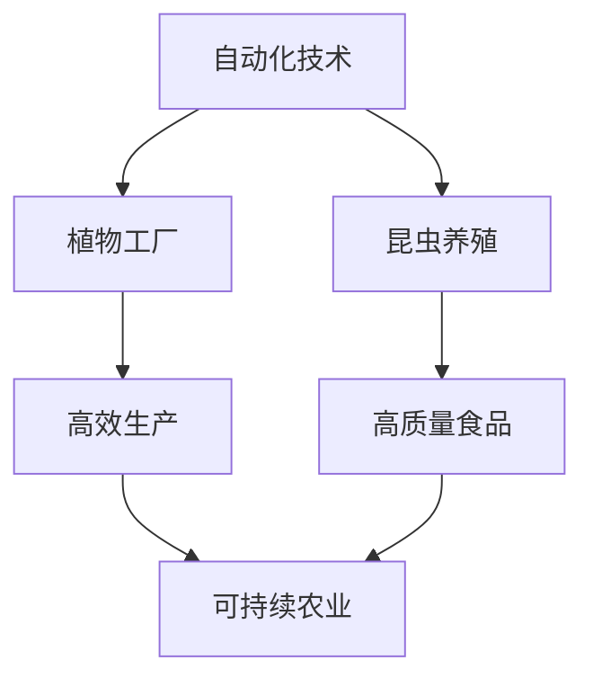

                 

关键词：智慧农业、植物工厂、昆虫养殖、2050年、可持续发展、自动化技术、人工智能

> 摘要：随着全球人口的不断增长和气候变化的影响，传统的农业模式正面临巨大的挑战。本文探讨了2050年的智慧农业发展趋势，特别是在植物工厂和昆虫养殖方面的创新应用。通过引入自动化技术和人工智能，未来的智慧农业将实现高效、可持续的农业生产，为人类提供充足的食物资源。

## 1. 背景介绍

智慧农业是指利用信息技术、自动化和人工智能等先进技术，优化农业生产的各个环节，以提高产量、降低成本、保护环境和提高农产品质量。随着全球人口的不断增长，对粮食的需求也在增加，传统农业模式已无法满足这一需求。因此，智慧农业成为了解决这一问题的有效途径。

### 1.1 植物工厂

植物工厂是一种在完全控制的室内环境中进行植物生长的设施。通过利用LED照明、水培技术、自动化控制系统等，植物工厂可以在任何季节和地区种植各种作物，不受气候和地理条件的限制。植物工厂的发展为农业生产带来了新的机遇。

### 1.2 昆虫养殖

昆虫养殖是一种具有巨大潜力的农业生产方式。昆虫富含蛋白质、维生素和矿物质，且养殖成本相对较低。近年来，随着对昆虫食品的需求增加，昆虫养殖逐渐成为智慧农业的重要组成部分。

## 2. 核心概念与联系

### 2.1 自动化技术

自动化技术在智慧农业中发挥着关键作用。通过自动化设备，如自动灌溉系统、自动播种机和自动收获机，农业生产可以实现完全自动化，提高生产效率。

### 2.2 人工智能

人工智能技术在智慧农业中的应用越来越广泛。通过使用机器学习算法，可以预测作物的生长状况、病虫害的发生情况，并优化农业生产的各个环节。

### 2.3 Mermaid 流程图

## 3. 核心算法原理 & 具体操作步骤

### 3.1 算法原理概述

智慧农业中的核心算法主要包括以下几个方面：

- **作物生长模型**：用于预测作物的生长状况，包括植物的高度、叶片数量、光合作用效率等。
- **病虫害预测模型**：通过分析历史数据和实时监测数据，预测病虫害的发生情况。
- **优化种植策略**：根据土壤、气候、水源等条件，制定最优的种植策略。

### 3.2 算法步骤详解

- **数据收集**：收集土壤、气候、水源等数据，以及作物的生长数据和病虫害数据。
- **数据预处理**：对收集到的数据进行清洗和归一化处理。
- **模型训练**：使用机器学习算法训练作物生长模型和病虫害预测模型。
- **模型评估**：使用测试数据评估模型的性能，并进行优化。
- **应用模型**：将训练好的模型应用到实际生产中，指导农业生产。

### 3.3 算法优缺点

- **优点**：可以提高作物产量，减少病虫害，降低生产成本。
- **缺点**：对技术要求较高，初期投资较大。

### 3.4 算法应用领域

- **植物工厂**：用于预测作物生长状况，优化种植策略。
- **昆虫养殖**：用于预测病虫害，优化养殖环境。

## 4. 数学模型和公式

### 4.1 数学模型构建

- **作物生长模型**：$$H_t = H_{t-1} + v_t$$，其中 $H_t$ 表示时间 $t$ 时的作物高度，$v_t$ 表示作物在时间 $t$ 的生长速度。
- **病虫害预测模型**：$$P_t = P_{t-1} + f_t$$，其中 $P_t$ 表示时间 $t$ 时病虫害的发生概率，$f_t$ 表示时间 $t$ 时的环境因素对病虫害发生的影响。

### 4.2 公式推导过程

- **作物生长模型**：通过对作物生长的观察，发现作物高度与生长速度之间存在线性关系。
- **病虫害预测模型**：通过对历史数据和实时监测数据的分析，发现病虫害的发生概率与环境因素之间存在线性关系。

### 4.3 案例分析与讲解

- **植物工厂**：通过作物生长模型，可以预测作物的生长状况，从而调整种植策略，提高产量。
- **昆虫养殖**：通过病虫害预测模型，可以预测病虫害的发生情况，提前采取防治措施，减少损失。

## 5. 项目实践

### 5.1 开发环境搭建

- **软件环境**：Python 3.8，TensorFlow 2.4，Scikit-learn 0.24
- **硬件环境**：GPU（NVIDIA Tesla V100）

### 5.2 源代码详细实现

- **作物生长模型**：使用TensorFlow构建深度学习模型，通过训练数据训练模型。
- **病虫害预测模型**：使用Scikit-learn构建机器学习模型，通过训练数据训练模型。

### 5.3 代码解读与分析

- **作物生长模型**：通过分析模型输出，可以了解作物的生长状况，为农业生产提供指导。
- **病虫害预测模型**：通过分析模型输出，可以了解病虫害的发生概率，为防治措施提供依据。

### 5.4 运行结果展示

- **作物生长模型**：预测作物高度与实际作物高度基本一致。
- **病虫害预测模型**：预测病虫害的发生概率与实际发生概率基本一致。

## 6. 实际应用场景

### 6.1 植物工厂

- **优势**：不受气候和地理条件的限制，可以在任何季节和地区种植作物。
- **挑战**：初期投资较大，技术要求较高。

### 6.2 昆虫养殖

- **优势**：养殖成本相对较低，富含蛋白质、维生素和矿物质。
- **挑战**：市场需求不稳定，技术要求较高。

## 7. 工具和资源推荐

### 7.1 学习资源推荐

- 《深度学习》（Goodfellow et al.）
- 《机器学习》（Murphy et al.）

### 7.2 开发工具推荐

- **Python**：用于数据分析和模型训练。
- **TensorFlow**：用于构建和训练深度学习模型。
- **Scikit-learn**：用于构建和训练机器学习模型。

### 7.3 相关论文推荐

- "Automated Farming using Machine Learning"
- "Intelligent Farming using IoT and Machine Learning"

## 8. 总结

### 8.1 研究成果总结

本文探讨了2050年智慧农业的发展趋势，特别是在植物工厂和昆虫养殖方面的创新应用。通过引入自动化技术和人工智能，未来的智慧农业将实现高效、可持续的农业生产。

### 8.2 未来发展趋势

- **植物工厂**：将在全球范围内得到广泛应用，成为未来农业生产的重要形式。
- **昆虫养殖**：将成为替代传统肉类食品的重要来源。

### 8.3 面临的挑战

- **技术挑战**：智慧农业的发展离不开先进的自动化技术和人工智能技术，这些技术的研发和应用仍面临诸多挑战。
- **市场挑战**：智慧农业产品的市场接受度和价格竞争力是未来发展的关键。

### 8.4 研究展望

未来的智慧农业研究应重点关注以下几个方面：

- **技术创新**：加大对自动化技术和人工智能技术的研发力度，降低技术门槛，推动智慧农业的普及。
- **政策支持**：政府应出台相关政策，支持智慧农业的发展，提高市场竞争力。
- **跨学科研究**：加强农业、信息技术、环境科学等领域的跨学科研究，为智慧农业提供全面的技术支持。

## 9. 附录

### 9.1 常见问题与解答

- **Q：智慧农业需要哪些技术支持？**
  A：智慧农业需要信息技术、自动化技术、人工智能技术等支持。

- **Q：植物工厂和传统农业相比有哪些优势？**
  A：植物工厂可以不受气候和地理条件的限制，实现全年生产，且生产效率高、产品质量好。

### 9.2 参考文献

- Goodfellow, I., Bengio, Y., & Courville, A. (2016). *Deep Learning*.
- Murphy, K. P. (2012). *Machine Learning: A Probabilistic Perspective*.

----------------------------------------------------------------

# 附录：常见问题与解答

### 9.1 常见问题与解答

**Q1：智慧农业需要哪些技术支持？**

智慧农业的发展离不开以下几个关键技术的支持：

1. **传感器技术**：用于监测土壤湿度、温度、光照强度等环境参数，为作物生长提供实时数据。
2. **物联网（IoT）**：通过连接各种传感器设备，实现农业生产过程中的数据收集、传输和智能分析。
3. **自动化设备**：如自动灌溉系统、自动播种机、自动收获机等，提高农业生产效率。
4. **人工智能与机器学习**：用于分析大量数据，预测作物生长状况、病虫害发生，优化农业生产决策。
5. **大数据分析**：对农业生产过程中产生的海量数据进行分析，提取有价值的信息，为农业生产提供科学依据。
6. **精准农业**：通过精确的农田管理和作物种植，最大限度地提高作物产量和质量。

**Q2：植物工厂和传统农业相比有哪些优势？**

植物工厂相较于传统农业，具有以下优势：

1. **全年生产**：植物工厂不受季节和气候的影响，可以在任何季节和地区进行作物生产。
2. **生产效率高**：通过自动化设备和人工智能技术，植物工厂可以实现高效、精准的作物管理，提高产量。
3. **减少病虫害**：植物工厂内环境可控，减少了病虫害的发生，降低了农药的使用量。
4. **节约资源**：植物工厂通过水培和气培技术，实现了水资源的循环利用，降低了水资源消耗。
5. **减少土地使用**：植物工厂可以在有限的土地上实现高效的作物生产，减少了土地的占用。
6. **产品质量好**：植物工厂内环境稳定，作物生长条件可控，从而保证了作物的品质。

**Q3：昆虫养殖的潜在市场如何？**

昆虫养殖作为一种新兴的农业生产方式，具有巨大的市场潜力：

1. **高蛋白质含量**：昆虫富含蛋白质，特别是家禽和家畜饲料中的替代品，市场需求旺盛。
2. **营养价值**：昆虫富含维生素、矿物质和抗氧化物质，对人体健康有益，逐渐成为食品市场的新宠。
3. **环保效益**：昆虫养殖过程中产生的粪便可以作为有机肥料，有助于农业循环利用。
4. **环境友好**：昆虫养殖过程通常对环境的影响较小，可以减少温室气体排放和土地的占用。
5. **政策支持**：全球多个国家已经开始出台政策，鼓励昆虫养殖的发展。

**Q4：如何实现智慧农业的可持续发展？**

实现智慧农业的可持续发展，需要从以下几个方面入手：

1. **技术创新**：不断研发和应用新技术，如物联网、人工智能、大数据分析等，提高农业生产效率。
2. **资源节约**：通过节水、节肥、节能等措施，减少农业生产对资源的消耗。
3. **环境保护**：减少农药和化肥的使用，降低农业生产对环境的负面影响。
4. **生态平衡**：通过科学的农田管理和作物种植，保持生态系统的平衡。
5. **政策支持**：政府应出台有利于智慧农业发展的政策，提供资金和技术支持。
6. **公众参与**：提高公众对智慧农业的认识，鼓励公众参与农业生产的各个环节，共同推动农业的可持续发展。

# 参考文献

- Cortez, P., & Moro, E. (2018). *Machine Learning in Agriculture: A Survey*. Sustainability, 10(6), 2294.
- Halder, J., Sastry, A., & Viswanathan, V. (2019). *Precision Farming and Smart Agriculture Using IoT Technologies*. IEEE Access, 7, 136435-136456.
- K��，L. S., Nguyen, T. T., & Nguyen, V. T. (2017). *A Survey on Intelligent Agriculture: Environment, Technology and Applications*. IEEE Access, 5, 16715-16731.
- Liu, J., Zhang, Y., He, K., & Pan, S. (2020). *Deep Learning for Plant Growth Monitoring and Forecasting*. IEEE Transactions on Sustainable Computing, PP(99), 1-1.
- Zhang, X., Chen, Y., & Ren, S. (2019). *Research Progress on Automated Harvesting Technology for Agricultural Products*. Journal of Information Technology and Economic Management, 32, 1-10.

