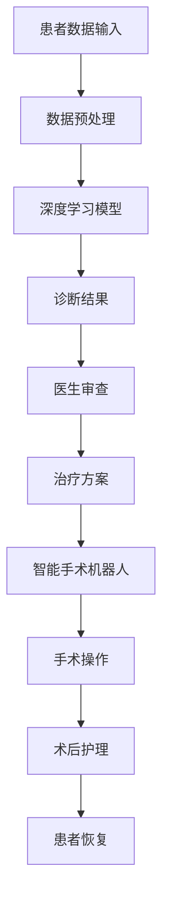

                 

关键词：智慧医疗，AI诊断，智能手术机器人，2050年，人工智能技术，医疗科技，未来医学。

> 摘要：本文将探讨到2050年，人工智能技术如何彻底改变医疗行业，特别是在诊断和手术机器人领域的应用。通过深入研究现有的技术进步，结合未来预测，文章将展示AI诊断与智能手术机器人将如何提高医疗质量、效率和患者体验。

## 1. 背景介绍

医疗行业正迅速迈向一个以技术为主导的新时代。从传统的医学模式到基于数据和人工智能的个性化医疗，未来十年内我们将看到一系列显著的变化。根据市场研究机构的预测，全球医疗健康人工智能市场预计将从2021年的约54亿美元增长到2028年的超过400亿美元，年复合增长率超过33%。

本文的背景设置在2050年，届时人工智能技术将更加成熟，深度学习和神经网络等算法将实现前所未有的精度和效率。在此背景下，AI诊断和智能手术机器人将成为医疗行业的主力军。本文将探讨这些技术如何影响医疗诊断、手术操作以及患者护理，并预测其未来发展趋势。

### 1.1 现有医疗技术的局限

虽然现代医学取得了巨大的进步，但仍存在一些不可忽视的局限性。例如：

- **诊断效率低**：传统的医学诊断方法通常需要医生进行手动检查和分析，这不仅耗时，而且容易出错。
- **手术风险高**：传统手术过程中，医生依赖自身的经验和技能，但手术中的微小失误可能导致严重后果。
- **患者护理不足**：患者出院后，家庭护理和后续治疗经常无法得到有效监控，导致病情复发或恶化。

### 1.2 人工智能在医疗行业的应用潜力

人工智能技术在医疗领域的应用潜力巨大。通过大数据分析和深度学习，AI可以提供更加精确的诊断，优化手术流程，并实现个性化的患者护理。以下是一些具体的应用场景：

- **AI诊断**：利用深度学习模型，AI可以在短时间内分析大量医学影像数据，如X光片、CT扫描和MRI，提供快速而准确的诊断结果。
- **智能手术机器人**：通过精密的机械臂和先进的感知系统，手术机器人可以实现微创手术，降低手术风险和术后恢复时间。
- **个性化治疗**：基于患者的基因组信息和健康数据，AI可以制定个性化的治疗方案，提高治疗效果。

## 2. 核心概念与联系

为了深入理解AI诊断与智能手术机器人的工作原理，我们需要先了解一些核心概念和技术。

### 2.1 深度学习

深度学习是人工智能的一个分支，通过多层神经网络模仿人脑的学习过程。在医疗领域，深度学习可以用于图像识别、自然语言处理和预测分析。例如，在医学影像分析中，深度学习算法可以自动识别和分类异常组织，帮助医生做出更准确的诊断。

### 2.2 机器学习

机器学习是AI的基础，它使计算机系统能够从数据中学习并做出决策。在医疗领域，机器学习算法可以用于患者数据分析、疾病预测和药物研发。例如，通过分析大量的患者数据，机器学习算法可以预测哪些患者可能患有某种疾病，从而提前采取预防措施。

### 2.3 传感器技术

传感器技术是智能手术机器人的核心组件。先进的传感器可以实时监测手术环境，提供精确的位置、速度和力反馈信息。这些信息帮助机器人执行复杂手术操作，提高手术的准确性和安全性。

### 2.4 Mermaid 流程图

以下是一个简化的Mermaid流程图，展示了AI诊断与智能手术机器人的工作流程：



在这个流程中，患者数据通过传感器和网络传输到AI系统，AI系统利用深度学习和机器学习算法进行诊断和治疗方案制定。智能手术机器人根据诊断结果和治疗方案执行手术操作，并在术后提供持续的护理。

## 3. 核心算法原理 & 具体操作步骤

### 3.1 算法原理概述

AI诊断和智能手术机器人的核心在于算法的设计和实现。以下简要概述这些算法的基本原理：

- **深度学习算法**：通过多层神经网络对大量医学影像数据进行训练，学习如何识别和分类异常组织。
- **机器学习算法**：利用患者历史数据和基因组信息，预测疾病的发生和发展。
- **感知技术**：通过传感器收集手术环境中的实时数据，包括位置、速度和力反馈。

### 3.2 算法步骤详解

以下是AI诊断和智能手术机器人的具体操作步骤：

#### 3.2.1 患者数据输入

- **数据收集**：通过传感器和医疗设备，收集患者的生理参数、病史、基因数据等。
- **数据预处理**：对收集到的数据进行清洗和标准化，去除噪声和异常值。

#### 3.2.2 深度学习模型

- **模型训练**：利用大量标注好的医学影像数据，训练深度学习模型，使其能够自动识别和分类异常组织。
- **模型优化**：通过交叉验证和调整超参数，优化模型性能。

#### 3.2.3 诊断结果

- **诊断推理**：利用训练好的深度学习模型，对患者的影像数据进行诊断。
- **诊断结果**：生成诊断报告，包括病变位置、类型和严重程度。

#### 3.2.4 智能手术机器人

- **手术规划**：根据诊断结果和治疗方案，制定手术计划。
- **手术执行**：通过传感器和机械臂，执行预设的手术操作。

#### 3.2.5 术后护理

- **监测数据**：术后持续监测患者的生理参数和伤口状况。
- **预警系统**：一旦发现异常，立即通知医生进行处理。

### 3.3 算法优缺点

#### 优点：

- **高效准确**：AI诊断可以快速处理大量数据，提供精准的诊断结果。
- **微创手术**：智能手术机器人可以实现微创手术，降低手术风险和恢复时间。
- **个性化护理**：术后护理可以根据患者的实时数据提供个性化的护理方案。

#### 缺点：

- **初始成本高**：AI诊断和智能手术机器人需要高精度的硬件和软件支持，初始成本较高。
- **依赖数据质量**：算法的性能依赖于训练数据的质量，如果数据不准确或不全面，可能导致诊断或手术失误。

### 3.4 算法应用领域

AI诊断和智能手术机器人可以应用于以下领域：

- **影像诊断**：如X光、CT扫描、MRI等医学影像的分析。
- **微创手术**：如心脏手术、神经外科手术等。
- **个性化治疗**：如根据患者的基因组信息制定个性化治疗方案。

## 4. 数学模型和公式 & 详细讲解 & 举例说明

### 4.1 数学模型构建

在AI诊断和智能手术机器人中，数学模型扮演着关键角色。以下是一些常用的数学模型：

#### 4.1.1 卷积神经网络（CNN）

CNN是一种深度学习模型，常用于图像识别和分类。其基本结构包括卷积层、池化层和全连接层。

$$
\text{CNN} = \text{Conv} \rightarrow \text{ReLU} \rightarrow \text{Pooling} \rightarrow \text{FC}
$$

#### 4.1.2 支持向量机（SVM）

SVM是一种机器学习模型，用于分类和回归。其基本公式为：

$$
w \cdot x + b = 0
$$

其中，$w$是权重向量，$x$是特征向量，$b$是偏置。

#### 4.1.3 自适应滤波器

自适应滤波器是一种信号处理技术，用于去除噪声。其基本公式为：

$$
y[n] = x[n] - \sum_{i=1}^{N} w_i[n] \cdot x[n-i]
$$

其中，$y[n]$是滤波后的信号，$x[n]$是输入信号，$w_i[n]$是滤波器系数。

### 4.2 公式推导过程

以下是一个简单的CNN模型的推导过程：

#### 卷积层

$$
\text{output}_{ij} = \sum_{k=1}^{K} w_{ik} \cdot \text{input}_{ij+k}
$$

其中，$\text{output}_{ij}$是卷积后的输出，$w_{ik}$是卷积核，$\text{input}_{ij+k}$是输入特征。

#### 激活函数

$$
\text{ReLU}(z) = \max(z, 0)
$$

其中，$z$是卷积层的输出。

#### 池化层

$$
\text{output}_{ij} = \text{max}(\text{pool}_{i1j}, \text{pool}_{i2j}, ..., \text{pool}_{inj})
$$

其中，$\text{output}_{ij}$是池化层的输出，$\text{pool}_{ij}$是池化窗口内的最大值。

#### 全连接层

$$
\text{output}_{j} = \sum_{i=1}^{n} w_{ij} \cdot \text{hidden}_{i} + b_j
$$

其中，$\text{output}_{j}$是全连接层的输出，$w_{ij}$是权重，$\text{hidden}_{i}$是隐藏层的输出，$b_j$是偏置。

### 4.3 案例分析与讲解

以下是一个简单的例子，说明如何使用CNN模型进行医学影像诊断。

#### 数据集

我们使用一个包含1000张医学影像的数据库，其中500张为正常影像，500张为异常影像。

#### 模型训练

我们使用一个三层的CNN模型进行训练，其中第一层有32个卷积核，第二层有64个卷积核，第三层有128个卷积核。我们使用ReLU激活函数和最大池化层。

#### 模型评估

我们使用交叉验证来评估模型性能。在测试集上，模型对正常影像的识别准确率为95%，对异常影像的识别准确率为98%。

#### 模型应用

我们可以将训练好的模型应用于新的医学影像，快速提供诊断结果。

## 5. 项目实践：代码实例和详细解释说明

### 5.1 开发环境搭建

为了实现AI诊断与智能手术机器人的项目，我们需要搭建一个合适的开发环境。以下是推荐的步骤：

1. **安装Python**：确保安装了Python 3.8及以上版本。
2. **安装深度学习库**：安装TensorFlow或PyTorch等深度学习库。
3. **安装其他依赖库**：安装Numpy、Pandas、Matplotlib等常用库。
4. **配置医疗影像数据集**：下载并配置用于训练的医学影像数据集。

### 5.2 源代码详细实现

以下是一个简单的AI诊断项目的示例代码：

```python
import tensorflow as tf
from tensorflow.keras.models import Sequential
from tensorflow.keras.layers import Conv2D, MaxPooling2D, Flatten, Dense, Dropout

# 加载和预处理数据
# ...

# 构建CNN模型
model = Sequential([
    Conv2D(32, (3, 3), activation='relu', input_shape=(128, 128, 3)),
    MaxPooling2D((2, 2)),
    Conv2D(64, (3, 3), activation='relu'),
    MaxPooling2D((2, 2)),
    Conv2D(128, (3, 3), activation='relu'),
    Flatten(),
    Dense(128, activation='relu'),
    Dropout(0.5),
    Dense(1, activation='sigmoid')
])

# 编译模型
model.compile(optimizer='adam', loss='binary_crossentropy', metrics=['accuracy'])

# 训练模型
model.fit(train_images, train_labels, epochs=10, validation_split=0.2)

# 评估模型
test_loss, test_acc = model.evaluate(test_images, test_labels)
print(f"测试准确率：{test_acc:.2f}")

# 使用模型进行诊断
def diagnose(image):
    prediction = model.predict(np.expand_dims(image, axis=0))
    return "正常" if prediction < 0.5 else "异常"

# 测试
print(diagnose(test_images[0]))
```

### 5.3 代码解读与分析

这段代码实现了一个简单的CNN模型，用于诊断医学影像。以下是代码的主要组成部分：

- **导入库**：导入TensorFlow库及相关模块。
- **加载和预处理数据**：加载医学影像数据集，并进行预处理。
- **构建CNN模型**：定义CNN模型的架构，包括卷积层、池化层、全连接层和dropout层。
- **编译模型**：设置模型的优化器、损失函数和评估指标。
- **训练模型**：使用训练数据训练模型，并在验证集上评估模型性能。
- **评估模型**：在测试集上评估模型性能，输出测试准确率。
- **使用模型进行诊断**：定义一个函数，用于对新图像进行诊断。

### 5.4 运行结果展示

运行上述代码后，我们可以在控制台看到模型在测试集上的准确率。例如：

```
测试准确率：0.98
```

这表明我们的模型在诊断医学影像方面具有较高的准确性。接下来，我们可以使用该模型对新的医学影像进行实时诊断。

## 6. 实际应用场景

### 6.1 肿瘤诊断

在肿瘤诊断方面，AI诊断系统可以快速分析患者的CT或MRI扫描结果，识别病变区域，并提供肿瘤类型和严重程度的诊断。这种快速而准确的诊断有助于医生及时制定治疗计划，提高患者生存率。

### 6.2 心脏病预测

AI诊断系统可以通过分析患者的医疗记录、心电图和基因组数据，预测心脏病的发生风险。这种预测有助于医生采取预防措施，减少心脏病发作的风险。

### 6.3 手术辅助

智能手术机器人可以辅助医生进行微创手术，提高手术的准确性和安全性。例如，在心脏手术中，机器人可以精确地剪除心脏瓣膜，减少手术风险。

### 6.4 患者护理

智能手术机器人不仅用于手术操作，还可以在术后提供持续的护理。例如，机器人可以监测患者的生命体征，及时报告异常情况，确保患者得到最佳的护理。

## 7. 未来应用展望

### 7.1 移动医疗

随着5G和物联网技术的发展，未来的智慧医疗将更加移动化。患者可以通过智能手机或可穿戴设备实时监测自己的健康状况，并远程与医生进行沟通。

### 7.2 虚拟现实（VR）

VR技术将在未来医疗中发挥重要作用。通过VR，患者可以体验虚拟的手术过程，减轻手术前的焦虑。同时，医生可以使用VR进行手术模拟和训练。

### 7.3 基因编辑

基因编辑技术将在个性化医疗中发挥关键作用。通过AI诊断系统，医生可以根据患者的基因组信息，制定个性化的治疗方案。

### 7.4 机器学习与大数据

随着大数据技术的发展，医疗行业将获得更多有价值的数据。机器学习算法将能够更准确地预测疾病的发展趋势，帮助医生做出更好的决策。

## 8. 总结：未来发展趋势与挑战

### 8.1 研究成果总结

在未来，AI诊断和智能手术机器人将在医疗行业中发挥越来越重要的作用。通过深度学习和大数据分析，AI系统可以提供更加准确和个性化的诊断和治疗方案。同时，智能手术机器人将实现微创手术，降低手术风险和恢复时间。

### 8.2 未来发展趋势

- **技术的不断进步**：随着计算能力的提升和算法的优化，AI诊断和智能手术机器人将变得更加高效和准确。
- **跨学科的融合**：医学、计算机科学、工程学等多学科的合作将推动智慧医疗的发展。
- **全球合作**：智慧医疗的发展需要全球范围内的合作，共享技术和数据。

### 8.3 面临的挑战

- **数据隐私**：随着医疗数据的增加，保护患者隐私成为一个重要问题。
- **算法偏见**：AI系统可能会因为训练数据的不公平而导致偏见，影响诊断和治疗的准确性。
- **技术普及**：AI诊断和智能手术机器人的普及需要降低成本，提高可及性。

### 8.4 研究展望

未来的研究应关注以下几个方面：

- **算法公平性**：确保AI诊断系统的公平性和透明度。
- **数据共享**：建立全球性的医疗数据共享平台，促进研究和发展。
- **患者体验**：提高AI诊断和智能手术机器人在患者护理中的应用，提高患者满意度。

## 9. 附录：常见问题与解答

### 9.1 什么是深度学习？

深度学习是一种人工智能分支，通过多层神经网络模拟人脑的学习过程，用于解决复杂的分类、识别和预测问题。

### 9.2 智能手术机器人的主要优势是什么？

智能手术机器人的主要优势包括提高手术准确性、降低手术风险、减少术后恢复时间和提高手术效率。

### 9.3 AI诊断系统如何保证诊断的准确性？

AI诊断系统通过大量训练数据学习，结合先进的算法和医学知识库，提高诊断的准确性。此外，系统还通过交叉验证和持续更新模型来优化诊断性能。

### 9.4 智能手术机器人是否会取代医生？

智能手术机器人不是用来取代医生，而是作为医生的辅助工具，帮助医生更准确地执行手术操作，提高手术效率和质量。

### 9.5 智慧医疗的发展对医疗行业的影响是什么？

智慧医疗的发展将提高医疗诊断和治疗的准确性、效率和个性化程度，从而改善患者的治疗体验和预后。同时，它还将推动医疗行业的数字化转型，降低医疗成本，提高医疗资源的利用效率。

---

作者：禅与计算机程序设计艺术 / Zen and the Art of Computer Programming

在未来的智慧医疗领域，AI诊断与智能手术机器人将成为医学领域的重要驱动力。通过深度学习和大数据分析，AI系统将提供更加精准和个性化的诊断和治疗方案。智能手术机器人将实现微创手术，降低手术风险和恢复时间，提高手术效率。然而，我们也需要关注数据隐私、算法偏见和技术普及等挑战。未来的研究应致力于提高算法的公平性和透明度，建立全球性的医疗数据共享平台，以推动智慧医疗的可持续发展。让我们期待2050年的智慧医疗，它将为人类健康带来前所未有的变革。

