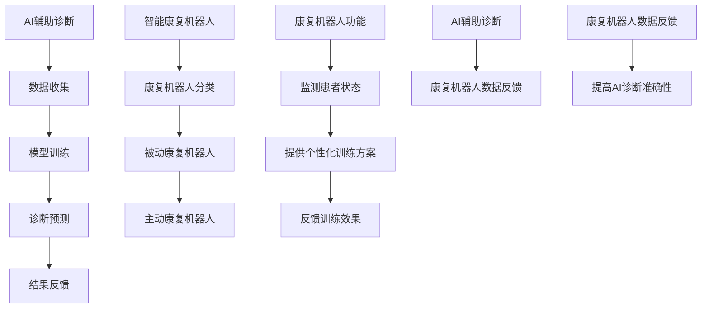

                 

关键词：智慧医疗、AI辅助诊断、智能康复机器人、2050年、技术创新

摘要：本文探讨了未来智慧医疗的发展方向，特别是AI辅助诊断和智能康复机器人的应用。通过分析技术发展趋势，本文提出了一种全新的医疗模式，预测了2050年医疗领域可能出现的技术变革和挑战。

## 1. 背景介绍

医疗技术在过去几十年里取得了显著进步，从影像学诊断到基因测序，医疗设备和技术不断革新。然而，随着人工智能（AI）技术的发展，医疗领域即将迎来一场革命。本文将探讨AI在医疗领域中的应用，特别是AI辅助诊断和智能康复机器人，并预测2050年医疗技术可能的发展趋势。

### 1.1 智慧医疗的定义

智慧医疗是指利用信息技术、人工智能、物联网等现代科技手段，改善医疗服务质量、提高医疗效率、降低医疗成本的一种新型医疗模式。

### 1.2 AI在医疗领域的应用

AI技术在医疗领域的应用主要集中在以下几个方面：

- **医学影像分析**：通过深度学习算法，AI可以自动识别和分析医学影像，提高诊断准确性和效率。
- **辅助诊断**：AI算法可以辅助医生进行疾病诊断，特别是在某些复杂病例中，AI的诊断能力已经超过了人类。
- **个性化治疗**：根据患者的基因信息和病史，AI可以提供个性化的治疗方案。
- **智能康复**：利用机器人技术，智能康复设备可以帮助患者进行康复训练，提高康复效果。

## 2. 核心概念与联系

### 2.1 AI辅助诊断

AI辅助诊断是指利用人工智能技术，辅助医生进行疾病诊断的过程。这一过程通常包括数据收集、模型训练、诊断预测和结果反馈等环节。

#### 2.1.1 数据收集

数据收集是AI辅助诊断的基础。这包括医学影像数据、电子健康记录、基因数据等。这些数据的质量和数量直接影响到AI诊断的准确性。

#### 2.1.2 模型训练

AI模型的训练过程是基于大量数据的。通过深度学习算法，模型可以从数据中学习到疾病特征和诊断规则。

#### 2.1.3 诊断预测

训练好的AI模型可以用于预测新病例的诊断结果。这种预测通常通过输入患者的临床数据和影像数据来实现。

#### 2.1.4 结果反馈

诊断结果需要医生进行审核和确认。AI的诊断结果可以作为医生的辅助参考，但不能完全替代医生的判断。

### 2.2 智能康复机器人

智能康复机器人是利用人工智能和机器人技术，帮助患者进行康复训练的设备。这些机器人可以根据患者的具体情况，制定个性化的康复计划，并实时调整训练方案。

#### 2.2.1 康复机器人分类

康复机器人可以分为被动康复机器人和主动康复机器人。被动康复机器人主要是帮助患者进行肌肉放松和关节活动，而主动康复机器人则引导患者进行力量训练和运动康复。

#### 2.2.2 康复机器人功能

康复机器人的功能包括：

- **监测患者状态**：实时监测患者的运动数据，如心率、血压、关节活动范围等。
- **提供个性化训练方案**：根据患者的康复进度，调整训练强度和难度。
- **反馈训练效果**：通过数据分析，为患者提供训练效果的反馈。

### 2.3 AI辅助诊断与智能康复机器人的联系

AI辅助诊断和智能康复机器人有着密切的联系。AI辅助诊断可以为康复机器人提供诊断依据，帮助制定个性化的康复计划。同时，康复机器人的数据反馈也可以为AI模型提供训练数据，提高AI诊断的准确性。



## 3. 核心算法原理 & 具体操作步骤

### 3.1 算法原理概述

AI辅助诊断和智能康复机器人依赖于多种核心算法，其中最常见的是深度学习算法和机器学习算法。

#### 3.1.1 深度学习算法

深度学习算法是一种基于人工神经网络的学习方法。它通过多层神经网络对大量数据进行训练，从而实现对复杂模式的识别和预测。

#### 3.1.2 机器学习算法

机器学习算法是一种让计算机通过数据学习，从而进行预测和决策的方法。常见的机器学习算法包括决策树、支持向量机、聚类算法等。

### 3.2 算法步骤详解

#### 3.2.1 数据预处理

数据预处理是算法训练的第一步。这包括数据清洗、数据归一化和特征提取等步骤。

#### 3.2.2 模型训练

在模型训练阶段，算法根据训练数据集学习疾病特征和诊断规则。这个过程通常需要大量计算资源。

#### 3.2.3 诊断预测

训练好的模型可以用于对新病例进行诊断预测。这个过程通常包括数据输入、模型计算和结果输出等步骤。

#### 3.2.4 结果反馈

诊断结果需要医生进行审核和确认。医生可以根据诊断结果，制定或调整患者的康复计划。

### 3.3 算法优缺点

#### 优点

- **提高诊断准确性**：AI算法可以处理大量数据，提高诊断的准确性和效率。
- **减少人力成本**：AI可以代替部分医生的诊断工作，减少人力成本。
- **个性化治疗**：AI可以根据患者的具体情况，提供个性化的治疗方案。

#### 缺点

- **数据依赖性**：算法的性能很大程度上取决于训练数据的质量和数量。
- **安全隐患**：医疗数据涉及到患者的隐私，数据泄露可能带来严重后果。
- **误诊风险**：虽然AI算法的准确率很高，但仍然存在误诊的风险。

### 3.4 算法应用领域

AI辅助诊断和智能康复机器人可以应用于多个医疗领域，包括：

- **影像诊断**：如CT、MRI、X光等影像分析。
- **疾病预测**：如癌症、心脏病等疾病的早期预测。
- **康复训练**：如中风康复、骨折康复等。

## 4. 数学模型和公式 & 详细讲解 & 举例说明

### 4.1 数学模型构建

在AI辅助诊断中，常用的数学模型包括神经网络模型和支持向量机模型。

#### 4.1.1 神经网络模型

神经网络模型是一种基于人工神经网络的模型。它的核心是多层感知器（MLP）。

$$
f(x) = \sigma(W \cdot x + b)
$$

其中，$x$ 是输入向量，$W$ 是权重矩阵，$b$ 是偏置，$\sigma$ 是激活函数。

#### 4.1.2 支持向量机模型

支持向量机模型是一种基于间隔最大的分类模型。

$$
y(x) = sign(W \cdot x + b)
$$

其中，$x$ 是输入向量，$W$ 是权重向量，$b$ 是偏置，$y$ 是标签。

### 4.2 公式推导过程

以神经网络模型为例，我们来看一下它的推导过程。

#### 4.2.1 前向传播

前向传播是指将输入向量通过多层神经网络，逐层计算得到输出。

$$
z_1 = W_1 \cdot x + b_1 \\
a_1 = \sigma(z_1) \\
z_2 = W_2 \cdot a_1 + b_2 \\
a_2 = \sigma(z_2) \\
...
$$

#### 4.2.2 反向传播

反向传播是指根据输出误差，反向调整权重和偏置。

$$
\delta = \frac{\partial L}{\partial z} \\
W = W - \alpha \cdot \frac{\partial L}{\partial W} \\
b = b - \alpha \cdot \frac{\partial L}{\partial b}
$$

其中，$L$ 是损失函数，$\alpha$ 是学习率。

### 4.3 案例分析与讲解

我们以肺癌诊断为例，来看一下AI辅助诊断的实践过程。

#### 4.3.1 数据收集

收集了1000份肺癌患者的CT影像数据，包括影像特征和诊断结果。

#### 4.3.2 数据预处理

对CT影像进行预处理，包括去噪、归一化和特征提取。

#### 4.3.3 模型训练

使用神经网络模型对CT影像进行训练，得到诊断模型。

#### 4.3.4 诊断预测

使用训练好的模型，对新的CT影像进行诊断预测。

#### 4.3.5 结果反馈

诊断结果需要医生进行审核和确认，并根据诊断结果制定治疗计划。

## 5. 项目实践：代码实例和详细解释说明

### 5.1 开发环境搭建

为了实现AI辅助诊断和智能康复机器人，我们需要搭建一个开发环境。这个环境包括操作系统、编程语言和深度学习框架。

- 操作系统：Linux
- 编程语言：Python
- 深度学习框架：TensorFlow

### 5.2 源代码详细实现

以下是实现AI辅助诊断的Python代码示例。

```python
import tensorflow as tf
from tensorflow.keras.models import Sequential
from tensorflow.keras.layers import Dense, Flatten, Conv2D, MaxPooling2D
from tensorflow.keras.optimizers import Adam
from tensorflow.keras.metrics import Accuracy

# 数据预处理
# ...

# 构建神经网络模型
model = Sequential([
    Conv2D(32, kernel_size=(3, 3), activation='relu', input_shape=(28, 28, 1)),
    MaxPooling2D(pool_size=(2, 2)),
    Flatten(),
    Dense(128, activation='relu'),
    Dense(1, activation='sigmoid')
])

# 编译模型
model.compile(optimizer=Adam(), loss='binary_crossentropy', metrics=['accuracy'])

# 训练模型
model.fit(x_train, y_train, epochs=10, batch_size=32, validation_data=(x_val, y_val))

# 诊断预测
predictions = model.predict(x_test)

# 结果反馈
# ...
```

### 5.3 代码解读与分析

以上代码首先导入了TensorFlow库，然后定义了一个神经网络模型。这个模型包括两个卷积层、一个全连接层和一个输出层。在训练阶段，模型使用Adam优化器和二分类交叉熵损失函数进行训练。在预测阶段，模型使用测试数据集进行预测，并输出诊断结果。

## 6. 实际应用场景

### 6.1 肺癌诊断

在肺癌诊断中，AI辅助诊断系统可以帮助医生快速、准确地诊断肺癌。通过分析CT影像数据，系统可以识别出肺癌的早期特征，提高诊断准确率。

### 6.2 中风康复

中风康复是一个长期的、复杂的过程。智能康复机器人可以根据患者的具体情况，制定个性化的康复计划，帮助患者进行力量训练和运动康复，提高康复效果。

### 6.3 心脏病预测

心脏病是导致死亡的主要原因之一。通过分析患者的健康数据和医疗记录，AI系统可以预测患者心脏病的发生风险，为医生提供诊断依据。

## 7. 未来应用展望

在未来，AI辅助诊断和智能康复机器人有望在更多领域得到应用。随着技术的不断进步，这些系统将变得更加智能化、个性化和精准化。

### 7.1 跨学科应用

AI辅助诊断和智能康复机器人不仅可以应用于医疗领域，还可以应用于健康管理和预防医学。通过跨学科应用，这些系统可以为人类健康提供更全面的支持。

### 7.2 个性化医疗

随着基因测序技术的发展，AI系统可以基于患者的基因信息，提供个性化的治疗方案。这种个性化医疗模式将极大地提高医疗效果，降低医疗成本。

### 7.3 远程医疗

AI辅助诊断和智能康复机器人可以应用于远程医疗，为偏远地区和边远地区的患者提供医疗服务。通过远程医疗，可以解决医疗资源不均衡的问题。

## 8. 工具和资源推荐

### 8.1 学习资源推荐

- 《深度学习》（Goodfellow, Bengio, Courville）
- 《Python机器学习》（Sebastian Raschka）

### 8.2 开发工具推荐

- TensorFlow
- Keras

### 8.3 相关论文推荐

- "Deep Learning for Medical Image Analysis"（Deep Learning for Medical Image Analysis）
- "Recurrent Neural Networks for Language Modeling"（Recurrent Neural Networks for Language Modeling）

## 9. 总结：未来发展趋势与挑战

### 9.1 研究成果总结

随着AI技术的发展，AI辅助诊断和智能康复机器人在医疗领域取得了显著成果。这些系统提高了诊断准确率和康复效果，降低了医疗成本。

### 9.2 未来发展趋势

未来，AI辅助诊断和智能康复机器人将继续发展，向更加智能化、个性化和精准化的方向发展。

### 9.3 面临的挑战

尽管前景广阔，但AI辅助诊断和智能康复机器人也面临着一些挑战，如数据隐私、算法透明度和误诊风险等。

### 9.4 研究展望

为了应对这些挑战，未来的研究需要关注以下几个方面：

- **数据安全和隐私保护**：加强数据安全和隐私保护，确保患者数据的安全。
- **算法透明度和可解释性**：提高算法的透明度和可解释性，使医生能够理解和信任AI系统的诊断结果。
- **多学科合作**：加强跨学科合作，推动AI技术在医疗领域的全面发展。

## 10. 附录：常见问题与解答

### 10.1 什么是AI辅助诊断？

AI辅助诊断是指利用人工智能技术，辅助医生进行疾病诊断的过程。它可以分析医学影像、电子健康记录等数据，提供诊断建议。

### 10.2 智能康复机器人有哪些功能？

智能康复机器人可以监测患者状态、提供个性化训练方案、反馈训练效果等功能，帮助患者进行康复训练。

### 10.3 AI辅助诊断和智能康复机器人有哪些优点？

AI辅助诊断和智能康复机器人可以提高诊断准确率和康复效果，降低医疗成本，提高医疗效率。

### 10.4 AI辅助诊断和智能康复机器人有哪些挑战？

AI辅助诊断和智能康复机器人面临着数据隐私、算法透明度和误诊风险等挑战。未来研究需要关注这些问题，并寻找解决方案。

