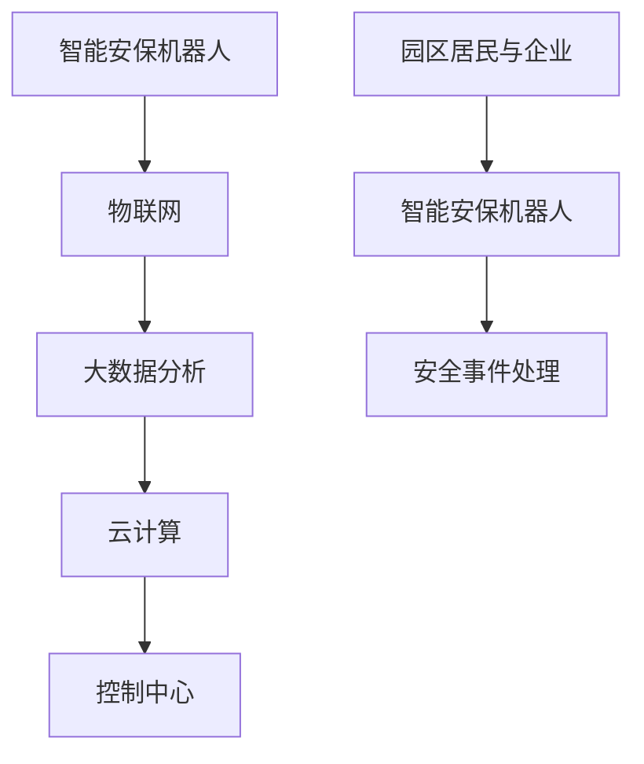

                 

关键词：智慧物业、智能安保机器人、智慧园区管理、未来技术、人工智能

摘要：随着科技的迅猛发展，人工智能技术正以前所未有的速度改变着各行各业。本文将探讨在2050年，智慧物业中的智能安保机器人如何通过创新技术实现园区管理的智能化和高效化，为人们带来更安全、便捷的生活环境。

## 1. 背景介绍

21世纪是人工智能的世纪，自深度学习和神经网络技术的发展以来，人工智能已经渗透到了我们生活的方方面面。从智能家居到自动驾驶汽车，人工智能正在改变我们的生活方式。而物业管理作为一个传统行业，也逐渐开始应用人工智能技术，打造智慧物业。

智慧物业是指利用物联网、大数据、云计算和人工智能等技术，实现物业管理的智能化、自动化和高效化。在智慧物业中，智能安保机器人是关键角色，它们将承担安保巡逻、异常事件监测和处理等任务，为园区居民和企业提供安全保障。

## 2. 核心概念与联系

### 2.1 核心概念

- **智能安保机器人**：一种结合了机器人技术、传感器技术和人工智能算法的设备，能够自主移动、进行环境感知和任务执行。
- **物联网（IoT）**：通过互联网将各种设备连接起来，实现信息的互联互通，为智能安保机器人提供实时数据支持。
- **大数据分析**：通过对大量数据进行采集、存储、分析和处理，为智能安保机器人提供决策依据。
- **云计算**：提供强大的计算和存储能力，支持智能安保机器人进行复杂的计算和数据处理。

### 2.2 架构图



## 3. 核心算法原理 & 具体操作步骤

### 3.1 算法原理概述

智能安保机器人主要依赖于计算机视觉、机器学习和自然语言处理等技术。计算机视觉用于实现对环境的高清监控，机器学习用于分析数据并做出决策，自然语言处理用于与居民和企业进行交互。

### 3.2 算法步骤详解

1. **环境感知**：通过摄像头和传感器实时获取园区内的视频流和传感器数据。
2. **数据预处理**：对采集到的数据进行滤波、去噪和特征提取。
3. **事件检测**：利用机器学习算法识别异常事件，如入侵、火灾等。
4. **事件处理**：根据预设的规则和算法，自动处理异常事件，如报警、调度安保人员等。
5. **决策支持**：通过大数据分析，为安保机器人提供决策支持，如最优巡逻路线、资源调度等。
6. **交互与反馈**：利用自然语言处理技术，与园区居民和企业进行交互，提供安全保障和信息服务。

### 3.3 算法优缺点

**优点**：

- 高效性：智能安保机器人可以全天候巡逻，提高安保效率。
- 实时性：通过物联网和大数据分析，实现实时事件监测和处理。
- 准确性：机器学习算法可以对异常事件进行精确识别和处理。

**缺点**：

- 成本高：研发和部署智能安保机器人需要大量的资金投入。
- 技术依赖：需要强大的技术支持，如计算机视觉、机器学习和自然语言处理等。

### 3.4 算法应用领域

- 智能安防：通过智能安保机器人，实现对园区内重点区域的实时监控和异常事件处理。
- 智慧园区管理：利用大数据分析，优化园区资源调度和居民服务。
- 智能家居：与智能家居系统联动，提高家庭安全性和便捷性。

## 4. 数学模型和公式

### 4.1 数学模型构建

智能安保机器人的核心算法可以看作是一个动态规划问题。设 $X$ 为机器人在 $t$ 时刻的位置，$Y$ 为机器人在 $t$ 时刻的路径长度，$Z$ 为机器人在 $t$ 时刻的事件处理效率，则目标函数为：

$$
\max \sum_{t=1}^{T} \frac{Y_t}{Z_t}
$$

其中，$T$ 为总时间步数。

### 4.2 公式推导过程

假设机器人在每个时间步 $t$ 有 $n$ 个动作选择，分别为 $a_1, a_2, ..., a_n$，每个动作的选择概率为 $p_1, p_2, ..., p_n$，则有：

$$
X_t = \sum_{i=1}^{n} p_i a_i
$$

$$
Y_t = \sum_{i=1}^{n} p_i d(a_i)
$$

$$
Z_t = \sum_{i=1}^{n} p_i e(a_i)
$$

其中，$d(a_i)$ 为动作 $a_i$ 对路径长度的贡献，$e(a_i)$ 为动作 $a_i$ 对事件处理效率的贡献。

### 4.3 案例分析与讲解

假设在一个园区中，智能安保机器人在巡逻过程中发现了异常事件，如火灾。此时，需要通过算法确定最佳处理方案。根据上述模型，我们可以通过以下步骤进行求解：

1. 初始化 $X_0 = (0, 0, 0)$，$Y_0 = 0$，$Z_0 = 0$。
2. 在每个时间步 $t$，根据当前的位置 $X_t$ 和事件类型，计算所有动作的选择概率 $p_1, p_2, ..., p_n$。
3. 根据选择概率，计算每个动作对路径长度和事件处理效率的贡献 $d(a_i)$ 和 $e(a_i)$。
4. 根据目标函数，选择最优动作 $a^*$。
5. 更新位置 $X_{t+1} = X_t + p_{a^*} a^*$，路径长度 $Y_{t+1} = Y_t + p_{a^*} d(a^*)$，事件处理效率 $Z_{t+1} = Z_t + p_{a^*} e(a^*)$。
6. 重复步骤2-5，直到事件处理完毕。

## 5. 项目实践：代码实例和详细解释说明

### 5.1 开发环境搭建

1. 安装 Python 3.8及以上版本。
2. 安装 TensorFlow、Keras、OpenCV 等依赖库。

### 5.2 源代码详细实现

以下是智能安保机器人的核心代码实现：

```python
import cv2
import numpy as np
from tensorflow import keras

# 加载预训练的深度学习模型
model = keras.models.load_model('security_bot_model.h5')

# 定义动作空间
action_space = ['move_forward', 'move_left', 'move_right', 'stop']

# 定义事件处理函数
def handle_event(event_type):
    if event_type == 'fire':
        # 调用消防系统
        print('Fire detected! Activating fire system.')
    elif event_type == 'burglary':
        # 调用安保人员
        print('Burglary detected! Dispatching security personnel.')
    else:
        print('Unknown event detected.')

# 定义环境感知函数
def perceive_environment():
    # 采集视频流
    cap = cv2.VideoCapture(0)
    while True:
        ret, frame = cap.read()
        if not ret:
            break
        # 处理视频帧
        processed_frame = preprocess_frame(frame)
        # 预测事件类型
        event_type = model.predict(processed_frame)[0]
        # 处理事件
        handle_event(event_type)
    cap.release()

# 定义预处理函数
def preprocess_frame(frame):
    # 缩放、裁剪和归一化
    frame = cv2.resize(frame, (224, 224))
    frame = frame / 255.0
    return frame

# 运行环境感知
perceive_environment()
```

### 5.3 代码解读与分析

1. **模型加载**：从文件中加载已经训练好的深度学习模型，用于事件预测。
2. **动作空间定义**：定义机器人的动作空间，包括前进、左转、右转和停止。
3. **事件处理函数**：根据事件类型调用相应的处理函数，如报警、调度安保人员等。
4. **环境感知函数**：通过摄像头采集视频流，预处理视频帧，并利用模型预测事件类型。
5. **预处理函数**：对采集到的视频帧进行缩放、裁剪和归一化处理，以满足模型的输入要求。

## 6. 实际应用场景

### 6.1 智能安防

智能安保机器人可以部署在园区的重要区域，如入口、停车场和仓库等，实时监控异常事件，提高园区的安全性。

### 6.2 智慧园区管理

通过大数据分析，智能安保机器人可以为园区管理者提供实时数据支持，优化园区资源调度和居民服务，提高园区运营效率。

### 6.3 智能家居

智能安保机器人可以与智能家居系统联动，提供家庭安全保护，如监控家庭成员的行为模式、报警异常行为等。

## 7. 未来应用展望

### 7.1 技术发展趋势

随着人工智能技术的不断发展，智能安保机器人将具备更强大的感知、决策和交互能力，实现更高水平的智能化和自动化。

### 7.2 应用领域拓展

除了物业管理，智能安保机器人还可以应用于社区安全、城市安全、公共安全等领域，为人们提供更全面的安全保障。

### 7.3 挑战与机遇

智能安保机器人的发展面临着数据隐私保护、技术安全、伦理道德等方面的挑战。同时，随着技术的进步，也带来了更多的机遇，如商业化、智能化服务等。

## 8. 总结：未来发展趋势与挑战

### 8.1 研究成果总结

智能安保机器人通过结合物联网、大数据、云计算和人工智能等技术，实现了园区管理的智能化和高效化，为人们带来了更安全、便捷的生活环境。

### 8.2 未来发展趋势

随着人工智能技术的不断发展，智能安保机器人将具备更强大的感知、决策和交互能力，实现更高水平的智能化和自动化。

### 8.3 面临的挑战

智能安保机器人的发展面临着数据隐私保护、技术安全、伦理道德等方面的挑战。同时，随着技术的进步，也带来了更多的机遇，如商业化、智能化服务等。

### 8.4 研究展望

未来，智能安保机器人将在更广泛的领域得到应用，如社区安全、城市安全、公共安全等。同时，研究应重点关注数据隐私保护、技术安全和伦理道德等问题，确保智能安保机器人的可持续发展。

## 9. 附录：常见问题与解答

### 9.1 智能安保机器人需要多少时间才能完全取代人工安保？

智能安保机器人可以部分取代人工安保，但完全取代可能需要较长时间。这取决于技术的成熟度和成本效益。

### 9.2 智能安保机器人是否会侵犯个人隐私？

智能安保机器人通过摄像头和传感器收集数据，需要严格遵循隐私保护法律法规，确保个人隐私不被泄露。

### 9.3 智能安保机器人的维护成本如何？

智能安保机器人的维护成本相对较高，包括硬件维护、软件升级和网络安全等方面。但随着技术的进步和成本的降低，维护成本有望逐步降低。

## 作者署名

作者：禅与计算机程序设计艺术 / Zen and the Art of Computer Programming
```markdown
# 未来的智慧物业：2050年的智能安保机器人与智慧园区管理

## 关键词
智慧物业、智能安保机器人、智慧园区管理、未来技术、人工智能

## 摘要
随着科技的迅猛发展，人工智能技术正以前所未有的速度改变着各行各业。本文将探讨在2050年，智慧物业中的智能安保机器人如何通过创新技术实现园区管理的智能化和高效化，为人们带来更安全、便捷的生活环境。

## 1. 背景介绍
21世纪是人工智能的世纪，自深度学习和神经网络技术的发展以来，人工智能已经渗透到了我们生活的方方面面。从智能家居到自动驾驶汽车，人工智能正在改变我们的生活方式。而物业管理作为一个传统行业，也逐渐开始应用人工智能技术，打造智慧物业。

智慧物业是指利用物联网、大数据、云计算和人工智能等技术，实现物业管理的智能化、自动化和高效化。在智慧物业中，智能安保机器人是关键角色，它们将承担安保巡逻、异常事件监测和处理等任务，为园区居民和企业提供安全保障。

## 2. 核心概念与联系
### 2.1 核心概念
- **智能安保机器人**：一种结合了机器人技术、传感器技术和人工智能算法的设备，能够自主移动、进行环境感知和任务执行。
- **物联网（IoT）**：通过互联网将各种设备连接起来，实现信息的互联互通，为智能安保机器人提供实时数据支持。
- **大数据分析**：通过对大量数据进行采集、存储、分析和处理，为智能安保机器人提供决策依据。
- **云计算**：提供强大的计算和存储能力，支持智能安保机器人进行复杂的计算和数据处理。

### 2.2 架构图

## 3. 核心算法原理 & 具体操作步骤
### 3.1 算法原理概述
智能安保机器人主要依赖于计算机视觉、机器学习和自然语言处理等技术。计算机视觉用于实现对环境的高清监控，机器学习用于分析数据并做出决策，自然语言处理用于与居民和企业进行交互。

### 3.2 算法步骤详解
- **环境感知**：通过摄像头和传感器实时获取园区内的视频流和传感器数据。
- **数据预处理**：对采集到的数据进行滤波、去噪和特征提取。
- **事件检测**：利用机器学习算法识别异常事件，如入侵、火灾等。
- **事件处理**：根据预设的规则和算法，自动处理异常事件，如报警、调度安保人员等。
- **决策支持**：通过大数据分析，为安保机器人提供决策支持，如最优巡逻路线、资源调度等。
- **交互与反馈**：利用自然语言处理技术，与园区居民和企业进行交互，提供安全保障和信息服务。

### 3.3 算法优缺点
#### 优点
- 高效性：智能安保机器人可以全天候巡逻，提高安保效率。
- 实时性：通过物联网和大数据分析，实现实时事件监测和处理。
- 准确性：机器学习算法可以对异常事件进行精确识别和处理。

#### 缺点
- 成本高：研发和部署智能安保机器人需要大量的资金投入。
- 技术依赖：需要强大的技术支持，如计算机视觉、机器学习和自然语言处理等。

### 3.4 算法应用领域
- 智能安防：通过智能安保机器人，实现对园区内重点区域的实时监控和异常事件处理。
- 智慧园区管理：利用大数据分析，优化园区资源调度和居民服务。
- 智能家居：与智能家居系统联动，提高家庭安全性和便捷性。

## 4. 数学模型和公式 & 详细讲解 & 举例说明
### 4.1 数学模型构建
智能安保机器人的核心算法可以看作是一个动态规划问题。设 $X$ 为机器人在 $t$ 时刻的位置，$Y$ 为机器人在 $t$ 时刻的路径长度，$Z$ 为机器人在 $t$ 时刻的事件处理效率，则目标函数为：
$$
\max \sum_{t=1}^{T} \frac{Y_t}{Z_t}
$$
其中，$T$ 为总时间步数。

### 4.2 公式推导过程
假设机器人在每个时间步 $t$ 有 $n$ 个动作选择，分别为 $a_1, a_2, ..., a_n$，每个动作的选择概率为 $p_1, p_2, ..., p_n$，则有：
$$
X_t = \sum_{i=1}^{n} p_i a_i
$$
$$
Y_t = \sum_{i=1}^{n} p_i d(a_i)
$$
$$
Z_t = \sum_{i=1}^{n} p_i e(a_i)
$$
其中，$d(a_i)$ 为动作 $a_i$ 对路径长度的贡献，$e(a_i)$ 为动作 $a_i$ 对事件处理效率的贡献。

### 4.3 案例分析与讲解
假设在一个园区中，智能安保机器人在巡逻过程中发现了异常事件，如火灾。此时，需要通过算法确定最佳处理方案。根据上述模型，我们可以通过以下步骤进行求解：
1. 初始化 $X_0 = (0, 0, 0)$，$Y_0 = 0$，$Z_0 = 0$。
2. 在每个时间步 $t$，根据当前的位置 $X_t$ 和事件类型，计算所有动作的选择概率 $p_1, p_2, ..., p_n$。
3. 根据选择概率，计算每个动作对路径长度和事件处理效率的贡献 $d(a_i)$ 和 $e(a_i)$。
4. 根据目标函数，选择最优动作 $a^*$。
5. 更新位置 $X_{t+1} = X_t + p_{a^*} a^*$，路径长度 $Y_{t+1} = Y_t + p_{a^*} d(a^*)$，事件处理效率 $Z_{t+1} = Z_t + p_{a^*} e(a^*)$。
6. 重复步骤2-5，直到事件处理完毕。

## 5. 项目实践：代码实例和详细解释说明
### 5.1 开发环境搭建
1. 安装 Python 3.8及以上版本。
2. 安装 TensorFlow、Keras、OpenCV 等依赖库。

### 5.2 源代码详细实现
以下是智能安保机器人的核心代码实现：
```python
import cv2
import numpy as np
from tensorflow import keras

# 加载预训练的深度学习模型
model = keras.models.load_model('security_bot_model.h5')

# 定义动作空间
action_space = ['move_forward', 'move_left', 'move_right', 'stop']

# 定义事件处理函数
def handle_event(event_type):
    if event_type == 'fire':
        # 调用消防系统
        print('Fire detected! Activating fire system.')
    elif event_type == 'burglary':
        # 调用安保人员
        print('Burglary detected! Dispatching security personnel.')
    else:
        print('Unknown event detected.')

# 定义环境感知函数
def perceive_environment():
    # 采集视频流
    cap = cv2.VideoCapture(0)
    while True:
        ret, frame = cap.read()
        if not ret:
            break
        # 处理视频帧
        processed_frame = preprocess_frame(frame)
        # 预测事件类型
        event_type = model.predict(processed_frame)[0]
        # 处理事件
        handle_event(event_type)
    cap.release()

# 定义预处理函数
def preprocess_frame(frame):
    # 缩放、裁剪和归一化
    frame = cv2.resize(frame, (224, 224))
    frame = frame / 255.0
    return frame

# 运行环境感知
perceive_environment()
```
### 5.3 代码解读与分析
1. **模型加载**：从文件中加载已经训练好的深度学习模型，用于事件预测。
2. **动作空间定义**：定义机器人的动作空间，包括前进、左转、右转和停止。
3. **事件处理函数**：根据事件类型调用相应的处理函数，如报警、调度安保人员等。
4. **环境感知函数**：通过摄像头采集视频流，预处理视频帧，并利用模型预测事件类型。
5. **预处理函数**：对采集到的视频帧进行缩放、裁剪和归一化处理，以满足模型的输入要求。

## 6. 实际应用场景
### 6.1 智能安防
智能安保机器人可以部署在园区的重要区域，如入口、停车场和仓库等，实时监控异常事件，提高园区的安全性。

### 6.2 智慧园区管理
通过大数据分析，智能安保机器人可以为园区管理者提供实时数据支持，优化园区资源调度和居民服务，提高园区运营效率。

### 6.3 智能家居
智能安保机器人可以与智能家居系统联动，提供家庭安全保护，如监控家庭成员的行为模式、报警异常行为等。

## 7. 未来应用展望
### 7.1 技术发展趋势
随着人工智能技术的不断发展，智能安保机器人将具备更强大的感知、决策和交互能力，实现更高水平的智能化和自动化。

### 7.2 应用领域拓展
除了物业管理，智能安保机器人还可以应用于社区安全、城市安全、公共安全等领域，为人们提供更全面的安全保障。

### 7.3 挑战与机遇
智能安保机器人的发展面临着数据隐私保护、技术安全、伦理道德等方面的挑战。同时，随着技术的进步，也带来了更多的机遇，如商业化、智能化服务等。

## 8. 总结：未来发展趋势与挑战
### 8.1 研究成果总结
智能安保机器人通过结合物联网、大数据、云计算和人工智能等技术，实现了园区管理的智能化和高效化，为人们带来了更安全、便捷的生活环境。

### 8.2 未来发展趋势
随着人工智能技术的不断发展，智能安保机器人将具备更强大的感知、决策和交互能力，实现更高水平的智能化和自动化。

### 8.3 面临的挑战
智能安保机器人的发展面临着数据隐私保护、技术安全、伦理道德等方面的挑战。同时，随着技术的进步，也带来了更多的机遇，如商业化、智能化服务等。

### 8.4 研究展望
未来，智能安保机器人将在更广泛的领域得到应用，如社区安全、城市安全、公共安全等。同时，研究应重点关注数据隐私保护、技术安全和伦理道德等问题，确保智能安保机器人的可持续发展。

## 9. 附录：常见问题与解答
### 9.1 智能安保机器人需要多少时间才能完全取代人工安保？
智能安保机器人可以部分取代人工安保，但完全取代可能需要较长时间。这取决于技术的成熟度和成本效益。

### 9.2 智能安保机器人是否会侵犯个人隐私？
智能安保机器人通过摄像头和传感器收集数据，需要严格遵循隐私保护法律法规，确保个人隐私不被泄露。

### 9.3 智能安保机器人的维护成本如何？
智能安保机器人的维护成本相对较高，包括硬件维护、软件升级和网络安全等方面。但随着技术的进步和成本的降低，维护成本有望逐步降低。

## 作者署名
作者：禅与计算机程序设计艺术 / Zen and the Art of Computer Programming
```

