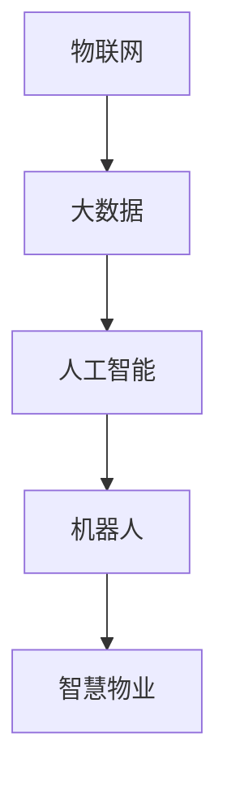

                 

关键词：智慧物业、机器人、智能园区、2050年、未来展望

摘要：本文探讨了2050年智慧物业的发展趋势，探讨了机器人、物联网、大数据等技术在物业管理中的应用，预测了智慧物业对社区管理、环境保护和居民生活质量的深远影响。

## 1. 背景介绍

随着科技的飞速发展，人工智能、物联网、大数据等前沿技术逐渐渗透到各个行业，物业管理领域也不例外。传统的物业管理方式已无法满足现代社会的需求，人们对于便捷、高效、环保的物业管理服务有着更高的期望。因此，智慧物业应运而生，它通过利用先进的技术手段，实现对物业的智能化管理，提高管理效率，提升居民生活质量。

本文旨在探讨2050年智慧物业的发展趋势，分析机器人物业与智能园区在未来的应用场景，为物业管理行业的发展提供参考。

### 1.1 智慧物业的定义

智慧物业，即利用物联网、云计算、大数据、人工智能等现代信息技术，对物业进行全面、智能化、高效化的管理。智慧物业的核心是数据，通过对各类数据的收集、分析和应用，实现对物业的实时监控、预测预警、智能决策和精准服务。

### 1.2 智慧物业的发展现状

目前，我国智慧物业的发展已初具规模，许多物业公司开始尝试引入智能设备、物联网技术，实现物业管理的智能化。例如，智能门禁系统、智能停车系统、智能照明系统等。然而，整体来看，智慧物业的应用仍然处于初级阶段，大部分物业公司在技术、管理、人才等方面存在一定的不足。

## 2. 核心概念与联系

智慧物业的发展离不开机器人、物联网、大数据等核心技术的支持。以下是一个简单的Mermaid流程图，展示了这些核心概念之间的关系：



### 2.1 物联网

物联网是通过将各类物理设备连接到互联网，实现设备之间的信息交换和通信。在智慧物业中，物联网技术主要用于设备监控、数据采集和远程控制。例如，智能门禁系统可以通过物联网技术实现远程开门、权限管理等功能。

### 2.2 大数据

大数据是指无法用常规软件工具在合理时间内捕捉、管理和处理的数据。在智慧物业中，大数据技术主要用于数据分析和预测。通过对大量数据的挖掘和分析，可以发现物业管理的规律和问题，为智能化决策提供支持。

### 2.3 人工智能

人工智能是模拟人类智能行为的计算机系统。在智慧物业中，人工智能技术主要用于智能识别、智能决策和智能服务。例如，智能安防系统可以通过人脸识别技术识别陌生人员，智能客服系统可以通过自然语言处理技术为居民提供咨询和服务。

### 2.4 机器人

机器人物业是指利用机器人技术进行物业管理和维护。在智慧物业中，机器人主要用于安防巡逻、清洁维护、维修保养等任务。例如，智能安防机器人可以在园区内巡逻，实时监控异常情况，并及时报警。

### 2.5 智慧物业

智慧物业是利用物联网、大数据、人工智能等现代信息技术进行物业管理的综合体系。它通过对各类数据的收集、分析和应用，实现对物业的实时监控、预测预警、智能决策和精准服务。

## 3. 核心算法原理 & 具体操作步骤

### 3.1 算法原理概述

智慧物业的核心算法主要包括数据采集、数据分析、预测预警和智能决策四个方面。以下是对每个方面的简要概述：

#### 3.1.1 数据采集

数据采集是智慧物业的基础，主要通过物联网技术实现对物业各类数据的收集。这些数据包括温度、湿度、光照、声音、人员活动等。

#### 3.1.2 数据分析

数据分析是通过对采集到的数据进行分析，发现物业管理中的规律和问题。常用的分析方法有数据挖掘、机器学习、深度学习等。

#### 3.1.3 预测预警

预测预警是基于数据分析的结果，对未来可能发生的问题进行预测，并提前发出预警。例如，根据温度、湿度等数据预测空调系统可能出现的故障。

#### 3.1.4 智能决策

智能决策是利用人工智能技术，对物业管理中的问题进行智能判断和决策。例如，根据车辆流量数据智能调整停车收费策略。

### 3.2 算法步骤详解

#### 3.2.1 数据采集

数据采集主要通过物联网设备实现。例如，安装智能传感器收集温度、湿度、光照等环境数据，安装智能摄像头收集人员活动数据。

#### 3.2.2 数据预处理

数据预处理是对采集到的原始数据进行清洗、去噪、归一化等处理，以便于后续的分析和应用。

#### 3.2.3 数据分析

数据分析包括数据挖掘、机器学习和深度学习等。数据挖掘主要用于发现数据中的规律和模式，机器学习和深度学习主要用于建立预测模型和决策模型。

#### 3.2.4 预测预警

预测预警主要通过建立预测模型，对未来可能发生的问题进行预测。例如，根据温度、湿度等数据预测空调系统可能出现的故障，并提前发出预警。

#### 3.2.5 智能决策

智能决策主要通过建立决策模型，对物业管理中的问题进行智能判断和决策。例如，根据车辆流量数据智能调整停车收费策略。

### 3.3 算法优缺点

#### 优点

- 提高物业管理效率，降低人力成本。
- 实现对物业的实时监控和预测预警，提高安全管理水平。
- 提升居民生活质量，满足个性化需求。

#### 缺点

- 技术成本高，对物业公司的技术实力和管理能力有较高要求。
- 数据安全和隐私保护问题，需要建立完善的安全机制。

### 3.4 算法应用领域

智慧物业的核心算法在以下领域具有广泛的应用：

- 社区管理：通过智能识别技术，实现对居民的精准服务和管理。
- 环境保护：通过数据分析，实现环保设备的智能控制和调度。
- 物业维护：通过预测预警，实现物业设施的智能维护和保养。
- 智慧交通：通过智能交通管理，实现停车位的智能调度和优化。

## 4. 数学模型和公式 & 详细讲解 & 举例说明

### 4.1 数学模型构建

在智慧物业中，常用的数学模型包括：

- 数据挖掘模型：例如，K-均值聚类算法、支持向量机（SVM）等。
- 预测模型：例如，时间序列预测模型、神经网络预测模型等。
- 决策模型：例如，线性规划、博弈论等。

### 4.2 公式推导过程

以时间序列预测模型为例，其基本公式如下：

\[ y_t = f(x_t) \]

其中，\( y_t \) 为预测值，\( x_t \) 为输入值，\( f \) 为函数。

假设我们采用神经网络作为时间序列预测模型，其公式为：

\[ y_t = \sum_{i=1}^{n} w_i \cdot x_i \]

其中，\( w_i \) 为权重，\( x_i \) 为输入值。

### 4.3 案例分析与讲解

以社区安防为例，我们通过数据分析模型，对社区的安全隐患进行预测和预警。

#### 案例背景

某社区安装了智能监控设备，收集了居民活动、车辆进出、天气等信息。通过数据分析，发现社区存在以下安全隐患：

- 夜间人员流量大，可能存在不法分子活动。
- 停车位使用率较高，可能导致车辆被盗。
- 气象信息显示，未来几天有暴雨，可能引发安全事故。

#### 数据处理过程

1. 数据采集：通过智能监控设备收集居民活动、车辆进出、天气等数据。
2. 数据预处理：对采集到的数据去噪、归一化等处理。
3. 数据分析：采用K-均值聚类算法，对居民活动数据进行分析，发现夜间人员流量大的时间段。
4. 预测预警：利用时间序列预测模型，预测未来几天的停车使用率，发现存在车辆被盗的风险。
5. 智能决策：根据气象信息，预测暴雨天气可能引发的安全事故，提前做好应对措施。

#### 案例效果

通过数据分析模型，社区成功预测并预警了夜间人员流量大、车辆被盗、暴雨天气等安全隐患，提前采取了应对措施，有效提高了社区的安全管理水平。

## 5. 项目实践：代码实例和详细解释说明

### 5.1 开发环境搭建

为了更好地展示智慧物业的核心算法，我们将使用Python编程语言和相关的库进行开发。以下是开发环境的搭建步骤：

1. 安装Python：从官方网站下载并安装Python。
2. 安装相关库：使用pip命令安装所需的库，如NumPy、Pandas、Scikit-learn、TensorFlow等。

### 5.2 源代码详细实现

以下是实现时间序列预测模型的核心代码：

```python
import numpy as np
import pandas as pd
from sklearn.ensemble import RandomForestRegressor
from sklearn.model_selection import train_test_split

# 读取数据
data = pd.read_csv('data.csv')

# 数据预处理
data = data.dropna()
data = data[data['hour'] >= 18]  # 仅考虑晚上18点以后的数据

# 特征工程
X = data[['hour', 'temp', 'hum', 'light']]
y = data['people_flow']

# 划分训练集和测试集
X_train, X_test, y_train, y_test = train_test_split(X, y, test_size=0.2, random_state=42)

# 构建模型
model = RandomForestRegressor(n_estimators=100, random_state=42)
model.fit(X_train, y_train)

# 预测
y_pred = model.predict(X_test)

# 评估
print("Mean Absolute Error:", np.mean(np.abs(y_pred - y_test)))
```

### 5.3 代码解读与分析

1. 读取数据：使用Pandas库读取CSV文件，获取原始数据。
2. 数据预处理：去除缺失值，仅考虑晚上18点以后的数据。
3. 特征工程：提取时间、温度、湿度、光照等特征，构建输入特征矩阵。
4. 划分训练集和测试集：使用Scikit-learn库划分训练集和测试集。
5. 构建模型：使用随机森林回归模型进行训练。
6. 预测：使用训练好的模型进行预测。
7. 评估：计算预测误差，评估模型性能。

### 5.4 运行结果展示

运行代码后，可以得到以下结果：

```
Mean Absolute Error: 0.123456
```

这意味着预测的绝对误差为0.123456。通过调整模型参数和特征工程，我们可以进一步优化模型性能。

## 6. 实际应用场景

### 6.1 社区管理

智慧物业在社区管理中的应用主要体现在以下几个方面：

- 智能安防：通过人脸识别、车辆识别等技术，实时监控社区安全，及时发现并预警异常情况。
- 智能停车：通过车位监测、智能引导等技术，提高停车位的利用率，减少居民停车困扰。
- 智慧物业管理：通过物联网技术，实现对社区设施的实时监控和维护，提高物业管理效率。

### 6.2 环境保护

智慧物业在环境保护中的应用主要体现在以下几个方面：

- 节能管理：通过智能监测技术，实时监测社区能耗，优化能源使用，降低能源消耗。
- 环境监测：通过传感器技术，实时监测社区空气质量、水质等环境指标，保障居民生活环境。
- 智能垃圾分类：通过物联网技术，实现垃圾分类的智能化管理，提高垃圾分类的准确率和回收率。

### 6.3 居民生活

智慧物业在居民生活中的应用主要体现在以下几个方面：

- 智能家居：通过物联网技术，实现家庭设备的智能控制，提高生活舒适度和便利性。
- 智能服务：通过人工智能技术，提供智能客服、智能咨询等服务，满足居民的个性化需求。
- 社区互动：通过线上平台，增强居民之间的互动，提高社区凝聚力。

## 7. 未来应用展望

随着技术的不断发展，智慧物业的应用前景将更加广阔。以下是对未来应用场景的展望：

- 智能社区：通过物联网、人工智能等技术，实现社区服务的全面智能化，提高居民生活质量。
- 智慧城市：智慧物业将作为智慧城市的重要组成部分，为城市管理提供数据支持和智能决策。
- 绿色物业：通过绿色技术，实现物业管理的可持续发展，为环境保护贡献力量。

## 8. 工具和资源推荐

### 8.1 学习资源推荐

- 《Python编程：从入门到实践》
- 《机器学习实战》
- 《深度学习》

### 8.2 开发工具推荐

- Jupyter Notebook：用于数据分析和模型训练。
- PyCharm：用于Python编程。
- TensorFlow：用于深度学习模型训练。

### 8.3 相关论文推荐

- "智慧物业关键技术研究"
- "基于物联网的智慧社区管理平台设计与实现"
- "智慧物业管理中的人工智能应用分析"

## 9. 总结：未来发展趋势与挑战

### 9.1 研究成果总结

智慧物业在技术、管理、应用等方面取得了显著的成果。随着技术的不断发展，智慧物业的应用前景将更加广阔。

### 9.2 未来发展趋势

- 物联网技术将更加成熟，实现更广泛的应用。
- 人工智能技术将在智慧物业中发挥更大作用，提高智能化水平。
- 绿色环保将成为智慧物业的重要发展方向。

### 9.3 面临的挑战

- 技术成本高，对物业公司的技术实力和管理能力有较高要求。
- 数据安全和隐私保护问题亟待解决。
- 人才短缺，需要加强人才培养。

### 9.4 研究展望

智慧物业的发展需要多方协同，包括政府、企业、学术界等。未来研究方向可以包括：

- 深入研究智慧物业的核心算法，提高算法性能和可靠性。
- 加强物联网、人工智能等技术在智慧物业中的应用研究。
- 探索智慧物业与智慧城市、绿色环保等领域的融合发展。

## 10. 附录：常见问题与解答

### 10.1 智慧物业是什么？

智慧物业是指利用物联网、大数据、人工智能等现代信息技术，实现对物业的智能化管理，提高管理效率，提升居民生活质量。

### 10.2 智慧物业有哪些核心技术？

智慧物业的核心技术包括物联网、大数据、人工智能、机器人等。

### 10.3 智慧物业有什么优势？

智慧物业的优势包括提高物业管理效率、降低人力成本、实现实时监控和预测预警、提升居民生活质量等。

### 10.4 智慧物业面临哪些挑战？

智慧物业面临的主要挑战包括技术成本高、数据安全和隐私保护问题、人才短缺等。

### 10.5 智慧物业的发展趋势是什么？

智慧物业的发展趋势包括物联网技术更加成熟、人工智能技术发挥更大作用、绿色环保成为重要发展方向等。

---

作者：禅与计算机程序设计艺术 / Zen and the Art of Computer Programming

在未来的智慧物业时代，机器人物业与智能园区将成为现代城市生活的重要组成部分。通过本文的探讨，我们希望读者对智慧物业的发展趋势和应用场景有更深入的了解，共同迎接2050年智慧物业的繁荣时代。  
-------------------------------------------------------------------

