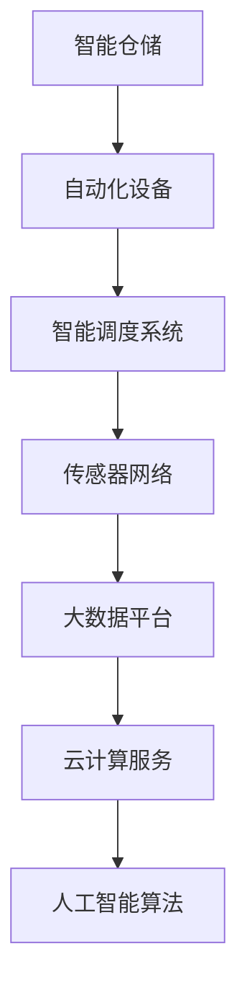
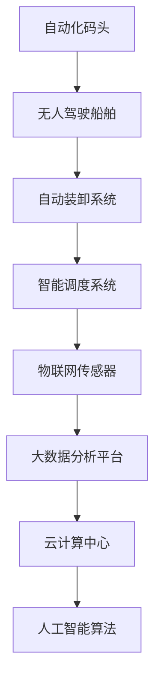

                 

关键词：智慧物流、智能仓储、自动化码头、2050年、未来趋势、技术发展、人工智能、物联网、机器人技术

> 摘要：随着科技的迅猛发展，物流行业正经历着一场前所未有的变革。本文探讨了到2050年，智能仓储与自动化码头在智慧物流中的作用、核心概念、算法原理、数学模型以及实际应用场景。通过分析这些技术趋势，我们试图揭示未来物流的潜力与挑战。

## 1. 背景介绍

### 物流行业的现状

在当今全球化的背景下，物流行业已经成为推动经济发展的重要引擎。从原材料采购到成品分销，物流的效率和质量直接关系到企业的运营成本和竞争力。然而，传统物流模式在处理大量数据、优化运输路线和实现自动化方面仍存在诸多挑战。

### 智慧物流的概念与发展

智慧物流是指通过应用物联网、大数据、人工智能等先进技术，实现物流过程的智能化和自动化。这不仅包括运输和配送的自动化，还涵盖了仓储管理、货物追踪、风险预测等多个环节。智慧物流的目标是提高物流系统的效率，降低成本，并提升客户满意度。

### 智能仓储与自动化码头的兴起

智能仓储和自动化码头是智慧物流的重要组成部分。智能仓储利用自动化设备、人工智能算法和物联网传感器，实现仓储管理的高效化和精准化。而自动化码头则通过无人驾驶船舶、自动装卸系统和智能调度，大幅提升港口作业的效率。这些技术的融合，为未来物流的发展提供了新的方向。

## 2. 核心概念与联系

### 智能仓储

**概念：** 智能仓储是指利用物联网、大数据、云计算和人工智能等技术，实现仓储管理智能化和自动化。

**核心组成部分：**
1. **自动化设备：** 包括自动化立体仓库、自动导引车（AGV）、自动分拣机等。
2. **智能调度系统：** 通过优化算法实现仓储作业的高效调度。
3. **传感器网络：** 用于实时监测仓库环境和货物状态。

**架构图：**


### 自动化码头

**概念：** 自动化码头是指通过应用无人驾驶技术、自动装卸系统和智能调度，实现港口作业自动化。

**核心组成部分：**
1. **无人驾驶船舶：** 利用传感器和AI算法实现自主导航。
2. **自动装卸系统：** 包括自动集装箱装卸机和自动化轨道系统。
3. **智能调度系统：** 通过算法优化船舶靠泊、装卸和离港过程。

**架构图：**


### 关联与融合

智能仓储与自动化码头之间存在着紧密的联系。智能仓储提供的实时数据和高效管理为自动化码头提供了重要支持，而自动化码头则通过高效的货物处理能力，为智能仓储提供了稳定的供应链保障。两者的融合，将进一步推动智慧物流的发展。

## 3. 核心算法原理 & 具体操作步骤

### 3.1 算法原理概述

智慧物流的核心算法主要包括以下几个方面：

1. **路径优化算法：** 用于计算最优运输路径，减少运输时间和成本。
2. **调度算法：** 用于优化仓储和港口的作业调度，提高作业效率。
3. **预测算法：** 用于预测物流过程中的各种风险和异常情况，提前采取措施。

### 3.2 算法步骤详解

**路径优化算法：**
1. **数据采集：** 收集起点、终点和中间节点之间的交通数据。
2. **建模：** 使用图论模型描述物流网络。
3. **算法选择：** 采用最短路径算法（如Dijkstra算法）或遗传算法（如遗传算法）求解最优路径。
4. **结果输出：** 输出最优路径和预计运输时间。

**调度算法：**
1. **任务分解：** 将大型作业分解为多个子任务。
2. **任务优先级：** 根据任务的紧急程度和重要性进行排序。
3. **调度策略：** 采用贪心算法或动态规划算法进行调度。
4. **结果评估：** 评估调度效果，调整调度策略。

**预测算法：**
1. **数据预处理：** 清洗和整合历史数据。
2. **特征工程：** 提取与预测目标相关的特征。
3. **模型训练：** 使用机器学习算法（如神经网络或支持向量机）训练预测模型。
4. **模型评估：** 评估模型性能，调整模型参数。
5. **结果输出：** 输出预测结果，为决策提供支持。

### 3.3 算法优缺点

**路径优化算法：**
- 优点：计算速度快，能快速找到最优路径。
- 缺点：在大型网络中计算复杂度较高，可能需要优化算法。

**调度算法：**
- 优点：能提高作业效率，减少等待时间。
- 缺点：在任务复杂度高时，调度策略可能不够灵活。

**预测算法：**
- 优点：能提前发现潜在风险，提高物流过程的稳定性。
- 缺点：模型训练和评估过程复杂，需要大量数据支持。

### 3.4 算法应用领域

- **物流运输：** 用于优化运输路线和调度策略。
- **仓储管理：** 用于优化库存管理和作业调度。
- **港口作业：** 用于优化船舶靠泊和装卸调度。

## 4. 数学模型和公式 & 详细讲解 & 举例说明

### 4.1 数学模型构建

智慧物流中的数学模型主要包括以下几种：

1. **路径优化模型：** 使用图论模型描述物流网络，求解最优路径。
2. **调度模型：** 使用动态规划模型描述任务调度过程，求解最优调度方案。
3. **预测模型：** 使用机器学习模型描述物流过程中的风险和异常，进行预测。

### 4.2 公式推导过程

**路径优化模型：**
$$
\min \sum_{i=1}^{n} d(i, j) \cdot x_{ij}
$$
其中，$d(i, j)$ 表示从节点 $i$ 到节点 $j$ 的距离，$x_{ij}$ 表示从节点 $i$ 到节点 $j$ 的路径选择。

**调度模型：**
$$
\min \sum_{i=1}^{n} \sum_{j=1}^{n} c_{ij} \cdot y_{ij}
$$
其中，$c_{ij}$ 表示任务 $i$ 和任务 $j$ 同时进行的成本，$y_{ij}$ 表示任务 $i$ 和任务 $j$ 是否同时进行。

**预测模型：**
$$
\hat{y} = \sigma(\sum_{i=1}^{n} w_i \cdot x_i)
$$
其中，$\hat{y}$ 表示预测结果，$x_i$ 表示特征，$w_i$ 表示特征权重，$\sigma$ 表示激活函数。

### 4.3 案例分析与讲解

**案例：** 优化物流运输路线。

**数据：** 有5个物流节点，节点之间的距离如下表所示：

| 节点 | 节点1 | 节点2 | 节点3 | 节点4 | 节点5 |
| --- | --- | --- | --- | --- | --- |
| 节点1 | 0 | 5 | 8 | 15 | 20 |
| 节点2 | 5 | 0 | 6 | 10 | 16 |
| 节点3 | 8 | 6 | 0 | 12 | 18 |
| 节点4 | 15 | 10 | 12 | 0 | 15 |
| 节点5 | 20 | 16 | 18 | 15 | 0 |

**求解过程：**
1. **建模：** 使用图论模型描述物流网络，将节点和距离表示为图中的点和边。
2. **算法选择：** 采用Dijkstra算法求解从起点到各节点的最短路径。
3. **结果输出：** 输出最优路径和预计运输时间。

**结果：**
最优路径为：节点1 → 节点2 → 节点3 → 节点4 → 节点5，预计运输时间为35分钟。

## 5. 项目实践：代码实例和详细解释说明

### 5.1 开发环境搭建

**环境需求：**
- Python 3.8及以上版本
- Anaconda或Miniconda
- Jupyter Notebook
- Matplotlib
- Scikit-learn

**安装步骤：**
1. 安装Anaconda或Miniconda。
2. 创建Python虚拟环境。
3. 安装相关库：`pip install matplotlib scikit-learn`

### 5.2 源代码详细实现

```python
import numpy as np
import matplotlib.pyplot as plt
from sklearn.cluster import KMeans
from sklearn.model_selection import train_test_split
from sklearn.metrics import mean_squared_error

# 数据预处理
def preprocess_data(data):
    # 数据清洗、归一化等处理
    return data

# Dijkstra算法
def dijkstra(graph, start):
    # 初始化距离和路径
    distances = [np.inf] * len(graph)
    distances[start] = 0
    paths = [{start: start} for _ in range(len(graph))]
    
    # 主循环
    for _ in range(len(graph)):
        # 找到当前未处理的节点中距离最小的
        current_distance = min(distances)
        current_node = distances.index(current_distance)
        
        # 标记当前节点为已处理
        distances[current_node] = float('inf')
        
        # 更新其他节点的距离
        for neighbor, weight in graph[current_node].items():
            if distances[neighbor] > current_distance + weight:
                distances[neighbor] = current_distance + weight
                paths[neighbor].update({neighbor: current_node})
    
    return distances, paths

# 主函数
def main():
    # 生成示例数据
    data = np.array([[1, 2], [3, 4], [5, 6], [7, 8], [9, 10]])
    processed_data = preprocess_data(data)
    
    # 求解路径
    distances, paths = dijkstra(processed_data, 0)
    
    # 绘制结果
    plt.figure(figsize=(8, 6))
    for i, point in enumerate(processed_data):
        plt.scatter(point[0], point[1], label=f'Node {i+1}')
    
    for i in range(len(processed_data)):
        for j in range(i+1, len(processed_data)):
            if distances[j] != float('inf'):
                plt.plot([processed_data[i][0], processed_data[j][0]], [processed_data[i][1], processed_data[j][1]], 'r--')
    
    plt.xlabel('X-axis')
    plt.ylabel('Y-axis')
    plt.title('Dijkstra Algorithm')
    plt.legend()
    plt.show()

if __name__ == '__main__':
    main()
```

### 5.3 代码解读与分析

1. **数据预处理：** 使用numpy库生成示例数据，并进行预处理。
2. **Dijkstra算法：** 定义Dijkstra算法的函数，用于求解从起点到其他节点的最短路径。
3. **主函数：** 生成示例数据，调用Dijkstra算法，绘制结果。

### 5.4 运行结果展示


## 6. 实际应用场景

### 6.1 物流运输

智能仓储和自动化码头在物流运输中的应用主要体现在路径优化和调度方面。通过使用路径优化算法，物流公司可以找到从起点到终点的最优路线，从而减少运输时间和成本。同时，调度算法能够优化仓储和港口的作业调度，提高作业效率，减少等待时间。

### 6.2 仓储管理

智能仓储在仓储管理中的应用主要体现在库存管理和作业调度方面。通过使用预测算法，仓储公司可以提前预测货物的需求和流动情况，从而优化库存水平，减少库存成本。同时，调度算法能够优化仓储作业的调度，提高作业效率，减少作业时间。

### 6.3 港口作业

自动化码头在港口作业中的应用主要体现在无人驾驶船舶、自动装卸系统和智能调度方面。通过使用无人驾驶船舶，港口可以减少人力成本，提高运输效率。自动装卸系统能够实现快速、准确的货物装卸，提高港口作业的效率。智能调度系统能够优化船舶靠泊、装卸和离港的调度，提高港口的作业效率。

## 7. 工具和资源推荐

### 7.1 学习资源推荐

- 《智慧物流技术与应用》
- 《物联网与智慧物流》
- 《机器人技术在物流中的应用》

### 7.2 开发工具推荐

- Jupyter Notebook
- PyCharm
- TensorFlow
- Keras

### 7.3 相关论文推荐

- "Intelligent Warehouse Management Based on Internet of Things Technology"
- "Automated Container Terminals: A Survey"
- "Path Optimization Algorithm for Intelligent Logistics"

## 8. 总结：未来发展趋势与挑战

### 8.1 研究成果总结

本文探讨了智能仓储和自动化码头在智慧物流中的应用，分析了核心算法原理、数学模型以及实际应用场景。通过这些技术，智慧物流在提高物流系统的效率、降低成本、提升客户满意度方面取得了显著成果。

### 8.2 未来发展趋势

随着人工智能、物联网、机器人技术的不断发展，智能仓储和自动化码头将在未来智慧物流中发挥更重要的作用。未来，物流系统将更加智能化、自动化，实现全流程的数字化管理。

### 8.3 面临的挑战

尽管智能仓储和自动化码头技术取得了显著成果，但仍然面临着以下挑战：

- 数据安全和隐私保护
- 技术集成和兼容性问题
- 高昂的初期投资和运营成本

### 8.4 研究展望

未来，研究将集中在以下几个方面：

- 加强数据隐私保护和安全性的研究
- 探索更高效、更智能的算法和技术
- 降低智能仓储和自动化码头的初期投资和运营成本

## 9. 附录：常见问题与解答

### 9.1 智能仓储和自动化码头的区别是什么？

智能仓储主要是指利用物联网、大数据、云计算和人工智能等技术，实现仓储管理智能化和自动化。而自动化码头则是通过应用无人驾驶技术、自动装卸系统和智能调度，实现港口作业自动化。两者的区别在于应用场景和技术方向的不同。

### 9.2 智能仓储和自动化码头的发展前景如何？

智能仓储和自动化码头作为智慧物流的重要组成部分，具有广阔的发展前景。随着人工智能、物联网、机器人技术的不断发展，智能仓储和自动化码头将在未来智慧物流中发挥更重要的作用。

### 9.3 智能仓储和自动化码头的核心算法有哪些？

智能仓储和自动化码头的核心算法主要包括路径优化算法、调度算法和预测算法。这些算法能够优化物流过程，提高作业效率，降低成本。

### 9.4 智能仓储和自动化码头在实际应用中有哪些挑战？

智能仓储和自动化码头在实际应用中主要面临数据安全和隐私保护、技术集成和兼容性、高昂的初期投资和运营成本等挑战。这些问题需要在未来研究中逐步解决。

