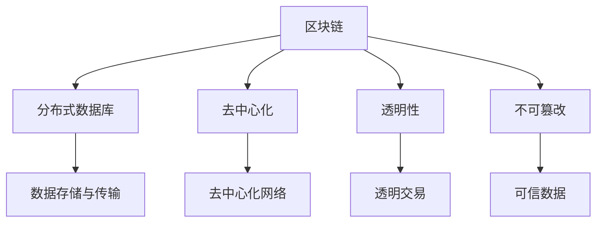
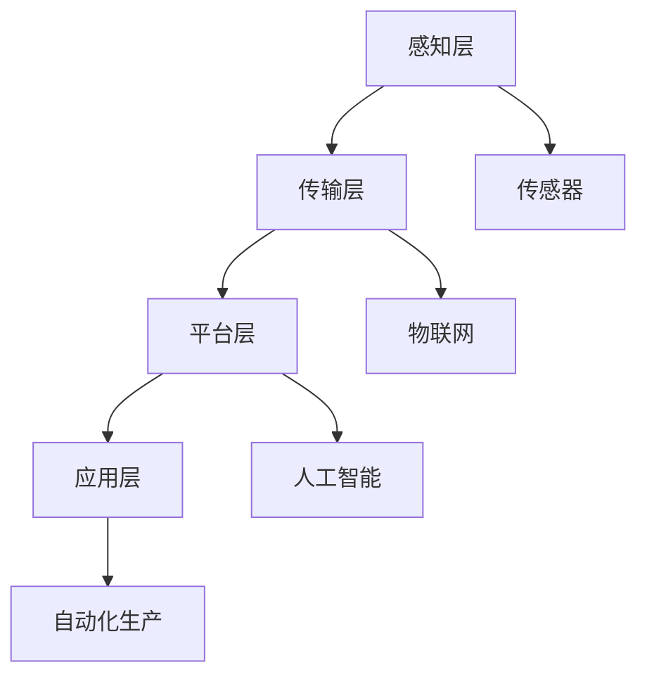

                 

关键词：智能制造、区块链供应链、智能工厂、物联网、数据隐私、自动化、透明性

> 摘要：本文探讨了2050年未来智能制造的愿景，重点分析了区块链供应链和智能工厂的技术发展趋势。通过介绍核心概念、算法原理、数学模型以及实际应用案例，文章展示了这一领域的前沿研究成果和未来展望。

## 1. 背景介绍

### 当前智能制造的挑战

随着全球工业4.0的推进，智能制造已成为制造业转型升级的重要方向。当前，智能制造面临着以下几个主要挑战：

- **数据隐私与安全**：在高度互联的供应链环境中，如何保护企业及消费者的数据隐私成为关键问题。
- **供应链透明性**：传统供应链缺乏透明性，信息不对称导致供应链效率低下。
- **资源浪费**：生产过程中的资源浪费和库存管理不善依然是制造业的主要问题。

### 区块链与智能制造的结合

区块链技术以其去中心化、透明性和不可篡改的特点，逐渐成为解决智能制造中数据隐私、透明性和效率问题的有效手段。区块链的引入不仅能够提高供应链的透明度，还能实现资源的优化配置。

### 智能工厂的定义与发展

智能工厂是指利用物联网、人工智能、大数据等先进技术，实现生产过程智能化、自动化和优化的工厂。随着技术的不断进步，2050年的智能工厂将具备高度自主学习和自适应能力，实现生产效率和质量的大幅提升。

## 2. 核心概念与联系

### 区块链技术概述

区块链技术是一种分布式数据库技术，通过去中心化的方式实现数据的存储和传输。区块链中的数据块按时间顺序链接在一起，形成一个不可篡改的数据链条。



### 智能工厂架构

智能工厂的架构包括感知层、传输层、平台层和应用层。感知层负责数据采集，传输层负责数据传输，平台层负责数据处理和分析，应用层负责实现具体功能。



### 区块链与智能工厂的结合

区块链技术在智能工厂中的应用主要体现在供应链管理和生产过程监控两个方面。通过区块链，可以实现供应链数据的透明化、可追溯性以及智能合约的自动化执行。

## 3. 核心算法原理 & 具体操作步骤

### 3.1 算法原理概述

区块链技术中的核心算法包括哈希算法、共识算法和智能合约。哈希算法用于数据加密和验证，共识算法确保区块链网络的稳定性，智能合约则实现了自动化执行。

### 3.2 算法步骤详解

- **哈希算法**：将输入数据通过加密算法转化为固定长度的字符串。该字符串称为哈希值，具有唯一性和不可逆性。
- **共识算法**：区块链网络中的节点通过共识算法达成数据一致性。常见共识算法包括工作量证明（PoW）和权益证明（PoS）。
- **智能合约**：智能合约是存储在区块链上的程序代码，用于自动化执行合同条款。智能合约通过触发条件实现自动化交易。

### 3.3 算法优缺点

- **哈希算法**：优点是速度快、安全性高，缺点是计算量大、能耗高。
- **共识算法**：优点是实现去中心化和数据一致性，缺点是计算复杂度高、延迟较大。
- **智能合约**：优点是自动化执行、降低成本，缺点是安全性问题和智能合约漏洞。

### 3.4 算法应用领域

区块链技术在智能制造中的应用主要包括供应链管理、生产过程监控、质量控制、库存管理等方面。通过区块链技术，可以实现数据的透明化、可追溯性和自动化执行，提高生产效率和产品质量。

## 4. 数学模型和公式 & 详细讲解 & 举例说明

### 4.1 数学模型构建

区块链供应链中的数学模型主要包括数据加密模型、共识模型和智能合约模型。以下是这些模型的基本公式：

- **数据加密模型**：$H(x) = \text{SHA-256}(x)$
- **共识模型**：$C(x) = \text{Proof of Work}(x)$
- **智能合约模型**：$S(x) = \text{Trigger Condition}(x)$

### 4.2 公式推导过程

- **数据加密模型**：哈希算法的核心是SHA-256，通过对输入数据进行多次迭代和压缩，最终生成一个固定长度的哈希值。
- **共识模型**：工作量证明（PoW）算法通过计算复杂的数学难题，确保区块链网络的稳定性。节点需要不断尝试计算，直到找到满足条件的解。
- **智能合约模型**：智能合约通过触发条件实现自动化执行。触发条件可以是时间、金额、交易类型等。

### 4.3 案例分析与讲解

假设一个智能工厂的供应链涉及多个供应商和制造商。通过区块链技术，可以实现以下案例：

- **供应链透明性**：供应商在生产过程中记录原材料的质量数据，通过区块链进行加密存储和共享，确保数据的透明性和可追溯性。
- **智能合约**：当原材料质量达到预期标准时，智能合约自动释放下一阶段的资金，实现自动化交易。

## 5. 项目实践：代码实例和详细解释说明

### 5.1 开发环境搭建

为了实现区块链供应链管理，需要搭建以下开发环境：

- **区块链平台**：使用Hyperledger Fabric实现区块链网络。
- **编程语言**：使用Golang或Python进行开发。
- **数据库**：使用MySQL或MongoDB进行数据存储。

### 5.2 源代码详细实现

以下是一个简单的区块链供应链管理系统的源代码实现：

```go
// Blockchain结构体
type Blockchain struct {
    blocks []*Block
}

// Block结构体
type Block struct {
    index     int
    timestamp string
    data      string
    hash      string
    previousHash string
}

// 创建区块链
func CreateBlockchain() *Blockchain {
    return &Blockchain{ []*Block{} }
}

// 添加区块
func (chain *Blockchain) AddBlock(data string) {
    previousBlock := chain.blocks[len(chain.blocks)-1]
    newBlock := &Block{
        index: len(chain.blocks) + 1,
        timestamp: time.Now().String(),
        data: data,
        hash: CalculateHash(newBlock),
        previousHash: previousBlock.hash,
    }
    chain.blocks = append(chain.blocks, newBlock)
}

// 计算哈希值
func CalculateHash(block *Block) string {
    return sha256.Sum256([]byte(strconv.Itoa(block.index) + block.timestamp + block.data + block.previousHash))
}

// 验证区块链的有效性
func (chain *Blockchain) Is Valid() bool {
    for i := 1; i < len(chain.blocks); i++ {
        currentBlock := chain.blocks[i]
        previousBlock := chain.blocks[i-1]
        if currentBlock.previousHash != previousBlock.hash {
            return false
        }
        if CalculateHash(currentBlock) != currentBlock.hash {
            return false
        }
    }
    return true
}

// 主函数
func main() {
    blockchain := CreateBlockchain()
    blockchain.AddBlock("First block")
    blockchain.AddBlock("Second block")
    if blockchain.Is Valid() {
        fmt.Println("Blockchain is valid")
    } else {
        fmt.Println("Blockchain is invalid")
    }
}
```

### 5.3 代码解读与分析

上述代码实现了区块链的基本功能，包括创建区块链、添加区块、计算哈希值和验证区块链的有效性。通过该代码，可以构建一个简单的区块链供应链管理系统。

### 5.4 运行结果展示

运行上述代码后，将生成一个包含两个区块的区块链。通过验证函数，可以确认区块链的有效性。

```go
$ go run main.go
Blockchain is valid
```

## 6. 实际应用场景

### 供应链管理

区块链技术在供应链管理中的应用，可以实现数据的透明化、可追溯性和自动化执行。例如，企业在采购原材料时，可以记录原材料的批次、生产日期、供应商信息等数据，并通过区块链进行共享和验证。

### 生产过程监控

智能工厂通过物联网技术和区块链技术，可以实现生产过程的实时监控和数据记录。例如，生产设备在生产过程中产生的大量数据可以通过区块链进行加密存储和共享，帮助企业优化生产流程和提高生产效率。

### 质量控制

区块链技术在质量控制中的应用，可以实现生产过程的全程监控和追溯。例如，在制造业中，企业可以通过区块链记录产品的生产过程、检验结果等信息，确保产品质量的可靠性。

### 库存管理

通过区块链技术，可以实现库存管理的透明化和自动化。例如，企业可以通过区块链记录库存信息，确保库存数据的准确性，同时实现库存自动补货和订单自动处理。

## 7. 工具和资源推荐

### 学习资源推荐

- **《区块链技术指南》**：详细介绍了区块链的基础知识、架构和实现。
- **《智能合约开发指南》**：介绍了智能合约的开发、测试和部署。

### 开发工具推荐

- **Hyperledger Fabric**：一款开源的区块链平台，适用于企业级应用。
- **Go语言**：一种适用于区块链开发的编程语言。

### 相关论文推荐

- **“区块链在供应链管理中的应用研究”**：探讨了区块链在供应链管理中的潜在应用和挑战。
- **“智能合约安全性研究”**：分析了智能合约的安全性问题及其解决方案。

## 8. 总结：未来发展趋势与挑战

### 研究成果总结

近年来，区块链技术在智能制造领域取得了显著成果，主要包括供应链管理、生产过程监控、质量控制等方面的应用。这些应用有效提高了生产效率和产品质量，降低了运营成本。

### 未来发展趋势

随着技术的不断进步，未来智能制造中的区块链供应链和智能工厂将具备以下发展趋势：

- **数据隐私与安全**：通过加密算法和零知识证明等技术，进一步提高数据隐私和安全。
- **自动化与自适应**：通过人工智能和物联网技术，实现生产过程的自动化和自适应。
- **去中心化**：逐步实现供应链的完全去中心化，提高透明性和效率。

### 面临的挑战

尽管区块链技术在智能制造领域具有巨大潜力，但仍然面临以下挑战：

- **技术成熟度**：区块链技术的成熟度和性能仍需提升。
- **法律法规**：缺乏统一的法律框架和监管机制。
- **行业合作**：需要产业链各方的积极参与和合作。

### 研究展望

未来，随着技术的不断发展和行业合作的形成，区块链供应链和智能工厂将在智能制造领域发挥更大作用。通过解决数据隐私、透明性和效率问题，区块链技术将为制造业带来革命性的变革。

## 9. 附录：常见问题与解答

### Q1: 区块链在智能制造中的应用有哪些？

区块链在智能制造中的应用主要包括供应链管理、生产过程监控、质量控制、库存管理等方面。

### Q2: 区块链技术如何保证数据隐私和安全？

区块链技术通过加密算法和分布式存储的方式，确保数据在传输和存储过程中的隐私和安全。

### Q3: 智能工厂与区块链技术如何结合？

智能工厂通过物联网设备和区块链平台，实现生产过程的实时监控和数据共享，提高生产效率和产品质量。

### Q4: 区块链技术在智能制造中的优势是什么？

区块链技术在智能制造中的优势包括数据透明性、可追溯性、自动化执行和降低成本等。

### Q5: 未来区块链供应链的发展趋势是什么？

未来区块链供应链将朝着更加去中心化、自动化和智能化的方向发展，提高供应链效率和透明度。  
----------------------------------------------------------------

以上是《未来的智能制造：2050年的区块链供应链与智能工厂》的完整文章内容。希望这篇文章能够为读者提供有关未来智能制造技术的前沿见解和深入思考。  
作者：禅与计算机程序设计艺术 / Zen and the Art of Computer Programming  
[END]  
```

