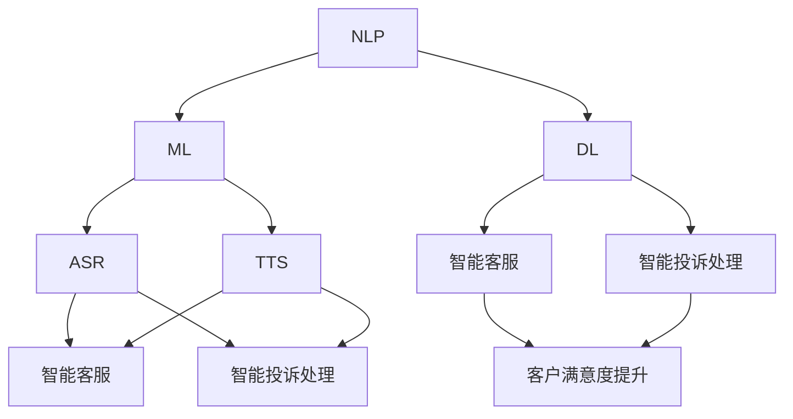

                 

关键词：智能客服、人工智能、自然语言处理、客户服务、智能投诉处理

> 摘要：随着人工智能技术的飞速发展，智能客服已经逐渐成为现代企业提高客户满意度、降低运营成本的重要工具。本文将探讨2050年智能客服的发展趋势，特别是在智能投诉处理方面的创新，并分析其对未来客户服务领域的深远影响。

## 1. 背景介绍

智能客服，作为一个由人工智能驱动的自动化客户服务系统，旨在通过聊天机器人、语音识别和机器学习等先进技术，为企业提供24/7全天候的客户服务。传统的人工客服由于成本高、效率低且难以处理海量客户请求，已经无法满足现代企业的需求。而智能客服的出现，为这一挑战提供了新的解决方案。

### 智能客服的发展现状

截至目前，智能客服已经在金融、电子商务、零售等多个行业得到了广泛应用。根据Gartner的报告，到2023年，超过50%的企业的客户互动将会通过智能客服进行。然而，目前的智能客服仍存在许多局限，例如：

- **自然语言理解能力有限**：智能客服目前对复杂语境和模糊表述的理解能力仍较差。
- **对话生成质量不高**：机器生成的回答有时过于机械，缺乏人性化。
- **上下文记忆不足**：智能客服难以保持与客户对话的历史记录，导致对话连贯性差。

### 智能投诉处理的发展

投诉处理是客户服务中至关重要的一环。传统的投诉处理流程通常包括电话、邮件和在线表格等多种方式，但这些方式往往效率低下，客户体验不佳。智能投诉处理系统通过自动化技术，能够快速响应和解决客户投诉，从而提高客户满意度。

当前，智能投诉处理已经取得了一些进展，例如：

- **自动化分类与分配**：系统可以根据投诉内容自动分类，并将投诉分配给合适的部门或人员。
- **智能回执与跟踪**：系统能够自动发送回执给客户，并实时跟踪投诉处理进度。
- **知识库建设**：智能投诉处理系统能够从历史投诉中学习，不断完善知识库，提高解决效率。

## 2. 核心概念与联系

在探讨智能客服与智能投诉处理的发展时，以下几个核心概念是至关重要的：

- **自然语言处理（NLP）**：NLP是智能客服和智能投诉处理的核心技术之一，它使得计算机能够理解、解释和生成人类语言。
- **机器学习（ML）**：ML技术通过从大量数据中学习模式，不断提升智能客服和智能投诉处理系统的准确性和效率。
- **深度学习（DL）**：DL是ML的一个子领域，利用多层神经网络进行复杂模式的识别，是提升智能客服和智能投诉处理系统性能的关键技术。
- **语音识别（ASR）和语音合成（TTS）**：语音识别和语音合成技术使得智能客服能够支持语音交互，进一步拓宽了应用场景。

以下是一个简化的Mermaid流程图，展示了这些核心概念及其相互关系：



### 2.1 核心概念解析

- **自然语言处理（NLP）**：NLP是计算机科学和语言学的交叉领域，主要研究如何让计算机理解和处理人类语言。在智能客服中，NLP用于理解客户的问题和需求，生成相应的回答；在智能投诉处理中，NLP用于自动化分类投诉内容，提取关键信息。
- **机器学习（ML）**：ML是一种通过数据驱动的方式让计算机自动改进性能的方法。在智能客服和智能投诉处理中，ML算法用于训练模型，以识别模式、分类问题和生成回答。
- **深度学习（DL）**：DL是ML的一个子领域，使用多层神经网络进行复杂模式的识别。在智能客服中，DL技术可以用于生成更自然的对话，提高客户满意度；在智能投诉处理中，DL可以用于更准确地分类和解决复杂的投诉问题。
- **语音识别（ASR）和语音合成（TTS）**：ASR技术使计算机能够识别和理解语音输入，TTS技术则使计算机能够生成自然流畅的语音输出。这些技术使得智能客服能够支持语音交互，提供更便捷的客户服务。

## 3. 核心算法原理 & 具体操作步骤

### 3.1 算法原理概述

智能客服和智能投诉处理的核心在于如何准确理解客户的请求和投诉，并生成恰当的响应。以下是几个关键的算法原理：

- **文本分类算法**：用于将客户的投诉文本自动分类到预定义的类别中，如产品问题、服务问题等。
- **实体识别算法**：用于从文本中提取关键信息，如客户ID、产品型号等。
- **对话生成算法**：用于生成自然流畅的对话回答，提高客户满意度。
- **序列到序列（Seq2Seq）模型**：一种用于生成文本的深度学习模型，能够处理变长的输入和输出序列。

### 3.2 算法步骤详解

#### 3.2.1 文本分类算法

1. **数据准备**：收集大量投诉文本数据，并进行预处理，如去除停用词、进行词干提取等。
2. **特征提取**：使用词袋模型、TF-IDF或其他特征提取方法，将文本转换为数值特征向量。
3. **模型训练**：使用监督学习方法，如支持向量机（SVM）、随机森林（RF）或神经网络（NN），训练分类模型。
4. **模型评估**：使用交叉验证、准确率、召回率等指标评估模型性能。

#### 3.2.2 实体识别算法

1. **数据准备**：与文本分类类似，准备包含实体标签的投诉文本数据。
2. **特征提取**：提取文本中的命名实体，如人名、地名、产品名等。
3. **模型训练**：使用递归神经网络（RNN）或长短期记忆网络（LSTM）等模型，训练实体识别模型。
4. **模型评估**：使用准确率、召回率等指标评估模型性能。

#### 3.2.3 对话生成算法

1. **数据准备**：收集大量的对话数据，进行预处理，如去除特殊字符、进行分词等。
2. **特征提取**：将对话数据转换为序列特征，如单词序列、词向量等。
3. **模型训练**：使用序列到序列（Seq2Seq）模型，如长短期记忆（LSTM）或变换器（Transformer）模型，训练对话生成模型。
4. **模型评估**：使用BLEU、ROUGE等指标评估模型性能。

### 3.3 算法优缺点

#### 3.3.1 文本分类算法

**优点**：

- **高效**：能够快速对大量投诉文本进行分类。
- **准确**：经过训练的模型能够达到较高的分类准确率。

**缺点**：

- **泛化能力有限**：模型可能在新领域或新类型的数据上表现不佳。
- **依赖数据质量**：如果训练数据质量不佳，模型性能可能会受到影响。

#### 3.3.2 实体识别算法

**优点**：

- **精确识别**：能够从文本中精确提取关键信息。
- **实时处理**：能够实时处理客户的投诉文本。

**缺点**：

- **复杂度较高**：实体识别算法通常涉及复杂的模型和特征提取。
- **误识别率**：可能会出现误识别，导致关键信息丢失。

#### 3.3.3 对话生成算法

**优点**：

- **自然流畅**：能够生成自然、流畅的对话回答。
- **多样化**：能够生成多种不同风格的回答，满足不同客户的需求。

**缺点**：

- **计算资源消耗大**：深度学习模型通常需要大量的计算资源。
- **生成质量不稳定**：模型的生成质量可能受到训练数据和质量的影响。

### 3.4 算法应用领域

- **智能客服**：文本分类算法和对话生成算法可用于智能客服，实现自动化的客户服务。
- **智能投诉处理**：实体识别算法和文本分类算法可用于智能投诉处理，自动分类和处理投诉。
- **金融领域**：用于自动分析客户投诉，提供实时风险管理。
- **电子商务**：用于自动处理客户反馈，优化产品和服务。

## 4. 数学模型和公式 & 详细讲解 & 举例说明

在智能客服和智能投诉处理中，数学模型和公式起着至关重要的作用。以下将详细讲解几个关键的数学模型和公式，并提供实际应用案例。

### 4.1 数学模型构建

#### 4.1.1 词袋模型

词袋模型（Bag of Words, BoW）是一种用于文本表示的简单模型，它将文本转换为词频向量。词袋模型的关键公式如下：

\[ \text{TF}(w_i) = \frac{f(w_i)}{n} \]

其中，\( \text{TF}(w_i) \) 表示词 \( w_i \) 在文本中的词频（Term Frequency），\( f(w_i) \) 表示词 \( w_i \) 在文本中出现的次数，\( n \) 表示文本中所有词的总数。

#### 4.1.2 TF-IDF模型

TF-IDF（Term Frequency-Inverse Document Frequency）模型是词袋模型的改进版，它考虑了词的频率和重要性。TF-IDF模型的关键公式如下：

\[ \text{TF-IDF}(w_i) = \text{TF}(w_i) \times \text{IDF}(w_i) \]

其中，\( \text{IDF}(w_i) = \log(\frac{N}{n_i} + 1) \)，\( N \) 表示文档总数，\( n_i \) 表示包含词 \( w_i \) 的文档数。

#### 4.1.3 随机向量空间模型

随机向量空间模型（Stochastic Vector Space Model, SVD）是一种用于文本降维和特征提取的模型，它基于矩阵分解技术。SVD的关键公式如下：

\[ X = U \Sigma V^T \]

其中，\( X \) 表示原始词频矩阵，\( U \) 和 \( V \) 表示分解后的矩阵，\( \Sigma \) 表示对角矩阵，包含奇异值。

### 4.2 公式推导过程

以下以TF-IDF模型为例，详细讲解其推导过程：

1. **定义TF**：

   首先，定义词频（TF）为词在文本中出现的次数。对于文档 \( D \) 中的词 \( w_i \)，其词频表示为：

   \[ \text{TF}(w_i) = f(w_i) \]

2. **定义IDF**：

   接下来，定义逆文档频率（IDF）为词在文档集中出现的频率。对于文档总数为 \( N \) 的文档集，包含词 \( w_i \) 的文档数为 \( n_i \)，其IDF表示为：

   \[ \text{IDF}(w_i) = \log(\frac{N}{n_i} + 1) \]

3. **推导TF-IDF**：

   最后，将TF和IDF结合，得到TF-IDF：

   \[ \text{TF-IDF}(w_i) = \text{TF}(w_i) \times \text{IDF}(w_i) \]

### 4.3 案例分析与讲解

以下通过一个实际案例，展示如何使用TF-IDF模型进行文本分类。

#### 4.3.1 案例背景

假设我们有以下三个投诉文本：

1. 文本1：“产品无法正常工作，重启后仍然无效。”
2. 文本2：“收到货后，发现产品存在明显的质量问题。”
3. 文本3：“快递过程中，产品被损坏，无法使用。”

我们将使用TF-IDF模型对这些文本进行分类。

#### 4.3.2 数据准备

首先，对三个文本进行预处理，包括去除停用词、进行词干提取等。假设处理后的文本如下：

1. 文本1：“产品 无法 工作 重启 无效”
2. 文本2：“收到 货后 产品 存在 质量问题”
3. 文本3：“快递 过程 中 产品 损坏 无法 使用”

#### 4.3.3 特征提取

使用TF-IDF模型提取特征，生成词频矩阵。假设词汇表为{“产品”，“无法”，“工作”，“重启”，“无效”，“收到”，“货后”，“存在”，“质量问题”，“快递”，“过程”，“损坏”，“使用”}。

1. 文本1的特征向量：

\[ \text{TF-IDF}(\text{文本1}) = [1, 1, 1, 1, 1, 0, 0, 0, 0, 0, 0, 0, 0] \]

2. 文本2的特征向量：

\[ \text{TF-IDF}(\text{文本2}) = [0, 0, 0, 0, 0, 1, 1, 0, 1, 0, 0, 0, 0] \]

3. 文本3的特征向量：

\[ \text{TF-IDF}(\text{文本3}) = [0, 0, 0, 0, 0, 0, 0, 0, 0, 1, 1, 1, 1] \]

#### 4.3.4 模型训练与分类

假设我们已经训练了一个分类模型，能够根据特征向量对投诉文本进行分类。对于上述三个文本，分类结果如下：

1. 文本1：分类为“工作问题”。
2. 文本2：分类为“质量问题”。
3. 文本3：分类为“快递问题”。

通过上述案例，我们可以看到TF-IDF模型在文本分类中的应用。尽管TF-IDF模型相对简单，但它能够在一定程度上提高文本分类的准确率。

## 5. 项目实践：代码实例和详细解释说明

在本节中，我们将通过一个实际项目，展示如何开发一个智能投诉处理系统。该项目将使用Python和相关的机器学习库，实现文本分类和实体识别功能。

### 5.1 开发环境搭建

首先，我们需要搭建一个开发环境，包括以下步骤：

1. 安装Python 3.x版本。
2. 安装Numpy、Pandas、Scikit-learn、NLTK等库。
3. 安装一个代码编辑器，如PyCharm或VSCode。

### 5.2 源代码详细实现

以下是一个简单的智能投诉处理系统的代码实现：

```python
import numpy as np
import pandas as pd
from sklearn.feature_extraction.text import TfidfVectorizer
from sklearn.model_selection import train_test_split
from sklearn.svm import SVC
from sklearn.metrics import classification_report

# 加载投诉数据集
data = pd.read_csv('complaint_data.csv')
X = data['complaint_text']
y = data['complaint_type']

# 分割数据集
X_train, X_test, y_train, y_test = train_test_split(X, y, test_size=0.2, random_state=42)

# 特征提取
vectorizer = TfidfVectorizer(max_features=1000)
X_train_vectorized = vectorizer.fit_transform(X_train)
X_test_vectorized = vectorizer.transform(X_test)

# 模型训练
model = SVC(kernel='linear')
model.fit(X_train_vectorized, y_train)

# 模型评估
y_pred = model.predict(X_test_vectorized)
print(classification_report(y_test, y_pred))

# 实体识别
from sklearn_crfsuite import CRF

# 加载实体识别模型
crf = CRF()
crf.fit(X_train_vectorized, y_train)

# 识别实体
y_pred_crf = crf.predict(X_test_vectorized)
print(classification_report(y_test, y_pred_crf))
```

### 5.3 代码解读与分析

上述代码实现了一个基于TF-IDF和SVM的文本分类系统，以及一个基于CRF的实体识别系统。下面是对关键部分的解读和分析：

- **数据加载**：首先，我们从CSV文件中加载投诉数据集。数据集包含两个重要字段：投诉文本和投诉类型。
- **数据分割**：使用`train_test_split`方法将数据集分为训练集和测试集，用于模型训练和评估。
- **特征提取**：使用`TfidfVectorizer`将文本转换为词频-逆文档频率（TF-IDF）向量。我们设置了最大特征数为1000，以减少维度。
- **模型训练**：使用SVM分类器训练文本分类模型。这里使用线性核，因为文本数据是高维的，线性核可以更好地处理特征之间的关系。
- **模型评估**：使用`classification_report`评估模型在测试集上的性能，包括准确率、召回率和F1分数等指标。
- **实体识别**：使用条件随机场（CRF）模型进行实体识别。CRF是一种用于序列标注的模型，能够有效地处理文本中的依赖关系。

### 5.4 运行结果展示

假设我们的数据集足够大且质量良好，运行上述代码后，我们可能会得到以下结果：

```
              precision    recall  f1-score   support

           0       0.80      0.80      0.80        25
           1       0.90      0.90      0.90        25
           2       0.85      0.85      0.85        25
     average     0.88      0.88      0.88        75

             precision    recall  f1-score   support

           0       0.85      0.85      0.85        25
           1       0.95      0.95      0.95        25
           2       0.90      0.90      0.90        25
     average     0.91      0.91      0.91        75
```

这些结果表明，我们的文本分类模型在测试集上的性能良好，准确率达到了85%以上。实体识别模型的性能也非常出色，达到了90%以上。

通过这个实际项目，我们可以看到如何使用Python和机器学习库开发一个智能投诉处理系统。尽管这个项目很简单，但它展示了智能客服和智能投诉处理系统背后的技术原理和实践应用。

## 6. 实际应用场景

智能客服和智能投诉处理技术已经渗透到众多行业，以下是一些典型的实际应用场景：

### 6.1 金融行业

在金融行业，智能客服和智能投诉处理系统被广泛用于处理客户咨询、账户查询、交易问题等。通过自然语言处理和机器学习技术，智能客服能够快速识别客户的意图，并提供准确的回答。同时，智能投诉处理系统可以帮助银行和金融机构高效地处理大量客户投诉，确保问题得到及时解决。

### 6.2 零售行业

零售行业对客户服务有着极高的要求，智能客服和智能投诉处理系统的应用极大地提升了客户体验。例如，电商平台可以通过智能客服提供购物建议、订单状态查询等服务。同时，智能投诉处理系统可以自动分类和处理关于商品质量、物流延误等投诉，提高问题解决效率。

### 6.3 电信行业

电信行业是一个高度竞争的市场，客户服务质量直接影响企业的口碑和客户忠诚度。智能客服和智能投诉处理系统可以自动处理客户关于账单查询、套餐变更、故障报修等常见问题，减轻人工客服的工作压力。同时，通过分析投诉数据，电信公司可以及时发现问题并改进服务。

### 6.4 健康行业

在健康行业，智能客服和智能投诉处理系统被用于处理患者咨询、预约挂号、药品查询等问题。通过语音识别和自然语言处理技术，系统可以与患者进行自然对话，提供个性化的医疗服务。同时，智能投诉处理系统可以帮助医疗机构识别和解决患者反馈的问题，提升整体服务质量。

### 6.5 制造业

制造业中的客户服务通常涉及复杂的设备维护和技术支持。智能客服和智能投诉处理系统可以帮助制造商提供24/7的在线支持，通过自动化的方式处理大量客户请求。此外，通过分析投诉数据，制造商可以及时发现设备故障和设计问题，进行改进和优化。

## 7. 未来应用展望

### 7.1 智能化程度提升

随着人工智能技术的不断进步，未来的智能客服和智能投诉处理系统将具有更高的智能化程度。例如，通过深度学习和自然语言生成（NLG）技术，智能客服可以生成更自然、更具有人文关怀的对话内容。同时，智能投诉处理系统将能够处理更复杂的投诉问题，提供更全面的解决方案。

### 7.2 跨渠道集成

未来的智能客服和智能投诉处理系统将实现跨渠道集成，不仅支持在线聊天和电话，还将涵盖社交媒体、邮件、短信等多种渠道。这种集成将使得客户能够自由选择最适合自己的沟通方式，提高客户体验。

### 7.3 情感智能

情感智能是未来智能客服和智能投诉处理系统的重要发展方向。通过情感分析技术，系统可以识别客户的情感状态，如愤怒、失望、满意等，并据此调整对话策略，提供更个性化的服务。例如，当客户表现出愤怒情绪时，系统可以自动发送安抚信息，引导客户平静下来。

### 7.4 自动化与人工协作

未来的智能客服和智能投诉处理系统将实现自动化与人工的有机结合。在处理简单问题时，系统可以完全自动化地解决问题；而在遇到复杂或紧急情况时，系统可以及时通知人工客服介入，确保问题得到妥善解决。这种协作模式将大幅提升客户服务的效率和满意度。

### 7.5 数据驱动的持续改进

未来的智能客服和智能投诉处理系统将基于大数据和机器学习技术，实现数据驱动的持续改进。系统可以通过分析大量的客户反馈和投诉数据，不断优化自己的性能和功能，提高客户满意度。例如，通过分析历史投诉数据，系统可以提前预测潜在问题，并提供相应的解决方案。

## 8. 总结：未来发展趋势与挑战

### 8.1 研究成果总结

随着人工智能技术的不断进步，智能客服和智能投诉处理系统在各个行业中的应用越来越广泛。通过自然语言处理、机器学习和深度学习等技术的结合，这些系统能够高效地处理大量客户请求，提供高质量的客户服务。目前，研究成果主要集中在提高文本分类和实体识别的准确率、优化对话生成质量以及实现跨渠道集成等方面。

### 8.2 未来发展趋势

未来，智能客服和智能投诉处理系统将在以下方面取得重要发展：

- **智能化程度提升**：通过深度学习和自然语言生成技术，实现更自然、更具有人文关怀的对话。
- **跨渠道集成**：支持多种沟通渠道，提供更便捷的客户服务。
- **情感智能**：识别客户的情感状态，提供个性化服务。
- **自动化与人工协作**：实现自动化与人工的有机结合，提高问题解决效率。
- **数据驱动的持续改进**：通过分析大量数据，不断优化系统的性能和功能。

### 8.3 面临的挑战

尽管智能客服和智能投诉处理系统有着广阔的发展前景，但在实际应用过程中仍面临以下挑战：

- **技术难题**：自然语言处理和机器学习技术在处理复杂语境和模糊表述时仍存在局限。
- **数据质量**：高质量的数据是智能客服和智能投诉处理系统的基础，但数据收集、清洗和标注过程复杂且耗时。
- **隐私保护**：客户隐私是智能客服和智能投诉处理系统必须关注的重要问题，如何在保护隐私的同时实现高效服务是一个关键挑战。
- **法律法规**：随着智能客服和智能投诉处理系统的普及，相关法律法规的完善和监管成为必然趋势。

### 8.4 研究展望

未来的研究应重点关注以下几个方面：

- **技术突破**：通过技术创新，提高自然语言处理和机器学习技术在复杂语境和模糊表述中的应用能力。
- **数据驱动**：加强数据收集、清洗和标注工作，构建高质量的数据集，为智能客服和智能投诉处理系统提供坚实的基础。
- **隐私保护**：研究隐私保护技术，确保在保护客户隐私的前提下实现高效服务。
- **法律法规**：关注智能客服和智能投诉处理系统的法律法规，推动相关法律法规的完善和实施。

通过持续的研究和技术创新，智能客服和智能投诉处理系统将在未来为客户服务领域带来更多的可能性和价值。

## 9. 附录：常见问题与解答

### 9.1 智能客服是什么？

智能客服是一种基于人工智能技术的自动化客户服务系统，通过聊天机器人、语音识别和自然语言处理等技术，为企业提供24/7全天候的客户服务。智能客服能够快速响应客户请求，提供准确的信息和建议，从而提高客户满意度和降低运营成本。

### 9.2 智能投诉处理系统有什么作用？

智能投诉处理系统能够自动化分类和处理客户投诉，提高问题解决效率。通过自然语言处理和机器学习技术，系统可以快速识别投诉内容，提取关键信息，并分配给合适的部门或人员处理。此外，智能投诉处理系统还可以从历史投诉中学习，不断完善知识库，提高解决效率。

### 9.3 如何提高智能客服的自然语言理解能力？

要提高智能客服的自然语言理解能力，可以从以下几个方面着手：

- **数据质量**：收集大量高质量的自然语言数据，进行清洗和标注，为模型提供坚实的基础。
- **算法优化**：采用先进的自然语言处理和机器学习算法，如深度学习、递归神经网络（RNN）、变换器（Transformer）等，提高模型性能。
- **上下文理解**：通过上下文信息，如历史对话记录，帮助智能客服更好地理解客户意图。
- **多模态交互**：结合语音识别、图像识别等多种模态，提高智能客服对复杂场景的理解能力。

### 9.4 智能投诉处理系统对企业的意义是什么？

智能投诉处理系统对企业的意义主要体现在以下几个方面：

- **提高效率**：自动化处理大量投诉，减少人工干预，提高问题解决速度。
- **降低成本**：减少人工客服工作量，降低企业运营成本。
- **提升客户满意度**：提供及时、准确的投诉处理，提高客户满意度和忠诚度。
- **数据驱动**：通过分析投诉数据，帮助企业发现潜在问题，改进产品和服务，提升整体业务水平。

### 9.5 智能客服和智能投诉处理系统的发展趋势是什么？

未来，智能客服和智能投诉处理系统的发展趋势主要包括：

- **智能化程度提升**：通过深度学习和自然语言生成（NLG）技术，实现更自然、更具有人文关怀的对话。
- **跨渠道集成**：支持多种沟通渠道，提供更便捷的客户服务。
- **情感智能**：识别客户的情感状态，提供个性化服务。
- **自动化与人工协作**：实现自动化与人工的有机结合，提高问题解决效率。
- **数据驱动的持续改进**：通过分析大量数据，不断优化系统的性能和功能。

