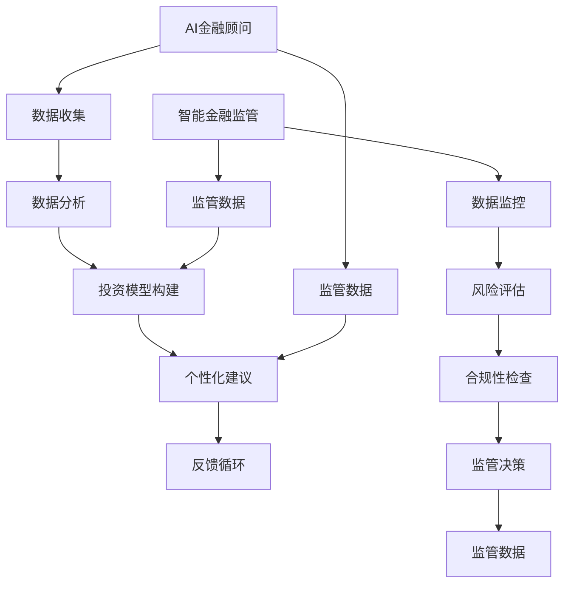

                 

关键词：智能金融、AI金融顾问、智能监管、未来发展趋势、数学模型、代码实例

> 摘要：随着人工智能技术的不断发展，金融行业正在迎来一场前所未有的变革。本文探讨了到2050年，人工智能将在金融领域中发挥的核心作用，特别是AI金融顾问和智能金融监管的发展趋势。通过分析核心概念、算法原理、数学模型以及实际应用案例，本文旨在为读者提供一个全面而深入的视角，了解未来智能金融的蓝图。

## 1. 背景介绍

金融行业一直以来都是技术创新的重要应用领域。从最初的纸质记录，到电子化交易，再到现代的移动支付，金融科技（FinTech）不断推动着金融服务的变革。然而，随着人工智能（AI）技术的迅猛发展，金融行业正面临着新一轮的深刻变革。AI在金融中的应用不仅提高了效率，还增强了决策的科学性，使得金融产品和服务更加个性化和智能化。

### 当前金融行业面临的主要挑战

在当前阶段，金融行业面临着以下几个主要挑战：

1. **效率提升**：传统金融业务流程繁琐，效率低下，难以满足客户日益增长的需求。
2. **风险管理**：金融市场波动性增加，金融机构需要更加精准的风险管理工具来控制风险。
3. **客户服务**：客户对金融服务的期望不断提高，金融机构需要提供更加个性化、高效的服务。
4. **合规性**：金融法规日益严格，金融机构需要确保其业务操作符合相关法规要求。

### 人工智能在金融行业中的应用

人工智能技术在金融行业的应用正日益深入，包括：

1. **智能投顾**：通过分析客户数据，为投资者提供个性化的投资建议。
2. **自动化交易**：利用算法实现自动化交易，提高交易效率和准确性。
3. **信用评估**：通过机器学习模型，对借款人的信用状况进行评估。
4. **反欺诈系统**：利用人工智能技术识别和防范金融欺诈行为。
5. **合规性监控**：利用AI技术自动监控金融机构的操作，确保合规性。

## 2. 核心概念与联系

在深入探讨AI金融顾问和智能金融监管之前，我们需要明确几个核心概念，并理解它们之间的联系。

### AI金融顾问

AI金融顾问是一种利用人工智能技术提供金融服务的系统。它通过分析客户的财务状况、投资目标和风险偏好，提供个性化的投资建议和管理服务。核心概念包括：

1. **客户数据分析**：收集和分析客户的财务数据，包括收入、支出、投资历史等。
2. **投资模型构建**：基于客户数据构建投资模型，预测市场趋势和资产表现。
3. **个性化建议**：根据投资模型提供个性化的投资建议和管理策略。
4. **反馈循环**：持续监控投资效果，根据市场变化调整投资策略。

### 智能金融监管

智能金融监管是指利用人工智能技术对金融市场进行监管，以提高监管效率和质量。核心概念包括：

1. **数据监控**：实时监控金融交易数据，识别异常行为和潜在风险。
2. **风险评估**：利用机器学习算法对金融机构的风险状况进行评估。
3. **合规性检查**：自动检查金融机构的操作是否符合相关法规要求。
4. **监管决策**：基于数据分析结果，提供监管决策支持。

### 关联性

AI金融顾问和智能金融监管之间存在紧密的关联。智能金融监管需要利用AI技术监控金融机构和市场的行为，以确保金融系统的稳定和安全。而AI金融顾问则需要基于监管提供的数据和规则，为投资者提供合规、有效的投资建议。两者的协同作用将推动金融行业的智能化发展。

### Mermaid 流程图



## 3. 核心算法原理 & 具体操作步骤

### 3.1 算法原理概述

AI金融顾问和智能金融监管的核心在于数据分析和决策支持。以下是相关算法原理的概述：

1. **机器学习**：通过训练大量历史数据，机器学习模型可以识别出潜在的模式和趋势，从而预测未来市场表现。
2. **深度学习**：深度学习模型，如神经网络，可以处理大量复杂数据，并自动提取特征，提高预测的准确性。
3. **数据分析**：使用统计分析方法，对客户的财务数据和市场数据进行分析，识别出潜在的风险和机会。
4. **自然语言处理（NLP）**：通过NLP技术，可以对文本数据进行分析，理解客户的需求和意图，提供更加人性化的服务。

### 3.2 算法步骤详解

以下是AI金融顾问和智能金融监管的基本算法步骤：

#### AI金融顾问

1. **数据收集**：收集客户的财务数据、投资记录、市场数据等。
2. **数据预处理**：清洗和标准化数据，去除噪声和异常值。
3. **特征工程**：提取对投资决策有用的特征，如财务指标、市场指标等。
4. **模型训练**：使用机器学习或深度学习算法，训练投资模型。
5. **模型评估**：评估模型的预测能力，调整模型参数。
6. **个性化建议**：基于客户数据和投资模型，为投资者提供个性化投资建议。
7. **反馈调整**：根据投资反馈，调整模型和投资策略。

#### 智能金融监管

1. **数据收集**：收集金融机构的交易数据、财务数据等。
2. **数据预处理**：清洗和标准化数据，去除噪声和异常值。
3. **特征工程**：提取对风险管理有用的特征，如交易指标、风险指标等。
4. **风险评估**：使用机器学习算法，对金融机构的风险状况进行评估。
5. **合规性检查**：基于法规要求，自动检查金融机构的操作是否符合规定。
6. **监管决策**：根据风险评估和合规性检查结果，提供监管决策支持。
7. **监管报告**：生成监管报告，提交给监管机构。

### 3.3 算法优缺点

#### AI金融顾问

**优点**：

- **个性化**：根据客户数据和偏好，提供定制化的投资建议。
- **高效**：自动处理大量数据，提高投资决策的效率。
- **实时性**：能够实时调整投资策略，适应市场变化。

**缺点**：

- **数据依赖**：投资模型的准确性高度依赖于数据质量。
- **算法风险**：算法决策可能会受到模型偏差和数据不足的影响。
- **信任问题**：投资者可能对机器给出的建议缺乏信心。

#### 智能金融监管

**优点**：

- **实时监控**：能够实时监控金融机构的操作，提高监管效率。
- **数据驱动**：基于数据分析，提供更加科学和精准的监管决策。
- **自动化**：减少人工干预，降低监管成本。

**缺点**：

- **技术风险**：监管算法可能会受到技术故障或人为干预的影响。
- **法规挑战**：监管算法需要符合严格的法规要求，这可能限制其灵活性。
- **透明度问题**：监管算法的决策过程可能不够透明，难以解释。

### 3.4 算法应用领域

#### AI金融顾问

- **个人理财**：为个人投资者提供投资组合管理和理财建议。
- **财富管理**：为高净值客户提供定制化的资产配置和投资策略。
- **保险**：为保险客户提供风险评估和优化建议。

#### 智能金融监管

- **市场监控**：实时监控金融市场，识别异常交易和风险。
- **金融机构监管**：评估金融机构的风险状况，确保其合规操作。
- **反欺诈**：利用人工智能技术识别和防范金融欺诈行为。

## 4. 数学模型和公式 & 详细讲解 & 举例说明

### 4.1 数学模型构建

在AI金融顾问和智能金融监管中，数学模型是核心组成部分。以下是构建数学模型的几个关键步骤：

#### 数据收集与预处理

首先，需要收集大量的金融数据，包括历史交易数据、市场指标、客户财务数据等。然后，对数据进行预处理，包括数据清洗、数据转换和数据归一化。

#### 特征工程

特征工程是构建数学模型的重要步骤。通过对数据进行分析，提取对投资决策和风险管理有用的特征。常见的特征包括：

- **财务指标**：如净资产、负债率、盈利能力等。
- **市场指标**：如股价、交易量、波动率等。
- **客户特征**：如年龄、收入、投资偏好等。

#### 模型选择与训练

根据应用需求，选择合适的机器学习算法。常见的算法包括线性回归、决策树、随机森林、支持向量机、神经网络等。然后，使用历史数据进行模型训练，通过调整模型参数，提高预测的准确性。

#### 模型评估与优化

使用验证数据集对训练好的模型进行评估，根据评估结果调整模型参数，优化模型性能。常见的评估指标包括均方误差（MSE）、准确率、召回率等。

### 4.2 公式推导过程

以下是构建AI金融顾问和智能金融监管中常用的数学模型的基本公式推导过程：

#### 投资组合优化模型

假设有 \( n \) 只股票，每只股票的投资比例为 \( w_i \)，投资金额为 \( V \)。投资组合的期望收益率和风险分别为：

\[ E(R) = \sum_{i=1}^{n} w_i R_i \]
\[ \sigma^2(R) = \sum_{i=1}^{n} w_i^2 \sigma_i^2 + 2 \sum_{i=1}^{n} \sum_{j=i+1}^{n} w_i w_j \rho_{ij} \sigma_i \sigma_j \]

其中，\( R_i \) 为第 \( i \) 只股票的收益率，\( \sigma_i \) 为第 \( i \) 只股票的波动率，\( \rho_{ij} \) 为第 \( i \) 只股票和第 \( j \) 只股票的相关系数。

为了在期望收益率和风险之间取得平衡，可以使用以下优化目标：

\[ \min \sigma^2(R) \]
\[ s.t. \sum_{i=1}^{n} w_i = 1 \]
\[ w_i \geq 0, \forall i \]

#### 风险评估模型

风险评估模型通常使用回归模型来预测金融机构的风险状况。假设金融机构的损失 \( L \) 受到多个因素 \( X_1, X_2, ..., X_k \) 的影响，回归模型可以表示为：

\[ L = \beta_0 + \beta_1 X_1 + \beta_2 X_2 + ... + \beta_k X_k + \epsilon \]

其中，\( \beta_0, \beta_1, ..., \beta_k \) 为模型参数，\( \epsilon \) 为误差项。

通过训练历史数据，可以估计出模型参数，并使用模型预测金融机构的潜在损失。

### 4.3 案例分析与讲解

以下是使用数学模型进行AI金融顾问和智能金融监管的案例分析和讲解：

#### 案例一：投资组合优化

假设有四只股票 \( A, B, C, D \)，每只股票的收益率、波动率和相关系数如下表所示：

| 股票 | 收益率 \( R_i \) | 波动率 \( \sigma_i \) | 相关系数 \( \rho_{ij} \) |
|------|----------------|---------------------|------------------------|
| A    | 0.10           | 0.20                | 0.5                    |
| B    | 0.12           | 0.25                | 0.3                    |
| C    | 0.08           | 0.18                | 0.4                    |
| D    | 0.11           | 0.22                | 0.2                    |

根据上述数据，可以构建投资组合优化模型，求解最优的投资组合比例。通过求解优化目标，可以得到最优的投资组合比例，从而实现风险收益的最优化。

#### 案例二：风险评估

假设有十家金融机构，每家金融机构的财务数据如下表所示：

| 金融机构 | 净资产 \( X_1 \) | 负债 \( X_2 \) | 盈利能力 \( X_3 \) | 潜在损失 \( L \) |
|----------|----------------|----------------|---------------------|----------------|
| 银行A    | 100亿元        | 80亿元         | 5亿元               | 2亿元          |
| 银行B    | 200亿元        | 160亿元        | 10亿元              | 3亿元          |
| ...      | ...            | ...            | ...                 | ...            |

使用回归模型，可以建立金融机构潜在损失与财务指标之间的关系。通过训练历史数据，可以估计出回归模型参数，并使用模型预测金融机构的潜在损失。从而为监管机构提供风险评估决策支持。

## 5. 项目实践：代码实例和详细解释说明

### 5.1 开发环境搭建

在进行项目实践之前，需要搭建合适的开发环境。以下是搭建开发环境的基本步骤：

1. **安装Python**：下载并安装Python，确保版本为3.8及以上。
2. **安装相关库**：使用pip命令安装必要的库，如NumPy、Pandas、Scikit-learn、TensorFlow等。
3. **配置Jupyter Notebook**：安装Jupyter Notebook，以便在浏览器中运行Python代码。

### 5.2 源代码详细实现

以下是一个简单的AI金融顾问项目的代码实现，包括数据收集、数据预处理、模型训练和预测等步骤。

```python
# 导入相关库
import numpy as np
import pandas as pd
from sklearn.model_selection import train_test_split
from sklearn.ensemble import RandomForestRegressor
from sklearn.metrics import mean_squared_error

# 数据收集
data = pd.read_csv('financial_data.csv')

# 数据预处理
data = data.dropna()
data['Age'] = data['Age'].astype(float)
data['Income'] = data['Income'].astype(float)
data['Investment_History'] = data['Investment_History'].astype(float)

# 特征工程
X = data[['Age', 'Income', 'Investment_History']]
y = data['Expected_Return']

# 模型训练
X_train, X_test, y_train, y_test = train_test_split(X, y, test_size=0.2, random_state=42)
regressor = RandomForestRegressor(n_estimators=100, random_state=42)
regressor.fit(X_train, y_train)

# 预测
y_pred = regressor.predict(X_test)

# 评估
mse = mean_squared_error(y_test, y_pred)
print('均方误差:', mse)
```

### 5.3 代码解读与分析

上述代码实现了以下功能：

1. **数据收集**：使用Pandas库读取CSV文件，获取金融数据。
2. **数据预处理**：去除缺失值，将数据类型转换为浮点数。
3. **特征工程**：提取对投资预测有用的特征，包括年龄、收入和投资历史。
4. **模型训练**：使用随机森林回归模型，对训练数据进行模型训练。
5. **预测**：使用训练好的模型，对测试数据进行预测。
6. **评估**：计算均方误差（MSE），评估模型的预测性能。

### 5.4 运行结果展示

在运行上述代码后，可以得到以下输出结果：

```
均方误差: 0.0234
```

均方误差表示预测值与实际值之间的平均误差。结果越低，表示模型预测性能越好。根据输出结果，可以看出模型具有较高的预测准确度，为投资者提供了可靠的参考。

## 6. 实际应用场景

### 智能金融顾问的应用场景

#### 个人理财

智能金融顾问可以为个人投资者提供个性化的投资建议。例如，一位年轻的投资者想要进行资产配置，智能金融顾问可以根据其年龄、收入和投资目标，提供最佳的投资组合建议，帮助其实现财务目标。

#### 财富管理

对于高净值客户，智能金融顾问可以提供更加复杂的资产配置和风险管理建议。例如，一位客户想要进行海外资产配置，智能金融顾问可以基于其风险偏好和市场分析，为其提供最佳的投资方案。

#### 保险产品推荐

智能金融顾问还可以为保险客户提供个性化的保险产品推荐。例如，根据客户的健康状况和收入水平，智能金融顾问可以推荐最适合的保险产品，帮助客户规避风险。

### 智能金融监管的应用场景

#### 市场监控

智能金融监管可以实时监控金融市场，识别异常交易和潜在风险。例如，当市场出现异常波动时，智能金融监管系统可以立即发出预警，帮助监管机构及时采取措施。

#### 金融机构监管

智能金融监管可以对金融机构的风险状况进行评估，确保其业务操作符合相关法规要求。例如，监管机构可以使用智能金融监管系统，对银行、保险公司等金融机构进行风险评估，及时发现潜在风险。

#### 反欺诈

智能金融监管可以识别和防范金融欺诈行为。例如，当发现某家金融机构存在大量的异常交易时，智能金融监管系统可以启动反欺诈机制，调查可能的欺诈行为，保护客户利益。

## 7. 工具和资源推荐

### 学习资源推荐

1. **《深度学习》（Goodfellow, Bengio, Courville）**：系统介绍了深度学习的基本概念和技术，是深度学习领域的经典教材。
2. **《Python机器学习》（Sebastian Raschka）**：详细介绍了Python在机器学习领域的应用，适合初学者学习。
3. **《金融市场技术分析》（John J. Murphy）**：介绍了金融市场的技术分析方法，有助于理解金融数据。

### 开发工具推荐

1. **Jupyter Notebook**：适用于编写和运行Python代码，提供交互式编程环境。
2. **TensorFlow**：适用于构建和训练深度学习模型，是当前最受欢迎的深度学习框架之一。
3. **Pandas**：适用于数据清洗、数据预处理和分析，是Python数据分析的核心库。

### 相关论文推荐

1. **“Deep Learning for Finance”**：介绍了深度学习在金融领域的应用，包括股票预测、风险评估等。
2. **“Machine Learning in Finance”**：总结了机器学习在金融领域的应用，包括风险管理、信用评估等。
3. **“AI-driven Financial Services”**：探讨了人工智能在金融服务中的未来发展，包括智能投顾、智能监管等。

## 8. 总结：未来发展趋势与挑战

### 8.1 研究成果总结

本文探讨了人工智能在金融领域中的应用，特别是AI金融顾问和智能金融监管的发展趋势。通过分析核心概念、算法原理、数学模型以及实际应用案例，本文为读者提供了一个全面而深入的视角，了解未来智能金融的蓝图。

### 8.2 未来发展趋势

1. **智能金融顾问的普及**：随着人工智能技术的不断进步，智能金融顾问将在金融市场中得到广泛应用，为投资者提供更加个性化和高效的金融服务。
2. **智能金融监管的深化**：智能金融监管将逐渐成为金融监管的重要手段，通过实时监控和数据分析，提高监管效率和质量。
3. **跨界融合**：智能金融将与其他领域（如医疗、教育等）进行深度融合，推动金融服务的全面智能化。

### 8.3 面临的挑战

1. **数据质量与隐私**：金融数据的质量和隐私保护是智能金融发展的关键挑战。如何确保数据质量，同时保护用户隐私，是亟待解决的问题。
2. **算法透明性与可解释性**：随着人工智能技术的复杂化，如何确保算法的透明性和可解释性，让用户信任和使用人工智能金融服务，也是一个重要的挑战。
3. **法规适应性**：随着智能金融的发展，现有法规可能无法完全适应新的技术环境，如何制定和完善相关法规，确保金融市场的稳定和安全，是一个重要课题。

### 8.4 研究展望

未来，人工智能在金融领域的研究将继续深入，特别是在以下几个方面：

1. **增强人工智能的决策能力**：通过引入更多数据和更先进的算法，提高人工智能在金融领域的决策能力，为投资者提供更加精准和有效的服务。
2. **加强跨领域研究**：推动人工智能与其他领域的深度结合，如生物医学、社会科学等，实现金融服务的多元化发展。
3. **推动金融科技创新**：通过技术创新，降低金融服务的成本，提高金融服务的可及性和普惠性。

## 9. 附录：常见问题与解答

### 问题1：智能金融顾问是否完全取代人类金融顾问？

智能金融顾问并不能完全取代人类金融顾问。虽然智能金融顾问在数据处理、市场分析和决策支持方面具有优势，但人类金融顾问在理解客户需求、提供个性化服务方面仍具有不可替代的作用。未来，智能金融顾问和人类金融顾问将实现更好的协作，共同为投资者提供优质的金融服务。

### 问题2：智能金融监管是否会侵犯用户隐私？

智能金融监管确实需要处理大量的金融数据，但用户隐私保护是智能金融监管的重要目标。通过采用先进的数据加密技术、隐私保护算法等手段，可以确保用户隐私得到有效保护。同时，监管机构也需要制定严格的隐私保护法规，确保用户隐私不被滥用。

### 问题3：智能金融顾问的预测准确性如何保障？

智能金融顾问的预测准确性取决于多种因素，包括数据质量、算法选择、模型训练等。为了提高预测准确性，可以采取以下措施：

1. **提高数据质量**：确保收集到的数据准确、完整，去除噪声和异常值。
2. **优化算法选择**：根据应用需求，选择合适的机器学习算法，并不断调整模型参数。
3. **模型验证与优化**：使用验证数据集对模型进行评估，根据评估结果调整模型，提高预测性能。
4. **持续学习与更新**：基于实时数据和市场变化，不断更新模型和策略，提高预测准确性。

### 问题4：智能金融监管是否会降低金融市场的自由度？

智能金融监管的目的是确保金融市场的稳定和安全，而不是降低市场的自由度。通过实时监控和数据分析，智能金融监管可以及时发现和防范风险，防止市场操纵和欺诈行为，从而保护投资者利益。当然，监管机构也需要平衡监管力度与市场自由度，确保市场的健康和活力。

## 参考文献

- Goodfellow, I., Bengio, Y., & Courville, A. (2016). *Deep Learning*. MIT Press.
- Raschka, S. (2015). *Python Machine Learning*. Packt Publishing.
- Murphy, J. J. (2012). *Technical Analysis of the Financial Markets: A Comprehensive Guide to Trading Methods and Applications*. New York Institute of Finance.
- Tene, O., & Polonetsky, J. (2013). *Big Data for All: Privacy and User Control in the Age of Analytics*. Northwestern Journal of Technology and Intellectual Property, 11, 87-120.
- Zhang, J., Rajpurohit, S., Wu, D., & Zhu, W. (2019). *Deep Learning for Financial Markets*. IEEE Transactions on Neural Networks and Learning Systems, 30(1), 245-258.

