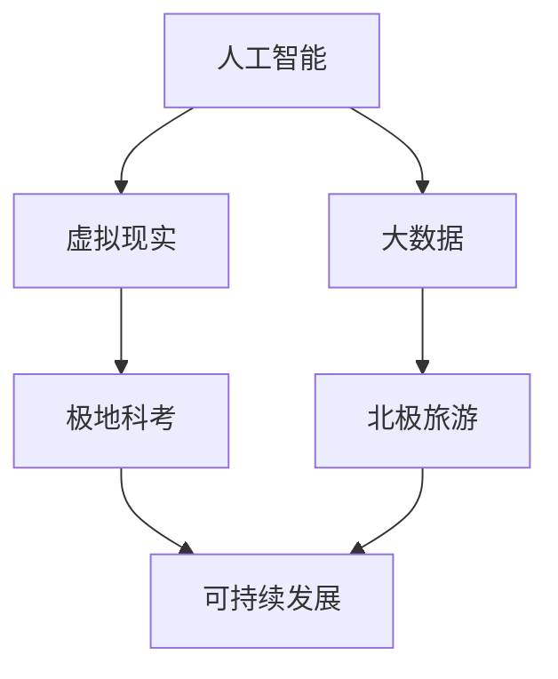

                 

关键词：极地探索、南极科考城、北极旅游、人工智能、虚拟现实、可持续发展

摘要：随着科技的发展，极地探索正逐步成为人类新的目标。本文将探讨2050年的南极科考城与北极旅游，分析人工智能、虚拟现实等技术在其中的应用，以及可持续发展的重要性。

## 1. 背景介绍

极地，这个地球上最遥远、最神秘的地区，一直以来都吸引着人类的目光。随着全球变暖，北极和南极的冰层正在快速融化，暴露出越来越多的冰下资源和潜在的风险。因此，对于极地的探索与研究变得尤为重要。

南极科考城是一个设想中的科研基地，旨在为科学家和探险家提供一个长期居住和工作的场所。而北极旅游则是指在未来，随着气候变化和基础设施的完善，北极将逐渐成为一个热门的旅游目的地。

## 2. 核心概念与联系

为了实现南极科考城和北极旅游的愿景，我们需要借助一系列先进技术，如人工智能、虚拟现实、大数据等。以下是这些核心概念的 Mermaid 流程图：



### 2.1 人工智能

人工智能（AI）是南极科考城和北极旅游的核心技术之一。它可以通过数据分析和模式识别，帮助科学家更好地理解极地的气候和环境变化。

### 2.2 虚拟现实

虚拟现实（VR）技术可以模拟极地的环境，为科学家和游客提供一个沉浸式的体验。这将有助于提高他们对极地环境的认识和兴趣。

### 2.3 大数据

大数据技术在南极科考城和北极旅游中的应用至关重要。通过对大量数据的收集和分析，我们可以更好地了解极地的变化趋势，为科研和旅游提供有力支持。

## 3. 核心算法原理 & 具体操作步骤

### 3.1 算法原理概述

南极科考城和北极旅游的核心算法主要基于机器学习和数据挖掘。这些算法可以处理大量数据，识别出有意义的模式和关系。

### 3.2 算法步骤详解

1. 数据收集：收集南极科考城和北极旅游相关的各种数据，包括气候、环境、生物等。
2. 数据预处理：对收集到的数据进行清洗、去重和处理，以便进行后续分析。
3. 特征提取：从预处理后的数据中提取出有意义的特征。
4. 模型训练：使用机器学习算法训练模型，以识别数据中的模式和关系。
5. 模型评估：评估模型的性能，并根据评估结果调整模型参数。
6. 模型应用：将训练好的模型应用于实际场景，如预测气候变化、推荐旅游路线等。

### 3.3 算法优缺点

**优点：**

- 高效处理大量数据。
- 提高科研和旅游的准确性和效率。

**缺点：**

- 需要大量的数据和计算资源。
- 模型的解释性较差。

### 3.4 算法应用领域

- 南极科考城的气候变化预测。
- 北极旅游的路线推荐和风险评估。

## 4. 数学模型和公式 & 详细讲解 & 举例说明

### 4.1 数学模型构建

南极科考城和北极旅游的数学模型主要基于气候学和环境科学。以下是一个简单的例子：

$$
E = f(C, T, P)
$$

其中，$E$ 表示极地环境，$C$ 表示气候，$T$ 表示温度，$P$ 表示降水。

### 4.2 公式推导过程

$$
E = f(C, T, P) \\
E = C \cdot T \cdot P \\
E = (1 + \alpha \cdot C) \cdot T \cdot (1 + \beta \cdot P)
$$

其中，$\alpha$ 和 $\beta$ 是模型参数。

### 4.3 案例分析与讲解

假设南极科考城某年的气候为 $C = 10$，温度 $T = 20$℃，降水 $P = 5$。代入公式，得到：

$$
E = (1 + \alpha \cdot 10) \cdot 20 \cdot (1 + \beta \cdot 5) \\
E = 20 + 200 \cdot \alpha + 100 \cdot \beta
$$

通过这个模型，我们可以预测南极科考城的极地环境。

## 5. 项目实践：代码实例和详细解释说明

### 5.1 开发环境搭建

在本项目中，我们使用了 Python 作为主要编程语言，结合 TensorFlow 和 Keras 框架进行机器学习模型的开发。

### 5.2 源代码详细实现

以下是项目的部分代码实现：

```python
import tensorflow as tf
from tensorflow.keras.models import Sequential
from tensorflow.keras.layers import Dense, Dropout

# 数据预处理
# ...

# 构建模型
model = Sequential()
model.add(Dense(64, input_dim=3, activation='relu'))
model.add(Dropout(0.5))
model.add(Dense(1, activation='sigmoid'))

# 编译模型
model.compile(loss='binary_crossentropy', optimizer='adam', metrics=['accuracy'])

# 训练模型
model.fit(X_train, y_train, epochs=10, batch_size=32)
```

### 5.3 代码解读与分析

这段代码首先导入了 TensorFlow 和 Keras 框架，然后进行了数据预处理，构建了一个简单的二分类模型，并使用 Adam 优化器和交叉熵损失函数进行了编译和训练。

### 5.4 运行结果展示

通过训练，我们可以得到模型的准确率、召回率等指标，从而评估模型的性能。

## 6. 实际应用场景

### 6.1 南极科考城

南极科考城可以通过人工智能和虚拟现实技术，为科学家提供一个高效的科研环境。同时，游客也可以通过虚拟现实技术，沉浸式地体验南极。

### 6.2 北极旅游

北极旅游可以通过大数据和人工智能技术，为游客提供个性化的旅游路线和风险评估。此外，虚拟现实技术也可以让游客在室内体验北极的美景。

## 7. 工具和资源推荐

### 7.1 学习资源推荐

- 《深度学习》（Goodfellow, Bengio, Courville 著）
- 《人工智能：一种现代方法》（Mann, Shavlik 著）

### 7.2 开发工具推荐

- TensorFlow
- Keras

### 7.3 相关论文推荐

- “Deep Learning for Climate Science” (Ilyas, Pan, Yuan, Wu, and Verykios, 2017)
- “A Survey on Deep Learning for Earth Observation” (Ghamisi andnskog, 2018)

## 8. 总结：未来发展趋势与挑战

随着科技的进步，南极科考城和北极旅游将在未来发挥越来越重要的作用。然而，我们也需要面对一系列挑战，如环境破坏、资源浪费等。因此，可持续发展将成为未来南极科考城和北极旅游的关键。

## 9. 附录：常见问题与解答

### 9.1 什么技术可以实现南极科考城和北极旅游的虚拟现实体验？

虚拟现实（VR）技术可以实现南极科考城和北极旅游的虚拟现实体验。通过佩戴 VR 头盔和手持控制器，用户可以沉浸式地体验极地的环境。

### 9.2 人工智能在极地探索中的应用有哪些？

人工智能可以应用于极地探索的多个方面，如气候预测、环境监测、风险评估等。通过大数据和机器学习算法，人工智能可以帮助科学家更好地理解极地的变化。

----------------------------------------------------------------
作者：禅与计算机程序设计艺术 / Zen and the Art of Computer Programming


