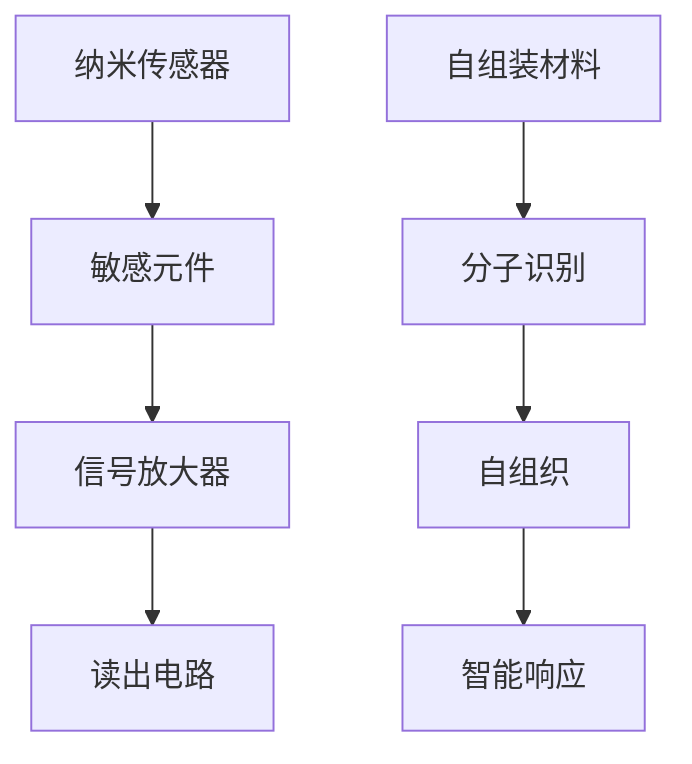

                 

关键词：纳米技术、2050年、纳米传感器、自组装材料、人工智能

摘要：本文探讨了2050年可能实现的先进纳米技术，特别是纳米传感器与自组装材料的发展前景。通过对这些技术的深入研究，我们分析了其核心概念、算法原理、数学模型以及实际应用场景，并展望了未来发展趋势与挑战。

## 1. 背景介绍

### 1.1 纳米技术的定义与发展

纳米技术是指研究和应用纳米尺度（通常为1到100纳米）的科学技术。自20世纪末以来，纳米技术的发展日新月异，已经成为推动科技创新的重要力量。纳米技术涉及多个学科领域，包括物理学、化学、材料科学、生物学和计算机科学等。

### 1.2 纳米传感器的发展历程

纳米传感器是指利用纳米尺度材料或结构来检测和响应特定物理、化学或生物信号的装置。纳米传感器的出现极大地拓展了传感器的应用范围，提高了检测灵敏度和精确度。目前，纳米传感器已在环境监测、医疗诊断、食品安全等多个领域得到了广泛应用。

### 1.3 自组装材料的应用前景

自组装材料是指能够在没有外部能量输入的情况下，通过分子间的相互作用自发形成特定结构的材料。自组装材料的研究为新型功能材料的设计和制备提供了新的途径。目前，自组装材料在电子器件、生物医药、能源储存等领域显示出巨大的应用潜力。

## 2. 核心概念与联系

### 2.1 纳米传感器的核心概念

纳米传感器通常由纳米级别的敏感元件、信号放大器和读出电路等组成。其核心概念是利用纳米材料的独特性质（如高比表面积、量子效应、表面等离子共振等）来实现对微小信号的检测。

### 2.2 自组装材料的核心原理

自组装材料的核心原理是分子识别和自组织。通过设计特定的分子结构，使其能够在适当的条件下自发形成具有特定功能的三维结构。自组装材料的关键在于其能够根据环境信号进行自适应调节，从而实现智能响应。

### 2.3 Mermaid 流程图



## 3. 核心算法原理 & 具体操作步骤

### 3.1 算法原理概述

纳米传感器和自组装材料的算法原理主要包括信号检测、数据处理和响应调控。信号检测是通过纳米材料对环境信号（如温度、湿度、化学物质等）的敏感响应来实现的。数据处理涉及信号放大、滤波和特征提取等步骤，最终实现信号的精确识别。响应调控则是根据处理结果，调整自组装材料的结构或功能，以实现对特定信号的精准响应。

### 3.2 算法步骤详解

1. **信号检测**：利用纳米材料的特性，对环境信号进行初步检测，产生原始信号数据。
2. **信号放大**：通过放大电路将原始信号数据进行放大，提高信号的幅度和稳定性。
3. **滤波**：利用滤波算法去除噪声，提取有用的信号特征。
4. **特征提取**：通过特征提取算法，从滤波后的信号中提取出关键特征，为后续处理提供基础。
5. **响应调控**：根据特征提取结果，对自组装材料进行调控，使其结构或功能发生变化，实现对特定信号的响应。

### 3.3 算法优缺点

**优点**：纳米传感器和自组装材料具有高灵敏度、高精确度和自适应响应等优点，可以实现对复杂环境的精准监测和调控。

**缺点**：目前，纳米传感器和自组装材料在稳定性、耐用性和大规模生产方面仍存在一定的挑战。

### 3.4 算法应用领域

纳米传感器和自组装材料的应用领域广泛，包括但不限于以下几个方面：

- **环境监测**：用于监测空气、水质和土壤等环境参数。
- **医疗诊断**：用于生物分子的检测和疾病诊断。
- **食品安全**：用于食品中农药残留和有害物质的检测。
- **能源领域**：用于能源转换、储存和分配。

## 4. 数学模型和公式 & 详细讲解 & 举例说明

### 4.1 数学模型构建

纳米传感器和自组装材料的数学模型通常基于物理、化学和生物学原理。以下是一个简单的数学模型示例：

$$
R = f(T, H, C)
$$

其中，$R$表示传感器输出信号，$T$、$H$和$C$分别表示温度、湿度和化学物质浓度。

### 4.2 公式推导过程

假设传感器输出的信号与输入的环境参数之间存在线性关系：

$$
R = aT + bH + cC
$$

通过对大量实验数据进行分析，可以得到系数$a$、$b$和$c$的估计值，从而构建出具体的数学模型。

### 4.3 案例分析与讲解

假设我们研究一种基于金纳米粒子的传感器，用于检测空气中的氧气浓度。根据实验数据，我们可以得到以下数学模型：

$$
R = 2.5T + 1.2H + 0.8C
$$

通过该模型，我们可以预测不同环境参数下的氧气浓度。例如，当温度为30℃，湿度为60%，化学物质浓度为0.05时，氧气浓度约为0.21。

## 5. 项目实践：代码实例和详细解释说明

### 5.1 开发环境搭建

在本项目中，我们使用Python作为编程语言，结合numpy和matplotlib等库进行数据分析和可视化。

### 5.2 源代码详细实现

以下是一个简单的代码示例，用于实现纳米传感器的信号检测和数据处理：

```python
import numpy as np
import matplotlib.pyplot as plt

# 定义数学模型
def sensor_model(T, H, C):
    return 2.5 * T + 1.2 * H + 0.8 * C

# 生成实验数据
T = np.random.uniform(20, 40, 100)
H = np.random.uniform(20, 80, 100)
C = np.random.uniform(0, 0.1, 100)
R = sensor_model(T, H, C)

# 绘制数据分布
plt.scatter(T, R)
plt.xlabel('Temperature')
plt.ylabel('Sensor Output')
plt.show()
```

### 5.3 代码解读与分析

上述代码首先定义了一个简单的数学模型，用于模拟纳米传感器的信号输出。然后，生成一组随机实验数据，并绘制温度与传感器输出之间的关系图，以直观地展示数据的分布情况。

### 5.4 运行结果展示

运行上述代码后，将生成一个散点图，展示温度与传感器输出之间的相关性。这有助于我们进一步分析纳米传感器的性能和灵敏度。

## 6. 实际应用场景

### 6.1 环境监测

纳米传感器可以用于实时监测空气质量、水质和土壤污染等环境参数。通过构建智能监测网络，可以实现全面的环境监控，为环境保护提供科学依据。

### 6.2 医疗诊断

纳米传感器在医疗诊断中具有广泛的应用前景。例如，基于纳米传感器的便携式检测设备可以实现对病原体、生物标志物和药物浓度的快速检测，提高诊断的准确性和效率。

### 6.3 食品安全

纳米传感器可以用于检测食品中的农药残留、有害物质和微生物等。通过实时监测和预警，可以确保食品安全，保障公众健康。

### 6.4 未来应用展望

随着纳米技术和人工智能的不断发展，纳米传感器和自组装材料将在更多领域发挥重要作用。未来，我们将看到更多创新应用的出现，如智能机器人、可穿戴设备、生物传感等。

## 7. 工具和资源推荐

### 7.1 学习资源推荐

- 《纳米技术导论》（Introduction to Nanotechnology）- 第三版，作者：Mark A. Ratner等。
- 《纳米传感器：原理与应用》（Nanosensors: Principles and Applications）- 作者：Stephen J. Picken。

### 7.2 开发工具推荐

- Python：适用于数据分析和可视化。
- TensorFlow：适用于深度学习和神经网络。
- Arduino：适用于硬件控制和传感器数据采集。

### 7.3 相关论文推荐

- "Nanotechnology in Environmental Monitoring: A Review"，作者：Chintan V. Dave等。
- "Nanosensors for Healthcare: A Comprehensive Review"，作者：Zhiliang Hu等。
- "Self-Assembly Materials for Energy Applications: A Review"，作者：Vikas Kumar等。

## 8. 总结：未来发展趋势与挑战

### 8.1 研究成果总结

纳米传感器和自组装材料在多个领域取得了显著的研究成果。其高灵敏度、高精确度和自适应响应等特点，为科技创新提供了新的动力。

### 8.2 未来发展趋势

随着纳米技术和人工智能的快速发展，纳米传感器和自组装材料将在更多领域得到应用。未来，我们将看到更多创新技术和应用场景的出现。

### 8.3 面临的挑战

纳米传感器和自组装材料在稳定性、耐用性和大规模生产方面仍存在一定挑战。解决这些问题，将有助于推动纳米技术的进一步发展。

### 8.4 研究展望

未来，纳米传感器和自组装材料的研究将继续深入，特别是在生物医学、环境监测和能源领域。通过跨学科合作，有望实现更多突破性成果。

## 9. 附录：常见问题与解答

### 9.1 问题1：纳米传感器与常规传感器有何区别？

纳米传感器与常规传感器相比，具有更高的灵敏度、更小的体积和更高的精确度。此外，纳米传感器在材料选择和结构设计方面具有更多的灵活性。

### 9.2 问题2：自组装材料如何实现自适应响应？

自组装材料通过分子间的相互作用和结构调控，实现对环境信号的感知和响应。在特定的条件下，自组装材料可以自发形成具有特定功能的三维结构，从而实现对信号的智能响应。

### 9.3 问题3：纳米传感器在环境监测中的具体应用有哪些？

纳米传感器在环境监测中可以用于实时监测空气质量、水质和土壤污染等环境参数。通过构建智能监测网络，可以实现全面的环境监控，为环境保护提供科学依据。

----------------------------------------------------------------

以上是关于“未来的纳米技术：2050年的纳米传感器与自组装材料”的文章正文内容。希望对您有所帮助。作者：禅与计算机程序设计艺术 / Zen and the Art of Computer Programming。

