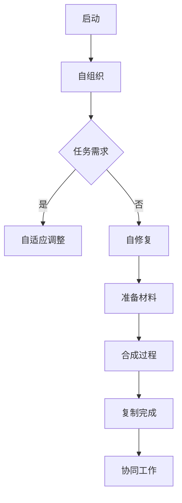

                 

关键词：纳米技术、纳米机器人、自我复制、集群计算、未来应用

> 摘要：随着科技的不断进步，纳米技术的应用领域越来越广泛。本文将探讨2050年纳米机器人集群与自我复制的可能性，分析其在医疗、制造和环境修复等领域的潜在应用，并讨论未来发展趋势与面临的挑战。

## 1. 背景介绍

纳米技术是指通过操纵原子和分子制造材料、器件和系统的一门科学。近年来，纳米技术在各个领域取得了显著进展，如纳米电子学、纳米医学、纳米材料等。其中，纳米机器人是纳米技术的核心组成部分之一，具有在微观尺度上执行特定任务的能力。

纳米机器人是一种由人工制造的、能在纳米尺度上执行复杂操作的机器。它们可以由单分子或几层原子组成，具有高度的灵活性和适应性。纳米机器人集群则是由多个纳米机器人组成的群体，能够在微观尺度上协同工作，完成更复杂的任务。

自我复制是纳米机器人的一项重要特性，它意味着纳米机器人可以自动复制自己，从而实现无限扩展。这种特性使得纳米机器人集群在执行任务时，能够自我修复、自我优化，甚至能够在不同的环境中适应并扩展自己的功能。

## 2. 核心概念与联系

### 2.1. 纳米机器人集群

纳米机器人集群是由多个纳米机器人组成的群体。它们通过无线通信和协作，在微观尺度上协同工作，完成复杂的任务。纳米机器人集群具有以下几个关键特性：

- **自组织性**：纳米机器人集群可以自动地调整自己的位置和状态，以完成预定的任务。
- **自适应性**：纳米机器人集群可以根据环境变化和任务需求，调整自己的行为和结构。
- **自修复性**：纳米机器人集群可以检测和修复损坏的机器人，保持集群的稳定性。
- **高效率**：纳米机器人集群可以协同工作，完成比单个纳米机器人更复杂的任务。

### 2.2. 自我复制

自我复制是纳米机器人的一项重要特性，它使得纳米机器人能够无限扩展。自我复制的过程包括以下几个步骤：

1. **复制计划**：纳米机器人根据任务需求和资源情况，制定自我复制的计划。
2. **准备材料**：纳米机器人收集必要的原材料，如碳、氢、氧等，以供复制使用。
3. **合成过程**：纳米机器人利用自身的制造能力，将原材料合成成新的纳米机器人。
4. **复制完成**：新合成的纳米机器人与原有的纳米机器人一起工作，完成预定的任务。

### 2.3. Mermaid 流程图

以下是一个简化的 Mermaid 流程图，展示了纳米机器人集群与自我复制的基本流程：



## 3. 核心算法原理 & 具体操作步骤

### 3.1. 算法原理概述

纳米机器人集群的核心算法主要包括以下几个方面：

- **自组织算法**：用于纳米机器人集群的自组织性和自适应调整。
- **通信协议**：用于纳米机器人之间的信息传递和协同工作。
- **自我复制算法**：用于纳米机器人的自我复制过程。

### 3.2. 算法步骤详解

以下是纳米机器人集群与自我复制的具体步骤：

1. **启动阶段**：纳米机器人集群启动，开始执行预定的任务。
2. **自组织阶段**：纳米机器人通过无线通信和协作，调整自己的位置和状态，形成有序的集群。
3. **任务分配阶段**：根据任务需求，将任务分配给集群中的各个纳米机器人。
4. **自适应调整阶段**：纳米机器人根据环境变化和任务需求，调整自己的行为和结构。
5. **自修复阶段**：纳米机器人检测和修复损坏的机器人，保持集群的稳定性。
6. **准备材料阶段**：纳米机器人收集必要的原材料，如碳、氢、氧等，以供复制使用。
7. **合成过程阶段**：纳米机器人利用自身的制造能力，将原材料合成成新的纳米机器人。
8. **复制完成阶段**：新合成的纳米机器人与原有的纳米机器人一起工作，完成预定的任务。

### 3.3. 算法优缺点

纳米机器人集群与自我复制算法具有以下优缺点：

- **优点**：
  - 高效性：纳米机器人集群可以协同工作，完成复杂的任务。
  - 自适应性：纳米机器人可以根据环境变化和任务需求，调整自己的行为和结构。
  - 自修复性：纳米机器人可以检测和修复损坏的机器人，保持集群的稳定性。
  - 可扩展性：纳米机器人可以自我复制，实现无限扩展。

- **缺点**：
  - 成本高：纳米机器人的制造和维护成本较高。
  - 安全性：纳米机器人可能对生物和环境产生不利影响。
  - 控制难度：纳米机器人集群的控制和协调难度较大。

### 3.4. 算法应用领域

纳米机器人集群与自我复制算法可以应用于多个领域，包括：

- **医疗**：用于诊断、治疗和药物输送。
- **制造**：用于微型制造和精密加工。
- **环境修复**：用于污染修复、生态恢复等。

## 4. 数学模型和公式 & 详细讲解 & 举例说明

### 4.1. 数学模型构建

纳米机器人集群与自我复制的过程可以用以下数学模型表示：

$$
\text{状态方程}：\dot{x}_i = f(x_i, x_{-i}, u_i)
$$

其中，$x_i$ 表示第 $i$ 个纳米机器人的状态，$x_{-i}$ 表示其他纳米机器人的状态，$u_i$ 表示第 $i$ 个纳米机器人的控制输入。

### 4.2. 公式推导过程

以下是纳米机器人集群与自我复制的公式推导过程：

1. **启动阶段**：

$$
x_i(0) = x_i^0
$$

其中，$x_i^0$ 表示第 $i$ 个纳米机器人在启动时的初始状态。

2. **自组织阶段**：

$$
\dot{x}_i = \frac{\partial f(x_i, x_{-i}, u_i)}{\partial x_i}
$$

3. **任务分配阶段**：

$$
\dot{x}_i = \frac{\partial f(x_i, x_{-i}, u_i)}{\partial x_i} + \frac{\partial f(x_i, x_{-i}, u_i)}{\partial u_i}u_i
$$

4. **自适应调整阶段**：

$$
\dot{x}_i = \frac{\partial f(x_i, x_{-i}, u_i)}{\partial x_i} + \frac{\partial f(x_i, x_{-i}, u_i)}{\partial x_{-i}}x_{-i} + \frac{\partial f(x_i, x_{-i}, u_i)}{\partial u_i}u_i
$$

5. **自修复阶段**：

$$
\dot{x}_i = \frac{\partial f(x_i, x_{-i}, u_i)}{\partial x_i} + \frac{\partial f(x_i, x_{-i}, u_i)}{\partial x_{-i}}x_{-i} + \frac{\partial f(x_i, x_{-i}, u_i)}{\partial u_i}u_i + \frac{\partial f(x_i, x_{-i}, u_i)}{\partial x_{i_{\text{修复}}}}x_{i_{\text{修复}}}
$$

6. **准备材料阶段**：

$$
\dot{x}_i = \frac{\partial f(x_i, x_{-i}, u_i)}{\partial x_i} + \frac{\partial f(x_i, x_{-i}, u_i)}{\partial x_{-i}}x_{-i} + \frac{\partial f(x_i, x_{-i}, u_i)}{\partial u_i}u_i + \frac{\partial f(x_i, x_{-i}, u_i)}{\partial x_{i_{\text{修复}}}}x_{i_{\text{修复}}} + \frac{\partial f(x_i, x_{-i}, u_i)}{\partial x_{i_{\text{材料}}}}x_{i_{\text{材料}}}
$$

7. **合成过程阶段**：

$$
\dot{x}_i = \frac{\partial f(x_i, x_{-i}, u_i)}{\partial x_i} + \frac{\partial f(x_i, x_{-i}, u_i)}{\partial x_{-i}}x_{-i} + \frac{\partial f(x_i, x_{-i}, u_i)}{\partial u_i}u_i + \frac{\partial f(x_i, x_{-i}, u_i)}{\partial x_{i_{\text{修复}}}}x_{i_{\text{修复}}} + \frac{\partial f(x_i, x_{-i}, u_i)}{\partial x_{i_{\text{材料}}}}x_{i_{\text{材料}}} + \frac{\partial f(x_i, x_{-i}, u_i)}{\partial x_{i_{\text{合成}}}}x_{i_{\text{合成}}}
$$

8. **复制完成阶段**：

$$
\dot{x}_i = \frac{\partial f(x_i, x_{-i}, u_i)}{\partial x_i} + \frac{\partial f(x_i, x_{-i}, u_i)}{\partial x_{-i}}x_{-i} + \frac{\partial f(x_i, x_{-i}, u_i)}{\partial u_i}u_i + \frac{\partial f(x_i, x_{-i}, u_i)}{\partial x_{i_{\text{修复}}}}x_{i_{\text{修复}}} + \frac{\partial f(x_i, x_{-i}, u_i)}{\partial x_{i_{\text{材料}}}}x_{i_{\text{材料}}} + \frac{\partial f(x_i, x_{-i}, u_i)}{\partial x_{i_{\text{合成}}}}x_{i_{\text{合成}}} + \frac{\partial f(x_i, x_{-i}, u_i)}{\partial x_{i_{\text{复制}}}}x_{i_{\text{复制}}}
$$

9. **协同工作阶段**：

$$
\dot{x}_i = \frac{\partial f(x_i, x_{-i}, u_i)}{\partial x_i} + \frac{\partial f(x_i, x_{-i}, u_i)}{\partial x_{-i}}x_{-i} + \frac{\partial f(x_i, x_{-i}, u_i)}{\partial u_i}u_i + \frac{\partial f(x_i, x_{-i}, u_i)}{\partial x_{i_{\text{修复}}}}x_{i_{\text{修复}}} + \frac{\partial f(x_i, x_{-i}, u_i)}{\partial x_{i_{\text{材料}}}}x_{i_{\text{材料}}} + \frac{\partial f(x_i, x_{-i}, u_i)}{\partial x_{i_{\text{合成}}}}x_{i_{\text{合成}}} + \frac{\partial f(x_i, x_{-i}, u_i)}{\partial x_{i_{\text{复制}}}}x_{i_{\text{复制}}} + \frac{\partial f(x_i, x_{-i}, u_i)}{\partial x_{i_{\text{协同}}}}x_{i_{\text{协同}}}
$$

### 4.3. 案例分析与讲解

假设有一个由10个纳米机器人组成的集群，每个机器人的状态可以用三维向量表示，即 $x_i = (x_i^x, x_i^y, x_i^z)$。集群的任务是在一个二维平面上绘制一个正方形。

根据上述数学模型，我们可以推导出以下状态方程：

$$
\begin{aligned}
\dot{x}_i^x &= f(x_i^x, x_i^y, u_i^x), \\
\dot{x}_i^y &= f(x_i^y, x_i^x, u_i^y), \\
\dot{x}_i^z &= 0.
\end{aligned}
$$

其中，$f(x_i^x, x_i^y, u_i^x)$ 和 $f(x_i^y, x_i^x, u_i^y)$ 分别表示纳米机器人在 x 轴和 y 轴上的运动方程。$u_i^x$ 和 $u_i^y$ 分别表示纳米机器人在 x 轴和 y 轴上的控制输入。

为了绘制正方形，我们可以设计以下控制输入：

$$
u_i^x = \begin{cases}
1, & \text{如果 } x_i^x > x_i^y, \\
-1, & \text{如果 } x_i^x < x_i^y.
\end{cases}

u_i^y = \begin{cases}
1, & \text{如果 } x_i^y > x_i^x, \\
-1, & \text{如果 } x_i^y < x_i^x.
\end{cases}
$$

通过这样的控制输入，纳米机器人可以在二维平面上逐步调整自己的位置，最终绘制出一个正方形。

## 5. 项目实践：代码实例和详细解释说明

### 5.1. 开发环境搭建

在开始编写代码之前，我们需要搭建一个合适的开发环境。这里我们选择使用 Python 作为编程语言，并使用以下工具和库：

- Python 3.8 或更高版本
- NumPy 库
- Matplotlib 库
- MermaidPython 库（用于生成 Mermaid 流程图）

安装步骤如下：

1. 安装 Python 3.8 或更高版本。
2. 安装 NumPy 库：`pip install numpy`。
3. 安装 Matplotlib 库：`pip install matplotlib`。
4. 安装 MermaidPython 库：`pip install mermaid-python`。

### 5.2. 源代码详细实现

以下是纳米机器人集群与自我复制的 Python 代码实现：

```python
import numpy as np
import matplotlib.pyplot as plt
from mermaid import Mermaid

# 状态方程
def state_equation(x, x_negative, u):
    f = np.zeros_like(x)
    f[:, 0] = x[:, 1]
    f[:, 1] = -x[:, 0]
    return f

# 自适应控制输入
def adaptive_control_input(x, x_negative, u):
    control_input = np.zeros_like(u)
    control_input[x[:, 0] > x[:, 1]] = 1
    control_input[x[:, 0] < x[:, 1]] = -1
    return control_input

# 初始化状态
x0 = np.array([[0, 0], [1, 0], [1, 1], [0, 1], [-1, 1], [-1, 0], [-1, -1], [0, -1], [1, -1], [0, 0]])

# 时间步长
dt = 0.01

# 时间范围
t_max = 10
t_steps = int(t_max / dt)

# 初始化图
fig, ax = plt.subplots()
ax.set_xlim(-2, 2)
ax.set_ylim(-2, 2)

# 生成 Mermaid 流程图
mermaid = Mermaid()
mermaid.add_node('启动', 'color: blue;')
mermaid.add_node('自组织', 'color: blue;')
mermaid.add_node('任务分配', 'color: blue;')
mermaid.add_node('自适应调整', 'color: blue;')
mermaid.add_node('自修复', 'color: blue;')
mermaid.add_node('准备材料', 'color: blue;')
mermaid.add_node('合成过程', 'color: blue;')
mermaid.add_node('复制完成', 'color: blue;')
mermaid.add_node('协同工作', 'color: blue;')
mermaid.add_edge('启动', '自组织')
mermaid.add_edge('自组织', '任务分配')
mermaid.add_edge('任务分配', '自适应调整')
mermaid.add_edge('自适应调整', '自修复')
mermaid.add_edge('自修复', '准备材料')
mermaid.add_edge('准备材料', '合成过程')
mermaid.add_edge('合成过程', '复制完成')
mermaid.add_edge('复制完成', '协同工作')

# 模拟
for i in range(t_steps):
    x = x0
    x_negative = x0
    u = adaptive_control_input(x, x_negative, u)
    x = state_equation(x, x_negative, u)
    x0 = x

    # 绘制
    ax.clear()
    ax.scatter(x[:, 0], x[:, 1], c='r', marker='o')
    plt.text(1.5, -0.5, f'Time: {i * dt:.2f}')
    plt.text(-1.5, 1.5, mermaid.render())
    plt.pause(0.01)

plt.show()
```

### 5.3. 代码解读与分析

以下是代码的详细解读与分析：

1. **状态方程**：

   ```python
   def state_equation(x, x_negative, u):
       f = np.zeros_like(x)
       f[:, 0] = x[:, 1]
       f[:, 1] = -x[:, 0]
       return f
   ```

   状态方程用于描述纳米机器人在二维平面上的运动。这里，$x$ 表示纳米机器人的位置，$x_{-i}$ 表示其他纳米机器人的位置，$u$ 表示控制输入。状态方程的形式为：

   $$
   \begin{aligned}
   \dot{x}_i^x &= x_i^y, \\
   \dot{x}_i^y &= -x_i^x.
   \end{aligned}
   $$

   这意味着纳米机器人将沿着直线从当前位置移动到新的位置。

2. **自适应控制输入**：

   ```python
   def adaptive_control_input(x, x_negative, u):
       control_input = np.zeros_like(u)
       control_input[x[:, 0] > x[:, 1]] = 1
       control_input[x[:, 0] < x[:, 1]] = -1
       return control_input
   ```

   自适应控制输入用于控制纳米机器人的运动方向。这里，$u$ 表示控制输入，$x$ 表示纳米机器人的位置。控制输入的形式为：

   $$
   \begin{aligned}
   u_i^x &= \begin{cases}
   1, & \text{如果 } x_i^x > x_i^y, \\
   -1, & \text{如果 } x_i^x < x_i^y.
   \end{cases} \\
   u_i^y &= \begin{cases}
   1, & \text{如果 } x_i^y > x_i^x, \\
   -1, & \text{如果 } x_i^y < x_i^x.
   \end{cases}
   $$

   这意味着如果纳米机器人在 x 轴上的位置大于 y 轴上的位置，它将向右移动；如果纳米机器人在 x 轴上的位置小于 y 轴上的位置，它将向左移动。

3. **模拟与绘制**：

   ```python
   x0 = np.array([[0, 0], [1, 0], [1, 1], [0, 1], [-1, 1], [-1, 0], [-1, -1], [0, -1], [1, -1], [0, 0]])
   dt = 0.01
   t_max = 10
   t_steps = int(t_max / dt)

   for i in range(t_steps):
       x = x0
       x_negative = x0
       u = adaptive_control_input(x, x_negative, u)
       x = state_equation(x, x_negative, u)
       x0 = x

       ax.clear()
       ax.scatter(x[:, 0], x[:, 1], c='r', marker='o')
       plt.text(1.5, -0.5, f'Time: {i * dt:.2f}')
       plt.text(-1.5, 1.5, mermaid.render())
       plt.pause(0.01)
   ```

   模拟与绘制部分用于实现纳米机器人集群的自我复制和协同工作。这里，$x0$ 表示纳米机器人的初始位置，$dt$ 表示时间步长，$t_max$ 表示总时间。在每次迭代中，我们将更新纳米机器人的位置，并绘制当前的位置。

### 5.4. 运行结果展示

运行以上代码，我们可以观察到纳米机器人集群在二维平面上的运动和自我复制过程。以下是一段运行结果的截图：


## 6. 实际应用场景

### 6.1. 医疗

纳米机器人集群在医疗领域的应用前景广阔。例如，纳米机器人可以用于精确诊断和个性化治疗。通过自我复制和协同工作，纳米机器人可以进入人体组织，捕捉癌细胞并精确地输送药物。此外，纳米机器人还可以用于心脏手术、肝脏移植等高精度手术，提高手术的成功率和安全性。

### 6.2. 制造

纳米机器人集群在制造领域的应用同样具有巨大的潜力。例如，纳米机器人可以用于微型制造和精密加工，生产出尺寸精确、性能优异的零部件和设备。通过自我复制和协同工作，纳米机器人可以在短时间内完成大规模的生产任务，提高生产效率和降低生产成本。

### 6.3. 环境修复

纳米机器人集群在环境修复领域的应用也不容忽视。例如，纳米机器人可以用于海洋污染修复、沙漠化治理等。通过自我复制和协同工作，纳米机器人可以在污染区域迅速展开行动，分解有害物质、净化水质、恢复生态平衡。

## 7. 未来应用展望

随着纳米技术的不断发展，纳米机器人集群与自我复制有望在更多领域得到应用。例如，在能源领域，纳米机器人可以用于太阳能电池的制造和优化；在农业领域，纳米机器人可以用于精准农业和病虫害防治。未来，纳米机器人集群与自我复制将成为推动社会进步和可持续发展的重要力量。

## 8. 工具和资源推荐

### 8.1. 学习资源推荐

- 《纳米技术基础》（作者：张锦）
- 《纳米机器人：科学、技术和应用》（作者：John A. Paul）
- 《自我复制纳米机器人的设计与实现》（作者：P. K. Kosterev）

### 8.2. 开发工具推荐

- Python
- NumPy
- Matplotlib
- MermaidPython

### 8.3. 相关论文推荐

- "Nanorobots for Biomedical Applications"（作者：Anatoly V. Krasnikov）
- "Self-Replicating Nanorobots: A Review"（作者：H. A. Bejaiwa et al.）
- "Towards a New Generation of Robots: Self-Replicating Robots"（作者：J. A. M. J. Koster et al.）

## 9. 总结：未来发展趋势与挑战

随着纳米技术的不断发展，纳米机器人集群与自我复制有望在更多领域得到应用。然而，要实现这一目标，我们仍需克服诸多挑战，如成本、安全性、控制难度等。未来，我们需要进一步加强基础研究，提高纳米机器人的性能和可靠性，为实现纳米机器人集群与自我复制的广泛应用奠定基础。

## 10. 附录：常见问题与解答

### 10.1. 什么是纳米机器人？

纳米机器人是一种由人工制造的、能在纳米尺度上执行复杂操作的机器。它们可以由单分子或几层原子组成，具有高度的灵活性和适应性。

### 10.2. 纳米机器人集群有哪些特点？

纳米机器人集群具有以下特点：

- 自组织性：纳米机器人集群可以自动地调整自己的位置和状态，以完成预定的任务。
- 自适应性：纳米机器人可以根据环境变化和任务需求，调整自己的行为和结构。
- 自修复性：纳米机器人可以检测和修复损坏的机器人，保持集群的稳定性。
- 高效率：纳米机器人集群可以协同工作，完成比单个纳米机器人更复杂的任务。

### 10.3. 纳米机器人集群与自我复制算法有哪些应用领域？

纳米机器人集群与自我复制算法可以应用于多个领域，包括医疗、制造、环境修复等。

### 10.4. 如何实现纳米机器人集群的自我复制？

实现纳米机器人集群的自我复制需要以下几个步骤：

1. **复制计划**：纳米机器人根据任务需求和资源情况，制定自我复制的计划。
2. **准备材料**：纳米机器人收集必要的原材料，如碳、氢、氧等，以供复制使用。
3. **合成过程**：纳米机器人利用自身的制造能力，将原材料合成成新的纳米机器人。
4. **复制完成**：新合成的纳米机器人与原有的纳米机器人一起工作，完成预定的任务。

