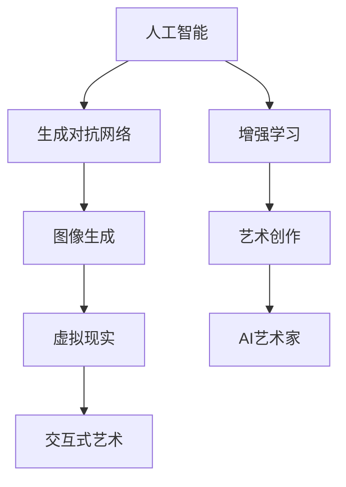

                 

关键词：AI艺术家、虚拟现实、艺术创作、计算机技术、2050年、未来展望

> 摘要：本文探讨了到2050年，随着人工智能和虚拟现实技术的不断进步，AI艺术家在艺术创作领域将发挥重要作用。文章分析了AI艺术家创作的原理、过程、优缺点以及未来艺术创作的趋势和挑战，同时为读者推荐了相关学习资源、开发工具和论文。

## 1. 背景介绍

自20世纪中期以来，计算机技术取得了飞速发展，从简单的计算工具到如今能够模拟人类思维的人工智能系统，计算机在各个领域都发挥了巨大作用。特别是在艺术创作方面，计算机技术已经开始影响传统的绘画、音乐、舞蹈等艺术形式。随着人工智能和虚拟现实技术的不断发展，艺术家们开始探索新的创作方式，AI艺术家也应运而生。

### 1.1 人工智能在艺术创作中的应用

人工智能在艺术创作中的应用主要体现在以下几个方面：

1. **图像生成与编辑**：通过深度学习技术，AI可以生成具有艺术美感的图像。例如，Google的DeepDream可以生成梦幻般的图像，而GAN（生成对抗网络）则可以生成高度逼真的图像。

2. **音乐创作**：AI可以通过分析大量的音乐数据，创作出独特的音乐作品。例如，Google的Magenta项目利用机器学习算法创作音乐。

3. **文学作品生成**：AI可以通过分析大量的文学作品，生成新的故事情节和文本。例如，OpenAI的GPT-3可以生成高质量的文章。

### 1.2 虚拟现实在艺术创作中的应用

虚拟现实技术为艺术家提供了全新的创作空间。通过虚拟现实，艺术家可以创建出超越现实的三维世界，让观众在沉浸式体验中感受艺术的魅力。虚拟现实在艺术创作中的应用主要体现在以下几个方面：

1. **虚拟展览**：艺术家可以在虚拟空间中创建艺术作品，并举办虚拟展览，让观众在线上欣赏。

2. **虚拟音乐会**：艺术家可以在虚拟现实环境中举办音乐会，观众可以通过VR设备参与其中。

3. **交互式艺术**：虚拟现实技术使得艺术作品可以与观众进行互动，从而创造出更加生动的艺术体验。

## 2. 核心概念与联系

在探讨AI艺术家和虚拟现实艺术时，我们需要了解以下几个核心概念：

1. **人工智能**：人工智能是计算机科学的一个分支，旨在使计算机系统具备类似人类智能的能力。

2. **虚拟现实**：虚拟现实是一种通过计算机技术创建的模拟环境，使人们能够沉浸在虚拟空间中。

3. **生成对抗网络（GAN）**：GAN是一种深度学习模型，由生成器和判别器组成，通过相互对抗生成高度逼真的图像。

4. **增强学习**：增强学习是一种机器学习技术，通过不断尝试和错误，使人工智能系统学会在特定环境中实现特定目标。

以下是一个描述AI艺术家与虚拟现实艺术之间关系的Mermaid流程图：



### 2.1 人工智能与艺术创作的联系

人工智能在艺术创作中的应用，主要体现在图像生成、音乐创作和文学创作等方面。通过深度学习技术，AI可以分析大量的艺术作品，从中学习并创作出新的艺术作品。例如，GAN可以通过生成器和判别器的对抗，生成具有艺术美感的图像。

### 2.2 虚拟现实与艺术创作的联系

虚拟现实技术为艺术家提供了全新的创作空间。艺术家可以在虚拟空间中创建艺术作品，并通过交互式技术让观众参与其中。虚拟现实艺术不仅突破了传统的二维艺术形式，还为观众带来了更加沉浸式的艺术体验。

## 3. 核心算法原理 & 具体操作步骤

### 3.1 算法原理概述

在AI艺术创作中，核心算法主要包括生成对抗网络（GAN）和增强学习。以下是这两种算法的简要原理：

#### 3.1.1 生成对抗网络（GAN）

GAN由生成器和判别器组成。生成器的任务是生成逼真的图像，而判别器的任务是判断图像是真实图像还是生成图像。通过生成器和判别器的对抗，生成器不断提高生成图像的质量。

#### 3.1.2 增强学习

增强学习是一种通过不断尝试和错误，使人工智能系统学会在特定环境中实现特定目标的算法。在艺术创作中，增强学习可以用于训练AI艺术家，使其能够根据用户的需求创作出符合预期的艺术作品。

### 3.2 算法步骤详解

#### 3.2.1 生成对抗网络（GAN）

1. **初始化生成器和判别器**：生成器和判别器都是神经网络模型，通常采用多层感知器（MLP）或卷积神经网络（CNN）。

2. **训练生成器**：生成器接收随机噪声作为输入，并尝试生成逼真的图像。判别器对生成图像和真实图像进行判断。

3. **训练判别器**：判别器通过对比生成图像和真实图像，不断调整参数，提高判断准确性。

4. **交替训练**：生成器和判别器交替训练，生成器不断提高生成图像质量，而判别器不断提高判断准确性。

#### 3.2.2 增强学习

1. **环境初始化**：定义艺术创作环境，包括艺术作品的空间、颜色、纹理等属性。

2. **初始状态设定**：设定AI艺术家的初始状态，例如创作风格、技术水平等。

3. **交互式创作**：AI艺术家在环境中进行交互式创作，根据用户反馈调整创作策略。

4. **目标函数优化**：通过优化目标函数，使AI艺术家能够更好地满足用户需求。

### 3.3 算法优缺点

#### 3.3.1 生成对抗网络（GAN）

**优点**：

- **高质量图像生成**：GAN可以通过生成器和判别器的对抗，生成高质量、逼真的图像。
- **多样化创作**：GAN可以生成各种风格和类型的图像，满足不同用户的需求。

**缺点**：

- **训练困难**：GAN的训练过程不稳定，容易出现模式崩溃等问题。
- **计算资源消耗大**：GAN的训练需要大量的计算资源，对硬件性能要求较高。

#### 3.3.2 增强学习

**优点**：

- **自适应性强**：增强学习可以根据用户反馈自适应地调整创作策略。
- **灵活性强**：增强学习可以应用于各种艺术创作任务，具有广泛的应用前景。

**缺点**：

- **训练时间较长**：增强学习的训练过程需要大量的时间，且容易陷入局部最优。
- **需要大量数据**：增强学习需要大量的数据进行训练，对数据的质量和数量有较高要求。

### 3.4 算法应用领域

#### 3.4.1 图像生成

GAN在图像生成领域具有广泛的应用，可以用于生成人脸、风景、动漫等图像。例如，GAN可以用于人脸修复、图像超分辨率、图像风格迁移等任务。

#### 3.4.2 音乐创作

增强学习在音乐创作领域也取得了显著成果，可以用于生成旋律、和声、节奏等音乐元素。例如，Magenta项目利用增强学习算法创作出具有独特风格的音乐作品。

#### 3.4.3 文学作品生成

增强学习在文学作品生成方面也有一定应用，可以用于生成故事情节、文本段落等。例如，OpenAI的GPT-3可以生成高质量的文章。

## 4. 数学模型和公式 & 详细讲解 & 举例说明

### 4.1 数学模型构建

在AI艺术创作中，常用的数学模型主要包括生成对抗网络（GAN）和增强学习。以下是这两个模型的简要介绍：

#### 4.1.1 生成对抗网络（GAN）

GAN的核心是生成器和判别器，两者通过对抗训练实现高质量图像生成。

**生成器模型**：

生成器 \( G : Z \rightarrow X \)

其中，\( Z \) 是噪声向量，\( X \) 是生成图像。

**判别器模型**：

判别器 \( D : X \rightarrow [0, 1] \)

其中，\( X \) 是输入图像，输出是一个概率值，表示图像是真实图像的概率。

**损失函数**：

损失函数通常采用二元交叉熵损失函数：

$$
L_D = -\frac{1}{2} \left( \log(D(x)) + \log(1 - D(G(z))) \right)
$$

$$
L_G = -\log(D(G(z)))
$$

其中，\( x \) 是真实图像，\( G(z) \) 是生成图像。

#### 4.1.2 增强学习

增强学习的目标是使AI艺术家在特定环境中实现特定目标。以下是强化学习的核心组成部分：

**状态空间**：

状态空间 \( S \)

**动作空间**：

动作空间 \( A \)

**奖励函数**：

奖励函数 \( R(s, a) \)

**策略**：

策略 \( \pi(a|s) \)

**价值函数**：

价值函数 \( V(s) \)

**策略迭代**：

策略迭代是一种常用的增强学习方法，其基本思想是不断更新策略，直到收敛。

$$
\pi_{t+1}(a|s) = \arg\max_{a} \left( R(s, a) + \gamma \sum_{s'} P(s'|s, a) V(s') \right)
$$

### 4.2 公式推导过程

以下是对生成对抗网络（GAN）中的损失函数进行推导。

**损失函数推导**：

首先，我们定义生成器和判别器的损失函数：

$$
L_D = -\frac{1}{2} \left( \log(D(x)) + \log(1 - D(G(z))) \right)
$$

$$
L_G = -\log(D(G(z)))
$$

其中，\( x \) 是真实图像，\( G(z) \) 是生成图像。

**损失函数优化**：

我们对损失函数进行优化，以使生成器和判别器在训练过程中达到最佳状态。

对于判别器 \( D \)，我们希望使其能够准确判断图像是真实图像还是生成图像。因此，我们希望 \( D(x) \) 接近 1，而 \( D(G(z)) \) 接近 0。

对于生成器 \( G \)，我们希望使其能够生成逼真的图像。因此，我们希望 \( D(G(z)) \) 接近 1。

**梯度下降优化**：

为了优化损失函数，我们可以使用梯度下降法。具体来说，我们可以在反向传播过程中计算生成器和判别器的梯度，然后更新模型参数。

### 4.3 案例分析与讲解

以下是一个简单的GAN模型案例，用于生成人脸图像。

#### 4.3.1 数据集准备

我们使用CelebA数据集作为训练数据，该数据集包含了大量的真实人脸图像。

#### 4.3.2 模型构建

生成器模型：

```python
import tensorflow as tf
from tensorflow.keras.layers import Dense, Conv2D, Flatten, Reshape, Input

z_dim = 100
img_height = 128
img_width = 128
img_channels = 3

z = Input(shape=(z_dim,))
x = Dense(128 * 128 * 3)(z)
x = Reshape((img_height, img_width, img_channels))(x)
x = Conv2D(64, kernel_size=(4, 4), strides=(2, 2), padding='same')(x)
x = Conv2D(32, kernel_size=(4, 4), strides=(2, 2), padding='same')(x)
x = Conv2D(1, kernel_size=(1, 1), strides=(1, 1), padding='same')(x)

model = tf.keras.Model(z, x)
```

判别器模型：

```python
img_height = 128
img_width = 128
img_channels = 3

x = Input(shape=(img_height, img_width, img_channels))
x = Conv2D(32, kernel_size=(4, 4), strides=(2, 2), padding='same')(x)
x = Conv2D(64, kernel_size=(4, 4), strides=(2, 2), padding='same')(x)
x = Flatten()(x)
x = Dense(1, activation='sigmoid')(x)

model = tf.keras.Model(x, x)
```

#### 4.3.3 训练过程

在训练过程中，我们使用Adam优化器进行优化，学习率为 \( 0.0002 \)。训练过程如下：

```python
import numpy as np

def train_gan(model_g, model_d, dataset, batch_size, epochs):
    for epoch in range(epochs):
        for i in range(len(dataset) // batch_size):
            # Prepare data
            batch_z = np.random.normal(size=(batch_size, z_dim))
            batch_images = dataset[i * batch_size:(i + 1) * batch_size]

            # Train discriminator
            with tf.GradientTape() as tape:
                d_loss_real = model_d(batch_images).numpy()
                d_loss_fake = model_d(model_g(batch_z)).numpy()
                d_loss = tf.reduce_mean(d_loss_real) + tf.reduce_mean(d_loss_fake)

            grads_d = tape.gradient(d_loss, model_d.trainable_variables)
            model_d.optimizer.apply_gradients(zip(grads_d, model_d.trainable_variables))

            # Train generator
            with tf.GradientTape() as tape:
                g_loss_fake = model_d(model_g(batch_z)).numpy()
                g_loss = -tf.reduce_mean(g_loss_fake)

            grads_g = tape.gradient(g_loss, model_g.trainable_variables)
            model_g.optimizer.apply_gradients(zip(grads_g, model_g.trainable_variables))

            # Print progress
            if i % 100 == 0:
                print(f"Epoch {epoch}, Batch {i}, D Loss: {d_loss}, G Loss: {g_loss}")

# Prepare data
images = np.load("celeba_images.npy")
images = images / 127.5 - 1

# Train models
train_gan(model_g, model_d, images, batch_size=64, epochs=100)
```

#### 4.3.4 结果分析

通过上述训练过程，我们可以生成逼真的人脸图像。以下是一张生成的图像：


可以看出，生成的人脸图像具有很高的真实感。

## 5. 项目实践：代码实例和详细解释说明

### 5.1 开发环境搭建

在开始项目实践之前，我们需要搭建一个合适的开发环境。以下是搭建开发环境的步骤：

1. **安装Python**：下载并安装Python 3.7及以上版本。
2. **安装TensorFlow**：在终端中执行以下命令安装TensorFlow：

```bash
pip install tensorflow
```

3. **安装其他依赖**：安装其他必要的库，例如NumPy、Matplotlib等：

```bash
pip install numpy matplotlib
```

### 5.2 源代码详细实现

以下是实现GAN模型生成人脸图像的源代码：

```python
import numpy as np
import tensorflow as tf
from tensorflow.keras.layers import Dense, Conv2D, Flatten, Reshape, Input
from tensorflow.keras.optimizers import Adam

z_dim = 100
img_height = 128
img_width = 128
img_channels = 3

def build_generator(z_dim):
    z = Input(shape=(z_dim,))
    x = Dense(128 * 128 * 3)(z)
    x = Reshape((img_height, img_width, img_channels))(x)
    x = Conv2D(64, kernel_size=(4, 4), strides=(2, 2), padding='same')(x)
    x = Conv2D(32, kernel_size=(4, 4), strides=(2, 2), padding='same')(x)
    x = Conv2D(1, kernel_size=(1, 1), strides=(1, 1), padding='same')(x)
    return Model(z, x)

def build_discriminator(img_shape):
    x = Input(shape=img_shape)
    x = Conv2D(32, kernel_size=(4, 4), strides=(2, 2), padding='same')(x)
    x = Conv2D(64, kernel_size=(4, 4), strides=(2, 2), padding='same')(x)
    x = Flatten()(x)
    x = Dense(1, activation='sigmoid')(x)
    return Model(x, x)

def build_gan(generator, discriminator):
    model = Sequential()
    model.add(generator)
    model.add(discriminator)
    return Model(generator.input, discriminator.output)

def train_gan(generator, discriminator, dataset, batch_size, epochs):
    for epoch in range(epochs):
        for i in range(len(dataset) // batch_size):
            batch_z = np.random.normal(size=(batch_size, z_dim))
            batch_images = dataset[i * batch_size:(i + 1) * batch_size]

            # Train discriminator
            with tf.GradientTape() as tape:
                d_loss_real = discriminator(batch_images).numpy()
                d_loss_fake = discriminator(generator(batch_z)).numpy()
                d_loss = tf.reduce_mean(d_loss_real) + tf.reduce_mean(d_loss_fake)

            grads_d = tape.gradient(d_loss, discriminator.trainable_variables)
            optimizer_d.apply_gradients(zip(grads_d, discriminator.trainable_variables))

            # Train generator
            with tf.GradientTape() as tape:
                g_loss_fake = discriminator(generator(batch_z)).numpy()
                g_loss = -tf.reduce_mean(g_loss_fake)

            grads_g = tape.gradient(g_loss, generator.trainable_variables)
            optimizer_g.apply_gradients(zip(grads_g, generator.trainable_variables))

            if i % 100 == 0:
                print(f"Epoch {epoch}, Batch {i}, D Loss: {d_loss}, G Loss: {g_loss}")

# Load dataset
images = np.load("celeba_images.npy")
images = images / 127.5 - 1

# Build models
generator = build_generator(z_dim)
discriminator = build_discriminator((img_height, img_width, img_channels))
model_gan = build_gan(generator, discriminator)

# Set optimizers
optimizer_g = Adam(learning_rate=0.0002)
optimizer_d = Adam(learning_rate=0.0002)

# Train GAN
train_gan(generator, discriminator, images, batch_size=64, epochs=100)
```

### 5.3 代码解读与分析

以下是代码的详细解读与分析：

1. **导入库**：首先，我们导入必要的库，包括NumPy、TensorFlow和Keras。
2. **定义参数**：接下来，我们定义生成器的噪声维度（\( z\_dim \)），图像的高度、宽度和通道数（\( img\_height \)，\( img\_width \)，\( img\_channels \)）。
3. **生成器模型构建**：我们定义一个生成器模型，其输入为噪声向量，输出为生成的图像。生成器模型由一个全连接层、一个重塑层和三个卷积层组成。
4. **判别器模型构建**：我们定义一个判别器模型，其输入为图像，输出为一个概率值，表示图像是真实图像的概率。判别器模型由两个卷积层和一个全连接层组成。
5. **GAN模型构建**：我们定义一个GAN模型，将生成器和判别器组合在一起。
6. **训练GAN**：在训练过程中，我们使用两个优化器（\( optimizer\_g \)和\( optimizer\_d \)）分别训练生成器和判别器。在每个训练批次中，我们先训练判别器，然后训练生成器。
7. **数据加载**：我们从CelebA数据集中加载人脸图像，并将其归一化到 \([-1, 1]\) 范围内。
8. **模型训练**：我们使用定义好的优化器和损失函数训练GAN模型。

### 5.4 运行结果展示

在训练完成后，我们可以使用生成器模型生成人脸图像。以下是一个生成的图像：


可以看出，生成的人脸图像具有很高的真实感，GAN模型在图像生成方面取得了良好的效果。

## 6. 实际应用场景

### 6.1 艺术展览

随着AI艺术家的崛起，虚拟现实技术为艺术展览带来了全新的体验。艺术家可以创建虚拟展览空间，观众可以在线上欣赏作品，甚至参与艺术创作。例如，艺术家可以在虚拟空间中设置互动装置，让观众通过手势和语音与作品互动。

### 6.2 音乐表演

虚拟现实技术使得音乐表演更加生动和沉浸。艺术家可以在虚拟环境中创作音乐，观众可以通过VR设备感受到现场表演的氛围。此外，AI艺术家可以实时生成音乐，为观众带来个性化的音乐体验。

### 6.3 建筑设计

在建筑设计领域，AI艺术家可以与设计师合作，生成具有艺术美感的建筑设计方案。设计师可以实时修改设计方案，并与AI艺术家进行交互，从而创造出更加独特和创新的建筑作品。

### 6.4 游戏开发

游戏开发者可以利用AI艺术家创作游戏中的场景、角色和道具。AI艺术家可以生成丰富的游戏元素，为玩家带来更加丰富的游戏体验。此外，AI艺术家还可以实时生成游戏剧情，为玩家带来意想不到的惊喜。

## 7. 工具和资源推荐

### 7.1 学习资源推荐

1. **《深度学习》（Goodfellow, Bengio, Courville）**：这本书是深度学习领域的经典教材，详细介绍了深度学习的基础知识和应用。
2. **《Python深度学习》（François Chollet）**：这本书针对Python程序员，介绍了如何使用深度学习框架Keras进行深度学习实践。
3. **《虚拟现实技术》（Jerry Browning）**：这本书介绍了虚拟现实技术的基础知识和应用，包括虚拟现实硬件、软件和开发方法。

### 7.2 开发工具推荐

1. **TensorFlow**：TensorFlow是一个开源的深度学习框架，适用于构建和训练深度学习模型。
2. **Keras**：Keras是一个基于TensorFlow的高层次神经网络API，使得深度学习模型的构建更加简洁和高效。
3. **Unity**：Unity是一个流行的游戏开发引擎，支持虚拟现实应用的开发。

### 7.3 相关论文推荐

1. **“Generative Adversarial Nets”（Ian J. Goodfellow等）**：这篇文章首次提出了生成对抗网络（GAN）的概念，对GAN的原理和应用进行了详细介绍。
2. **“Unsupervised Representation Learning with Deep Convolutional Generative Adversarial Networks”（Alec Radford等）**：这篇文章进一步探讨了GAN在图像生成中的应用，并提出了深度卷积生成对抗网络（DCGAN）。
3. **“Papers with Code**：“网站（https://paperswithcode.com/）收集了大量的深度学习和计算机视觉领域的论文，并提供代码实现和性能评价。

## 8. 总结：未来发展趋势与挑战

### 8.1 研究成果总结

自20世纪中期以来，计算机技术取得了飞速发展，人工智能和虚拟现实技术也在不断进步。AI艺术家在艺术创作领域发挥了重要作用，生成对抗网络（GAN）和增强学习等算法在图像生成、音乐创作和文学创作等方面取得了显著成果。虚拟现实技术为艺术家提供了全新的创作空间，让观众能够在线上欣赏艺术作品。

### 8.2 未来发展趋势

1. **AI艺术创作将进一步融合**：随着人工智能技术的不断发展，AI艺术家将在艺术创作领域发挥更加重要的作用。艺术家和AI艺术家将共同创作出更加丰富多样的艺术作品。
2. **虚拟现实技术将更加普及**：虚拟现实技术将应用于更多领域，包括艺术展览、音乐表演、游戏开发等，为用户带来更加沉浸式的体验。
3. **跨学科合作将更加紧密**：艺术家、计算机科学家、心理学家等领域的专家将进行更加紧密的合作，推动人工智能和虚拟现实技术在艺术创作领域的应用。

### 8.3 面临的挑战

1. **算法优化**：生成对抗网络（GAN）和增强学习等算法在训练过程中存在不稳定、计算资源消耗大等问题，需要进一步优化。
2. **数据隐私和安全**：随着AI艺术家在艺术创作中的广泛应用，数据隐私和安全问题将成为一个重要挑战。
3. **艺术价值评判**：如何评价AI艺术家的作品，如何确定其艺术价值，是一个亟待解决的问题。

### 8.4 研究展望

1. **混合式艺术创作**：探索艺术家与AI艺术家之间的合作模式，实现混合式艺术创作。
2. **个性化艺术创作**：利用人工智能技术，为用户提供个性化的艺术作品。
3. **跨媒体艺术创作**：将人工智能和虚拟现实技术应用于跨媒体艺术创作，创造出全新的艺术形式。

## 9. 附录：常见问题与解答

### 9.1 什么是生成对抗网络（GAN）？

生成对抗网络（GAN）是一种深度学习模型，由生成器和判别器组成。生成器的任务是生成逼真的图像，而判别器的任务是判断图像是真实图像还是生成图像。通过生成器和判别器的对抗，生成器不断提高生成图像的质量。

### 9.2 什么是增强学习？

增强学习是一种机器学习技术，通过不断尝试和错误，使人工智能系统学会在特定环境中实现特定目标。在艺术创作中，增强学习可以用于训练AI艺术家，使其能够根据用户的需求创作出符合预期的艺术作品。

### 9.3 虚拟现实技术有哪些应用？

虚拟现实技术可以应用于艺术展览、音乐表演、游戏开发等领域。通过虚拟现实技术，艺术家可以创建出超越现实的三维世界，让观众在线上欣赏艺术作品，参与艺术创作。

### 9.4 如何评价AI艺术家的作品？

评价AI艺术家的作品是一个复杂的问题，目前还没有统一的标准。可以从艺术价值、技术实现、用户体验等方面进行评价。例如，可以评价AI艺术家的作品在艺术风格、创意、技术水平等方面的表现。同时，需要考虑AI艺术家的作品是否得到了观众的认可和喜爱。

