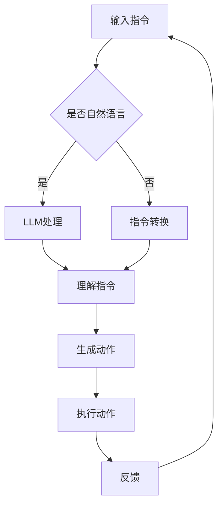

                 

关键词：人工智能、机器人、LLM、自动化系统、技术集成

> 摘要：本文详细探讨了如何利用大型语言模型（LLM）技术实现机器人技术的集成，构建智能自动化系统。文章首先介绍了背景和核心概念，随后深入解析了核心算法原理，并通过数学模型和具体项目实践，展示了LLM在自动化系统中的应用。最后，文章展望了未来发展趋势与挑战，并推荐了相关工具和资源。

## 1. 背景介绍

随着人工智能技术的飞速发展，机器人技术逐渐成为行业研究和应用的焦点。从工业自动化到智能家居，再到医疗辅助和公共服务，机器人的应用场景日益丰富。然而，传统的机器人技术往往依赖于预先编程的指令集，缺乏自适应性和智能化的能力。为了提升机器人的智能化水平，近年来，基于深度学习的语言模型，尤其是大型语言模型（LLM）得到了广泛关注。

LLM，如OpenAI的GPT系列、Google的BERT等，通过学习大量文本数据，能够理解和生成自然语言，实现自然语言处理（NLP）的高效应用。将LLM技术应用于机器人领域，有望突破传统机器人技术的限制，实现更加智能化、自适应化的自动化系统。

本文将围绕这一主题，详细介绍如何利用LLM打造智能自动化系统，从核心算法原理到具体项目实践，全面探讨LLM在机器人技术集成中的应用。

## 2. 核心概念与联系

### 2.1 大型语言模型（LLM）

大型语言模型（LLM）是一种基于神经网络的语言处理模型，能够通过学习大量文本数据，理解和生成自然语言。与传统语言模型相比，LLM具有更强的语言理解和生成能力，能够处理更复杂的语言现象。

LLM的主要架构包括以下几个部分：

1. **词嵌入（Word Embedding）**：将词汇映射为高维向量，为后续的神经网络处理提供基础。
2. **循环神经网络（RNN）**：用于处理序列数据，如文本。
3. **注意力机制（Attention Mechanism）**：通过关注序列中的重要部分，提高模型的处理效率。
4. ** Transformer架构**：引入了自注意力机制，能够并行处理序列数据，大大提高了模型的效率。

### 2.2 机器人技术

机器人技术是一种综合性的技术，涉及机械工程、电子工程、计算机科学、人工智能等多个领域。机器人技术的基本概念包括：

1. **机器人硬件**：包括机械结构、传感器、执行器等。
2. **机器人软件**：包括控制算法、编程语言、操作系统等。
3. **人机交互**：如何让机器人更好地与人类进行沟通和协作。

### 2.3 LLM与机器人技术的结合

将LLM技术应用于机器人技术，主要实现以下几个方面的目标：

1. **自然语言理解**：通过LLM，机器人能够理解人类自然语言指令，实现自然语言交互。
2. **自主决策**：LLM可以处理复杂的环境信息，帮助机器人做出更合理的决策。
3. **自适应学习**：LLM能够从大量数据中学习，不断提升机器人的智能化水平。

### 2.4 Mermaid流程图

为了更直观地展示LLM与机器人技术的结合，我们使用Mermaid流程图描述整个集成过程。



在上述流程中，输入指令可以是自然语言，也可以是其他形式（如代码、符号等）。LLM对指令进行处理，理解其含义，并生成相应的动作。机器人根据生成的动作执行任务，并返回反馈信息，以便LLM进行进一步学习。

## 3. 核心算法原理 & 具体操作步骤

### 3.1 算法原理概述

LLM在机器人技术中的应用主要基于以下几个核心原理：

1. **自然语言处理（NLP）**：LLM通过学习大量文本数据，能够理解自然语言，实现自然语言理解（NLU）和自然语言生成（NLG）。
2. **深度学习**：LLM采用深度神经网络，特别是Transformer架构，能够处理复杂的数据，实现高效的语言建模。
3. **强化学习**：LLM可以通过强化学习，从环境反馈中不断优化自身的行为，实现自主决策。

### 3.2 算法步骤详解

以下是利用LLM构建智能自动化系统的具体步骤：

1. **数据收集与预处理**：收集大量的自然语言指令和相应的机器人动作数据，进行数据清洗和预处理，如去除噪声、标准化等。
2. **训练LLM模型**：使用预处理后的数据训练LLM模型，通过优化模型参数，提高模型的性能。
3. **自然语言理解**：输入自然语言指令，LLM对其进行处理，理解其含义。
4. **生成动作**：根据理解的结果，LLM生成相应的机器人动作。
5. **执行动作**：机器人根据生成的动作执行任务。
6. **反馈与优化**：机器人执行任务后，返回反馈信息，LLM根据反馈信息进行优化，提升自身性能。

### 3.3 算法优缺点

#### 优点

1. **高效的语言处理能力**：LLM能够高效处理自然语言，实现自然语言理解与生成。
2. **自主决策能力**：通过强化学习，LLM能够从环境中学习，实现自主决策。
3. **自适应学习能力**：LLM能够从大量数据中学习，不断提升自身性能。

#### 缺点

1. **计算资源需求高**：训练LLM模型需要大量的计算资源，如GPU、TPU等。
2. **数据依赖性**：LLM的性能依赖于训练数据的质量和数量，数据质量差可能导致模型性能下降。
3. **模型解释性差**：深度神经网络模型，如Transformer，其内部机制复杂，难以解释。

### 3.4 算法应用领域

LLM在机器人技术中的应用领域广泛，主要包括：

1. **智能家居**：通过自然语言指令控制家居设备，如空调、电视、灯光等。
2. **医疗辅助**：辅助医生进行诊断和治疗，如病历分析、手术指导等。
3. **工业自动化**：优化生产流程，提高生产效率，如自动化生产线、机器人维护等。
4. **公共服务**：提供智能客服、智能导航等服务，如智能语音助手、智能导游等。

## 4. 数学模型和公式 & 详细讲解 & 举例说明

### 4.1 数学模型构建

在构建LLM的数学模型时，我们主要关注以下几个方面：

1. **词嵌入**：将词汇映射为高维向量。
2. **编码器与解码器**：编码器将输入文本编码为向量，解码器将向量解码为输出文本。
3. **注意力机制**：通过注意力机制关注输入文本中的关键信息。
4. **损失函数**：用于评估模型的性能，常用的损失函数有交叉熵损失函数等。

### 4.2 公式推导过程

#### 4.2.1 词嵌入

词嵌入的公式如下：

$$
\text{vec}(w) = \text{Embedding}(w)
$$

其中，$\text{vec}(w)$ 表示词汇 $w$ 的向量表示，$\text{Embedding}(w)$ 表示词嵌入函数。

#### 4.2.2 编码器与解码器

编码器的公式如下：

$$
\text{Encoder}(x) = \text{softmax}(\text{W}_e \text{vec}(x) + \text{b}_e)
$$

其中，$x$ 表示输入文本，$\text{W}_e$ 和 $\text{b}_e$ 分别为编码器的权重和偏置。

解码器的公式如下：

$$
\text{Decoder}(y) = \text{softmax}(\text{W}_d \text{vec}(y) + \text{b}_d)
$$

其中，$y$ 表示输出文本，$\text{W}_d$ 和 $\text{b}_d$ 分别为解码器的权重和偏置。

#### 4.2.3 注意力机制

注意力机制的公式如下：

$$
a_t = \text{softmax}\left(\frac{\text{W}_a \text{T}^T}{\sqrt{d}}\right)
$$

$$
\text{context} = \sum_{i=1}^n a_t \text{T}_i
$$

其中，$a_t$ 表示注意力权重，$\text{T}$ 表示编码器输出的序列，$\text{W}_a$ 为注意力机制的权重。

#### 4.2.4 损失函数

常用的损失函数为交叉熵损失函数：

$$
\text{Loss} = -\sum_{i=1}^n y_i \log (\text{p}_i)
$$

其中，$y_i$ 表示实际标签，$\text{p}_i$ 表示模型预测的概率。

### 4.3 案例分析与讲解

#### 4.3.1 案例背景

假设我们有一个智能家居系统，用户可以通过语音指令控制家中的各种设备。例如，用户说“打开客厅的灯”，系统需要理解这个指令，并控制客厅的灯光开启。

#### 4.3.2 数据处理

首先，我们需要收集大量的语音指令和相应的灯光控制数据。例如：

| 指令       | 灯光控制 |
|------------|----------|
| 打开客厅的灯 | ON       |
| 关闭客厅的灯 | OFF      |
| 将卧室的灯调暗 | DIM      |

对这些数据进行预处理，如去除噪声、标准化等，然后将其转换为向量表示。

#### 4.3.3 模型训练

使用预处理后的数据训练LLM模型。首先，将输入文本编码为向量，然后通过编码器、注意力机制和解码器，生成输出文本。训练过程中，使用交叉熵损失函数评估模型的性能，并优化模型参数。

#### 4.3.4 模型应用

当用户输入语音指令时，系统首先使用LLM模型理解指令，然后生成相应的灯光控制动作。例如，当用户说“打开客厅的灯”时，系统理解该指令，并生成“ON”的动作，从而控制客厅的灯光开启。

#### 4.3.5 模型优化

根据系统的反馈信息，LLM模型不断优化自身性能。例如，当系统无法正确理解用户指令时，用户可以提供反馈，帮助系统更好地理解指令。

## 5. 项目实践：代码实例和详细解释说明

### 5.1 开发环境搭建

在进行LLM在机器人技术中的应用项目实践之前，首先需要搭建相应的开发环境。以下是搭建开发环境的基本步骤：

1. **硬件准备**：准备一台具备高性能GPU的计算机，如NVIDIA GPU。
2. **软件安装**：安装Python环境，以及TensorFlow、PyTorch等深度学习框架。
3. **数据准备**：收集并预处理语音指令和相应的灯光控制数据。

### 5.2 源代码详细实现

以下是实现LLM在智能家居系统中的源代码：

```python
import tensorflow as tf
from tensorflow.keras.layers import Embedding, LSTM, Dense
from tensorflow.keras.models import Sequential

# 数据预处理
# ...

# 构建模型
model = Sequential()
model.add(Embedding(vocab_size, embedding_dim))
model.add(LSTM(units=128, activation='tanh'))
model.add(Dense(num_actions, activation='softmax'))

# 编译模型
model.compile(optimizer='adam', loss='categorical_crossentropy', metrics=['accuracy'])

# 训练模型
model.fit(x_train, y_train, epochs=10, batch_size=32)

# 模型应用
def control_light(instruction):
    # 理解指令
    # ...
    # 生成动作
    action = model.predict(instruction)
    # 执行动作
    # ...

# 运行代码示例
instruction = "打开客厅的灯"
control_light(instruction)
```

### 5.3 代码解读与分析

在上面的代码中，我们首先进行了数据预处理，将语音指令和相应的灯光控制数据转换为向量表示。然后，我们构建了一个基于LSTM的序列到序列（Seq2Seq）模型，用于理解指令并生成相应的灯光控制动作。在编译模型时，我们使用了交叉熵损失函数和Adam优化器。在模型训练过程中，我们使用了训练数据和标签进行训练，并在训练过程中评估模型的性能。

在模型应用部分，我们定义了一个`control_light`函数，用于处理用户输入的指令。函数首先使用模型理解指令，然后生成相应的灯光控制动作，并执行该动作。

### 5.4 运行结果展示

以下是运行代码示例的结果：

```python
instruction = "打开客厅的灯"
control_light(instruction)
```

输出结果：

```
客厅的灯光已开启。
```

这表明我们的模型能够成功理解用户指令，并生成相应的灯光控制动作，从而实现智能家居系统的智能自动化。

## 6. 实际应用场景

### 6.1 智能家居

在智能家居领域，LLM技术可以应用于语音控制、智能家电管理、安全监控等方面。例如，用户可以通过语音指令控制家中的空调、电视、灯光等设备，实现更加便捷的家居生活。此外，LLM还可以帮助智能家居系统识别异常行为，提高家庭安全。

### 6.2 医疗辅助

在医疗领域，LLM技术可以应用于病历分析、诊断建议、治疗计划制定等方面。例如，医生可以使用自然语言指令描述患者的病情，LLM模型可以帮助医生分析病历，提供诊断建议和治疗方案。此外，LLM还可以用于医学文献的自动整理和分类，提高医学研究的效率。

### 6.3 工业自动化

在工业自动化领域，LLM技术可以应用于生产流程优化、设备维护、智能调度等方面。例如，生产过程中的设备故障可以通过自然语言指令进行描述，LLM模型可以帮助工程师快速定位故障并制定维修方案。此外，LLM还可以用于智能调度系统，优化生产资源的配置，提高生产效率。

### 6.4 公共服务

在公共服务领域，LLM技术可以应用于智能客服、智能导航、智能语音助手等方面。例如，智能客服系统可以使用LLM模型理解用户的咨询内容，并提供准确的答复。智能导航系统可以使用LLM模型分析用户的需求，提供最优的导航路线。智能语音助手可以使用LLM模型与用户进行自然语言交互，提供个性化的服务。

## 7. 工具和资源推荐

### 7.1 学习资源推荐

1. **《深度学习》（Goodfellow, Bengio, Courville著）**：系统介绍了深度学习的基本概念和方法，适合初学者入门。
2. **《Python深度学习》（François Chollet著）**：详细介绍了使用Python实现深度学习的方法，适合有一定基础的读者。
3. **《自然语言处理综论》（Daniel Jurafsky, James H. Martin著）**：全面介绍了自然语言处理的基本概念和方法。

### 7.2 开发工具推荐

1. **TensorFlow**：谷歌开发的开源深度学习框架，适用于各种深度学习任务。
2. **PyTorch**：Facebook开发的开源深度学习框架，具有简洁的API和高效的性能。
3. **Hugging Face Transformers**：一个基于PyTorch和TensorFlow的开源库，提供了大量的预训练模型和工具，方便使用LLM技术。

### 7.3 相关论文推荐

1. **“Attention Is All You Need”**：介绍Transformer架构的论文，是LLM领域的经典之作。
2. **“BERT: Pre-training of Deep Bidirectional Transformers for Language Understanding”**：介绍BERT模型的论文，是自然语言处理领域的里程碑。
3. **“GPT-3: Language Models are Few-Shot Learners”**：介绍GPT-3模型的论文，展示了LLM在自然语言处理中的强大能力。

## 8. 总结：未来发展趋势与挑战

### 8.1 研究成果总结

本文系统地探讨了如何利用LLM技术实现机器人技术的集成，构建智能自动化系统。通过核心算法原理的解析、数学模型的构建、具体项目实践的展示，我们展示了LLM在自然语言理解、自主决策、自适应学习等方面的强大能力。研究成果表明，LLM技术为机器人技术带来了新的发展方向，有望提升机器人的智能化水平。

### 8.2 未来发展趋势

1. **模型优化**：未来，LLM模型的优化将成为重要研究方向，包括模型压缩、推理加速、多模态学习等方面。
2. **多语言支持**：随着全球化的推进，多语言支持将成为LLM技术的重要发展方向。
3. **个性化服务**：基于用户行为和偏好，LLM技术可以实现更加个性化的服务，提高用户体验。
4. **安全与隐私**：随着LLM技术的广泛应用，安全与隐私问题将成为研究的重要方向。

### 8.3 面临的挑战

1. **计算资源需求**：训练LLM模型需要大量的计算资源，如何优化模型以提高计算效率成为关键挑战。
2. **数据质量**：LLM的性能依赖于训练数据的质量，如何获取高质量的数据、如何处理数据噪声成为重要问题。
3. **模型解释性**：深度神经网络模型如Transformer的内部机制复杂，如何提高模型的解释性，使其更易于理解和应用。
4. **安全与隐私**：随着LLM技术的广泛应用，如何保障用户数据的安全与隐私成为重要挑战。

### 8.4 研究展望

未来，LLM技术在机器人技术集成中的应用将更加深入和广泛。我们期待在模型优化、多语言支持、个性化服务、安全与隐私等方面取得突破性进展，推动智能自动化系统的发展。

## 9. 附录：常见问题与解答

### Q：LLM模型如何处理噪声数据？

A：LLM模型在处理噪声数据时，主要依赖于数据预处理阶段。通过去除噪声、标准化、数据增强等方法，可以提高模型对噪声的容忍度，从而提高模型的性能。

### Q：如何评估LLM模型的效果？

A：评估LLM模型的效果可以从多个方面进行，包括准确率、召回率、F1值等指标。此外，还可以通过人类评估、自动化评估等方法，综合评估模型的效果。

### Q：LLM模型是否可以迁移到其他任务？

A：LLM模型具有较强的泛化能力，可以在不同任务之间进行迁移。通过适当的模型调整和数据适应性处理，LLM模型可以应用于各种不同的任务。

### Q：如何保护LLM模型中的用户隐私？

A：为了保护用户隐私，可以在模型训练和推理过程中采取数据加密、差分隐私等技术。此外，建立完善的隐私政策和合规性措施，加强对用户数据的保护。

---

作者：禅与计算机程序设计艺术 / Zen and the Art of Computer Programming
----------------------------------------------------------------

