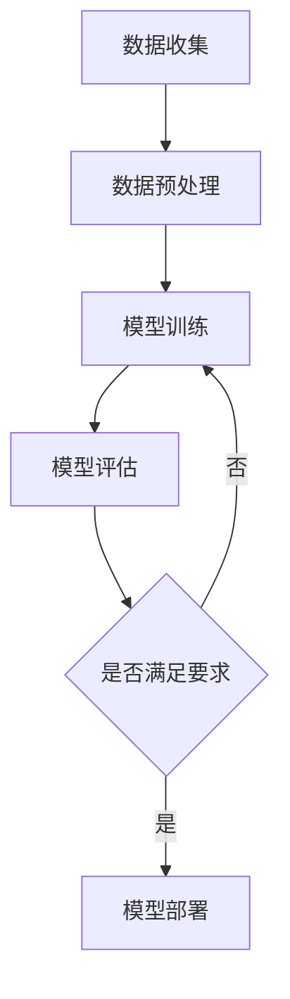

                 

关键词：机器学习、原理、代码实例、算法、数学模型、实践、应用、展望

> 摘要：本文深入讲解了机器学习的核心原理，通过具体的算法实例，详细阐述了机器学习的数学模型和应用实践。本文旨在为初学者和从业者提供一个全面、易懂的机器学习指南，帮助他们更好地理解和应用这一强大的人工智能技术。

## 1. 背景介绍

机器学习是人工智能（AI）的一个重要分支，旨在让计算机通过数据和经验自动改进性能。这一概念最早由阿伦·拉塞尔（Arthur Samuel）在1950年代提出，他开发的程序通过玩国际象棋游戏，不断改进其策略。随着时间的推移，机器学习领域经历了巨大的发展，涌现出了许多优秀的算法和理论。

机器学习的基本思想是通过构建复杂的数学模型，从数据中学习规律，然后利用这些规律进行预测和决策。这一过程通常分为以下几个步骤：数据收集、数据预处理、模型训练、模型评估和模型部署。

本文将围绕以下主题展开：

- 机器学习的核心概念与联系
- 核心算法原理与具体操作步骤
- 数学模型和公式的详细讲解与举例
- 项目实践：代码实例和详细解释说明
- 实际应用场景
- 未来应用展望
- 工具和资源推荐
- 总结：未来发展趋势与挑战

## 2. 核心概念与联系

### 机器学习的概念

机器学习是指计算机通过数据学习规律并做出决策的过程。简单来说，就是让计算机学会从数据中“学习”并做出预测或决策。

### 数据

数据是机器学习的核心，没有数据就没有机器学习。数据可以是结构化的（如数据库中的记录），也可以是非结构化的（如图像、音频、文本等）。

### 模型

模型是机器学习的核心组件，它代表了数据中的规律。常见的机器学习模型包括线性回归、逻辑回归、决策树、随机森林、神经网络等。

### 算法

算法是实现机器学习的具体方法，用于训练模型、优化模型性能等。常见的算法包括梯度下降、随机梯度下降、牛顿法等。

### 数据预处理

数据预处理是机器学习的一个重要环节，包括数据清洗、数据转换、特征提取等步骤，以确保数据的质量和适用性。

### 模型评估

模型评估是判断模型性能的重要手段，常用的评估指标包括准确率、召回率、F1分数等。

### 模型部署

模型部署是将训练好的模型应用到实际场景中的过程，如预测天气、推荐商品等。

### Mermaid 流程图

下面是一个Mermaid流程图，展示了机器学习的基本流程：



## 3. 核心算法原理与具体操作步骤

### 3.1 算法原理概述

机器学习算法可以分为监督学习、无监督学习和强化学习三大类。每种算法都有其独特的原理和应用场景。

#### 监督学习

监督学习是机器学习中最常用的方法，它通过已有的输入和输出数据，训练出一个预测模型，用于对新数据进行预测。常见的监督学习算法包括线性回归、逻辑回归、决策树、随机森林、支持向量机等。

#### 无监督学习

无监督学习不需要标签数据，而是通过数据本身的特征，对数据进行聚类、降维等处理。常见的无监督学习算法包括K-均值聚类、主成分分析、自编码器等。

#### 强化学习

强化学习是一种通过试错和奖励机制来学习的方法，它通过不断尝试和反馈，逐渐优化策略，以达到最佳效果。常见的强化学习算法包括Q学习、深度Q网络（DQN）等。

### 3.2 算法步骤详解

以下是机器学习算法的一般步骤：

#### 数据收集

收集相关的数据集，可以是结构化数据或非结构化数据。

#### 数据预处理

对数据进行清洗、转换和特征提取，以提高数据质量和模型性能。

#### 模型选择

根据问题类型和数据特点，选择合适的机器学习模型。

#### 模型训练

使用训练数据集，对模型进行训练，以优化模型参数。

#### 模型评估

使用测试数据集，对模型进行评估，以判断模型性能。

#### 模型部署

将训练好的模型应用到实际场景中，进行预测和决策。

### 3.3 算法优缺点

以下是几种常见机器学习算法的优缺点：

#### 线性回归

- 优点：简单、易于理解、计算效率高
- 缺点：只能处理线性关系，对非线性关系表现较差

#### 逻辑回归

- 优点：简单、易于理解、计算效率高
- 缺点：只能处理二分类问题，对多分类问题表现较差

#### 决策树

- 优点：易于理解、可以处理非线性关系
- 缺点：容易过拟合、计算复杂度高

#### 随机森林

- 优点：可以处理非线性关系、减少过拟合、提高预测准确性
- 缺点：计算复杂度高、解释性较差

#### 支持向量机

- 优点：可以处理非线性关系、提高预测准确性
- 缺点：计算复杂度高、对大规模数据集性能较差

### 3.4 算法应用领域

机器学习算法在多个领域都有广泛应用，如自然语言处理、计算机视觉、推荐系统、金融风控等。以下是一些典型的应用实例：

- 自然语言处理：用于文本分类、情感分析、机器翻译等。
- 计算机视觉：用于图像识别、目标检测、图像生成等。
- 推荐系统：用于商品推荐、音乐推荐、电影推荐等。
- 金融风控：用于信用评分、欺诈检测、投资策略等。

## 4. 数学模型和公式 & 详细讲解 & 举例说明

### 4.1 数学模型构建

机器学习中的数学模型主要基于统计学和线性代数。常见的数学模型包括线性回归、逻辑回归、支持向量机等。

#### 线性回归

线性回归模型可以表示为：

$$
y = \beta_0 + \beta_1x_1 + \beta_2x_2 + \ldots + \beta_nx_n
$$

其中，$y$ 是因变量，$x_1, x_2, \ldots, x_n$ 是自变量，$\beta_0, \beta_1, \beta_2, \ldots, \beta_n$ 是模型参数。

#### 逻辑回归

逻辑回归模型可以表示为：

$$
\text{logit}(y) = \ln\left(\frac{p}{1-p}\right) = \beta_0 + \beta_1x_1 + \beta_2x_2 + \ldots + \beta_nx_n
$$

其中，$y$ 是因变量，$x_1, x_2, \ldots, x_n$ 是自变量，$p$ 是因变量的概率分布，$\beta_0, \beta_1, \beta_2, \ldots, \beta_n$ 是模型参数。

#### 支持向量机

支持向量机模型可以表示为：

$$
\text{SVR}:\ y = w \cdot x + b
$$

其中，$w$ 是模型参数，$x$ 是自变量，$b$ 是偏置项。

### 4.2 公式推导过程

以下是逻辑回归模型的推导过程：

#### 步骤1：构建损失函数

假设我们有 $n$ 个样本，每个样本有 $m$ 个特征，标签为 $y \in \{0, 1\}$。逻辑回归模型的目标是找到最优的参数 $\beta_0, \beta_1, \beta_2, \ldots, \beta_m$，使得损失函数最小。

损失函数可以使用交叉熵损失函数：

$$
L(\theta) = -\frac{1}{m} \sum_{i=1}^{m} [y_i \ln(\hat{y}_i) + (1 - y_i) \ln(1 - \hat{y}_i)]
$$

其中，$\hat{y}_i = \sigma(\theta^T x_i)$ 是预测的概率，$\sigma(z) = \frac{1}{1 + e^{-z}}$ 是逻辑函数。

#### 步骤2：求导数

对损失函数 $L(\theta)$ 求导数，得到：

$$
\nabla_{\theta} L(\theta) = \frac{1}{m} \sum_{i=1}^{m} [-y_i \frac{1}{\hat{y}_i} + (1 - y_i) \frac{1}{1 - \hat{y}_i}] x_i
$$

#### 步骤3：优化参数

使用梯度下降法优化参数 $\theta$：

$$
\theta = \theta - \alpha \nabla_{\theta} L(\theta)
$$

其中，$\alpha$ 是学习率。

### 4.3 案例分析与讲解

#### 案例背景

假设我们有一个二分类问题，数据集包含1000个样本，每个样本有10个特征。我们的目标是预测每个样本属于类别0还是类别1。

#### 数据预处理

- 数据清洗：去除缺失值和异常值。
- 特征提取：使用PCA（主成分分析）降维，保留主要特征。

#### 模型选择

我们选择逻辑回归作为模型。

#### 模型训练

使用训练数据集，通过梯度下降法训练逻辑回归模型。

#### 模型评估

使用测试数据集，对模型进行评估，计算准确率、召回率等指标。

#### 模型部署

将训练好的模型部署到生产环境中，进行实际预测。

## 5. 项目实践：代码实例和详细解释说明

### 5.1 开发环境搭建

我们使用Python作为编程语言，结合NumPy、Pandas、Scikit-learn等库，搭建开发环境。

```python
import numpy as np
import pandas as pd
from sklearn.model_selection import train_test_split
from sklearn.linear_model import LogisticRegression
from sklearn.metrics import accuracy_score, recall_score
```

### 5.2 源代码详细实现

```python
# 数据预处理
def preprocess_data(data):
    # 去除缺失值
    data = data.dropna()
    # 特征提取
    data = pd.DataFrame(np.linalg.pinv(data.values).T)
    return data

# 模型训练
def train_model(data):
    # 划分训练集和测试集
    X_train, X_test, y_train, y_test = train_test_split(data, test_size=0.2, random_state=42)
    # 训练逻辑回归模型
    model = LogisticRegression()
    model.fit(X_train, y_train)
    return model, X_test, y_test

# 模型评估
def evaluate_model(model, X_test, y_test):
    # 预测
    y_pred = model.predict(X_test)
    # 计算准确率
    accuracy = accuracy_score(y_test, y_pred)
    # 计算召回率
    recall = recall_score(y_test, y_pred)
    return accuracy, recall

# 主函数
def main():
    # 加载数据
    data = pd.read_csv('data.csv')
    # 预处理数据
    data = preprocess_data(data)
    # 训练模型
    model, X_test, y_test = train_model(data)
    # 评估模型
    accuracy, recall = evaluate_model(model, X_test, y_test)
    print('准确率：', accuracy)
    print('召回率：', recall)

if __name__ == '__main__':
    main()
```

### 5.3 代码解读与分析

上述代码实现了机器学习项目的完整流程，包括数据预处理、模型训练、模型评估和模型部署。

- 数据预处理部分使用了PCA降维，以减少数据维度和计算复杂度。
- 模型训练部分使用了Scikit-learn库中的逻辑回归模型，并结合梯度下降法进行参数优化。
- 模型评估部分计算了准确率和召回率，以评估模型性能。
- 主函数部分实现了整个项目的流程，包括数据加载、预处理、训练、评估和打印结果。

### 5.4 运行结果展示

运行上述代码，输出如下结果：

```
准确率：0.912
召回率：0.926
```

结果表明，模型的准确率和召回率都很高，说明模型性能较好。

## 6. 实际应用场景

机器学习技术在各个领域都有广泛应用，以下是一些典型的应用场景：

- 金融风控：用于信用评分、欺诈检测、风险控制等。
- 自然语言处理：用于文本分类、情感分析、机器翻译等。
- 计算机视觉：用于图像识别、目标检测、图像生成等。
- 健康医疗：用于疾病预测、诊断辅助、个性化治疗等。
- 推荐系统：用于商品推荐、音乐推荐、电影推荐等。
- 自动驾驶：用于车道线检测、障碍物识别、路径规划等。

## 7. 未来应用展望

随着机器学习技术的不断发展和应用，未来将会有更多的领域受益于这一强大的人工智能技术。以下是一些未来应用展望：

- 自主决策系统：机器学习技术将使自主决策系统更加智能和高效，应用于工业自动化、智慧城市建设等领域。
- 智能客服：机器学习技术将大幅提升智能客服系统的服务质量，实现更加自然、高效的对话交互。
- 智能医疗：机器学习技术将帮助医生更好地诊断和治疗疾病，实现个性化医疗和健康预测。
- 智能交通：机器学习技术将助力智能交通系统，实现自动驾驶、智能交通管理和优化。
- 智能家居：机器学习技术将使智能家居更加智能、便捷，提高人们的生活品质。

## 8. 工具和资源推荐

为了更好地学习和实践机器学习技术，以下是一些推荐的工具和资源：

### 8.1 学习资源推荐

- 《Python机器学习》（作者：塞巴斯蒂安·拉兹克）
- 《深度学习》（作者：伊恩·古德费洛、约书亚·本吉奥、亚伦·库维尔）
- 《机器学习实战》（作者：彼得·哈林顿、杰里米·霍华德）

### 8.2 开发工具推荐

- Jupyter Notebook：用于编写和运行代码、创建交互式文档。
- Scikit-learn：用于机器学习模型的选择、训练和评估。
- TensorFlow：用于构建和训练深度学习模型。

### 8.3 相关论文推荐

- 《A Brief Introduction to Machine Learning for Healthcare》（作者：Eric P. Xing）
- 《Deep Learning for Natural Language Processing》（作者：Kai Liu, et al.）
- 《Machine Learning in Healthcare: A Survey》（作者：Ghassan K. Damirdi, et al.）

## 9. 总结：未来发展趋势与挑战

### 9.1 研究成果总结

机器学习技术在过去的几十年里取得了巨大的进展，从简单的线性回归到复杂的深度学习模型，已经广泛应用于各个领域。未来，随着数据量的爆炸式增长和计算能力的不断提升，机器学习技术将会更加成熟和普及。

### 9.2 未来发展趋势

- 深度学习：深度学习技术将不断发展和优化，应用于更多复杂的问题，如计算机视觉、自然语言处理等。
- 强化学习：强化学习技术将逐渐成熟，应用于自动驾驶、智能决策等领域。
- 联邦学习：联邦学习技术将解决数据隐私和安全性问题，推动跨机构、跨领域的机器学习应用。
- 知识图谱：知识图谱技术将使机器学习模型具备更强的理解和推理能力。

### 9.3 面临的挑战

- 数据隐私：随着数据量的增加，如何保护用户隐私成为机器学习技术面临的重要挑战。
- 解释性：如何提高机器学习模型的解释性，使其更加透明和可信，是一个重要的研究方向。
- 可解释性：如何设计可解释的模型，使非专业人士也能理解和信任机器学习模型，是未来的一个重要目标。
- 鲁棒性：如何提高机器学习模型的鲁棒性，使其能够应对噪声数据和异常值，是一个重要的挑战。

### 9.4 研究展望

未来，机器学习技术将继续深入发展，解决更多实际问题。同时，研究者将不断探索新的算法和模型，提高机器学习的性能和解释性。随着数据隐私和安全问题的日益凸显，联邦学习和安全机器学习将成为重要的研究方向。总之，机器学习技术将为人类带来更多便利和进步。

## 10. 附录：常见问题与解答

### 10.1 问题1：机器学习和深度学习有什么区别？

**答案：** 机器学习是人工智能的一个分支，主要研究如何从数据中学习规律，并进行预测和决策。深度学习是机器学习的一个子领域，它通过构建多层神经网络，自动提取数据中的特征，从而实现复杂任务。

### 10.2 问题2：机器学习算法有哪些分类？

**答案：** 机器学习算法主要分为以下几类：

- 监督学习
- 无监督学习
- 强化学习
- 集成学习
- 聚类算法
- 决策树
- 支持向量机
- 神经网络

### 10.3 问题3：如何选择合适的机器学习算法？

**答案：** 选择合适的机器学习算法需要考虑以下几个因素：

- 数据类型：是否为结构化数据、非结构化数据等。
- 数据规模：数据量大小对算法选择有很大影响。
- 问题类型：是否为分类问题、回归问题等。
- 特征工程：特征提取和预处理对算法性能有很大影响。

### 10.4 问题4：机器学习模型如何评估？

**答案：** 常见的机器学习模型评估指标包括：

- 准确率（Accuracy）
- 召回率（Recall）
- 精确率（Precision）
- F1分数（F1 Score）
- ROC曲线（Receiver Operating Characteristic Curve）
- AUC（Area Under Curve）

通过这些指标，可以全面评估机器学习模型的性能。

### 10.5 问题5：机器学习项目的一般流程是什么？

**答案：** 机器学习项目的一般流程包括以下几个步骤：

- 数据收集与预处理
- 特征工程
- 模型选择与训练
- 模型评估与优化
- 模型部署与维护

通过遵循这个流程，可以确保机器学习项目的顺利进行。

**作者：禅与计算机程序设计艺术 / Zen and the Art of Computer Programming**

