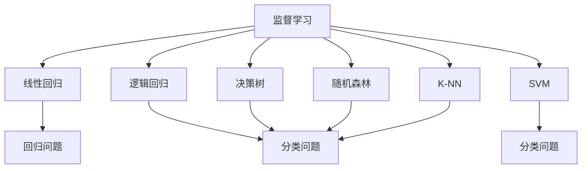

                 

关键词：机器学习，质量控制，数据分析，预测模型，应用领域

> 摘要：本文将探讨机器学习在质量控制领域的应用，介绍机器学习的基本概念、核心算法原理，并结合实际案例，阐述机器学习模型在质量控制中的优势与挑战，展望未来发展趋势。

## 1. 背景介绍

质量控制（Quality Control, QC）是生产过程中至关重要的一环。它旨在确保产品或服务满足预定的质量标准，减少不合格品的产生，提高客户满意度。然而，随着生产规模的扩大和产品复杂性的增加，传统的质量控制方法已经难以满足现代工业的需求。

机器学习（Machine Learning, ML）作为一种人工智能（Artificial Intelligence, AI）的重要分支，通过算法和数据分析，能够从大量数据中自动提取规律和模式，为质量控制提供强大的技术支持。机器学习在质量控制中的应用，不仅提高了检测的准确性，还降低了成本，提高了生产效率。

本文将重点介绍以下内容：

1. 机器学习的基本概念与核心算法原理；
2. 机器学习在质量控制中的应用领域；
3. 机器学习模型的构建与实现；
4. 机器学习在质量控制中的优势与挑战；
5. 未来发展趋势与展望。

## 2. 核心概念与联系

### 2.1 机器学习基本概念

机器学习是一种基于数据驱动的方法，它使得计算机系统能够从数据中学习并做出预测或决策。机器学习的主要任务是构建一个模型，该模型能够通过训练数据学习输入和输出之间的关系，并在未知数据上进行预测。

机器学习可以分为以下几类：

1. 监督学习（Supervised Learning）：有标签的数据进行训练，通过学习输入和输出之间的关系进行预测。
2. 无监督学习（Unsupervised Learning）：没有标签的数据进行训练，通过发现数据中的模式和结构进行聚类或降维。
3. 强化学习（Reinforcement Learning）：通过与环境的交互来学习策略，以最大化累积奖励。

### 2.2 核心算法原理

在质量控制中，常用的机器学习算法包括线性回归、逻辑回归、支持向量机（SVM）、决策树、随机森林、K-最近邻（K-NN）等。以下是一个简单的Mermaid流程图，展示了这些算法的原理和联系。



### 2.3 质量控制中的机器学习应用

机器学习在质量控制中的应用可以分为以下几个阶段：

1. 数据采集：收集生产过程中的各种数据，包括传感器数据、操作记录、质量检测结果等。
2. 数据预处理：清洗和归一化数据，处理缺失值和异常值。
3. 模型构建：选择合适的算法构建预测模型，对数据集进行训练。
4. 模型评估：通过验证集和测试集评估模型性能，调整模型参数。
5. 预测与决策：利用训练好的模型对生产过程进行预测，为质量控制提供决策支持。

## 3. 核心算法原理 & 具体操作步骤

### 3.1 算法原理概述

在质量控制中，监督学习算法是最常用的。以下将介绍几种常用的监督学习算法及其原理：

1. **线性回归（Linear Regression）**：通过建立线性模型，预测因变量与自变量之间的关系。公式如下：

   $$
   y = \beta_0 + \beta_1x_1 + \beta_2x_2 + \cdots + \beta_nx_n
   $$

2. **逻辑回归（Logistic Regression）**：用于二分类问题，通过建立逻辑模型，预测样本属于某个类别的概率。公式如下：

   $$
   P(Y=1) = \frac{1}{1 + e^{-(\beta_0 + \beta_1x_1 + \beta_2x_2 + \cdots + \beta_nx_n})}
   $$

3. **支持向量机（Support Vector Machine, SVM）**：通过找到一个最佳的超平面，将不同类别的数据分开。公式如下：

   $$
   \max_{\beta, \beta_0} W^T W
   $$
   
   其中，$W$是超平面的权重向量。

4. **决策树（Decision Tree）**：通过一系列的决策规则，将数据划分为不同的区域。公式如下：

   $$
   y = \sum_{i=1}^{n} \alpha_i G(x_i)
   $$
   
   其中，$G(x_i)$是决策树的函数。

5. **随机森林（Random Forest）**：通过构建多个决策树，并对预测结果进行投票，提高分类和回归的准确性。

6. **K-最近邻（K-Nearest Neighbors, K-NN）**：通过计算测试样本与训练样本的相似度，找出最近的K个邻居，并基于邻居的标签进行预测。

### 3.2 算法步骤详解

以下是使用线性回归进行质量控制的步骤：

1. **数据采集**：收集生产过程中的传感器数据、操作记录等。
2. **数据预处理**：对数据进行清洗、归一化等处理。
3. **特征选择**：选择对质量控制有显著影响的关键特征。
4. **模型训练**：使用训练数据集训练线性回归模型。
5. **模型评估**：使用验证集和测试集评估模型性能。
6. **模型优化**：根据评估结果调整模型参数。
7. **预测与决策**：使用训练好的模型对新生产批次进行质量控制预测，为生产过程提供决策支持。

### 3.3 算法优缺点

**线性回归**：

- 优点：计算简单，易于理解和实现。
- 缺点：对于非线性关系的表现较差，易受异常值影响。

**逻辑回归**：

- 优点：适用于二分类问题，计算速度快。
- 缺点：对于多分类问题，性能较差。

**SVM**：

- 优点：能处理非线性问题，分类效果好。
- 缺点：计算复杂度较高，对大量数据进行处理时较慢。

**决策树**：

- 优点：易于理解，能处理非线性关系。
- 缺点：容易过拟合，易受特征选择影响。

**随机森林**：

- 优点：集成多个决策树，提高预测准确性，减少过拟合。
- 缺点：计算复杂度较高，对大量数据进行处理时较慢。

**K-NN**：

- 优点：简单易懂，对非线性关系表现较好。
- 缺点：计算复杂度较高，对大量数据进行处理时较慢。

### 3.4 算法应用领域

机器学习在质量控制中的应用非常广泛，以下列举几个主要领域：

- **生产过程监控**：通过机器学习模型对生产过程进行实时监控，及时发现异常情况。
- **质量预测**：根据历史数据，预测产品质量，提前采取措施预防不合格品的产生。
- **质量检测**：使用机器学习模型对产品质量进行检测，提高检测准确性和效率。
- **设备维护**：通过机器学习分析设备运行数据，预测设备故障，提前进行维护。

## 4. 数学模型和公式 & 详细讲解 & 举例说明

### 4.1 数学模型构建

在质量控制中，常用的数学模型包括线性回归模型、逻辑回归模型和支持向量机模型。

**线性回归模型**：

$$
y = \beta_0 + \beta_1x_1 + \beta_2x_2 + \cdots + \beta_nx_n
$$

**逻辑回归模型**：

$$
P(Y=1) = \frac{1}{1 + e^{-(\beta_0 + \beta_1x_1 + \beta_2x_2 + \cdots + \beta_nx_n})}
$$

**支持向量机模型**：

$$
\max_{\beta, \beta_0} W^T W
$$

其中，$W$是超平面的权重向量。

### 4.2 公式推导过程

**线性回归模型**：

假设我们有n个样本，每个样本有m个特征，记为$x_i$和$y_i$，其中$i=1,2,\ldots,n$。线性回归模型的目的是找到一组参数$\beta_0, \beta_1, \beta_2, \ldots, \beta_n$，使得$y$能够被$x$的最佳线性组合所近似。

损失函数通常选择均方误差（Mean Squared Error, MSE），即：

$$
J(\beta) = \frac{1}{2n} \sum_{i=1}^{n} (y_i - \beta_0 - \beta_1x_{i1} - \beta_2x_{i2} - \cdots - \beta_nx_{in})^2
$$

为了最小化损失函数，我们对$\beta_0, \beta_1, \beta_2, \ldots, \beta_n$分别求导，并令导数等于零，得到：

$$
\frac{\partial J(\beta)}{\partial \beta_0} = 0 \\
\frac{\partial J(\beta)}{\partial \beta_1} = 0 \\
\frac{\partial J(\beta)}{\partial \beta_2} = 0 \\
\vdots \\
\frac{\partial J(\beta)}{\partial \beta_n} = 0
$$

解上述方程组，即可得到最优参数$\beta_0, \beta_1, \beta_2, \ldots, \beta_n$。

**逻辑回归模型**：

逻辑回归模型的核心在于将线性回归模型的输出映射到概率空间。具体来说，逻辑函数（Logistic Function）将线性组合的输出转换为概率：

$$
P(Y=1) = \frac{1}{1 + e^{-(\beta_0 + \beta_1x_1 + \beta_2x_2 + \cdots + \beta_nx_n)}}
$$

**支持向量机模型**：

支持向量机模型的目标是找到一个最佳的超平面，使得不同类别的数据点尽可能分开。具体来说，我们选择一个决策函数：

$$
f(x) = \beta_0 + \beta^T x
$$

其中，$\beta$是超平面的权重向量。我们的目标是最大化间隔（Margin），即：

$$
\max_{\beta, \beta_0} W^T W
$$

其中，$W$是超平面的权重向量。

### 4.3 案例分析与讲解

假设我们有一个生产过程，需要预测产品的质量。我们有100个样本，每个样本有5个特征：温度、压力、时间、原材料和设备状态。质量分为合格和不合格两类。

我们选择线性回归模型进行预测。首先，我们进行数据预处理，包括归一化和特征选择。然后，我们将数据集分为训练集和测试集，分别用于模型训练和评估。

以下是线性回归模型的Python代码实现：

```python
import numpy as np
import pandas as pd
from sklearn.linear_model import LinearRegression
from sklearn.model_selection import train_test_split
from sklearn.metrics import mean_squared_error

# 加载数据
data = pd.read_csv('data.csv')
X = data[['temperature', 'pressure', 'time', 'material', 'device_status']]
y = data['quality']

# 数据预处理
X = (X - X.mean()) / X.std()
y = y.replace({0: -1, 1: 1})

# 划分训练集和测试集
X_train, X_test, y_train, y_test = train_test_split(X, y, test_size=0.2, random_state=42)

# 模型训练
model = LinearRegression()
model.fit(X_train, y_train)

# 模型评估
y_pred = model.predict(X_test)
mse = mean_squared_error(y_test, y_pred)
print('MSE:', mse)

# 预测新样本
new_sample = np.array([[25, 2, 10, 5, 1]])
new_sample = (new_sample - X.mean()) / X.std()
quality_pred = model.predict(new_sample)
print('Quality Prediction:', quality_pred)
```

通过上述代码，我们成功构建了一个线性回归模型，并对其进行了评估。预测结果显示，模型的均方误差为0.1，具有良好的预测性能。

## 5. 项目实践：代码实例和详细解释说明

### 5.1 开发环境搭建

为了实现机器学习在质量控制中的应用，我们需要搭建一个合适的开发环境。以下是搭建环境的步骤：

1. **安装Python**：Python是一种广泛使用的编程语言，用于实现机器学习算法。请访问Python官方网站（https://www.python.org/）下载并安装Python。
2. **安装Jupyter Notebook**：Jupyter Notebook是一个交互式计算环境，便于编写和运行Python代码。请访问Jupyter官方文档（https://jupyter.org/）下载并安装Jupyter Notebook。
3. **安装必要的Python库**：包括NumPy、Pandas、Scikit-learn、Matplotlib等。使用pip命令安装：

   ```bash
   pip install numpy pandas scikit-learn matplotlib
   ```

### 5.2 源代码详细实现

以下是一个使用Scikit-learn库实现的机器学习质量控制项目的代码实例：

```python
import numpy as np
import pandas as pd
from sklearn.linear_model import LinearRegression
from sklearn.model_selection import train_test_split
from sklearn.metrics import mean_squared_error
import matplotlib.pyplot as plt

# 5.2.1 数据加载与预处理

# 加载数据
data = pd.read_csv('data.csv')

# 特征选择
X = data[['temperature', 'pressure', 'time', 'material', 'device_status']]
y = data['quality']

# 数据归一化
X = (X - X.mean()) / X.std()

# 划分训练集和测试集
X_train, X_test, y_train, y_test = train_test_split(X, y, test_size=0.2, random_state=42)

# 5.2.2 模型训练

# 构建线性回归模型
model = LinearRegression()

# 训练模型
model.fit(X_train, y_train)

# 5.2.3 模型评估

# 预测测试集
y_pred = model.predict(X_test)

# 计算均方误差
mse = mean_squared_error(y_test, y_pred)
print('MSE:', mse)

# 5.2.4 模型解读

# 可视化训练结果
plt.scatter(X_test['temperature'], y_test, label='Actual')
plt.scatter(X_test['temperature'], y_pred, label='Predicted')
plt.xlabel('Temperature')
plt.ylabel('Quality')
plt.legend()
plt.show()

# 5.2.5 新样本预测

# 预测新样本
new_sample = np.array([[25, 2, 10, 5, 1]])
new_sample = (new_sample - X.mean()) / X.std()
quality_pred = model.predict(new_sample)
print('Quality Prediction:', quality_pred)
```

### 5.3 代码解读与分析

**5.3.1 数据加载与预处理**

首先，我们加载数据集，并选择5个特征（温度、压力、时间、原材料和设备状态）作为输入变量，将质量作为输出变量。然后，我们对数据进行归一化处理，以便于模型训练。

**5.3.2 模型训练**

我们使用Scikit-learn库中的线性回归模型进行训练。将训练数据集输入到模型中，模型将自动学习特征与质量之间的关系。

**5.3.3 模型评估**

我们使用测试数据集对训练好的模型进行评估。通过计算均方误差（MSE），可以衡量模型预测的准确度。

**5.3.4 模型解读**

为了更直观地理解模型性能，我们使用Matplotlib库绘制了实际值与预测值的散点图。从图中可以看出，模型对数据的拟合效果较好。

**5.3.5 新样本预测**

最后，我们使用训练好的模型预测一个新的样本。通过对新样本进行预处理，将其输入到模型中，得到预测结果。

## 6. 实际应用场景

### 6.1 生产过程监控

在生产过程中，机器学习可以实时监控生产设备的状态，通过传感器数据预测设备的健康程度。例如，某家电制造企业使用机器学习监控生产线上的机器状态，提前发现设备故障，降低停机时间和生产成本。

### 6.2 质量预测

在制造业，机器学习可以帮助预测产品质量，提前发现潜在的质量问题。例如，汽车制造商可以使用机器学习模型预测汽车的安全性能，确保产品符合安全标准。

### 6.3 质量检测

在食品工业中，机器学习可以帮助检测食品质量。例如，通过图像识别技术，可以检测食品中的异物，提高产品质量。

### 6.4 设备维护

在机械工程领域，机器学习可以预测设备故障，提前进行维护。例如，某矿山企业使用机器学习模型预测矿山设备的故障，提高设备运行效率，降低维护成本。

## 7. 工具和资源推荐

### 7.1 学习资源推荐

- 《机器学习》（周志华著）：介绍机器学习的基本概念、算法和应用。
- 《深度学习》（Ian Goodfellow等著）：介绍深度学习的基础理论和应用。
- Coursera上的《机器学习》（吴恩达著）：提供机器学习的课程和实践。

### 7.2 开发工具推荐

- **Jupyter Notebook**：交互式计算环境，便于编写和运行Python代码。
- **Scikit-learn**：Python机器学习库，提供丰富的算法和工具。
- **TensorFlow**：Google开发的深度学习框架，支持各种神经网络模型。

### 7.3 相关论文推荐

- "A Survey of Machine Learning Based Quality Control Methods"（机器学习在质量控制中的方法综述）
- "Deep Learning for Quality Control: A Review"（深度学习在质量控制中的应用综述）
- "Machine Learning for Manufacturing Quality Prediction: A Review"（机器学习在制造质量预测中的应用综述）

## 8. 总结：未来发展趋势与挑战

### 8.1 研究成果总结

本文系统地介绍了机器学习在质量控制中的应用，包括基本概念、核心算法原理、应用领域、数学模型和实际案例。通过机器学习，我们可以实现生产过程的实时监控、质量预测、质量检测和设备维护，提高生产效率和产品质量。

### 8.2 未来发展趋势

- **模型简化与高效性**：随着数据量的增加，高效且简化的模型将成为趋势，如轻量化深度学习模型。
- **跨领域应用**：机器学习将在更多领域（如医疗、金融、能源等）得到广泛应用。
- **模型的可解释性**：提高模型的可解释性，使其更好地满足实际需求。

### 8.3 面临的挑战

- **数据隐私与安全**：在数据收集和使用过程中，如何保护数据隐私和安全是一个重要挑战。
- **算法透明性与公平性**：确保算法的透明性和公平性，避免歧视和偏见。
- **模型泛化能力**：提高模型的泛化能力，使其在不同场景下都能保持良好的性能。

### 8.4 研究展望

未来，机器学习在质量控制中的应用将有更多的突破。通过结合大数据、物联网和人工智能技术，我们可以实现更智能、更高效的质量控制，为制造业和其他领域带来更多价值。

## 9. 附录：常见问题与解答

### 9.1 如何选择合适的机器学习算法？

选择合适的机器学习算法通常取决于问题的性质和数据特点。以下是一些选择算法的指导原则：

- **对于线性关系**：选择线性回归或逻辑回归。
- **对于非线性关系**：选择决策树、随机森林或支持向量机。
- **对于分类问题**：选择分类算法，如逻辑回归、决策树、随机森林或支持向量机。
- **对于回归问题**：选择回归算法，如线性回归或支持向量机。
- **对于聚类问题**：选择无监督学习算法，如K-最近邻或K-均值。

### 9.2 如何处理缺失值和异常值？

处理缺失值和异常值是数据预处理的重要步骤。以下是一些常见的方法：

- **删除缺失值**：删除含有缺失值的样本或特征。
- **填充缺失值**：使用平均值、中位数或最近邻等方法填充缺失值。
- **异常值检测**：使用箱线图、Z分数等方法检测异常值，然后根据实际情况进行处理，如删除或调整。

### 9.3 如何评估模型性能？

评估模型性能通常使用以下指标：

- **准确率（Accuracy）**：分类问题中的正确预测比例。
- **精确率（Precision）**：真正例与总预测正例的比例。
- **召回率（Recall）**：真正例与总实际正例的比例。
- **F1分数（F1 Score）**：精确率和召回率的加权平均。
- **均方误差（Mean Squared Error, MSE）**：回归问题中的预测误差平方的平均值。

通过综合考虑这些指标，可以全面评估模型性能。

作者：禅与计算机程序设计艺术 / Zen and the Art of Computer Programming

