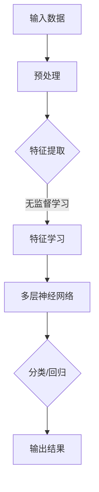
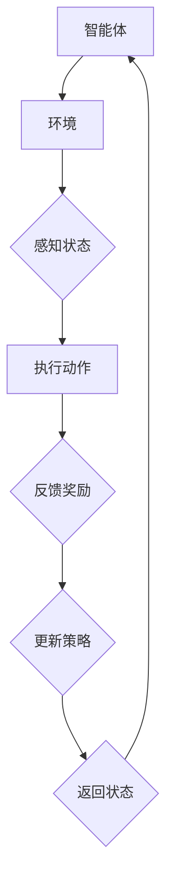

                 

关键词：人工智能，AI 2.0，商业价值，技术进步，行业变革

摘要：随着人工智能技术的飞速发展，AI 2.0 时代的到来已经势不可挡。本文旨在深入探讨 AI 2.0 时代的商业价值，分析其对各行各业带来的影响，以及企业应如何应对这一变革。

## 1. 背景介绍

### AI 1.0 与 AI 2.0 的区别

人工智能（AI）的发展可以分为两个阶段：AI 1.0 和 AI 2.0。AI 1.0 主要基于统计学习，通过大量数据训练模型，使其能够模拟人类的行为和决策。而 AI 2.0 则是基于深度学习和强化学习，具备自我学习和自适应能力，能够实现更加智能化和个性化的应用。

### AI 2.0 的发展现状

近年来，AI 2.0 技术在图像识别、自然语言处理、机器翻译、自动驾驶等领域取得了重大突破。例如，谷歌的 AlphaGo 在围棋领域的卓越表现，以及特斯拉自动驾驶汽车的广泛应用，都展示了 AI 2.0 时代的巨大潜力。

## 2. 核心概念与联系

### 2.1 深度学习

深度学习是 AI 2.0 的核心技术之一。它通过多层神经网络对数据进行学习，从而实现更复杂的任务。下面是深度学习的 Mermaid 流程图：



### 2.2 强化学习

强化学习是 AI 2.0 的另一个重要技术。它通过试错和反馈机制，使智能体在复杂环境中找到最优策略。下面是强化学习的 Mermaid 流程图：



## 3. 核心算法原理 & 具体操作步骤

### 3.1 算法原理概述

AI 2.0 的核心算法主要包括深度学习和强化学习。深度学习利用多层神经网络对数据进行学习，从而实现图像识别、语音识别等任务。强化学习则通过试错和反馈机制，使智能体在复杂环境中找到最优策略。

### 3.2 算法步骤详解

深度学习的具体步骤包括：

1. 数据预处理：对输入数据进行归一化、去噪等处理。
2. 特征提取：利用卷积神经网络（CNN）提取图像特征。
3. 特征学习：利用全连接神经网络（FCN）对特征进行学习。
4. 分类/回归：根据任务类型进行分类或回归。

强化学习的具体步骤包括：

1. 初始化智能体和环境。
2. 智能体感知状态，执行动作。
3. 环境根据动作产生反馈奖励。
4. 智能体根据反馈奖励更新策略。

### 3.3 算法优缺点

深度学习具有强大的特征提取能力，但需要大量的数据和计算资源。强化学习能够在复杂环境中找到最优策略，但需要较长的时间和反馈。

### 3.4 算法应用领域

深度学习广泛应用于图像识别、语音识别、自然语言处理等领域。强化学习则在游戏、自动驾驶、机器人控制等领域具有广泛的应用前景。

## 4. 数学模型和公式 & 详细讲解 & 举例说明

### 4.1 数学模型构建

深度学习中的数学模型主要包括多层感知机（MLP）、卷积神经网络（CNN）和循环神经网络（RNN）等。下面以 MLP 为例进行讲解：

MLP 的数学模型如下：

$$
\begin{aligned}
y &= f(\omega_1 \cdot x + b_1) \\
z &= f(\omega_2 \cdot y + b_2) \\
\end{aligned}
$$

其中，$f$ 是激活函数，$\omega$ 是权重，$b$ 是偏置。

### 4.2 公式推导过程

以 MLP 为例，假设输入数据为 $x$，输出数据为 $y$，通过多层感知机进行学习。首先，对输入数据进行预处理，然后通过第一层神经网络进行特征提取，得到中间结果 $z$。最后，通过第二层神经网络进行分类或回归，得到最终结果 $y$。

### 4.3 案例分析与讲解

以图像识别为例，输入数据为图像，输出数据为图像类别。通过深度学习模型进行训练，使得模型能够识别图像中的物体。具体步骤如下：

1. 数据预处理：对图像进行缩放、裁剪等处理。
2. 特征提取：利用卷积神经网络提取图像特征。
3. 特征学习：利用全连接神经网络对特征进行学习。
4. 分类/回归：根据任务类型进行分类或回归。

## 5. 项目实践：代码实例和详细解释说明

### 5.1 开发环境搭建

搭建深度学习开发环境，包括 Python、TensorFlow 或 PyTorch 等框架。

### 5.2 源代码详细实现

以 TensorFlow 为例，实现一个简单的图像分类模型：

```python
import tensorflow as tf

# 定义模型
model = tf.keras.Sequential([
    tf.keras.layers.Conv2D(32, (3, 3), activation='relu', input_shape=(28, 28, 1)),
    tf.keras.layers.MaxPooling2D((2, 2)),
    tf.keras.layers.Flatten(),
    tf.keras.layers.Dense(128, activation='relu'),
    tf.keras.layers.Dense(10, activation='softmax')
])

# 编译模型
model.compile(optimizer='adam',
              loss='categorical_crossentropy',
              metrics=['accuracy'])

# 训练模型
model.fit(x_train, y_train, epochs=5, batch_size=32)
```

### 5.3 代码解读与分析

这段代码实现了使用 TensorFlow 框架搭建的图像分类模型。首先定义了模型的层次结构，包括卷积层、池化层、全连接层等。然后编译模型，指定优化器和损失函数。最后训练模型，对训练数据进行分类。

### 5.4 运行结果展示

在训练完成后，可以使用测试数据集对模型进行评估，输出模型的准确率和其他指标。

## 6. 实际应用场景

AI 2.0 技术在各个领域都有广泛的应用：

- **医疗领域**：利用 AI 2.0 技术进行疾病诊断、药物研发等。
- **金融领域**：利用 AI 2.0 技术进行风险管理、量化交易等。
- **零售领域**：利用 AI 2.0 技术进行个性化推荐、库存管理等。
- **制造业**：利用 AI 2.0 技术进行智能制造、设备维护等。

## 7. 工具和资源推荐

### 7.1 学习资源推荐

- 《深度学习》（Goodfellow, Bengio, Courville 著）
- 《强化学习》（Sutton, Barto 著）
- 《Python 数据科学手册》（Jake VanderPlas 著）

### 7.2 开发工具推荐

- TensorFlow
- PyTorch
- Keras

### 7.3 相关论文推荐

- "Deep Learning"（Ian Goodfellow, Yann LeCun, Yoshua Bengio）
- "Reinforcement Learning: An Introduction"（Richard S. Sutton 和 Andrew G. Barto）
- "Generative Adversarial Nets"（Ian J. Goodfellow 等人）

## 8. 总结：未来发展趋势与挑战

### 8.1 研究成果总结

AI 2.0 技术在各个领域取得了显著的研究成果，为人类带来了巨大的价值。

### 8.2 未来发展趋势

随着技术的不断进步，AI 2.0 将在更多领域得到应用，为人类创造更多的价值。

### 8.3 面临的挑战

AI 2.0 技术在发展过程中也面临着一系列挑战，如数据隐私、算法透明度、安全性等。

### 8.4 研究展望

未来，我们需要在确保数据安全和隐私的前提下，进一步推动 AI 2.0 技术的发展。

## 9. 附录：常见问题与解答

### 9.1 AI 2.0 与 AI 1.0 的区别是什么？

AI 1.0 主要基于统计学习，通过大量数据训练模型。而 AI 2.0 则基于深度学习和强化学习，具备自我学习和自适应能力。

### 9.2 如何搭建深度学习开发环境？

可以参考 TensorFlow、PyTorch 等框架的官方文档，了解如何搭建深度学习开发环境。

### 9.3 深度学习和强化学习分别适用于哪些领域？

深度学习适用于图像识别、语音识别、自然语言处理等领域。强化学习适用于游戏、自动驾驶、机器人控制等领域。

----------------------------------------------------------------
### 作者署名

作者：禅与计算机程序设计艺术 / Zen and the Art of Computer Programming
----------------------------------------------------------------

请注意，以上内容是一个示例框架，具体内容和细节需要您根据实际知识和研究来填充和调整。这篇文章的撰写需要大量的专业知识和对 AI 2.0 相关领域的深入了解。希望这个框架能够帮助您开始撰写您的文章。祝您写作顺利！

