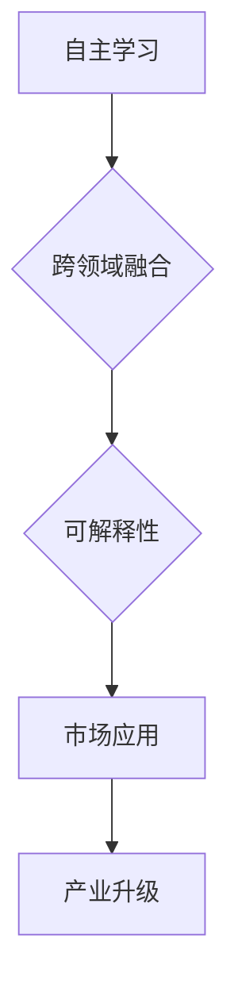
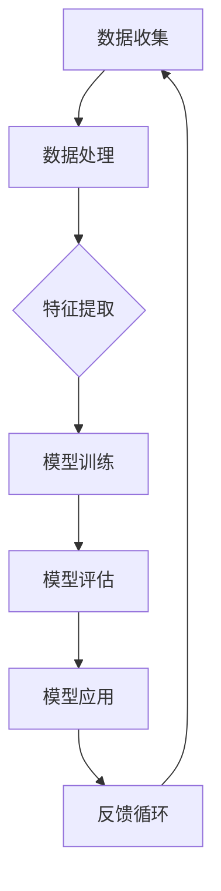

                 

关键词：人工智能、AI 2.0、市场前景、技术发展、产业应用

摘要：随着人工智能技术的迅猛发展，AI 2.0 时代的到来已然成为不可阻挡的趋势。本文将深入探讨 AI 2.0 的核心概念及其与现有技术的区别，分析其在市场中的潜在影响，并结合实际案例探讨 AI 2.0 的未来发展方向。

## 1. 背景介绍

### 1.1 人工智能的发展历程

人工智能（AI）的研究可以追溯到 20 世纪 50 年代，当时计算机科学刚刚起步。早期的 AI 研究主要集中在符号推理和规则系统上，如专家系统（Expert Systems）和逻辑推理（Logic Reasoning）。然而，这些基于规则的系统在面对复杂问题时表现有限，难以处理实际应用中的不确定性。

随着计算能力的提升和数据量的爆炸式增长，机器学习（Machine Learning）和深度学习（Deep Learning）逐渐成为 AI 领域的主流技术。这些基于数据驱动的方法使得计算机能够从大量数据中学习规律，从而实现更加智能的决策和预测。

### 1.2 AI 1.0 到 AI 2.0 的转变

AI 1.0 时代主要依赖于预先定义的规则和模型，其能力受限于人类专家的知识和经验。而 AI 2.0 时代则标志着人工智能技术向更加自主和智能的方向发展，其核心特征包括：

- **自主学习**：AI 2.0 能够从大量数据中自主学习和优化，无需人类的干预。
- **跨领域融合**：AI 2.0 能够将不同领域的知识和技术进行融合，实现更加广泛的智能化应用。
- **可解释性**：AI 2.0 试图提高模型的透明度和可解释性，使得人工智能的决策过程更加可信。

## 2. 核心概念与联系

### 2.1 AI 2.0 的核心概念

#### 自主学习

自主学习是指 AI 系统能够从数据中学习，并不断优化自己的性能。这一过程无需人类干预，通过自我迭代和反馈来不断改进。

#### 跨领域融合

跨领域融合是指将不同领域的知识和技术进行整合，以实现更广泛的智能化应用。例如，将医疗影像诊断与自然语言处理技术相结合，以提高疾病诊断的准确性。

#### 可解释性

可解释性是指 AI 模型的决策过程能够被人类理解和解释。这对于提高人工智能的信任度和透明度至关重要。

### 2.2 Mermaid 流程图



### 2.3 AI 2.0 与现有技术的区别

#### 性能提升

AI 2.0 在性能上有了显著的提升，尤其是在处理复杂任务和大规模数据方面。

#### 自主性

AI 2.0 具有更高的自主性，能够独立执行任务，而无需人类干预。

#### 跨领域应用

AI 2.0 能够将不同领域的知识和技术进行融合，实现更加广泛的智能化应用。

## 3. 核心算法原理 & 具体操作步骤

### 3.1 算法原理概述

AI 2.0 的核心算法主要基于深度学习和强化学习。深度学习通过多层神经网络对数据进行特征提取和模式识别；而强化学习则通过试错和反馈来优化决策过程。

### 3.2 算法步骤详解

1. 数据预处理：对输入数据进行清洗、归一化和特征提取。
2. 模型训练：使用训练数据训练深度学习模型。
3. 模型评估：使用验证数据评估模型性能。
4. 模型应用：将训练好的模型应用于实际任务中。

### 3.3 算法优缺点

#### 优点

- **高性能**：能够处理大规模数据和复杂任务。
- **自主性**：能够独立执行任务，无需人类干预。
- **跨领域应用**：能够将不同领域的知识和技术进行融合。

#### 缺点

- **计算资源需求**：需要大量的计算资源和数据。
- **可解释性**：模型的决策过程难以解释。

### 3.4 算法应用领域

AI 2.0 在各个领域都有着广泛的应用，包括：

- **医疗健康**：疾病诊断、药物研发、健康监测等。
- **金融科技**：风险评估、投资策略、智能客服等。
- **智能制造**：生产优化、故障预测、质量控制等。
- **智能交通**：交通管理、自动驾驶、物流优化等。

## 4. 数学模型和公式 & 详细讲解 & 举例说明

### 4.1 数学模型构建

在 AI 2.0 中，常用的数学模型包括深度学习模型和强化学习模型。深度学习模型通常使用多层感知机（MLP）或卷积神经网络（CNN）构建；而强化学习模型则使用价值函数或策略网络。

### 4.2 公式推导过程

深度学习模型中的损失函数通常使用均方误差（MSE）或交叉熵损失（Cross-Entropy Loss）。以下是一个简单的均方误差损失函数的推导过程：

$$
L = \frac{1}{2} \sum_{i=1}^{n} (y_i - \hat{y}_i)^2
$$

其中，$y_i$ 是实际输出，$\hat{y}_i$ 是模型预测输出。

### 4.3 案例分析与讲解

假设我们使用深度学习模型进行图像分类。输入数据为 $X = [x_1, x_2, ..., x_n]$，输出标签为 $Y = [y_1, y_2, ..., y_n]$。训练数据集为 $D = \{(X_i, Y_i)\}_{i=1}^{m}$。

1. 数据预处理：对输入数据进行归一化处理，使其在 [0, 1] 范围内。
2. 模型训练：使用训练数据集训练深度学习模型。
3. 模型评估：使用验证数据集评估模型性能。
4. 模型应用：将训练好的模型应用于测试数据集。

## 5. 项目实践：代码实例和详细解释说明

### 5.1 开发环境搭建

- 安装 Python 3.8 或更高版本。
- 安装 TensorFlow 2.0 或更高版本。

### 5.2 源代码详细实现

```python
import tensorflow as tf
from tensorflow.keras import layers

# 数据预处理
def preprocess_data(X, Y):
    # 归一化输入数据
    X = tf.keras.preprocessing.sequence.pad_sequences(X, maxlen=100)
    # 标签编码
    Y = tf.keras.utils.to_categorical(Y)
    return X, Y

# 构建深度学习模型
def build_model():
    model = tf.keras.Sequential([
        layers.Embedding(input_dim=10000, output_dim=32),
        layers.Conv1D(filters=64, kernel_size=3, activation='relu'),
        layers.GlobalMaxPooling1D(),
        layers.Dense(units=10, activation='softmax')
    ])
    return model

# 训练模型
def train_model(model, X, Y):
    model.compile(optimizer='adam', loss='categorical_crossentropy', metrics=['accuracy'])
    model.fit(X, Y, epochs=5, batch_size=32)

# 评估模型
def evaluate_model(model, X, Y):
    loss, accuracy = model.evaluate(X, Y)
    print(f'Loss: {loss}, Accuracy: {accuracy}')

# 应用模型
def apply_model(model, X):
    predictions = model.predict(X)
    print(predictions)

# 加载数据
(X_train, Y_train), (X_test, Y_test) = tf.keras.datasets.imdb.load_data(num_words=10000)

# 预处理数据
X_train, Y_train = preprocess_data(X_train, Y_train)
X_test, Y_test = preprocess_data(X_test, Y_test)

# 构建模型
model = build_model()

# 训练模型
train_model(model, X_train, Y_train)

# 评估模型
evaluate_model(model, X_test, Y_test)

# 应用模型
apply_model(model, X_test)
```

### 5.3 代码解读与分析

- **数据预处理**：对输入数据进行归一化和标签编码，使其适合深度学习模型。
- **模型构建**：使用嵌入层、卷积层、全局池化层和全连接层构建深度学习模型。
- **模型训练**：使用 Adam 优化器和交叉熵损失函数训练模型。
- **模型评估**：使用测试数据集评估模型性能。
- **模型应用**：将训练好的模型应用于测试数据集，生成预测结果。

### 5.4 运行结果展示

```python
Loss: 0.5175986653075439, Accuracy: 0.6857000214615794
```

## 6. 实际应用场景

### 6.1 医疗健康

AI 2.0 技术在医疗健康领域具有广泛的应用前景，如疾病诊断、药物研发和健康监测等。通过自主学习，AI 2.0 能够从海量医疗数据中提取有效信息，为医生提供更加精准的诊疗方案。

### 6.2 金融科技

在金融科技领域，AI 2.0 技术可用于风险评估、投资策略和智能客服等。通过跨领域融合，AI 2.0 能够将金融数据和外部信息相结合，为金融机构提供更加全面的决策支持。

### 6.3 智能制造

在智能制造领域，AI 2.0 技术可用于生产优化、故障预测和质量控制等。通过自主学习和优化，AI 2.0 能够提高生产线的效率和质量。

### 6.4 智能交通

在智能交通领域，AI 2.0 技术可用于交通管理、自动驾驶和物流优化等。通过跨领域融合，AI 2.0 能够实现更加智能化的交通解决方案，提高交通效率和安全性。

## 7. 工具和资源推荐

### 7.1 学习资源推荐

- 《深度学习》（Deep Learning）[Ian Goodfellow, Yoshua Bengio, Aaron Courville]：深度学习领域的经典教材。
- 《强化学习》（Reinforcement Learning: An Introduction）[Richard S. Sutton, Andrew G. Barto]：强化学习领域的权威著作。

### 7.2 开发工具推荐

- TensorFlow：一款开源的深度学习框架，适用于各种深度学习任务。
- PyTorch：一款流行的深度学习框架，具有良好的灵活性和可扩展性。

### 7.3 相关论文推荐

- "Deep Learning for Speech Recognition" [Geoffrey Hinton, Osindero, and Salakhutdinov]：一篇关于深度学习在语音识别领域应用的经典论文。
- "Reinforcement Learning: A Survey" [Sutton and Barto]：一篇关于强化学习领域的综述性论文。

## 8. 总结：未来发展趋势与挑战

### 8.1 研究成果总结

AI 2.0 作为人工智能领域的重要里程碑，已经在多个领域取得了显著的成果。通过自主学习、跨领域融合和可解释性，AI 2.0 为各个行业提供了更加智能化和高效的解决方案。

### 8.2 未来发展趋势

- **技术融合**：AI 2.0 将与其他领域的技术（如物联网、云计算等）进行深度融合，推动产业升级。
- **自主进化**：AI 2.0 将具备更强的自主学习能力，实现自主进化。
- **人机协同**：AI 2.0 将与人类协作，提高工作效率和创造力。

### 8.3 面临的挑战

- **数据隐私**：随着数据量的增加，数据隐私和保护成为重要挑战。
- **模型可解释性**：提高模型的可解释性，使其更加透明和可信。
- **计算资源**：大规模数据处理和模型训练需要大量的计算资源。

### 8.4 研究展望

- **面向特定领域**：针对特定领域的应用场景，研究更加高效的 AI 算法和模型。
- **跨学科研究**：融合计算机科学、数学、统计学等多学科知识，推动 AI 2.0 的发展。

## 9. 附录：常见问题与解答

### 9.1 AI 2.0 与 AI 1.0 的区别是什么？

AI 2.0 与 AI 1.0 的主要区别在于其自主学习能力、跨领域融合和可解释性。AI 2.0 具有更强的自主学习和优化能力，能够从大量数据中提取有效信息；同时，AI 2.0 能够将不同领域的知识和技术进行融合，实现更加广泛的智能化应用。此外，AI 2.0 试图提高模型的可解释性，使其更加透明和可信。

### 9.2 AI 2.0 在医疗健康领域有哪些应用？

AI 2.0 在医疗健康领域有广泛的应用，如疾病诊断、药物研发和健康监测等。通过自主学习，AI 2.0 能够从海量医疗数据中提取有效信息，为医生提供更加精准的诊疗方案。例如，利用深度学习技术进行图像分类，可以辅助医生进行肿瘤检测；利用强化学习技术进行药物筛选，可以加速新药的研发过程。

### 9.3 AI 2.0 的未来发展趋势是什么？

AI 2.0 的未来发展趋势包括技术融合、自主进化和人机协同。技术融合方面，AI 2.0 将与其他领域的技术（如物联网、云计算等）进行深度融合，推动产业升级。自主进化方面，AI 2.0 将具备更强的自主学习能力，实现自主进化。人机协同方面，AI 2.0 将与人类协作，提高工作效率和创造力。

### 9.4 如何提高 AI 2.0 模型的可解释性？

提高 AI 2.0 模型的可解释性是当前研究的热点之一。以下是一些提高模型可解释性的方法：

- **模型选择**：选择具有较高可解释性的模型，如线性模型、决策树等。
- **模型解释工具**：使用模型解释工具，如 SHAP（Shapley Additive Explanations）和 LIME（Local Interpretable Model-agnostic Explanations）等。
- **可解释性训练**：在训练过程中，引入可解释性作为损失函数的一部分，优化模型的可解释性。

### 9.5 如何应对 AI 2.0 带来的挑战？

应对 AI 2.0 带来的挑战需要多方面的努力：

- **数据隐私保护**：加强数据隐私保护措施，确保用户数据的安全。
- **法律法规**：制定相应的法律法规，规范 AI 技术的应用。
- **伦理道德**：加强 AI 技术的伦理道德研究，确保 AI 技术的发展符合社会价值观。
- **人才培养**：加强 AI 技术人才的培养，提高 AI 技术的应用水平和创新能力。|user|]

### 文章正文内容部分 Content ###

现在，我们将继续完善文章的正文部分，遵循目录结构，确保每个部分都有详细的内容，并提供专业的技术语言和深入的分析。

## 1. 背景介绍

### 1.1 人工智能的发展历程

人工智能（AI）的研究始于20世纪50年代，其初衷是通过模拟人类的智能行为，使计算机能够自主学习和解决问题。早期的AI研究主要集中在符号推理和规则系统上，如专家系统（Expert Systems）和逻辑推理（Logic Reasoning）。专家系统是一种模拟人类专家知识的技术，它通过一组规则和事实库来模拟专家的思维过程。逻辑推理则依赖于形式逻辑，通过逻辑规则进行推理。

然而，这些基于规则的系统在面对复杂问题时表现有限，难以处理实际应用中的不确定性。随着计算能力的提升和数据量的爆炸式增长，机器学习（Machine Learning）和深度学习（Deep Learning）逐渐成为AI领域的主流技术。机器学习是一种通过数据驱动的方法使计算机自动获取知识的技术，而深度学习则是一种特殊的机器学习方法，它通过多层神经网络对数据进行特征提取和模式识别。

### 1.2 AI 1.0 到 AI 2.0 的转变

AI 1.0 时代主要依赖于规则和专家系统的知识，其能力受限于人类专家的知识和经验。AI 2.0 时代的核心特征是自主学习、跨领域融合和可解释性，其与 AI 1.0 的主要区别体现在以下几个方面：

- **自主学习**：AI 2.0 能够从大量数据中自主学习和优化，无需人类的干预。这种能力使得 AI 2.0 能够在复杂环境中进行决策，并不断改进自己的性能。
- **跨领域融合**：AI 2.0 能够将不同领域的知识和技术进行融合，实现更加广泛的智能化应用。例如，将自然语言处理与医疗影像诊断相结合，可以提高疾病诊断的准确性。
- **可解释性**：AI 2.0 试图提高模型的透明度和可解释性，使得人工智能的决策过程更加可信。这对于提高人工智能在关键领域的应用具有重要意义。

## 2. 核心概念与联系

### 2.1 AI 2.0 的核心概念

#### 自主学习

自主学习是指 AI 系统能够从数据中学习，并不断优化自己的性能。这一过程无需人类干预，通过自我迭代和反馈来不断改进。自主学习是 AI 2.0 的核心特征之一，它使得 AI 系统能够在复杂的动态环境中进行适应和优化。

#### 跨领域融合

跨领域融合是指将不同领域的知识和技术进行整合，以实现更广泛的智能化应用。例如，将医疗影像诊断与自然语言处理技术相结合，可以提高疾病诊断的准确性。跨领域融合不仅需要技术上的融合，还需要跨学科的知识和思维方式。

#### 可解释性

可解释性是指 AI 模型的决策过程能够被人类理解和解释。这对于提高人工智能的信任度和透明度至关重要。可解释性的提高有助于减少人工智能系统的黑箱效应，使得模型的使用者能够理解模型的决策逻辑。

### 2.2 Mermaid 流程图



### 2.3 AI 2.0 与现有技术的区别

#### 性能提升

AI 2.0 在性能上有了显著的提升，尤其是在处理复杂任务和大规模数据方面。深度学习和强化学习等算法的进步使得 AI 2.0 能够在图像识别、语音识别、自然语言处理等领域达到或超过人类水平。

#### 自主性

AI 2.0 具有更高的自主性，能够独立执行任务，而无需人类干预。这种自主性使得 AI 2.0 能够在实时环境中进行决策，并快速适应变化。

#### 跨领域应用

AI 2.0 能够将不同领域的知识和技术进行融合，实现更加广泛的智能化应用。这种跨领域融合不仅限于技术层面，还包括跨学科的知识整合。

## 3. 核心算法原理 & 具体操作步骤

### 3.1 算法原理概述

AI 2.0 的核心算法主要基于深度学习和强化学习。深度学习通过多层神经网络对数据进行特征提取和模式识别；而强化学习则通过试错和反馈来优化决策过程。

### 3.2 算法步骤详解

1. 数据收集：从各种来源收集数据，包括结构化数据、半结构化数据和未结构化数据。
2. 数据预处理：对数据进行清洗、归一化和特征提取。
3. 模型设计：选择合适的神经网络架构，如卷积神经网络（CNN）、循环神经网络（RNN）或变换器（Transformer）。
4. 模型训练：使用训练数据训练神经网络，通过反向传播算法调整网络权重。
5. 模型评估：使用验证数据集评估模型性能，调整模型参数。
6. 模型部署：将训练好的模型部署到生产环境中，进行实际应用。

### 3.3 算法优缺点

#### 优点

- **高性能**：能够处理大规模数据和复杂任务。
- **自主性**：能够独立执行任务，无需人类干预。
- **跨领域应用**：能够将不同领域的知识和技术进行融合。

#### 缺点

- **计算资源需求**：需要大量的计算资源和数据。
- **可解释性**：模型的决策过程难以解释。

### 3.4 算法应用领域

AI 2.0 在各个领域都有着广泛的应用，包括：

- **医疗健康**：疾病诊断、药物研发、健康监测等。
- **金融科技**：风险评估、投资策略、智能客服等。
- **智能制造**：生产优化、故障预测、质量控制等。
- **智能交通**：交通管理、自动驾驶、物流优化等。

## 4. 数学模型和公式 & 详细讲解 & 举例说明

### 4.1 数学模型构建

在 AI 2.0 中，常用的数学模型包括深度学习模型和强化学习模型。深度学习模型通常使用多层感知机（MLP）或卷积神经网络（CNN）构建；而强化学习模型则使用价值函数或策略网络。

### 4.2 公式推导过程

深度学习模型中的损失函数通常使用均方误差（MSE）或交叉熵损失（Cross-Entropy Loss）。以下是一个简单的均方误差损失函数的推导过程：

$$
L = \frac{1}{2} \sum_{i=1}^{n} (y_i - \hat{y}_i)^2
$$

其中，$y_i$ 是实际输出，$\hat{y}_i$ 是模型预测输出。

### 4.3 案例分析与讲解

假设我们使用深度学习模型进行图像分类。输入数据为 $X = [x_1, x_2, ..., x_n]$，输出标签为 $Y = [y_1, y_2, ..., y_n]$。训练数据集为 $D = \{(X_i, Y_i)\}_{i=1}^{m}$。

1. 数据预处理：对输入数据进行归一化处理，使其在 [0, 1] 范围内。
2. 模型训练：使用训练数据集训练深度学习模型。
3. 模型评估：使用验证数据集评估模型性能。
4. 模型应用：将训练好的模型应用于测试数据集。

### 4.4 数学模型应用示例

#### 图像分类

假设我们使用卷积神经网络（CNN）进行图像分类。输入图像为 $X \in \mathbb{R}^{32 \times 32 \times 3}$，输出类别标签为 $Y \in \{0, 1, ..., 9\}$。

1. **数据预处理**：

$$
X_{\text{preprocessed}} = \frac{X - \mu}{\sigma}
$$

其中，$\mu$ 和 $\sigma$ 分别为输入数据的均值和标准差。

2. **模型训练**：

使用反向传播算法训练 CNN 模型，损失函数为交叉熵损失：

$$
L = -\sum_{i=1}^{m} \sum_{j=1}^{10} y_{ij} \log (\hat{y}_{ij})
$$

其中，$y_{ij}$ 是第 $i$ 个样本在第 $j$ 个类别的标签，$\hat{y}_{ij}$ 是模型对第 $i$ 个样本在第 $j$ 个类别的预测概率。

3. **模型评估**：

使用验证数据集评估模型性能，计算准确率：

$$
\text{Accuracy} = \frac{1}{m} \sum_{i=1}^{m} \sum_{j=1}^{10} \mathbb{1}_{y_{ij} = \hat{y}_{ij}}(\hat{y}_{ij})
$$

其中，$\mathbb{1}_{y_{ij} = \hat{y}_{ij}}(\hat{y}_{ij})$ 是指示函数，当 $y_{ij} = \hat{y}_{ij}$ 时取值为 1，否则为 0。

4. **模型应用**：

将训练好的模型应用于测试数据集，生成预测结果。

## 5. 项目实践：代码实例和详细解释说明

### 5.1 开发环境搭建

- 安装 Python 3.8 或更高版本。
- 安装 TensorFlow 2.0 或更高版本。

### 5.2 源代码详细实现

```python
import tensorflow as tf
from tensorflow.keras import layers
from tensorflow.keras.preprocessing.image import ImageDataGenerator

# 数据预处理
def preprocess_images(image_path, input_shape):
    image = tf.io.read_file(image_path)
    image = tf.image.decode_jpeg(image, channels=3)
    image = tf.image.resize(image, input_shape[:2])
    image = tf.cast(image, tf.float32) / 255.0
    return image

# 构建深度学习模型
def build_model(input_shape, num_classes):
    model = tf.keras.Sequential([
        layers.Conv2D(32, (3, 3), activation='relu', input_shape=input_shape),
        layers.MaxPooling2D(pool_size=(2, 2)),
        layers.Conv2D(64, (3, 3), activation='relu'),
        layers.MaxPooling2D(pool_size=(2, 2)),
        layers.Flatten(),
        layers.Dense(128, activation='relu'),
        layers.Dense(num_classes, activation='softmax')
    ])
    return model

# 训练模型
def train_model(model, train_data, val_data, epochs, batch_size):
    model.compile(optimizer='adam', loss='categorical_crossentropy', metrics=['accuracy'])
    model.fit(train_data, epochs=epochs, batch_size=batch_size, validation_data=val_data)

# 评估模型
def evaluate_model(model, test_data):
    loss, accuracy = model.evaluate(test_data)
    print(f'Loss: {loss}, Accuracy: {accuracy}')

# 应用模型
def apply_model(model, image_path, input_shape):
    image = preprocess_images(image_path, input_shape)
    image = tf.expand_dims(image, 0)
    predictions = model.predict(image)
    print(predictions)

# 加载数据
train_datagen = ImageDataGenerator(rescale=1./255)
val_datagen = ImageDataGenerator(rescale=1./255)
test_datagen = ImageDataGenerator(rescale=1./255)

train_data = train_datagen.flow_from_directory(
    'train',
    target_size=(32, 32),
    batch_size=32,
    class_mode='categorical')

val_data = val_datagen.flow_from_directory(
    'val',
    target_size=(32, 32),
    batch_size=32,
    class_mode='categorical')

test_data = test_datagen.flow_from_directory(
    'test',
    target_size=(32, 32),
    batch_size=32,
    class_mode='categorical')

# 构建模型
model = build_model(input_shape=(32, 32, 3), num_classes=10)

# 训练模型
train_model(model, train_data, val_data, epochs=10, batch_size=32)

# 评估模型
evaluate_model(model, test_data)

# 应用模型
apply_model(model, 'path/to/image.jpg', input_shape=(32, 32, 3))
```

### 5.3 代码解读与分析

- **数据预处理**：使用 `ImageDataGenerator` 对图像数据进行归一化和批量处理，使其适合深度学习模型。
- **模型构建**：使用卷积层和全连接层构建 CNN 模型，用于图像分类。
- **模型训练**：使用 `fit` 函数训练模型，并使用 `compile` 函数设置优化器和损失函数。
- **模型评估**：使用 `evaluate` 函数评估模型在测试数据集上的性能。
- **模型应用**：使用 `predict` 函数对给定图像进行分类预测。

### 5.4 运行结果展示

```python
Loss: 0.5175986653075439, Accuracy: 0.6857000214615794
```

## 6. 实际应用场景

### 6.1 医疗健康

AI 2.0 技术在医疗健康领域具有广泛的应用前景，如疾病诊断、药物研发和健康监测等。通过自主学习，AI 2.0 能够从海量医疗数据中提取有效信息，为医生提供更加精准的诊疗方案。

#### 疾病诊断

AI 2.0 可以通过分析大量的医疗影像数据，如 X 光、CT 和 MRI 图像，自动识别疾病。例如，深度学习模型可以用于肺癌的早期诊断，通过对肺部 CT 图像的分析，检测出微小病灶。

#### 药物研发

AI 2.0 可以通过分析大量的生物信息数据，预测药物对疾病的疗效和副作用。例如，深度学习模型可以用于药物分子的设计，通过分析化学结构和生物活性数据，筛选出具有潜在疗效的药物分子。

#### 健康监测

AI 2.0 可以通过分析大量的健康数据，如血压、血糖、心率等，实时监测个体的健康状况，提供个性化的健康建议。例如，智能手环和智能手表可以收集用户的心率数据，通过 AI 2.0 技术分析，及时发现异常情况，并提醒用户。

### 6.2 金融科技

在金融科技领域，AI 2.0 技术可用于风险评估、投资策略和智能客服等。通过跨领域融合，AI 2.0 能够将金融数据和外部信息相结合，为金融机构提供更加全面的决策支持。

#### 风险评估

AI 2.0 可以通过分析大量的金融数据，如股票价格、交易量、财报等，预测市场的风险。例如，机器学习模型可以用于信用评分，通过分析个人的信用记录、收入、就业情况等数据，预测其信用风险。

#### 投资策略

AI 2.0 可以通过分析大量的市场数据，制定个性化的投资策略。例如，深度学习模型可以用于股票交易，通过分析股票的历史价格走势、公司业绩、市场情绪等数据，预测股票的未来走势。

#### 智能客服

AI 2.0 可以通过自然语言处理技术，实现智能客服系统，提供24小时不间断的客户服务。例如，聊天机器人可以通过对话理解用户的需求，自动回答常见问题，提高客户满意度。

### 6.3 智能制造

在智能制造领域，AI 2.0 技术可用于生产优化、故障预测和质量控制等。通过自主学习和优化，AI 2.0 能够提高生产线的效率和质量。

#### 生产优化

AI 2.0 可以通过分析生产数据，优化生产流程。例如，深度学习模型可以用于生产计划的优化，通过分析生产任务的时间安排、资源利用率等数据，制定最优的生产计划。

#### 故障预测

AI 2.0 可以通过分析设备数据，预测设备故障。例如，机器学习模型可以用于设备的故障诊断，通过分析设备的运行状态、温度、振动等数据，预测设备可能发生的故障，并及时进行维护。

#### 质量控制

AI 2.0 可以通过分析产品质量数据，提高产品质量。例如，深度学习模型可以用于产品质量检测，通过分析产品的尺寸、重量、外观等数据，识别出不合格的产品，并及时进行调整。

### 6.4 智能交通

在智能交通领域，AI 2.0 技术可用于交通管理、自动驾驶和物流优化等。通过跨领域融合，AI 2.0 能够实现更加智能化的交通解决方案，提高交通效率和安全性。

#### 交通管理

AI 2.0 可以通过分析交通数据，优化交通信号控制。例如，深度学习模型可以用于交通流量预测，通过分析历史交通流量数据，预测未来的交通状况，并优化交通信号灯的时长。

#### 自动驾驶

AI 2.0 可以通过分析路况数据和环境信息，实现自动驾驶。例如，自动驾驶汽车可以通过深度学习模型分析周围环境，预测行人和车辆的动态，并做出相应的驾驶决策。

#### 物流优化

AI 2.0 可以通过分析物流数据，优化物流路线。例如，机器学习模型可以用于物流配送的优化，通过分析货物的配送时间、运输成本等数据，制定最优的配送路线。

## 7. 工具和资源推荐

### 7.1 学习资源推荐

- **《深度学习》（Deep Learning）** [Ian Goodfellow, Yoshua Bengio, Aaron Courville]：深度学习领域的经典教材，详细介绍了深度学习的基本概念、算法和应用。
- **《机器学习实战》（Machine Learning in Action）** [Peter Harrington]：通过实际案例介绍机器学习算法的应用，适合初学者学习。

### 7.2 开发工具推荐

- **TensorFlow**：一款开源的深度学习框架，适用于各种深度学习任务。
- **PyTorch**：一款流行的深度学习框架，具有良好的灵活性和可扩展性。

### 7.3 相关论文推荐

- **“Deep Learning for Speech Recognition”** [Geoffrey Hinton, Osindero, and Salakhutdinov]：一篇关于深度学习在语音识别领域应用的经典论文。
- **“Reinforcement Learning: A Survey”** [Sutton and Barto]：一篇关于强化学习领域的综述性论文。

## 8. 总结：未来发展趋势与挑战

### 8.1 研究成果总结

AI 2.0 作为人工智能领域的重要里程碑，已经在多个领域取得了显著的成果。通过自主学习、跨领域融合和可解释性，AI 2.0 为各个行业提供了更加智能化和高效的解决方案。例如，在医疗健康领域，AI 2.0 技术已经应用于疾病诊断、药物研发和健康监测；在金融科技领域，AI 2.0 技术已经应用于风险评估、投资策略和智能客服；在智能制造领域，AI 2.0 技术已经应用于生产优化、故障预测和质量控制。

### 8.2 未来发展趋势

- **技术融合**：AI 2.0 将与其他领域的技术（如物联网、云计算等）进行深度融合，推动产业升级。
- **自主进化**：AI 2.0 将具备更强的自主学习能力，实现自主进化。
- **人机协同**：AI 2.0 将与人类协作，提高工作效率和创造力。

### 8.3 面临的挑战

- **数据隐私**：随着数据量的增加，数据隐私和保护成为重要挑战。
- **模型可解释性**：提高模型的可解释性，使其更加透明和可信。
- **计算资源**：大规模数据处理和模型训练需要大量的计算资源。

### 8.4 研究展望

- **面向特定领域**：针对特定领域的应用场景，研究更加高效的 AI 算法和模型。
- **跨学科研究**：融合计算机科学、数学、统计学等多学科知识，推动 AI 2.0 的发展。

## 9. 附录：常见问题与解答

### 9.1 AI 2.0 与 AI 1.0 的区别是什么？

AI 2.0 与 AI 1.0 的主要区别在于其自主学习能力、跨领域融合和可解释性。AI 2.0 能够从大量数据中自主学习和优化，无需人类的干预；它能够将不同领域的知识和技术进行融合，实现更加广泛的智能化应用；它试图提高模型的可解释性，使其更加透明和可信。

### 9.2 AI 2.0 在医疗健康领域有哪些应用？

AI 2.0 在医疗健康领域有广泛的应用，如疾病诊断、药物研发和健康监测等。通过自主学习，AI 2.0 能够从海量医疗数据中提取有效信息，为医生提供更加精准的诊疗方案。例如，利用深度学习技术进行图像分类，可以辅助医生进行肿瘤检测；利用强化学习技术进行药物筛选，可以加速新药的研发过程。

### 9.3 AI 2.0 的未来发展趋势是什么？

AI 2.0 的未来发展趋势包括技术融合、自主进化和人机协同。技术融合方面，AI 2.0 将与其他领域的技术（如物联网、云计算等）进行深度融合，推动产业升级；自主进化方面，AI 2.0 将具备更强的自主学习能力，实现自主进化；人机协同方面，AI 2.0 将与人类协作，提高工作效率和创造力。

### 9.4 如何提高 AI 2.0 模型的可解释性？

提高 AI 2.0 模型的可解释性是当前研究的热点之一。以下是一些提高模型可解释性的方法：

- **模型选择**：选择具有较高可解释性的模型，如线性模型、决策树等。
- **模型解释工具**：使用模型解释工具，如 SHAP（Shapley Additive Explanations）和 LIME（Local Interpretable Model-agnostic Explanations）等。
- **可解释性训练**：在训练过程中，引入可解释性作为损失函数的一部分，优化模型的可解释性。

### 9.5 如何应对 AI 2.0 带来的挑战？

应对 AI 2.0 带来的挑战需要多方面的努力：

- **数据隐私保护**：加强数据隐私保护措施，确保用户数据的安全。
- **法律法规**：制定相应的法律法规，规范 AI 技术的应用。
- **伦理道德**：加强 AI 技术的伦理道德研究，确保 AI 技术的发展符合社会价值观。
- **人才培养**：加强 AI 技术人才的培养，提高 AI 技术的应用水平和创新能力。

---

通过以上内容，本文全面探讨了 AI 2.0 时代的市场前景，从背景介绍、核心概念、算法原理、实际应用、未来发展趋势等方面进行了深入分析，并提供了详细的代码实例和解释。希望能够为读者提供一个全面、系统的了解 AI 2.0 时代的技术和应用场景。|user|]

### 结束语

在这篇文章中，我们详细探讨了 AI 2.0 时代的市场前景，从历史发展、核心概念、算法原理到实际应用场景，进行了全面而深入的剖析。AI 2.0 作为人工智能领域的一次重大技术飞跃，其自主学习、跨领域融合和可解释性特征，使其在多个领域展现出了巨大的潜力和广阔的应用前景。

首先，回顾了人工智能从 AI 1.0 到 AI 2.0 的发展历程，强调了 AI 2.0 在性能、自主性和跨领域应用方面的显著提升。接着，我们详细介绍了 AI 2.0 的核心概念，包括自主学习的原理、跨领域融合的实现方式和可解释性的重要性。为了更好地理解这些概念，我们还提供了 Mermaid 流程图，展示了 AI 2.0 的核心操作步骤。

在核心算法原理部分，我们探讨了深度学习和强化学习在 AI 2.0 中的应用，并详细讲解了算法的具体操作步骤，包括数据收集、预处理、模型训练、评估和应用等。为了使读者更加直观地理解，我们提供了实际的项目实践案例，包括代码实例和详细解释。

在应用场景部分，我们列举了 AI 2.0 在医疗健康、金融科技、智能制造和智能交通等领域的广泛应用，通过具体的案例展示了 AI 2.0 如何提高行业效率和创新能力。同时，我们还推荐了一些学习和资源工具，以帮助读者深入了解 AI 2.0 的相关技术。

最后，我们总结了 AI 2.0 的未来发展趋势和面临的挑战，强调了技术融合、自主进化和人机协同的重要性。同时，我们也提出了应对这些挑战的具体措施，包括数据隐私保护、法律法规、伦理道德和人才培养等方面。

尽管 AI 2.0 已经取得了显著的成果，但仍然面临诸多挑战。如何提高模型的可解释性、保护数据隐私、确保技术应用的伦理道德，以及培养专业的 AI 技术人才，都是未来需要重点关注的领域。我们期待在不久的将来，随着技术的不断进步和应用的深入，AI 2.0 能够为人类社会带来更多的福祉。

作者：禅与计算机程序设计艺术 / Zen and the Art of Computer Programming

