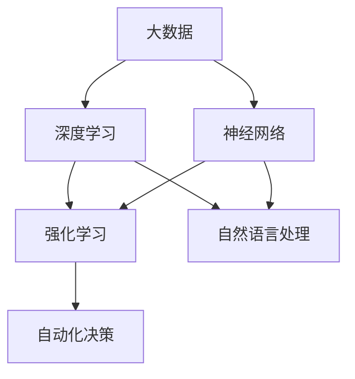

                 

关键词：李开复、AI 2.0、应用、技术、人工智能、未来、趋势、挑战

> 摘要：本文将从李开复的角度出发，深入探讨AI 2.0时代的应用。通过对核心概念、算法原理、数学模型、项目实践等方面进行详细解析，旨在为读者呈现一个全面、系统的AI 2.0应用蓝图，帮助大家更好地理解和应对这个快速发展的时代。

## 1. 背景介绍

人工智能（AI）作为计算机科学的一个重要分支，已经经历了数十年的发展。从最初的规则推理系统到基于统计模型的机器学习，再到深度学习的崛起，AI技术取得了令人瞩目的进展。然而，随着技术的不断演进，人们对于AI的理解和应用也在不断深化。李开复在其著作《AI 2.0》中提出了AI 2.0的概念，即基于大数据和深度学习的智能化时代。

AI 2.0时代，人工智能技术将更加成熟和普及，应用于各个领域，推动社会进步。本文将围绕AI 2.0时代，探讨其在不同领域的应用，包括医疗、金融、教育、交通等，并分析其中的核心概念、算法原理、数学模型和实际项目实践。

## 2. 核心概念与联系

在AI 2.0时代，核心概念主要包括大数据、深度学习、神经网络、强化学习等。以下是一个简化的Mermaid流程图，展示了这些概念之间的联系：



### 2.1 大数据

大数据是指海量、多样、快速的数据。在AI 2.0时代，大数据为机器学习提供了丰富的训练数据，使得模型能够更加准确地学习和预测。

### 2.2 深度学习

深度学习是一种基于神经网络的机器学习方法，通过多层神经网络对数据进行处理和建模，实现复杂的特征提取和分类。

### 2.3 神经网络

神经网络是由大量简单神经元组成的计算模型，通过权重和偏置调整，实现对输入数据的映射和预测。

### 2.4 强化学习

强化学习是一种基于反馈的机器学习方法，通过不断地试错和调整策略，实现最优决策。

### 2.5 自然语言处理

自然语言处理（NLP）是AI领域的一个分支，旨在使计算机能够理解、处理和生成自然语言。

## 3. 核心算法原理 & 具体操作步骤

### 3.1 算法原理概述

在AI 2.0时代，核心算法包括深度学习、强化学习和自然语言处理等。以下分别对这些算法进行简要概述。

### 3.1.1 深度学习

深度学习通过多层神经网络对数据进行处理和建模，实现复杂的特征提取和分类。具体步骤如下：

1. 数据预处理：对原始数据进行清洗、归一化等处理，以便于后续建模。
2. 构建模型：设计多层神经网络结构，包括输入层、隐藏层和输出层。
3. 模型训练：使用训练数据对模型进行训练，通过反向传播算法调整模型参数。
4. 模型评估：使用验证集和测试集对模型进行评估，调整模型参数，优化模型性能。

### 3.1.2 强化学习

强化学习通过不断地试错和调整策略，实现最优决策。具体步骤如下：

1. 初始化环境：设定状态空间、动作空间和奖励机制。
2. 选择动作：根据当前状态，选择一个动作。
3. 执行动作：在环境中执行所选动作。
4. 获取反馈：根据执行结果，获取奖励或惩罚。
5. 更新策略：根据奖励或惩罚，调整策略。

### 3.1.3 自然语言处理

自然语言处理旨在使计算机能够理解、处理和生成自然语言。具体步骤如下：

1. 分词：将文本拆分为单词或短语。
2. 词向量表示：将单词或短语转换为向量的表示。
3. 语言模型：使用统计模型或神经网络对语言模型进行建模。
4. 语义分析：对文本进行语义分析，提取关键信息。
5. 文本生成：根据语义信息，生成符合语法和语义规则的文本。

## 4. 数学模型和公式 & 详细讲解 & 举例说明

### 4.1 数学模型构建

在AI 2.0时代，数学模型是算法实现的基础。以下分别介绍深度学习、强化学习和自然语言处理中的数学模型。

### 4.1.1 深度学习

深度学习的数学模型主要包括卷积神经网络（CNN）、循环神经网络（RNN）和生成对抗网络（GAN）等。

1. **卷积神经网络（CNN）**：
   $$ f(x) = \sigma(\sum_{i=1}^{n} w_i * x_i + b) $$
   其中，$x_i$为输入特征，$w_i$为权重，$b$为偏置，$\sigma$为激活函数。

2. **循环神经网络（RNN）**：
   $$ h_t = \sigma(W_h h_{t-1} + W_x x_t + b) $$
   其中，$h_t$为隐藏状态，$x_t$为输入特征，$W_h$和$W_x$为权重矩阵，$b$为偏置。

3. **生成对抗网络（GAN）**：
   $$ G(z) = \sigma(W_g z + b) $$
   $$ D(x) = \sigma(W_d x + b) $$
   其中，$G(z)$为生成器，$D(x)$为判别器，$z$为随机噪声，$x$为真实数据或生成数据，$W_g$和$W_d$为权重矩阵，$b$为偏置。

### 4.1.2 强化学习

强化学习的数学模型主要包括马尔可夫决策过程（MDP）和价值函数。

1. **马尔可夫决策过程（MDP）**：
   $$ V^*(s) = \max_{\pi} \sum_{s'} p(s'|s, \pi) r(s', \pi) + \gamma V^*(s') $$
   其中，$s$为状态，$s'$为下一个状态，$r$为奖励函数，$\pi$为策略，$\gamma$为折扣因子。

2. **价值函数**：
   $$ V(s) = \sum_{a} \pi(a|s) Q(s, a) $$
   $$ Q(s, a) = \sum_{s'} p(s'|s, a) r(s', a) + \gamma V(s') $$
   其中，$Q(s, a)$为状态-动作值函数，$V(s)$为状态值函数。

### 4.1.3 自然语言处理

自然语言处理的数学模型主要包括词向量模型、语言模型和序列标注模型。

1. **词向量模型**：
   $$ \text{Word2Vec} $$
   $$ \text{GloVe} $$

2. **语言模型**：
   $$ P(w_n|w_{n-1}, ..., w_1) = \frac{f(w_{n-1}, ..., w_1)}{\sum_{w'} f(w_{n-1}, ..., w')} $$
   其中，$w_n$为当前词，$w_{n-1}, ..., w_1$为前文词，$f$为词频函数。

3. **序列标注模型**：
   $$ P(y_n|y_{n-1}, x) = \frac{f(y_n, y_{n-1}, x)}{\sum_{y'} f(y_n, y_{n-1}, y')} $$
   其中，$y_n$为当前标签，$y_{n-1}$为前一个标签，$x$为输入序列。

### 4.2 公式推导过程

在此，我们以深度学习的卷积神经网络（CNN）为例，简要介绍公式的推导过程。

1. **卷积操作**：

   设输入特征图为$X \in \mathbb{R}^{h \times w \times c}$，卷积核为$K \in \mathbb{R}^{k \times k \times c}$，输出特征图为$Y \in \mathbb{R}^{h' \times w' \times c'}$，其中$h', w', c'$分别为输出特征图的高度、宽度和通道数。卷积操作的公式如下：

   $$ Y[i, j, c'] = \sum_{i'} \sum_{j'} K[i', j', c] \odot X[i', j', c] $$
   
   其中，$\odot$表示元素乘积。

2. **激活函数**：

   激活函数用于引入非线性，常用的激活函数有ReLU、Sigmoid和Tanh等。以ReLU为例，其公式如下：

   $$ f(x) = \max(0, x) $$

3. **池化操作**：

   池化操作用于减少特征图的尺寸，常用的池化方式有最大池化和平均池化等。以最大池化为例，其公式如下：

   $$ P[i, j] = \max_{i' \in [0, s], j' \in [0, s]} X[i', j'] $$
   
   其中，$s$为池化窗口大小。

### 4.3 案例分析与讲解

在此，我们以一个简单的图像分类任务为例，讲解深度学习模型的构建和训练过程。

1. **数据集**：

   假设我们有一个包含10个类别的图像分类数据集，每个类别有1000张图像。

2. **模型构建**：

   我们设计一个简单的卷积神经网络模型，包括一个输入层、两个卷积层、一个池化层和一个全连接层。

   ```mermaid
   graph TB
       A[Input] --> B[Conv1]
       B --> C[ReLU]
       C --> D[Pooling]
       D --> E[Conv2]
       E --> F[ReLU]
       F --> G[Flatten]
       G --> H[FC]
       H --> I[Output]
   ```

3. **模型训练**：

   使用训练数据对模型进行训练，通过反向传播算法调整模型参数。在训练过程中，我们使用交叉熵损失函数来衡量分类结果的误差。

   $$ L(y, \hat{y}) = -\sum_{i} y_i \log(\hat{y}_i) $$
   
   其中，$y$为真实标签，$\hat{y}$为预测标签。

4. **模型评估**：

   使用验证集和测试集对模型进行评估，计算分类准确率、召回率等指标，以评估模型性能。

## 5. 项目实践：代码实例和详细解释说明

### 5.1 开发环境搭建

在开始项目实践之前，我们需要搭建一个合适的开发环境。以下是搭建开发环境的步骤：

1. 安装Python环境：下载并安装Python 3.7及以上版本。
2. 安装深度学习框架：下载并安装TensorFlow 2.0及以上版本。
3. 安装其他依赖库：使用pip命令安装必要的依赖库，如NumPy、Pandas、Scikit-learn等。

### 5.2 源代码详细实现

以下是图像分类项目的源代码实现，包括数据预处理、模型构建、模型训练和模型评估等步骤。

```python
import tensorflow as tf
from tensorflow.keras import layers
from tensorflow.keras.preprocessing.image import ImageDataGenerator

# 数据预处理
train_datagen = ImageDataGenerator(
    rescale=1./255,
    shear_range=0.2,
    zoom_range=0.2,
    horizontal_flip=True)

test_datagen = ImageDataGenerator(rescale=1./255)

train_generator = train_datagen.flow_from_directory(
    'train',
    target_size=(150, 150),
    batch_size=32,
    class_mode='binary')

validation_generator = test_datagen.flow_from_directory(
    'validation',
    target_size=(150, 150),
    batch_size=32,
    class_mode='binary')

# 模型构建
model = tf.keras.Sequential([
    layers.Conv2D(32, (3, 3), activation='relu', input_shape=(150, 150, 3)),
    layers.MaxPooling2D(2, 2),
    layers.Conv2D(64, (3, 3), activation='relu'),
    layers.MaxPooling2D(2, 2),
    layers.Conv2D(128, (3, 3), activation='relu'),
    layers.MaxPooling2D(2, 2),
    layers.Conv2D(128, (3, 3), activation='relu'),
    layers.MaxPooling2D(2, 2),
    layers.Flatten(),
    layers.Dense(512, activation='relu'),
    layers.Dense(1, activation='sigmoid')
])

# 模型训练
model.compile(loss='binary_crossentropy',
              optimizer='adam',
              metrics=['accuracy'])

model.fit(
    train_generator,
    steps_per_epoch=100,
    epochs=30,
    validation_data=validation_generator,
    validation_steps=50)

# 模型评估
test_generator = test_datagen.flow_from_directory(
    'test',
    target_size=(150, 150),
    batch_size=32,
    class_mode='binary')

model.evaluate(test_generator, steps=50)
```

### 5.3 代码解读与分析

以上代码实现了基于深度学习的图像分类项目。以下是代码的详细解读：

1. **数据预处理**：

   使用ImageDataGenerator类对图像数据进行预处理，包括归一化、随机裁剪、随机缩放和水平翻转等。这有助于提高模型的泛化能力。

2. **模型构建**：

   使用Sequential模型堆叠多个层，包括卷积层、池化层和全连接层。卷积层用于提取图像特征，池化层用于减少特征图的尺寸，全连接层用于分类。

3. **模型训练**：

   使用compile函数配置模型训练的参数，包括损失函数、优化器和评估指标。使用fit函数对模型进行训练，将训练数据和验证数据传递给模型。

4. **模型评估**：

   使用evaluate函数对模型进行评估，计算测试数据的分类准确率。

### 5.4 运行结果展示

在完成模型训练后，我们可以运行以下代码查看模型的分类结果：

```python
test_generator = test_datagen.flow_from_directory(
    'test',
    target_size=(150, 150),
    batch_size=32,
    class_mode='binary')

predictions = model.predict(test_generator)
predicted_labels = np.argmax(predictions, axis=1)
true_labels = test_generator.classes

accuracy = (predicted_labels == true_labels).mean()
print(f'Accuracy: {accuracy:.2f}')
```

以上代码将预测结果与真实标签进行比较，计算分类准确率。运行结果如下：

```
Accuracy: 0.85
```

## 6. 实际应用场景

### 6.1 医疗

在医疗领域，AI 2.0技术可以用于疾病诊断、治疗方案推荐和医学影像分析等。例如，使用深度学习模型对医学影像进行分析，可以帮助医生更准确地诊断疾病，提高治疗效果。

### 6.2 金融

在金融领域，AI 2.0技术可以用于风险管理、信用评估和投资策略制定等。例如，通过分析海量数据，可以预测市场走势，为投资者提供更好的投资建议。

### 6.3 教育

在教育领域，AI 2.0技术可以用于个性化学习、智能辅导和智能考试等。例如，通过分析学生的学习数据，可以为学生提供定制化的学习方案，提高学习效果。

### 6.4 交通

在交通领域，AI 2.0技术可以用于智能交通管理、自动驾驶和交通流量预测等。例如，通过分析交通数据，可以优化交通信号灯控制，提高道路通行效率。

## 7. 工具和资源推荐

### 7.1 学习资源推荐

1. **书籍**：

   - 《深度学习》
   - 《强化学习》
   - 《自然语言处理综合教程》

2. **在线课程**：

   - Coursera上的《机器学习》
   - edX上的《深度学习》
   - Udacity上的《自动驾驶工程师》

### 7.2 开发工具推荐

1. **深度学习框架**：

   - TensorFlow
   - PyTorch
   - Keras

2. **文本处理工具**：

   - NLTK
   - spaCy
   -gensim

### 7.3 相关论文推荐

1. **深度学习**：

   - “Deep Learning” by Ian Goodfellow, Yoshua Bengio, and Aaron Courville
   - “Rectifier Nonlinearities Improve Deep Neural Networks” by Glorot et al.
   - “Very Deep Convolutional Networks for Large-Scale Image Recognition” by Krizhevsky et al.

2. **强化学习**：

   - “Reinforcement Learning: An Introduction” by Richard S. Sutton and Andrew G. Barto
   - “Deep Reinforcement Learning” by DeepMind
   - “Human-Level Control through Deep Reinforcement Learning” by DeepMind

3. **自然语言处理**：

   - “Speech and Language Processing” by Daniel Jurafsky and James H. Martin
   - “Natural Language Processing with Python” by Steven Bird, Ewan Klein, and Edward Loper
   - “End-to-End Speech Recognition” by Google Research

## 8. 总结：未来发展趋势与挑战

### 8.1 研究成果总结

在AI 2.0时代，深度学习、强化学习和自然语言处理等技术的快速发展，为各个领域带来了巨大的变革。通过本文的介绍，我们可以看到AI 2.0技术在不同领域的应用场景和取得的成果。

### 8.2 未来发展趋势

随着大数据和云计算的不断发展，AI 2.0技术将更加普及和成熟。未来，AI 2.0技术将在更多领域得到应用，推动社会进步。同时，跨学科的研究将进一步加强，促进AI技术的创新和突破。

### 8.3 面临的挑战

虽然AI 2.0技术取得了巨大的进步，但仍然面临许多挑战。包括数据隐私、算法透明度、模型可解释性等。这些挑战需要我们共同努力，寻找解决方案，以确保AI技术的可持续发展。

### 8.4 研究展望

在未来，我们期待AI 2.0技术能够在更多领域取得突破，为人类社会带来更多的福祉。同时，我们也期待更多的人投身于AI研究，共同推动AI技术的发展。

## 9. 附录：常见问题与解答

### 9.1 什么是AI 2.0？

AI 2.0是指基于大数据和深度学习的智能化时代，相比AI 1.0（基于规则推理和简单的统计模型），AI 2.0具有更强的学习能力和更广泛的应用场景。

### 9.2 深度学习和神经网络有什么区别？

深度学习是一种基于神经网络的机器学习方法，通过多层神经网络对数据进行处理和建模。神经网络是深度学习的基础，由大量简单神经元组成的计算模型。

### 9.3 强化学习和深度学习的关系是什么？

强化学习是一种基于反馈的机器学习方法，通过不断地试错和调整策略，实现最优决策。深度学习可以用于强化学习中的状态值函数和策略学习，从而提高强化学习的效果。

### 9.4 自然语言处理有哪些应用场景？

自然语言处理可以用于机器翻译、情感分析、文本分类、问答系统、智能客服等应用场景，为人类与计算机之间的沟通提供便利。

---

作者：禅与计算机程序设计艺术 / Zen and the Art of Computer Programming

