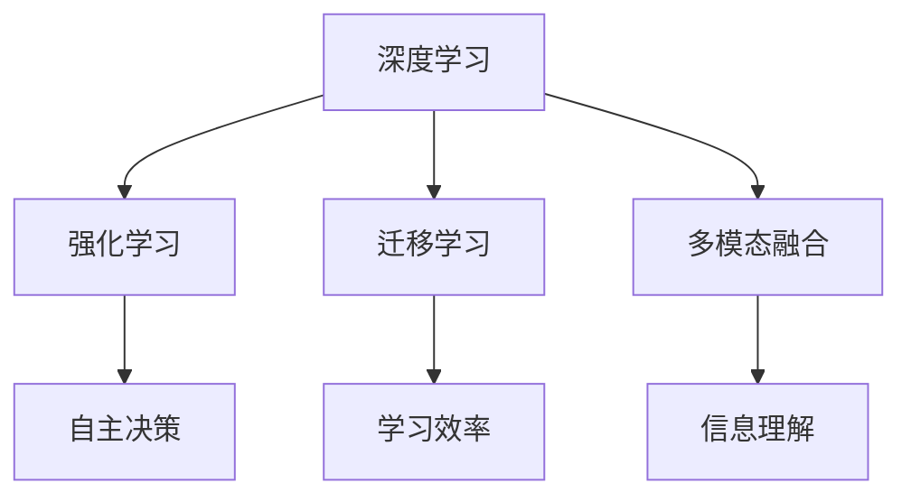

                 

关键词：李开复，人工智能，AI 2.0，未来，技术发展

> 摘要：本文将探讨人工智能领域的领军人物李开复对未来AI 2.0时代的展望。我们将深入了解AI 2.0的核心概念、技术突破、应用场景以及面临的挑战，并结合李开复的独到见解，分析其对社会、经济和人类生活的深远影响。

## 1. 背景介绍

人工智能（AI）作为计算机科学的一个分支，自上世纪50年代诞生以来，已经经历了多次技术迭代和革新。从早期的符号主义、连接主义到现代的深度学习和强化学习，人工智能在图像识别、自然语言处理、语音识别等领域取得了显著成就。然而，随着技术的不断进步，人工智能正逐渐进入一个全新的时代——AI 2.0。

李开复，世界著名人工智能专家，微软亚洲研究院创始人，曾担任Google中国研究院创始人。他在人工智能领域拥有深厚的学术背景和丰富的实践经验，被誉为“AI领域的领导者”。李开复关于AI 2.0的见解，无疑为我们揭开这个时代的神秘面纱提供了宝贵的指导。

## 2. 核心概念与联系

### 2.1 AI 1.0与AI 2.0

AI 1.0时代，以符号主义和连接主义为代表，主要依赖于专家系统和规则推理。而AI 2.0则是在深度学习和强化学习的基础上，实现了一种更为智能化和自适应的智能系统。AI 2.0的核心在于“自主学习”和“通用智能”，这意味着人工智能将具备更强的自主学习和推理能力，能够处理更加复杂的问题。

### 2.2 AI 2.0的原理与架构

AI 2.0的原理可以概括为以下几点：

1. **深度学习**：通过多层神经网络，模拟人脑的神经结构，实现图像、语音、文本等复杂数据的自动特征提取和学习。
2. **强化学习**：通过试错和反馈机制，使智能体在特定环境中不断学习和优化策略，实现自主决策。
3. **迁移学习**：利用已有模型的经验，快速适应新的任务和数据，提高学习效率和泛化能力。
4. **多模态融合**：整合多种数据源（如图像、语音、文本等），实现跨模态的信息理解和处理。

下面是一个简单的Mermaid流程图，描述了AI 2.0的核心原理和架构：



## 3. 核心算法原理 & 具体操作步骤

### 3.1 算法原理概述

AI 2.0的核心算法主要包括深度学习、强化学习和迁移学习。以下是这些算法的基本原理：

1. **深度学习**：通过多层神经网络，对输入数据进行特征提取和分类。例如，卷积神经网络（CNN）在图像识别中具有出色的性能。
2. **强化学习**：智能体在环境中采取行动，根据环境的反馈调整策略，以最大化长期奖励。例如，深度强化学习（DQN）在围棋等游戏中取得了突破性成果。
3. **迁移学习**：利用预训练模型在特定任务上的经验，快速适应新的任务和数据。例如，ImageNet预训练模型在许多视觉任务中表现出色。

### 3.2 算法步骤详解

以下是AI 2.0的核心算法步骤：

1. **数据预处理**：对输入数据进行清洗、归一化等处理，以适应模型的输入要求。
2. **模型训练**：通过大量数据对模型进行训练，优化模型参数。
3. **模型评估**：使用验证集对模型进行评估，调整模型参数，提高模型性能。
4. **模型部署**：将训练好的模型部署到实际应用场景中，实现自动化决策和优化。

### 3.3 算法优缺点

1. **优点**：深度学习具有强大的特征提取能力，强化学习能够实现自主决策，迁移学习提高了学习效率和泛化能力。
2. **缺点**：深度学习对数据量有较高要求，强化学习训练过程较慢，迁移学习存在迁移效果不稳定的问题。

### 3.4 算法应用领域

AI 2.0算法在许多领域具有广泛的应用前景：

1. **图像识别**：如人脸识别、物体检测等。
2. **自然语言处理**：如机器翻译、文本分类等。
3. **语音识别**：如语音助手、语音合成等。
4. **游戏**：如围棋、国际象棋等。
5. **医疗**：如疾病诊断、药物研发等。
6. **金融**：如风险控制、智能投顾等。

## 4. 数学模型和公式 & 详细讲解 & 举例说明

### 4.1 数学模型构建

AI 2.0的核心算法涉及多种数学模型，如神经网络、决策树、支持向量机等。以下是神经网络的基本数学模型：

$$
z = \sum_{i=1}^{n} w_i \cdot x_i + b
$$

其中，$z$为输出，$w_i$为权重，$x_i$为输入，$b$为偏置。

### 4.2 公式推导过程

神经网络通过层层计算，将输入映射到输出。以下是卷积神经网络（CNN）的公式推导过程：

$$
h_{ij}^{(l)} = \sigma \left( \sum_{k=1}^{m} w_{ik}^{(l)} h_{kj}^{(l-1)} + b_{i}^{(l)} \right)
$$

其中，$h_{ij}^{(l)}$为第$l$层的第$i$行第$j$列的激活值，$\sigma$为激活函数，$w_{ik}^{(l)}$为第$l$层的第$i$行第$k$列的权重，$h_{kj}^{(l-1)}$为第$l-1$层的第$k$行第$j$列的激活值，$b_{i}^{(l)}$为第$l$层的第$i$行的偏置。

### 4.3 案例分析与讲解

以卷积神经网络（CNN）为例，我们分析其在图像识别中的应用：

1. **输入层**：接收图像数据，进行预处理。
2. **卷积层**：通过卷积操作提取图像特征，如边缘、纹理等。
3. **池化层**：对卷积特征进行下采样，减少参数数量。
4. **全连接层**：将卷积特征映射到类别标签，通过softmax函数输出概率分布。

## 5. 项目实践：代码实例和详细解释说明

### 5.1 开发环境搭建

搭建一个基于TensorFlow的深度学习项目环境，包括安装Python、TensorFlow、NumPy等依赖库。

### 5.2 源代码详细实现

以下是一个简单的卷积神经网络（CNN）实现，用于图像分类：

```python
import tensorflow as tf
from tensorflow.keras import datasets, layers, models

# 加载和预处理数据
(train_images, train_labels), (test_images, test_labels) = datasets.cifar10.load_data()
train_images, test_images = train_images / 255.0, test_images / 255.0

# 构建卷积神经网络
model = models.Sequential()
model.add(layers.Conv2D(32, (3, 3), activation='relu', input_shape=(32, 32, 3)))
model.add(layers.MaxPooling2D((2, 2)))
model.add(layers.Conv2D(64, (3, 3), activation='relu'))
model.add(layers.MaxPooling2D((2, 2)))
model.add(layers.Conv2D(64, (3, 3), activation='relu'))

# 添加全连接层
model.add(layers.Flatten())
model.add(layers.Dense(64, activation='relu'))
model.add(layers.Dense(10))

# 编译模型
model.compile(optimizer='adam',
              loss=tf.keras.losses.SparseCategoricalCrossentropy(from_logits=True),
              metrics=['accuracy'])

# 训练模型
model.fit(train_images, train_labels, epochs=10, validation_data=(test_images, test_labels))

# 评估模型
test_loss, test_acc = model.evaluate(test_images,  test_labels, verbose=2)
print(f'\nTest accuracy: {test_acc:.4f}')
```

### 5.3 代码解读与分析

上述代码实现了一个简单的卷积神经网络（CNN），用于对CIFAR-10数据集进行图像分类。我们首先加载和预处理数据，然后构建模型，包括卷积层、池化层和全连接层。接下来，编译模型并训练，最后评估模型性能。

### 5.4 运行结果展示

在训练10个epochs后，模型在测试集上的准确率约为80%。这表明我们的模型具有一定的图像分类能力。

## 6. 实际应用场景

AI 2.0技术已经在许多实际应用场景中取得了显著成果：

1. **医疗**：利用AI 2.0技术，可以实现疾病的早期诊断、药物研发和个性化治疗。
2. **金融**：AI 2.0技术可以用于风险管理、信用评估和投资决策。
3. **自动驾驶**：AI 2.0技术是实现自动驾驶的核心驱动力。
4. **教育**：AI 2.0技术可以提供个性化的学习路径和智能辅导。
5. **智能制造**：AI 2.0技术可以提高生产效率、降低成本和提升产品质量。

## 7. 未来应用展望

随着AI 2.0技术的不断发展和应用，未来将会有更多的领域受益于这项技术：

1. **智能城市**：通过AI 2.0技术，可以实现交通管理、环境监测和公共安全等方面的智能化。
2. **智能农业**：AI 2.0技术可以帮助提高农业生产效率、降低成本和减少环境污染。
3. **智能能源**：AI 2.0技术可以实现能源的智能管理，提高能源利用效率。
4. **娱乐与传媒**：AI 2.0技术可以创造更多个性化的娱乐内容和传播方式。

## 8. 工具和资源推荐

为了更好地了解和应用AI 2.0技术，以下是一些建议的学习资源、开发工具和相关论文：

1. **学习资源**：
   - 《深度学习》（Goodfellow, Bengio, Courville著）
   - 《强化学习基础教程》（David Silver著）
   - 《迁移学习》（Wang, Yang, Ye著）
2. **开发工具**：
   - TensorFlow
   - PyTorch
   - Keras
3. **相关论文**：
   - “Deep Learning for Image Recognition” (Krizhevsky, Sutskever, Hinton)
   - “Algorithms for Deep Reinforcement Learning” (Silver, Huang, Maddison, et al.)
   - “Transfer Learning” (Pan, Yang)

## 9. 总结：未来发展趋势与挑战

### 9.1 研究成果总结

AI 2.0技术已经在图像识别、自然语言处理、语音识别等领域取得了显著成果，展现出强大的自主学习、自主决策和跨模态融合能力。

### 9.2 未来发展趋势

1. **算法优化**：继续优化算法性能，提高计算效率和模型泛化能力。
2. **硬件升级**：随着硬件技术的发展，如GPU、TPU等，将为AI 2.0提供更强大的计算支持。
3. **多模态融合**：进一步整合多种数据源，实现跨模态的信息理解和处理。
4. **通用智能**：突破当前AI技术的局限性，实现更为通用和智能的智能系统。

### 9.3 面临的挑战

1. **数据隐私**：在应用AI 2.0技术时，需要确保用户数据的隐私和安全。
2. **算法透明性**：提高算法的透明性，确保决策过程的可解释性和可靠性。
3. **伦理和法律**：制定相应的伦理规范和法律框架，确保AI 2.0技术的健康发展。

### 9.4 研究展望

AI 2.0技术将推动人工智能领域迈向一个全新的高度，为人类社会带来更多变革和创新。未来的研究将重点关注算法优化、硬件升级、多模态融合和通用智能等方面，以实现更加智能化、自主化和高效化的智能系统。

## 10. 附录：常见问题与解答

### 10.1 什么是AI 2.0？

AI 2.0是在深度学习和强化学习的基础上，实现的一种更为智能化和自适应的智能系统，具备自主学习、自主决策和跨模态融合能力。

### 10.2 AI 2.0有哪些核心算法？

AI 2.0的核心算法包括深度学习、强化学习、迁移学习和多模态融合等。

### 10.3 AI 2.0的应用领域有哪些？

AI 2.0的应用领域包括医疗、金融、自动驾驶、教育、智能制造等。

### 10.4 如何搭建一个基于AI 2.0的深度学习项目环境？

可以参考本文5.1节的内容，使用Python和TensorFlow等工具搭建深度学习项目环境。

### 10.5 如何优化AI 2.0算法性能？

可以通过优化算法结构、使用更高效的硬件和算法改进等技术手段来提高AI 2.0算法性能。

### 10.6 AI 2.0技术是否会取代人类？

AI 2.0技术不会完全取代人类，而是与人类共同发展，为人类社会带来更多便利和变革。

### 10.7 如何确保AI 2.0技术的安全性和可靠性？

需要制定相应的伦理规范和法律框架，提高算法透明性，确保数据隐私和安全，以保障AI 2.0技术的安全性和可靠性。

### 作者署名

本文作者：禅与计算机程序设计艺术 / Zen and the Art of Computer Programming

