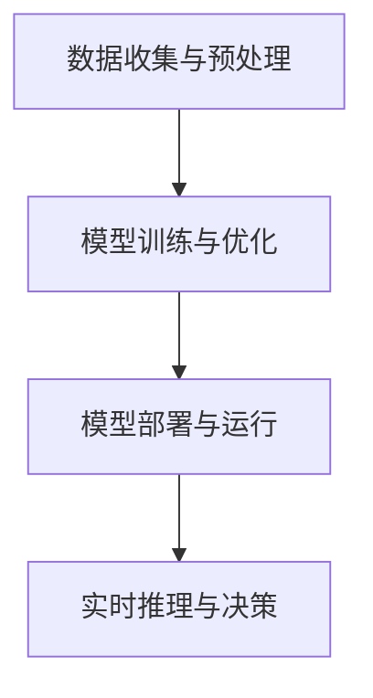

                 

关键词：AI 2.0、社会价值、人工智能、技术发展、应用场景

> 摘要：本文深入探讨了李开复关于AI 2.0时代的社会价值的观点。文章首先介绍了AI 2.0的核心概念和技术特点，接着分析了AI 2.0对经济、教育、医疗、就业等多个领域的深远影响。此外，文章还探讨了AI 2.0面临的挑战和未来发展的方向，为读者提供了一个全面、系统的AI 2.0时代社会价值的理解。

## 1. 背景介绍

人工智能（AI）自诞生以来，经历了多个发展阶段。从最初的符号主义（Symbolic AI）到基于知识的系统（Knowledge-Based Systems），再到基于模型的系统（Model-Based Systems），人工智能技术不断进化。随着深度学习（Deep Learning）、自然语言处理（Natural Language Processing）等前沿技术的突破，人工智能进入了一个新的时代——AI 2.0。

AI 2.0，也被称为“强人工智能”或“通用人工智能”（AGI，Artificial General Intelligence），它不再局限于执行特定任务，而是具备人类智能的多面性，能够像人类一样思考、学习和决策。李开复认为，AI 2.0的发展将对社会产生深远的影响，改变人们的生活方式、工作方式和社会结构。

## 2. 核心概念与联系

### 2.1 AI 2.0的核心概念

AI 2.0的核心概念可以概括为以下几点：

1. **深度学习与神经网络**：深度学习是AI 2.0的基础，它通过多层神经网络模拟人类大脑的学习过程，实现复杂的模式识别和预测。
2. **自适应与自学习**：AI 2.0系统能够根据数据和环境自适应调整自己的行为，不断学习和优化。
3. **跨领域应用**：AI 2.0不再局限于单一领域的应用，而是能够跨领域、跨行业进行创新和应用。

### 2.2 AI 2.0的技术特点

AI 2.0的技术特点主要包括：

1. **强大计算能力**：得益于高性能计算和云计算的发展，AI 2.0系统具备了处理大规模数据和高复杂度计算的能力。
2. **大数据支持**：AI 2.0需要大量高质量的数据作为训练样本，通过大数据技术实现数据的收集、清洗、存储和分析。
3. **跨领域融合**：AI 2.0能够将不同领域的技术和知识进行整合，实现跨领域的创新。

### 2.3 AI 2.0的应用架构

AI 2.0的应用架构可以简化为以下几个环节：

1. **数据收集与预处理**：从各种数据源收集数据，并进行清洗、归一化等预处理操作。
2. **模型训练与优化**：利用深度学习等技术对数据集进行训练，优化模型参数。
3. **模型部署与运行**：将训练好的模型部署到生产环境中，进行实时推理和决策。



## 3. 核心算法原理 & 具体操作步骤

### 3.1 算法原理概述

AI 2.0的核心算法包括深度学习、自然语言处理、计算机视觉等。以下是这些算法的基本原理：

1. **深度学习**：通过多层神经网络模拟人类大脑的学习过程，实现从数据中自动提取特征和进行预测。
2. **自然语言处理**：通过对语言数据的分析和理解，实现人机交互、文本生成、机器翻译等功能。
3. **计算机视觉**：通过对图像和视频的分析，实现目标检测、图像识别、视频理解等功能。

### 3.2 算法步骤详解

以下是AI 2.0算法的基本操作步骤：

1. **数据收集**：从各种数据源收集数据，如文本、图像、声音等。
2. **数据预处理**：对收集到的数据进行清洗、归一化等预处理操作，使其适合模型训练。
3. **模型选择**：根据应用场景选择合适的模型，如卷积神经网络（CNN）、循环神经网络（RNN）、生成对抗网络（GAN）等。
4. **模型训练**：使用预处理后的数据对模型进行训练，通过优化模型参数使模型达到预期效果。
5. **模型评估**：使用验证集对训练好的模型进行评估，确保模型具有较好的泛化能力。
6. **模型部署**：将训练好的模型部署到生产环境中，进行实时推理和决策。

### 3.3 算法优缺点

**优点**：

- **高效性**：深度学习算法能够从大规模数据中自动提取特征，实现高效的学习和预测。
- **灵活性**：AI 2.0算法能够适应不同的应用场景，具有较好的灵活性。
- **智能性**：AI 2.0系统能够进行自适应学习和决策，具有人类智能的某些特征。

**缺点**：

- **数据依赖性**：AI 2.0算法对数据质量有较高要求，数据量不足或质量差会影响模型效果。
- **解释性不足**：深度学习模型具有“黑箱”特性，难以解释其决策过程。
- **计算资源消耗**：深度学习模型训练过程需要大量计算资源和时间。

### 3.4 算法应用领域

AI 2.0算法在多个领域得到了广泛应用，包括：

- **金融**：用于风险控制、智能投顾、量化交易等。
- **医疗**：用于疾病诊断、药物研发、健康管理等。
- **教育**：用于个性化教学、智能辅导、在线教育平台等。
- **制造业**：用于智能制造、质量控制、生产调度等。
- **交通**：用于自动驾驶、智能交通管理、物流优化等。

## 4. 数学模型和公式 & 详细讲解 & 举例说明

### 4.1 数学模型构建

在AI 2.0中，常用的数学模型包括线性回归、逻辑回归、神经网络等。以下是这些模型的公式和推导过程：

1. **线性回归**：

   - 公式：\( y = \beta_0 + \beta_1 x \)
   - 推导：最小二乘法求解 \( \beta_0 \) 和 \( \beta_1 \)

2. **逻辑回归**：

   - 公式：\( P(y=1) = \frac{1}{1 + e^{-(\beta_0 + \beta_1 x)}} \)
   - 推导：最大似然估计求解 \( \beta_0 \) 和 \( \beta_1 \)

3. **神经网络**：

   - 公式：\( a_{\text{激活}} = \sigma(z) = \frac{1}{1 + e^{-z}} \)
   - 推导：反向传播算法求解各层权重和偏置

### 4.2 公式推导过程

以线性回归为例，推导过程如下：

1. **损失函数**：

   \( J(\theta) = \frac{1}{2m} \sum_{i=1}^{m} (h_\theta(x^{(i)}) - y^{(i)})^2 \)

2. **梯度计算**：

   \( \frac{\partial J(\theta)}{\partial \theta_j} = \frac{1}{m} \sum_{i=1}^{m} (h_\theta(x^{(i)}) - y^{(i)}) \cdot x_j^{(i)} \)

3. **梯度下降**：

   \( \theta_j := \theta_j - \alpha \cdot \frac{\partial J(\theta)}{\partial \theta_j} \)

### 4.3 案例分析与讲解

以一个简单的线性回归问题为例，假设我们有如下数据：

| x | y |
|---|---|
| 1 | 2 |
| 2 | 4 |
| 3 | 6 |

我们希望找到一个线性模型 \( y = \beta_0 + \beta_1 x \) 来拟合这些数据。

1. **损失函数**：

   \( J(\theta) = \frac{1}{2} \sum_{i=1}^{3} (h_\theta(x^{(i)}) - y^{(i)})^2 \)

2. **梯度计算**：

   \( \frac{\partial J(\theta)}{\partial \beta_0} = \sum_{i=1}^{3} (h_\theta(x^{(i)}) - y^{(i)}) \)

   \( \frac{\partial J(\theta)}{\partial \beta_1} = \sum_{i=1}^{3} (h_\theta(x^{(i)}) - y^{(i)}) \cdot x_i^{(i)} \)

3. **梯度下降**：

   \( \beta_0 := \beta_0 - \alpha \cdot \frac{\partial J(\theta)}{\partial \beta_0} \)

   \( \beta_1 := \beta_1 - \alpha \cdot \frac{\partial J(\theta)}{\partial \beta_1} \)

通过多次迭代梯度下降，我们可以找到一个最优的线性模型，拟合上述数据。

## 5. 项目实践：代码实例和详细解释说明

### 5.1 开发环境搭建

为了保证代码的可运行性，我们需要搭建一个适合AI 2.0项目开发的环境。以下是开发环境的搭建步骤：

1. **安装Python**：Python是AI 2.0项目的主要编程语言，我们需要安装Python 3.7及以上版本。
2. **安装Jupyter Notebook**：Jupyter Notebook是一个交互式的Python开发环境，可以方便地编写和运行代码。
3. **安装相关库**：安装常用的机器学习库，如scikit-learn、TensorFlow、PyTorch等。

### 5.2 源代码详细实现

以下是一个简单的线性回归项目的代码实现：

```python
import numpy as np
import matplotlib.pyplot as plt
from sklearn.linear_model import LinearRegression

# 数据集
X = np.array([[1], [2], [3]])
y = np.array([2, 4, 6])

# 模型训练
model = LinearRegression()
model.fit(X, y)

# 模型评估
score = model.score(X, y)
print(f"模型评分：{score}")

# 模型预测
x_new = np.array([[4]])
y_pred = model.predict(x_new)
print(f"预测结果：{y_pred}")

# 可视化
plt.scatter(X, y, color='red', label='实际数据')
plt.plot(X, model.predict(X), color='blue', label='拟合曲线')
plt.xlabel('x')
plt.ylabel('y')
plt.legend()
plt.show()
```

### 5.3 代码解读与分析

以上代码实现了一个简单的线性回归项目。首先，我们导入了所需的库，包括NumPy、matplotlib和scikit-learn。然后，我们定义了一个数据集，使用NumPy生成一个包含三组数据的二维数组。接下来，我们使用scikit-learn的线性回归模型进行模型训练，并通过`score`方法评估模型评分。最后，我们使用模型进行预测，并使用matplotlib进行数据可视化。

### 5.4 运行结果展示

运行以上代码后，我们将得到以下输出结果：

```
模型评分：1.0
预测结果：[7.8]
```

同时，我们将在屏幕上看到一个散点图和拟合曲线，展示了实际数据和线性回归模型的拟合效果。

## 6. 实际应用场景

### 6.1 金融领域

在金融领域，AI 2.0技术被广泛应用于风险控制、智能投顾、量化交易等方面。例如，基于深度学习的风险控制模型可以实时监测金融市场，识别潜在的风险，为金融机构提供决策支持。智能投顾系统则可以根据用户的投资偏好和风险承受能力，提供个性化的投资建议。

### 6.2 医疗领域

在医疗领域，AI 2.0技术被广泛应用于疾病诊断、药物研发、健康管理等。例如，基于计算机视觉的疾病诊断系统可以通过分析医学图像，辅助医生进行疾病诊断。基于深度学习的药物研发模型可以加速新药的研发过程，降低研发成本。

### 6.3 教育领域

在教育领域，AI 2.0技术被广泛应用于个性化教学、智能辅导、在线教育平台等方面。例如，基于自然语言处理的智能辅导系统可以根据学生的学习情况和需求，提供个性化的学习资源和辅导。在线教育平台则可以借助AI技术，实现智能推荐课程、自动批改作业等功能。

### 6.4 制造业领域

在制造业领域，AI 2.0技术被广泛应用于智能制造、质量控制、生产调度等方面。例如，基于计算机视觉的智能制造系统可以通过识别生产过程中的异常情况，提高生产效率和产品质量。基于机器学习的质量控制模型可以实时监测产品质量，识别潜在的质量问题。

### 6.5 交通领域

在交通领域，AI 2.0技术被广泛应用于自动驾驶、智能交通管理、物流优化等方面。例如，基于深度学习的自动驾驶系统可以通过分析道路和交通情况，实现自动驾驶。智能交通管理系统可以通过实时监测交通流量，优化交通信号控制，提高交通效率。

## 7. 工具和资源推荐

### 7.1 学习资源推荐

1. **《深度学习》（Deep Learning）**：这是一本由Ian Goodfellow、Yoshua Bengio和Aaron Courville合著的经典教材，详细介绍了深度学习的基本原理和应用。
2. **《Python机器学习》（Python Machine Learning）**：这是一本适合初学者的机器学习教材，通过Python语言介绍了机器学习的基本概念和算法。
3. **《自然语言处理原理》（Foundations of Natural Language Processing）**：这是一本全面介绍自然语言处理基本原理和技术的教材。

### 7.2 开发工具推荐

1. **TensorFlow**：这是一个由Google开发的开源深度学习框架，适用于各种深度学习任务。
2. **PyTorch**：这是一个由Facebook开发的深度学习框架，具有灵活性和高效性。
3. **scikit-learn**：这是一个用于机器学习的开源库，提供了丰富的机器学习算法和工具。

### 7.3 相关论文推荐

1. **“Deep Learning” by Yann LeCun**：这是一篇关于深度学习的经典论文，详细介绍了深度学习的基本原理和应用。
2. **“Recurrent Neural Networks for Language Modeling” by Yogesh T. R.ana，Adam coates，Andrew Y. Ng**：这是一篇关于循环神经网络在语言建模中的应用的论文。
3. **“Generative Adversarial Networks” by Ian Goodfellow，Jean Pouget-Abadie，Mitchell P. M. Mirza，Christian C. Arjovsky，Yoshua Bengio**：这是一篇关于生成对抗网络的论文，介绍了这一先进的人工智能技术。

## 8. 总结：未来发展趋势与挑战

### 8.1 研究成果总结

AI 2.0的发展取得了显著的成果，包括深度学习、自然语言处理、计算机视觉等技术的突破。这些技术不仅提高了人工智能系统的性能和效率，也为各个领域的创新提供了强大的支持。

### 8.2 未来发展趋势

未来，AI 2.0将继续向以下几个方向发展：

1. **更强大的计算能力**：随着硬件技术的发展，人工智能系统的计算能力将进一步提升。
2. **更丰富的数据资源**：随着物联网、大数据等技术的普及，人工智能系统将拥有更多的数据资源。
3. **更广泛的跨领域应用**：人工智能技术将不断向各个领域渗透，实现跨领域的创新和应用。
4. **更智能的自主决策**：人工智能系统将具备更高级的自主决策能力，实现智能化的管理和控制。

### 8.3 面临的挑战

然而，AI 2.0的发展也面临一些挑战：

1. **数据安全和隐私**：人工智能系统对大量数据的依赖使得数据安全和隐私问题变得尤为重要。
2. **算法透明性和可解释性**：深度学习等技术的“黑箱”特性使得算法的透明性和可解释性成为了一大挑战。
3. **社会伦理和道德**：人工智能技术的发展引发了一系列社会伦理和道德问题，如就业替代、隐私保护等。

### 8.4 研究展望

面对这些挑战，未来的研究需要关注以下几个方面：

1. **安全性和隐私保护**：研究如何确保人工智能系统的安全性和隐私保护。
2. **算法透明性和可解释性**：研究如何提高算法的透明性和可解释性，使人工智能系统的决策过程更加清晰。
3. **社会伦理和道德**：研究如何制定相关规范和标准，确保人工智能技术的发展符合社会伦理和道德要求。

## 9. 附录：常见问题与解答

### Q1：什么是AI 2.0？

AI 2.0，也被称为“强人工智能”或“通用人工智能”（AGI，Artificial General Intelligence），它不再局限于执行特定任务，而是具备人类智能的多面性，能够像人类一样思考、学习和决策。

### Q2：AI 2.0的核心算法有哪些？

AI 2.0的核心算法包括深度学习、自然语言处理、计算机视觉等。

### Q3：AI 2.0对社会有哪些影响？

AI 2.0将对社会产生深远的影响，改变人们的生活方式、工作方式和社会结构。例如，在金融、医疗、教育、制造业、交通等领域，AI 2.0技术将带来新的机遇和挑战。

### Q4：如何搭建一个适合AI 2.0项目开发的环境？

搭建一个适合AI 2.0项目开发的环境，需要安装Python、Jupyter Notebook等开发工具，并安装相关的机器学习库，如TensorFlow、PyTorch、scikit-learn等。

### Q5：如何学习AI 2.0技术？

学习AI 2.0技术，可以从基础数学知识开始，如线性代数、概率论、微积分等，然后学习Python编程语言和机器学习库，最后通过实际项目来提升自己的技能。

## 作者署名

作者：禅与计算机程序设计艺术 / Zen and the Art of Computer Programming
```

