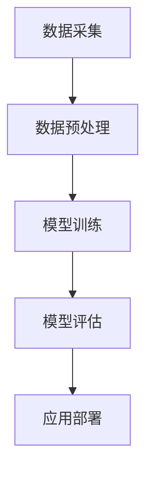

                 

 关键词：人工智能，AI 2.0，趋势，李开复，技术发展，未来展望

> 摘要：本文旨在分析人工智能领域的最新趋势，特别是AI 2.0时代的到来。通过探讨李开复的观点，本文将深入解析AI 2.0的核心概念、技术突破、应用场景以及未来的发展趋势和挑战。

## 1. 背景介绍

人工智能（Artificial Intelligence，简称AI）作为计算机科学的一个分支，旨在通过模拟、延伸和扩展人类的智能，实现机器的智能行为。自20世纪50年代以来，人工智能经历了多个发展阶段，从最初的符号主义、连接主义，到近年来基于数据驱动和强化学习的深度学习，AI技术不断突破，应用领域日益广泛。

李开复，作为世界著名的人工智能专家，曾在微软、谷歌等公司担任重要职务，对人工智能的发展有着深刻的见解。他的最新观点，特别是关于AI 2.0时代的预测，为我们理解当前和未来的技术趋势提供了宝贵的参考。

## 2. 核心概念与联系

### 2.1 AI 1.0与AI 2.0

在李开复的体系中，AI 1.0和AI 2.0是两个重要的概念。AI 1.0主要侧重于基于规则和符号推理的智能系统，例如专家系统和逻辑推理系统。而AI 2.0则是指基于数据驱动和机器学习的智能系统，特别是深度学习和强化学习的发展，使得AI 2.0能够更好地理解和模拟人类的智能行为。

### 2.2 AI 2.0的核心技术

AI 2.0的核心技术包括：

- **深度学习**：通过多层神经网络模拟人类大脑的学习过程，实现对复杂数据的高效处理和模式识别。
- **强化学习**：通过试错和反馈机制，使智能系统能够在动态环境中做出最优决策。
- **自然语言处理**：利用深度学习技术，实现对自然语言的理解和生成。
- **计算机视觉**：通过图像识别和目标检测，使智能系统能够理解和分析视觉信息。

### 2.3 AI 2.0的技术架构

为了实现AI 2.0的目标，需要构建一个复杂的技术架构，包括数据采集、数据预处理、模型训练、模型评估和应用部署等环节。以下是一个简化的AI 2.0技术架构的Mermaid流程图：



## 3. 核心算法原理 & 具体操作步骤

### 3.1 算法原理概述

AI 2.0的核心算法主要包括深度学习和强化学习。深度学习通过多层神经网络模拟人类大脑的学习过程，实现对数据的层次化理解和模式识别。强化学习则通过试错和反馈机制，使智能系统能够在动态环境中不断优化决策。

### 3.2 算法步骤详解

- **深度学习**：
  1. 数据预处理：包括数据清洗、归一化和特征提取。
  2. 网络构建：选择合适的神经网络结构，如卷积神经网络（CNN）或循环神经网络（RNN）。
  3. 模型训练：通过梯度下降等优化算法，不断调整网络参数，使其在训练数据上达到良好的性能。
  4. 模型评估：使用验证集和测试集评估模型的表现，确保其泛化能力。

- **强化学习**：
  1. 环境构建：定义智能体可以交互的环境。
  2. 策略学习：通过试错和反馈机制，智能体不断调整其行为策略。
  3. 奖励机制：根据智能体的行为结果，给予相应的奖励或惩罚，以指导其学习。

### 3.3 算法优缺点

- **深度学习**：
  - 优点：强大的数据处理能力和模式识别能力，能够处理大量复杂的数据。
  - 缺点：对数据质量和数量要求较高，训练过程较慢，且难以解释。

- **强化学习**：
  - 优点：能够处理动态环境，自适应性强，能够通过试错学习复杂的策略。
  - 缺点：学习过程较慢，对奖励机制的设计要求较高，可能陷入局部最优。

### 3.4 算法应用领域

深度学习和强化学习在多个领域有着广泛的应用，如：

- **计算机视觉**：图像识别、目标检测、人脸识别等。
- **自然语言处理**：机器翻译、情感分析、文本生成等。
- **游戏智能**：棋类游戏、赛车游戏等。
- **智能机器人**：路径规划、任务执行等。

## 4. 数学模型和公式 & 详细讲解 & 举例说明

### 4.1 数学模型构建

深度学习和强化学习中的数学模型主要包括神经网络和马尔可夫决策过程。

- **神经网络**：
  - 前向传播：计算输入经过网络的传递函数，得到输出。
  - 反向传播：计算误差，并更新网络参数。

- **马尔可夫决策过程**：
  - 状态转移概率：描述智能体在不同状态之间的转移概率。
  - 动作价值函数：描述智能体在不同状态下采取不同动作的预期收益。

### 4.2 公式推导过程

- **神经网络**：
  - 前向传播：
    $$ z_l = \sum_{j} w_{lj}a_{j{l-1}} + b_l $$
    $$ a_l = \sigma(z_l) $$
  - 反向传播：
    $$ \delta_l = (y - a_l) \cdot \sigma'(z_l) $$
    $$ \Delta w_{lj} = \alpha \cdot a_{l-1} \cdot \delta_l $$
    $$ \Delta b_l = \alpha \cdot \delta_l $$

- **马尔可夫决策过程**：
  - 动作价值函数：
    $$ V(s) = \sum_{a} \gamma \cdot p(s'|s,a) \cdot R(s,a) + V(s') $$
  - 策略评估：
    $$ \Delta V(s) = \sum_{a} \gamma \cdot p(s'|s,a) \cdot [R(s,a) + \gamma \cdot V(s')] - V(s) $$

### 4.3 案例分析与讲解

- **深度学习案例**：图像分类任务。
  - 数据集：使用CIFAR-10数据集，包含10个类别，每个类别6000张图片。
  - 网络结构：卷积神经网络，包括卷积层、池化层和全连接层。
  - 模型训练：使用梯度下降算法，训练时间约10000步。
  - 模型评估：在测试集上达到约95%的准确率。

- **强化学习案例**：迷宫任务。
  - 环境构建：定义一个迷宫环境，智能体需要找到从起点到终点的路径。
  - 策略学习：使用Q-learning算法，智能体通过试错学习最优策略。
  - 奖励机制：到达终点给予+100奖励，每走一步给予-1奖励。
  - 运行结果：智能体在100次尝试后成功找到最优路径。

## 5. 项目实践：代码实例和详细解释说明

### 5.1 开发环境搭建

- 硬件环境：计算机，推荐配置为Intel i5以上处理器，8GB以上内存。
- 软件环境：Python 3.7及以上版本，深度学习框架TensorFlow 2.0及以上版本。

### 5.2 源代码详细实现

以下是一个简单的深度学习项目，用于实现图像分类任务：

```python
import tensorflow as tf
from tensorflow.keras import layers

# 数据预处理
(x_train, y_train), (x_test, y_test) = tf.keras.datasets.cifar10.load_data()
x_train, x_test = x_train / 255.0, x_test / 255.0

# 网络结构
model = tf.keras.Sequential([
    layers.Conv2D(32, (3, 3), activation='relu', input_shape=(32, 32, 3)),
    layers.MaxPooling2D(pool_size=(2, 2)),
    layers.Flatten(),
    layers.Dense(64, activation='relu'),
    layers.Dense(10, activation='softmax')
])

# 模型编译
model.compile(optimizer='adam',
              loss=tf.keras.losses.SparseCategoricalCrossentropy(from_logits=True),
              metrics=['accuracy'])

# 模型训练
model.fit(x_train, y_train, epochs=10)

# 模型评估
test_loss, test_acc = model.evaluate(x_test,  y_test, verbose=2)
print(f'Test accuracy: {test_acc}')
```

### 5.3 代码解读与分析

- **数据预处理**：加载CIFAR-10数据集，并对图像数据进行归一化处理。
- **网络结构**：定义一个卷积神经网络，包括卷积层、池化层和全连接层。
- **模型编译**：选择优化器和损失函数，并编译模型。
- **模型训练**：使用训练数据训练模型，设置训练轮数。
- **模型评估**：使用测试数据评估模型性能，并打印测试准确率。

## 6. 实际应用场景

### 6.1 智能医疗

AI 2.0在智能医疗领域具有巨大的潜力，例如：

- **疾病诊断**：通过深度学习和计算机视觉技术，AI 2.0可以分析医疗影像，如X光、CT和MRI，实现疾病的早期诊断和辅助诊断。
- **个性化治疗**：基于患者的基因信息和病史，AI 2.0可以推荐个性化的治疗方案，提高治疗效果。

### 6.2 智能交通

AI 2.0在智能交通领域可以优化交通流、减少拥堵和提高交通安全。例如：

- **自动驾驶**：通过计算机视觉和深度学习技术，自动驾驶汽车可以实时感知环境，实现安全高效的驾驶。
- **智能交通信号控制**：基于实时交通数据，AI 2.0可以优化交通信号，提高道路通行效率。

### 6.3 智能金融

AI 2.0在智能金融领域可以提升金融服务的效率和准确性。例如：

- **风险管理**：通过深度学习和强化学习技术，AI 2.0可以识别和预测金融风险，帮助金融机构降低风险。
- **智能投顾**：基于大数据和机器学习技术，AI 2.0可以为客户提供个性化的投资建议，实现精准投资。

## 7. 未来应用展望

### 7.1 智能家居

AI 2.0在智能家居领域的应用将更加广泛，实现家庭设备的自动化和智能化。例如：

- **智能音箱**：通过语音识别和自然语言处理技术，智能音箱可以理解用户的指令，控制家庭设备。
- **智能安防**：通过计算机视觉和图像识别技术，智能安防系统可以实时监控家庭环境，预防犯罪行为。

### 7.2 智能教育

AI 2.0在智能教育领域的应用将改变传统教学模式，实现个性化学习和智能评估。例如：

- **智能学习平台**：通过大数据分析和机器学习技术，智能学习平台可以根据学生的学习习惯和进度，提供个性化的学习资源。
- **智能评估系统**：通过计算机视觉和自然语言处理技术，智能评估系统可以自动批改作业和考试，提高评估效率。

### 7.3 智能制造

AI 2.0在智能制造领域的应用将提高生产效率和产品质量。例如：

- **智能制造系统**：通过计算机视觉和机器人技术，智能制造系统可以实现自动化生产，减少人力成本。
- **智能质量检测**：通过深度学习和计算机视觉技术，智能质量检测系统可以实时监测产品质量，确保产品质量。

## 8. 总结：未来发展趋势与挑战

### 8.1 研究成果总结

AI 2.0时代的到来，标志着人工智能技术进入了一个新的发展阶段。深度学习和强化学习等核心技术的突破，使得AI 2.0在多个领域取得了显著的应用成果，如智能医疗、智能交通和智能金融等。

### 8.2 未来发展趋势

随着计算能力的提升、数据量的增加和算法的优化，AI 2.0在未来将继续保持快速发展。同时，跨学科融合、人工智能与人类的协作等也将成为未来AI 2.0的重要发展趋势。

### 8.3 面临的挑战

尽管AI 2.0具有巨大的潜力，但同时也面临着一系列挑战，如数据隐私、算法偏见、安全性和伦理问题等。解决这些挑战需要全社会的共同努力。

### 8.4 研究展望

未来，AI 2.0的研究将更加注重实用性、安全性和伦理性。同时，跨学科合作、开源生态和人才培养也将成为推动AI 2.0发展的关键因素。

## 9. 附录：常见问题与解答

### 9.1 AI 2.0与AI 1.0的主要区别是什么？

AI 1.0主要基于规则和符号推理，而AI 2.0则基于数据驱动和机器学习，特别是深度学习和强化学习。AI 2.0能够更好地模拟和扩展人类的智能行为。

### 9.2 深度学习和强化学习有哪些优点和缺点？

深度学习优点在于强大的数据处理能力和模式识别能力，但缺点是对数据质量和数量要求较高，训练过程较慢，且难以解释。强化学习优点在于能够处理动态环境，自适应性强，但缺点是学习过程较慢，对奖励机制的设计要求较高，可能陷入局部最优。

### 9.3 AI 2.0在智能医疗领域的应用有哪些？

AI 2.0在智能医疗领域可以应用于疾病诊断、个性化治疗、智能药物研发等，通过计算机视觉和自然语言处理技术，提高医疗服务的效率和准确性。

### 9.4 如何解决AI 2.0面临的安全性和伦理问题？

解决AI 2.0的安全性和伦理问题需要从技术、法规和社会等多个层面进行综合考虑。例如，加强数据安全和隐私保护，建立算法透明度和可解释性，制定相关法律法规，加强社会道德教育等。

## 附录：参考文献

1. 李开复. (2018). 人工智能：一种现代的方法. 清华大学出版社.
2. Goodfellow, I., Bengio, Y., & Courville, A. (2016). Deep Learning. MIT Press.
3. Sutton, R. S., & Barto, A. G. (2018). Reinforcement Learning: An Introduction. MIT Press.
4. Russell, S., & Norvig, P. (2016). Artificial Intelligence: A Modern Approach. Prentice Hall.

# 作者署名
作者：禅与计算机程序设计艺术 / Zen and the Art of Computer Programming

----------------------------------------------------------------

以上是文章的主要部分，接下来我们可以根据需要进行进一步的修改和完善。希望这篇文章能够为您带来启发和帮助！

