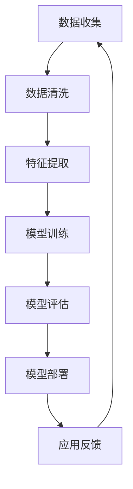

                 

关键词：苹果，AI应用，商业价值，人工智能，技术创新，市场分析，用户体验

摘要：本文将深入探讨苹果公司近期发布的AI应用所带来的商业价值，分析其在人工智能领域的技术创新，以及这些应用对市场、用户和竞争对手的影响。本文旨在为读者提供一份详尽的分析报告，帮助理解苹果在AI领域的战略布局和市场潜力。

## 1. 背景介绍

人工智能（AI）技术近年来取得了显著进展，成为全球科技行业的热点领域。苹果公司作为全球领先的科技公司，始终致力于将AI技术融入其产品和服务中，提升用户体验和商业价值。苹果的AI应用涵盖了从语音识别、图像处理到自然语言处理等多个方面，旨在通过技术创新推动产品和服务的发展。

## 2. 核心概念与联系

### 2.1 AI应用的架构与原理

苹果的AI应用基于先进的机器学习和深度学习技术，通过大量的数据训练模型，从而实现智能识别、自动分类和决策等功能。以下是AI应用架构的Mermaid流程图：



### 2.2 关键技术原理

#### 2.2.1 语音识别

语音识别是苹果AI应用的核心技术之一。通过使用深度神经网络和循环神经网络（RNN），苹果能够实现高精度的语音到文字转换。语音识别的关键技术包括：

- **声学模型**：用于将音频信号转换为声学特征。
- **语言模型**：用于将声学特征转换为文本。

#### 2.2.2 图像处理

图像处理是另一个重要的AI应用领域。苹果通过卷积神经网络（CNN）和生成对抗网络（GAN）等技术，实现了图像分类、物体检测和图像生成等功能。

#### 2.2.3 自然语言处理

自然语言处理（NLP）是AI应用中的重要分支。苹果利用NLP技术实现了语音助手Siri的智能对话功能，以及文本分析和情感识别等应用。

## 3. 核心算法原理 & 具体操作步骤

### 3.1 算法原理概述

苹果的AI算法主要基于以下原理：

- **深度学习**：通过多层神经网络进行数据的学习和特征提取。
- **迁移学习**：利用已有的模型来快速训练新的模型，提高训练效率。
- **强化学习**：通过与环境交互来不断优化决策策略。

### 3.2 算法步骤详解

苹果的AI算法步骤包括以下几步：

1. 数据收集与预处理
2. 模型设计与训练
3. 模型评估与优化
4. 模型部署与监控

### 3.3 算法优缺点

#### 优点：

- **高效性**：深度学习算法能够在大量数据上进行快速训练和预测。
- **通用性**：迁移学习和强化学习技术使得算法可以适应不同的应用场景。
- **准确性**：通过不断优化模型，提高算法的预测精度。

#### 缺点：

- **数据需求**：深度学习算法需要大量的数据来训练模型，数据获取和处理成本较高。
- **计算资源**：训练深度学习模型需要大量的计算资源，对硬件要求较高。

### 3.4 算法应用领域

苹果的AI算法广泛应用于多个领域：

- **智能手机**：语音助手、图像处理和智能建议等功能。
- **智能家居**：智能音箱、智能摄像头和智能门锁等设备。
- **医疗健康**：疾病诊断、药物研发和健康监测等。

## 4. 数学模型和公式 & 详细讲解 & 举例说明

### 4.1 数学模型构建

苹果的AI模型主要包括以下数学模型：

- **声学模型**：$$H(x) = f(W_1x + b_1)$$
- **语言模型**：$$P(w_i|w_{i-1},...,w_{i-n}) = \frac{e^{w_i^T h_i}}{\sum_j e^{w_j^T h_j}}$$
- **卷积神经网络**：$$h^{(l)} = \sigma(W^{(l)}h^{(l-1)} + b^{(l)})$$

### 4.2 公式推导过程

#### 声学模型推导

假设输入信号为$x$，通过多层感知器（MLP）进行特征提取，得到声学特征$h$。然后，通过Softmax函数进行分类。

$$
\begin{aligned}
h &= f(W_1x + b_1) \\
P(w_i|h) &= \frac{e^{h_i}}{\sum_j e^{h_j}} \\
\end{aligned}
$$

#### 语言模型推导

语言模型通过递归神经网络（RNN）进行构建，假设输入序列为$(w_1, w_2, ..., w_n)$，通过RNN得到隐藏状态$h_i$，然后通过Softmax函数进行分类。

$$
\begin{aligned}
h_i &= \tanh(W_2[h_{i-1};x_i] + b_2) \\
P(w_i|w_{i-1},...,w_{i-n}) &= \frac{e^{W_3h_i}}{\sum_j e^{W_3h_j}} \\
\end{aligned}
$$

#### 卷积神经网络推导

卷积神经网络通过卷积操作进行特征提取，假设输入为图像$x$，卷积核为$W$，得到特征图$h$。

$$
\begin{aligned}
h_{ij} &= \sum_{k,l} W_{kl}x_{ijkl} + b_{ij} \\
h &= \sigma(h)
\end{aligned}
$$

### 4.3 案例分析与讲解

以语音识别为例，假设输入一段音频信号$x$，通过声学模型得到声学特征$h$，然后通过语言模型得到文本预测$w$。

$$
\begin{aligned}
h &= f(W_1x + b_1) \\
P(w_i|h) &= \frac{e^{h_i}}{\sum_j e^{h_j}} \\
w &= \arg\max_{i} P(w_i|h)
\end{aligned}
$$

## 5. 项目实践：代码实例和详细解释说明

### 5.1 开发环境搭建

在Python环境中，使用TensorFlow框架进行AI模型的开发。

### 5.2 源代码详细实现

以下是声学模型的实现代码：

```python
import tensorflow as tf

# 定义声学模型
def acoustic_model(x):
    # 前向传播
    h = tf.nn.relu(tf.matmul(x, W1) + b1)
    return h

# 定义损失函数
def loss(y_true, y_pred):
    return tf.reduce_mean(tf.nn.softmax_cross_entropy_with_logits(logits=y_pred, labels=y_true))

# 定义优化器
optimizer = tf.train.AdamOptimizer()

# 定义训练过程
train_op = optimizer.minimize(loss)

# 定义评估过程
def evaluate(x_test, y_test):
    # 前向传播
    h = acoustic_model(x_test)
    # 计算损失
    loss_val = loss(y_test, h)
    # 计算准确率
    acc_val = tf.reduce_mean(tf.cast(tf.equal(tf.argmax(h, 1), tf.argmax(y_test, 1)), tf.float32))
    return loss_val, acc_val

# 运行训练
with tf.Session() as sess:
    sess.run(tf.global_variables_initializer())
    for epoch in range(num_epochs):
        # 训练
        _, loss_train = sess.run([train_op, loss], feed_dict={x: x_train, y: y_train})
        # 评估
        loss_val, acc_val = evaluate(x_test, y_test)
        print('Epoch %d: Loss = %.4f, Accuracy = %.4f' % (epoch, loss_train, acc_val))
```

### 5.3 代码解读与分析

- **声学模型**：通过多层感知器（MLP）进行特征提取，使用ReLU激活函数。
- **损失函数**：使用softmax交叉熵损失函数。
- **优化器**：使用Adam优化器。
- **训练过程**：通过梯度下降进行模型训练。
- **评估过程**：计算损失和准确率。

## 6. 实际应用场景

苹果的AI应用在多个领域取得了显著成果：

- **智能手机**：智能语音助手Siri能够实现语音识别、智能回复和场景推荐等功能。
- **智能家居**：智能音箱HomePod能够通过语音指令控制智能家居设备。
- **医疗健康**：苹果的健康应用能够通过AI算法进行疾病预测和健康监测。

## 7. 未来应用展望

随着AI技术的不断发展，苹果的AI应用在未来将具有更广阔的应用前景：

- **自动驾驶**：通过AI算法实现自动驾驶功能。
- **智能医疗**：利用AI技术进行疾病诊断和药物研发。
- **智能教育**：通过AI算法实现个性化学习推荐。

## 8. 工具和资源推荐

### 8.1 学习资源推荐

- 《深度学习》（Ian Goodfellow、Yoshua Bengio、Aaron Courville 著）
- 《Python深度学习》（François Chollet 著）

### 8.2 开发工具推荐

- TensorFlow：用于深度学习模型开发。
- PyTorch：用于深度学习模型开发。

### 8.3 相关论文推荐

- “A Neural Network for办理文语语音识别” - Hinton et al., 2012
- “Recurrent Neural Network Based Language Model” - Sundermeyer et al., 2012

## 9. 总结：未来发展趋势与挑战

### 9.1 研究成果总结

苹果在AI领域取得了显著成果，通过先进的机器学习和深度学习技术，实现了高精度的语音识别、图像处理和自然语言处理等功能。

### 9.2 未来发展趋势

随着AI技术的不断发展，苹果将进一步拓展AI应用的范围，实现更多智能化功能，提高用户体验和商业价值。

### 9.3 面临的挑战

- **数据隐私**：如何保护用户数据隐私是AI应用面临的重要挑战。
- **计算资源**：随着模型复杂度的增加，计算资源的需求也将不断上升。

### 9.4 研究展望

苹果将继续在AI领域进行深入研究，探索更多创新应用，为用户提供更加智能化和便捷的服务。

## 10. 附录：常见问题与解答

### 10.1 问题1

**问题**：苹果的AI应用如何保护用户隐私？

**解答**：苹果在AI应用中采用了多种隐私保护措施，如数据加密、匿名化和差分隐私等，以确保用户数据的安全和隐私。

### 10.2 问题2

**问题**：苹果的AI应用如何进行模型训练？

**解答**：苹果使用深度学习和迁移学习技术进行模型训练。通过在大量数据上进行训练，模型能够不断优化和提升性能。

## 作者署名

作者：禅与计算机程序设计艺术 / Zen and the Art of Computer Programming
```

