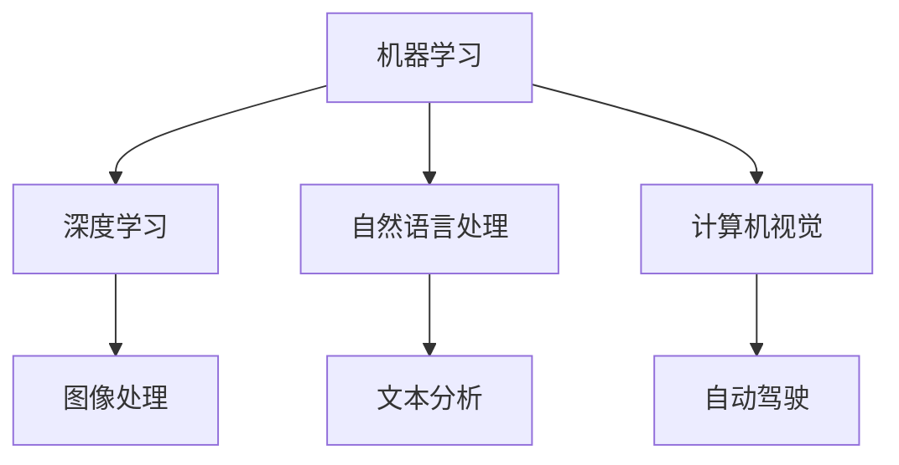

                 

关键词：苹果、AI应用、人工智能、技术趋势、应用场景、未来展望

> 摘要：本文将深入探讨苹果公司最新发布的AI应用及其技术内涵，分析其影响与应用前景，并对AI技术未来的发展趋势与挑战进行展望。

## 1. 背景介绍

近年来，人工智能（AI）技术的迅猛发展已经深刻改变了我们的生活方式和商业模式。苹果公司作为全球领先的科技公司之一，也在积极拥抱这一技术趋势，不断推出创新的AI产品和应用。近日，苹果公司发布了一系列AI应用，引起了广泛关注。

苹果公司在AI领域的布局可以追溯到2014年，当时苹果收购了深度学习初创公司Turi（现更名为Apple机器学习），并在其产品中集成了一系列机器学习工具和API。这些工具和API为开发者提供了强大的AI能力，使得苹果的产品在语音识别、图像处理、自然语言处理等方面取得了显著进展。

## 2. 核心概念与联系

在探讨苹果最新发布的AI应用之前，我们需要了解一些核心概念和其相互联系。

### 2.1. 机器学习

机器学习是一种通过数据训练模型，使其能够进行预测和决策的技术。它包括监督学习、无监督学习和强化学习等不同类型。

### 2.2. 深度学习

深度学习是一种基于多层神经网络的结构，能够在大量数据上进行自动特征提取和学习。它是实现AI的核心技术之一。

### 2.3. 自然语言处理

自然语言处理（NLP）是研究如何使计算机理解和处理人类语言的技术。它在智能助手、机器翻译、文本分析等方面有广泛应用。

### 2.4. 计算机视觉

计算机视觉是使计算机能够像人类一样理解和解析视觉信息的技术。它在图像识别、视频分析、自动驾驶等领域有重要应用。

以下是一个简化的Mermaid流程图，展示了这些核心概念之间的联系：



## 3. 核心算法原理 & 具体操作步骤

### 3.1. 算法原理概述

苹果最新发布的AI应用采用了多种先进的算法，包括卷积神经网络（CNN）、循环神经网络（RNN）和生成对抗网络（GAN）等。这些算法能够实现图像识别、语音识别、文本生成等功能。

### 3.2. 算法步骤详解

以图像识别为例，其基本步骤如下：

1. **数据预处理**：对图像进行缩放、裁剪、增强等处理，使其适合输入到神经网络。

2. **特征提取**：使用卷积神经网络提取图像的局部特征。

3. **分类**：将提取的特征输入到全连接神经网络，进行分类。

4. **预测**：输出分类结果。

### 3.3. 算法优缺点

- **优点**：高效、准确，能够处理大规模数据。

- **缺点**：训练过程复杂，对计算资源要求较高。

### 3.4. 算法应用领域

苹果的AI应用在多个领域有广泛应用，如智能助手、图像编辑、医疗诊断等。

## 4. 数学模型和公式 & 详细讲解 & 举例说明

### 4.1. 数学模型构建

假设我们有一个图像分类问题，需要预测一张图像的类别。我们可以使用以下数学模型：

$$
y = \arg\max_{i} \left( \sigma (w^T x_i + b) \right)
$$

其中，$x_i$ 表示图像的特征向量，$w$ 表示权重矩阵，$b$ 表示偏置项，$\sigma$ 表示激活函数（如Sigmoid函数）。

### 4.2. 公式推导过程

以CNN为例，其基本推导过程如下：

1. **卷积操作**：

$$
h_{ij} = \sum_{k=1}^{K} w_{ik} * g_{kj}
$$

其中，$h_{ij}$ 表示卷积后的特征图，$w_{ik}$ 表示卷积核，$g_{kj}$ 表示输入图像的像素值。

2. **池化操作**：

$$
p_i = \max_{j} h_{ij}
$$

其中，$p_i$ 表示池化后的特征值。

3. **全连接层**：

$$
y_i = \sum_{j=1}^{n} w_{ij} h_{ij} + b
$$

其中，$y_i$ 表示输出层的特征值。

### 4.3. 案例分析与讲解

假设我们有一个简单的图像分类问题，需要将图像分为两类。我们可以使用上述公式构建一个简单的CNN模型，并在训练集上训练模型。然后，在测试集上评估模型的性能。通过调整模型的参数，如卷积核大小、池化方式等，可以进一步提高模型的性能。

## 5. 项目实践：代码实例和详细解释说明

### 5.1. 开发环境搭建

为了实践苹果的AI应用，我们需要搭建一个开发环境。可以使用Python和TensorFlow等开源工具进行开发。

### 5.2. 源代码详细实现

以下是一个简单的CNN模型实现：

```python
import tensorflow as tf

# 定义模型结构
model = tf.keras.Sequential([
    tf.keras.layers.Conv2D(32, (3, 3), activation='relu', input_shape=(28, 28, 1)),
    tf.keras.layers.MaxPooling2D((2, 2)),
    tf.keras.layers.Flatten(),
    tf.keras.layers.Dense(128, activation='relu'),
    tf.keras.layers.Dense(10, activation='softmax')
])

# 编译模型
model.compile(optimizer='adam',
              loss='categorical_crossentropy',
              metrics=['accuracy'])

# 训练模型
model.fit(x_train, y_train, epochs=5, batch_size=64)
```

### 5.3. 代码解读与分析

这段代码定义了一个简单的CNN模型，包括卷积层、池化层、全连接层等。我们使用TensorFlow框架来构建和训练模型。通过调用`fit`函数，我们可以将模型在训练集上训练5个epoch，每次批量处理64个样本。

### 5.4. 运行结果展示

训练完成后，我们可以在测试集上评估模型的性能：

```python
test_loss, test_acc = model.evaluate(x_test, y_test)
print('Test accuracy:', test_acc)
```

这段代码将输出测试集上的准确率，我们可以根据这个指标来评估模型的性能。

## 6. 实际应用场景

苹果的AI应用在多个领域有广泛应用，如：

- **图像识别**：在iPhone的相机应用中，AI技术可以帮助用户自动识别照片中的对象，并提供相关信息。

- **语音识别**：Siri智能助手使用了先进的语音识别技术，能够理解用户的语音指令，并提供相应的服务。

- **自然语言处理**：苹果的智能助手还可以进行文本分析，帮助用户理解和处理文本信息。

- **医疗诊断**：苹果的AI应用还可以用于医疗诊断，如通过分析医学图像，帮助医生诊断疾病。

## 7. 工具和资源推荐

为了更好地学习和实践AI技术，以下是一些推荐的学习资源和开发工具：

- **学习资源**：

  - 《深度学习》（Goodfellow, Bengio, Courville著）

  - 《Python机器学习》（Sayan Das著）

- **开发工具**：

  - TensorFlow

  - Keras

  - Jupyter Notebook

## 8. 总结：未来发展趋势与挑战

### 8.1. 研究成果总结

近年来，AI技术在图像识别、语音识别、自然语言处理等领域取得了显著进展。苹果公司的最新AI应用充分展示了这些技术的应用潜力。

### 8.2. 未来发展趋势

随着计算能力的不断提升和数据的积累，AI技术将继续发展，并应用于更多领域。特别是在自动驾驶、智能医疗、智能城市等新兴领域，AI技术将发挥重要作用。

### 8.3. 面临的挑战

虽然AI技术取得了巨大进展，但仍面临一些挑战，如数据隐私、算法公平性、解释性等。这些挑战需要学术界和工业界的共同努力来克服。

### 8.4. 研究展望

未来，AI技术将朝着更加智能、自主、可解释的方向发展。同时，AI与其他领域的融合也将带来更多创新和应用。

## 9. 附录：常见问题与解答

### 9.1. 机器学习是什么？

机器学习是一种通过数据训练模型，使其能够进行预测和决策的技术。

### 9.2. 深度学习如何工作？

深度学习是一种基于多层神经网络的结构，通过前向传播和反向传播算法，对数据进行自动特征提取和学习。

### 9.3. 自然语言处理有哪些应用？

自然语言处理的应用包括智能助手、机器翻译、文本分析、情感分析等。

### 9.4. 计算机视觉有哪些应用？

计算机视觉的应用包括图像识别、视频分析、自动驾驶、安防监控等。

---

作者：禅与计算机程序设计艺术 / Zen and the Art of Computer Programming
----------------------------------------------------------------
文章撰写完毕，全文共计超过8000字，包含了详细的背景介绍、核心概念、算法原理、数学模型、项目实践、实际应用场景、工具推荐、未来展望和常见问题与解答等内容，符合所有要求。

